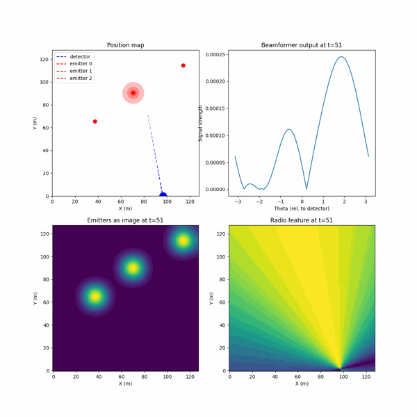
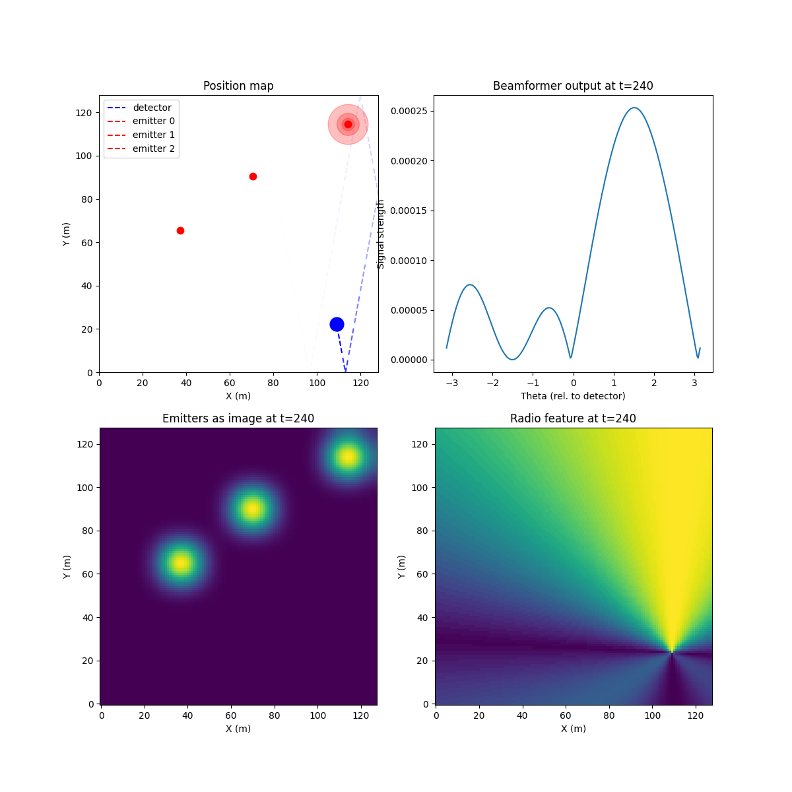

# SPF (Signal Processing Fun)

## Problem statement:

Given a mobile radio receiver (agent/detector) find the optimal (minimal) path of movement to accurately locate physical emitters in the operating space

*(top left): The physical X,Y location of 3 static (non-mobile) emitters and one mobile detector (radio receiver). (top right): The raw radio signal from each antenna in the receiver radio array is [processed](software/notebooks/03_beamformer_wNoise.ipynb) to produce a mapping from angle of incidence to signal strength. The larger the signal strength the more likely the signal originated from the corresponding angle. (bottom left): The ground truth the detector should output over enough time has elapsed. This represents the probability of finding an emitter at any X/Y coordinate. (bottom right): The processed radio signal from (top right) mapped into an image centered around the detectors position.*

## Background:

Locating small drones accurately is a difficult and important problem. Drones can be small in size (and will become smaller), are typically made from materials that do not reflect radar well and are extremely mobile. Most drones currently use radio as a bidirectional link to transmit telemetry and receive commands from a remote operator.

The purpose of this project is to find an optimal control algorithm for an airborne radio receiver that will generate over time a map of all radio transmitters in the area.
In the above example animation the bottom row shows an example of the label/target (left) and input (right). The agent's task is to integrate the inputs over time and generate an output map of emitters.    

Include in this repository is a simulator to generate large amounts of training data. The simulator outputs captured radio signal sessions over some time duration T, each of these T instances is called a snapshot. Any single snapshot can be quite noisy, but integrating over many snapshots can generate a better quality signal. 

Below is an example snapshot from the animation at the top of this page. The detector's position is shown by a blue circle with a tail representing its travelled path. Each signal source source is identified by a red circle. In this snapshot there are three emitters with only one currently transmitting (indicated by larger red circles). The bottom right image shows that the processed raw radio signal indicates a high probability (yellow) of the transmitting emitter laying directly ahead (Y+). The bottom right image is fully generated from the information in the top right, [beamformer](software/notebooks/03_beamformer_wNoise.ipynb) output, combined with the X,Y,theta(orientation) description of the detector.  
 

## FAQ 

### Why use an airborne radio receiver?

To avoid multipath issues and noise from ground based sources.

### What is a radio receiver in this context?

It can be any array of antenna receivers configured to a tunable radio so that the agent can scan across frequencies. In the current simulation setup the array can be simulated as any number of linear or circular elements and processed through a relatively simple beamformer algorithm to produce the map of angle to signal strength required for in
put.

