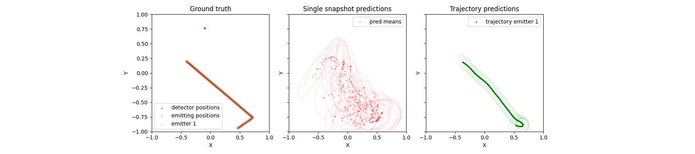

# 2D wall array (v1)

[see it in action!](https://www.youtube.com/shorts/2BFlrQI8Ydw)

Instead of simulations we can collect real world data by moving a emitter around in 2D space while keeping our receiver in a fixed location.

The measured phase difference by a fixed emitter at the base of the middle of the stairs. This was generated from real data using this notebook [link](/spf/notebooks/visualize_angle.ipynb)

## Youtube explanation

[Overview](https://www.youtube.com/watch?v=vj99KvB2AcA)

[Wall array v1](https://youtu.be/ljlRKGjBUoE)

## Construction 

Building a 2D apparatus like this can be difficult because each axis would require some kind of long lead screw. These can get diffcult to manage and costly if we exceed 1m. Instead of constructing the apparatus orthogonal to gravity we can leverage gravity to keep a suspended system taut.

We construct an appartus with our emitter attach by two arms (ArmA, ArmB) to motors on the wall (MotorA, MotorB). By operating MotorA/B we can change the length of the arms that exactly define the position of the emmitter on the wall (see [code](/spf/grbl/grbl_interactive.py)).

### 3D printed files

Thanks to great work by [@dammitcoetzee](https://github.com/dammitcoetzee) , we have 3D printable motor mounts designed on OnShape and STL files available.

[3D printable parts](https://www.dropbox.com/s/k0skzakxk3k02kv/2dwallarrayv1_3dparts.zip?dl=0)

### Bill of materials

* 2 x 27:1 Planetary Gearbox Nema 17 Stepper Motor  [link](https://www.amazon.com/gp/product/B00WAUKZWG)
* 1 x ARM 32-bit 4 Axis GRBL 1.1f [link](https://www.amazon.com/gp/product/B09SZDTBHS)
* ? x Timing Belt 2GT 10mm Width[link](https://www.amazon.com/gp/product/B07PGHTSLT)
* 2 x GT2 Pulley 20 Teeth 5mm Bore Fit 10mm Belt Width[link](https://www.amazon.com/gp/product/B09X18H75P)
* 1 x GT2 Idler Pulley 20 Teeth 5mm Bore 10mm Width[link](https://www.amazon.com/gp/product/B07BPKX47Y)
* 3 x 2.5lb weight [link](https://www.amazon.com/gp/product/B09NLFHMMH)
* M3 screws
* 2 x 3D printed motor mounts
* Pulley holder
* 2 x PlutoPlus SDR
* ? x 18/4 Awg cabling (for steppers) [link](https://www.amazon.com/gp/product/B01GZ50P7Q)
* 4 x bingfu 2.4ghz antenna [link](https://www.amazon.com/gp/product/B09J8N8TXW/)
* ? x SMA terminals [link](https://www.amazon.com/gp/product/B07G2PBZBL)
* ? x 12inch SMA Female -> Male [link](https://www.amazon.com/gp/product/B07MJQWH8S)

## Results

Ontop of this data several models were trained using TrajectoryNet. Sample command lines can be found towards the end of the file [here](commands).

127486 minibatch updates were perfomed to simultaneously train 4 versions of TrajectoryNet with varying number of layers (1,2,4,8). 

### Loss objectives

There were two loss objectives being optimized for
* Single snapshot prediction: Using a single radio measurement in time , predict the position of the emitter
* Trajectory prediction: Using multiple radio measurements over time , predict the full (including future) trajectory of the emitter

### Training

Left: Single snapshot loss. Center: Trajectory prediciton loss. 

Left: Ground truth, receiver is stationary, emitter is moving. Center: Single snapshot predictions. Right: Trajectory prediction

### Testing

Left: Single snapshot loss. Center: Trajectory prediciton loss. 

Left: Ground truth, receiver is stationary, emitter is moving. Center: Single snapshot predictions. Right: Trajectory prediction

### Equivalent simulated data

To see how well simulations perform relative to the above real data , equivalent experiments were performed.

### Training

Left: Single snapshot loss. Center: Trajectory prediciton loss. 

Left: Ground truth, receiver is stationary, emitter is moving. Center: Single snapshot predictions. Right: Trajectory prediction

### Testing

Left: Single snapshot loss. Center: Trajectory prediciton loss. 

Left: Ground truth, receiver is stationary, emitter is moving. Center: Single snapshot predictions. Right: Trajectory prediction

## Data

The data was collected using this [code](https://github.com/misko/spf/blob/3fd9fbcd7fd192fb53045ff7109e15664a48983b/software/grbl_sdr_collect.py#L42). The fulldata set has a couple hundred hours of recordings.

### Example usage

An example for how to use this data is shown [here](/spf/notebooks/load_real_data_session.ipynb).

### Format

The format is a flat file shaped as (N,5+65) float32 values. It is formatted this way to allow for quick loading via memmap. 

The values in each row are as follows,

0) time_stamp
1) x position
2) y position
3) average phase difference
4) average phase difference with trimmed mean
5) index 5~69 contains the signal strengths for each of 65 directions [-pi,+pi] computed using the beamformer

### Dataloader

An example data loader can be found [here](https://github.com/misko/spf/blob/0a19260e9d5acec31f8c16b43fd75d85143b6a02/spf/dataset/spf_dataset.py#L98)

### Download

The complete dataset can be downloaded [here](https://www.dropbox.com/scl/fi/fgppmh3q3t9m17ug4im1w/data_dec2023.zip?rlkey=j6eh34itxv2arj6ngn8imhw8v&dl=0)

A small subset of the data above can be downloaded [here](https://www.dropbox.com/scl/fi/qqk1277tmblj0z8r7p5xu/sample_data_dec2023.zip?rlkey=ck9zphdhyz6sco0do1gm01etj&dl=0)

