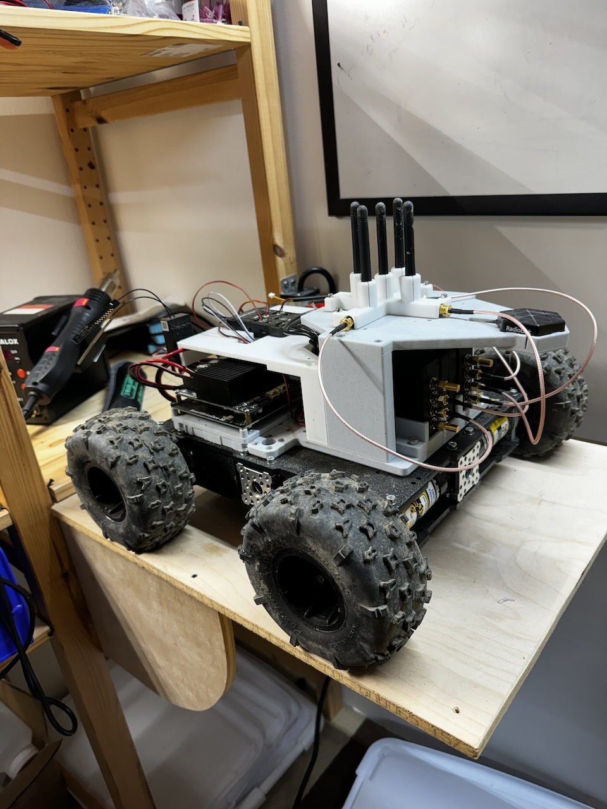
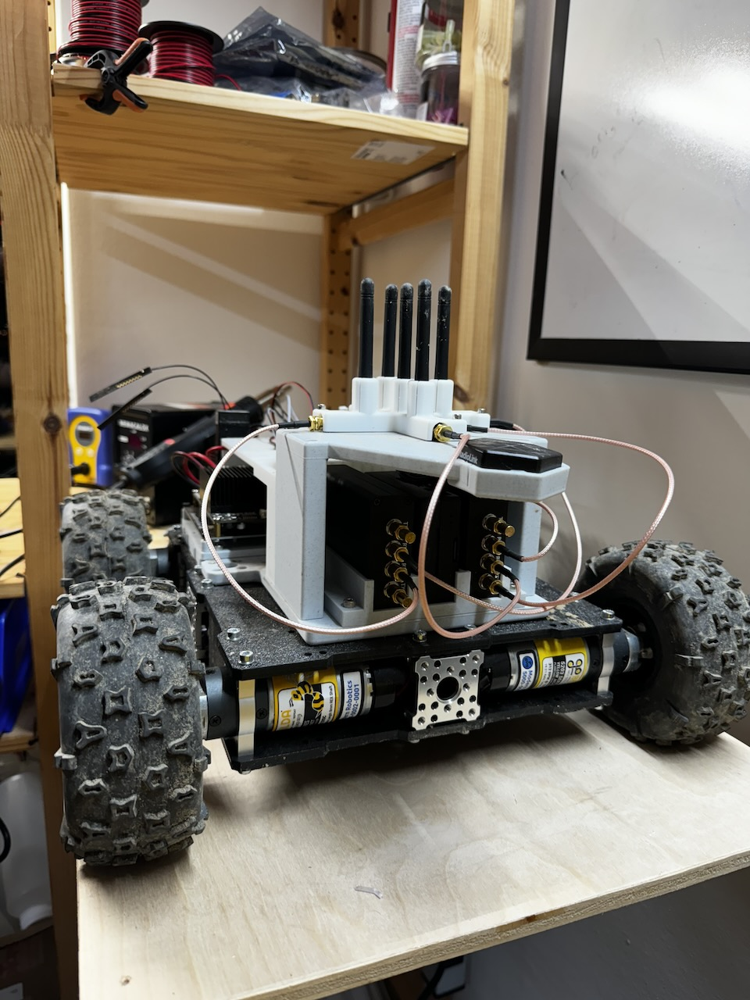
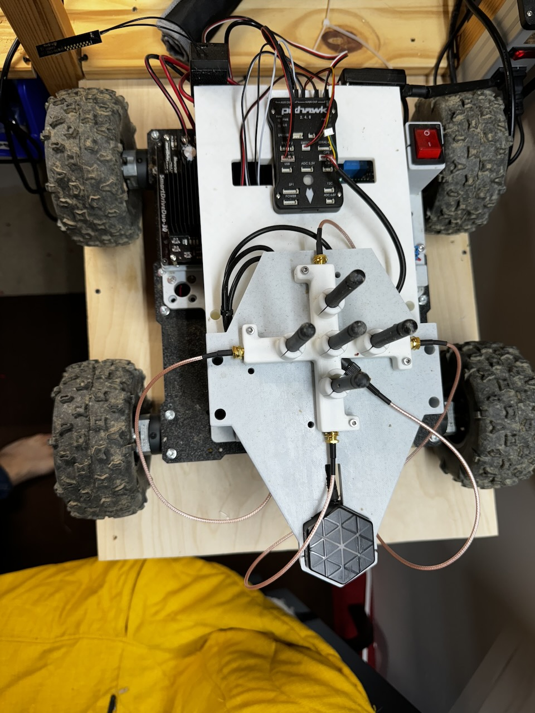
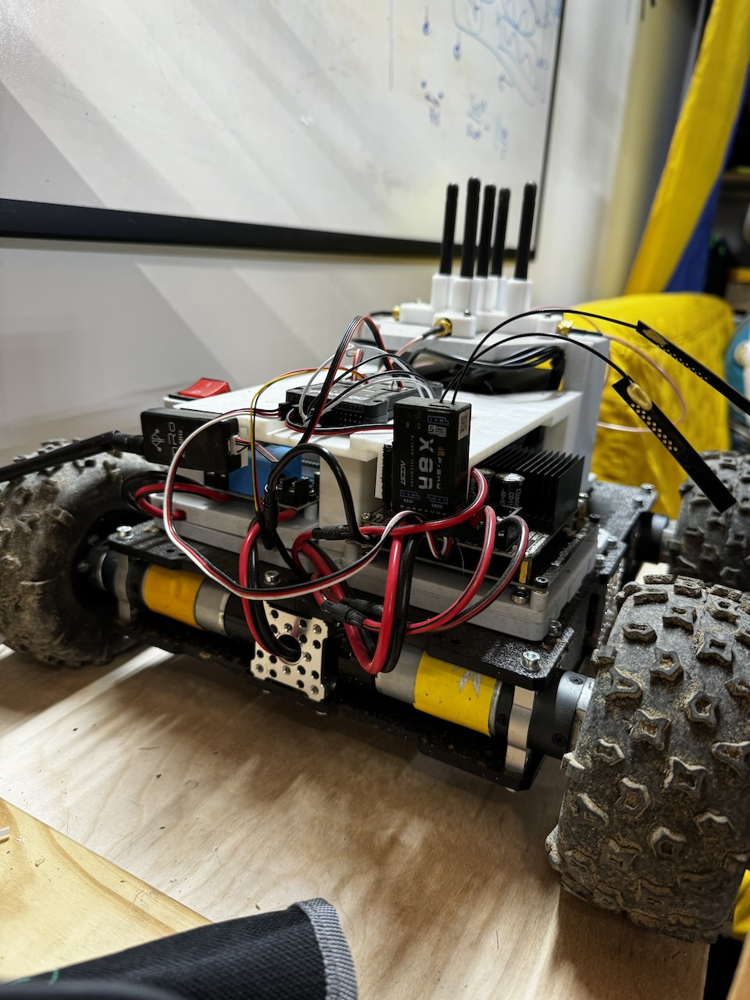

# 2D electric rover (v2)

Instead of simulations we can collect real world data by moving several rovers around autonomously in a field. Some rovers will transmit and others will listen and collect data.

## Construction

### 3D printed parts

See [here](https://www.dropbox.com/s/i8ecox14pmzpxqy/roverv2_3dparts.zip?dl=0)

## Missions

### Lab check

Lab check went great

[video](https://youtube.com/shorts/LMheF4LNvjc)

### Mission 1

Mission 1 was a series of missions, the rover drove through wet grass and rock terrain. Everything went great! Sometimes the rover would deviate from the trajectory, eventhough telemetery showed that it knew it was deviating.

[video](https://youtu.be/r2XLD8zYS0A)

## PDFs

[GoBilda recon](https://www.dropbox.com/scl/fi/ks1fxsgilpyjsh96b6yut/gobilda_recon_assembly.pdf?rlkey=jf0m082piixa4lvxsqi4eruph&dl=0)

[Low power disconnect](https://www.dropbox.com/scl/fi/wmjql1251xnxs90oqn2jd/lower_power_disconnect_30A.pdf?rlkey=h3vitle22f5xrkcthws3yf8ft&dl=0)

[Cytron Smart duo 30](https://www.dropbox.com/scl/fi/eeqg87gi8wzy2aa1k1yx3/MDDS30_User_Manual.pdf?rlkey=xe49gu88bpqspxbg2dh6x139w&dl=0)