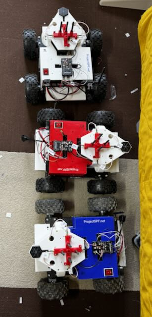
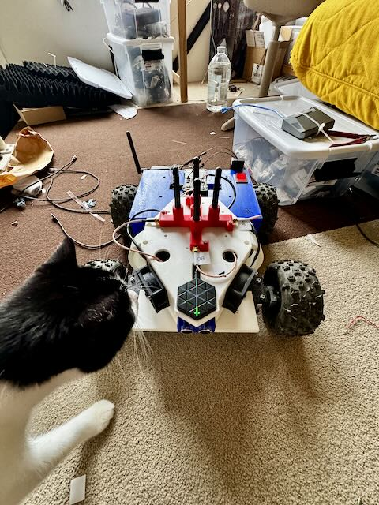
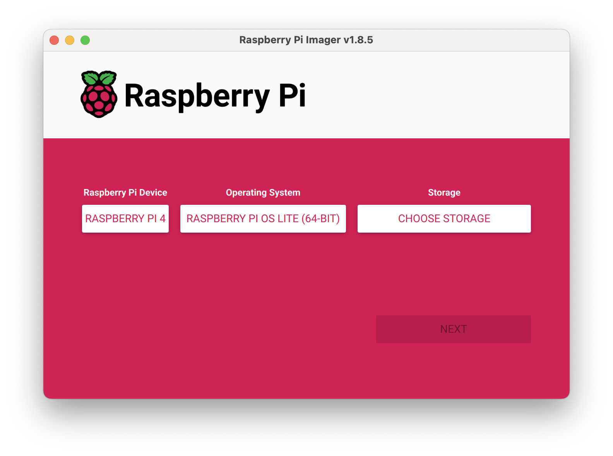
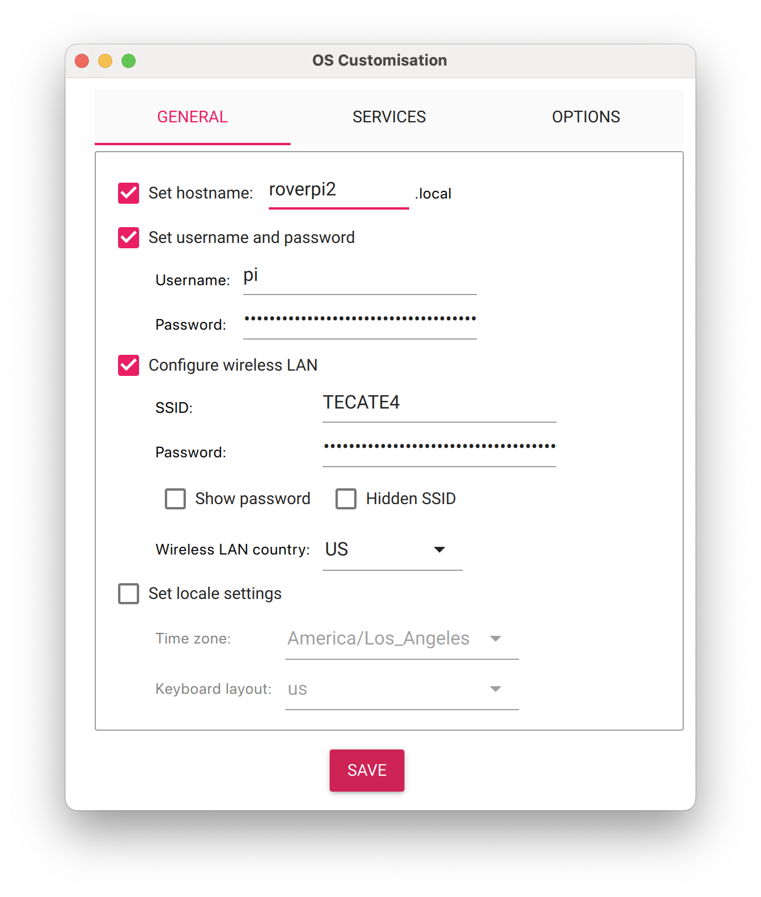

# 2D electric rover (v3.1)

Instead of simulations we can collect real world data by moving several rovers around autonomously in a field. Some rovers will transmit and others will listen and collect data.

## Operator documentation

- [Pre-field acceptance checklist](./PRE_FIELD_CHECKLIST.md) — mandatory
  release-level, per-Rover, real-radio Zarr, fake-drone, SITL, and restrained
  physical gates.
- [Full Rover operational runbook](./ROVER_RUNBOOK.md) — provisioning,
  operation, safety, troubleshooting, and recovery details.
- [Direct-USB gain/RSSI firmware runbook](../../../docs/direct_usb_gain_benchmark.md)
  — experimental RAM-boot firmware build, smoke, capture, validation, and
  rollback.
- [`load_direct_usb_firmware.sh`](./load_direct_usb_firmware.sh) — downloads
  the published checksum-pinned image, backs up the attached Pluto, performs a
  single-radio RAM boot, verifies it, and rolls back to QSPI.

## Design

Youtube [link](https://youtu.be/6D6IM0DY81c)

Youtube (mission) [link](https://youtu.be/8VCVYs3H9HY)





## Construction

### Antenna labels and physical alignment

Each radio drives a 2-element linear array; the elements are labelled by radio
letter + element index:

| Label | Radio | Element | Physical position |
|---|---|---|---|
| **A0** | A (USB2) | 0 | **starboard** |
| **A1** | A (USB2) | 1 | **port** |
| **B0** | B (USB1) | 0 | **bow** (forward) |
| **B1** | B (USB1) | 1 | **stern** (aft) |

So **array A lies athwartships** (starboard→port) and **array B lies fore-aft**
(bow→stern) — the two arrays are mounted 90° apart, which is exactly the
`theta-in-pis: 0` (radio A) / `theta-in-pis: 0.5` (radio B) pair in the capture
configs. Fusing the two differently-oriented arrays is what resolves the
front/back ambiguity of a 2-element array.

When cabling, element index = the Pluto RX channel (0 → RX1, 1 → RX2), so
A0/B0 go to RX1 and A1/B1 go to RX2 on their respective radio. Getting this
swapped flips the sign of the measured phase difference (an apparent mirror of
the bearing) without producing any obvious error at capture time — check it
against the labels above during the
[pre-field checklist](./PRE_FIELD_CHECKLIST.md) cabling step.

### GPS cable routing

Very sensitive to noise from pi + SDR , route it away from the inside!

### Flash rpi firmware






### Low power disconnect programming

```
press up to 5s +
press hold set 5s
use up down to set UP to 11.2v
press set
use up down to set DOWN to 11.1v
```

### Cytron Motor driver

Pins 3,4,6 set to high(1) rest to 0

MRB / MRA -> A motors
MLB / MLA -> B motors


### Battery compartment

Velcro include pictures


### USB port setup

```

USB  4     |     USB 3

USB  2   (Radio A)  |     USB 1 (Radio B)

Ethernet

```


### Ardupilot flash

Use mission planner windows
RPi script installs Arudpilot settings!

### PI setup

```
setup.sh
```

Get temperature

```
vcgencmd measure_temp
```

### Flash PlutoPlus

### SikRadio

[screen shot](./sikradio.jpg)
https://www.youtube.com/watch?v=i5lE2cWJJhM
Connect using mission planner
Set different NetIDs for each pair
Make sure to copy over settings
```
Rover 1 -> NetID 25
Rover 2 -> NetID 32
Rover 3 -> NetID 39
```

### Ardupilot calibration

Load base parameters

Accel calibration
Compass calibration
Change SYSID_THISMAV

Backup parameters


### Taranis Q setup

> **Superseded (2026-08-04) — the RF module and receiver below are no longer what flies.**
> The transmitter now runs the **R9M module in the external bay on ACCESS**, with an **R9 SX**
> receiver in each rover; internal XJT/D16 and the X8R are the original Jun-2024 link. The
> bind procedure in this section (F/S-button hold, red/green LED states) is the **ACCST/X8R**
> procedure and does **not** apply to an ACCESS R9 SX, which registers and binds from the
> module menu instead. Per-rover RxNums — Rover1 `01`, Rover2 `05`, Rover3 `00` — and the
> current bind state are in [`ROVER_RUNBOOK.md`](./ROVER_RUNBOOK.md) §3.5.1. The channel
> assignments further down this section are still broadly right, but §3.5.2 is authoritative.

```
Setup (Internal RF)
XJT D16
Ch Range CH1-16

Binding
(change receiver #) and have previous drones online to make sure we dont over bind the channel
With receiver off, hold down F/S button, power on while holding, let go 1 second later
Solid green/red -> no connection
Press bind on controller, beeping starts
Flashing green/red -> connection established
Reset receiver
Press ok on controller
Try moving around controller sticks to see X8R light go green


Input 1 -> 100 Rud
Input 2 -> 100 Ele
Input 3 -> 100 Thr
Input 4 -> 100 Alie

CH 1 -> 100 Ail
CH 2 -> 100 Ele
CH 3 -> 100 Thr
CH 4 -> 100 Rud
CH 5 -> 100 SF -> Arm [ Disarm, Arm ]
CH 6 -> 100 S2
CH 7 -> 100 SD
CH 8 -> 100 SA -> Flight mode [ Manual , Guided, RTL ]
CH 9 -> 100 SH -> Shutdown [ Momentary -> shutdown ]
CH 10 -> 100 SC -> Mag calibration [ Nothing, Mag cal, Nothing ]

```

> **Correction (2026-07-23):** with the boot-enforced ArduPilot params
> (`rover3_base_parameters.params`: `MODE_CH 8`, `MODE4=11` RTL, `MODE6=15` Guided),
> the SA flight-mode positions are **[ Manual, RTL, Guided ]** — Guided/RTL are swapped
> relative to the list above. The list above also omits CH7 (SD = reboot FC / kill
> collector) and CH12 (ultrasonic on/off), which the Pi consumes. Full current control
> map: [`ROVER_RUNBOOK.md`](./ROVER_RUNBOOK.md) §3.5 and `taranis_q_controls.png`.

To swap throttle from the left to the right , 

```

Originally set to
CH1 = Ail
CH2 = Ele
CH3 = Thr
CH4 = Rud

Go to MIXES on controller and set to 
CH1 = Rud
CH2 = Thr
CH3 = Ele
CH4 = Ail

```


### 3D printed parts

- [Versioned seven-antenna mount STLs](./3D_printed_parts/antenna_mount/README.md)
  — 47.5 mm and 51 mm antenna pitch-circle diameters, each with 0-degree and
  30-degree outer-ring rotations.
- [Parametric source and dimensional validation](../../3D_printing_design_files/antenna_mount.md)
  — regenerate the mounts or select a different spacing.
- [Legacy Rover v3 parts archive](https://www.dropbox.com/s/egpfn434aox6vvk/roverv3_3dparts.zip?dl=0)
  — pre-existing Rover v3 printable parts.

## Lab checks

Use the mandatory, current commands and pass/fail criteria in the
[pre-field acceptance checklist](./PRE_FIELD_CHECKLIST.md). The snippets below
are ad hoc diagnostics, not field-readiness evidence.

### SDR

Emit from an SDR

```
python sdr_controller.py --emitter-uri ip:192.168.1.15 --receiver-uri ip:192.168.1.17 --mode tx  --fc 2467000000
```

Receive frmo an SDR

```
python sdr_controller.py --receiver-uri usb:2.11.5 --mode rx --fc 2500000000 --rx-mode fast_attack
```

Use a fake drone and the current Rover 3 production configuration to receive
100 frames per configured physical radio:

```
/home/pi/spf-virtualenv/bin/python3 spf/mavlink_radio_collection.py \
  -c data_collection/rover/rover_v3.1/capture_configs/rover_receiver_config_pi_3mhz_43mm.yaml \
  -m ~/device_mapping -r center --fake-drone --no-ultrasonic -n 100
```

Rover 1 and Rover 2 use different production configs. Select them from the
per-Rover table in the checklist rather than reusing the Rover 3 example.

Use a fake drone and the emitter bench configuration to emit and receive:

```
/home/pi/spf-virtualenv/bin/python3 spf/mavlink_radio_collection.py \
  -c data_collection/rover/rover_v3.1/capture_configs/rover_emitter_config_pi_simulator.yaml \
  -m ~/device_mapping -r center --fake-drone --no-ultrasonic -n 100
```

For ArduPilot SITL, use the [MAVLink simulator instructions](../../../spf/mavlink/README.md)
and the release-level gate in the pre-field checklist.


## devpi mission control

```
#rover1
mavproxy.py --master /dev/serial/by-id/usb-FTDI_FT230X_Basic_UART_DK0G4IOK-if00-port0 

#rover2
mavproxy.py --master /dev/serial/by-id/usb-FTDI_FT230X_Basic_UART_DK0G4W25-if00-port0 

#rover3
mavproxy.py --master /dev/serial/by-id/usb-FTDI_FT230X_Basic_UART_DK0G5WCE-if00-port0
```

## Flash ESP32

```

arduino-cli core update-index

```

## debug
```
/home/pi/spf-virtualenv/bin/python3 ${repo_root}/spf/mavlink_radio_collection.py -c ${config} -m ~/device_mapping --fake-drone -r center -n 4000
```

## Missions

### Lab check


### Mission 1

## PDFs

[GoBilda recon](https://www.dropbox.com/scl/fi/ks1fxsgilpyjsh96b6yut/gobilda_recon_assembly.pdf?rlkey=jf0m082piixa4lvxsqi4eruph&dl=0)

[Low power disconnect](https://www.dropbox.com/scl/fi/wmjql1251xnxs90oqn2jd/lower_power_disconnect_30A.pdf?rlkey=h3vitle22f5xrkcthws3yf8ft&dl=0)

[Cytron Smart duo 30](https://www.dropbox.com/scl/fi/eeqg87gi8wzy2aa1k1yx3/MDDS30_User_Manual.pdf?rlkey=xe49gu88bpqspxbg2dh6x139w&dl=0)

[Fans](https://www.dropbox.com/s/b4bna0s1yyfwyqa/cooler_guys_fan.pdf?dl=0)
