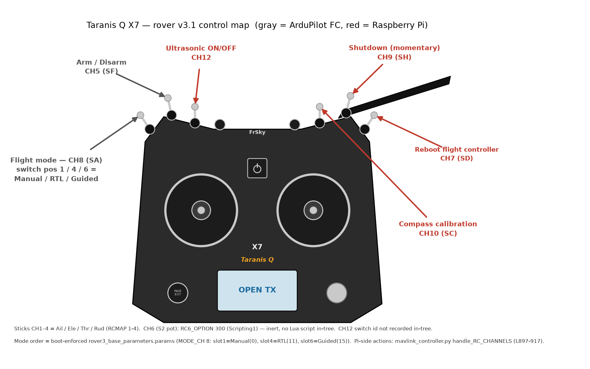

# SPF 2D Electric Rover — Operational Runbook (`ROVER_RUNBOOK.md`)

Data-collection platform: Raspberry Pi + ArduPilot flight controller (FMUv3) + PlutoSDR radios.
On-Rover repo root: `/home/pi/spf`. Active hardware generation: **rover v3.1**.

> Scope / provenance note: every command and fact below is traced to files in this repo. A handful of field-lore items (Pluto v0.38 brick, DFU jumper, faulty power switches, low-voltage cutoff thresholds, emitter-height tuning) are operational knowledge included at the maintainer's direction; where a detail is not directly verifiable in-tree it is flagged **[field note]**. Where the ground truth is genuinely ambiguous it is called out inline rather than guessed.

---

## Quick start — SITL bench test (sim on `.141` + real rover + QGC on the Mac)

Three MAVLink endpoints, one client each (`tcpin` is **single-client, first-come**): sim → **14592** collector · **14591** QGC · **14590** spare/scripted. Full detail in §6 and §16.

**1 — on the base station `192.168.1.141`** (wait for `Detected vehicle` before connecting anything):

```bash
docker run --rm -it -p 14590-14595:14590-14595 csmisko/ardupilotspf:latest /ardupilot/Tools/autotest/sim_vehicle.py -l 37.76509485,-122.40940127,0,0 -v rover -f rover-skid --out tcpin:0.0.0.0:14590 --out tcpin:0.0.0.0:14591 --out tcpin:0.0.0.0:14592 -S 1
```

**2 — on the rover** (stop the service first; it owns the FC serial and the radios):

```bash
sudo systemctl stop mavlink_controller.service
```

```bash
python spf/spf/mavlink_radio_collection.py -c spf/data_collection/rover/rover_v3.1/capture_configs/rover_receiver_config_pi_3mhz_35mm.yaml -m /home/pi/device_mapping -r  circle -t "RO1" -n 100 --drone-uri tcp:192.168.1.141:14592 --no-ultrasonic
```

**3 — on the Mac:** QGroundControl → Application Settings → Comm Links → **Add** → Type **TCP**, Server Address `192.168.1.141`, Port **14591** → Connect. (TCP links must be added by hand; QGC auto-connect is UDP-only.)

**4 — drive the handshake from QGC:** set mode **Manual**, then **Guided**. `run_planner` waits for MANUAL *first*, then GUIDED (§14.3); the Pi arms itself after GUIDED and the planner starts issuing waypoints. Port **14590** is left free for scripted commands (`mavlink_controller.py --ip 127.0.0.1 --port 14590 --proto tcp --mode guided`).

⚠ CI runs on `.141` too and its SITL tests bind 14590/14591 — check `docker ps` and `ss -tlnp | grep 1459` first.

### Test GPS coordinates per fence

Boundaries are hard-coded in `spf/gps/boundaries.py` as `(long, lat)` polygons; `boundary: auto` picks the nearest **centroid** (§14). Points below are verified by point-in-polygon; "outside" is 3 m beyond the nearest edge. Useful as SITL spawn (`-l <lat>,<lon>,0,0`) to test in-bounds vs out-of-bounds behaviour.

| Fence | Inside (lat, lon) | Just outside (lat, lon) |
|---|---|---|
| `franklin_safe` | `37.7652738, -122.4092914` | `37.7650712, -122.4098717` |
| `fort_baker_boundary` | `37.8352850, -122.4781192` | `37.8351705, -122.4781252` |
| `fort_baker_right_boundary` | `37.8357159, -122.4788198` | `37.8359233, -122.4790347` |
| `fort_baker_left_boundary` | `37.8351069, -122.4787865` | `37.8347338, -122.4785077` |

> ⚠ The three Fort Baker fences have centroids only **50–100 m apart**, so `boundary: auto` cannot reliably tell them apart — set `boundary:` explicitly there. Franklin is ~9.9 km away and resolves unambiguously.

---

## Table of contents

**Know the platform**

- [§1 Overview & platform map](#1-overview--platform-map) — rover generations, base station, RF/power topology, the two-process/two-port MAVLink model
- [§2 Network / IP map](#2-network--ip-map) — every address on the bench and field networks

**Provision & maintain a rover**

- [§3 One-time provisioning & flashing](#3-one-time-provisioning--flashing) — OS image · provisioner · Pluto firmware/DFU · ArduPilot flash · SiK NetIDs · [Taranis control map (§3.5)](#35-taranis-q-rc-channel-map-safety-critical) · calibration sequence
- [§4 Update flow](#4-update-flow-boot-time-self-update) — the boot-time git self-update and its 15 s interrupt window

**Operate in the field**

- [Pre-field acceptance checklist](./PRE_FIELD_CHECKLIST.md) — mandatory
  release-level and per-Rover sign-off, including a real-radio 100-frame Zarr,
  fake-drone, SITL, controls, and firmware/rollback checks
- [§5 Running a real field mission](#5-running-a-real-field-mission) — pre-flight order and the per-rover routine/config table
- [§15 Buzzer tones](#15-buzzer-tones--what-the-rover-is-telling-you-wav-renders) — what each chirp means, with WAV renders
- [§16 Connecting a ground station](#16-connecting-a-ground-station-qgc--mission-planner) — QGC / Mission Planner over SiK radio, tethered ethernet, or SITL
- [§9 Command cheat-sheet](#9-command-cheat-sheet) — copy-paste commands for every phase (flash → update → run → sim → GCS → data-ops)

**Test & develop**

- [§6 Simulated-rover testing (SITL)](#6-simulated-rover-testing-sitl--no-wheels-move-ardupilot-believes-it-is-driving) — the docker sim, exact launch and pytest commands, run-it-yourself recipe
- [§7 Test & gate ladder](#7-full-test--gate-ladder-before-launching-a-new-movement-pattern) — rungs (a)–(g), cheapest → most expensive, plus [which rungs run in CI and what has passed](#ci--which-rungs-run-automatically-and-what-has-actually-passed)
- [§8 Adding a NEW movement pattern](#8-adding-a-new-movement-pattern-routine) — planner-factory recipe and its validation path

**Safety & failure modes**

- [§10 Safety & known issues](#10-safety--known-issues) — controller safety catalog (MC/MP), arm/motion hazards, numbered KNOWN_ISSUES digest
- [§11 Troubleshooting](#11-troubleshooting) — stuck at waypoint, weak signal, bricked Pluto, wifi interference, spacing surgery, power gremlins

**Deep reference (verified reads)**

- [§12 Observed operator commands](#12-observed-on-device-operator-commands-from-piroverpi1-history) — what was actually typed on roverpi1: service control, zarr ops, where calibration really happens
- [§13 Boot / update / debug / production sequences](#13-boot--update--debug--production-sequences-detailed) — boot decision flowchart, the five sequences, verified gotchas
- [§14 Control flow](#14-control-flow--how-the-rc--arming--gpsekf--mode-drive-the-robot) — RC → FC → Pi pipeline, `drone_ready` gate, `run_planner` state machine, verified bugs

---

## 1. Overview & platform map

The rover is an ArduPilot-driven skid-steer ground vehicle that carries PlutoSDR radios and records RF + telemetry to `.zarr` datasets while it drives a geometric pattern inside a GPS boundary. The on-Pi entry point is `spf/mavlink_radio_collection.py`; motion is owned by the `Drone` class in `spf/mavlink/mavlink_controller.py`.

### Rover generations

| Generation | Status | Notes |
|---|---|---|
| rover v1 | **abandoned** | Superseded; not maintained. |
| rover v2 | **deprecated** | Superseded by v3.1. |
| **rover v3.1** | **active** | RPi (Pi4 or Pi5) + ArduPilot FMUv3 over MAVLink + 2x PlutoPlus SDR (rover 2 carries 1). All scripts under `data_collection/rover/rover_v3.1/`. Data format = **v4**. |
| rpi5_inference | real-time on-rover inference variant | Runs the NN/particle-filter inference path on the rover in real time. **Effectively a no-op end-to-end today** (KI#63: realtime consumer loop is commented out) and still carries live `breakpoint()`s and a heading `/720` bug — do **not** enable `--realtime` for a field mission without the realtime-review fixes (KI#55–#60). |

> The exact `rpi5_inference` directory/script names are not enumerated in the ground truth; treat the realtime path as `--realtime` + `--checkpoint`/`--checkpoint-config` on `mavlink_radio_collection.py`, gated off for normal collection.

### Base station

The **base station is the dev box at `192.168.1.141`**. In tethered/manual production mode the rover's collector dials the base station over MAVLink TCP via `--drone-uri tcp:192.168.1.141:14590` (`data_collection/rover/rover_v3.1/drone_run.sh:103`). The base station also runs the telemetry fan-out (`telem.sh`, a macOS script) and any ground-control station (Mission Planner / mavproxy).

### RF / power topology (from `data_collection/rover/rover_v3.1/make_schematic.py`)

- RF center **5.766 GHz**, sample rate **30 MS/s**, **3 MHz** bandwidth.
- Motor driver: **Cytron MDDS30**; buck regulators for the Pi/FC/radios.
- SiK telemetry NetIDs: Rover1=25, Rover2=32, Rover3=39.
- Pi4 USB mapping: **USB2 = Radio A, USB1 = Radio B**.

### Two-process, two-port MAVLink model

SITL/production expose two MAVLink TCP endpoints. Each `tcpin` endpoint is a **single-client TCP server** (first client owns it):

- **14590 = data collection** — `mavlink_radio_collection.py --drone-uri tcp:<host>:14590` (production convention).
- **14591 = ground control / commanding** — `mavlink_controller.py --ip <host> --port 14591 --proto tcp`, or Mission Planner / mavproxy.

> Nuance: the **pytest harness inverts this** — `tests/rover_config.yaml` sets `drone-uri: tcp:127.0.0.1:14591`, so under test the collector grabs 14591 and the guided-mode command is issued on 14590 (code comment: "other port is busy!"). The ports are functionally interchangeable; ownership is first-come.

---

## 2. Network / IP map

| Element | Address | Source |
|---|---|---|
| Rover N (eth0, static) | `192.168.1.(40+rover_id)` → **rover1 = .41, rover2 = .42, rover3 = .43** | `setup.sh` |
| Gateway | `192.168.1.1` | `setup.sh` (Pi4 + Pi5) |
| DNS | `8.8.8.8` | `setup.sh` |
| Wifi | **DISABLED** (`dtoverlay=disable-wifi`) | `setup.sh` |
| PlutoSDR (USB gadget) | `192.168.2.1` | `check_and_set_pluto.sh`, `ssh_config` |
| Pluto radios over IP (real-radio config) | `192.168.1.17` / `192.168.1.18` | `tests/test_config_realradio.yaml` |
| Base station (dev box) | `192.168.1.141` | `drone_run.sh:103` |
| Telemetry (base station, per rover) | mavproxy `roverX` → UDP `127.0.0.1:1457X` and `127.0.0.1:1458X` (rover1 → 14571/14581, rover2 → 14572/14582, rover3 → 14573/14583) | `telem.sh` |
| Collector drone-uri (tethered prod) | `tcp:192.168.1.141:1459x` (observed concrete value `tcp:192.168.1.141:14590`) | `drone_run.sh:103` |

**Caveat — reserve these IPs.** The rover static addresses `192.168.1.41/.42/.43` (and the base station `.141`) sit **inside the LAN's DHCP pool**. This has been observed to cause **IP squatting**: a DHCP client leases a rover's static address while it is off, and the rover then fails to come up or collides on the LAN. These addresses **must be reserved / excluded from the DHCP pool** on the router before a mission.

**Two board paths, one gateway discrepancy.** `interfaces_template` (Pi4 `/etc/network/interfaces` template) hardcodes `gateway 192.168.1.254`, but the script actually used (`setup.sh`) writes `gateway 192.168.1.1` for both Pi4 and Pi5. Trust `setup.sh` (`.1`); the template is stale.

---

## 3. One-time provisioning & flashing

Master script: `data_collection/rover/rover_v3.1/setup.sh <ROVER_ID>` (ID = `1|2|3`; fails with usage if not exactly one arg). It persists identity to `~/rover_id` and reboots into the mission service. Repo root on the Pi is hardcoded to `/home/pi/spf`, venv `~/spf-virtualenv`.

### 3.0 Flash the Raspberry Pi OS image

Flash a fresh Raspberry Pi OS image, boot, get a shell as user `pi`. (Pi4 and Pi5 are both supported; `setup.sh` contains **two mutually-exclusive board blocks that are NOT gated** — as written it runs both, editing both `/boot/config.txt` and `/boot/firmware/config.txt`, writing both `/etc/network/interfaces` and the systemd-networkd unit, and appending both `device_mapping` lines to `~/.bashrc`. **Comment out the wrong board's section by hand** before running.)

### 3.1 Run the provisioner

```bash
bash /home/pi/spf/data_collection/rover/rover_v3.1/setup.sh <ROVER_ID>
```

Internally, in order: persist rover id; clone; deps; venv; editable install; network; wifi off; udev; Pluto fw; ArduPilot fw; service + arduino-cli; reboot. Key steps traceable individually:

```bash
echo ${rover_id} > ~/rover_id
cd /home/pi && git clone https://github.com/misko/spf.git
bash /home/pi/spf/data_collection/rover/rover_v3.1/install_deps.sh   # apt: git screen libiio-dev libiio-utils vim python3-dev uhubctl libusb-dev libusb-1.0-0-dev sshpass
python -m venv ~/spf-virtualenv && source ~/spf-virtualenv/bin/activate
cd spf && pip install -e . && pip install RPi.GPIO
```

Network (Pi4 shown; the Pi5 systemd-networkd variant is in `setup.sh`):

```bash
# eth0 static = 192.168.1.(40+rover_id)/24, gw 192.168.1.1
cat > interfaces <<- EOM
source /etc/network/interfaces.d/*

auto eth0
iface eth0 inet static
    address 192.168.1.__ROVERID__/24
    gateway 192.168.1.1
EOM
sed -i "s/__ROVERID__/$(expr 40 + ${rover_id})/g" interfaces
sudo cp -f interfaces /etc/network/interfaces
```

```bash
# disable wifi (Pi4 path; Pi5 uses /boot/firmware/config.txt)
grep -v disable-wifi /boot/config.txt > /tmp/config.txt && sudo cp /tmp/config.txt /boot/config.txt
sudo sh -c 'echo dtoverlay=disable-wifi >> /boot/config.txt'
```

### 3.2 Pluto firmware / DFU

Production firmware = **plutosdr-fw-v0.37-dirty** (`setup.sh`), md5 `613fcdd4f45ad695d85abd53d1e0b918`, in a download-until-md5-matches loop, copied to the Pluto USB mass-storage mount and ejected to flash:

```bash
wget -O plutosdr-fw-v0.37-dirty.zip 'https://www.dropbox.com/s/4jji77rk3d9ikba/plutosdr-fw-v0.37-dirty.zip?dl=0'   # loop until md5sum == 613fcdd4f45ad695d85abd53d1e0b918
sudo mkdir -p /media/pluto
for mount in /dev/sda /dev/sdb; do
  [ -b "$mount" ] && sudo mount "${mount}1" /media/pluto && sudo cp plutosdr-fw-v0.37-dirty.zip /media/pluto && sudo eject ${mount}
done   # then poll `[ ! -b ${mount}1 ]` until the device re-enumerates
```

After the approved v0.37 package is installed, provision AD9361/2R2T once.
The dry-run is non-mutating; `--apply` backs up and addresses each Pluto by
serial/path before any persistent U-Boot write:

```bash
sudo /home/pi/spf/data_collection/rover/rover_v3.1/check_and_set_pluto.sh \
  --dry-run
sudo /home/pi/spf/data_collection/rover/rover_v3.1/check_and_set_pluto.sh \
  --apply
sudo /home/pi/spf/data_collection/rover/rover_v3.1/load_direct_usb_firmware.sh \
  check-config-all 2
```

Normal boots perform only the final read-only check; they never repair U-Boot.
That check validates the persistent `compatible=ad9361` and `mode=2r2t`
settings but does not gate on `/opt/VERSIONS`, because a Pi-only reboot can
leave a volatile RAM image running. The boot service then checksum-verifies and
RAM-loads the configured image on every boot, even when direct USB is already
present. The stock-QSPI version allowlist remains enforced by the separate
explicit provisioning path before it can write persistent U-Boot values.

**[field note] Do NOT persistently flash v0.38 — it bricks some PlutoPlus
units.** Keep production QSPI on **v0.37**. The experimental direct-USB
gain/RSSI image is a separate, volatile RAM-boot workflow:

```bash
cd /home/pi/spf
data_collection/rover/rover_v3.1/load_direct_usb_firmware.sh download
sudo data_collection/rover/rover_v3.1/load_direct_usb_firmware.sh \
  check-config-all 2
sudo data_collection/rover/rover_v3.1/load_direct_usb_firmware.sh load-all 2
```

The multi-radio path accepts only the published SHA-256-pinned image, requires
the exact expected radio count, selects each attached Pluto by serial and
physical path, saves its current version/environment, and never writes QSPI.
Use `verify-all 2` before a Rover 1/3 capture and `rollback-all 2` (or a full
power cycle) to return to v0.37. Single-radio commands remain available for
isolated development. Full pass/fail criteria are in
[`PRE_FIELD_CHECKLIST.md`](./PRE_FIELD_CHECKLIST.md).

If a Pluto is bricked or won't mount, recover via **DFU**: move the boot jumper
from **URST to MIO52** (the DFU position) and re-flash v0.37, then restore the
jumper. The SSH secret `analog` is in plaintext and host-key checking is
disabled for `192.168.2.*` (`ssh_config`) — expected, but note it.

### 3.3 ArduPilot flight controller — Rover 4.5.0 fmuv3

`flash_ardupilot.sh` (also inlined in `setup.sh`) stops the service and flashes **Rover stable-4.5.0 fmuv3** via ArduPilot's `uploader.py`:

```bash
sudo systemctl stop mavlink_controller.service; sleep 5
wget https://raw.githubusercontent.com/ArduPilot/ardupilot/master/Tools/scripts/uploader.py
wget https://firmware.ardupilot.org/Rover/stable-4.5.0/fmuv3/ardurover.apj
python uploader.py ardurover.apj | tee > ardurover_flash.log; sleep 5
```

> Note the SITL Docker image builds a **different** firmware version (Rover-4.5.7); production hardware is **4.5.0**. The one-time ArduPilot param-reset (FORMAT_VERSION 0) step is commented out in `setup.sh` with a note that it must be done by hand a few times after flashing.

### 3.4 SikRadio NetIDs (unique per rover pair)

`data_collection/rover/rover_v3.1/README.md`: **Rover1 = 25, Rover2 = 32, Rover3 = 39.** Non-unique NetIDs cause link/state cross-talk.

### 3.5 Taranis Q RC channel map (safety-critical)



*(Generated by `make_taranis_map.py`. A photo version of this map lives in the "Taranis Q controller" Slides deck linked from `project_spf.pdf` p.57 — not stored in-tree.)*

| Control | Channel (switch) | Function | Consumed by |
|---|---|---|---|
| Sticks | CH1–4 (RCMAP 1-4) | Ail / Ele / Thr / Rud | FC |
| Arm | **CH5 (SF)** | Arm / Disarm (`RC5_OPTION 153`) | FC |
| — | CH6 (S2 pot) | `RC6_OPTION 300` (Scripting1) — **inert**, no Lua script in-tree | FC (no-op) |
| Reboot FC | **CH7 (SD)** | >1500 force-reboot FC; 1000–1500 soft reboot **+ kills the collector** (`sys.exit(1)`) | Pi |
| Flight mode | **CH8 (SA)** | 3-pos → MODE slots 1/4/6 = **Manual(0) / RTL(11) / Guided(15)** | FC (`MODE_CH 8`) |
| Shutdown | **CH9 (SH)** | momentary → `sudo shutdown 0` (powers off the Pi; MC-1: no debounce) | Pi |
| Mag cal | **CH10 (SC)** | start compass/mag calibration | Pi |
| Ultrasonic | **CH12** (switch id not recorded in-tree) | >1000 disable / ≤1000 enable obstacle stop | Pi |

> ⚠ **CH8 mode order.** The order above — **Manual / RTL / Guided** — is what the boot-enforced `rover3_base_parameters.params` sets (`MODE4=11`, `MODE6=15`) and what the operator field guide shows. The README's older "[Manual, Guided, RTL]" and the Jun-2024 `rover3_idX_parameters.params` dumps (`MODE4=15`, `MODE6=11`) have Guided/RTL **swapped**, and `spf/ardupilot/ardupilot_setup.md` predates both (`MODE4=10` = Auto). Since the boot param gate is non-fatal (§13.4), verify on the bench after any FC/param change: flip SA to mid and confirm the mode reads **RTL** (not Guided) before trusting the switch in the field.

> The in-code RC handler `handle_RC_CHANNELS` reads raw channels 7/9/10/12: ch9>1500 → `sudo shutdown 0`; ch7>1500 → force reboot, 1000<ch7≤1500 → reboot + `sys.exit(1)`; ch10>1500 → compass cal; ch12>1000 → disable ultrasonic. CH5/CH8 are FC-consumed (all other `RCx_OPTION` are 0) — the Pi only observes their effects via HEARTBEAT. Confirm the transmitter mapping matches these before powering on (see Safety §10).

### 3.6 ArduPilot calibration sequence

Per `data_collection/rover/rover_v3.1/README.md` "Ardupilot calibration", in order. Use a ground station over the SiK link:

```bash
mavproxy.py --master /dev/serial/by-id/usb-FTDI_FT230X_Basic_UART_DK0G4IOK-if00-port0   # rover1; rover2 ...DK0G4W25..., rover3 ...DK0G5WCE...
```

1. **Load base parameters** (the `setup.sh` provisioning installs the ArduPilot settings; the boot flow also enforces them — see §4).
2. **Accel calibration.**
3. **Compass / magcal** (`magcal start` then accept via mavproxy/Mission Planner). **Do this every collection era** — a skipped magcal is the traced root cause of the Dec–Feb heading bias (−0.14…−0.33 rad); it will trip `FLAG:heading` in the post-run scan.
4. **Set `SYSID_THISMAV`** — unique MAVLink system id per rover.
5. **Backup parameters** (verify the backup actually succeeded — see MP-2: a failed diff can exit 0).

Base ArduPilot param block (`spf/ardupilot/ardupilot_setup.md`): `RC1/2_MAX 2006 MIN 982 TRIM 1495`, `RC3 TRIM 1515`; `MODE4=10`, `MODE6=11`; `SERVO1_FUNCTION 73`, `SERVO3_FUNCTION 74` + `SERVO3_REVERSED 1`, both `MAX 2200 MIN 800`; `MOT_THR_MIN 12`; `TURN_RADIUS 5`, `WP_PIVOT_ANGLE 0`, `WP_RADIUS 0.5`, `WP_SPEED 3`, `RTL_SPEED 3`, `CRUISE_SPEED 3`, `CRUISE_THROTTLE 70`.

---

## 4. Update flow (boot-time self-update)

On every production boot systemd runs `drone_run.sh` (unit
`mavlink_controller.service`,
`ExecStart=/home/pi/spf/data_collection/rover/rover_v3.1/drone_run.sh`,
`Requires/After=spf-pluto-direct-usb.service`). The firmware service runs
first as root, checksum-verifies and RAM-loads the exact configured image,
regenerates `~/device_mapping`, and writes
`/run/spf/direct_usb_ready.json`.
`/etc/spf/direct_usb_boot.env` is optional; RAM loading is enabled by default
and every attached Pluto must map one-to-one to the `receivers` in the canonical
Rover YAML selected from `/home/pi/rover_id`. The
provisioning script downloads and checksum-verifies the image into
`/home/pi/.cache/spf/firmware`, so ordinary boots do not require GitHub access.
If the cache is deliberately removed, the loader requires network access to
restore it before MAVLink can start. The
root-managed
`/etc/spf/rover_collection.env` contains bounded test overrides; normal
production needs no profile switch.

Before any network check, parameter write, or mission activity, the launcher
compares the three committed Rover unit files with `/etc/systemd/system` and
checks that the firmware loader and mission units are enabled. This
reconciliation runs even when self-update is disabled or the Rover is offline.
Changed units are installed atomically, hash-verified, enabled, and recorded in
`/var/lib/spf/boot-unit-reconcile-attempt` before one reboot is requested. On
the next boot a matching installation removes the attempt record. If the same
desired Git commit and unit hashes are still inconsistent, the launcher fails
closed without rebooting again. Installation, verification, `daemon-reload`,
or enablement failures also stop without rebooting.

Unless `SPF_SKIP_SELF_UPDATE=1`, the launcher then self-updates before the
mission loop:

```bash
sleep 10; ping -c 1 8.8.8.8                                                   # internet gate; skip whole update block if no net
python /home/pi/spf/spf/mavlink/mavlink_controller.py --buzzer git            # chirp: entering update
bash ${repo_root}/data_collection/.../install_deps.sh                         # reinstall apt deps
pushd /home/pi/spf; current_hash=`git rev-parse --short HEAD`; git pull; new_hash=`git rev-parse --short HEAD`
# if HEAD changed: reconcile+verify units; sleep 15 (operator window) -> reboot
# else:            pip install -e ${repo_root}  and continue
```

If the ping fails, collection continues with the checked-out code. A changed
HEAD causes the historical 15-second interrupt window followed by a reboot.
An update that changes the root-managed units can take two convergence reboots:
the first enters the new checkout and the second activates its verified units.
The third start is stable. The persistent attempt record prevents this bounded
sequence from becoming a reboot loop. Update pulls are `--ff-only`, and vehicle
parameter differences fail closed.

### 4.1 Direct-USB qualification and production boot

RAM firmware preparation is the default prerequisite for every production
boot. The canonical `data-version: 7` contract implies direct USB, wire protocol
V2, required gain/RSSI metadata, and a V7 Zarr. Transport/protocol are negotiated
and verified at runtime rather than repeated under every receiver. The
motion-free qualification workflow remains mutually exclusive with production.

To migrate an already-provisioned Rover to the canonical V7 flow:

```bash
sudo data_collection/rover/rover_v3.1/configure_direct_usb_boot.sh \
  production-default
sudo reboot
```

Qualification is motion-free and writes one validated 100-frame V7 capture
after preparing every receiver in that Rover's canonical config:

```bash
cd /home/pi/spf
sudo data_collection/rover/rover_v3.1/configure_direct_usb_boot.sh qualify
sudoedit /etc/spf/direct_usb_boot.env
sudo reboot
```

`enable` remains an alias for `qualify`. Qualification stops/disables
`mavlink_controller.service`, installs and enables:

- `spf-pluto-direct-usb.service`, a root oneshot that verifies both persistent
  AD9361/2r2t settings and the four dual-RX DMA scan elements, checksum-verifies
  and RAM-loads every attached/configured Pluto with the exact image,
  regenerates `~/device_mapping`, verifies standard IIO and direct USB, and
  writes `/run/spf/direct_usb_ready.json`;
- `spf-direct-usb-preflight.service`, a `pi` oneshot that requires the loader,
  runs the committed two-radio protocol-v2/data-v7 fake-drone profile for 100
  frames per receiver, reopens the final Zarr, and writes `PASS` plus
  `validation.json`.

Inspect it with:

```bash
sudo data_collection/rover/rover_v3.1/configure_direct_usb_boot.sh status
systemctl status spf-pluto-direct-usb.service \
  spf-direct-usb-preflight.service --no-pager
python3 -m json.tool /run/spf/direct_usb_ready.json
```

Production restores the historical real-MAVLink mission loop using the
canonical per-Rover V7 YAML. Review both environment files and perform the
first reboot with the read-only vehicle gate enabled:

```bash
sudo data_collection/rover/rover_v3.1/configure_direct_usb_boot.sh \
  production-v7
sudoedit /etc/spf/rover_collection.env
# First reboot only:
# SPF_SKIP_SELF_UPDATE=1
# SPF_BOOT_VALIDATE_ONLY=1
sudo reboot
```

Direct production enables the loader and `mavlink_controller.service` and
disables the 100-frame preflight. The loader dependency is part of the base
production unit, so the mission launcher cannot run before radio preparation
succeeds even when no environment files exist. The command does not start the
motion-capable service immediately. The YAML contains the production routine,
record count, RF/frame settings, and top-level expected firmware manifest.

Inspect the resolved mission without accessing hardware:

```bash
data_collection/rover/rover_v3.1/drone_run.sh --print-plan
```

With `SPF_BOOT_VALIDATE_ONLY=1`, a boot verifies both radios and a real MAVLink
heartbeat, requires `armed=false`, then exits before parameter writes,
collection, planning, arming, or motion. Once this passes and the assembled
Rover is physically safe to move, set `SPF_BOOT_VALIDATE_ONLY=0`. The next boot
uses the original Rover routine, record count, real serial MAVLink source, and
infinite repeat cadence.

The loader deliberately reloads the exact checksum-pinned image even when a
direct interface is already present; interface presence alone cannot prove the
build identity. A full Rover power cycle returns each Pluto to its unchanged
QSPI image.

To run the original stock QSPI firmware explicitly, stop the qualification
units, run the
serial/path-aware `rollback-all` command, verify `direct_usb=false` for every
radio, then select the explicit RAM-load opt-out:

```bash
sudo systemctl stop spf-direct-usb-preflight.service \
  spf-pluto-direct-usb.service
sudo data_collection/rover/rover_v3.1/load_direct_usb_firmware.sh \
  rollback-all 2
sudo data_collection/rover/rover_v3.1/load_direct_usb_firmware.sh status-all 2
sudo data_collection/rover/rover_v3.1/configure_direct_usb_boot.sh \
  restore-legacy
```

`restore-legacy` writes `SPF_DIRECT_USB_DISABLE=1` and disables automatic
production collection. It is a recovery state, not a second production mode.
Return to the default with `production-v7`.

Rover 1 passed two-radio 100-frame v4 and v7 captures, profile rollback,
loader-before-launcher service execution, and a validation-only real reboot on
2026-07-26. That result does not qualify Rover 2 or Rover 3 automatically.

---

## 5. Running a real field mission

The mission is the default branch of `drone_run.sh` (auto-run by the service on
boot). It validates the canonical config before hardware access. The systemd
loader has already RAM-booted and verified every radio, regenerated
`~/device_mapping`, and written `/run/spf/direct_usb_ready.json`; the launcher
re-enumerates the radios and verifies the config hash, SPF commit, firmware
manifest, serial/path set, and V2 capabilities. It then enforces params, syncs
GPS time, pins the CPU governor, and runs
an **infinite capture loop**.

```bash
# param enforce (load then diff-verify)
cat ${params_root}/rover3_base_parameters.params ${params_root}/rover3_rc_servo_parameters.params \
  | sed "s/__ROVER_ID__/${rover_id}/g" > this_rover.params
python ${repo_root}/spf/mavlink/mavlink_controller.py --load-params this_rover.params
python ${repo_root}/spf/mavlink/mavlink_controller.py --diff-params this_rover.params

# GPS time + performance governor
python ${repo_root}/spf/mavlink/mavlink_controller.py --get-time time
sudo date -s "$(cat time)"
echo performance | sudo tee /sys/devices/system/cpu/cpu*/cpufreq/scaling_governor

# radio-count gate (blocks with failure buzzer until count matches)
while true; do
  found_radios=`lsusb | grep ADALM | wc -l`
  [ ${found_radios} -eq ${expected_radios} ] && break
  python ${repo_root}/spf/mavlink/mavlink_controller.py --buzzer failure; sleep 15
done

# legacy_iio_v4 only: read-only configuration check + mapping
sudo -n bash ${repo_root}/data_collection/rover/rover_v3.1/load_direct_usb_firmware.sh check-config-all ${expected_radios}
bash ${repo_root}/data_collection/rover/rover_v3.1/device_mapping.sh > /home/pi/device_mapping

# the infinite capture loop (per-rover config/routine/n)
python3 ${repo_root}/spf/mavlink_radio_collection.py -c ${config} -m /home/pi/device_mapping -r ${routine} -t "RO${rover_id}" -n ${n}
```

### Per-rover configuration table (from `drone_run.sh`)

| Rover | ID | eth0 IP | Routine | Capture config (`data_collection/rover/rover_v3.1/capture_configs/…`) | n (records/rx) | expected_radios | SiK NetID |
|---|---|---|---|---|---|---|---|
| Rover 1 | 1 | 192.168.1.41 | `bounce` | `rover_receiver_config_pi_3mhz_35mm.yaml` | 3000 | 2 | 25 |
| Rover 2 | 2 | 192.168.1.42 | `circle` | `rover_single_receiver_config_pi_3mhz.yaml` | 3500 | 1 | 32 |
| Rover 3 | 3 | 192.168.1.43 | `bounce` | `rover_receiver_config_pi_3mhz_43mm.yaml` | 3000 | 2 | 39 |

Rover 1 direct profiles keep the same `bounce`, 3,000 records per receiver,
two radios, 524,288-sample frame size, 30 MS/s device sample rate, 3 MHz
bandwidth, and 0.5-second pacing. The v4 profile is
`rover1_receiver_config_pi_3mhz_35mm_direct_usb_v2_v4.yaml`; v7 is
`rover1_receiver_config_pi_3mhz_35mm_direct_usb_v2.yaml`.

The parameter gate now aborts if the post-load diff is nonzero. The only
launcher arguments are explicit and bounded: `--print-plan`,
`--boot-validate-only`, and `--once`; unknown arguments fail.

Manual field launch outside the loop (real Plutos, real serial ArduPilot autodetect, ultrasonic on) — **DO NOT run casually**:

```bash
cd /home/pi/spf
python spf/mavlink_radio_collection.py \
  -c data_collection/rover/rover_v3.1/capture_configs/rover_receiver_config_pi_3mhz_35mm.yaml \
  -m /home/pi/device_mapping -r bounce -t RO1 -n 3000
# time-capped variant: append -s 600
```

The command above is the Rover 1 example. Select the Rover 2/3 config from the
per-Rover table rather than reusing Rover 1's antenna spacing.

Completion behavior: temp `.tmp` → final rename **and** `move_to_home` happen **only after a full collection completes**. A run stopped by `-s/--run-for-seconds` (`sys.exit(0)`) leaves `.tmp` files and does **not** return the drone home. On a Pi (non-fake) it also does `sudo sync`.

---

## 6. Simulated-rover testing (SITL) — no wheels move, ArduPilot believes it is driving

**This is the most important section for development.**

### 6.1 The concept

The SPF test suite drives a rover with **zero hardware** by running ArduPilot's **SITL (Software-In-The-Loop)** `ardurover` firmware inside a Docker container. SITL replaces **every** sensor and actuator with a software model:

- There is **no physical rover** — nothing moves in the real world.
- Commanded motor PWM outputs (the `SERVO_OUTPUT_RAW` the code reads to detect `motor_active`) feed a **simulated dynamics integrator**, which advances a **simulated GPS + IMU**.
- ArduPilot's EKF consumes that advancing simulated position, so the flight controller **reports GUIDED-mode motion and its GPS coordinate changes** exactly as if it were driving. No servo pins, motors, or radio hardware are touched.

Contrast of the two behaviors the tests assert:

- **MANUAL mode → stationary.** The planner never gains control, the simulated position never advances, and the collector's files stay as `*.zarr.tmp / *.log.tmp / *.yaml.tmp` (never promoted to final).
- **GUIDED mode → moving + recording.** After arm + GUIDED, the planner issues `MAV_CMD_DO_REPOSITION` moves (a circle), the simulated position advances, the run completes, `.tmp` files are renamed to final `*.zarr / *.log / *.yaml`, and every `v4rx_f64_keys` field under `receivers/r0` is finite (no NaNs).

### 6.2 The image

Only one real, runnable tag exists: **`csmisko/ardupilotspf:latest`** (built from repo-root `Dockerfile`: Ubuntu 22.04, ArduPilot checked out at **`Rover-4.5.7`**, `waf … build --target bin/ardurover`; built and pushed by `.github/workflows/docker-build-and-test.yml`).

> There is **no** `ghcr.io/misko/ardupilotspf` and **no** `v0.2`/`v0.x` tag anywhere in the repo. The bare name `ardupilot_spf` appears only in comments/docstrings and is never built — ignore it. (A second, unrelated `docker/repo/Dockerfile` is the inference app image; do not confuse it with the SITL image.)

Pre-pull (daemon must be running and image reachable, else the pytest fixture errors at setup):

```bash
docker pull csmisko/ardupilotspf:latest
```

### 6.3 Exact SITL launch command

> **Run this on the base station / dev box (`192.168.1.141`) — never on a rover.** The rovers do not run the sim: rover 1's 1972-line shell history contains **zero** `docker` / `sim_vehicle` / `ardupilotspf` invocations, and no arm64 image is built. The sim runs on `.141`, and the rover (or a local collector) **dials out to it** — see §6.4 and the tethered `--drone-uri tcp:192.168.1.141:1459x` pattern in §5/§13.3.

Canonical human-run form (`spf/mavlink/README.md`), real-time `-S 1` — copy-paste as one line:

```bash
docker run --rm -it -p 14590-14595:14590-14595 csmisko/ardupilotspf:latest /ardupilot/Tools/autotest/sim_vehicle.py -l 37.76509485,-122.40940127,0,0 -v rover -f rover-skid --out tcpin:0.0.0.0:14590 --out tcpin:0.0.0.0:14591 -S 1
```

`-p 14590-14595:14590-14595` publishes on **all** interfaces (not just loopback), which is what lets a rover on the LAN reach the sim at `192.168.1.141`. Wait for the log line **`Detected vehicle`** before connecting anything.

⚠ **Port collision with CI.** The self-hosted CI runner is on this same box and `tests/test_in_simulator.py` binds `14590`/`14591` for every push. A long-running manual sim will make CI fail with `Bind for 127.0.0.1:14591 failed: port is already allocated` (and vice versa — observed 2026-07-25). Check `docker ps` and `ss -tlnp | grep 1459` before launching, and stop the sim when done.

Fort Baker rehearsal spawns used in the field log, if you want the real site's geofence instead of the SF default: `-l 37.835940,-122.478244,0,0`, `-l 37.835450,-122.478590,0,0`, `-l 37.834975,-122.478842,0,0`.

The pytest fixture (`tests/test_in_simulator.py`) runs the identical command via the `docker` Python SDK with **`-S 5`** (5x sim speed; `simulator_speedup=5`), publishing only `14590`/`14591` on `127.0.0.1`, and waits for the log line **`Detected vehicle`** before proceeding.

Argument meanings: `-l lat,lon,alt,heading` = spawn (37.76509485,-122.40940127 = SF / Crissy-Field, so `boundary: auto` resolves to `franklin_safe`); `-v rover` = Rover; `-f rover-skid` = **skid-steer frame** (matters: `motor_active` is inferred from servo1/servo3 == 1500 neutral); `--out tcpin:0.0.0.0:PORT` = MAVLink **TCP server** endpoint, one client each; `-S N` = sim speed-up.

### 6.4 Point the collector at the sim

```bash
python3 spf/mavlink_radio_collection.py -d tcp:127.0.0.1:14590 \
  -c tests/rover_config.yaml -m tests/device_mapping -r bounce --temp ./temp_sitl -s 30 --no-ultrasonic
```

`-d/--drone-uri` overrides the yaml value, so this claims **14590**, leaving **14591** free for mode commands. (If you use `tests/rover_config.yaml` unmodified, the collector takes **14591** and you must command modes on 14590 — the inverted test convention.)

### 6.5 The exact pytest commands

```bash
cd /home/pi/spf
pip3 install -e . && pip3 install pytest      # editable install (mirrors CI)

# Full simulated-rover suite (requires Docker + image). -s so streamed child stdout is visible.
python3 -m pytest tests/test_in_simulator.py -v -s

# Just the two behavior gates:
python3 -m pytest tests/test_in_simulator.py::test_manual_mode_stationary -v -s
python3 -m pytest tests/test_in_simulator.py::test_guided_mode_moving_and_recording -v -s
```

`test_in_simulator.py` runs (one shared session container): `test_gps_time`, `test_time_since_boot`, `test_reboot`, `test_load_and_diff_params`, `test_buzzer`, `test_manual_mode_stationary`, `test_guided_mode_moving_and_recording`.

### 6.6 Run-it-yourself recipe (manual, step by step)

1. **Prereqs.** Docker daemon up; from repo root `pip3 install -e .`; `docker pull csmisko/ardupilotspf:latest`. On a headless box also `export PYTHONBREAKPOINT=0` (KI#2/#7 breakpoints hang headless).
2. **Start the sim** (a terminal you can watch):
   ```bash
   docker run --rm -it -p 14590-14595:14590-14595 csmisko/ardupilotspf:latest \
     /ardupilot/Tools/autotest/sim_vehicle.py -l 37.76509485,-122.40940127,0,0 \
     -v rover -f rover-skid --out tcpin:0.0.0.0:14590 --out tcpin:0.0.0.0:14591 -S 1
   ```
   Wait until the log prints **`Detected vehicle`**.
3. **Put it in MANUAL** (on 14591 while the collector will take 14590):
   ```bash
   python3 spf/mavlink/mavlink_controller.py --ip 127.0.0.1 --port 14591 --proto tcp --mode manual
   ```
   Confirm it stays stationary — this is the stationary case; a collector started now would only write `.tmp` files.
4. **Start the collector on 14590:**
   ```bash
   python3 spf/mavlink_radio_collection.py -d tcp:127.0.0.1:14590 \
     -c tests/rover_config.yaml -m tests/device_mapping -r bounce --temp ./temp_sitl --no-ultrasonic
   ```
   Watch its stdout for `MavRadioCollection: Waiting for drone to start moving` and then `waiting for rover to move into guided mode...`.
5. **Flip to GUIDED** (on 14591) to start motion:
   ```bash
   python3 spf/mavlink/mavlink_controller.py --ip 127.0.0.1 --port 14591 --proto tcp --mode guided
   ```
6. **Confirm it "drove":** collector prints `Planner starting to issue move commands...`, the simulated GPS advances, and on completion `./temp_sitl/rover_*.zarr` (final, not `.tmp`) appears with all-finite `receivers/r0` keys.
7. **Stop** the sim container (Ctrl-C in its terminal; the container is `--rm`).

---

## 7. Full test & gate ladder before launching a NEW movement pattern

Ordered **cheapest → most expensive**. Do not proceed to a later stage until the earlier ones pass.

For field deployment, this development ladder is necessary but not sufficient.
Complete the per-release and per-vehicle sign-off in
[`PRE_FIELD_CHECKLIST.md`](./PRE_FIELD_CHECKLIST.md), including a 100-frame
real-radio Zarr from every Rover.

### (a) Unit tests — planners / dynamics / GPS / EKF (seconds, no hardware)

```bash
cd /home/pi/spf
python3 -m pytest tests/ -v
```

Passing = green suite. The two load-bearing integration tests documented here live under `tests/`; **dedicated planner/dynamics/gps/ekf unit-test filenames are not confirmed in the ground truth** — if they exist they run as part of `tests/`. For a new pattern, the cheapest direct check is a hand-written unit test of your planner's `yield_points()` against a `Dynamics(bounding_box=…)` asserting every yielded `[long, lat]` stays inside the convex hull (this is the only cheap way to validate geometry; fake-drone does **not**).

### (b) Fake-drone smoke test — no Docker (seconds)

```bash
python3 -m pytest tests/test_mavlink_radio_collect.py -v
```

Internally shells `mavlink_radio_collection.py --fake-drone --exit -c tests/test_config.yaml -m tests/test_device_mapping -r center -n 50 --temp <tmp>`. **Passing = a `*.zarr` is produced and every `v4rx_f64_keys` field under `receivers/r0` is all-finite (no NaNs).** This exercises the full pipeline + planner factory dispatch but **bypasses the move loop** — it does **not** validate path geometry.

To smoke a new routine name directly:

```bash
python3 spf/mavlink_radio_collection.py --fake-drone --exit \
  -c tests/test_config.yaml -m tests/test_device_mapping -r NEWNAME -n 50 --temp <tmpdir>
```

Passing = exits 0, writes `.zarr/.log/.yaml`, no NaNs, and does **not** hit `else: raise Exception('Missing planner')`.

### (c) SITL integration — Docker (minutes)

```bash
python3 -m pytest tests/test_in_simulator.py -v -s
```

Covers: `test_gps_time` (a GPS timestamp is written), `test_time_since_boot` (a value is written), `test_reboot` (monotonic boot-time behavior; time-since-boot advances faster than wall/`simulator_speedup` within 20 s slack, and post-reboot time_since_boot < elapsed wall), `test_load_and_diff_params` (load rover-id 5 then diff succeeds; diffing rover-id 6 raises `CalledProcessError`; after loading 6, diffing 6 succeeds — SYSID mismatch drives the exit code), `test_buzzer` (tones gps-time/check-diff/git/planner/ready all exit 0), **`test_manual_mode_stationary`** (`.tmp` files, no "Planner starting…" line), **`test_guided_mode_moving_and_recording`** (final files, "Planner starting to issue move commands", no-NaN `receivers/r0`). This is where new pattern **geometry** is actually exercised (GUIDED mode only).

### (d) Real-radio lab check — real SDRs, fake drone (bench)

On the actual Pi, with real Plutos wired, run the collector with `--fake-drone` to bring up radios + config with no motion. `export PYTHONBREAKPOINT=0` first.

```bash
/home/pi/spf-virtualenv/bin/python3 ${repo_root}/spf/mavlink_radio_collection.py \
  -c data_collection/rover/rover_v3.1/capture_configs/<real_config>.yaml \
  -m ~/device_mapping --fake-drone --no-ultrasonic -r center -n 100 \
  --temp /home/pi/preflight/<test_run>
```

Passing = both PlutoPlus receivers (+ emitter if `type: sdr`) come online
(`radios_to_online` does **not** `sys.exit(1)`) and 100 records per receiver
are written. There is **no `lsusb`/ADALM count check inside the collector** —
the only radio validation is a per-URI open of each yaml receiver. Use the live
`capture_configs/*.yaml`; the old `spf/rover_configs/` path is empty. Apply the
shape, IQ, metadata, and cadence checks in
[`PRE_FIELD_CHECKLIST.md`](./PRE_FIELD_CHECKLIST.md) §4.

Use `capture_configs/rover<id>_production_v7.yaml` and
validate the resulting data-version-7 Zarr with
`python3 -m spf.scripts.validate_direct_usb_v7_zarr <zarr>
--expected-frames 100 --expected-receivers 2`. This checks the complete
gain/RSSI and stream metadata, unique Pluto identities, and verified firmware
provenance; it does not replace the separate cadence gate.

### (e) On-rover pre-flight gates enforced at runtime

These fire in order in the mission flow. Verify each:

1. **Param gate** — `--diff-params` exit code (0 = match). Enforced non-fatally in `drone_run.sh`:
   ```bash
   python spf/mavlink/mavlink_controller.py --diff-params this_rover.params   # exit 0 = OK; N>0 = N diffs (does not abort)
   ```
2. **Expected-radio-count gate** — blocks (failure buzzer, retry 15 s) until the count matches (rover1/3 = 2, rover2 = 1):
   ```bash
   [ "$(lsusb | grep ADALM | wc -l)" -eq "${expected_radios}" ]   # must be true to proceed
   ```
3. **GPS-fix / EKF-ready gate** — non-fake runs block `while not drone.drone_ready: sleep(10)`. `drone_ready` needs: MAV_STATE STANDBY/ACTIVE, a GPS lock with non-zero longitude, the GPS sensor-health bit, and `ekf_healthy`. **Verify a real 3D fix and absolute EKF convergence out-of-band** — MC-4/KI#40 means the gate accepts a **relative-only** EKF (see §10). Do **not** trust `drone_ready` alone.
4. **GPS boundary / geofence present** — yaml `boundary` must be a known name in the selectable `boundaries` dict (`franklin_safe`, `fort_baker_boundary`, `fort_baker_right_boundary`, `fort_baker_left_boundary`) or `auto` (nearest to `drone.gps`). Unknown → `sys.exit(1)`. The boundary must be **convex** or the planner build raises.
5. **Ultrasonic check** — on a Pi with `--ultrasonic` (default), the HC-SR04 DistanceFinder is wired (threshold 30 cm, GUIDED-only). Disable with `--no-ultrasonic` for bench/SITL. Confirm RC ch12 has not toggled `disable_distance_finder`.

### (f) Short field dry-run at low n

Use the debug variant (`n=50`, `--fake-drone --temp /dev/shm/`) or a small manual `-n`. NOTE: `debug_drone_run.sh` is **currently broken** (references the empty `spf/rover_configs/` yamls and the `data_collection_model_and_results/` ssh path) — fix those paths or run the collector directly:

```bash
python3 spf/mavlink_radio_collection.py -c data_collection/rover/rover_v3.1/capture_configs/<real_config>.yaml \
  -m /home/pi/device_mapping -r NEWNAME -t RO1 -n 50 --temp /dev/shm/
```

Passing = a full short collection completes (`.tmp` renamed to final) and `move_to_home` runs.

### (g) Post-run data-quality scan gate

```bash
python spf/scripts/dataset_quality_scan.py \
  --splits <split1.txt> [<split2.txt> ...] \
  --precompute-cache /mnt/md2/cache/precompute_cache_3p7 \
  --output-dir data_quality_reports/scan_<YYYY_MM_DD> \
  --parallel 12
```

Read `report_rover.md`. **Quarantine/flag on:** `QUAR:no_signal` (NaN > 90% or < 100 valid samples), `FLAG:heading` (|heading_common| > 0.25 rad → recheck compass), `FLAG:rX_noisy` (circstd_corr > 0.7), `FLAG:ts_nonmonotonic` (> 1% out-of-order), `FLAG:fit_at_bound`. **Rover NaN 46–70% is normal** (bursty emitter) — do **not** quarantine on NaN alone. The true launch-quality failures are `no_signal` and heading-common bias. Use the newest report (`scan_2026_07_12_v2/report_rover.md`, the v2 scanner with the serial ERROR re-check), not the stale 09:15 copy.

### CI — which rungs run automatically, and what has actually passed

One workflow: `.github/workflows/docker-build-and-test.yml` ("Build, Deploy and Test"), on every push/PR to `main`, on a **self-hosted runner** (`gh run list --workflow=docker-build-and-test.yml` to inspect). Two jobs:

1. **`build`** — builds and **pushes `csmisko/ardupilotspf:latest`** to Docker Hub. CI is what publishes the SITL image §6 depends on. Still green as of 2026-07-24.
2. **`pytest`** (after `build`) — Python 3.10, `pip install -e .`, bladeRF python bindings from source, a flake8 gate (E9/F63/F7/F82/F811 fatal, the rest advisory), then **bare `python3 -m pytest`** = the whole `tests/` suite (88 items, 23–55 min).

Ladder coverage: rungs **(a) unit, (b) fake-drone, and (c) SITL all run in CI** — (c) works because the same runner just built the image. Rungs **(d)–(g) never run in CI** (real hardware / field / recorded data).

Historical record (as of 2026-07-24; pushes are infrequent, so only 7 runs exist):

| Run (push date) | Verdict | Detail |
|---|---|---|
| 2025-06-10 | ✅ success | Last fully green run. |
| 2026-02-16 | ❌ failure | Logs expired — failing test(s) unrecorded. |
| 2026-07-14 | ❌ failure | `1 failed, 85 passed, 2 xfailed` — sole red = `tests/test_zarr_tools.py::test_zarr_rechunk` (**not rover code, not a zarr version issue** — zarr is pinned `<=2.18.4`; root cause is a `skip_fields` string-normalization bug from `fb40860`, 2026-07-13: `list("signal_matrix")` explodes the string into characters, so `v5spfdataset` tries to load `signal_matrix` from the deliberately-stripped nosig rechunk). |
| 2026-07-23 | ❌ failure | **Identical**: only `test_zarr_rechunk`; `tests/test_in_simulator.py .......` (all 7 SITL tests) and `test_mavlink_radio_collect.py` (fake-drone) **passed**. |
| 2026-07-24 (×3) | ⏳ queued/running | Backlogged behind the self-hosted runner (each run 23–55 min). |

**Reading a red X:** since 2026-07-14 the suite has one known non-rover failure (`test_zarr_rechunk`, the `skip_fields` string bug above — fix: normalize `isinstance(skip_fields, str)` → `[skip_fields]` in both `spf_dataset.py` `__init__`s). Before suspecting rover code on a failed run, open the summary line — if it's `1 failed` and it's the zarr rechunk test, the rover ladder (a)–(c) is green.

---

## 8. Adding a NEW movement pattern (routine)

1. **Write the planner class** in `spf/motion_planners/planner.py`, subclassing `Planner` (ABC). Implement the generator:
   ```python
   class NewPlanner(Planner):
       # base __init__(self, dynamics, start_point, step_size, epsilon=1, seed=None)
       # if you add args, call super().__init__(...)
       def yield_points(self):
           while self.running:                 # loop forever — never StopIteration during a timed run
               yield np.array([long, lat])     # shape (2,), [long, lat] order (move_to_point uses lat=point[1], long=point[0])
   ```
   You inherit `self.dynamics`, `self.step_size`, `self.start_point`, `self.rng`, `self.running`, plus `stop()`, `random_direction()`, `get_bounce_pos_and_new_direction()`. Optionally override `get_planner_start_position(self)` (default `None`). **Keep every yielded point inside the convex boundary hull** — `move_to_point` does **not** re-check bounds; `Dynamics.to_steps` raises `PointOutOfBoundsException` outside the hull for bounce-style planners.

2. **Import it** in the `from spf.motion_planners.planner import (...)` block at the top of `spf/mavlink/mavlink_controller.py`.

3. **Register it** in the factory `drone_get_planner(routine, boundary)` (`spf/mavlink/mavlink_controller.py:176`):
   ```bash
   grep -n "elif routine ==" spf/mavlink/mavlink_controller.py
   ```
   Add `elif routine == "NEWNAME":` that builds `Dynamics(bounding_box=boundary, bounds_radius=...)`, sets `start_point=boundary.mean(axis=0)`, and returns your planner. Existing branches for reference: `circle`→CirclePlanner (diameter 0.0003 deg, step 0.0001), `center`→StationaryPlanner (step 0.0002), `bounce`→BouncePlanner (step 0.1, epsilon 1e-7), `diamond`→PointCycle (`boundary_to_diamond(boundary)*0.85 + boundary.mean*0.15`). After this, `-r NEWNAME` (or yaml `routine: NEWNAME`) works; `-r` overrides yaml.

4. **Provide a GPS boundary** if yours needs one not already registered. The selectable `boundaries` dict (`spf/gps/boundaries.py:121`) contains **only** `franklin_safe`, `fort_baker_boundary`, `fort_baker_right_boundary`, `fort_baker_left_boundary`. `crissy_*` and `franklin_boundary` are **defined but not registered** — add them to that dict or `boundary_name not in boundaries` aborts with `sys.exit(1)`. Home is derived as `self.planner.dynamics.bounding_box.mean(axis=0)`.

5. **Validate** via §6 (SITL) and §7 (the ladder): fake-drone smoke first (dispatch + no-NaN), then the SITL **guided-mode** test which actually exercises path geometry. `--fake-drone` and `ignore_mode` short-circuit `run_planner` before `move_to_point`, so a fake-drone run does **not** validate the pattern's path.

Pattern-specific gotchas: don't copy `CirclePlanner`'s `while current_angle < 360` (it bounds a **radian** accumulator with a degrees literal → ~57 revolutions; bound at `2*np.pi` instead — KI#5). `boundary_to_diamond` assumes exactly 4 corner vertices (uses indices 0..3; `fort_baker_right_boundary` has 5, only first 4 used). Direction randomness in `CirclePlanner`/diamond uses `np.random.rand()`, not the seeded `self.rng` — seed `self.rng` if you need reproducibility.

---

## 9. Command cheat-sheet

### Flash / provision

```bash
bash /home/pi/spf/data_collection/rover/rover_v3.1/setup.sh <ROVER_ID>                 # one-time provision (1|2|3)
bash /home/pi/spf/data_collection/rover/rover_v3.1/install_deps.sh                     # apt deps
bash /home/pi/spf/data_collection/rover/rover_v3.1/flash_ardupilot.sh                  # ArduPilot Rover 4.5.0 fmuv3 via uploader.py
sudo /home/pi/spf/data_collection/rover/rover_v3.1/check_and_set_pluto.sh --dry-run    # inspect exact per-serial changes
sudo /home/pi/spf/data_collection/rover/rover_v3.1/check_and_set_pluto.sh --apply      # explicit one-time AD9361/2R2T provisioning
sudo /home/pi/spf/data_collection/rover/rover_v3.1/load_direct_usb_firmware.sh check-config-all 2  # read-only boot gate
wget -O plutosdr-fw-v0.37-dirty.zip 'https://www.dropbox.com/s/4jji77rk3d9ikba/plutosdr-fw-v0.37-dirty.zip?dl=0'   # md5 613fcdd4f45ad695d85abd53d1e0b918
```

### Update

```bash
# (boot flow, args-less drone_run.sh) — manual equivalents:
ping -c 1 8.8.8.8
git -C /home/pi/spf pull && pip install -e /home/pi/spf
```

### Run (field)

```bash
python3 spf/mavlink_radio_collection.py -c ${config} -m /home/pi/device_mapping -r ${routine} -t "RO${rover_id}" -n ${n}
python3 spf/mavlink_radio_collection.py -c ${config} -m /home/pi/device_mapping -r ${routine} -t "RO${rover_id}" -n ${n} -s 600   # time-capped
sudo systemctl {start,stop,status} mavlink_controller.service
```

### Sim / test

```bash
# SITL: run on the base station 192.168.1.141, NOT on a rover (§6.3)
docker pull csmisko/ardupilotspf:latest
docker run --rm -it -p 14590-14595:14590-14595 csmisko/ardupilotspf:latest /ardupilot/Tools/autotest/sim_vehicle.py -l 37.76509485,-122.40940127,0,0 -v rover -f rover-skid --out tcpin:0.0.0.0:14590 --out tcpin:0.0.0.0:14591 -S 1
cd /home/pi/spf && pip3 install -e . && pip3 install pytest
python3 -m pytest tests/test_mavlink_radio_collect.py -v                               # fake-drone, no Docker, no-NaN zarr
python3 -m pytest tests/test_in_simulator.py -v -s                                     # full SITL suite
python3 -m pytest tests/test_in_simulator.py::test_manual_mode_stationary -v -s
python3 -m pytest tests/test_in_simulator.py::test_guided_mode_moving_and_recording -v -s
python3 spf/mavlink_radio_collection.py -d tcp:127.0.0.1:14590 -c tests/rover_config.yaml -m tests/device_mapping -r bounce --temp ./temp_sitl --no-ultrasonic
```

### Ground-control / commanding (`spf/mavlink/mavlink_controller.py`)

```bash
python spf/mavlink/mavlink_controller.py --ip 127.0.0.1 --port 14591 --proto tcp --mode manual     # or --mode guided
python spf/mavlink/mavlink_controller.py --ip 127.0.0.1 --port 14591 --proto tcp --get-time time
python spf/mavlink/mavlink_controller.py --ip 127.0.0.1 --port 14591 --proto tcp --time-since-boot tsb
python spf/mavlink/mavlink_controller.py --ip 127.0.0.1 --port 14591 --proto tcp --reboot
python spf/mavlink/mavlink_controller.py --buzzer git            # tones: gps-time check-diff git planner wait ready failure (others = raw tune)
python spf/mavlink/mavlink_controller.py --save-params out.params
python spf/mavlink/mavlink_controller.py --load-params this_rover.params
python spf/mavlink/mavlink_controller.py --diff-params this_rover.params    # EXIT CODE = number of differing params (0 = match)
python spf/mavlink/mavlink_controller.py --serial /dev/serial/by-id/usb-ArduPilot...   # serial @115200 (auto-detects if exactly one)
mavproxy.py --master=tcp:192.168.1.127:14560 --out 127.0.0.1:14550 --out 127.0.0.1:14552   # GCS routing example
# base-station telemetry fan-out (macOS, telem.sh): roverX -> UDP 1457X/1458X over SiK @57600
screen -S rover1 -d -m bash -c 'mavproxy.py --force-connected --master=/dev/tty.usbserial-DK0G4IOK --baudrate 57600 --out=127.0.0.1:14571 --out=127.0.0.1:14581 --daemon'
```

Connection defaults: `--port` 14552, `--proto` udpin, `--ip` "" — override to `--port 14591 --proto tcp` for the sim/rover. `--skip-heartbeat` skips the heartbeat wait (mutually exclusive with `--buzzer`); with no action flag the process becomes the `mavlink_controller.service` daemon (`while True: sleep(200)`).

GCS connection recipes (QGC / Mission Planner over radio, ethernet, or SITL): **§16**.

### Data-ops

```bash
python spf/scripts/dataset_quality_scan.py --splits <s1.txt> [...] --precompute-cache /mnt/md2/cache/precompute_cache_3p7 --output-dir data_quality_reports/scan_<YYYY_MM_DD> --parallel 12
vcgencmd measure_temp                                                                  # Pi thermal check
lsusb | grep ADALM | wc -l                                                             # radio count
```

---

## 10. Safety & known issues

**Read the DRIVE-CRITICAL items before every mission.** All line refs are `spf/mavlink/mavlink_controller.py` unless noted.

### Controller safety catalog (MC / MP)

- **MC-1 / KI#18 [DRIVE-CRITICAL]** `handle_RC_CHANNELS` runs on the MAVLink message thread with **no debounce**: ch9>1500 → `sudo shutdown 0` (powers off the Pi mid-run), ch7>1500 → force reboot, 1000<ch7≤1500 → reboot+`sys.exit(1)`, ch10>1500 → compass cal, ch12>1000 → disables ultrasonic avoidance. A single noisy RC reading can kill the rover. (:897–917)
- **MC-2** `is_planner_in_control` reads a lazy attr → AttributeError if called before `set_and_start_planner`; current order is safe.
- **MC-3 / KI#44 [DRIVE-CRITICAL]** `move_to_point` loops `while distance>tolerance` with **no timeout/abort** — an unreachable/blocked target hangs the planner thread forever. (:436)
- **MC-4 / KI#40 [DRIVE-CRITICAL, silently-wrong]** `healthy_ekf_flag` ORs `EKF_POS_HORIZ_REL` twice and **omits `EKF_POS_HORIZ_ABS`** — the arm/ready gate accepts a relative-only EKF, so the rover can arm and drive absolute lat/long waypoints before the absolute fix converges. Verify absolute GPS/EKF health out-of-band. (:264–268)
- **MC-5** No locks on cross-thread `mav_mode/armed/gps/motor_active` reads in `run_planner` — worst case a mis-timed arm/disarm for ~0.1 s (GIL bounds tearing to logical, not memory).
- **MC-6** `single_operation_mode` is non-reentrant (asserts not already single); not reached by current callers.
- **MC-7 [DRIVE-CRITICAL]** `run_planner`'s ready / MANUAL / GUIDED `while…sleep` loops have **no timeout** — a never-healthy EKF or un-flipped RC switch silently stalls at "Waiting…". Monitor heartbeat liveness after launch.
- **MC-8 / KI#44 [DRIVE-CRITICAL]** `move_to_home` starts its `max_wait` clock **after** the unbounded `move_to_point`, so return-home can hang forever if home is unreachable. (Note: this is GUIDED-reposition home, not autopilot RTL — `set_rtl_mode` is commented out.)
- **MC-9** `gps_fix_type_str_to_num` is actually an int→str map (name inverted); works but misleads during debugging.
- **MC-10 / KI#43 [DRIVE-CRITICAL]** `handle_HEARTBEAT` does unguarded `custom_mode_mapping[msg.custom_mode]`; mapped keys = {0,1,3,4,5,6,7,10,11,12,15,16}. Any other Rover mode (2/8/9/13/14/≥17) raises KeyError on the message thread → kills state ingestion, strands the planner. Ensure the operator only ever selects mapped modes.
- **MP-1** `mavparm.load` has a stray unconditional `print('WRITTING',...)`.
- **MP-2 [silently-wrong]** `mavparm.diff` returns `None` when the other file fails to load → caller `sys.exit(None)` = exit code 0 on a **failed** param diff. A param-backup/verify step can falsely report success. (`mavparm.py`)
- **MP-3** `mavparm.load` returns bare `False` on open failure → caller unpack TypeError; dead in practice (caller pre-checks `os.path.isfile`).

### Arm/motion facts (assume-success hazards)

- `arm()/disarm()` do **not** await `COMMAND_ACK` (ACK wait commented out) — a failed arm is silently ignored.
- `--planner` on the `mavlink_controller` CLI is parsed but **ignored** (construction commented out).
- `RTL`/`HOLD` are not settable from the CLI; only `MANUAL`/`GUIDED` are `switchable_modes`. `--diff-params` exit code = diff count.

### Numbered KNOWN_ISSUES (one line each; `claude_docs/KNOWN_ISSUES.md`)

- **#1** load_optimizer cosine → UnboundLocalError (abandoned config). `train_single_point.py:389`
- **#2 [DRIVE-CRITICAL, headless hang]** live `breakpoint()` in `PFSingleThetaDualRadioNN.observation` → Pool worker hangs. `particle_dual_radio_nn_filter.py:41` — delete the line; set `PYTHONBREAKPOINT=0`.
- **#3** cloud filter drivers import a moved module → ModuleNotFoundError (B2/DynamoDB pipeline dead). `run_filters_on_data_b2.py:25`
- **#4** `swap_lat_long` 2-D array branch is a **no-op** (columns not swapped); live callers pass 1D/tuples so rover GPS math is correct today — but any new 2-D caller feeds unswapped (long,lat) into haversine. `gps_utils.py:8-10`
- **#5** `CirclePlanner` radian-increment vs `<360` overshoots ~57x but does not manifest (sin/cos periodic; run ends by n-records). `planner.py:205`
- **#6** `setup_rxtx_and_phase_calibration` → AttributeError; only via `--mode rxcal`, not normal collection. `sdr_controller.py:971,982`
- **#7 [DRIVE-CRITICAL, headless hang]** two `breakpoint()` in NN dataset wrapper. `spf_nn_dataset_wrapper.py:86,126` — delete + `PYTHONBREAKPOINT=0`.
- **#8** `get_segmentation` destructive recovery deletes `.pkl` (not the expensive `.yarr`). `spf_dataset.py:1753-1760`
- **#9** `beamform_signal_cpu` is a stub returning None. `segmentation.py:~1025`
- **#10** `v2_rssi_idxs` sets both RSSI indices to `rssi0`. `wall_array_v2_idxs.py:~40`
- **#11** v5inference mutable-default `skip_fields=[]` mutated in place. `spf_dataset.py:506`
- **#12** `run_filters_on_data.py __main__` calls without `nparallel` → TypeError. `:731`
- **#13** `config_to_job_params` `eval()`s config strings (self-flagged dangerous). `run_filters_on_data.py:530`
- **#14** `FakePPlus.get_rssi_and_gain` reads undefined `self.dev`. `sdr_controller.py:543`
- **#15** `sdr.py` creates matplotlib figures at import time. `:212-230`
- **#16** V4 heading path is internally consistent — **do NOT "fix"**. `data_collector.py:540`
- **#17** `yaml_defaults` reads module-global `args` → NameError if imported as a library. `mavlink_radio_collection.py:32-71`
- **#18** = MC-1 (see above). `:897-909`
- **#19** destructive zarr scripts: `zarr_fix_rx_spacing` overwrites in place **no backup**; `precompute_3p3_to_3p31` in-place non-finite→0 hack.
- **#20–#30 (P2 dead/hygiene)** np-on-torch dead fn; fast2 scalar-to-array (call site commented); non-callable Source; `yarr_rechunk` missing args; `.add()` on list; steps==-1 empty loop; missing inner return; hardcoded seg_version 3.5; hardcoded `Pool(8)`; `wait_while_moving` KeyError (dead); device-mapping parse duplicated across the two collectors.
- **#31–#39 (Phase-2)** torch `.copy()` AttributeError; unlocked store read race; non-daemon reader thread never closes Queue; in-place batch zeroing; **#35 REFUTED**; `global_config_to_keys_used` KeyError; rf trimmed-stat backend divergence; dead `SPFFilter.trajectory`; `min_idx_stored` init only in locked block.
- **#40** = MC-4 (see above). `:264-268`
- **#41** inference cache key omits v4 → stale/wrong inference. `single_point_networks_inference.py:228`
- **#42** GRBL `to_steps` PointOutOfBounds kills the daemon motion thread; collection keeps stamping frozen position (wall-specific). `grbl_interactive.py:376,493`
- **#43** = MC-10 (see above). `:838`
- **#44** = MC-3/MC-8 (see above). `:436,558`
- **#45** segmentation `keep_signal_surrounded_by_noise` drops both abutting signal runs; fires on default production config. `segmentation.py:817-828`
- **#46–#52 (Phase-3)** cross-thread motion read no lock (=MC-5); never-invalidated `.md5` sidecar; `apply_symmetry_rules` even-bins off-by-one; cupy-absent NameError; `update_status` unbounded recursion; Kalman metrics uses tx_x mm as theta; duplicate test def.
- **#53** `--resume` clobbers `best.pth`. `train_single_point.py:1191,1275-1292`
- **#54** `--resume` unfreezes frozen backbones on stage-2 — **never `--resume` a stage-2 run without re-freezing**. `train_single_point.py:1141-1150,471-487`
- **#55** inference-cache save is local-fs only but prod points at `b2://` → saves land in a literal `./b2:/` dir. `single_point_networks_inference.py:236-251`
- **#56** single-NN particle filter omits `crash_if_not_cached` → any cache miss aborts the whole sweep. `particle_single_radio_nn_filter.py:44-54`
- **#57–#64 (Phase-4)** paired input_dropout dead; scatter:onehot broken; absolute-mode wrapper wrong frame; vehicle_type double-dropout; frozen single net runs in train mode; concurrent workers share one `.tmp.npz`; **#63 realtime is a no-op end-to-end** (consumer loop commented out); dual-NN filter hardcodes `reshape(-1,65)`.
- **Realtime-review addendum:** four live `breakpoint()`s in the realtime NN path (incl. `particle_dual_radio_nn_filter.py:41`, `scripts/test.py:13`); AGC wall=fast_attack vs rover=slow_attack; realtime heading always 0; realtime consumer lifecycle crash-or-hang; a v4→v5 heading `/720` vs `/180` bug (only direct-v4/replay path). Do **not** enable `--realtime` for a field mission without these fixes.

---

## 11. Troubleshooting

**Rover stuck at a waypoint / mission never advances.** `move_to_point` has no timeout (MC-3): an unreachable target, GPS drift, or a collision-disarm that never re-arms hangs the planner. Also check MC-7 (ready/MANUAL/GUIDED waits are unbounded) — if it's sitting at "Waiting for drone to start moving," the RC mode switch (CH8) hasn't been flipped MANUAL→GUIDED, or the EKF never went healthy. Recovery is manual abort (RC or power). Watch heartbeat liveness live; there is no watchdog anywhere in the Drone stack.

**Weak signal / high NaN / raise the emitter.** Rover NaN 46–70% is normal (bursty emitter) — do not panic on NaN alone; only `no_signal` (NaN > 90% / < 100 valid) and heading-common bias are true failures in the post-run scan. **[field note]** If signal is genuinely weak, physically **raise the emitter mast** (line-of-sight at 5.766 GHz is height-sensitive) and/or increase emitter tx-gain with `--tx-gain <int>` (only valid when the emitter `type: sdr`). The RF chain runs 5.766 GHz / 30 MS/s / 3 MHz BW.

**Pluto won't mount / bricked after a firmware change.** **[field note]** Never
persistently flash **v0.38** — it bricks some PlutoPlus units; keep QSPI on
**v0.37** (`plutosdr-fw-v0.37-dirty.zip`, md5
`613fcdd4f45ad695d85abd53d1e0b918`). The direct-USB v0.38-based image is
permitted only through `load_direct_usb_firmware.sh load`, which writes it to
RAM and leaves QSPI unchanged. To recover a bricked unit, enter **DFU** by
moving the boot jumper from **URST to MIO52**, re-flash v0.37, then restore the
jumper. If the Pluto is up but not in the right mode, first run
`check_and_set_pluto.sh --dry-run`; after confirming the exact serial/path,
use `--apply` for explicit persistent provisioning. If `device_mapping` is empty, you're likely using the
wrong board's generator (Pi4 `lsusb -t | grep usb-storage` sed form vs Pi5
`lsusb | grep PLUTO | awk` form).

**TURN OFF WIFI.** Onboard wifi must be disabled — `setup.sh` appends `dtoverlay=disable-wifi` to `config.txt`. **[field note]** Leaving wifi on has caused RF self-interference and network-routing confusion; if a rover behaves oddly on the LAN or shows elevated RF noise, confirm wifi is actually off (`grep disable-wifi /boot/config.txt` on Pi4 or `/boot/firmware/config.txt` on Pi5) and reboot.

**Antenna-spacing data surgery (mislabeled rx_spacing).** The yaml `antenna-spacing-m` must match the **physical** spacing (rover1 = 35 mm config `rover_receiver_config_pi_3mhz_35mm.yaml`, rover3 = 43 mm config `rover_receiver_config_pi_3mhz_43mm.yaml`; **[field note]** a 47 mm build also exists). If a dataset was recorded with the wrong spacing baked in, correct it with the in-place fixer — **KI#19: `zarr_fix_rx_spacing` overwrites the zarr in place with NO backup**, so copy the dataset first. The post-run scan will flag mismatches as `Too many mismatches in rx_spacing` ERRORs (seen in `report_rover.md`) and as `rX_gain` (|g−1|>0.25) since g = effective/configured d/λ.

**Faulty power switches. [field note]** Intermittent power switches have caused mid-mission brown-outs and spurious reboots. If a rover reboots or dies unpredictably (and it isn't the RC ch9 shutdown / ch7 reboot from MC-1), suspect the physical power switch and the buck-reg wiring before software.

**Low-power auto-disconnect (~11.2 / 11.1 V). [field note]** The pack cuts power / the vehicle disconnects around **11.2 V**, hard at **~11.1 V**. If a mission ends early with a clean power loss, check pack voltage — below ~11.2 V the platform will disconnect to protect the battery. Recharge/swap the pack; do not push a mission on a pack near this threshold.

**Docker/SITL fixture errors at setup.** All `test_in_simulator.py` tests require Docker + the `csmisko/ardupilotspf:latest` image; if the daemon is down or the image is absent/unpullable, all simulator tests error at fixture setup. `test_mavlink_radio_collect.py` (`--fake-drone`) is the only one that needs no Docker. There is no `ghcr.io` image and no `v0.2` tag — only `csmisko/ardupilotspf:latest`.

**Param "success" that isn't.** MP-2: a failed `--diff-params` (file fails to load) can exit 0. After a param backup, verify the file is non-empty and re-diff explicitly rather than trusting a silent success. The `drone_run.sh` param gate is non-fatal — it prints "FAILED TO RESOLVE DIFFERENCES" and runs anyway.

---

## 12. Observed on-device operator commands (from `pi@roverpi1` history)

> Provenance: extracted 2026-07-22 from `/home/pi/.bash_history` on **rover 1** (`roverpi1`, `192.168.1.41`), 1961 lines. These are the real command patterns used to operate the rover in the field — line numbers are into that history file. Paths reflect what was actually typed (note the historical `data_collection_model_and_results/` dir name and the now-empty `rover_configs/` — see §4/§7 for the current locations).

### 12.1 Controlling the onboard service (`mavlink_controller.service` → `drone_run.sh`)

```bash
sudo systemctl start   mavlink_controller.service     # begin collection
sudo systemctl stop    mavlink_controller.service     # clean way to take the rover offline (always used before manual runs / data ops)
sudo systemctl restart mavlink_controller.service     # bounce it
sudo systemctl status  mavlink_controller.service     # check state
sudo systemctl enable  mavlink_controller.service     # run at boot
sudo systemctl daemon-reload                          # after editing the .service unit

# read the service logs (the standard debug pair):
journalctl -u mavlink_controller.service | tail -n 900
journalctl -u mavlink_controller.service | tail -n 900 | less
journalctl -u mavlink_controller.service > ~/march8.log     # dump full log to a file

# run the mission script directly, bypassing systemd (debug arg skips the self-update block, low n):
bash /home/pi/spf/.../rover/rover_v3.1/drone_run.sh
bash /home/pi/spf/.../rover/rover_v3.1/drone_run.sh debug

# network-stack service (part of forcing static IP / stopping DHCP interference — NOT collection):
sudo systemctl {stop,start,enable,disable,status} NetworkManager
```

Notes: the operator **never** `pkill`/`kill`ed the capture process by hand — always `systemctl stop` or a direct `drone_run.sh`. Force-kills of `run_capture`/`python` only happen inside the UPS `onbattery` script, not interactively.

### 12.2 Working with recorded sessions (`.zarr`)

Run from `~/temp/` (where recordings land). Each session = a `.zarr` (data) + `.yaml` (sidecar config: routine, `spacing0p035`, `tag_RO1`) + `.log`.

```bash
# a) post-mission compaction — the most-repeated data op (script has lived at BOTH paths):
for x in *2025_04_05*zarr* ; do python ../spf/spf/scripts/zarr_shrink.py $x; done
for x in *2025_02_22*zarr* ; do python ../spf/spf/dataset/zarr_shrink.py $x; done
python ../spf/spf/dataset/zarr_shrink.py rover_2024_11_13_..._bounce_..._RO1.zarr.tmp

# b) manually FINALIZE an interrupted recording (.tmp -> final; only auto-renames on a clean run):
mv rover_2025_03_15_..._diamond_spacing0p035_tag_RO1.zarr.tmp  rover_2025_03_15_..._diamond_spacing0p035_tag_RO1.zarr
mv rover_..._RO1.yaml.tmp  rover_..._RO1.yaml
mv rover_..._RO1.log.tmp   rover_..._RO1.log

# c) inspect sizes / configs of recordings:
du -sh rover_2025_01_30_*          # recording sizes
du -sh *.zarr*
cat rover_2025_01_10_..._bounce_spacing0p05075_tag_RO1.yaml    # read a recording's sidecar config

# d) antenna-spacing capture-config juggling (the 47/43/35 mm data-surgery story):
diff rover_receiver_config_pi_3mhz_47mm.yaml rover_receiver_config_pi_3mhz_43mm.yaml
cp   rover_receiver_config_pi_3mhz_47mm.yaml rover_receiver_config_pi_3mhz_35mm.yaml
```

Notes: many `.tmp -> final` renames means many rover-1 sessions were **interrupted** and salvaged by hand. There is **no `rsync`/`scp` on the rover** — offload to storage is driven from the base station, not the Pi. Compaction was run after missions on 2024-04-10, 2024-11-13, 2025-01-30, 02-22, 02-23, 03-02, 03-15, 03-22, 04-05.

### 12.3 Calibration (magnetometer / compass / accel) — where it actually happens

**Calibration does NOT happen at the bash prompt** — grepping the rover-1 history for `magcal|compass|calibrat|accel|gyro|level` returns nothing but parameter-file inspection. Calibration is performed one of two ways, neither of which lands in `.bash_history`:

1. **Interactively inside mavproxy** — the history only shows mavproxy being *launched*; `magcal start` / `accelcal` / `magcal accept` are typed at mavproxy's own prompt:
   ```bash
   mavproxy.py --out 192.168.1.140:14550 --out 127.0.0.1:14550 --out 192.168.1.140:14551
   # (192.168.1.140 = the ground-control laptop)
   ```
2. **Via the RC transmitter** — magnetometer calibration is triggered by **Taranis CH10** (`handle_RC_CHANNELS` → `run_compass_calibration()` when ch10 > 1500). A physical switch flip, so no shell trace.

The only calibration-adjacent shell commands are ArduPilot **parameter inspection** of a saved dump:
```bash
vi mav.parm            # view a saved ArduPilot parameter dump
grep BRD mav.parm      # inspect board (BRD_*) params
```

The CLI param path (`mavlink_controller.py --load-params/--diff-params`) runs **inside `drone_run.sh`**, not typed by hand — so it doesn't appear in interactive history either. See §3.6 for the full calibration procedure and §5 for the runtime param gate.

---

## 13. Boot / update / debug / production sequences (detailed)

> Line numbers reference `data_collection/rover/rover_v3.1/{drone_run.sh, debug_drone_run.sh, setup.sh, mavlink_controller.service}`. The **production** entry point is the systemd unit running `drone_run.sh` with **no arguments**. The launcher accepts only `--print-plan`, `--boot-validate-only`, and `--once`; update and safety overrides live in `/etc/spf/rover_collection.env`. `debug_drone_run.sh` is a separate stripped bench script.

### 13.1 Boot decision flowchart

```
setup.sh <id>  (one-time provision) ── enable service ── sudo reboot        [setup.sh:164-177]
                                                              │
power-on ▶ systemd  (After=/Wants=network-online.target; WantedBy=multi-user.target)
           │   ⚠ NO Restart= in the unit → if drone_run.sh ever exits, the rover stays DEAD
           ▼
   drone_run.sh   (ExecStart, NO args)                                       [service:11]
           │
   $# -eq 0 ?  ──any arg──▶  TETHERED/DEBUG: SKIP ssh-config + entire update block (lines 10-41)
           │ yes                                                    │
   sleep 10 ; ping -c1 8.8.8.8                              [15-16] │
           │                                                        │
   internet? ── no ──▶  SKIP update block (18-39) ─────────────────┤
           │ yes                                                    │
   buzzer "git"                                            [18]     │
   install_deps.sh  (apt update/install)                  [21]     │
   git pull ; compare short HEAD                           [23-25] │
   HEAD changed? ── yes ─▶ sleep 15 (only interrupt window) ─▶ reinstall+enable service ─▶ sudo REBOOT ↺  [26-33]
           │ no                                                     │
   pip install -e ${repo_root}                             [38]     │
           └────────────────────────┬───────────────────────────────┘
                                    ▼
   MISSION PREP  (ALWAYS — both internet and tethered paths):
     • build this_rover.params → --load-params → --diff-params   ⚠ NON-FATAL on mismatch   [47-53]
     • --get-time → sudo date -s      (clock from GPS via MAVLink, NOT NTP)                 [56-57]
     • echo performance → scaling_governor                                                  [59]
     • rover_id → routine / config / n / expected_radios                                    [61-80]
     • RADIO-COUNT GATE: block until `lsusb|grep ADALM|wc -l` == expected  ⚠ hangs forever  [82-90]
     • check_and_set_pluto.sh   (⚠ also blocks forever if pluto @192.168.2.1 unreachable)   [95]
                                    ▼
   INFINITE CAPTURE LOOP  (while true):                                                     [97-111]
     no-args :  mavlink_radio_collection.py -c <cfg> -m device_mapping -r <routine> -t RO<id> -n <n>
     with-arg:  …same…  -n 40 --drone-uri tcp:192.168.1.141:14590 --no-ultrasonic
     sleep 8 ; re-`--get-time`+`date -s` ; sleep 2 ; repeat
```

### 13.2 Per-rover selection (production `drone_run.sh:61-80`)

| Rover | routine | capture config (`…/capture_configs/`) | n | expected_radios |
|---|---|---|---|---|
| 1 | `bounce` | `rover_receiver_config_pi_3mhz_35mm.yaml` | 3000 | 2 (35 mm dual-rx) |
| 2 | `circle` | `rover_single_receiver_config_pi_3mhz.yaml` | 3500 | 1 (single rx) |
| 3 | `bounce` | `rover_receiver_config_pi_3mhz_43mm.yaml` | 3000 | 2 (43 mm dual-rx) |
| else | — | `echo Invalid rover_id` → bare `exit` | | |

⚠ **`debug_drone_run.sh` uses a DIFFERENT table**: all `n=50`, no radio gate, OLD `spf/rover_configs/*.yaml` paths, and **rover 3 = `center`** (not `bounce`). A passing debug run does **not** validate the production path.

### 13.3 The five sequences

- **first-boot-after-provision** — `setup.sh <id>` flashes ArduPilot (Rover 4.5.0 fmuv3), copies+`enable`s the unit (`setup.sh:164-166`), then `sudo reboot` (`:177`). The next boot auto-runs `drone_run.sh` (no args) → one of the two production sequences below.
- **production-boot-with-internet** — the full flowchart left branch: `buzzer git` → `install_deps` → `git pull` → **if HEAD changed: `sleep 15` then `sudo reboot`** (converges on next boot since the pull is now a no-op); else `pip install -e` → mission prep → capture loop.
- **production-boot-no-internet** — `ping` fails → the entire update block (18-39) is skipped (no buzzer/apt/pull/reboot/pip) → straight to mission prep → capture loop. The rover needs no internet to run (clock comes from GPS, not NTP).
- **debug-run** — `debug_drone_run.sh`: single `--fake-drone -n 50 --temp /dev/shm/` run, no update/params/GPS/radio-gate/pluto, no MAVLink vehicle. (Or `drone_run.sh <arg>` → skips only update, still enforces params/radio-gate/pluto, then the tethered loop.)
- **tethered-manual-run** — `drone_run.sh <arg>`: update skipped; still loads params, sets GPS time, **enforces the radio-count gate and pluto config**, then loops `-n 40 --drone-uri tcp:192.168.1.141:14590 --no-ultrasonic`. The tether URI/port is **hard-coded** — a GCS at a different address silently fails to connect.

### 13.4 Boot-flow gotchas (verified)

- **Two divergent path trees.** `data_collection_model_and_results/` is referenced by `drone_run.sh:11,21,30,47` and `setup.sh:164` (ssh_config, install_deps, service copy, params_root); `data_collection/` by `drone_run.sh:63,68,74,95`, the unit ExecStart, and `setup.sh:17` (configs, pluto, service launch). **Both trees must resolve on the Pi** (symlink/duplicate) or provisioning + updates silently break — the service is copied from one tree but launched from the other.
- **Non-fatal param gate** (`:50-53`) — `--diff-params` non-zero only prints "FAILED TO RESOLVE DIFFERENCES!!! running with incorrect params" and continues; the rover collects with unresolved ArduPilot params.
- **No `Restart=`** in the unit — if `drone_run.sh` exits (invalid rover_id `exit` at `:79`, or a crash before the loop), systemd does **not** relaunch it; resilience is only the two in-script `while` loops.
- **15 s is the only interrupt window** (`:28-29`) before an auto-update reboots the Pi mid-field.
- **Silent blocking gates** — the radio-count loop (`:82-90`) and `check_and_set_pluto`'s `wait_for_pluto` loop forever with no timeout; missing radios (buzzes "failure" every 15 s) or an unreachable pluto (silent) hang boot indefinitely.
- **`pip install -e` only on the online-no-change branch** — offline boots and post-update-reboot boots skip it.

---

## 14. Control flow — how the RC + arming + GPS/EKF + mode drive the robot

> Verified against `spf/mavlink/mavlink_controller.py` (adversarial read, 2026-07-22). **Division of responsibility:** the human Taranis transmitter arms and mode-selects the **ArduPilot flight controller** directly over the RC link; the Raspberry Pi (`Drone` class) is a **companion computer** that mostly *reads* vehicle state and, only after a human MANUAL→GUIDED handshake, streams GUIDED position targets. **Mode is read-only in the drive loop; arming is bidirectional** (the Pi also arms/disarms).

### 14.1 The pipeline

```
 ┌──────────────────────────────────────────────────────────────────────────────┐
 │  HUMAN OPERATOR  —  Taranis Q transmitter                                      │
 │  CH1-4 sticks · CH5 ARM · CH8 MODE(Manual/RTL/Guided)   → go to the FC direct  │
 │  CH7 reboot-FC · CH9 shutdown-Pi · CH10 magcal · CH12 ultrasonic → Pi reads    │
 └───────────────┬───────────────────────────────────────┬──────────────────────┘
      CH1-5,8 (RC link)                        CH7/9/10/12 arrive as RC_CHANNELS
                 ▼                                         ▼ (MAVLink → handle_RC_CHANNELS L897)
 ┌───────────────────────────────┐        ┌───────────────────────────────────────────┐
 │  ArduPilot FC  (Rover 4.5.0)  │        │  Raspberry Pi — Drone class (companion)     │
 │  • arms / disarms (CH5)       │        │                                             │
 │  • MANUAL: sticks → servos    │        │  READS from telemetry:                      │
 │  • GUIDED: nav target→servos  │◀──┐    │   armed  (HEARTBEAT base_mode SAFETY_ARMED) │
 │  emits: HEARTBEAT,            │   │    │   mav_mode (HEARTBEAT custom_mode)          │
 │   GLOBAL_POSITION_INT,        │───┼───▶│   gps, heading (GLOBAL_POSITION_INT)        │
 │   SYS_STATUS, EKF_STATUS,     │   │    │   gps_healthy (SYS_STATUS), ekf (EKF_STATUS)│
 │   SERVO_OUTPUT_RAW            │   │    │                                             │
 └──────────┬────────────────────┘   │    │  run_planner state machine ▼                │
            │ servo1=steer            │    │   wait drone_ready → wait MANUAL → wait     │
            │ servo3=throttle (PWM)   │    │   GUIDED → ARM → move_to_point(home) → loop │
            ▼                         │    │   yield_points()→move_to_point→reposition   │
      ┌──────────┐                    └────┤   ultrasonic<30 → disarm; clear → re-arm    │
      │  WHEELS  │   MAV_CMD_DO_REPOSITION  │                                             │
      └──────────┘   (lat,long ×1e7,        └───────────────────────────────────────────┘
                      command_int_send)  ← the ONLY motion the Pi issues (reposition L710-739)
```

**Key point:** in the autonomous drive loop the Pi never *sets* the mode — it **waits** for the human to flip MANUAL then GUIDED (`run_planner` L498-506). Arming is cooperative: the Pi arms only *after* GUIDED (`if not self.armed: self.arm()` L508-510), and disarms/re-arms for ultrasonic stops — but it honors an existing human/RC arm.

### 14.2 The `drone_ready` gate (all must hold; latches True once, then never re-checks)

`drone_ready` is computed in `handle_HEARTBEAT` (L845-871) as **`mav_state_check AND gps_check AND gps_healthy AND ekf_healthy`**:

| Condition | Exact check | Note |
|---|---|---|
| `mav_state_check` | `MAV_STATE_STANDBY` or `MAV_STATE_ACTIVE` in `mav_states` (L846-849) | from HEARTBEAT `system_status` |
| `gps_check` | `self.gps is not None AND gps[0] != 0` (L850) | ⚠ `self.gps` inits to `zeros(2)`, never `None` → the effective gate is **longitude ≠ 0** |
| `gps_healthy` | `MAV_SYS_STATUS_SENSOR_GPS` in `sensors_health` (L851) | SYS_STATUS health bit |
| `ekf_healthy` | `(EKF flags & mask) == mask` (L813-817, mask L264-268) | ⚠ see bug below |
| ~~`guided_mode`~~ | commented out of the AND (`# and guided_mode` L867) | GUIDED enforced separately by `run_planner` S3 |

`GPS_RAW_INT` (fix type / sats) is **logged only** — it does *not* feed the boolean gate.

### 14.3 `run_planner` state machine (the drive sequence)

```
S0 INIT      planner_should_move=True; home=boundary.mean; set_home(MAV_CMD_DO_SET_HOME)   [L469-480]
S1 WAIT READY   while not drone_ready: sleep(10)                       ⚠ UNBOUNDED          [L485-489]
     └ (if ignore_mode) S2a: spin planner_in_control=True, NEVER issue motion (record-in-place) [L491-495]
S2 WAIT MANUAL  while mav_mode != ROVER_MODE_MANUAL: sleep(10); buzzer('wait')  ⚠ UNBOUNDED  [L498-501]
S3 WAIT GUIDED  while mav_mode != ROVER_MODE_GUIDED: sleep(10); buzzer('ready') ⚠ UNBOUNDED  [L503-506]
S4 ARM        if not armed: arm()  (MAV_CMD_COMPONENT_ARM_DISARM)                            [L508-510]
S5 GO HOME    move_to_point(home)                                                            [L513-514]
S6 LOOP       for point in planner.yield_points(): if new → move_to_point(point)             [L518-534]
S7 EXIT       planner_in_control=False                                                        [L536]
```

`move_to_point` (L409-462) issues a `reposition()` and then loops `while distance_to_target > tolerance_in_m` (default **5 m**, haversine) with **no timeout** (⚠ unbounded); inside it, if GUIDED-and-armed-but-`motor_active`-False it re-repositions (`motor_active` inferred from `SERVO_OUTPUT_RAW` servo1/servo3 ≠ 1500 neutral). `move_to_home` exists but is **not** called on the drive path (S5 uses `move_to_point(home)` directly).

### 14.4 RC channels — who intercepts what

The Pi's `handle_RC_CHANNELS` (L897-917) only acts on **CH7/9/10/12** (companion-computer functions); **CH1-4 (sticks), CH5 (arm), CH8 (mode)** are consumed by ArduPilot directly and only *observed* by the Pi via HEARTBEAT.

| Channel | Threshold | Effect | Who |
|---|---|---|---|
| CH5 | (RC) | **Arm** | ArduPilot FC (Pi reads `armed`) |
| CH8 | (RC) | **Flight mode** Manual/RTL/Guided (slots 1/4/6, §3.5) | ArduPilot FC (Pi reads `mav_mode`) |
| CH7 | `>1500` | Force-reboot the **FC** (`MAV_CMD_PREFLIGHT_REBOOT_SHUTDOWN` p1=1) | Pi (L902-905) |
| CH7 | `>1000 & ≤1500` | Soft-reboot FC then **`sys.exit(1)`** (kills the Pi collector) | Pi (L906-909) |
| CH9 | `>1500` | **Power off the Pi** (`sudo shutdown 0`) | Pi (L898-899) |
| CH10 | `>1500` | Start **compass/mag calibration** (`MAV_CMD_DO_START_MAG_CAL`) | Pi (L900-901) |
| CH12 | `>1000` disable / `≤1000` enable | Toggle **ultrasonic** avoidance (`disable_distance_finder`) | Pi (L910-917) |

⚠ These run on the MAVLink **message thread with no debounce** — a single noisy reading on CH9 powers off the Pi mid-run (MC-1 / §10).

### 14.5 Ultrasonic safety stop

Inside `move_to_point`, when `mav_mode == GUIDED` and a `DistanceFinder` exists: if `distance_finder.distance < 30` (⚠ the finder's **native units** — "cm" is *not* established in code) and not disabled, the Pi **`disarm()`s** to stop the rover (L451-453), then **re-`arm()`s** when clear (L455-457). `--no-ultrasonic` (or CH12) sets `disable_distance_finder` and bypasses this.

### 14.6 Verified control-flow bugs (carry into any change)

- **EKF gate too weak (MC-4 / KI#40).** `healthy_ekf_flag = ATTITUDE(1) | POS_HORIZ_REL(8) | POS_HORIZ_REL(8) = 9` (L264-268) — `POS_HORIZ_REL` is OR'd **twice** and `POS_HORIZ_ABS(16)` is **omitted**. So "EKF healthy" requires only attitude + *relative* horizontal position, **never absolute** — the rover can arm and drive absolute lat/long waypoints before the absolute fix converges. **Verify absolute GPS/EKF health out-of-band before a mission.**
- **Vacuous GPS-not-None** — `self.gps is not None` is always True (inits to `zeros(2)`); the real readiness gate is `longitude ≠ 0`.
- **Unbounded waits everywhere on the drive path** — `drone_ready`/`MANUAL`/`GUIDED` waits and `move_to_point`'s distance loop have no timeout/watchdog; a never-healthy EKF, an un-flipped RC switch, or an unreachable target stalls the mission silently at "Waiting…".
- **Motion has no inline arm/GUIDED guard** — `reposition()` sends `MAV_CMD_DO_REPOSITION` unconditionally; safety comes only from `run_planner`'s ordering, so calling `move_to_point` out of sequence would command motion regardless of state.

---

## 15. Buzzer tones — what the rover is telling you (WAV renders)

The tone strings live in `spf/mavlink/mavlink_controller.py:162-170` (`tones` dict) and are sent as MAVLink `PLAY_TUNE` (`buzzer()`, L353-361, 5 send attempts) to the flight controller, whose ToneAlarm plays them on the piezo. Format is QBasic PLAY / MML (`T` tempo, `L` length, `<`/`>` octave shift). The WAVs below are square-wave renders generated by [`make_tones.py`](./make_tones.py) (stdlib-only; it AST-extracts the dict from the controller source, so re-running it after any tone change keeps them in sync). Timbre on the real piezo is harsher, but pitch/rhythm are exact.

| Tone | WAV | MML | When you hear it |
|---|---|---|---|
| `git` | [git.wav](./tones/git.wav) | `MFT240L4 <F P2 F P4 L8dcdc` | **Once at boot, only with internet** — right before the apt/git self-update block (`drone_run.sh:18`). Offline boots are silent here. |
| `check-diff` | [check-diff.wav](./tones/check-diff.wav) | `MFT240L8 A B P4 A B P4 L8dcdc` | Start of any param save/load/diff (`mavlink_controller.py:1142`) after first heartbeat — a production boot plays it **twice** (`--load-params`, then `--diff-params`). |
| `gps-time` | [gps-time.wav](./tones/gps-time.wav) | `MFT240L8 C C C P4 C C C P4 L8dcdcdcdc` | Once when `--get-time` starts, then **repeats every 5 s while there is no GPS time / no 3D fix** (L1120-1127). A looping gps-time means the boot is stalled waiting for GPS. |
| `failure` | [failure.wav](./tones/failure.wav) | `MFT240L8 D D D P4 D D D P4 L8dddddc` | **Every 15 s while the radio-count gate is unsatisfied** (`drone_run.sh:88`) — a Pluto is missing/unenumerated and boot is blocked (§13.4). |
| `wait` | [wait.wav](./tones/wait.wav) | `MFT240L8 G P4 <G P4 <G P4 >>G P4 <G P4 <G` | Every 10 s while `run_planner` waits for you to flip **CH8 → MANUAL** (S2, L501). |
| `ready` | [ready.wav](./tones/ready.wav) | `MFT240L8 G P8 <G P8 <G P8 >>G P8 <G P8 <G` | Every 10 s while waiting for **MANUAL → GUIDED** (S3, L506). Same descending G-G-G motif as `wait` but with eighth rests instead of quarter — the **snappier** cascade (1.4 s vs 2.0 s) means "flip to GUIDED now". |
| `planner` | [planner.wav](./tones/planner.wav) | `MFT240L8 G G F F P4 G G F F P4 L8dc` | **Defined but never played** anywhere in-tree (vestigial). |

**Field diagnosis by ear:** `git` = boot found internet → expect a possible self-update reboot within ~30 s (§13.1's 15 s window). `check-diff` ×2 = params stage running. Looping `gps-time` = no GPS fix — move for sky view. Looping `failure` = check Pluto USB/power (§11). `wait` = rover is healthy and wants **MANUAL**; `ready` = wants **GUIDED**; after `ready` stops, the rover arms and drives (§14.3).

Play any tone by hand against a connected FC: `python spf/mavlink/mavlink_controller.py --ip <fc-ip> --port 14591 --proto tcp --buzzer <name>` — the CLI also accepts a **raw MML string** in place of a name (`mavlink_controller.py:1061-1070`). Regenerate the WAVs with `python3 make_tones.py` (no dependencies).

---

## 16. Connecting a ground station (QGC / Mission Planner)

QGC / Mission Planner / mavproxy are all just MAVLink clients — the only questions are which **transport** reaches the FC and **who already owns that link** (serial and `tcpin` endpoints are single-client; the fan-outs below exist to share them).

| Path | When | Vehicle link owner | GCS attaches via |
|---|---|---|---|
| SiK radio + Mac fan-out (§16.1) | field | mavproxy on the Mac (`telem.sh`) | UDP `1457X` (spare `1458X`) |
| Tethered ethernet, mavproxy on the Pi (§16.2) | bench | mavproxy on the Pi (service stopped) | UDP `14550` → QGC auto-connects |
| SITL TCP (§16.3) | sim | sim serves two `tcpin` ports | TCP `<sim-host>:14591` |

> **Working from a Mac? Go to §16.5** — the step-by-step macOS + QGroundControl walkthrough for the `--out <mac-ip>:14550 --out <mac-ip>:14551` pattern.

### 16.1 Field — SiK radio + `telem.sh` fan-out (Mac)

1. Plug the rover's SiK ground dongle into the Mac: rover1 = `/dev/tty.usbserial-DK0G4IOK`, rover2 = `…DK0G4W25`, rover3 = `…DK0G5WCE` (NetIDs 25/32/39 pair dongle ↔ rover, §3.4).
2. `bash telem.sh` — one detached screen per rover: `mavproxy.py --force-connected --master=<dongle> --baudrate 57600 --out=127.0.0.1:1457X --out=127.0.0.1:1458X --daemon` (invokes `~/.virtualenvs/spf/bin/mavproxy.py`; check with `screen -ls`, attach with `screen -r rover1`).
3. QGC → Application Settings → Comm Links → Add → type **UDP**, **listening port 14571** (rover1) → Connect. QGC does **not** auto-connect here — its default is 14550, which `telem.sh` doesn't emit; either add this link once or add a third `--out=127.0.0.1:14550`.

`1458X` is the spare slot for a second tool. mavproxy owns the dongle serial — never point QGC at `/dev/tty.usbserial-*` directly while `telem.sh` runs. At 57600 baud the initial param download is slow; give it a minute.

### 16.2 Bench — tethered ethernet, mavproxy on the Pi (no radio)

The §12.3 calibration-era pattern, with the GCS machine's IP substituted (example: Mac at `192.168.1.155`):

```bash
ssh pi@192.168.1.41                              # rover1 (.42/.43 = rover2/3); tether only — rover wifi is disabled (§2)
sudo systemctl stop mavlink_controller.service   # the collector owns the FC serial while running (§12.1 habit)
source ~/spf-virtualenv/bin/activate
mavproxy.py --out 192.168.1.155:14550 --out 192.168.1.155:14551
```

QGC on the Mac auto-connects (UDP 14550, zero config); `14551` is the spare for a second listener. `--master` omitted = autodetect, exactly as in the rover-1 history — but this Pi also enumerates Pluto serial consoles, so if mavproxy latches onto the wrong device (garbage / no heartbeat), pin it: `--master=/dev/ttyACM0` (FMUv3 over USB). When done: Ctrl-C mavproxy and `sudo systemctl start mavlink_controller.service` (or reboot) to restore collection.

### 16.3 Sim — QGC straight into SITL

The docker sim serves `tcpin:0.0.0.0:14590` + `tcpin:0.0.0.0:14591` (§6.3), each single-client (§1). Convention from the field log: the collector takes 14590 and **QGC connects TCP to `<sim-host>:14591`** ("Run ground q control - connect to IP on port 14591").

### 16.4 Historical network-proxy variants (recorded, for reference)

- **Mission Planner MAVLink mirror** (Setup → Advanced; `spf/mavlink/README.md`: "MAKE SURE WRITE ACCESS CHECK BOX IS CLICKED!!!") forwarding the vehicle to `192.168.1.139:14551`, re-proxied for other tools: `mavproxy.py --master=udp:192.168.1.139:14551 --out 127.0.0.1:14550 --out 192.168.1.139:14552`.
- Network-master variant: `mavproxy.py --master=tcp:192.168.1.127:14560 --out 127.0.0.1:14550 --out 127.0.0.1:14552` (also quoted in §9).
- On-Pi LAN fan-out to the GCS laptop of the era: `mavproxy.py --out 192.168.1.140:14550 --out 127.0.0.1:14550 --out 192.168.1.140:14551` (rover-1 history, §12.3) — §16.2 is this command modernized.
- The collector itself consuming network MAVLink: `--drone-uri tcp:192.168.1.141:14590` (tether, §13.3), `:14591` (Apr-2025 log), and a commented `tcp:192.168.1.142:14591` in `debug_drone_run.sh`.

> ⚠ **Any attached GCS has write access** — it can arm, change modes, and save params on a live rover (MC-1 / §10 hazards apply). The boot param gate only *warns* on drift (§13.4): after experimenting in QGC, re-run the param load or check `--diff-params` before the next mission.

### 16.5 macOS + QGroundControl — the `--out <mac-ip>:14550 --out <mac-ip>:14551` recipe

The attested workflow (rover-1 history lines 1964-1972, run 2026-07-25). mavproxy runs **on the rover's Pi** and pushes MAVLink over the LAN to the Mac; QGC on the Mac just listens. Example Mac IP below is **`192.168.1.155`** — substitute your own.

**Step 1 — find your Mac's IP.** On the Mac:

```bash
ipconfig getifaddr en0 || ipconfig getifaddr en1
```

`en0` is usually Wi-Fi, `en1` wired. It must be on the rover's subnet (`192.168.1.x`) — the rovers have no route anywhere else (§2).

**Step 2 — start the fan-out on the rover.** From the Mac:

```bash
ssh pi@192.168.1.41
```

then on the Pi (rover1; `.42`/`.43` = rover2/3):

```bash
sudo systemctl stop mavlink_controller.service && source ~/spf-virtualenv/bin/activate && mavproxy.py --out 192.168.1.155:14550 --out 192.168.1.155:14551
```

Stopping the service first is **required** — the collector owns the FC serial while it runs (§12.1). Wait for mavproxy to print heartbeat/param lines before moving on. `--master` is omitted (autodetect, as in the history); if it grabs a Pluto console instead of the FC (garbage output, no heartbeat), pin it with `--master=/dev/ttyACM0`.

**Step 3 — QGroundControl on the Mac.** With `14550` in the fan-out, **QGC connects by itself** — its built-in "UDP auto-connect" listens on 14550. Just launch QGC; the vehicle appears within a few seconds.

If it doesn't appear:
- **Application Settings → General → AutoConnect**: make sure **UDP** is ticked.
- Add the link by hand: **Application Settings → Comm Links → Add** → Type **UDP**, Name `rover1`, **Listening Port 14550**, leave Server Addresses empty → **OK** → **Connect**. (Leave the server list empty — QGC is the listener here; mavproxy is the sender.)
- **macOS firewall**: System Settings → Network → Firewall. If it's on, allow incoming connections for QGroundControl, or the UDP stream is silently dropped.

**Step 4 — what the two ports are for.** `14550` is QGC. **`14551` is the spare** so a second tool can watch the same vehicle without stealing QGC's link — e.g. on the Mac:

```bash
mavproxy.py --master=udp:0.0.0.0:14551
```

or point `mavlink_controller.py --ip <mac-ip> --port 14551 --proto udp` at it for scripted commands (§9). Each UDP out is an independent stream, so both can run at once.

**Step 5 — teardown.** `Ctrl-C` mavproxy on the Pi, then restore collection:

```bash
sudo systemctl start mavlink_controller.service
```

**Notes.** This is bench/tether only — `192.168.1.41` exists over ethernet; rover Wi-Fi is disabled (§2, §11), so in the field it's the SiK path (§16.1) instead. This is a **push** setup (mavproxy sends to a fixed IP), so if the Mac's DHCP lease changes the stream goes nowhere — re-check step 1. And per the warning above, a connected QGC can arm and drive a live rover: keep it on blocks or powered down while experimenting.
