# Rover field report — 2026-07-31 (Fort Baker)

**Site:** Fort Baker, Sausalito (≈37.8350, −122.4788; ~1 m from `fort_baker_left_boundary`).
**Rovers:** three ArduPilot + PlutoSDR rovers running the `rover_v3.1` direct-USB
gain/RSSI-fingerprint capture profile (`data-version 7`, f-carrier 5766 MHz,
0.5 s/sample). **RO2 = emitter/TX** (single radio, `circle` routine); **RO1 & RO3 =
receivers/RX** (two radios / 2-element arrays each, `bounce` routine).

**Captures:** 29 zarr datasets were written (25 raw + 4 merged). **7 raw captures
hold real data**; **18 are empty/aborted** (0 GPS points); **4 are TX↔RX merged
direction-finding datasets** built with `spf/scripts/v7_tx_rx_merge.py`.

Each capture gets a **6-panel summary** read directly from the zarr (a script, no
segmentation): track (GPS or TX/RX), per-element gain, RSSI, `iq_power_dbfs`, and a raw
|IQ| + inter-antenna phase sample from a mid-run snapshot. Each **merged** dataset
additionally gets a **direction-finding figure** (beamformer heatmap + estimated θ vs
ground truth) built through the `v5spfdataset` loader. Figures live in
[`2026_07_31_figures/`](2026_07_31_figures/).

---

## Session at a glance

| Start (name) | Rover | Role | GPS valid | Duration | Status |
|---|---|---|---|---|---|
| 18:35:23 | RO2 | TX (emitter) | 3493 / 3500 (99.8%) | 30.3 min | ✅ good |
| 18:35:35 | RO1 | RX | 1070 / 3000 (36%) | 7.0 min | ⚠️ `.tmp`, partial GPS, torn |
| 18:49:02 | RO1 | RX | 962 / 3000 (32%) | 8.8 min | ⚠️ `.tmp`, partial GPS |
| 20:01:46 | RO3 | RX | 465 / 3000 (15%) | 4.4 min | ⚠️ `.tmp`, short/partial |
| 20:11:15 | RO3 | RX | 3000 / 3000 (100%) | 27.9 min | ✅ good |
| 21:09:45 | RO2 | TX (emitter) | 3499 / 3500 (100%) | 31.5 min | ✅ good |
| 21:18:45 | RO3 | RX | 3000 / 3000 (100%) | 27.9 min | ✅ good |
| + 18 more | RO1/RO2/RO3 | — | 0 | — | ❌ aborted (see below) |

**Headline:** two clean ~30 min emitter circles (RO2) and two clean ~28 min receiver
bounces (RO3) were captured, yielding **4 merged DF datasets (~7,000 snapshots)**. RO1
only produced two short, partial-GPS `.tmp` runs. A large number of runs aborted before
GPS lock — the day's main data-collection issue.

---

## Emitter runs (RO2)

### RO2 — 18:35:23 circle (TX)
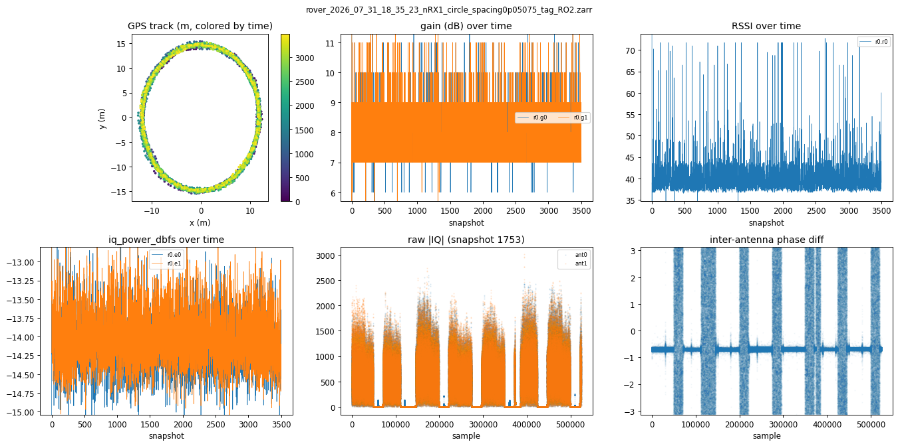

**How it did:** 3493/3500 GPS-valid over 30.3 min; gain ~8 dB (low, stable), RSSI ~40,
`iq_power` ~−14 dBFS, per-buffer gain drift ~1.3 dB.

**What it means:** a textbook emitter run — the GPS track is a clean **circle** (~±13 m),
exactly the `circle` routine, and the raw |IQ| shows regular signal bursts. The low, flat
receive gain (~8 dB) is expected for the emitter monitoring its own strong transmission.
This run is the TX reference for the three merged datasets built from the 18:xx window.

### RO2 — 21:09:45 circle (TX)
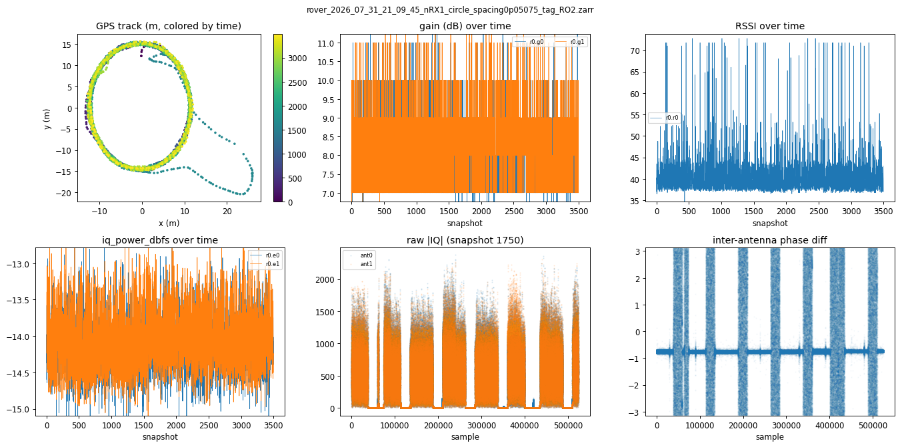

**How it did:** 3499/3500 GPS-valid over 31.5 min; gain ~8 dB, RSSI ~41, `iq_power`
~−14 dBFS, drift ~1.3 dB — essentially identical to the 18:35 run.

**What it means:** the second clean emitter circle, providing the TX track for the evening
(21:xx) merge. Two consistent emitter runs bracket the day's usable receiver captures.

---

## Receiver runs (RO1, RO3)

### RO1 — 18:35:35 bounce (RX) · `.tmp`, partial
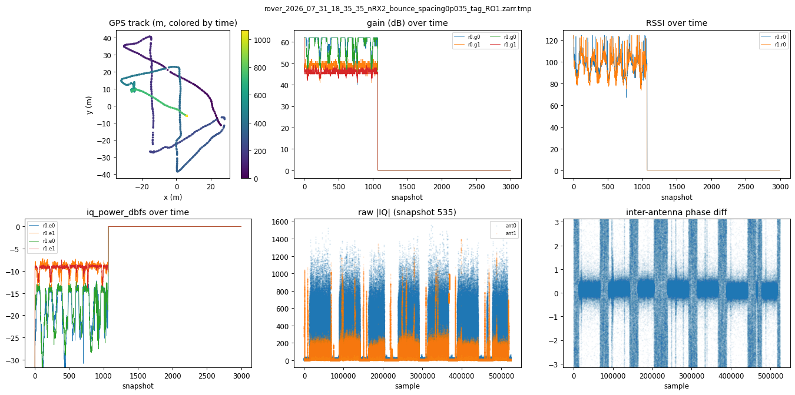

**How it did:** only **1070/3000 (36%) GPS-valid**, 7.0 min; gain ~54 dB, `iq_power`
~−5 dBFS (very hot, near clipping); the LMDB was left as `.zarr.tmp` with ~15 torn
`signal_matrix` chunks.

**What it means:** a short receiver run cut off before completion (never renamed from
`.tmp`). Two-thirds of snapshots have no GPS fix, so only the tail is usable — but the raw
|IQ| clearly shows the emitter (periodic bursts), so RF capture worked. The very high
`iq_power` (−5 dBFS) with full 54 dB gain suggests the receiver was close to / hot on the
emitter early in the run. Still yielded a 1069-point merge.

### RO1 — 18:49:02 bounce (RX) · `.tmp`, partial
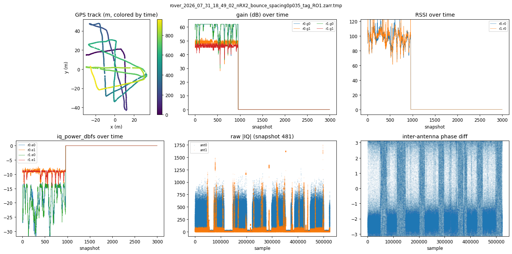

**How it did:** 962/3000 (32%) GPS-valid, 8.8 min; gain ~54 dB, `iq_power` ~−4.6 dBFS.

**What it means:** RO1's second and last run of the day — same story as 18:35: partial GPS,
strong signal, `.tmp`. RO1 never produced a clean full-GPS capture, so it's the weakest of
the three rovers today (likely the GPS/EKF-readiness issue seen on the boot side).

### RO3 — 20:01:46 bounce (RX) · `.tmp`, short
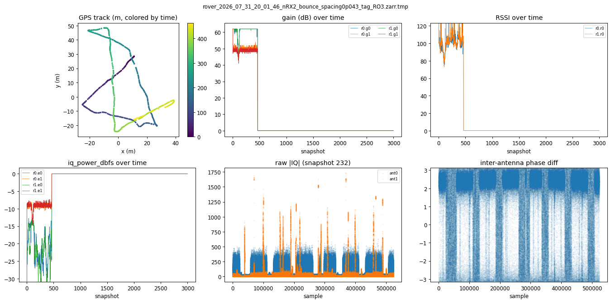

**How it did:** **465/3000 (15%) GPS-valid**, only 4.4 min; gain ~55 dB, `iq_power`
~−2.3 dBFS (hottest of the day).

**What it means:** a very short, mostly-GPS-less aborted attempt just before RO3's good run.
Below the 500-point merge threshold, so it produced **no** merged dataset. Useful only as a
signal-presence check (the emitter is clearly visible in the raw |IQ|).

### RO3 — 20:11:15 bounce (RX) ✅
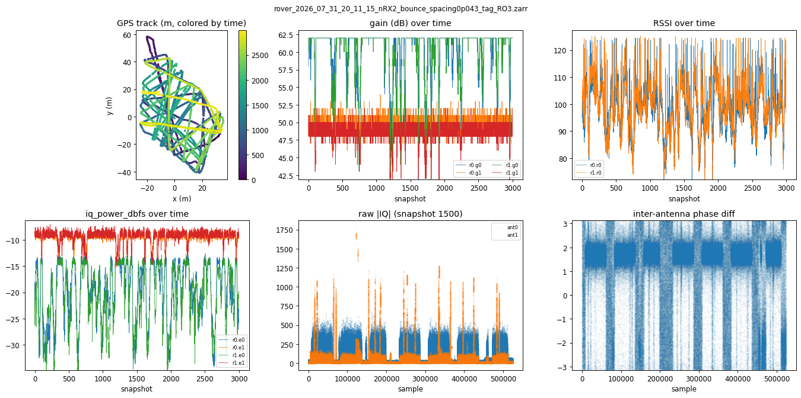

**How it did:** **3000/3000 (100%) GPS-valid**, 27.9 min; gain ~55 dB, RSSI ~88,
`iq_power` ~−14.5 dBFS, drift ~0.83 dB.

**What it means:** the day's first fully-clean receiver run. The GPS track shows the full
`bounce` coverage over the ~60 × 100 m field, and the raw |IQ| / phase-diff show strong,
periodic signal as the emitter circles in and out of view. This is the highest-quality RX
capture of the afternoon and merges cleanly with RO2's 18:35 circle (2043 points).

### RO3 — 21:18:45 bounce (RX) ✅
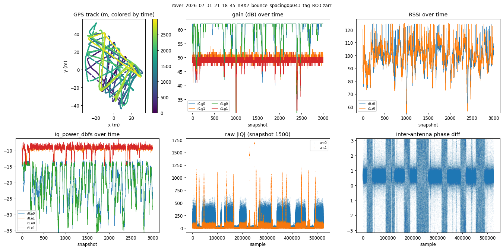

**How it did:** 3000/3000 (100%) GPS-valid, 27.9 min; gain ~55 dB, RSSI ~88, `iq_power`
~−14.6 dBFS.

**What it means:** the evening's clean receiver bounce, paired with RO2's 21:09 emitter
circle. Together with RO3's 20:11 run these are the two best captures of the day and the
source of the two largest merged datasets (2043 and 2928 points).

---

## Merged direction-finding datasets

These join the emitter GPS track onto each receiver snapshot (`v7_tx_rx_merge.py`),
adding `tx_pos`/`rx_pos` ground truth while preserving the full v7 gain/RSSI payload. The
track panel here shows **TX (emitter) vs RX (receiver)** in the local frame; the key DF
quantity is the TX↔RX distance range.

Each merged dataset also gets a **direction-finding figure** (loaded through
`v5spfdataset`): the **windowed-beamformer power heatmap (angle × time) with the ground-truth
bearing overlaid**, and the **estimated θ (two beamformer peaks) vs ground truth**, per
receiver. The `reduced GT` (cyan/green) is the front/back-folded bearing that the 2-element
array can actually resolve — it should track the bright beamformer ridge and the peak
estimates. *(The 6-panel summaries above are from a script reading each zarr directly; these
DF figures need the segmentation/beamformer cache, same pipeline as `v7dataset_analysis.ipynb`.)*

### RO1(18:35:35) × RO2(18:35:23) — 1069 pts
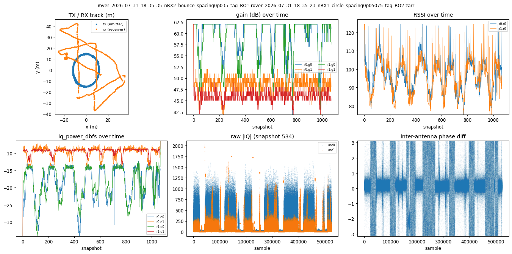

**How it did:** 1069 snapshots, TX↔RX distance 6.1 / 15.1 / 57.9 m (min/med/max); 15 torn
rows skipped from the RO1 `.tmp` input.

**What it means:** a usable but short DF slice — the emitter circles (tight cluster) while
the receiver sweeps out to ~58 m. Limited by RO1's 7-min partial capture.

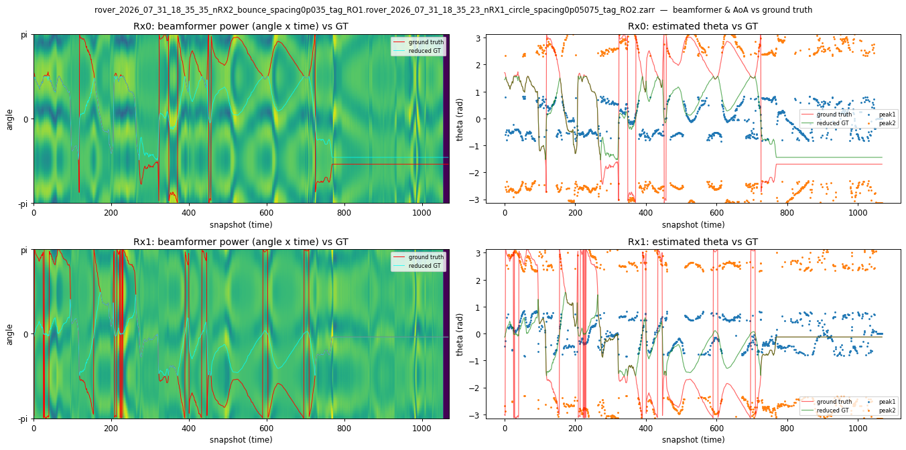

The reduced-GT curve follows the beamformer ridge in the moving section; the flat tail
(~snapshot 760+) is where both rovers were stationary and the geometry stops changing.

### RO1(18:49:02) × RO2(18:35:23) — 961 pts
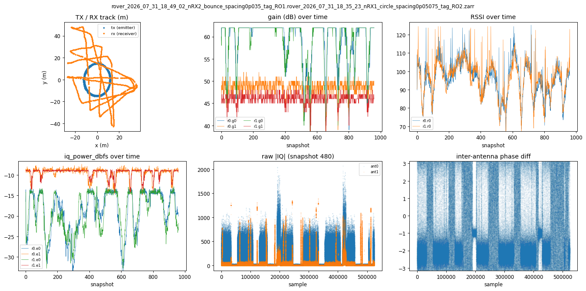

**How it did:** 961 snapshots, TX↔RX distance 0.6 / 24.8 / 58.0 m.

**What it means:** similar small RO1 slice; the near-0.6 m minimum means the two rovers
passed very close at one point (short baseline — weak angular information there).

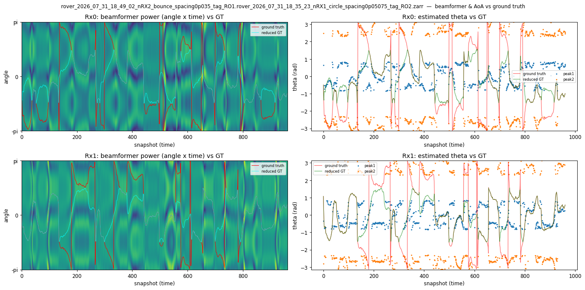

### RO3(20:11:15) × RO2(18:35:23) — 2043 pts
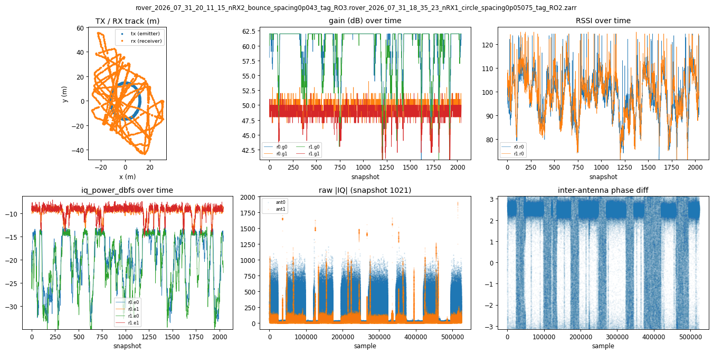

**How it did:** 2043 snapshots (partial temporal overlap), TX↔RX distance 1.2 / 24.3 /
58.3 m; clean input.

**What it means:** a solid mid-size DF dataset — good distance spread (1–58 m) gives varied
angular geometry. One of the two training-quality merges.

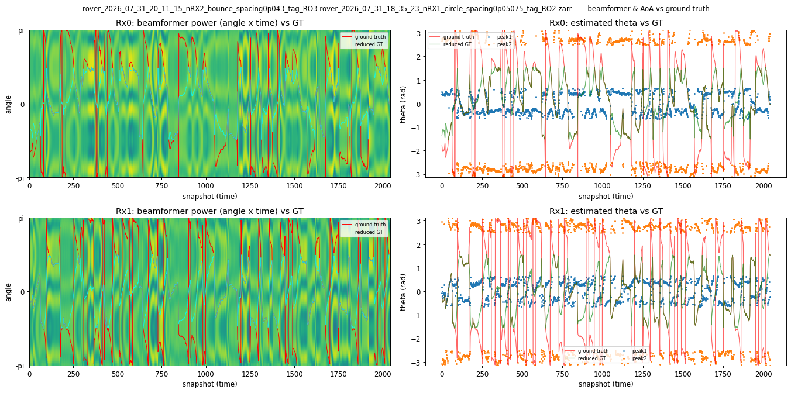

On this clean full run the reduced-GT curve tracks the beamformer ridge throughout and the
peak estimates bracket ground truth across the whole 19-min window.

### RO3(21:18:45) × RO2(21:09:45) — 2928 pts ⭐
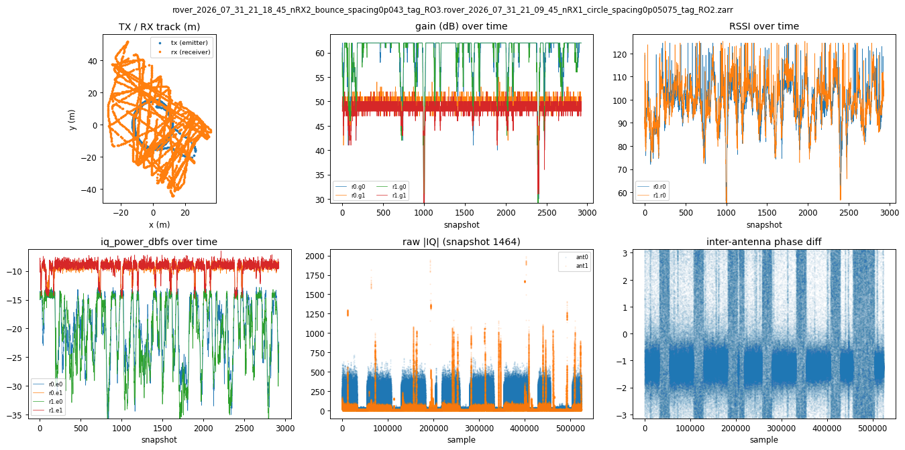

**How it did:** **2928 snapshots** (the largest), TX↔RX distance 0.2 / 25.7 / 62.6 m; clean.

**What it means:** the best DF dataset of the day — nearly full temporal overlap of two clean
runs, widest distance range (0.2–62.6 m), full 27 min. This is the primary training-ready
capture from 2026-07-31.

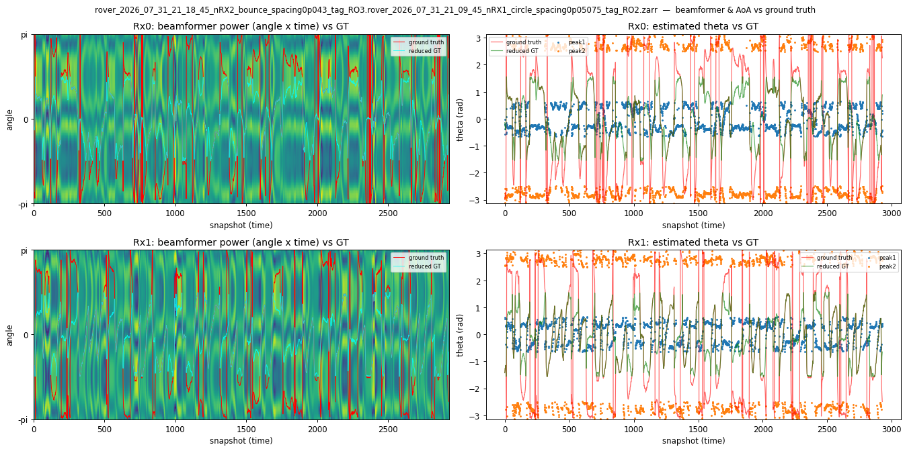

---

## Aborted / empty runs (18)

These zarrs were created and sized (3000/3500 snapshot slots) but contain **0 GPS-valid
snapshots** — collection aborted before GPS lock (or the writer died before flushing).
No usable RF or position data.

| Start (name) | Rover | nRX |
|---|---|---|
| 01:36:53, 01:49:47 | RO1 | 2 |
| 02:32:22 | RO2 | 1 |
| 03:59:37 | RO3 | 2 |
| 17:11:01, 17:33:51, 17:49:30, 17:51:18, 17:53:56 | RO3 | 2 |
| 17:53:54 | RO2 | 1 |
| 18:03:28 | RO1 | 2 |
| 18:07:32, 18:10:11, 18:13:34 | RO2 | 1 |
| 21:48:38 | RO2 | 1 |
| 21:49:59, 22:10:25 | RO3 | 2 |
| 22:11:39 | RO2 | 1 |

**What it means:** the dominant failure mode of the day was **runs that never reached GPS
lock** — note the clusters (six RO3 attempts at 17:xx, four RO2 attempts at 18:xx). This is
consistent with the known GPS-first-fix / EKF-readiness issue on the boot side. The
successful captures came only after these repeated retries.

---

## Data-quality notes

- **GPS outliers:** essentially none. The track panels filter exact-(0,0) no-fix points and
  anything >0.02° from the run median; **the median filter dropped 0 points in every file**.
  The only bad GPS anywhere was a **single (0,0) startup point in RO2's 18:35 capture**
  (before first fix), now filtered. All merged TX/RX positions are within the ~60 m field
  (TX ±13–26 m, RX ±28–56 m) — no crazy outliers.
- **RO1 is the weak rover:** both RO1 runs are partial-GPS `.tmp` files (32–36% valid) and
  one has ~15 torn `signal_matrix` chunks. RO1 produced no clean full-GPS capture.
- **RSSI vs power caution:** `rssi` here rises where `iq_power_dbfs` is *lower* (weaker) —
  it behaves like an AGC/gain-linked register, **not** absolute received power. Use
  `iq_power_dbfs` for signal strength; don't read `rssi` as dBm.
- **Hot early runs:** the 18:xx/20:01 RX `.tmp` captures sit at −2 to −5 dBFS `iq_power`
  (near clipping) at full 54 dB gain — worth checking receiver placement/attenuation on
  short-baseline passes to avoid ADC overload.

---

*Generated from `/mnt/qnap01/mouse9911/rovers_july_2026/` (opened read-only; raw immutable).
Merges: `spf/scripts/v7_tx_rx_merge.py`. Per-zarr panels: read directly from each zarr.*
