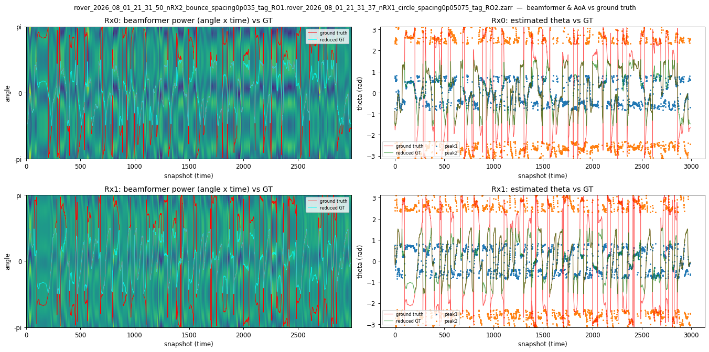
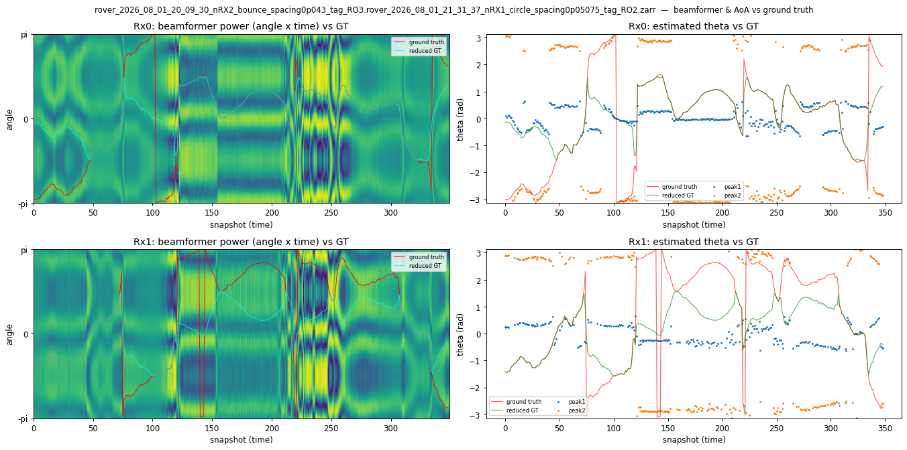
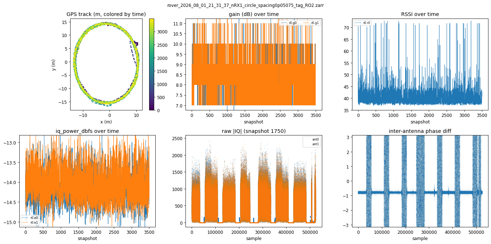

# Rover field report: 2026-08-01

## Executive summary

The cooling fans located near the rover GPS/external-compass assemblies were
disabled before the latest compass work. The operator subsequently observed
better compass calibration fits across the fleet. This is consistent with a
plausible magnetic-interference mechanism—fan motors, permanent magnets,
commutation current, and fan wiring can all disturb a nearby magnetometer—but
today's observations do not yet prove causality.

The immediate operational rule is to keep fan state and surrounding wiring
unchanged between compass calibration and field operation. When the rovers
return from the field, preserve their compass evidence **before** running a new
calibration or changing parameters. In particular, retrieve the calibration
fitness reported during calibration, the saved offsets and correction matrix,
compass identity and priority, and the field boot/pre-arm logs from every
rover.

Disabling fans can trade magnetic cleanliness for thermal risk. Until the fans
are relocated or an A/B test establishes a safe permanent configuration,
monitor Raspberry Pi throttling and temperature and, where available, Pluto
temperature during captures.

## Observation: fans near the external compass

- Change: cooling fans close to the GPS/external-compass hardware were
  disabled.
- Observation: compass fits appeared better across the rovers afterward.
- Current interpretation: a strong and physically plausible hypothesis, not a
  controlled result.
- Confounders: calibration pose coverage, rover location and orientation,
  nearby steel or current-carrying equipment, wiring position, vehicle power
  state, temperature, and changes made between calibration attempts.
- Field implication: do not recalibrate with one fan state and operate with
  another. The magnetic environment during calibration should match the
  mission configuration.

## Compass evidence available on August 1

The values below are operational observations collected during diagnosis. They
are not a balanced fan-on/fan-off experiment.

| Rover | External compass | Latest evidence | Interpretation |
| --- | --- | --- | --- |
| Rover 1 | device ID `658953`, slot 1 | offsets `(-18.98, 156.46, -82.42)` mG; norm `177.86` mG; external-only yaw policy passed | Healthy saved offset magnitude. A post-field calibration fitness still needs to be retrieved. |
| Rover 2 | device ID `658953`, slot 1 | offsets `(-147.48, -501.67, 639.37)` mG; norm `825.97` mG; external-only yaw policy repaired | Accepted by the configured safety limit but above the preferred 500 mG warning level. No confirmed post-fan fitness was captured. |
| Rover 3 | device ID `658953`, slot 1 | latest calibration reported fitness `6.65797` and autosave success; saved offsets `(703.113, -146.722, -392.672)` mG, norm `818.59` mG | The reported fitness is below the configured acceptance threshold of 16. The saved correction matrix is substantially healthier than an earlier attempt with `DIA_Z` near `0.378`. |

Earlier Rover 3 calibration attempts produced offset norms of approximately
`848.3`, `815.2`, and `952.2` mG. Offset norm alone is not calibration fitness:
a large offset can reflect a repeatable local magnetic bias, while fitness
describes how well the calibration model fits the measurements. Both should be
retained.

## Required post-field compass evidence

Complete this checklist as soon as each rover returns, before recalibration,
parameter repair, fan changes, or moving wiring:

1. Record rover identity, Git SHA, ArduPilot version, boot time, fan state, and
   whether the rover remained powered continuously through the field session.
2. Run the read-only compass report and save its full output:

   ```bash
   cd /home/pi/spf
   /home/pi/spf-virtualenv/bin/python -m spf.ardupilot.ardu_cli compass \
     --parameter-timeout 60
   ```

3. Save the relevant MAVLink service journal before log rotation. Search for
   calibration progress/report messages, calibration fitness, compass health,
   priority, pre-arm failures, EKF lane changes, and yaw inconsistencies:

   ```bash
   sudo journalctl -b -u mavlink_controller.service --no-pager > \
     ~/mavlink_controller_aug01_post_field.log
   sudo journalctl -b -1 -u mavlink_controller.service --no-pager > \
     ~/mavlink_controller_aug01_previous_boot.log
   ```

4. Preserve these values per compass: device ID, external/internal status,
   use-for-yaw state, priority, orientation, offset vector and norm, diagonal
   and off-diagonal correction terms, scale, configured offset limit, health,
   and any calibration fitness present in a `MAG_CAL_REPORT`.
5. Record GPS fix/satellite state, EKF status, armability, temperatures, and
   `vcgencmd get_throttled` so that a poor navigation state is not mistaken for
   a compass calibration failure.
6. Copy the outputs off the rover and link them from this report or a follow-up
   report before starting another `magcal` operation.

Important: ArduPilot's saved compass parameters retain the fitted correction,
but calibration fitness is most reliably available in the terminal
`MAG_CAL_REPORT`/calibration logs. If that report was not persisted, do not
invent a fitness value from offset norm. Record it as unavailable. A fresh
calibration may measure a new fitness, but it will also replace the saved
calibration and should only be run after the field state has been captured.

## Proposed controlled fan-interference test

After field evidence is secured, run an A/B test on each rover in the same
location and configuration:

1. Alternate fan state `OFF, ON, ON, OFF` to reduce time-order bias.
2. Perform three complete calibration repeats per state with the same power,
   wiring placement, payload, and physical motion coverage.
3. Capture fitness, offset vector/norm, diagonal and off-diagonal corrections,
   scale, calibration completion status, pre-arm compass messages, and heading
   consistency.
4. Log Pi and Pluto temperatures so thermal drift is separable from magnetic
   interference.
5. Compare within-rover repeatability first, then compare the fleet.

Pass condition: fan-off calibrations consistently improve fitness and/or
heading residual by more than ordinary repeat-to-repeat variation, without
unsafe thermal behavior.

Fail/inconclusive condition: the result changes with run order, calibration
motion, or location as much as it changes with fan state; or the Pi/SDRs show
thermal throttling or excessive temperature with fans disabled.

If fan interference is confirmed, prefer relocating the fan, increasing its
distance from the magnetometer, and rerouting/twisting its supply wires over
permanently removing cooling without a thermal qualification test.

## Software state relevant to this report

- `5ec2c0e` — guard and repair rover compass selection.
- `13e5d59` — stream compass-calibration progress and terminal reports.
- `90a0ed5` — honor the configured ArduPilot compass-offset limit while warning
  above the preferred 500 mG level.
- `0cc95a6` — add the ArduPilot CLI command cheatsheet.

These checks help expose and preserve compass state; they do not establish that
the fans caused the observed differences. The post-field evidence and the
controlled A/B experiment are required to settle that question.


---

# Appendix — capture data, TX/RX merges, and direction-finding quality

*Companion to the compass/fan operational report above. This appendix covers what the
2026-08-01 captures actually contain: per-capture figures, the 14 merged direction-finding
datasets, measured DF quality and signal strength, and a July-31 comparison. Everything
here was produced read-only from the recorded data; figures are in
[`2026_08_01_figures/`](2026_08_01_figures/), tooling in [`tools/`](tools/).*

## Executive summary

The August 1 field session produced **14 merged direction-finding datasets totalling
25,040 labelled snapshots** — 3.6x the July-31 yield (7,001) — and the data is
measurably better: median RF-to-ground-truth phase correlation **R = 0.508 vs 0.391**,
median absolute phase error **34.3° vs 46.7°**. Not one of the 14 Aug-1 datasets contains
a zeroed (unreadable) row, where the July-31 set had a torn input contributing 1.4%.

Capture *reliability*, however, remains the weak point: **40 collection launches produced
19 complete stores (47.5%)**. The emitter rover (RO2) ran a near-continuous 2h37m of
five back-to-back circles, and RO1 delivered five clean receiver runs; RO3 aborted
repeatedly and accounts for **every** data-bearing `.tmp` on the day, including one
12.5 GB store that is permanently unmergeable.

Three issues found during this analysis are called out below and are **not yet fixed**:
a systematic GPS-to-IQ timing lag, absent provenance in the merged stores, and a
session-correlation hazard for train/val splitting.

## Session structure

| Rover | Role | Routine | Launches | Complete stores |
|---|---|---|---:|---:|
| RO2 | emitter / TX | `circle` (nRX1) | 8 | **6** (5 full + 1 preflight) |
| RO1 | receiver / RX | `bounce` (nRX2, 0.035 m) | 18 | **6** (5 full + 1 preflight) |
| RO3 | receiver / RX | `bounce` (nRX2, 0.043 m) | 11 | **4** (3 full + 1 preflight) |
| PRODSTAB R1/R2/R3 | bench stability | `--fake-drone` | 3 | **3** |
| **Total** | | | **40** | **19** |

The emitter ran five back-to-back ~29.8 min circles covering **19:28:51 → 22:05:38 UTC**
with only ~2 min gaps — excellent discipline, and the reason nearly every receiver
capture found an emitter to pair with.

> **Filename timestamps are not capture times.** The name encodes the writer's clock at
> finalize, not GPS start: `…19_54_32…RO2` actually spans GPS 19:28:51 → 19:58:41. All
> pairing below uses `gps_timestamp`, never filenames.

## Failures

**Launch-to-store: 40 → 30 zarr dirs → 19 complete (47.5%).**

| Failure mode | Count | Detail |
|---|---:|---|
| Never created a store | 10 | launch aborted before the writer opened a zarr |
| Empty `.tmp` stubs (~80–100 KB) | 7 | store opened, zero snapshots written. 4 of these cluster at 23:10–23:51 (end-of-session shutdown) |
| Data-bearing `.tmp` (never finalized) | 4 | **all RO3** — 19:31, 19:40, 22:10, 22:57 |
| LMDB-torn (unreadable) | 1 | RO3 `19_40_40` (12.48 GB) |

**Per-rover completion: RO2 6/8 (75%), RO1 6/18 (33%), RO3 4/11 (36%).** RO1's launch
count is inflated by repeated retries that never opened a store; once RO1 *did* start
recording it finished cleanly every time. RO3 is the opposite and the real problem: it
started recording and then failed to finalize on four occasions, losing ~27 GB of
partially-good IQ.

**The one permanent loss:** `rover_2026_08_01_19_40_40_nRX2_bounce_spacing0p043_tag_RO3.zarr.tmp`
(12.48 GB, the single largest store of the day) is LMDB-torn — `MDB_PAGE_NOTFOUND` on the
GPS pages. IQ is partially salvageable but **GPS is gone**, so it can never be merged into
ground truth. It sat squarely inside dense emitter coverage and would very likely have
produced another full ~3,000-snapshot dataset.

## Merged direction-finding datasets

Merging (`spf/scripts/v7_tx_rx_merge.py`) interpolates the emitter's GPS onto every
receiver snapshot, projects both to a local azimuthal-equidistant XY frame in mm, and
writes v5 ground truth (`tx_pos_*_mm`, `rx_pos_*_mm`, `rx_theta_in_pis`,
`rx_heading_in_pis`) while preserving the full v7 gain/RSSI payload.

Pairing was decided by a full TX x RX `gps_timestamp` intersection over all 6 x 19
combinations; **14 pairs overlap, and all 14 were merged** (a first pass at
`--min-timesteps 500` produced 12; the threshold was lowered to 300 to recover the two
straddle-tails, 349 and 393 snapshots, which are genuine data).

`R` is the Pearson correlation between the segmentation-derived measured phase difference
and the GPS-derived ground-truth phase; `MAE` is the mean absolute circular error. Both
are computed per receiver, over non-NaN snapshots.

| RX x TX (GPS-time labels) | Snapshots | R r0 | R r1 | MAE r0 | MAE r1 | NaN r0 | NaN r1 | median TX↔RX |
|---|---:|---:|---:|---:|---:|---:|---:|---:|
| RO1 20:01 x RO2 19:54 | 3000 | 0.635 | 0.641 | 26.9° | 26.9° | 0.28 | 0.33 | 26.6 m |
| RO1 20:59 x RO2 20:59 | 3000 | 0.548 | 0.534 | 29.2° | 30.3° | 0.26 | 0.30 | 25.4 m |
| RO1 21:31 x RO2 21:31 | 2991 | **0.653** | 0.607 | 25.4° | **21.1°** | 0.27 | 0.28 | 26.9 m |
| RO1 22:04 x RO2 22:03 | 2958 | 0.588 | 0.643 | 28.6° | 25.4° | 0.28 | 0.28 | 29.8 m |
| RO1 22:36 x RO2 22:35 | 2738 | 0.439 | 0.425 | 31.5° | 41.4° | 0.25 | 0.28 | 27.2 m |
| RO3 21:37 x RO2 21:31 | 2428 | 0.571 | 0.499 | 38.2° | 30.8° | 0.16 | 0.32 | 28.2 m |
| RO3 20:09 x RO2 20:59 | 2408 | 0.480 | 0.382 | 45.3° | 47.3° | 0.13 | 0.29 | 23.3 m |
| RO3 22:25 x RO2 22:35 | 2157 | 0.585 | 0.433 | 38.8° | 37.5° | 0.15 | 0.31 | 25.9 m |
| RO3 22:10 x RO2 22:03 | 801 | 0.450 | 0.461 | 48.7° | 41.6° | 0.13 | 0.26 | 21.8 m |
| RO3 22:25 x RO2 22:03 | 678 | 0.603 | 0.410 | 35.8° | 33.4° | 0.12 | 0.27 | 26.3 m |
| RO3 22:57 x RO2 22:35 | 600 | 0.453 | 0.470 | 36.8° | 35.0° | 0.13 | 0.36 | 27.7 m |
| RO3 19:31 x RO2 19:54 | 539 | 0.545 | 0.405 | 33.6° | 33.8° | 0.10 | 0.26 | 23.1 m |
| RO3 21:37 x RO2 22:03 | 393 | 0.540 | 0.516 | 34.8° | 32.5° | 0.12 | 0.30 | 29.2 m |
| RO3 20:09 x RO2 21:31 | 349 | 0.271 | 0.438 | 69.3° | 52.8° | 0.11 | 0.32 | 19.3 m |
| **Aggregate (28 receiver-datasets)** | **25,040** | **0.508 (median)** | | **34.3° (median)** | | **0.27 (median)** | | 26.2 m |

**Integrity: 0 zeroed rows in all 14 datasets** (sampled ~40 rows/dataset). Every store
opens, carries all 35 per-receiver keys, and loads end-to-end through
`v5spfdataset(v4=False, nthetas=65)`.

### What the numbers say

- **RO1 outperforms RO3 consistently** (R 0.44–0.65 vs 0.27–0.60; MAE 21–41° vs 31–69°).
  RO1 uses 0.035 m antenna spacing, RO3 uses 0.043 m — but the two rovers also differ in
  mounting and in abort behaviour, so spacing is *not* established as the cause.
- **The two recovered straddle-tails are the weakest data.** The 349-snapshot dataset is
  the worst on the day (R 0.271, MAE 69.3°) and the 801 is also poor. Small, short-baseline
  segments carry the least angular information; they are included for completeness but
  should be **weighted down or excluded** for training.
- **NaN (unsegmentable) fraction is 0.10–0.36**, median 0.27, comfortably inside historical
  rover norms. This is *not* a quality gate for rover data.



*The strongest dataset (RO1 21:31, R = 0.653). Left: beamformer power over angle x time
with ground truth overlaid — the cyan `reduced GT` (the front/back-folded bearing a
2-element array can actually resolve) tracks the bright ridge. Right: the two beamformer
peak estimates against ground truth; `peak1` follows the reduced GT closely.*

### Contrast: the weakest dataset



*The 349-snapshot straddle-tail (RO3 20:09 x RO2 21:31, R = 0.271, MAE 69.3°) — the worst
on the day. Compare with the figure above: the beamformer ridge is far less coherent and
the peak estimates scatter. This is what a short, low-diversity segment looks like, and why
these two recovered tails should be down-weighted for training.*

## Signal strength

Signal conditions were remarkably uniform across the whole session — evidence that the
emitter, the receivers, and the AGC behaved consistently for 2.5 hours:

| Metric | Aug-1 median | Range across datasets |
|---|---:|---|
| `iq_power_dbfs` (r0) | **−14.9 dBFS** | −13.8 … −15.3 |
| `gains` (r0) | **54.4 dB** | 53.0 … 55.5 |
| `rssis` (r0) | ~87 | — |
| `gain_metadata_valid` | 1.000 | all datasets |

The ~1.5 dB total spread in `iq_power_dbfs` across 14 datasets and 2.5 hours is very tight.
Receive gain sits near the top of its range (~54 dB of ~62 dB max), consistent with a
weak-but-clean signal at 20–30 m — there is headroom, and no evidence of ADC clipping in
the field captures (unlike some July `.tmp` runs which reached −2 to −5 dBFS).

**Caution on `rssis`:** this field rises where `iq_power_dbfs` is *lower*, i.e. it tracks
the AGC gain register rather than absolute received power. Use `iq_power_dbfs` for signal
strength; do not read `rssis` as dBm.



*A representative emitter capture: the GPS circle (±15 m), flat low receive gain, tight
`iq_power_dbfs`, and the periodic burst structure visible in raw |IQ| and inter-antenna phase.*

## August 1 vs July 31

| | July 31 | August 1 | Change |
|---|---:|---:|---|
| Merged DF datasets | 4 | **14** | +250% |
| Labelled snapshots | 7,001 | **25,040** | +258% |
| Median R (RF vs ground truth) | 0.391 | **0.508** | **+30%** |
| Median absolute phase error | 46.7° | **34.3°** | **−12.4°** |
| Datasets with zeroed rows | 1 of 4 | **0 of 14** | — |
| Median `iq_power_dbfs` | −14.5 | −14.9 | ~unchanged |
| Median gain | 54.3 | 54.4 | ~unchanged |
| Median NaN fraction | 0.25 | 0.27 | ~unchanged |

The improvement is in **geometry and capture integrity, not RF conditions** — signal
strength, gain, and segmentation health are essentially identical across the two days.
What changed is that the emitter ran continuously and the receivers produced long, clean,
fully-GPS-covered tracks, which is exactly what direction-finding ground truth needs.

**On the fan/compass hypothesis:** this appendix does **not** settle it. Aug-1 capture
survival and DF quality are both better, and better compass/EKF behaviour is a plausible
contributor, but the two days differ in emitter scheduling, route, duration, and operator
procedure. Nothing here isolates the fan variable. The controlled A/B test proposed in the
main report is still required.

## Known issues (found during this analysis, not yet fixed)

1. **Systematic GPS→IQ timing lag (~0.3 s).** Sweeping a constant time offset when
   interpolating the emitter track improves agreement on both days — Aug-1 peaks near
   −0.30 s and July-31 near −0.40 s, and an integer one-row shift improves 22 of 28
   receiver-datasets. At typical rover speed this is ~0.6 m of label error (~1.3° of
   bearing at median range, worse on close approaches). It is a *label* error, correctable
   in place without re-merging. `v7_tx_rx_merge.py` already carries a TODO acknowledging
   that timestamps are recorded at end-of-capture. **Recommend:** measure the constant per
   rover, then apply it as a label correction.
2. **Merged stores carry no provenance.** Root attrs contain only
   `radio_metadata_schema_version`; receiver attrs are empty. There is no record of the
   merge revision, source `capture_status`, projection center, or which physical Pluto is
   `r0`. **Recommend:** write provenance attrs in place before these datasets are used for
   training.
3. **Session correlation is a split hazard.** The 14 datasets derive from only **5
   independent emitter captures**, and RO1/RO3 frequently observed the *same* emitter run
   simultaneously. A naive per-file train/val split would leak an emitter track across the
   boundary. **Recommend:** split by emitter capture, not by file.
4. **Disk.** `/mnt/qnap01` is at 95% (272 GB free); one Aug-scale field day costs ~318 GB
   raw + merged. A second day of this size will not fit.

## Reproducing this appendix

```bash
PY=/home/mouse9911/virtual-envs/spf/bin/python3
AUG=/mnt/qnap01/mouse9911/rovers_august_2026
```

**1 — Merge TX↔RX** (emitter RO2 x receivers RO1/RO3; non-overlapping and unreadable
pairs are skipped automatically, so this doubles as the overlap map):

```bash
$PY -m spf.scripts.v7_tx_rx_merge \
  --txs "$AUG"/aug1/*_tag_RO2.zarr \
  --rxs "$AUG"/aug1/*_tag_RO1.zarr* "$AUG"/aug1/*_tag_RO3.zarr* \
  --output "$AUG"/merged --min-timesteps 300
```

Add `--dry-run` to print the overlap counts without copying any IQ.

**2 — Segment / beamform** (builds the precompute cache the DF figures need):

```bash
$PY spf/scripts/segment_zarr.py -i "$AUG"/merged/*.zarr \
  -c /mnt/qnap01/mouse9911/precomputed/precompute_cache_3p7 --gpu -p 8
```

**3 — Generate every figure in this appendix:**

```bash
PY=$PY DATE=2026_08_01 \
RAW="$AUG"/aug1 MERGED="$AUG"/merged \
CACHE=/mnt/qnap01/mouse9911/precomputed/precompute_cache_3p7 \
data_collection/rover/rover_v3.1/field_reports/tools/generate_figures.sh
```


## Figure index

All 47 figures live in [`2026_08_01_figures/`](2026_08_01_figures/).


### Direction-finding figures (14) — beamformer vs ground truth, estimated θ vs GT

- [RO3@1:19:31: x RO2@1:19:54:](2026_08_01_figures/df_rover_2026_08_01_19_31_21_nRX2_bounce_spacing0p043_tag_RO3.rover_2026_08_01_19_54_32_nRX1_circle_spacing0p05075_tag_RO2.png)
- [RO1@1:20:01: x RO2@1:19:54:](2026_08_01_figures/df_rover_2026_08_01_20_01_10_nRX2_bounce_spacing0p035_tag_RO1.rover_2026_08_01_19_54_32_nRX1_circle_spacing0p05075_tag_RO2.png)
- [RO3@1:20:09: x RO2@1:20:59:](2026_08_01_figures/df_rover_2026_08_01_20_09_30_nRX2_bounce_spacing0p043_tag_RO3.rover_2026_08_01_20_59_39_nRX1_circle_spacing0p05075_tag_RO2.png)
- [RO3@1:20:09: x RO2@1:21:31:](2026_08_01_figures/df_rover_2026_08_01_20_09_30_nRX2_bounce_spacing0p043_tag_RO3.rover_2026_08_01_21_31_37_nRX1_circle_spacing0p05075_tag_RO2.png)
- [RO1@1:20:59: x RO2@1:20:59:](2026_08_01_figures/df_rover_2026_08_01_20_59_59_nRX2_bounce_spacing0p035_tag_RO1.rover_2026_08_01_20_59_39_nRX1_circle_spacing0p05075_tag_RO2.png)
- [RO1@1:21:31: x RO2@1:21:31:](2026_08_01_figures/df_rover_2026_08_01_21_31_50_nRX2_bounce_spacing0p035_tag_RO1.rover_2026_08_01_21_31_37_nRX1_circle_spacing0p05075_tag_RO2.png)
- [RO3@1:21:37: x RO2@1:21:31:](2026_08_01_figures/df_rover_2026_08_01_21_37_49_nRX2_bounce_spacing0p043_tag_RO3.rover_2026_08_01_21_31_37_nRX1_circle_spacing0p05075_tag_RO2.png)
- [RO3@1:21:37: x RO2@1:22:03:](2026_08_01_figures/df_rover_2026_08_01_21_37_49_nRX2_bounce_spacing0p043_tag_RO3.rover_2026_08_01_22_03_40_nRX1_circle_spacing0p05075_tag_RO2.png)
- [RO1@1:22:04: x RO2@1:22:03:](2026_08_01_figures/df_rover_2026_08_01_22_04_32_nRX2_bounce_spacing0p035_tag_RO1.rover_2026_08_01_22_03_40_nRX1_circle_spacing0p05075_tag_RO2.png)
- [RO3@1:22:10: x RO2@1:22:03:](2026_08_01_figures/df_rover_2026_08_01_22_10_01_nRX2_bounce_spacing0p043_tag_RO3.rover_2026_08_01_22_03_40_nRX1_circle_spacing0p05075_tag_RO2.png)
- [RO3@1:22:25: x RO2@1:22:03:](2026_08_01_figures/df_rover_2026_08_01_22_25_55_nRX2_bounce_spacing0p043_tag_RO3.rover_2026_08_01_22_03_40_nRX1_circle_spacing0p05075_tag_RO2.png)
- [RO3@1:22:25: x RO2@1:22:35:](2026_08_01_figures/df_rover_2026_08_01_22_25_55_nRX2_bounce_spacing0p043_tag_RO3.rover_2026_08_01_22_35_15_nRX1_circle_spacing0p05075_tag_RO2.png)
- [RO1@1:22:36: x RO2@1:22:35:](2026_08_01_figures/df_rover_2026_08_01_22_36_27_nRX2_bounce_spacing0p035_tag_RO1.rover_2026_08_01_22_35_15_nRX1_circle_spacing0p05075_tag_RO2.png)
- [RO3@1:22:57: x RO2@1:22:35:](2026_08_01_figures/df_rover_2026_08_01_22_57_45_nRX2_bounce_spacing0p043_tag_RO3.rover_2026_08_01_22_35_15_nRX1_circle_spacing0p05075_tag_RO2.png)

### Per-capture 6-panel summaries (33) — track, gain, RSSI, iq_power, raw IQ + phase

- [RO1@1:16:45:](2026_08_01_figures/rover_2026_08_01_16_45_59_nRX1_bounce_spacing0p05075_tag_RO1.png)
- [RO3@1:18:32:](2026_08_01_figures/rover_2026_08_01_18_32_12_nRX2_bounce_spacing0p043_tag_RO3.png)
- [RO2@1:18:54:](2026_08_01_figures/rover_2026_08_01_18_54_40_nRX1_circle_spacing0p05075_tag_RO2.png)
- [RO3@1:19:31:](2026_08_01_figures/rover_2026_08_01_19_31_21_nRX2_bounce_spacing0p043_tag_RO3.png)
- [RO3@1:19:31: x RO2@1:19:54:](2026_08_01_figures/rover_2026_08_01_19_31_21_nRX2_bounce_spacing0p043_tag_RO3.rover_2026_08_01_19_54_32_nRX1_circle_spacing0p05075_tag_RO2.png)
- [RO2@1:19:54:](2026_08_01_figures/rover_2026_08_01_19_54_32_nRX1_circle_spacing0p05075_tag_RO2.png)
- [RO1@1:20:01:](2026_08_01_figures/rover_2026_08_01_20_01_10_nRX2_bounce_spacing0p035_tag_RO1.png)
- [RO1@1:20:01: x RO2@1:19:54:](2026_08_01_figures/rover_2026_08_01_20_01_10_nRX2_bounce_spacing0p035_tag_RO1.rover_2026_08_01_19_54_32_nRX1_circle_spacing0p05075_tag_RO2.png)
- [RO3@1:20:09:](2026_08_01_figures/rover_2026_08_01_20_09_30_nRX2_bounce_spacing0p043_tag_RO3.png)
- [RO3@1:20:09: x RO2@1:20:59:](2026_08_01_figures/rover_2026_08_01_20_09_30_nRX2_bounce_spacing0p043_tag_RO3.rover_2026_08_01_20_59_39_nRX1_circle_spacing0p05075_tag_RO2.png)
- [RO3@1:20:09: x RO2@1:21:31:](2026_08_01_figures/rover_2026_08_01_20_09_30_nRX2_bounce_spacing0p043_tag_RO3.rover_2026_08_01_21_31_37_nRX1_circle_spacing0p05075_tag_RO2.png)
- [RO2@1:20:59:](2026_08_01_figures/rover_2026_08_01_20_59_39_nRX1_circle_spacing0p05075_tag_RO2.png)
- [RO1@1:20:59:](2026_08_01_figures/rover_2026_08_01_20_59_59_nRX2_bounce_spacing0p035_tag_RO1.png)
- [RO1@1:20:59: x RO2@1:20:59:](2026_08_01_figures/rover_2026_08_01_20_59_59_nRX2_bounce_spacing0p035_tag_RO1.rover_2026_08_01_20_59_39_nRX1_circle_spacing0p05075_tag_RO2.png)
- [RO2@1:21:31:](2026_08_01_figures/rover_2026_08_01_21_31_37_nRX1_circle_spacing0p05075_tag_RO2.png)
- [RO1@1:21:31:](2026_08_01_figures/rover_2026_08_01_21_31_50_nRX2_bounce_spacing0p035_tag_RO1.png)
- [RO1@1:21:31: x RO2@1:21:31:](2026_08_01_figures/rover_2026_08_01_21_31_50_nRX2_bounce_spacing0p035_tag_RO1.rover_2026_08_01_21_31_37_nRX1_circle_spacing0p05075_tag_RO2.png)
- [RO3@1:21:37:](2026_08_01_figures/rover_2026_08_01_21_37_49_nRX2_bounce_spacing0p043_tag_RO3.png)
- [RO3@1:21:37: x RO2@1:21:31:](2026_08_01_figures/rover_2026_08_01_21_37_49_nRX2_bounce_spacing0p043_tag_RO3.rover_2026_08_01_21_31_37_nRX1_circle_spacing0p05075_tag_RO2.png)
- [RO3@1:21:37: x RO2@1:22:03:](2026_08_01_figures/rover_2026_08_01_21_37_49_nRX2_bounce_spacing0p043_tag_RO3.rover_2026_08_01_22_03_40_nRX1_circle_spacing0p05075_tag_RO2.png)
- [RO2@1:22:03:](2026_08_01_figures/rover_2026_08_01_22_03_40_nRX1_circle_spacing0p05075_tag_RO2.png)
- [RO1@1:22:04:](2026_08_01_figures/rover_2026_08_01_22_04_32_nRX2_bounce_spacing0p035_tag_RO1.png)
- [RO1@1:22:04: x RO2@1:22:03:](2026_08_01_figures/rover_2026_08_01_22_04_32_nRX2_bounce_spacing0p035_tag_RO1.rover_2026_08_01_22_03_40_nRX1_circle_spacing0p05075_tag_RO2.png)
- [RO3@1:22:10:](2026_08_01_figures/rover_2026_08_01_22_10_01_nRX2_bounce_spacing0p043_tag_RO3.png)
- [RO3@1:22:10: x RO2@1:22:03:](2026_08_01_figures/rover_2026_08_01_22_10_01_nRX2_bounce_spacing0p043_tag_RO3.rover_2026_08_01_22_03_40_nRX1_circle_spacing0p05075_tag_RO2.png)
- [RO3@1:22:25:](2026_08_01_figures/rover_2026_08_01_22_25_55_nRX2_bounce_spacing0p043_tag_RO3.png)
- [RO3@1:22:25: x RO2@1:22:03:](2026_08_01_figures/rover_2026_08_01_22_25_55_nRX2_bounce_spacing0p043_tag_RO3.rover_2026_08_01_22_03_40_nRX1_circle_spacing0p05075_tag_RO2.png)
- [RO3@1:22:25: x RO2@1:22:35:](2026_08_01_figures/rover_2026_08_01_22_25_55_nRX2_bounce_spacing0p043_tag_RO3.rover_2026_08_01_22_35_15_nRX1_circle_spacing0p05075_tag_RO2.png)
- [RO2@1:22:35:](2026_08_01_figures/rover_2026_08_01_22_35_15_nRX1_circle_spacing0p05075_tag_RO2.png)
- [RO1@1:22:36:](2026_08_01_figures/rover_2026_08_01_22_36_27_nRX2_bounce_spacing0p035_tag_RO1.png)
- [RO1@1:22:36: x RO2@1:22:35:](2026_08_01_figures/rover_2026_08_01_22_36_27_nRX2_bounce_spacing0p035_tag_RO1.rover_2026_08_01_22_35_15_nRX1_circle_spacing0p05075_tag_RO2.png)
- [RO3@1:22:57:](2026_08_01_figures/rover_2026_08_01_22_57_45_nRX2_bounce_spacing0p043_tag_RO3.png)
- [RO3@1:22:57: x RO2@1:22:35:](2026_08_01_figures/rover_2026_08_01_22_57_45_nRX2_bounce_spacing0p043_tag_RO3.rover_2026_08_01_22_35_15_nRX1_circle_spacing0p05075_tag_RO2.png)

## Artifacts

| Artifact | Location |
|---|---|
| Raw captures (immutable) | `/mnt/qnap01/mouse9911/rovers_august_2026/aug1/` (204 GB, 30 stores) |
| Merged DF datasets | `/mnt/qnap01/mouse9911/rovers_august_2026/merged/` (14, ~113 GB) |
| Segmentation cache (v3.7) | `/mnt/qnap01/mouse9911/precomputed/precompute_cache_3p7/` (2.0 GB) |
| Figures (47) | [`2026_08_01_figures/`](2026_08_01_figures/) |
| Tooling | [`tools/`](tools/), `spf/scripts/v7_tx_rx_merge.py` |

*Cache directories are version-scoped (`_3p7`) because cache filenames encode only the
dataset name and `nthetas` — two segmentation versions of the same dataset would otherwise
collide silently.*
