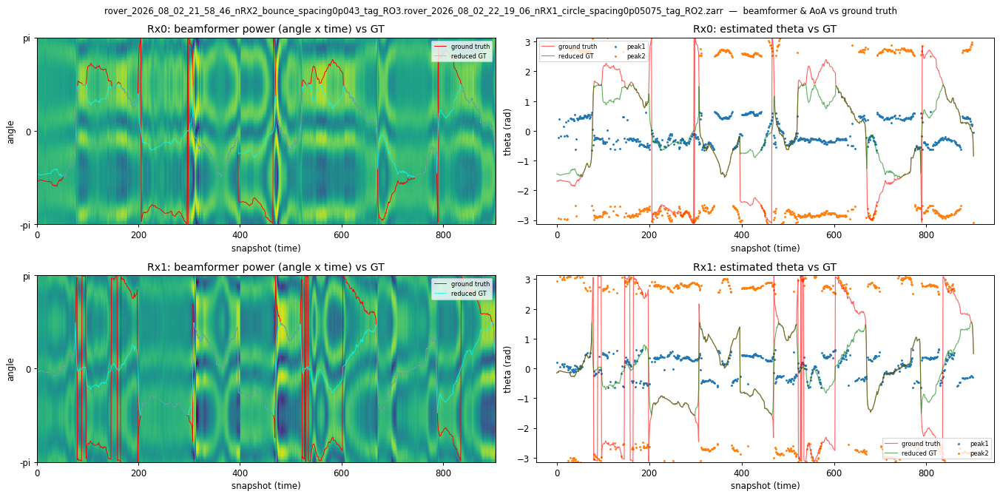
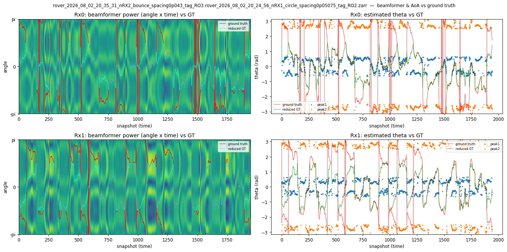

# Rover engineering report — 2026-08-02

## Direct-USB v3 promotion

The firmware-v3 host support was merged into SPF `main` at `a8c0d92`. Its
focused unit/integration suites passed: 201 direct-USB tests and 70
firmware/configuration/provenance tests.

The exact dual-radio-qualified image was recovered from the Rover 1 acceptance
cache and independently verified before publication:

```text
release: v0.38-plutoplus-spf-gain-rssi-fingerprint-v3
asset: plutoplus-spf-direct-usb-gain-rssi-fingerprint-v3-pluto.dfu
SHA-256: 86f2115eb344efcbd3d59af02caf80d396291cb9e20dcb01651cacf7e0334191
firmware repository: dac99758f265adcfdda989d347689b970ad13f5c
candidate source: f53dd006
Buildroot: f37fe105ff4df531311b0cf85584461fb03e0e4e
USB gadget: 2072e1d0823ef6db3bc141dd733a90d76e23fc33
device-fw: v0.38-plutoplus-spf-gain-rssi-fingerprint-v2-8-gf53d
```

The downloaded GitHub release asset reproduced the qualified SHA-256. The
production configs now pin the GitHub release, the on-device build-time
`device-fw` identity, the image digest, firmware source and gadget source
separately. This prevents a correct v3 release from being rejected merely
because its already-qualified binary was built while the source described
itself as a v2 descendant.

## Existing hardware evidence

Rover 1's RAM-only acceptance used both attached radios and passed:

- 20 production-size lifecycle cycles per radio;
- simultaneous finite and rolling capture;
- three supervised SIGKILL recoveries per radio;
- serial, physical path and boot ID retention after all six recoveries;
- fresh process nonce and valid IQ after recovery;
- restored standard USB-IIO access; and
- no Raspberry Pi throttling or undervoltage indication.

This evidence qualifies the published artifact. It does not replace the
persistent production-stack rollout below.

## Outstanding release gates

1. Allow SPF `main` CI for the v3 host integration and manifest update to pass.
2. Persistently install the release on one rover and verify the exact
   `device-fw`, gadget SHA, serials and USB paths after a cold boot.
3. Run the explicit real-radio `SIGSTOP` interrupted-capture gate and preserve
   its readable incomplete-prefix/watchdog evidence.
4. Run a dual-radio V7 clean capture and interrupted capture against the
   released artifact and merged `main`.
5. Run the 100-frame fake-drone capture and one normal mission rehearsal before
   advancing to another rover.
6. Keep the 20,000-cycle and eight-hour simultaneous soak as the final extended
   stability gates; they have not yet been executed for v3.

## Separate data-quality work

The approximately 0.3-second GPS-to-IQ alignment issue, merged-Zarr provenance,
emitter-session-aware dataset splitting, compass/fan A/B characterization and
storage-capacity planning remain open. They are not firmware-v3 release
blockers, but should be completed before treating the collected corpus as
analysis-ready.

## Rover 1 100-frame receive check

The completed V7 store below was inspected after a 100-record collection on
Rover 1:

```text
/home/pi/temp/rover_2026_08_02_19_53_21_nRX1_bounce_spacing0p05075_tag_RO1.zarr
```

The repository's direct-USB V7 validator passed the store. It contains exactly
100 frames, valid gain and RSSI metadata on every frame, and IQ shaped as
`(100, 2, 524288)` complex samples. The capture used one physical Pluto,
serial `10400090fd950014020005008faf192e5a`, at `usb:1.4.5`; it is not a
two-Pluto Rover 1 capture. Within that Pluto, `signal_matrix[0]` is RX1 and
`signal_matrix[1]` is RX2.

Both channels contain nonzero, distinct IQ and show the same RF spectral
structure. Their log-power spectra correlated by approximately `0.91` to
`0.94` in the inspected frames, so RX1 was not simply dead or returning noise.
The levels were nevertheless severely imbalanced:

| Measurement | RX1 | RX2 |
| --- | ---: | ---: |
| Median IQ power | -46.95 dBFS | -8.99 dBFS |
| Median end gain | 62 dB | 49 dB |
| Median end RSSI magnitude | 125.25 dB | 75.25 dB |
| Sampled clipping | 0% typical | approximately 0.5-2.0% |

Direct-USB RSSI is stored as a positive attenuation magnitude, so a smaller
number represents a stronger signal. RX1 was a median `37.7 dB` below RX2 in
IQ power, and 91 of 100 frames had an RX1-to-RX2 difference worse than
`-30 dB`. RX1's AGC had already reached its maximum 62 dB gain while RX2 was
strong enough to clip. The result therefore passes format, transport and
two-channel-presence checks, but does **not** pass a balanced dual-RX RF-quality
check suitable for phase-sensitive capture.

The median interval was 0.514 seconds, or 1.94 frames/second. A 231-second gap
occurred between the second and third stored snapshots; the remaining
steady-state intervals were normal. This store was produced by a rover
movement routine, so mission pauses must be separated from direct-USB transfer
time when interpreting end-to-end duration.

## Follow-up: RX1/RX2 cable-switch diagnostic

Run this before accepting the radio path for another field mission:

1. Photograph and label the current RX1 and RX2 antenna/cable connections.
2. Repeat a short capture without changing frequency, gain mode, antenna
   placement, transmitter, firmware or configuration. Preserve it as the
   unswapped control.
3. At the Pluto, exchange only the RX1 and RX2 input cables. Do not exchange
   antennas at their remote ends or alter their placement.
4. Repeat the same capture and validate both stores with
   `spf.scripts.validate_direct_usb_v7_zarr`.
5. Compare per-channel `iq_power_dbfs`, gain, positive RSSI magnitude,
   clipping, spectral shape and phase quality. Record the Pluto serial and USB
   path in both results.
6. Restore and verify the original cable assignment after the test.

Interpretation is deliberately binary:

- If the weak signal moves from RX1 to RX2, the cause follows the external
  cable, antenna, connector or RF path.
- If the weak signal remains on RX1, investigate the Pluto RX1 port, internal
  channel path and channel configuration.
- If re-mating alone removes the imbalance, treat connector seating or torque
  as the leading cause and repeat the original/swapped/original sequence to
  establish repeatability.
- If both paths become comparable but RX2 continues clipping, reduce received
  level or correct AGC configuration before phase-sensitive collection.

Pass condition: both channels remain nonzero and contain the same signal, the
large level asymmetry has a reproducible side that identifies its source, and
the final restored capture has no material clipping and no unexplained
tens-of-dB channel imbalance. Fail condition: the asymmetry changes
non-repeatably, either channel becomes signal-free, or clipping persists
without an understood level/configuration cause.

# Appendix — capture data, boot-log root cause, and direction-finding quality

*Companion to the engineering report above. This appendix covers what the
2026-08-02 captures contain, the rover boot logs that explain the day's losses,
and measured DF quality. Everything was produced read-only from the recorded
data and from `journalctl` on the rovers; figures are in
[`2026_08_02_figures/`](2026_08_02_figures/), metrics in
[`2026_08_02_metrics.json`](2026_08_02_metrics.json), tooling in [`tools/`](tools/).*

*Log provenance: pulled 2026-08-03 from `roverpi2` (`192.168.1.42`) and
`roverpi3` (`192.168.1.43`); both journals are persistent (79 and 86 retained
boots) so the whole session is covered. Rover 1 (`192.168.1.41`) answered
neither ICMP nor SSH and contributed no logs — every Rover 1 statement below is
inferred from capture artifacts alone. Times are BST (UTC+1), matching the
capture filenames.*

## Executive summary

The session produced **4 merged direction-finding datasets totalling 5,518
labelled snapshots** — 22 % of the August 1 yield (25,040). The shortfall is
entirely a *capture-finalization* problem, not a signal-quality one.

**The data that survived is better than August 1's**, despite coming from a
single receiver rover:

| | Aug 1 | Aug 2 |
|---|---:|---:|
| Merged datasets | 14 | 4 |
| Labelled snapshots | 25,040 | 5,518 |
| Median R | 0.508 | **0.582** |
| Median MAE | 34.3° | **33.8°** |
| Median NaN fraction | 0.27 | 0.28 |
| Median TX↔RX separation | 26.2 m | 41.2–44.1 m |
| Unreadable stores | 1 (12.5 GB, torn) | **0** |

Every one of the 24 stores opened cleanly. There is no repeat of the July 31 /
August 1 LMDB tearing.

**Root cause of the loss is established and is operational, not technical:**
13 manual shutdown commands issued from an interactive shell during recording,
plus one hard power loss. Details in the root-cause section below.

## Per-capture inventory

Every store written on August 2, in time order. `.tmp` means the writer never
finalized. GPS snapshot counts come from `zarr_summary_figure.py`; all 24 stores
were readable.

| Time | Rover | Cfg | Spacing m | State | GiB | GPS snaps | Figure |
|---|---|---|---|---|---:|---:|---|
| 18:38:12 | RO3 | nRX2 | 0.043 | `.tmp` | 0.00 | 0 | — |
| 18:49:21 | RO2 | nRX1 | 0.05075 | `.tmp` | 0.00 | 0 | — |
| 18:54:43 | RO2 | nRX1 | 0.05075 | `.tmp` | 0.00 | 0 | — |
| 18:55:21 | RO1 | nRX2 | 0.035 | `.tmp` | 0.00 | 0 | — |
| 18:55:21 | RO3 | nRX2 | 0.043 | `.tmp` | 0.00 | 0 | — |
| 19:31:52 | RO3 | nRX2 | 0.043 | `.tmp` | 0.00 | 0 | — |
| 19:44:19 | RO2 | nRX1 | 0.05075 | `.tmp` | 0.00 | 0 | — |
| 19:47:26 | RO1 | nRX2 | 0.035 | `.tmp` | 0.00 | 0 | — |
| 19:50:07 | RO2 | nRX1 | 0.05075 | `.tmp` | 0.00 | 0 | — |
| 19:53:21 | RO1 | nRX1 | 0.05075 | ok | 0.14 | 100 | [fig](2026_08_02_figures/rover_2026_08_02_19_53_21_nRX1_bounce_spacing0p05075_tag_RO1.png) |
| 20:09:06 | RO2 | nRX1 | 0.05075 | `.tmp` | 0.00 | 0 | — |
| 20:10:11 | RO2 | nRX1 | 0.05075 | ok | 0.14 | 100 | [fig](2026_08_02_figures/rover_2026_08_02_20_10_11_nRX1_circle_spacing0p05075_tag_RO2.png) |
| 20:14:54 | RO3 | nRX2 | 0.043 | `.tmp` | 0.00 | 0 | — |
| 20:15:52 | RO3 | nRX2 | 0.043 | ok | 0.29 | 100 | [fig](2026_08_02_figures/rover_2026_08_02_20_15_52_nRX2_bounce_spacing0p043_tag_RO3.png) |
| 20:24:56 | RO2 | nRX1 | 0.05075 | ok | 8.24 | 3500 | [fig](2026_08_02_figures/rover_2026_08_02_20_24_56_nRX1_circle_spacing0p05075_tag_RO2.png) |
| 20:25:03 | RO3 | nRX2 | 0.043 | `.tmp` | 0.00 | 0 | — |
| 20:25:08 | RO1 | nRX2 | 0.035 | `.tmp` | 6.41 | 1669 | [fig](2026_08_02_figures/rover_2026_08_02_20_25_08_nRX2_bounce_spacing0p035_tag_RO1.png) |
| 20:29:10 | RO3 | nRX2 | 0.043 | `.tmp` | 0.00 | 0 | — |
| 20:35:31 | RO3 | nRX2 | 0.043 | ok | 11.65 | 3000 | [fig](2026_08_02_figures/rover_2026_08_02_20_35_31_nRX2_bounce_spacing0p043_tag_RO3.png) |
| 20:45:45 | RO1 | nRX2 | 0.035 | `.tmp` | 0.00 | 0 | — |
| 21:47:04 | RO2 | nRX1 | 0.05075 | ok | 8.23 | 3500 | [fig](2026_08_02_figures/rover_2026_08_02_21_47_04_nRX1_circle_spacing0p05075_tag_RO2.png) |
| 21:58:46 | RO3 | nRX2 | 0.043 | ok | 11.58 | 3000 | [fig](2026_08_02_figures/rover_2026_08_02_21_58_46_nRX2_bounce_spacing0p043_tag_RO3.png) |
| 22:19:06 | RO2 | nRX1 | 0.05075 | ok | 8.23 | 3500 | [fig](2026_08_02_figures/rover_2026_08_02_22_19_06_nRX1_circle_spacing0p05075_tag_RO2.png) |
| 22:31:34 | RO3 | nRX2 | 0.043 | `.tmp` | 9.24 | 2280 | [fig](2026_08_02_figures/rover_2026_08_02_22_31_34_nRX2_bounce_spacing0p043_tag_RO3.png) |

Reading this table:

- The four **100-snapshot** stores (19:53:21, 20:10:11, 20:15:52 and the RO2
  preflight) are the 100-frame receive checks described earlier in this report,
  not failures.
- **14 `.tmp` stores contain zero snapshots.** They are empty stubs — the writer
  opened a store and was killed before writing anything.
- **Two `.tmp` stores contain real data**: RO1 at 20:25:08 (6.41 GiB,
  **1,669 GPS snapshots, and the correct RO1 configuration** — `nRX2`, 0.035 m)
  and RO3 at 22:31:34 (9.24 GiB, 2,280 snapshots). Both are readable and both
  are merge candidates.
- **Rover 1's only finalized store is the 19:53:21 preflight**, and it is
  misconfigured: `nRX1` with 0.05075 m spacing, where Rover 1 ran `nRX2` at
  0.035 m on August 1 and in its own 20:25:08 `.tmp` the same evening. Its
  recorded spacing must be reconciled against the physical hardware before any
  Rover 1 data from this date is trusted.

## Merged direction-finding datasets

Merged with `spf.scripts.v7_tx_rx_merge` at `--min-timesteps 300`, RO2 as
emitter against RO3 as receiver. All 12 TX×RX combinations were evaluated by
`gps_timestamp` intersection; 4 overlap and all 4 were merged. Output is 22 GB
in `rovers_august_2026/merged_aug2/`.

| RX × TX | Snapshots | R r0 | R r1 | MAE r0 | MAE r1 | NaN r0 | NaN r1 | median TX↔RX |
|---|---:|---:|---:|---:|---:|---:|---:|---:|
| RO3 20:35 × RO2 20:24 | 1944 | 0.598 | 0.586 | 41.1° | 33.6° | 0.22 | 0.32 | 44.1 m |
| RO3 21:58 × RO2 21:47 | 1840 | 0.566 | 0.553 | 34.0° | 33.0° | 0.21 | 0.30 | 43.5 m |
| RO3 21:58 × RO2 22:19 | 903 | **0.668** | 0.579 | 35.0° | 32.1° | 0.26 | 0.38 | 41.2 m |
| RO3 20:35 × RO2 21:47 | 831 | 0.514 | **0.702** | 37.5° | 30.7° | 0.22 | 0.35 | 34.8 m |
| **Aggregate (8 receiver-datasets)** | **5,518** | **0.582 (median)** | | **33.8° (median)** | | **0.28 (median)** | | |

Median `iq_power` −17.5 dBFS at median gain 55.5 dB.

Two results are worth recording because they contradict expectations set on
August 1:

1. **RO3 alone outperformed August 1's RO1+RO3 mix** (median R 0.582 vs 0.508).
   August 1 characterised RO3 as the weaker receiver at R 0.27–0.60. Either that
   characterisation was confounded by RO3's abort behaviour rather than its RF
   path, or something changed between sessions. Antenna spacing did not change.
2. **This happened at 1.6× the TX↔RX separation** (41–44 m vs 26.2 m). Greater
   separation did not cost angular quality here.

Neither observation is a controlled result. Both argue against treating
"RO3 is the weaker rover" as settled.



*Strongest r0 correlation of the day (R = 0.668, 903 snapshots).*



*Largest dataset of the day (1,944 snapshots, R = 0.598 / 0.586).*

The remaining two DF figures are
[RO3 21:58 × RO2 21:47](2026_08_02_figures/df_rover_2026_08_02_21_58_46_nRX2_bounce_spacing0p043_tag_RO3.rover_2026_08_02_21_47_04_nRX1_circle_spacing0p05075_tag_RO2.png)
and
[RO3 20:35 × RO2 21:47](2026_08_02_figures/df_rover_2026_08_02_20_35_31_nRX2_bounce_spacing0p043_tag_RO3.rover_2026_08_02_21_47_04_nRX1_circle_spacing0p05075_tag_RO2.png).

## Root cause analysis

### Issue 1 — capture finalization failures (16 of 24 stores)

**Root cause: the rovers were rebooted during recording.**

Rover 2 booted **17 times** on August 2 and Rover 3 **21 times**; 8 and 11
respectively fall inside the field session. The correlation with capture
outcome is exact and admits no exceptions:

- **Every `.tmp` store began in a boot that ended before the capture finalized.**
- **Every finalized store completed inside its boot window.**
- **All five large complete captures came from one boot per rover** — the only
  field boots on either rover longer than 60 minutes (Rover 2 boot −2, 151 min;
  Rover 3 boot −2, 140 min). Every other field boot lasted 2–53 minutes and
  produced only empty stubs.

Capture length was bounded by uptime, not by the capture stack.

**Two distinct mechanisms produced those reboots.**

**Mechanism A — 13 manual shutdown commands.** Recovered from `sudo` audit
records, all issued by uid 1000 from `PWD=/home/pi` or `/home/pi/spf`:

| Rover | Commands | Times (BST) |
|---|---:|---|
| Rover 2 | 4 | 18:29:10 `systemctl reboot`, 18:52:26 `systemctl reboot`, 20:23:56 `halt`, 23:17:05 `systemctl reboot` |
| Rover 3 | 9 | 18:52:26, 18:54:01 `systemctl reboot`; 19:17:44 `halt`; 19:24:12, 19:30:26 `reboot`; 20:23:54 `halt`; 20:28:01 `shutdown 0`; 20:34:22 `reboot`; 23:17:23 `systemctl reboot` |

The corresponding journal entries are unambiguous, e.g. Rover 2 at 18:52:26:

```text
sudo[3286]: pam_unix(sudo:session): session opened for user root(uid=0) by (uid=1000)
systemd-logind[543]: The system will reboot now!
systemd-logind[543]: System is rebooting.
```

These are clean, orderly shutdowns — filesystems synced, `systemd-reboot.service`
or `systemd-halt.service` reached normally. No watchdog reset, no panic.

**Mechanism B — one hard power loss at 22:54.** This one was *not* commanded.
Both rovers' logs stop mid-activity with **no shutdown sequence whatsoever**:

```text
rover2  22:54:45  drone_run.sh: Dist (m) to target 46.27882544175537 False ROVER_MODE_MANUAL
rover3  22:54:43  drone_run.sh: [680B blob data]
                  <no shutdown, no SIGTERM, no sync — log simply ends>
```

Two seconds apart, on both vehicles, while actively driving. This is a
simultaneous power interruption — battery exhaustion or a supply disconnect.
It is the session's single most expensive event: it destroyed
`rover_2026_08_02_22_31_34_…_tag_RO3.zarr.tmp`, 9.24 GB and 2,280 snapshots,
23 minutes into recording.

The 23:17 reboots that followed were manual (Mechanism A) and are consistent
with an operator restarting the fleet after the power event.

### Issue 2 — Rover 3 arm rejection (boot −3, abandoned after 6 minutes)

Two independent faults coincided in one 6-minute boot at 20:28:

| Log | `Check mag field` | `Arm: Logging failed` | `AP_Logger: stuck thread` |
|---|---:|---:|---:|
| rover3 boot −3 (6 min) | **389** | **26** | 1 |
| rover3 boot −2 (140 min) | 0 | 0 | 1 |
| rover2 boot −2 (151 min) | 1 | 0 | 0 |
| all other boots | 0 | 0 | 0 |

**Root cause of `Arm: Logging failed`: `AP_Logger: stuck thread (write)`** — the
ArduPilot dataflash writer stalled. This is a storage write-path fault, not a
sensor fault, and it directly produces the pre-arm rejection.

**`Arm: Check mag field (xy diff:N>100)`** with N observed at 108, 109, 110,
111, 112, 113, 118 and 120 — consistently 8–20 % over threshold, never wildly
divergent. This is the direct continuation of the August 1 fan/compass
hypothesis. **No cause is established here.** What is established: the margin is
narrow rather than catastrophic, it was confined to one rover on one boot, and
it cleared completely on the next boot without intervention.

### Issue 3 — GPIO channel not released between captures

`spf/distance_finder/distance_finder_controller.py:21` emits
`RuntimeWarning: This channel is already in use, continuing anyway` at four
capture starts (21:47:04, 22:19:06 on Rover 2; 21:58:46, 22:31:34 on Rover 3).
Setup state leaks across capture launches within a single boot. Non-fatal — all
four captures recorded — but it means the distance-finder GPIO is never torn
down, and the warning will mask a genuine contention if one ever occurs.

### Issue 4 — Rover 1 unavailable and misconfigured

Rover 1 is unreachable on `192.168.1.41` (no ICMP, no SSH), so it contributed no
logs, no thermal data and no compass evidence. Its only finalized store is a
100-frame preflight recorded with the wrong receiver count and spacing (see the
inventory notes above). Its 6.41 GiB `.tmp` at 20:25:08 *does* carry the correct
configuration and 1,669 snapshots, so the misconfiguration was transient rather
than persistent across the session.

### Issue 5 — both rovers currently unarmable

Since the 23:17 reboot both rovers have been in
`Drone startup wait for drone ready … ekf:False` — Rover 3 polling ~4,965 times,
Rover 2 ~267, with `GPS_FIX_TYPE_NO_FIX` for much of it. This is the expected
signature of vehicles brought indoors with the stack running, not a fault, but
neither rover has re-acquired an EKF solution and neither can arm.

## Thermal — the August 1 fan risk did not materialise

August 1 flagged that disabling the fans near the compass trades magnetic
cleanliness for thermal risk, and asked for Pi throttling and temperature to be
monitored. Measured after a full session plus four hours of idle:

| Rover | `vcgencmd get_throttled` | CPU temperature |
|---|---|---|
| Rover 2 | `throttled=0x0` | 44.8 °C |
| Rover 3 | `throttled=0x0` | 45.7 °C |

`0x0` covers the sticky since-boot bits as well as the instantaneous state, so
neither rover throttled at any point this boot. **No thermal penalty is
observable at these ambient conditions.** This does not clear the risk for a hot
day or a longer mission, and Rover 1 remains unmeasured.

## Actions

1. **Do not reboot a rover while a capture is open.** Thirteen manual shutdowns
   cost this session most of its data. This is worth more than every other item
   here combined and costs nothing to fix.
2. **Investigate the 22:54 power loss.** Both vehicles lost power within two
   seconds while driving. Establish whether this was battery exhaustion, and if
   so add a capacity margin or a low-voltage warning that precedes it.
3. **Merge the two data-bearing `.tmp` stores.** RO1 20:25:08 (1,669 snapshots,
   correct configuration) and RO3 22:31:34 (2,280 snapshots) are both readable.
   Recovering the RO1 store is the only route to any Rover 1 DF data for this
   date.
4. **Recover Rover 1** and reconcile its physical antenna spacing against the
   0.05075 m recorded in the 19:53:21 preflight.
5. **Fix the AP_Logger write stall** on Rover 3 before the next session; it is
   an arm-blocking fault with a storage root cause.
6. **Release the distance-finder GPIO** at capture teardown.
7. **Retrieve Rover 3's compass calibration fitness** per the August 1
   checklist, while the marginal `xy diff` values are still recent.

## Pass condition for the next session

Each rover completes a field session with **no reboot between the first and last
capture**, and the finalized-store fraction rises above the 47.5 % measured on
August 1. Failure condition: any further `.tmp` store whose boot window ends
before the capture does.
