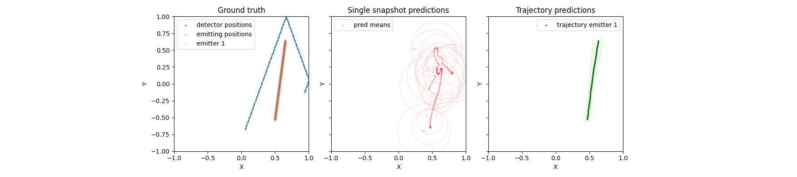

# Simulated data

This data has been generated by using the data generator included in this repository [ link ](/spf/dataset/spf_generate.py) (see [link](/spf/dataset/) for documentation).

## Baseline algorithm 

To illustrate a baseline algorithm , we can imagine multiple stationary emitters with a mobile receiver platform. At each step the receiver platform can estimate the angle of stationary emitter. Over time we can take the intersection of these angles (lines) maybe in Hough Space(?) and find the location of the emitters. 

But when we add a bit noise to the detector this algorithm quickly falls apart,

## Learning rate experiment

Testing out different learning rates. Here is an example of a trained network on test data. 

Left: Blue dots are receiver array movement, orange is emitter movement. Center: Predictions of emitter location based on a single sample in time of radio data. Right: Given radio data from multiple time steps predict the trajectory of the emitter.