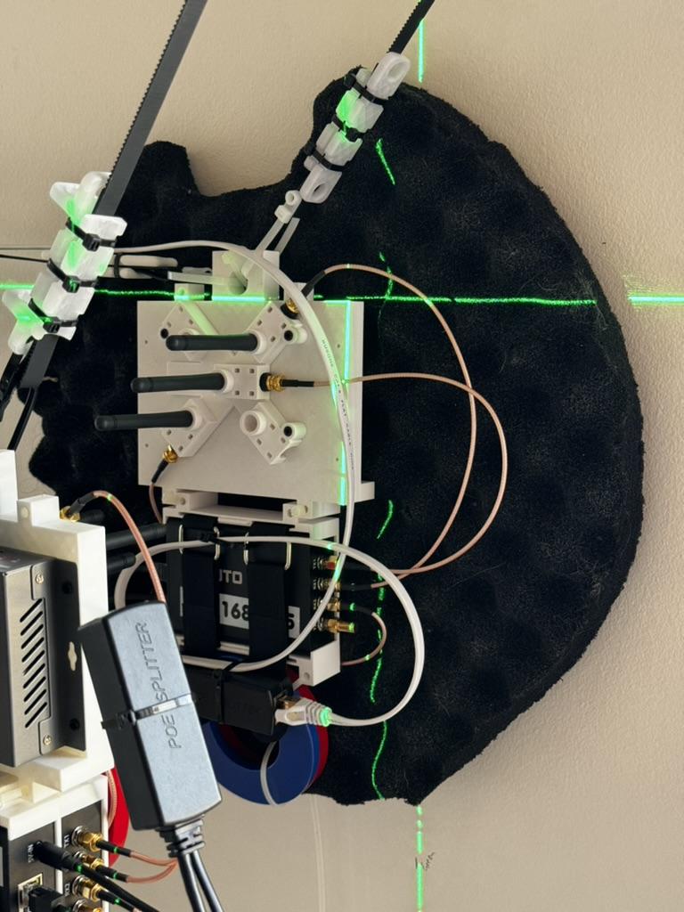
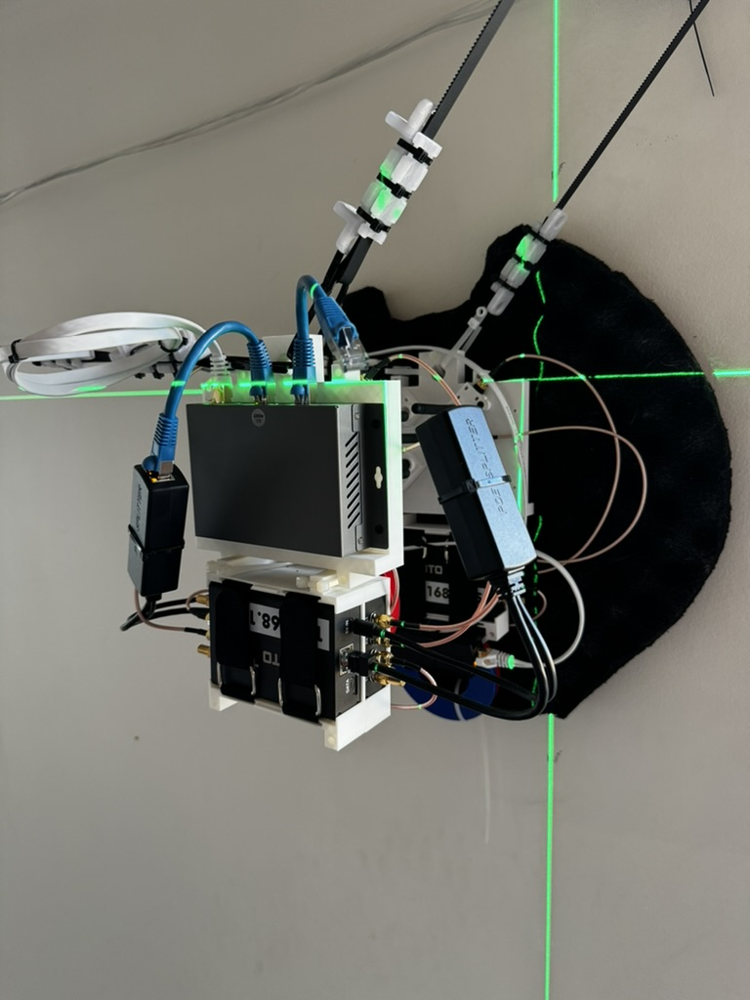

# 2D wall array (v2)

[see it in action!](https://youtube.com/shorts/b038KuCyPF4)

Instead of simulations we can collect real world data by moving a emitter around in 2D space while keeping our receiver in a fixed location.

This improves upon the 2D wall array v1 [link](/data_collection_experiments/2d_wall_array_v1/)

Improvements over v1 are:

* Two moving arrays (Emitter and Receiver vs stationary Receiver and moving Emitter)
* CAT6 cable runs power and data to each array
* Improved drivers for significantly reduced noise
* Emergency stop button
* Laser calibration
* 3D printed pulley mount

## Youtube explanation (v1)

[Overview](https://www.youtube.com/watch?v=vj99KvB2AcA)

[Wall array v1](https://youtu.be/ljlRKGjBUoE)

## Calibration

Calibrate array to a home point of (500,400) (part of the working boundary in the code). To calibrate use a laser level cross and align to origin. 

## Construction 

### 3D printed files

Can be found [here](3D_printed_parts)

### Bill of Materials

* 4 x 27:1 Planetary Gearbox Nema 17 Stepper Motor  [link](https://www.amazon.com/gp/product/B00WAUKZWG)
* 1 x ARM 32-bit 4 Axis GRBL 1.1f [link](https://www.amazon.com/gp/product/B09SZDTBHS)
* ? x Timing Belt 2GT 10mm Width[link](https://www.amazon.com/gp/product/B07PGHTSLT)
* 4 x GT2 Pulley 20 Teeth 5mm Bore Fit 10mm Belt Width[link](https://www.amazon.com/gp/product/B09X18H75P)
* 6 x GT2 Idler Pulley 20 Teeth 5mm Bore 10mm Width[link](https://www.amazon.com/gp/product/B07BPKX47Y)
* ? x 5mm rods [link](https://www.amazon.com/gp/product/B08M3MNB7B)
* 4 x 2.5lb weight [link](https://www.amazon.com/gp/product/B09NLFHMMH)
* 1 x Misc weights [link](https://www.amazon.com/gp/product/B0746NR6M5)
* M3 screws
* 2 x 3D printed dual motor mounts
* 1 x 3D printer dual pulley holder
* 3 x PlutoPlus SDR
* ? x 18/4 Awg cabling (for steppers) [link](https://www.amazon.com/gp/product/B01GZ50P7Q)
* 8 x bingfu 2.4ghz antenna [link](https://www.amazon.com/gp/product/B09J8N8TXW/)
* ? x SMA terminals [link](https://www.amazon.com/gp/product/B07G2PBZBL)
* ? x 12inch SMA Female -> Male [link](https://www.amazon.com/gp/product/B07MJQWH8S)
* 5 x TMC2208 motor drivers [link](https://www.amazon.com/gp/product/B082LSQWZF)
* 2 x CAT8 cable [link](https://www.amazon.com/gp/product/B07BH48VW4)
* 3 x PoE to USB power [link](https://www.amazon.com/gp/product/B01MDLUSE7)
* 1 x PoE injectory [link](https://www.amazon.com/gp/product/B09SXSN3XT)
* 1 x Passive PoE splitter [link](https://www.amazon.com/gp/product/B07F2RHLS1)
* 1 x PoE switch [link](https://www.amazon.com/gp/product/B0BX5L9G2W)
* 1 x 92mm fan [link](https://www.amazon.com/gp/product/B07LFZKCC6)
* 1 x 3D printed fan adapter
* 3 x 3D printed SDR holder
* 2 x 3D printed 5 point antenna array
* 1 x Emegency Stop button [link](https://www.amazon.com/gp/product/B07G76MMMZ)

