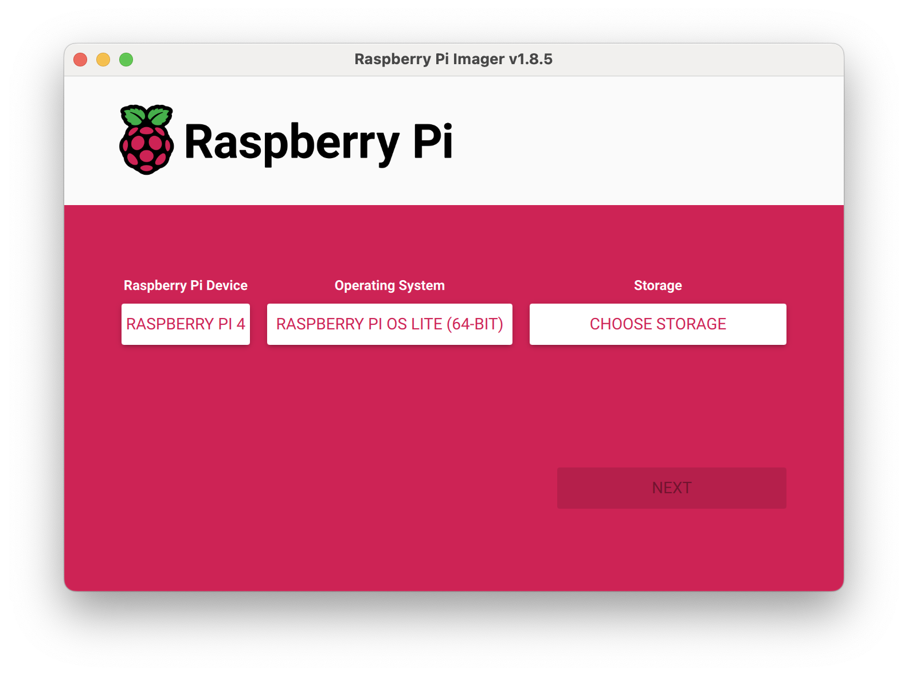
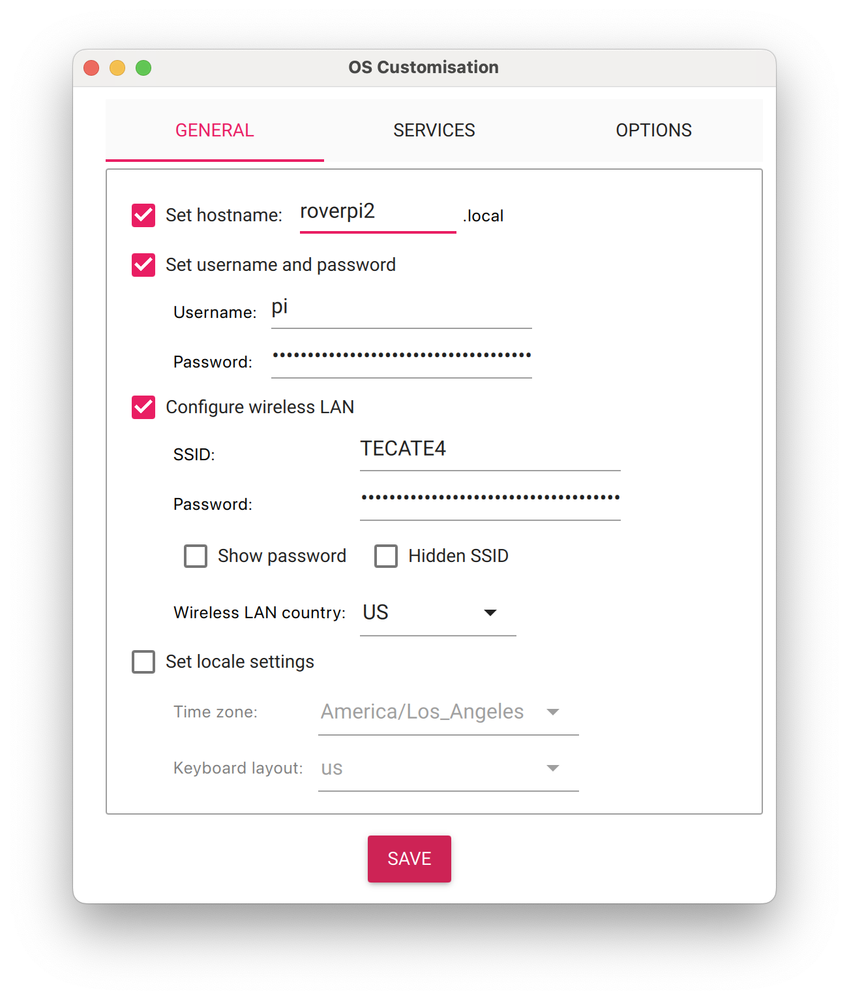

# 2D electric rover (v3.1)

Instead of simulations we can collect real world data by moving several rovers around autonomously in a field. Some rovers will transmit and others will listen and collect data.

## Design

Youtube [link](https://youtu.be/6D6IM0DY81c)

## Construction

### Flash rpi firmware






### Low power disconnect programming

```
press up to 5s +
press hold set 5s
use up down to set UP to 11.2v
press set
use up down to set DOWN to 11.1v
```

### Cytron Motor driver

Pins 3,4,6 set to high(1) rest to 0

MRB / MRA -> A motors
MLB / MLA -> B motors


### Battery compartment

Velcro include pictures


### USB port setup

```

USB  4     |     USB 3

USB  2   (Radio A)  |     USB 1 (Radio B)

Ethernet

```


### Ardupilot flash

Use mission planner windows
RPi script installs Arudpilot settings!

### PI setup

setup.sh

### Flash PlutoPlus

### SikRadio

[screen shot](./sikradio.jpg)
https://www.youtube.com/watch?v=i5lE2cWJJhM
Connect using mission planner
Set different NetIDs for each pair
Make sure to copy over settings
```
Rover 1 -> NetID 25
Rover 2 -> NetID 32
Rover 3 -> NetID 39
```

### Ardupilot calibration

Load base parameters

Accel calibration
Compass calibration
Change SYSID_THISMAV

Backup parameters


### Taranis Q setup

```
Setup (Internal RF)
XJT D16
Ch Range CH1-16

Binding
(change receiver #) and have previous drones online to make sure we dont over bind the channel
With receiver off, hold down F/S button, power on while holding, let go 1 second later
Solid green/red -> no connection
Press bind on controller, beeping starts
Flashing green/red -> connection established
Reset receiver
Press ok on controller
Try moving around controller sticks to see X8R light go green


Input 1 -> 100 Rud
Input 2 -> 100 Ele
Input 3 -> 100 Thr
Input 4 -> 100 Alie

CH 1 -> 100 Ail
CH 2 -> 100 Ele
CH 3 -> 100 Thr
CH 4 -> 100 Rud
CH 5 -> 100 SF -> Arm [ Disarm, Arm ]
CH 6 -> 100 S2
CH 7 -> 100 SD
CH 8 -> 100 SA -> Flight mode [ Manual , Guided, RTL ]
CH 9 -> 100 SH -> Shutdown [ Momentary -> shutdown ]
CH 10 -> 100 SC -> Mag calibration [ Nothing, Mag cal, Nothing ]

```


### 3D printed parts

See [here](https://www.dropbox.com/s/egpfn434aox6vvk/roverv3_3dparts.zip?dl=0)

## Lab checks

### SDR

Emit from an SDR

```
python sdr_controller.py --emitter-uri ip:192.168.1.15 --receiver-uri ip:192.168.1.17 --mode tx  --fc 2467000000
```

Receive frmo an SDR

```
python sdr_controller.py --receiver-uri usb:2.11.5 --mode rx --fc 2500000000 --rx-mode fast_attack
```

Use a fake drone and real configuration to receive

```
python mavlink_radio_collection.py -c rover_configs/rover_receiver_config_simulator.yaml -m device_mapping -r center --fake-drone
```

Use a fake drone and real configuration to emit (and receive)

```
python mavlink_radio_collection.py -c rover_configs/rover_emitter_config_pi_simulator.yaml -m device_mapping -r center --fake-drone
```

Can also use the above with a simulated drone [instructions](/spf/mavlink/README.md)


## Missions

### Lab check


### Mission 1

## PDFs

[GoBilda recon](https://www.dropbox.com/scl/fi/ks1fxsgilpyjsh96b6yut/gobilda_recon_assembly.pdf?rlkey=jf0m082piixa4lvxsqi4eruph&dl=0)

[Low power disconnect](https://www.dropbox.com/scl/fi/wmjql1251xnxs90oqn2jd/lower_power_disconnect_30A.pdf?rlkey=h3vitle22f5xrkcthws3yf8ft&dl=0)

[Cytron Smart duo 30](https://www.dropbox.com/scl/fi/eeqg87gi8wzy2aa1k1yx3/MDDS30_User_Manual.pdf?rlkey=xe49gu88bpqspxbg2dh6x139w&dl=0)

[Fans](https://www.dropbox.com/s/b4bna0s1yyfwyqa/cooler_guys_fan.pdf?dl=0)