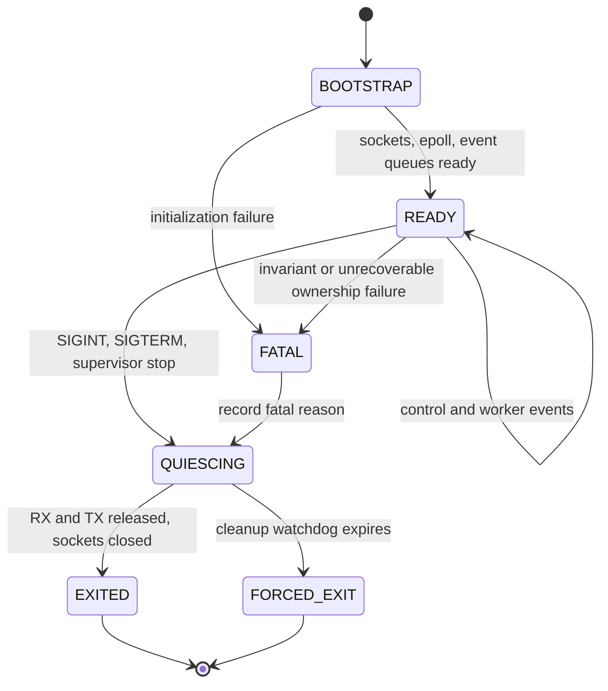
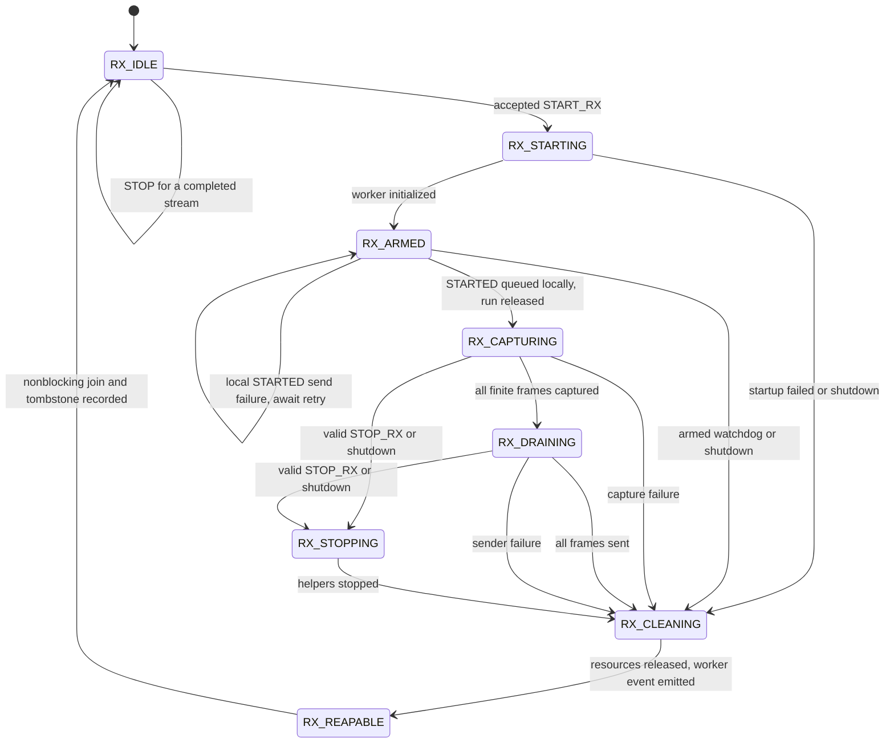
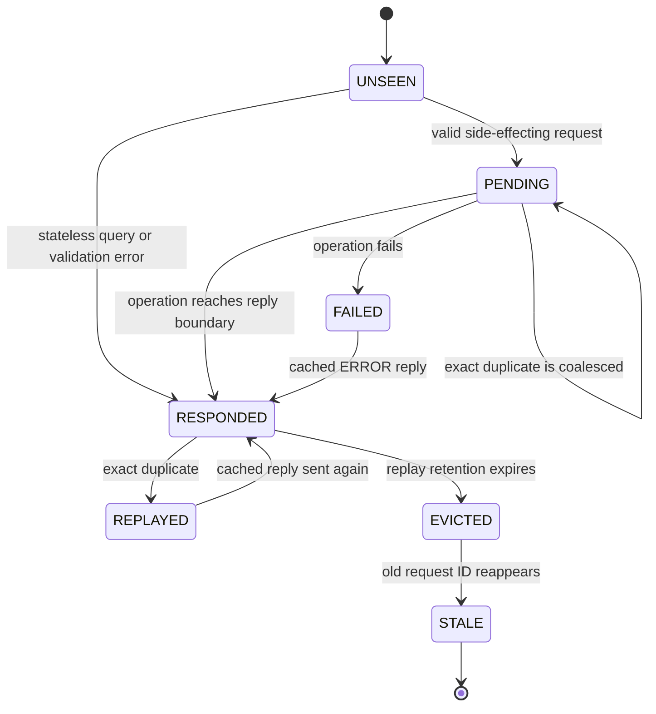
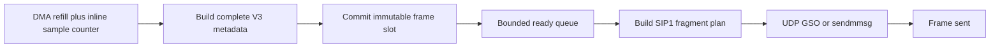
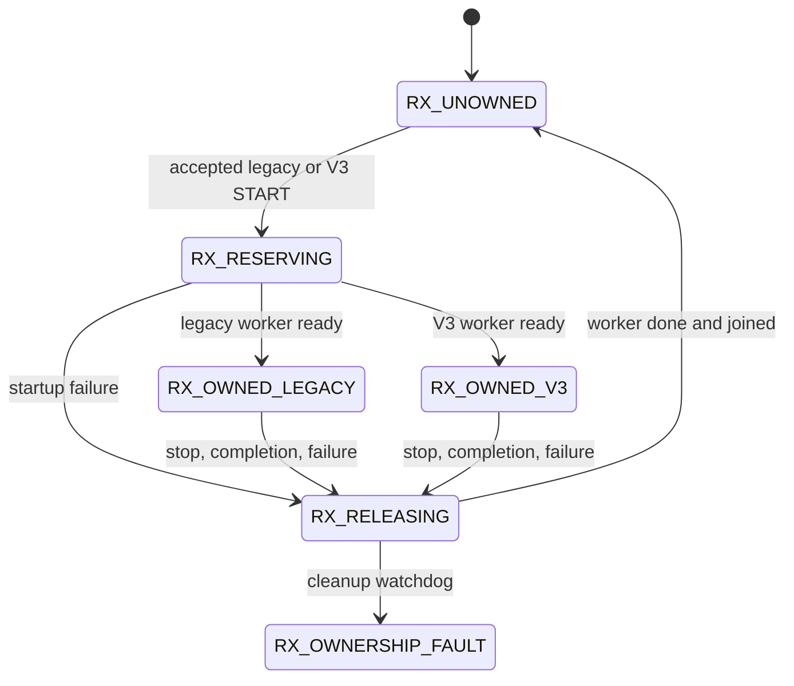
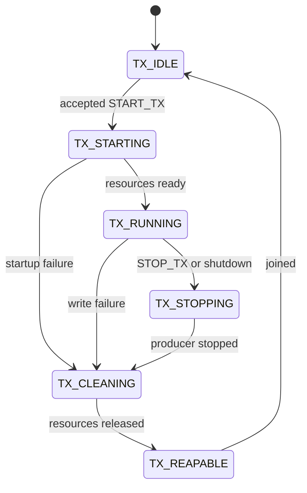

# Direct-IP firmware lifecycle and state-machine design

Status: RC17 source implements the non-blocking RX lifecycle, generation,
replay-ring, and stale-request core described here. RC16 does not. Cleanup
watchdogs, wire-level lifecycle telemetry, and a protocol client-session nonce
remain follow-up hardening work.

This document defines the required control-plane, RX-worker, replay, resource,
and shutdown behavior for the Pluto+ direct-IP gadget. It complements the
transport-neutral protocol-v3 frame definition in
[`direct_usb_gain_protocol_v3.md`](direct_usb_gain_protocol_v3.md). The
companion
[`direct_ip_firmware_state_machine_test_plan.md`](direct_ip_firmware_state_machine_test_plan.md)
defines the red/green tests and hardware promotion gates.

## Why this exists

The RC16 gadget correctly transferred bounded protocol-v3 frames, but a new
two-radio rate ladder exposed a lifecycle failure. With four 524,288-sample
frames per request, both radios could complete one or two low-rate requests and
then fail to acknowledge the next `START_RX`. The same frames remained intact
through 30 MS/s, with no application or kernel UDP errors.

The current implementation performs worker startup and shutdown synchronously
inside the UDP control handler. In particular, `STOP_RX` can block in
`pthread_join()` while the worker stops helper threads, restores timestamp
state, destroys the IIO buffer, and destroys the local IIO context. Low sample
rates make DMA-buffer teardown relatively slow. A 0.5-second host timeout can
therefore produce retransmitted requests and queued duplicate responses.

The exact stale-response sequence remains a hypothesis until confirmed with
on-device lifecycle timestamps or a deterministic injected-delay test. The
design below removes the entire class of blocking, duplicate-side-effect, and
stale-generation failures rather than relying on a longer timeout.

## Goals

1. Keep the UDP control socket responsive during RX startup, capture, drain,
   cleanup, and failure recovery.
2. Execute each logical request at most once while allowing safe UDP retries.
3. Never acknowledge `STARTED` until the stream is ready to run.
4. Never acknowledge `STOPPED` until DMA and all IIO resources are released.
5. Never allow two RX implementations to own `cf-ad9361-lpc` simultaneously.
6. Preserve the same protocol-v3 inner frame over direct USB and direct IP.
7. Clean up automatically when a finite request completes or its client
   disappears.
8. Fail closed and let the supervisor restart the daemon if ownership cannot
   be released safely.
9. Keep queries, diagnostics, and safe time anchors responsive in every state.
10. Make every state transition and failure visible through bounded counters
    and structured debug logs.

This state machine does not increase the measured direct-IP payload ceiling.
Throughput profiling and optimization are a separate workstream.

## One state enum is not enough

The firmware should model five cooperating machines:

1. **Process lifecycle**: sockets, event loop, shutdown, fatal recovery.
2. **RX session lifecycle**: start, capture, drain, cleanup, completion.
3. **Control request lifecycle**: unseen, pending, responded, replayed, stale.
4. **Frame pipeline**: DMA fill, metadata build, queued frame, UDP drain.
5. **Resource ownership**: legacy RX, protocol-v3 RX, and no owner.

TX has its own lane. RX and TX may coexist only when the advertised hardware
capability and implementation explicitly support it; legacy RX and v3 RX are
always mutually exclusive.

## Process lifecycle



The main thread owns process, control, and resource state. It must not call a
potentially blocking IIO teardown or wait for a running worker. `pthread_join()`
is allowed only after a generation-tagged worker completion event says that
the worker has finished cleanup.

`FORCED_EXIT` means the daemon exits non-zero. It does not reuse uncertain DMA
or IIO state. The on-device supervisor may then restart the daemon.

## RX session lifecycle



### State responsibilities

| State | Main-thread view | Worker responsibility | Permitted exit |
| --- | --- | --- | --- |
| `RX_IDLE` | No RX owner; arguments may be changed | None | Accept one new start |
| `RX_STARTING` | Start request is pending | Allocate resources, configure timestamping, start helpers, discard startup DMA block | Armed or cleaning |
| `RX_ARMED` | Worker is ready but not yet running | Wait on generation-specific run gate | Capturing or cleaning |
| `RX_CAPTURING` | Active stream ID is visible | Refill DMA, build complete frames, fill bounded slots | Draining, stopping, or cleaning |
| `RX_DRAINING` | Finite capture is closed to new DMA | Send only fully built frames with pacing | Cleaning or stopping |
| `RX_STOPPING` | Stop request or shutdown is pending | Stop capture and sender without exposing partial frames | Cleaning |
| `RX_CLEANING` | No new owner may start | Join helpers, restore registers, destroy buffer/context, free generation allocations | Reapable or fatal timeout |
| `RX_REAPABLE` | Completion event carries generation and outcome | Thread has returned or is about to return | Nonblocking join |

The worker emits `READY` only after all resources are valid. The main thread
prepares `STARTED` and only opens the run gate after `sendto()` has accepted the
reply locally. A local send failure leaves the generation armed with the same
prepared response; an exact retry can send it and release the run gate. An
armed-response watchdog cleans the generation if the peer never succeeds.
Once `sendto()` succeeds, packet loss is handled by replaying the byte-identical
cached `STARTED`, including the original stream ID.

Natural completion is not a leak. After the last finite frame is sent, the
worker cleans itself and emits `DONE`. The main thread records a completed
stream tombstone so a later `STOP_RX` for that stream can return `STOPPED`
without affecting a newer stream.

## Control request and replay lifecycle



### Request identity

For control v1, request identity is:

```text
(source IP, source UDP port, request_id, exact request bytes)
```

The firmware needs a bounded replay ring, not only the most recent request.
Each entry stores the request hash or bytes, response bytes, operation state,
stream ID, generation, and expiry. Sixteen entries per active peer is a
reasonable initial bound and must be tested under wrap and eviction.

A future control version should add a random non-zero `client_session_id`.
That removes ambiguity when a host process restarts and happens to reuse a UDP
source port and request ID before the old replay window expires. Until then,
peer records require a bounded inactivity timeout and conservative stale-ID
handling.

### Idempotency rules

- An exact duplicate of a pending START or STOP is coalesced; it does not
  create another worker, stop signal, or pending reply.
- An exact duplicate of a completed request receives the byte-identical cached
  response, including the original stream ID.
- The same peer and request ID with different bytes returns `-EALREADY` and has
  no side effect.
- A request older than the retained high-water mark returns `-ESTALE` and has
  no side effect.
- A delayed START can never create a second stream after its original STOP.
- Response-send failure does not duplicate or roll back a completed STOP. Its
  response remains available for a retry. A START whose response was not
  locally queued remains armed and does not produce IQ until a retry succeeds.
- Replay entries are bounded. Eviction never makes an old side-effecting
  request executable again.

UDP duplicates are normal. Suppressing all duplicate replies is incorrect
because the original reply may have been lost.

### Generations, stream IDs, and tombstones

Three identifiers have different jobs:

| Identifier | Scope | Rule |
| --- | --- | --- |
| Process nonce | One daemon lifetime | Random/non-repeating; distinguishes restart traffic and logs |
| Worker generation | One local worker attempt | Monotonic and never reused within the process |
| Stream ID | One successfully armed stream | Non-zero, returned in `STARTED`, present in every data fragment |

Startup failure consumes a generation but does not create a usable stream.
Stream-ID wrap or collision within retained tombstones is fatal rather than an
excuse to reuse an ambiguous ID.

Keep a bounded completed-stream tombstone ring containing stream ID,
generation, peer/session identity, terminal outcome, final counters, and STOP
response. A STOP for a tombstoned stream can be answered without touching the
current owner. Tombstone eviction preserves enough high-water information to
reject delayed traffic rather than executing it as new.

## Control behavior by RX state

| Request/event | Idle | Starting/armed | Capturing/draining | Stopping/cleaning | Reapable/completed |
| --- | --- | --- | --- | --- | --- |
| Capability query | Reply | Reply | Reply | Reply | Reply |
| Safe time anchor | Reply or explicit unsupported error | Reply if register access is safe | Reply if non-perturbing | Reply if safe; otherwise `-EBUSY` | Reply |
| Exact duplicate pending request | Coalesce/replay | Coalesce | Coalesce/replay | Coalesce | Replay |
| New START | Accept | `-EBUSY` | `-EBUSY` | `-EBUSY` | Accept after reap |
| STOP for active stream | `-ENOENT` unless completed tombstone matches | Defer cancellation internally | Begin stopping | Coalesce | Reply `STOPPED` |
| STOP for completed old stream | Reply from tombstone | Reply without touching new generation | Reply without touching active generation | Reply without touching cleanup | Reply |
| STOP with wrong stream ID | `-ENOENT` | `-ENOENT` | `-ENOENT` | `-ENOENT` | `-ENOENT` |
| Malformed datagram | Drop/count or bounded `-EINVAL` | Same | Same | Same | Same |
| Legacy RX START | Accept only if idle | `-EBUSY` | `-EBUSY` | `-EBUSY` | Accept after reap |
| Process shutdown | Quiesce | Cancel and clean | Stop and clean | Continue clean | Reap and exit |

A host cannot normally issue STOP before receiving the assigned stream ID. If
the client disappears during STARTING or ARMED, a startup watchdog must cancel
the generation. Conflicting requests are never silently queued.

### Delayed-cleanup sequence

```mermaid
sequenceDiagram
    participant H as Host
    participant C as Control loop
    participant W as RX worker

    H->>C: STOP_RX request R
    C->>W: generation-tagged quit
    Note over C: record R as pending; do not block
    H->>C: duplicate STOP_RX request R
    C-->>C: coalesce R; no second side effect
    H->>C: duplicate STOP_RX request R
    C-->>C: coalesce R; no second side effect
    W->>W: release sender, sampler, DMA, IIO context
    W-->>C: WORKER_DONE(generation, stream)
    C->>C: join, tombstone, cache response
    C-->>H: STOPPED for R
    H->>C: START_RX request R+1
    C->>W: create next generation
```

The main loop can answer capability queries while the worker cleans. A new
START during cleanup receives `-EBUSY`; it is not queued implicitly.

## Worker event channel

Do not overload a shared eventfd counter with event type. Use a bounded
single-producer/single-consumer event queue plus eventfd notification, or an
equivalent pipe/socketpair carrying fixed records:

```c
typedef enum {
    SPF_RX_EVENT_READY,
    SPF_RX_EVENT_START_FAILED,
    SPF_RX_EVENT_CAPTURE_COMPLETE,
    SPF_RX_EVENT_DRAIN_COMPLETE,
    SPF_RX_EVENT_WORKER_DONE,
    SPF_RX_EVENT_WORKER_FAILED,
} spf_rx_event_type_t;

typedef struct {
    uint64_t generation;
    uint64_t stream_id;
    spf_rx_event_type_t type;
    int32_t status;
    uint32_t reserved;
} spf_rx_event_t;
```

Every command and event is generation-tagged. An event from an old generation
is counted and ignored; it can never release or mutate a newer stream. Run,
quit, startup, and completion notifications must be drained or created per
generation so stale eventfd counts cannot arm the wrong worker.

## Frame pipeline



### Frame invariants

1. A slot becomes visible to the sender only after header, CRC, and IQ are
   complete.
2. A slot is immutable while queued or being sent.
3. Sender failure never exposes a partial frame as successful. The host outer
   CRC and bounded reassembler discard incomplete frames.
4. `buffer_sequence` is contiguous within a stream. `stream_id` and generation
   distinguish late datagrams from new captures.
5. Capture-first mode stops adding DMA buffers after the declared finite frame
   count, then drains exactly those slots.
6. Queue full, observation overflow, IIO overflow, short refill, and partial
   send are explicit outcomes, never silent truncation.
7. All frame slots, fragment records, and steady-state metadata arrays are
   allocated before capture begins with checked integer arithmetic.
8. A STOP during drain prevents unsent frames from being represented as sent;
   the session outcome records cancellation.

## Resource ownership



`RX_RESERVING`, `RX_OWNED_*`, and `RX_RELEASING` are exclusive. The arguments
structure, local IIO context, RX buffer, timestamp register, gain sampler,
sender, and frame slots belong to one generation until its worker is joined.
The main thread must not overwrite a shared argument structure while any old
worker can still read it.

Cleanup order is part of the contract:

1. prevent new DMA refills;
2. stop and join the sender before freeing frame slots;
3. stop and join the gain sampler before destroying the PHY/context;
4. restore timestamp-control state while the device is valid;
5. destroy the IIO buffer and release DMA;
6. destroy the local IIO context;
7. close generation-owned descriptors and free allocations;
8. emit `WORKER_DONE` and return;
9. main thread joins and releases ownership.

If cleanup exceeds its watchdog or an ownership invariant fails, exit the
daemon. Do not claim `RX_UNOWNED` and attempt another capture.

## TX lane

The existing IP gadget also has a legacy direct-TX lane. It should use the same
non-blocking lifecycle pattern:



RX and TX resource ledgers remain separate. If simultaneous operation is not
explicitly supported, advertise that fact and return `-EBUSY`; do not obtain
accidental concurrency. Stopping the gadget TX path must destroy its TX buffer.
RF mute remains an explicit radio-configuration safety action and must still be
verified by the host.

## Deadlines and watchdogs

Timeouts are state deadlines, not sleeps in the control handler.

| Deadline | Initial policy | Failure action |
| --- | --- | --- |
| Worker startup | Buffer duration plus initialization margin, capped | Cache `ERROR`, clean generation |
| Host run release | Short bounded interval after `STARTED` send | Cancel and clean |
| Finite capture | Expected frame duration plus bounded margin | Stop, mark capture timeout |
| UDP drain | Payload divided by minimum qualified drain rate plus margin | Stop sender, mark drain timeout |
| Cleanup | Long enough for the slowest supported DMA buffer | Exit daemon on expiry |
| Pending control peer | Bounded inactivity interval | Cancel unarmed generation |
| Replay retention | Longer than maximum retry horizon | Evict to stale tombstone/high-water mark |

The supported minimum sample rate and maximum buffer size determine the worst
DMA teardown time. Tests must include that corner rather than tuning deadlines
only at 30 MS/s.

## Errors and observability

Use stable negative errno-style status values in `ERROR` replies:

| Status | Meaning |
| --- | --- |
| `-EINVAL` | Malformed or semantically invalid request |
| `-EPROTONOSUPPORT` | Unsupported control or frame protocol |
| `-EBUSY` | Conflicting operation while a generation owns or releases RX |
| `-ENOENT` | Unknown stream ID |
| `-EALREADY` | Request-ID collision with different bytes |
| `-ESTALE` | Request predates the retained replay window |
| `-ENOMEM` | Bounded allocation failed before capture |
| `-ETIMEDOUT` | Startup, capture, drain, or cleanup deadline exceeded |
| `-EIO` | IIO, sender, helper-thread, or invariant failure |
| `-ECANCELED` | Valid request canceled by shutdown or explicit stop |

At minimum, expose or log monotonically increasing counters for:

- accepted, coalesced, replayed, collided, stale, and malformed requests;
- state transitions and time spent in every lifecycle state;
- startup, capture, drain, cleanup, and join duration;
- worker generations created, completed, canceled, failed, and ignored stale
  events;
- IIO refill errors/overflows and timestamp restore failures;
- frames captured, queued, sent, canceled, and partially attempted;
- UDP send retries/errors and GSO fallback;
- replay-cache occupancy/evictions;
- watchdog expirations and supervisor-triggering fatal exits.

Every transition log should include process nonce, peer, request ID,
generation, stream ID, old state, new state, status, and monotonic timestamp.
Do not log at packet rate in production.

## Cross-plane rules

- Standard IIO/pyadi may configure the radio before direct capture but must not
  start a competing IIO RX stream.
- LO, sample rate, bandwidth, scan mask, and gain mode remain fixed for one
  direct stream unless a future protocol defines transactional reconfiguration.
- Capability queries remain safe while streaming.
- Time-anchor reads may run while streaming only if they are non-perturbing and
  bounded. Otherwise return `-EBUSY` explicitly.
- Direct USB and direct IP may share serialization code, but only one may own RX
  DMA on a radio at a time.
- Late UDP IQ from an old stream is harmless because the host keys reassembly
  by peer, stream ID, and frame sequence.

## Hazard audit

| Hazard | Required prevention | Proof |
| --- | --- | --- |
| Control loop blocks in startup or join | Worker events and asynchronous pending operations | Inject startup/cleanup delays above retry timeout |
| Duplicate START creates two workers | Pending coalescing and replay cache | Count worker creations under duplicate flood |
| Duplicate STOP signals cleanup twice | Pending coalescing | Count quit signals and joins |
| Late old START restarts a stopped stream | Replay window plus stale high-water mark | Reorder START after its STOP |
| Old STOP terminates a new stream | Stream/generation match and tombstones | Deliver old STOP during new capture |
| Request ID reused with different body | Exact-byte/hash collision check | Return `-EALREADY`, zero side effects |
| Host restarts on same UDP port | Client session ID in future control version; conservative v1 expiry | Simulate same peer and reset request IDs |
| Lost STARTED or STOPPED | Cache operation result before/with reply; exact replay | Drop first response |
| Failed response send rolls back real state | State and replay entry survive send failure | Inject `sendto()` failure then retry |
| Natural finite completion is never reaped | Worker-done event and idle tombstone | Complete without STOP, then start again |
| Stale eventfd count arms new worker | Per-generation gates or explicit drain | Preload old run/quit notification |
| Late worker event mutates new stream | Generation and stream validation | Inject old READY/DONE event |
| Worker joined or freed twice | Main-owned join flag and resource ledger | Race STOP, DONE, and shutdown |
| Shared args overwritten while worker reads | Generation-owned immutable arguments | Start conflicting generation under sanitizer |
| Sender reads freed frame slot | Join sender before freeing slots | Stop during drain under ASan/TSan |
| Sampler reads destroyed PHY/context | Join sampler before context destruction | Fail cleanup at every boundary |
| Timestamp register left modified | Tracked previous value and ordered restore | Fail after register write; verify restore |
| Partial frame represented as valid | Immutable commit point, outer CRC, bounded reassembly | Fail every fragment offset |
| Integer overflow or excessive allocation | Checked sizes and protocol maxima before allocation | Boundary/fuzz tests |
| Queue or event channel exhaustion | Fixed capacity, explicit failure, fatal if ownership uncertain | Fill each queue deliberately |
| Sender or DMA stalls forever | State-specific watchdogs | Freeze fake sender/refill |
| Cleanup watchdog expires | Non-zero daemon exit; supervisor recovery | Inject stuck teardown |
| Malformed control flood starves DONE | Bounded per-epoll control budget and event priority/fairness | Flood while worker completes |
| Time-anchor read races teardown | State-aware bounded access or `-EBUSY` | Query at every lifecycle state |
| Legacy RX and v3 RX own DMA together | One RX ownership ledger | Cross-start both protocols |
| Direct USB and direct IP own DMA together | One transport owner per radio, enforced/declared | Attempt simultaneous transports |
| TX and RX concurrency is accidental | Separate ledgers and explicit capability | Cross-start with and without capability |
| Shutdown leaves DMA or socket ownership | Quiesce path from every state | Signal process at every transition |
| Daemon restart accepts old traffic | Process nonce/session identity and stale rejection | Replay pre-restart datagrams |
| Stream or generation counter wraps | Collision check and fatal reinitialization | Forced near-wrap native test |
| Diagnostics hide the original cause | Structured transition/counter records | Verify artifact contains terminal outcome |

## Required implementation order

1. Add a pure transition model and native table-driven tests.
2. Add generation-tagged worker event delivery and resource ledger assertions.
3. Make natural worker completion observable and reap it without blocking.
4. Convert START startup to an asynchronous pending operation.
5. Convert STOP cleanup to an asynchronous pending operation.
6. Add pending-request coalescing and the bounded replay window.
7. Add deadlines, fatal cleanup behavior, counters, and structured logs.
8. Apply the same ownership rules to legacy RX and the TX lane.
9. Run synthetic loss/delay/reorder tests.
10. Build a new firmware RC and run the companion hardware test plan from RAM.

Do not change the RC16 tag. A successful implementation must be a new,
checksum-pinned release candidate with its exact IP-gadget source commit
recorded.
