# Theoretical versus empirical phase/bearing likelihoods — all-key audit

**Date:** 2026-08-25
**Scope:** all 48 keys and all 288 stored variants in
`empirical_dists/full_20260809_v1.pkl`, plus the 44-key `full.pkl` baseline.
**Method:** read-only analysis of both PKLs and all 2,445 provenance-pinned source
datasets. The existing PKLs and source datasets were not modified.

## Executive answer

Yes: there is a clean theoretical representation. For a two-element array with
spacing ratio \(\rho=d/\lambda\), the repository's actual coordinate convention is

\[
\boxed{\mu_\rho(\theta)=
\operatorname{wrap}\left[-2\pi\rho\sin\theta\right]}.
\]

Adding circular phase noise gives a likelihood \(P(\phi\mid\theta)\). With a uniform
bearing prior, Bayes' rule converts it to the same orientation as the pickle,
\(P(\theta\mid\phi)\). This model matches the major empirical ridges, their wrapping,
and their required front/back and spatial aliases. It is not, by itself, a complete
model of the tables.

The strongest conclusions are:

1. **The theoretical sign and geometry are correct.** The negative sign above beats the
   opposite sign for **48/48 keys**. On the production `r/sym` tables, nominal geometry
   plus one fitted circular-noise width has mean row TV **0.247** and correlation
   **0.727**. The opposite sign is essentially a negative control, not a plausible
   alternative.
2. **Simple calibration explains a substantial fraction of the remaining structure.**
   Fitting effective spacing gain \(g\), mount shift \(\delta\), constant phase offset
   \(c\), and phase-noise width lowers production-table TV to **0.175** and raises
   correlation to **0.843**. It improves 47/48 production keys, despite being fitted to
   the nonsymmetric table rather than directly to production `sym`.
3. **The empirical tables are much broader and more corpus-specific than ideal array
   theory.** The pooled nonsymmetric comparison improves from uniform TV **0.593**, to
   nominal theory **0.411**, to calibrated theory **0.275**. The residual is structured,
   not just white phase noise.
4. **Multimodality is expected.** Twenty-seven of 48 keys have \(d/\lambda>0.5\) and are
   spatially aliased. Depending on spacing and phase, the ideal inverse contains 2–8
   bearing solutions. Multiple ridges above \(0.5\) are not evidence of a broken fit.
5. **Sparse support and capture/device state explain the worst keys better than wavelength
   alone.** `PLUTO_0.56296` has only one source dataset and is worst; `PLUTO_0.90397` has
   six datasets and only 36.9% valid phase yield. Source count has Spearman correlation
   **−0.595** with production calibrated TV.
6. **The producer has two confirmed coordinate/discretization defects.** Auto-inferred
   histogram edges are discarded, although consumers assume `[-pi,pi]`; this is a large
   effect for `PLUTO_0.91964/r0` but not a global explanation. Separately, the 65-bin
   integer symmetry fold changes an already symmetric ideal model by TV **0.032–0.200**
   over the observed spacing range.
7. **The pickle is a posterior, not a sensor likelihood.** It stores
   \(P(\theta\mid\phi,\text{detected},\text{corpus})\), while particle filters multiply
   it as though it were \(P(\phi\mid\theta)\). Corpus bearing and detection priors are
   therefore injected into filter updates.

The practical reading is: **the wavelength/spacing theory is decisively present in the
data, but the shipped tables combine it with calibration offsets, capture priors,
selection effects, radio/corpus differences, multipath, sparse support, and producer
coordinate transforms.** A calibrated theoretical likelihood is a credible fallback or
regularizer, but these in-sample fits are not yet a replacement calibration.

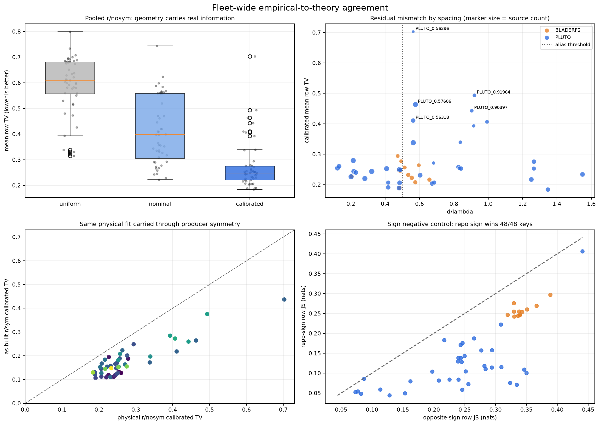

## 1. Inputs and completeness

| Input | Keys | Role | SHA-256 |
|---|---:|---|---|
| `empirical_dists/full_20260809_v1.pkl` | 48 | current table | `96b604799022d5139f5a1c7568cad0840dbcb90c8c5e3e4f4d03350108c01f84` |
| `empirical_dists/full.pkl` | 44 | previous baseline | `14bfe8026cdf266543679c2994571c3c687fc5887cef488ad65700971a26ae72` |

The current artifact contains 36 Pluto keys and 12 bladeRF keys, covering 45 unique
spacing ratios. It stores six variants per key:

```
r0/nosym  r0/sym  r1/nosym  r1/sym  r/nosym  r/sym
```

The report's primary physical target is pooled `r/nosym`; the production default is
pooled `r/sym`. The supplementary variant CSV evaluates all 288 matrices with the same
per-key pooled physical fit so radio disagreement remains visible rather than being
re-fitted away.

The embedded provenance requests 2,499 source stores and records 2,445 loaded. A second
read-only source pass successfully reopened all 2,445 recorded contributors and matched
all 48 per-key source counts. The existing rebuild report's statement that 43 sources lack
segmentation is inaccurate: embedded provenance records **53 missing segmentations plus
one spacing assertion failure**.

## 2. The theoretical representation

### 2.1 Forward likelihood

For measured phase \(\phi\), bearing \(\theta\), and circular concentration \(\kappa\),
the nominal model is

\[
P(\phi\mid\theta,\rho,\kappa)=
\frac{\exp\{\kappa\cos[\phi-mu_\rho(\theta)]\}}
     {2\pi I_0(\kappa)},\qquad
\mu_\rho(\theta)=\operatorname{wrap}[-2\pi\rho\sin\theta].
\]

The negative sign is implemented in
[`spf_dataset.py`](../spf/dataset/spf_dataset.py#L1525). Raw phase is receiver channel
0 minus channel 1. The positive sign written in the previous rebuild report is a plotting
interpretation error: its images used Matplotlib's default upper origin, visually
reversing phase.

The calibrated descriptive model is

\[
\mu(\theta)=\operatorname{wrap}
\left[c-2\pi g\rho\sin(\theta-\delta)\right],
\]

where \(g\) is effective spacing/phase gain, \(\delta\) is an angular shift, and \(c\) is
a phase offset. This is the same low-dimensional systematic model already used in
[`dataset_quality_scan.py`](../spf/scripts/dataset_quality_scan.py#L9).

### 2.2 Converting likelihood to the stored posterior

The current builder stores matrix rows as

\[
Q_{j,i}=P(\theta\in i\mid\phi\in j),
\]

by normalizing the joint histogram over theta and transposing it in
[`create_empirical_p_dist.py`](../spf/scripts/create_empirical_p_dist.py#L123). A
theoretical matrix requires a bearing/detection prior \(\pi_i\):

\[
Q^{\mathrm{theory}}_{j,i}=
\frac{\pi_i P(\phi\in j\mid\theta\in i)}
     {\sum_\ell \pi_\ell P(\phi\in j\mid\theta\in \ell)}.
\]

The main comparison uses a uniform \(\pi\), deliberately testing geometry rather than
reproducing the corpus trajectory. The raw-source audit separately tests the actual valid
frame prior.

### 2.3 Aliasing is part of the expected answer

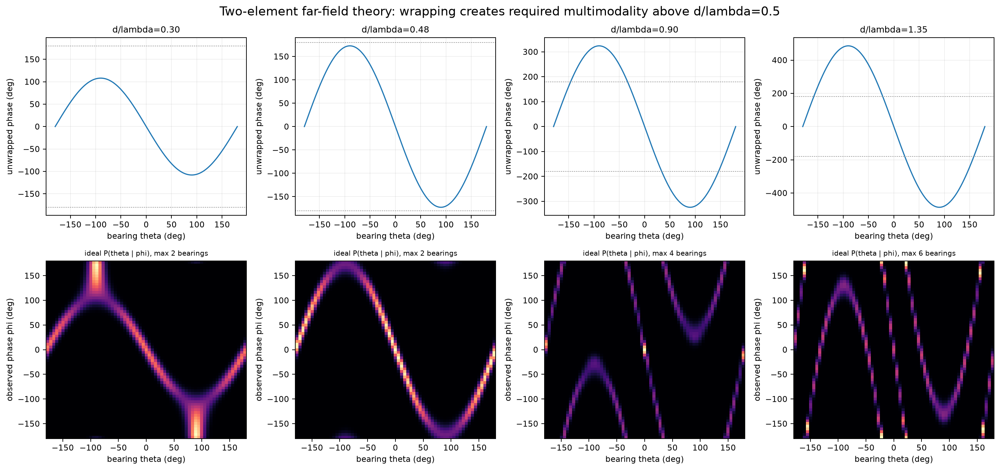

| Spacing class | Current keys | Feasible spatial orders | Maximum bearing modes |
|---|---:|---:|---:|
| \(\rho\le0.5\) | 21 | 1 | 2 front/back |
| \(0.5<\rho<1\) | 22 | 1–2 | 2–4 |
| \(1\le\rho<1.5\) | 4 | 2–3 | 4–6 |
| \(\rho=1.54880\) | 1 | 3–4 | 6–8 |

The inverse branches follow from

\[
s_k=\frac{c-\phi-2\pi k}{2\pi g\rho},\quad |s_k|\le1,
\]

followed by the two front/back solutions of \(\sin(\theta-\delta)=s_k\). Thus a broad or
multimodal posterior at high spacing is physically necessary; the question is whether its
mass lies on the correct branches.

## 3. Comparison method

The report uses 65 fixed phase and bearing bins over `[-pi,pi]`, matching runtime consumer
coordinates. The midpoint matrix approximation changes mean TV by only **0.0006** versus
explicit sub-bin integration in a full all-key check, so it is not responsible for the
observed residuals. The symmetry-only diagnostic uses 9×9 sub-bin integration because
binning error is the quantity being measured there.

For each key:

1. Fit nominal \(\kappa\) to pooled `r/nosym`.
2. Fit \((g,\delta,c,\kappa)\) to the same matrix using deterministic differential
   evolution and mean row Jensen–Shannon divergence.
3. Evaluate total variation (primary), Jensen–Shannon divergence, flattened correlation,
   MAP-bin agreement, and model parameters.
4. Apply the repository's exact joint-histogram symmetry transform to the same fitted
   theory and compare it with `r/sym`; do not fit the production transform separately.
5. Carry the same per-key fit into `r0`, `r1`, `nosym`, and `sym` for all-variant
   diagnostics.

Mean row TV is

\[
\overline{TV}=\frac1{|J|}\sum_{j\in J}
\frac12\sum_i|Q_{j,i}-T_{j,i}|,
\]

where \(J\) is the set of nonempty empirical phase rows. Zero is identical and one is
disjoint. Every phase row is weighted equally because the PKL discards phase-bin counts;
operational phase-frequency weighting requires raw joint counts.

All fits are descriptive and in-sample. At aliased spacings or narrow bearing coverage,
\(g\), \(c\), and \(\delta\) are not uniquely identifiable. A fitted \(g\) is an effective
response, not proof the physical antenna spacing is wrong.

## 4. Aggregate results

| Target and model | Mean TV | Median TV | Mean corr | Interpretation |
|---|---:|---:|---:|---|
| `r/nosym`, uniform | 0.593 | 0.610 | — | no geometric information |
| `r/nosym`, nominal | 0.411 | 0.398 | 0.545 | ideal spacing/sign + fitted noise |
| `r/nosym`, calibrated | **0.275** | **0.249** | **0.751** | fit \(g,\delta,c,\kappa\) |
| production `r/sym`, nominal | 0.247 | 0.266 | 0.727 | nominal passed through repo fold |
| production `r/sym`, calibrated | **0.175** | **0.155** | **0.843** | same physical fit passed through fold |

Calibration reduces mean nonsymmetric TV by 33.1% relative to nominal and production TV
by 29.3%. It improves all 48 nonsymmetric targets and 47/48 production targets. Relative
to a uniform posterior, the calibrated nonsymmetric model has mean TV skill **0.517** and
median skill **0.599**.

The fitted circular phase spread is broad: median **36.9°**, interquartile range
**25.6–49.2°**, and range **21.9–85.3°**. bladeRF has a much tighter fitted median
(25.1°) than Pluto (38.9°), but this comparison is confounded by corpus and environment.

The raw-source residual check independently reaches the same conclusion without fitting a
posterior matrix. For
\(r=\operatorname{wrap}[\phi+2\pi\rho\sin\theta]\), per-key circular σ has mean
**0.880 rad**, median **0.877 rad (50.3°)**, and range **0.444–1.500 rad**. The absolute
r0/r1 circular-bias difference has median **0.355 rad (20.3°)** and maximum
**1.849 rad (106°)**; large cases include `0.56296`, `0.56318`, `0.57606`, and
`0.21367`. This directly supports broad phase noise plus receiver/calibration-state
mixture. The production symmetry fold hides much of that asymmetry by construction.

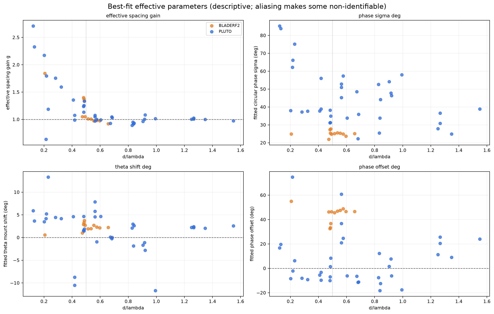

Low-spacing groups often need \(g>1\): the largest are Pluto 0.12208 (2.709), 0.13124
(2.327), 0.20114 (2.173), and bladeRF 0.20548 (1.842). Above approximately 0.5, fitted
\(g\) usually clusters near one. This is consistent with known wall-array effective-spacing
systematics, but low-spacing fits are also the least identifiable, so the values should be
treated as hypotheses for raw held-out calibration, not literal tape-measure corrections.

The full 48-row table is in [`ALL_KEYS_TABLE.md`](data/2026_08_25_empirical_dist_analysis/ALL_KEYS_TABLE.md), with the machine-
readable version in [`metrics_all_keys.csv`](data/2026_08_25_empirical_dist_analysis/metrics_all_keys.csv).

### 4.1 Calibration parameter distributions and configuration repeatability

The calibrated forward model used above is

\[
\phi_{\rm meas}=\operatorname{wrap}\left[
c-2\pi g\rho\sin(\theta-\delta)+\epsilon_\phi
\right].
\]

Here \(g\) changes the phase-versus-bearing slope, \(\delta\) shifts the bearing/mount
origin, \(c\) removes a constant receiver-path phase bias, and the fitted
\(\sigma_\phi\) controls likelihood width. These are descriptive fits to the pooled
`r/nosym` matrices, not independent metrology measurements.

#### How large do the key-level values get?

| Parameter | Ideal | Median [IQR] | 5–95% | Full range |
|---|---:|---:|---:|---:|
| Effective gain \(g\) | 1 | 1.027 [0.981, 1.275] | 0.917–2.057 | 0.634–2.709 |
| Bearing/mount shift \(\delta\) | 0° | 2.26° [0.91°, 3.87°] | −6.67°–5.86° | −11.67°–13.30° |
| Phase offset \(c\) | 0° | 10.17° [−6.57°, 36.76°] | −12.05°–52.82° | −18.17°–74.76° |
| Circular phase spread \(\sigma_\phi\) | 0° | 36.89° [25.58°, 49.20°] | 24.10°–72.01° | 21.89°–85.26° |

A 65-bin matrix has 5.54° bins. The median \(\delta\) is therefore about 0.41 bearing
bin, the median phase spread covers about 6.7 phase bins, and the largest fitted phase
offset is 13.5 phase bins. Phase offsets are circular; the mixed-fleet median is not a
universal correction.

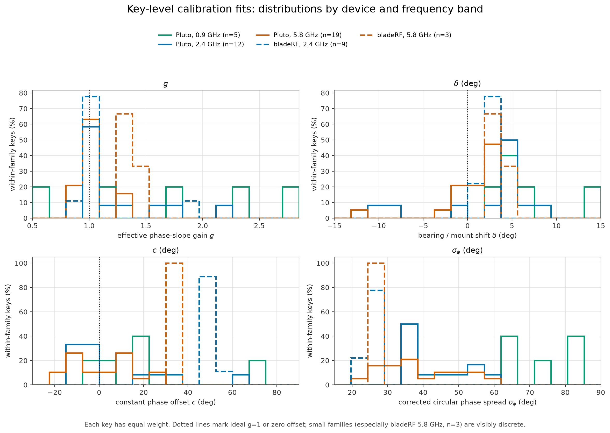

The device/band medians expose structure hidden by the fleet-wide histogram:

| Device / band | Keys | Sources | \(g\) | \(\delta\) | \(c\) | \(\sigma_\phi\) |
|---|---:|---:|---:|---:|---:|---:|
| Pluto, 0.9 GHz | 5 | 463 | 1.797 | 5.20° | 16.80° | 75.15° |
| Pluto, 2.4 GHz | 12 | 1,273 | 1.075 | 4.50° | −5.76° | 38.54° |
| Pluto, 5.8 GHz | 19 | 508 | 1.004 | 1.57° | 1.48° | 35.91° |
| bladeRF, 2.4 GHz | 9 | 138 | 1.007 | 2.14° | **46.68°** | **24.96°** |
| bladeRF, 5.8 GHz | 3 | 63 | 1.374 | 3.28° | **33.30°** | **27.35°** |

The clearest stable family signature is \(c\). Across bladeRF keys its median is 46.52°,
circular mean 44.37°, and circular standard deviation 6.38°. Pluto's corresponding
values are −0.30°, 5.54°, and 20.06°. Matched 25 mm / 5.8 GHz configurations retain a
roughly 28°–43° bladeRF-versus-Pluto offset, so this is not explained by
\(d/\lambda\). A deployable calibration should estimate \(c\) per radio/receiver path,
not only per spacing.

The extreme \(g\) values are concentrated where the fit is least identifiable. For
\(\rho\ge0.5\), \(g\) has median **0.998**, IQR **0.967–1.013**, and 5–95% range
**0.917–1.067**. Below 0.25, its median is 1.842. At low \(\rho\), the available phase
swing is small compared with 25°–85° noise, so \(g\), \(c\), \(\delta\), and corpus shape
trade off. The 2.709 maximum should not be interpreted as a literal 171% antenna-spacing
error.

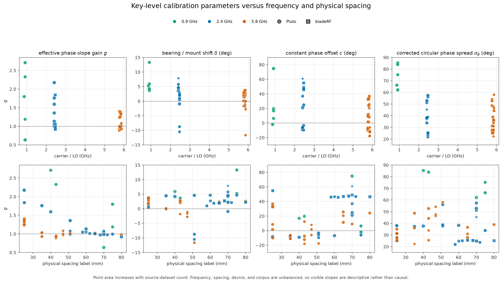

Unweighted 48-key Spearman associations are descriptive:

| Parameter | vs \(d/\lambda\) | vs frequency | vs physical spacing |
|---|---:|---:|---:|
| \(g\) | **−0.644** | −0.278 | −0.450 |
| \(\delta\) | −0.409 | **−0.682** | +0.254 |
| \(c\) | −0.109 | −0.327 | +0.400 |
| \(\sigma_\phi\) | −0.156 | −0.248 | +0.098 |

Frequency, physical spacing, \(d/\lambda\), device, platform, source count, and capture
environment are strongly unbalanced. These coefficients do not identify a causal
frequency law. In particular, physical spacing alone is not a sufficient calibration
key.

#### Is it systematic across samples and configurations?

Yes—especially for \(g\), \(c\), and residual spread. The July quality scan joins
exactly to 2,227 of the current artifact's 2,445 provenance-loaded source datasets
(91.1%). Requiring usable angular coverage from both receivers and at least five
datasets in an exact `(device, platform, LO, d/lambda)` configuration leaves **2,187
datasets, 4,374 receiver fits, and 34 exact configurations**.

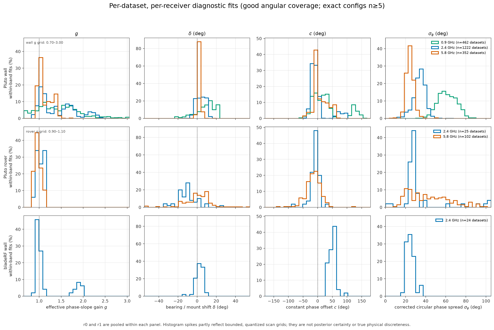

The per-dataset diagnostic search is bounded and quantized: wall \(g\in[0.70,3.00]\),
rover \(g\in[0.90,1.10]\), wall \(\delta\in[-0.35,0.35]\) rad, and rover
\(\delta\in[-0.90,0.90]\) rad. Of 4,374 receiver fits, 271 (6.2%) carry the scan's
combined boundary flag, meaning either \(g\) or \(\delta\) hit an endpoint. Consequently
histogram spikes partly show the scan grid and should not be read as posterior certainty.

For a direct repeatability diagnostic, the table below reports in-sample variance
explained by configuration. The first \(R^2\) groups by device, band, physical spacing,
and receiver; the second uses the exact configuration and receiver. Squared wrapped
angular residuals are used for \(c\).

| Parameter | Device + band + spacing \(R^2\) | Exact-config \(R^2\) | Median exact-config within-group MAD |
|---|---:|---:|---:|
| \(g\) | 0.861 | **0.882** | **0.020** |
| \(\delta\) | 0.377 | **0.428** | **1.15°** |
| \(c\) | 0.863 | **0.894** | **4.70°** |
| \(\sigma_\phi\) | 0.771 | **0.828** | **2.53°** |

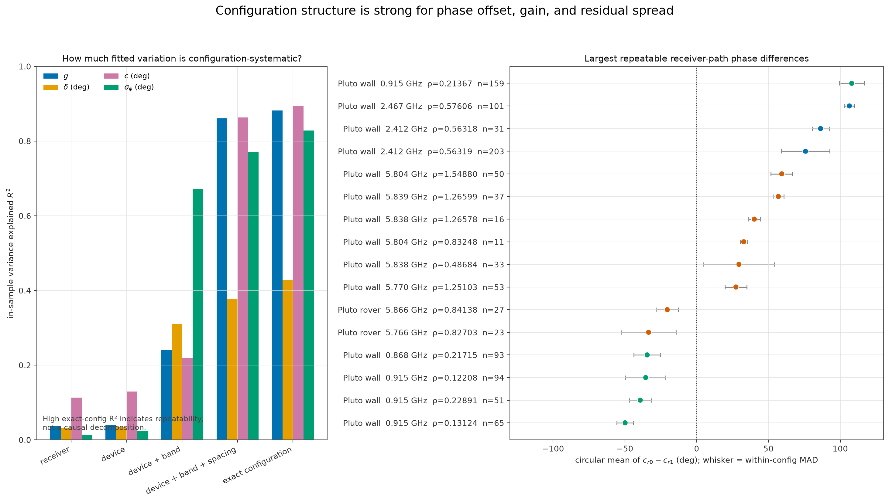

This is strong evidence of repeatable configuration state, not random sample scatter.
It is also not a causal decomposition: exact configuration packages together radio
identity, LO, array spacing, platform, mount, gain/firmware state, date, and environment.
The bearing shift \(\delta\) is less repeatable than the other three parameters and should
receive stronger shrinkage.

Receiver-path phase differences are especially large and repeatable. Across the 2,187
datasets, \(|c_{r0}-c_{r1}|\) has median **26.2°**, 90th percentile **101.6°**, and
maximum **163.8°**. Exact configuration explains **0.860** of its circular variance, with
median within-configuration MAD 7.55°. Examples include +108.0° at Pluto wall
0.915 GHz / \(\rho=0.21367\), +106.4° at 2.467 GHz / 0.57606, and +86.3° at
2.412 GHz / 0.56318. Pooling receivers without a path-specific offset therefore mixes
physically shifted responses.

#### Recommended calibration component

Use a hierarchical raw-observation calibration keyed at least by radio identity,
receiver, LO/band, gain/firmware state, and mounting configuration:

1. estimate a circular \(c\) per receiver path and subtract it from observed phase;
2. fit a small mount shift \(\delta\), with a prior centered at zero;
3. fit \(g\) with strong shrinkage toward one—especially below \(d/\lambda=0.5\)—and
   only relax it when capture-held-out data support the change;
4. estimate \(\sigma_\phi\) or a robust von-Mises-plus-uniform noise model per
   configuration; and
5. generate \(P(\phi\mid\theta,\mathrm{configuration})\) on explicit fixed bin edges,
   preserving separate r0/r1 likelihoods and uncertainty.

This component removes repeatable electronics/path bias before applying geometry,
allows a small slope and mount correction, and sets an honest likelihood width. It
should be fit and scored with capture-level holdouts. A frequency-only lookup would miss
the receiver and configuration effects demonstrated above.

### 4.2 Temporal-block holdout: which parameters actually help?

The pooled-table fits above are descriptive and in-sample. To test whether the same
parameters predict unseen observations rather than merely absorb noise, a second audit
reopened a timing-clean stratified subset of the current artifact's raw sources and
precomputes in strict read-only mode:

- **81 rover files** and **393 Pluto wall files**;
- ten contiguous time blocks per receiver, alternating five training and five held-out
  blocks;
- the same nominal forward sign and platform-specific distance weighting as the quality
  scanner;
- all eight subsets of `c`, `g`, and δ fitted only on training blocks; and
- each parameter's held-out contribution computed as its three-feature Shapley value,
  which averages over every fit order and sums exactly to the full static-calibration
  gain for each file.

This is a **within-file temporal holdout**, not a capture, day, radio-unit, or environment
holdout. It checks local generalization and removes direct test-block fitting, but it is
still optimistic about reusing a calibration on a future capture. Deterministic
training-only coarse starts were used so the full-file quality-scan fits could not leak
holdout information through optimizer initialization.

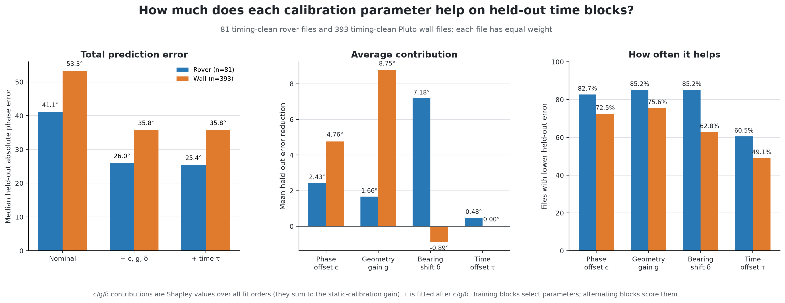

The full static `c/g/δ` model reduces the median file's held-out absolute circular
phase error by **8.69° (19.3%) on rover** and **13.69° (27.8%) on wall**. It helps
74/81 rover files (91.4%) and 333/393 wall files (84.7%). The population median error
moves from 41.1° to 26.0° on rover and from 53.3° to 35.8° on wall; those differences of
medians are not the same statistic as the median paired improvement.

| Parameter | What it changes | Rover median contribution; files helped | Wall median contribution; files helped | Read-only audit conclusion |
|---|---|---:|---:|---|
| `c` | vertical phase offset | **+2.54°; 82.7%** | **+1.86°; 72.5%** | useful, path-specific, highly configuration-systematic |
| `g` | effective d/λ / curve slope | **+1.79°; 85.2%** | **+7.14°; 75.6%** | useful at lower spacing; harmful without alias-aware shrinkage at high spacing |
| δ | bearing/mount origin | **+3.15°; 85.2%** | **+0.59°; 62.8%** | valuable on rover, weakly reusable by wall configuration |
| τ | label time | **+0.048°; 60.5%** | **0.000°; 49.1%** | no fleet-wide deployable constant-lag correction |
| σφ | likelihood width/confidence | not an MAE correction | not an MAE correction | must be estimated so noisy configurations are not overconfident |

Positive contributions mean lower held-out phase error. The table reports medians; mean
`c/g/δ` contributions sum to 11.27° for rover and 12.62° for wall. Medians need not
sum. A parameter can help most files while having a negative mean if a smaller set of
failures is large, as happens for wall δ.

#### Constant phase offset `c`

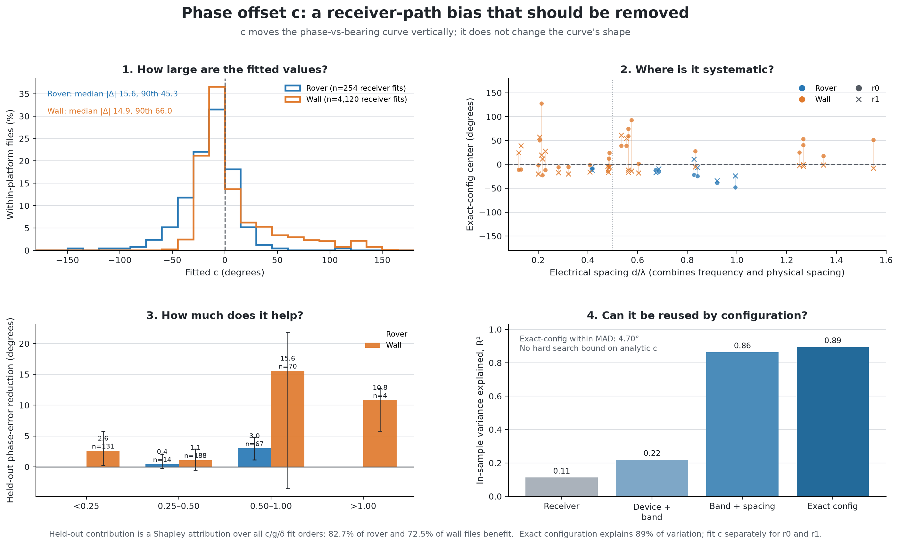

`c` removes a constant electrical/path phase rotation. In the per-dataset diagnostic
fits, median |c| is 15.6° on rover and 14.9° on wall; the 90th percentiles are
45.3° and 66.0°. Exact configuration plus receiver explains **0.894** of its in-sample
circular variance, with 4.70° median within-configuration MAD. At the same time,
|c_r0 − c_r1| has 26.2° median and 101.6° 90th percentile. Therefore the
reusable unit is not a frequency-only fleet constant: it is at least a
radio/receiver-path/configuration value. Subtracting `c` changes phase MAE and
likelihood centering, but not circular residual spread; that invariance is why the
separate time-lag test uses spread rather than claiming `c` made the signal less noisy.

#### Effective geometry gain `g`

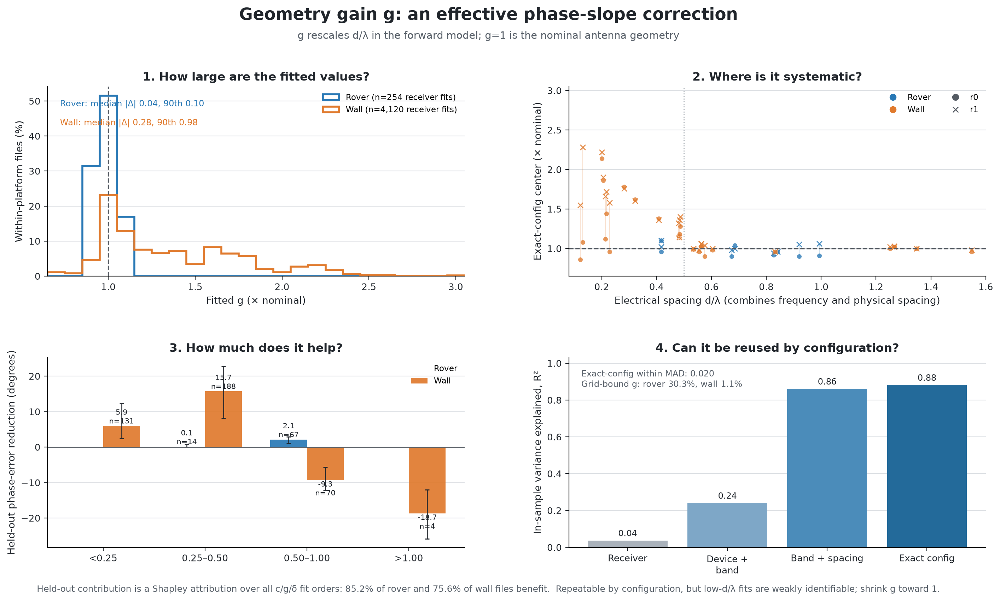

`g` multiplies nominal d/λ. Configuration repeatability is high
(R² = 0.882, within-configuration MAD 0.020), but that does **not** make every fitted
value literal or deployable. Low-d/λ wall fits have limited observable phase
swing, so `g`, `c`, and δ trade off; the extreme 2–3× values are effective
model corrections, not credible tape-measure errors.

The holdout result adds a second guardrail. On wall files, median `g` contribution is
+5.94° for d/λ < 0.25 and +15.70° for 0.25–0.50, but **−9.35°** for 0.50–1.00
and **−18.73°** above 1. At aliased spacing, an unconstrained training fit can choose a
different wrapped branch from the held-out blocks. Use strong shrinkage toward one,
alias-aware/multistart validation, and reject a fitted `g` unless a whole-capture
holdout supports it.

#### Bearing/mount shift δ

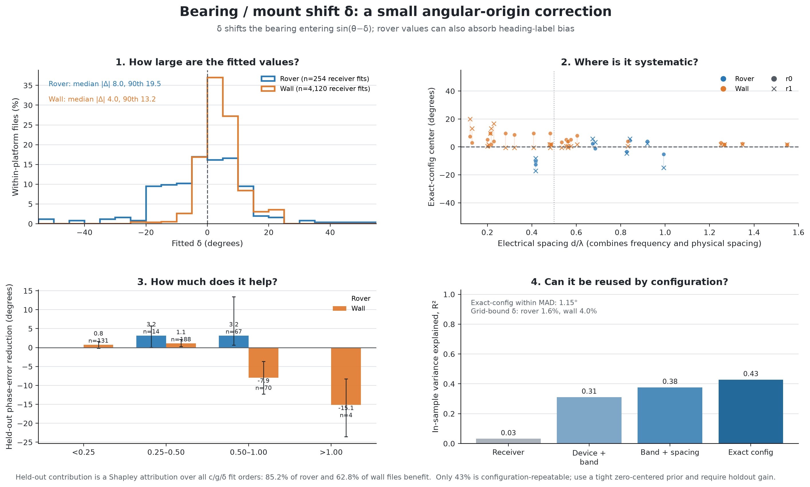

δ shifts the bearing entering `sin(θ − δ)`. Median fitted magnitude is
8.0° on rover and 4.0° on wall. Rover values can combine true mounting error with heading
or label-frame bias, which explains why this term is more useful on rover: mean held-out
contribution is +7.18° and 85.2% of files improve. It is much less reusable across the
fleet than `c` or `g`: exact configuration explains only **0.428** of its variation.
On wall, high-spacing aliasing again makes an unrestricted fit dangerous: median
contribution is −7.93° for 0.50–1.00 and −15.14° above 1, and the fleet-wide mean is
−0.89° despite a +0.59° median. Treat δ as a small, zero-centered mount/session
term and require independent capture support.

#### Residual spread σφ

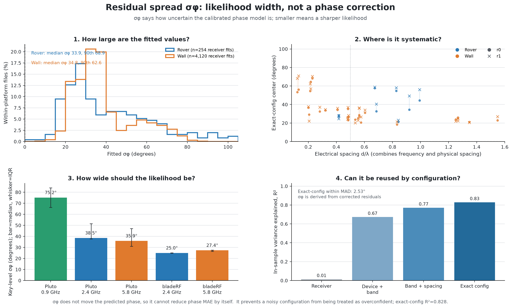

σφ does not move a phase prediction, so it cannot reduce phase MAE by itself.
It controls confidence: a 75° likelihood should not be multiplied into a particle filter
as though it were a 25° likelihood. The key-level median is 36.9° and the fitted range is
21.9°–85.3°. Pluto 0.9 GHz is broadest (75.2° median); bladeRF 2.4 GHz is sharpest
(25.0° median). Exact configuration explains **0.828** of its variation with 2.53°
within-configuration MAD, supporting a per-configuration robust width estimate, ideally
a von-Mises-plus-uniform mixture rather than a single overconfident concentration.

### 4.3 Label-time offset τ

The acquisition path does have a real timing risk: RF receive, asynchronous writer, and
the latest cached pose/heading are not atomically timestamped. Shifting labels is the
correct experiment; the raw IQ should remain untouched. The fit used
`θτ(t_i) = θGT(t_i + τ)` on each receiver's own timestamp axis, one shared τ per file
in [−0.5,+0.5] s, training-only selection, and fixed edge support.
Negative τ means use earlier labels.

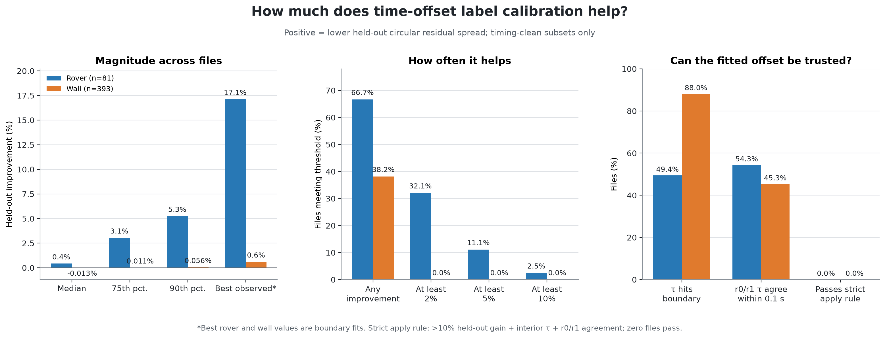

On rover, median held-out residual-spread improvement is **+0.434%**, the 75th percentile
is +3.05%, and the 90th percentile is +5.25%. Two files exceed 10%, but both select the
−0.5 s search boundary. On wall, the median is **−0.013%**, the 90th percentile is only
+0.056%, and the best observed value is +0.617% at a boundary. No wall file exceeds 5%.
The absolute-error ablation above reaches the same decision: median incremental benefit
is just +0.048° on rover and 0.000° on wall.

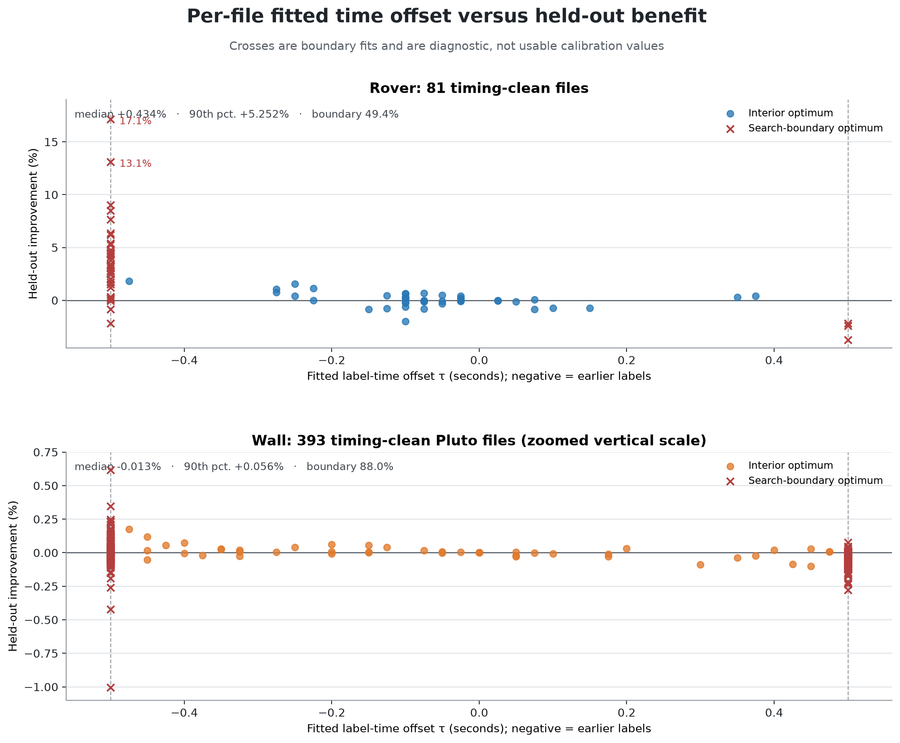

A deployable rule required >10% held-out spread improvement, an interior optimum, and r0/r1
agreement within 0.1 s. **Zero rover and zero wall files pass.** The wall exclusion is
therefore empirical, not structural: wall labels use the same asynchronous writer risk,
but this corpus contains no identifiable constant wall lag. A future implementation
should keep τ disabled by default, fit it only on motion-excited timing-clean rover
captures, compare against a same-degree-of-freedom heading shift, and retain the
uncalibrated labels unless all gates pass.

## 5. Key-level results

### 5.1 The four new 2026 rover spacings

| Key | Sources | nominal production TV | calibrated production TV | production corr | calibrated nonsym TV | nonsym corr | fitted phase σ |
|---|---:|---:|---:|---:|---:|---:|---:|
| `PLUTO_0.68181` | 3 | 0.194 | **0.163** | 0.950 | 0.271 | 0.855 | 22.3° |
| `PLUTO_0.83765` | 5 | 0.230 | **0.197** | 0.886 | 0.339 | 0.725 | 33.8° |
| `PLUTO_0.90397` | 6 | 0.260 | **0.260** | 0.725 | 0.443 | 0.493 | 54.2° |
| `PLUTO_0.91557` | 3 | 0.285 | **0.285** | 0.742 | 0.393 | 0.606 | 47.8° |

`0.68181` and `0.83765` visibly follow the theoretical branches. The simple calibration
barely helps `0.90397` and `0.91557`; their mismatch is not primarily a constant phase or
spacing error. `0.90397` is the clearer warning because it also has the poorest valid-frame
yield (36.9%), pronounced r0/r1 imbalance, and two empty rows in `r1/nosym`.

### 5.2 Worst and best production matches

| Key | Sources | calibrated production TV | corr | Main interpretation |
|---|---:|---:|---:|---|
| `PLUTO_0.56296` | 1 | **0.437** | 0.456 | too little support; worst overall |
| `PLUTO_0.91964` | 7 | **0.376** | 0.603 | sparse plus confirmed coordinate truncation |
| `PLUTO_0.91557` | 3 | 0.285 | 0.742 | new, sparse, broad response |
| `PLUTO_0.99302` | 8 | 0.273 | 0.680 | sparse, structured residual |
| `PLUTO_0.57606` | 101 | 0.264 | 0.697 | not sparse; likely pooled state/multipath |
| `PLUTO_0.90397` | 6 | 0.260 | 0.725 | sparse/low-yield RO4 |
| `PLUTO_0.41762` | 31 | **0.107** | 0.950 | best production TV |
| `PLUTO_0.28159` | 150 | **0.109** | 0.964 | best production correlation |

The 101-source `0.57606` exception is important: support is a strong fleet-level predictor,
not a complete explanation. Its table retains large coherent deviations after calibration,
which points toward mixed capture/radio states or structured propagation rather than
sampling noise alone.

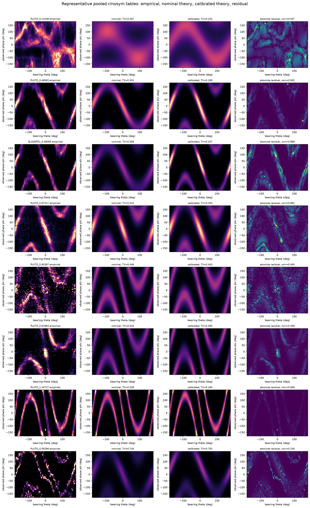

The complete visual comparison for every key is an eight-page PDF:
[`all_48_keys_atlas.pdf`](figures/2026_08_25_empirical_dist_analysis/all_48_keys_atlas.pdf). Its first page is also available
as [`all_keys_atlas_page1.png`](figures/2026_08_25_empirical_dist_analysis/all_keys_atlas_page1.png).

A second eight-page atlas covers the actual production `r/sym` target, showing empirical
production, the calibrated theory passed through the as-built symmetry fold, the same
physical theory before that fold, and the residual:
[`all_48_keys_production_sym_atlas.pdf`](figures/2026_08_25_empirical_dist_analysis/all_48_keys_production_sym_atlas.pdf).

## 6. All stored variants

Parameters below are always fitted to pooled `r/nosym` and then transferred. These are
therefore a diagnostic of radio/pooling differences, not six independently optimized fits.

| Variant | nominal mean TV | calibrated mean TV | calibrated median TV | calibrated mean corr |
|---|---:|---:|---:|---:|
| `r/nosym` | 0.411 | **0.275** | 0.249 | 0.751 |
| `r/sym` | 0.247 | **0.175** | 0.155 | 0.843 |
| `r0/nosym` | 0.504 | **0.385** | 0.349 | 0.620 |
| `r0/sym` | 0.307 | **0.257** | 0.238 | 0.705 |
| `r1/nosym` | 0.506 | **0.404** | 0.370 | 0.627 |
| `r1/sym` | 0.316 | **0.252** | 0.241 | 0.785 |

The pooled matrix matches one low-dimensional curve materially better than either radio
does under transferred parameters. Pooling and symmetry smooth away receiver-specific
offsets, coverage holes, and noise, but the pooled `r` histogram also adds r0/r1 matrices
by index even when their inferred coordinate grids differ. It should not be mistaken for a
single clean sensor likelihood.

Every variant/key row is in [`metrics_all_variants.csv`](data/2026_08_25_empirical_dist_analysis/metrics_all_variants.csv).

## 7. Strong negative controls

### 7.1 Phase sign

The repo-sign nominal model wins by Jensen–Shannon divergence for **48/48 keys**. An
independent direct comparison found mean production TV approximately 0.251 for the negative
sign versus 0.473 for the positive sign, and mean correlation 0.729 versus −0.006. This
rules out a global sign flip as the reason for poor individual fits.

### 7.2 Same spacing, different SDR device

Ideal theory depends on \(d/\lambda\), not device. The current table has three exact
Pluto/bladeRF spacing pairs:

| d/λ | production Pluto-vs-bladeRF TV | corr | nonsym TV |
|---:|---:|---:|---:|
| 0.48083 | 0.286 | 0.757 | 0.591 |
| 0.48400 | 0.297 | 0.765 | 0.515 |
| 0.48684 | 0.284 | 0.574 | 0.480 |

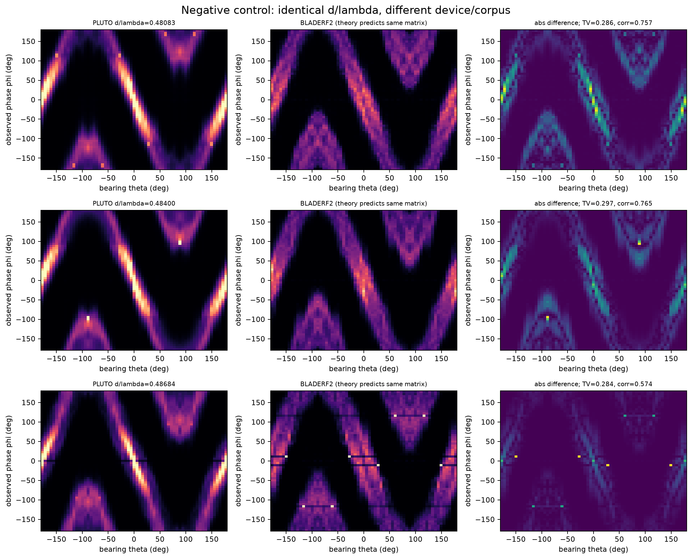

The theory matrices are identical at each pair, yet the empirical posteriors differ
substantially. This is strong evidence that device/capture/calibration/prior state matters.
It does **not** isolate a causal SDR-device effect because the source corpora and
environments are not controlled.

### 7.3 Nearly identical Pluto spacings

| Pair | empirical production TV | corr | ideal-theory TV |
|---|---:|---:|---:|
| 0.41762 vs 0.41764 | 0.176 | 0.905 | 0.000027 |
| 0.56318 vs 0.56319 | 0.095 | 0.960 | 0.000016 |
| 1.26578 vs 1.26599 | 0.147 | 0.919 | 0.000360 |

Wavelength differences this small cannot explain the empirical differences. These pairs
are especially direct evidence for different underlying capture, calibration, environment,
or selection distributions being pooled into a key that encodes only device class and
spacing ratio.

## 8. Producer-coordinate and symmetry effects

### 8.1 Auto-inferred histogram axes

The builder calls `np.histogram2d(..., bins=65)` without a range and discards the returned
edges. Runtime consumers index both dimensions as fixed `[-pi,pi]`. r0 and r1 infer their
own grids and are then added by integer cell.

The exhaustive raw-source comparison shows this is **confirmed but usually small**:

- For 47/48 keys, switching per-radio nonsymmetric theory from fixed consumer axes to the
  actual producer axes changes TV by less than approximately 0.001.
- `PLUTO_0.91964/r0` is the exception. Its theta range is only
  `[-2.92409, 2.71901]`, displacing the endpoint by 4.32–4.37 consumer bins. Using producer
  axes improves its per-radio theory TV from 0.643 to 0.584; adding the actual valid-frame
  bearing prior improves it to 0.510.
- `PLUTO_0.90397/r1` has the next-largest phase-axis displacement, about 0.232 bins; its
  pooled fixed-grid reconstruction changes production TV by only 0.0307.

So auto-ranging is a real contract defect and a major contributor to `0.91964`, but it does
not explain the fleet-wide mismatch.

### 8.2 Integer symmetry bias

The ideal model already obeys sign and front/back symmetries. The current implementation
folds integer row indices as though 65 histogram bins were 65 endpoint samples. Continuous
symmetry instead splits source-bin intervals across destination bins.

At the largest spacing, the maximum ridge-center displacement is

\[
2\pi\rho\sin(\pi/65)=0.47\text{ rad},
\]

or roughly 4.9 phase bins. In a controlled bin-integrated ideal model with circular phase
σ = 0.2 rad, the repository transform changes the posterior by:

| d/λ | symmetry-transform TV |
|---:|---:|
| 0.12208 | 0.032 |
| 0.48083 | 0.100 |
| 0.68181 | 0.134 |
| 0.90397 | 0.149 |
| 1.25103 | 0.182 |
| 1.54880 | 0.200 |

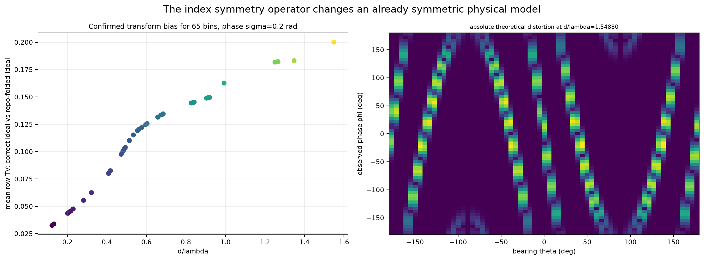

This is a construction artifact, not radio physics. It also explains why the lower TV of
`r/sym` cannot be interpreted simply as the hardware becoming more theoretical: both data
and theory have been passed through a strong, approximate regularizer.

## 9. Posterior prior and detection selection

The theoretical sensor model is \(P(\phi\mid\theta)\), but the pickle stores

\[
P(\theta\mid\phi,\text{finite segmented phase},\text{source corpus}).
\]

The finite-phase filter is not random: segmentation only emits phase when it detects
stable, sufficiently strong signal windows. Angle, range, gain, multipath, and platform
therefore affect which frames enter the table. Even before hardware systematics, a
nonuniform valid-frame bearing prior changes the posterior.

Across the raw per-radio nonsymmetric reconstructions, uniform-prior theory has mean TV
**0.5023** and median **0.4938**. Supplying the actual valid-frame bearing prior lowers
those to **0.4908** and **0.4858**, improving 38/48 keys. The mean improvement is 0.0114
and median is 0.0045, but it is material for `0.99302` (0.110), `0.68484` (0.091), and
`0.91964` (0.074).

On the six 2026 rover spacing groups specifically, removing the empirical bearing prior
changes mean row TV by **0.010–0.048** and changes the conditional MAP bin in
**9.2–32.3%** of phase rows; `0.90397` is largest. This is a real secondary global
explanation and a material local one, not the dominant fleet-wide cause. The PKL itself
cannot undo it because it omits raw joint counts and \(P(\phi)\).

This semantic mismatch matters downstream. Particle filters multiply the stored posterior
as a likelihood, effectively updating with

\[
w_{t-1}(\theta)P(\phi\mid\theta)P_{\text{corpus}}(\theta\mid\text{detected}),
\]

which double-counts the corpus prior unless it is uniform.

## 10. Ranked hypotheses for the residual mismatch

| Rank | Hypothesis | Evidence | Confidence / scope |
|---:|---|---|---|
| 1 | Correct geometry plus hardware/capture calibration | repo sign 48/48; four-parameter fit cuts nonsym TV 0.411→0.275; bladeRF phase offsets cluster around 33–55° | **High**, fleet-wide |
| 2 | Sparse and selected valid frames | worst key has n=1; support-vs-production-TV Spearman −0.595; `0.90397` yield 36.9% | **High**, strongest on sparse keys |
| 3 | Mixed device/radio/corpus/environment state omitted from key | exact-spacing device pairs differ TV 0.284–0.297; near-identical Pluto pairs differ far beyond theory | **High**, causal component not isolated |
| 4 | Structured multipath or heteroscedastic phase noise | coherent residual branches remain; `0.57606` is poor despite 101 sources; one von Mises cannot represent multiple paths | **Medium-high** |
| 5 | Corpus-bearing and detection prior | raw rover reweighting changes TV 0.010–0.048 and MAP bins up to 32.3% | **Certain but moderate** on tested rover keys |
| 6 | Auto-range coordinate mismatch | exact reconstruction; large 4.3-bin shift and material improvement for `0.91964/r0` | **Certain, key-specific**, not fleet-wide |
| 7 | Integer symmetry transform | controlled theoretical TV 0.032–0.200 | **Certain** for `sym`; construction, not RF |
| 8 | Aliasing causes multiple modes | 27/48 keys above 0.5, analytic 2–8 bearing solutions | **Certain**, but modes are expected rather than an error |

A global sign error, a simple transpose error, midpoint bin approximation, or universal
auto-range distortion are rejected as primary explanations.

## 11. Old versus current table

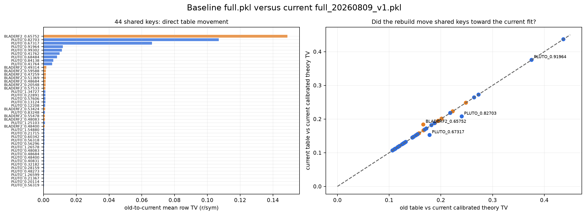

Of 44 shared keys, three moved materially:

| Key | old→current production TV | old corr | Movement versus current calibrated theory |
|---|---:|---:|---:|
| `BLADERF2_0.65752` | 0.149 | 0.899 | **away** by TV +0.0178; 41 source segmentations were lost |
| `PLUTO_0.82703` | 0.107 | 0.937 | **toward** by TV −0.0324 after adding 19 rover sources |
| `PLUTO_0.67317` | 0.066 | 0.989 | **toward** by TV −0.0255 after adding 12 rover sources |

The remaining 41 keys are nearly unchanged. Details are in
[`metrics_old_vs_current.csv`](data/2026_08_25_empirical_dist_analysis/metrics_old_vs_current.csv).

## 12. What should change next

1. **Rebuild on explicit shared axes.** Pass `range=[[-pi,pi],[-pi,pi]]`; use identical
   edges for r0/r1; store the edges and validate them at read time.
2. **Store joint counts and both conditionals.** Persist raw `N(theta,phi)`, valid counts,
   `P(phi|theta)`, and `P(theta|phi)`. Particle filters should consume the likelihood,
   not the corpus posterior.
3. **Replace integer symmetry with bin-integrated coordinate symmetry.** Test it against
   the analytic sine response for odd, even, and unequal bin counts.
4. **Condition on more than `(device,d/lambda)`.** At minimum preserve receiver, radio or
   calibration state, phase-correction identity, support, and capture provenance. Consider
   a hierarchical model that partially pools nearby spacings rather than exact five-decimal
   keys.
5. **Fit on raw observations and validate by capture.** Compare nested models: ideal +
   noise; then \(g,c,\delta\); then uniform contamination; then multipath components. Split
   and bootstrap by physical capture, never by adjacent frame.
6. **Use theory as a regularizer/fallback.** For sparse keys, shrink empirical counts toward
   calibrated theory and require a minimum effective support. `PLUTO_0.56296` should not be
   treated as equally reliable to 100-source tables.
7. **Match phase correction and table identity.** Record table SHA/provenance in every
   result and cache key; do not apply corrected phase to an uncorrected table.

## 13. Limitations

- The principal table fits are in-sample descriptions, so their scores are optimistic and
  have no capture-bootstrap confidence interval.
- The parameter ablation uses held-out temporal blocks within the same file. It prevents
  direct test-block fitting but is weaker than a held-out capture, date, radio unit, or
  environment; its gains must not be treated as deployment estimates.
- Matrix TV weights every nonempty phase row equally. The pickle discards phase counts, so
  an operational frequency-weighted score cannot be reproduced from it alone.
- `r/nosym` is pooled from r0/r1 count matrices built on separately inferred coordinates;
  fitted physical parameters should ultimately come from per-radio raw observations.
- \(g\), \(c\), and \(\delta\) are non-identifiable under narrow coverage and increasingly
  ambiguous under phase wrapping. They describe the table but do not uniquely diagnose a
  component.
- The von Mises model is unimodal in phase at a fixed bearing. It cannot represent coherent
  reflections, time-varying calibration, angle-dependent noise, or gain-state mixtures.
- Exact same-spacing device comparisons are strong negative controls but not controlled
  device experiments.
- The raw-source audit verifies all current provenance-loaded records, but the 54 rejected
  build inputs cannot contribute until their segmentation/spacing issues are resolved.

## 14. Reproduction and outputs

Run from the repository root:

```bash
uv run python \
  reports/data/2026_08_25_empirical_dist_analysis/analysis/compare_theory.py
```

Then generate the calibration-distribution supplement:

```bash
uv run python \
  reports/data/2026_08_25_empirical_dist_analysis/analysis/calibration_parameter_distributions.py
```

The read-only temporal-block ablation is selected by the frozen 474-row CSV and emits a
full audit JSON to `/tmp` while refreshing only compact report products:

```bash
PYTHONDONTWRITEBYTECODE=1 uv run python -B \
  reports/data/2026_08_25_empirical_dist_analysis/analysis/calibration_heldout_ablation.py \
  --compact-csv reports/data/2026_08_25_empirical_dist_analysis/calibration_heldout_ablation.csv \
  --summary-json reports/data/2026_08_25_empirical_dist_analysis/calibration_heldout_ablation_summary.json \
  > /tmp/calibration_heldout_ablation_full.json

PYTHONDONTWRITEBYTECODE=1 uv run python -B \
  reports/data/2026_08_25_empirical_dist_analysis/analysis/calibration_parameter_walkthrough.py
```

The theory script uses deterministic per-key optimizer seeds. The two original scripts
write only within this report directory; the ablation additionally opens the selected
raw/precompute stores read-only and writes its verbose audit stream to `/tmp`.

| Output | Contents |
|---|---|
| [`ALL_KEYS_TABLE.md`](data/2026_08_25_empirical_dist_analysis/ALL_KEYS_TABLE.md) | full 48-row human-readable table |
| [`metrics_all_keys.csv`](data/2026_08_25_empirical_dist_analysis/metrics_all_keys.csv) | all key metrics and fitted parameters |
| [`metrics_all_variants.csv`](data/2026_08_25_empirical_dist_analysis/metrics_all_variants.csv) | 288 stored variant comparisons |
| [`metrics_cross_device.csv`](data/2026_08_25_empirical_dist_analysis/metrics_cross_device.csv) | exact-spacing device controls |
| [`metrics_old_vs_current.csv`](data/2026_08_25_empirical_dist_analysis/metrics_old_vs_current.csv) | 44 shared-key baseline analysis |
| [`analysis_metadata.json`](data/2026_08_25_empirical_dist_analysis/analysis_metadata.json) | input hashes, model, bounds, metric definitions |
| [`calibration_key_parameters.csv`](data/2026_08_25_empirical_dist_analysis/calibration_key_parameters.csv) | 48 fitted keys joined to LO, band, and physical-spacing provenance |
| [`calibration_parameter_summary.csv`](data/2026_08_25_empirical_dist_analysis/calibration_parameter_summary.csv) | parameter quantiles overall, by device/band, and by electrical-spacing regime |
| [`calibration_systematics_summary.csv`](data/2026_08_25_empirical_dist_analysis/calibration_systematics_summary.csv) | grouping-level in-sample repeatability metrics |
| [`calibration_configuration_summary.csv`](data/2026_08_25_empirical_dist_analysis/calibration_configuration_summary.csv) | 34 exact-configuration receiver summaries and r0/r1 phase differences |
| [`calibration_quality_scan_inputs.csv`](data/2026_08_25_empirical_dist_analysis/calibration_quality_scan_inputs.csv) | frozen 2,250-row quality-scan input used for the distribution supplement |
| [`calibration_distribution_metadata.json`](data/2026_08_25_empirical_dist_analysis/calibration_distribution_metadata.json) | scan coverage, selection, bounds, and metric notes |
| [`calibration_heldout_ablation.csv`](data/2026_08_25_empirical_dist_analysis/calibration_heldout_ablation.csv) | 474 per-file held-out errors, Shapley contributions, and fitted time offsets |
| [`calibration_heldout_ablation_summary.json`](data/2026_08_25_empirical_dist_analysis/calibration_heldout_ablation_summary.json) | method, input hashes, immutable-store audit, and platform summaries |
| [`all_48_keys_atlas.pdf`](figures/2026_08_25_empirical_dist_analysis/all_48_keys_atlas.pdf) | every empirical/calibrated/residual heatmap |
| [`all_48_keys_production_sym_atlas.pdf`](figures/2026_08_25_empirical_dist_analysis/all_48_keys_production_sym_atlas.pdf) | every production/as-built/physical/residual heatmap |
| [`calibration_parameter_histograms.png`](figures/2026_08_25_empirical_dist_analysis/calibration_parameter_histograms.png) | key-level fitted-parameter distributions by device/band |
| [`calibration_parameters_by_frequency_spacing.png`](figures/2026_08_25_empirical_dist_analysis/calibration_parameters_by_frequency_spacing.png) | parameter scatter against LO and physical spacing |
| [`per_dataset_calibration_histograms.png`](figures/2026_08_25_empirical_dist_analysis/per_dataset_calibration_histograms.png) | per-dataset/per-receiver distributions by platform and band |
| [`calibration_configuration_systematics.png`](figures/2026_08_25_empirical_dist_analysis/calibration_configuration_systematics.png) | configuration variance explained and receiver-path phase differences |
| [`calibration_parameter_heldout_help.png`](figures/2026_08_25_empirical_dist_analysis/calibration_parameter_heldout_help.png) | total held-out benefit and parameter attribution for rover and wall |
| [`phase_offset_calibration_walkthrough.png`](figures/2026_08_25_empirical_dist_analysis/phase_offset_calibration_walkthrough.png) | phase-offset distribution, configuration structure, held-out benefit, and repeatability |
| [`geometry_gain_calibration_walkthrough.png`](figures/2026_08_25_empirical_dist_analysis/geometry_gain_calibration_walkthrough.png) | effective-gain distribution and spacing-dependent held-out behavior |
| [`bearing_shift_calibration_walkthrough.png`](figures/2026_08_25_empirical_dist_analysis/bearing_shift_calibration_walkthrough.png) | bearing-shift distribution and platform/spacing-dependent benefit |
| [`residual_spread_calibration_walkthrough.png`](figures/2026_08_25_empirical_dist_analysis/residual_spread_calibration_walkthrough.png) | likelihood-width distribution and configuration repeatability |
| [`time_offset_calibration_help.png`](figures/2026_08_25_empirical_dist_analysis/time_offset_calibration_help.png) | held-out residual-spread benefit and trust gates for label-time offset |
| [`time_offset_calibration_per_file.png`](figures/2026_08_25_empirical_dist_analysis/time_offset_calibration_per_file.png) | fitted time offset versus benefit for every audited file |
| [`compare_theory.py`](data/2026_08_25_empirical_dist_analysis/analysis/compare_theory.py) | reproducible analysis and figure generator |
| [`calibration_parameter_distributions.py`](data/2026_08_25_empirical_dist_analysis/analysis/calibration_parameter_distributions.py) | reproducible distribution and configuration-repeatability analysis |
| [`calibration_heldout_ablation.py`](data/2026_08_25_empirical_dist_analysis/analysis/calibration_heldout_ablation.py) | read-only training/holdout fit and Shapley audit |
| [`calibration_parameter_walkthrough.py`](data/2026_08_25_empirical_dist_analysis/analysis/calibration_parameter_walkthrough.py) | static Matplotlib walkthrough figure generator |

No empirical PKL, source dataset, or precompute cache was written or modified. The
ablation opened 474 raw stores and 474 precompute stores read-only; every touched
`data.mdb` size/mtime fingerprint was unchanged. Writes were limited to this report's
Markdown, compact audit tables/metadata, analysis scripts, and Matplotlib PNGs.
