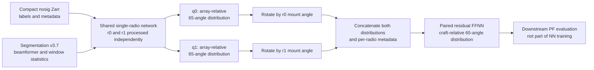
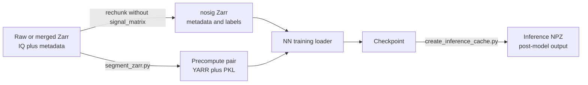

# Current model lineage and training-data state

**Date:** 2026-08-25

**Status:** audited current state and proposed next-run protocol. Compiling this
report did not alter any dataset, cache, checkpoint, split, or training run.

## Executive answer

The model lineage used for the August 2026 rover evaluations is the two-stage
June/July model:

1. train the shared single-radio network;
2. load that exact checkpoint into the paired model and freeze it; and
3. train only the late-fusion paired head.

The qualified artifacts are:

```text
/mnt/md0/checkpoints/jun26_2026/single_3p7_thin_noblade/best.pth
/mnt/md0/checkpoints/jun26_2026/paired_3p7_thin_noblade/best.pth
```

Chronologically newer July single-only runs exist, but they are data-quality
experiments rather than replacements: no paired head was trained from them, they
were not used by the August rover filter-evaluation campaigns E-INF1/E-INF2, and
their completed nominal-500k checkpoint artifacts are not present on mounted
storage. At that matched stage (whose last scheduled validation was at step
475,000), the broad `base` split beat the filtered `r1` and `r2` alternatives on
the complete validation table.

The current historical manifests nominally contain 1,691 training and 565
validation paths. A reconstruction against the currently mounted Zarrs,
precomputes, and loader assertions finds **1,671 train and 556 validation datasets
loadable today**. The checkpoints do not persist exact membership, and a
contemporaneous `Loaded` log was not recovered, so these counts should not be
overstated as a guaranteed record of the June run. Missing or invalid entries are
caught and skipped rather than causing training to fail.

The 48 merged 2026 rover stores were not used for neural-network training. They
are ready as version-3.7 precomputes, but they are neither 48 independent captures
nor a pristine final test set: shared raw sources connect them into only 12
acquisition groups, all 48 were used for full-corpus filter confirmation, a
stratified 16-store subset was used for hyperparameter selection, and the corpus
contributed to empirical-table construction.

The recommended next experiment is therefore:

- preserve the historical validation set unchanged;
- split recent rover data by connected raw-source group and preferably whole day;
- retain source-disjoint components as a recent-rover development holdout and
  collect a fresh post-design final test set before promotion;
- compare a from-scratch historical-data reproduction against a from-scratch
  rover-augmented run with otherwise identical settings; and
- train a new paired head only from the new single checkpoint selected by a
  preregistered rule.

## 1. Qualified model lineage

### 1.1 Selected checkpoints

| Stage | W&B run | Training interval | Best stored state | Selection result | Current role |
| --- | --- | --- | ---: | --- | --- |
| Single | `ygj4glp5` | 2026-06-24 through 06-29 | epoch 12, step 725,000 | selected on `val/single_loss`; value not persisted | Source network for the paired model |
| Paired | `sj12xn0k` | 2026-07-01 through 07-08 | epoch 30, step 1,750,000 | `val/paired_loss = 0.1504330787` | Model used in the August rover evaluations |

Both runs were launched on `kalman` with Python 3.12.3 from repository commit
`574c4548e23c18d95ff3c2b72d3b63f0b1f42251`. The W&B command records are:

```text
spf/scripts/train_single_point.py \
  -c model_configs/jul8_single_3p7_thin_noblade_jun26_2026.yaml

spf/scripts/train_single_point.py \
  -c model_configs/jul8_paired_3p7_thin_noblade_jun26_2026.yaml
```

Those launch YAMLs are untracked in the working host and were not present in the
training commit. The authoritative reproducibility record is therefore the
resolved `config.yml` beside each checkpoint, the configuration embedded in the
checkpoint, and the W&B run metadata:

```text
/mnt/md0/checkpoints/jun26_2026/single_3p7_thin_noblade/config.yml
/mnt/md0/checkpoints/jun26_2026/paired_3p7_thin_noblade/config.yml
```

The paired checkpoint's 76 `single_radio_net.*` tensors are tensor-for-tensor
identical to the standalone single checkpoint. Consequently, the August
single-NN results and paired-NN results are evaluations of one internally
consistent lineage, not separately trained single networks.

The `0.0973465971` single loss sometimes quoted for this lineage is the terminal
single-head reevaluation in the paired run at step 3,430,599. It is not an
evidenced selection value for the standalone step-725,000 checkpoint. The
standalone checkpoint does not persist its best validation value.

### 1.2 Immutable artifact identities

| Artifact | SHA-256 |
| --- | --- |
| Single `best.pth` | `e911cbe545e6062feda3d6e0ee4c2427f0675001f240ed49d2819bd56457bd7d` |
| Single resolved `config.yml` | `964297454320cdab1e3f02da77609be52d0ed67c2a85943c006ac9d807e0c2f8` |
| Paired `best.pth` | `0698e3a46bb012eca83c4245df49a2993e3340dc9c2d92493e3707d74bf461c3` |
| Paired resolved `config.yml` | `f281b6a9fe5a98425ff82b63aba42f17a60f5d133e8ad17f27314d686fa2eeb5` |
| Historical train manifest | `6f8063db4e939f800e1d2b440104c59ba90882dec8fff66c9c9cc41f1b4ccdb5` |
| Historical validation manifest | `15008d63c89724bb743ce5d0fce254303d75c0593c1592ca1a8bb714dec89149` |

The single run requested 100 epochs but ended near step 1.875 million, with the
best checkpoint remaining at step 725,000. Its exact early-stop cause is not
recoverable from the available records. The paired run completed its configured
60 epochs, ending near step 3.43 million while retaining step 1.75 million as
best.

## 2. How the two stages were trained



### 2.1 Shared data and objective settings

Both stages used:

| Setting | Value |
| --- | --- |
| Train manifest | `/mnt/md2/splits/apr17_train_nosig_noroverbounce_noblade.txt` |
| Validation manifest | `/mnt/md2/splits/apr17_val_nosig_noroverbounce.txt` |
| Precompute root | `/mnt/md2/cache/precompute_cache_3p7` |
| Segmentation version | 3.7 |
| Angular output | 65 bins |
| Batch / workers | 256 / 24 |
| Seed | 10 |
| Training precision | CUDA float32; AMP and compile disabled |
| Snapshot sampling | one snapshot per session |
| Validation sampling | 50% of examples from every successfully loaded validation dataset |
| QC behavior | `skip_qc: true`; manifest membership controls inclusion |
| Target | wrapped continuous Gaussian, sigma 0.1 rad |
| Loss | summed-bin MSE averaged over the batch/session dimensions |
| Validation/checkpoint cadence | every 25,000 / 5,000 steps |

Because explicit validation paths were supplied, the saved
`val_holdout_fraction: 0.5` did not split training files. The separate
`val_subsample_fraction: 0.5` did apply inside the loaded validation corpus.

The saved configs name an empirical-distribution artifact, but
`empirical_input: false`; the empirical table was not a learned network input in
this lineage.

### 2.2 Single-radio stage

For each physical receiver row, the network consumes:

- 65 windowed-beamformer values per temporal window;
- three per-window statistics: phase-difference mean, phase-difference spread,
  and median signal magnitude; and
- six metadata values: two receiver gains, spacing divided by wavelength,
  carrier frequency, vehicle type, and SDR type.

A typical cached snapshot has 256 windows. The temporal tensor is therefore
`68 x 256`. An eight-layer, 64-hidden-channel Conv1D stack reduces that tensor to
12 values. Adding the six metadata values produces an 18-value input to a
depth-four, width-512 residual FFNN, which emits 65 nonnegative values and
L1-normalizes them.

The single-radio target deliberately represents the two-element array's
front/back ambiguity: it averages a Gaussian at the true array-relative bearing
with the Gaussian at its front/back mirror.

Training-time perturbations were:

- a 50% left/right reflection with the target reflected consistently;
- a 50% branch that keeps one random contiguous half of the windows;
- otherwise, independent 25% temporal-window dropout;
- 15% temporal-window shuffling; and
- groupwise metadata dropout of 0.1 for spacing, frequency, both gains as one
  group, and vehicle type. SDR-device type and the 12-value temporal embedding
  are always retained.

The optimizer was AdamW at learning rate `1e-4` and weight decay `0.001`, with a
StepLR factor of 0.5 every six epochs.

### 2.3 Paired-radio stage

The paired stage loaded the selected single checkpoint and set all single-network
parameters to `requires_grad=False`. It then:

1. ran the shared single network on both receivers;
2. rotated each 65-bin result by that receiver's `rx_theta_in_pis * pi` mount
   angle into craft coordinates;
3. concatenated `(65 distribution + 6 metadata) x 2 = 142` values; and
4. trained a new depth-four, width-512 residual FFNN against one craft-relative
   target distribution.

Only the fusion head received gradients. The paired optimizer was AdamW at
`2e-4`, zero weight decay, and a StepLR factor of 0.5 every 12 epochs. Its paired
augmentation used one coherent `double_flip` transform for both radio rows.

One subtlety matters for reproduction: the parent paired model was in training
mode, so the frozen single network continued to produce stochastic
window/input augmentations even though its weights could not change. Preserve
that behavior in the reproduction control; change it only as a separately
registered experiment.

The paired config's outer `model.input_dropout: 0.2` is not consumed by the
implementation: both paired metadata preparers are built from the nested
`model.single` configuration. Effective groupwise metadata dropout is therefore
0.1, with the same always-retained fields described above.

## 3. Historical training and validation data

### 3.1 Manifest intent versus currently reconstructed loadability

The training script opens every manifest entry with
`segment_if_not_exist=False`. It catches any exception, logs it, and continues.
Thus the manifest is the intended corpus, while successful dataset construction
defines the effective corpus at run time. The table below reconstructs that
process against the files mounted on 2026-08-25; exact historical membership was
not serialized into the checkpoint.

| Set | Manifest lines | Unique paths | Failed unique paths today | Currently loadable datasets | Reconstructed examples |
| --- | ---: | ---: | ---: | ---: | ---: |
| Train | 1,691 | 1,686 | 15 | **1,671** | 14,637,543 |
| Validation | 565 | 565 | 9 | **556** | 3,541,757 full; 1,770,878 selected by the 50% subsample |

Five manifest line occurrences repeat five earlier training paths. All five
repeated paths are among the current failures, so those duplicate occurrences do
not contribute repeated examples in today's reconstruction. One path appears in
both the train and validation manifests:

```text
wallarrayv3_2025_02_05_06_38_25_nRX2_bounce_spacing0p07
```

It also fails to load on both sides today, so the current reconstruction has no
effective sample leakage. These are still manifest defects that should be removed
from any new versioned split.

Current on-disk presence explains most failures:

- train: 1,680 of 1,691 referenced Zarrs exist and 1,672 have both segmentation
  files; one additional segmented entry fails a metadata assertion;
- validation: 564 of 565 referenced Zarrs exist and 556 have usable
  segmentations.

### 3.2 Currently loadable composition

| Dimension | Train, n=1,671 | Validation, n=556 |
| --- | --- | --- |
| Platform | 1,563 wall; 108 rover | 525 wall; 31 rover |
| Radio | 1,671 Pluto | 508 Pluto; 48 BladeRF2 |
| Wall routines | 1,283 bounce; 265 random-circle; 15 calibration | 299 circle; 179 bounce; 44 random-circle; 3 calibration |
| Rover routines | 47 center; 36 diamond; 25 bounce | 18 center; 9 diamond; 4 bounce |
| Later QC status | 578 OK; 861 FLAG; 232 QUARANTINE | 149 OK; 315 FLAG; 92 QUARANTINE |

`skip_qc: true` means all loadable entries remained eligible regardless of those
later quality labels. In particular, 12 training and three validation datasets
later classified `QUAR:no_signal` are in the current reconstructed loadable sets
and would be eligible under the saved configuration.

Two historical names are now misleading:

- `noroverbounce` still contains 25 training and four validation rover-bounce
  datasets;
- `noblade` accurately describes training, but the frozen validation corpus
  intentionally contains 48 BladeRF2 datasets.

### 3.3 Split history and the July data-quality ladder

`/mnt/md2/splits` retains 77 legacy manifest files for provenance. They span the
December 2024 band experiments; incremental January/February validation growth;
March rover weighting and rover-bounce exclusions; and the April manifests that
became the current base train and frozen validation sets.

The July 2026 E-DATA1 experiment introduced three controlled single-only arms:
Its nominal “500k” stage ended at 500,000 optimizer steps, while validation ran
every 25,000 steps before the increment; the last matched validation row is
therefore step 475,000.

| Arm | Train paths | Matched 475k aggregate val | Matched 475k clean val | Interpretation |
| --- | ---: | ---: | ---: | --- |
| `base` | 1,691 | **0.097112** | **0.100472** | Best complete validation table |
| `r1` label-clean | 1,630 | 0.097740 | 0.101484 | No measured benefit |
| `r2` no-degraded | 1,217 | 0.102881 | 0.100712 | Clean slice close; degraded and 915 MHz regress by more than 20% |

The `r2` generator also has a known rule defect: eight quarantined rover captures
remain because it filters a wall-specific `nan20` tag instead of platform-neutral
`status == QUARANTINE`.

No July arm became a qualified replacement:

- no paired head was trained from any of them;
- none was used in the August E-INF evaluations;
- stage-two nominal-500k checkpoint files are absent from mounted checkpoint
  storage; and
- only stale stage-one `base` and `r1` checkpoints remain under
  `/mnt/md0/checkpoints/jul12_2026`.

The defensible conclusion from the split experiments is that removing data has
not improved the complete validation table. Use the broad `base` regime for the
next controlled comparison, not `r1` or `r2`.

## 4. What `nosig` means

`nosig` is a storage-format label. It means the large raw complex-IQ
`signal_matrix` was deliberately omitted from a compact Zarr copy using
`zarr_rechunk.py --skip-signal-matrix`.

It does **not** mean that the recording contains no RF signal.

The compact store retains the labels and metadata required by training: geometry,
positions, headings, gains, carrier settings, timestamps, and dataset identity.
The beamformer and window statistics were previously derived from the original IQ
and stored in the segmentation/precompute cache. The configured model has
`signal_matrix_input: false`, so training does not need the raw IQ array.

For a representative 10,000-snapshot wall capture, the scale is approximately:

| Artifact | Approximate size |
| --- | ---: |
| Raw `signal_matrix` Zarr | 42 GB |
| Compact `nosig` Zarr | 2.8 MB |
| Version-3.7 precompute | 799 MB |

This term must not be confused with the QC label `QUAR:no_signal`, which indicates
that a capture lacks enough reliable signal-bearing windows. Most `nosig` stores
contain valid signal-derived features; a small, explicitly identified QC subset
does not.

## 5. Derived feature and model-output stores



### 5.1 Segmentation/precompute contract

Current segmentation version is 3.7. For a dataset prefix, the loader derives:

```text
<precompute-root>/<basename with "_nosig" removed>_segmentation_nthetas65.yarr
<precompute-root>/<same stem>_segmentation_nthetas65.pkl
```

Both files are mandatory. The LMDB-backed YARR contains, separately under `r0`
and `r1`:

- `all_windows_stats` with shape `(sessions, 3, windows)`;
- `weighted_windows_stats` with shape `(sessions, 3)`;
- `windowed_beamformer` with shape `(sessions, windows, 65)`;
- `weighted_beamformer` with shape `(sessions, 65)`;
- `downsampled_segmentation_mask`; and
- `mean_phase`.

The PKL stores the segmentation version and variable-length simple-segmentation
records. These are derived, regenerable signal features, not labels and not raw
IQ.

The inference-cache NPZ is a third artifact. It contains already-computed neural
outputs and is not consumed during training.

### 5.2 Storage inventory on 2026-08-25

| Root | Contents | Measured footprint |
| --- | --- | ---: |
| Historical raw roots across `/mnt/md0`, `/mnt/md1`, `/mnt/md2` | Original wall and rover IQ | about 65 TB |
| `/mnt/md2/cache/nosig_data` | Compact historical training/validation Zarrs | 5.5 GB |
| `/mnt/md2/cache/precompute_cache_3p7` | 2,406 YARR + 2,406 PKL | 1.6 TB |
| `/mnt/md2/cache/precompute_cache_3p4` | 1,432 pairs | 484 GB |
| `/mnt/md2/cache/precompute_cache_3p5` | 1,845 pairs | 607 GB |
| `/mnt/md2/cache/precompute_cache_3p5_chunk1` | 2,378 pairs | 1.6 TB |
| `/mnt/md2/cache/precompute_cache_3p6` | 2,439 pairs | 1.6 TB |
| `/mnt/md2/cache/inference` | 10,189 historical model-output NPZs in 2,191 dataset directories | 55 GB |
| `/mnt/qnap01/mouse9911/rovers_2026/precompute` | 48 recent rover YARR + PKL pairs | 7.6 GB |
| `/mnt/qnap01/mouse9911/rovers_2026/inference_cache` | 48 recent rover model-output NPZs | 67 MB |

All 2,406 historical 3.7 YARRs, all 48 QNAP YARRs, and 24 local staging
YARRs opened successfully during this audit and report segmentation version
`3.700000047683716`. No YARR/PKL orphan was found in those three version-3.7
roots, and every file uses 65 beamformer angles.

The mounted arrays were already approximately 96--98% full during the audit.
Another full cache copy is operationally risky and unnecessary.

### 5.3 Cache identity risks

The current cache contract is weaker than the experiment record needs:

1. Cache identity is based on a normalized basename; `_nosig` is removed.
2. The filename includes `nthetas`, but not segmentation version, code revision,
   raw-content hash, YAML/geometry hash, window/stride/threshold settings,
   detrending policy, or calibration identity.
3. Replacing or remerging a Zarr under the same basename can silently reuse stale
   precomputes.
4. The training config accepts one precompute root, while historical and recent
   data currently live on MD2 and QNAP.
5. The inference-cache key hashes checkpoint and config, but not raw/precompute
   content, code revision, calibration, or empirical artifacts.
6. Training catches load failures and silently reduces the effective corpus.

Do not publish the QNAP files into the shared MD2 3.7 root without a collision and
provenance audit. A versioned multi-root resolver or manifest-backed symlink
namespace is preferable to copying 1.6 TB.

## 6. Recent 2026 rover corpus

The consolidated root is:

```text
/mnt/qnap01/mouse9911/rovers_2026
```

| Subtree | Current complete artifacts |
| --- | ---: |
| `raw` | 59 finalized Zarrs; 57 finalized YAML sidecars |
| `merged` | 48 Zarr + 48 YAML |
| `precompute` | 48 YARR + 48 PKL, all version 3.7 |
| `inference_cache` | 48 NPZs from the qualified June/July checkpoint lineage |

The raw directory also contains 85 `.zarr.tmp` and 131 `.yaml.tmp` paths. They are
incomplete work products, not training candidates. Two finalized raw Zarrs lack a
YAML sidecar and must likewise remain excluded until their metadata is recovered
and verified.

The committed 48-store manifest is
[`stage3_rover_all_n48.txt`](../experiments/e_inf1_filter_sweep/stage3_rover_all_n48.txt),
SHA-256
`cb34c75bc8c16a179c84fca84f8a9b04dc602e43a36406788541c1133b352ec1`.
It covers captures from 2026-07-31 through 2026-08-07. All stores are rover-bounce
RX paired with rover-circle TX, at 5,766 or 5,840 MHz across six spacing/wavelength
cells.

There is zero basename overlap with the historical train or validation manifests,
and the captures postdate both model stages. They are definitively new to neural
training.

### 6.1 Independence and leakage boundary

The 48 merged stores contain:

- 42 unique RX raw sources;
- 18 unique TX raw sources; and
- only 12 connected components when any shared RX or TX source joins two merged
  stores.

The connected-component sizes in merged-store units are:

```text
11, 8, 6, 6, 3, 3, 2, 2, 2, 2, 2, 1
```

Randomly splitting merged stores, frames, or windows would therefore place shared
raw trajectories/signals on opposite sides. The minimum safe split unit is the
entire connected raw-source component; holding out whole mission days is even
clearer.

The corpus is also no longer a pristine final test set. All 48 stores were used
for E-INF1 stage-three confirmation; a stratified 16-store subset was used during
E-INF1/E-INF2 tuning; and the corpus contributes to
`empirical_dists/full_20260809_v1.pkl`. The current neural model has
`empirical_input: false`, so this is not direct NN feature leakage, but it is
model-selection and evaluation reuse.

## 7. Current-state decisions and risks

| Area | Current state | Decision for the next run |
| --- | --- | --- |
| Qualified model | June single plus July paired; used by E-INF1/E-INF2 | Preserve as immutable reference |
| Newer singles | July `base/r1/r2` experiments only | Use broad `base` policy; do not promote r1/r2 artifacts |
| Historical validation | Frozen April manifest | Never edit it; add named validation/test groups |
| Effective membership | 15 unique train and 9 val failures silently skipped | Preflight and fail before launching |
| Recent rover independence | 48 stores but 12 connected source groups | Split by component/day, not store/window |
| Recent rover evaluation status | Reused for evaluation and tuning | Reserve source-disjoint development components; collect a fresh final test |
| QC | `skip_qc: true`; some true no-signal captures included | Preserve in control; register include/exclude ablation separately |
| Precompute roots | Historical MD2 and recent QNAP | Use a versioned multi-root resolver or audited symlink namespace |
| Cache identity | Basename-driven and provenance-light | Record source, geometry, config, code, and artifact hashes |
| Disk capacity | Arrays nearly full | Do not duplicate the historical cache |
| Switched common-axis features | Same nominal `[W,65]` shape but different semantics | Treat as a separate cache/model version and retrain |

The resume/best-watermark and paired-backbone-refreeze fixes added after these
runs should be present for future work. The reference reproduction must still
preserve the old training behavior unless a change is isolated as its own arm.

## 8. Proposed next-run protocol

### Phase 0 — freeze provenance and choose the development holdout

1. Preserve the model, config, and historical-manifest hashes in section 1.
2. Build immutable proposed manifests; never edit the April files.
3. Build the recent-corpus source graph from both dotted raw-source names.
4. Assign whole connected components, preferably whole days, to train or a
   source-disjoint development holdout.
5. Treat neither side as a final test: the full corpus has already influenced
   evaluation decisions. Collect a new post-design rover test set before final
   promotion. If all 48 stores train, this fresh corpus must also supply the
   recent-domain development evidence for any later comparison.
6. Exclude every `.tmp`, missing-sidecar, missing-precompute, version-mismatched,
   or metadata-invalid path.

### Phase 1 — make loading deterministic

Before launching any GPU job, require a preflight report containing:

- intended, unique, and successfully loaded dataset counts;
- exact failed paths and reasons;
- train/validation/test intersection checks at both merged-store and raw-source
  component level;
- dataset-manifest and cache-pair SHA-256 values;
- segmentation version, feature shapes, and metadata/frame checks;
- class/platform/routine/frequency/spacing composition; and
- effective sample counts after subsampling.

The run should fail closed on an unexpected load error instead of silently
changing its corpus.

### Phase 2 — controlled single-network comparison

Run from scratch with identical initialization, seed, architecture, optimizer,
step budget, and validation cadence:

| Arm | Training data | Purpose |
| --- | --- | --- |
| A — reproduction | Preflight-verified historical `base` corpus | Measure code/environment drift from the qualified lineage |
| B — rover augmented | The same historical corpus plus selected 2026 train components | Isolate the value of recent rover data |

Do not use a warm-started June model as the primary causal comparison. A warm-start
arm can be added later as an efficiency experiment. Because the two manifests
contain different numbers of examples, report both optimizer steps and effective
dataset epochs/exposures.

Evaluate every validation event on:

- the unchanged historical frozen validation set;
- `val_clean`, `val_degraded`, and `val_band915` historical subsets;
- a named recent-rover development holdout grouped by raw source; and
- routine, frequency, spacing, hardware, and QC slices.

Before launch, preregister the promotion rule. A reasonable first rule is:

1. primary single-model metric: connected-component-balanced loss on the recent
   rover development holdout;
2. historical guardrails: no more than 1.5% relative regression versus Arm A on
   aggregate `val` or `val_clean`, and no more than 3% on `val_degraded` or
   `val_band915` at the same scheduled step;
3. tie-breakers, in order: component-balanced circular error, posterior
   calibration/NLL, then runtime; and
4. if the primary metric improves but a guardrail fails, do not promote--register
   a follow-up experiment instead.

Freeze these thresholds and aggregation weights before seeing Arm B. The fresh
post-design final test must be run only after the model and all decision rules are
locked; it is not a model-selection set.

### Phase 3 — paired training and end-to-end qualification

Train the paired head only from the single checkpoint selected by the
preregistered rule. Verify first that
every added example has both receiver rows, correct mount-angle metadata, matching
version-3.7 feature semantics, and no source overlap with the recent development
holdout.

Preserve the frozen/detached two-stage protocol for the first paired comparison.
Then evaluate:

1. single and paired angle-distribution losses and calibration;
2. single-NN PF and paired-NN PF tracks on identical captures;
3. historical and recent held-out trajectory MSE;
4. uncertainty calibration, not only point MSE; and
5. runtime and inference-cache provenance.

Validation loss alone is not sufficient for promotion: the July filtered-data
experiment showed that a clean-slice improvement can coexist with large degraded
and band-specific regressions. Paired-model promotion additionally requires an
improvement in component-balanced recent-development PF track MSE without
violating the historical guardrails. The fresh final test is then reported once,
after selection, rather than used to choose among paired candidates.

### Phase 4 — publish a complete run record

Every candidate should publish:

- tracked resolved config;
- repository commit and environment identity;
- train/validation/test manifests and source-component assignments;
- preflight loaded/failed inventory;
- source, geometry, segmentation, and calibration hashes;
- W&B run ID;
- best and terminal checkpoint hashes;
- selected metric and selection step; and
- end-to-end NN/PF reports.

## 9. Scope boundary for switched-array work

The conventional historical and 2026 stores retain substantial value for
single-state pretraining and static two-radio regression. They cannot teach null
token recovery, switch settling, state-dependent RF-path calibration, or
multi-baseline common-axis fusion.

The switched-array plan intentionally redefines the 65 beamformer channels from
pair-local evidence to common-axis evidence. Equal tensor shape does not make that
representation compatible with the qualified checkpoint. It requires its own
versioned precompute schema, validity mask, training targets, and retraining. See
[`2026_08_25_switched_array_processing_plan.md`](./2026_08_25_switched_array_processing_plan.md).

## 10. Evidence and source map

Repository sources:

- [`train_single_point.py`](../spf/scripts/train_single_point.py) — manifest
  expansion, loader error handling, target construction, optimization, and
  checkpoint selection.
- [`single_point_networks.py`](../spf/model_training_and_inference/models/single_point_networks.py)
  — temporal encoder, metadata preparation, single head, mount rotation, and
  paired fusion.
- [`segmentation.py`](../spf/dataset/segmentation.py) — IQ detrending, window
  statistics, beamformer generation, masks, and cache writing.
- [`zarr_utils.py`](../spf/scripts/zarr_utils.py) — YARR schema.
- [`zarr_rechunk.py`](../spf/scripts/zarr_rechunk.py) — creation of compact
  no-`signal_matrix` stores.
- [`TRAIN_VAL_SPLITS.md`](../claude_docs/04_training_inference/TRAIN_VAL_SPLITS.md)
  — current and historical split policy, July experiments, and known split bugs.
- [`DATA_OVERVIEW.md`](../claude_docs/03_datasets/DATA_OVERVIEW.md) — historical
  raw/derived storage inventory and quality scan.
- [`precompute_cache_format.md`](../claude_docs/03_datasets/formats/precompute_cache_format.md)
  — segmentation naming, layout, and version contract.
- [`e_inf1_rover_full_20260810_v1/REPORT.md`](../spf/filters/reports/e_inf1_rover_full_20260810_v1/REPORT.md)
  and [`e_inf2_refine_20260811_v1/REPORT.md`](../spf/filters/reports/e_inf2_refine_20260811_v1/REPORT.md)
  — recent rover evaluation use of the qualified checkpoint.

Machine-resident authoritative artifacts:

```text
/mnt/md0/checkpoints/jun26_2026/single_3p7_thin_noblade/{best.pth,config.yml}
/mnt/md0/checkpoints/jun26_2026/paired_3p7_thin_noblade/{best.pth,config.yml}
/mnt/md2/splits/apr17_train_nosig_noroverbounce_noblade.txt
/mnt/md2/splits/apr17_val_nosig_noroverbounce.txt
/mnt/md2/cache/nosig_data
/mnt/md2/cache/precompute_cache_3p7
/mnt/qnap01/mouse9911/rovers_2026/{raw,merged,precompute,inference_cache}
```
