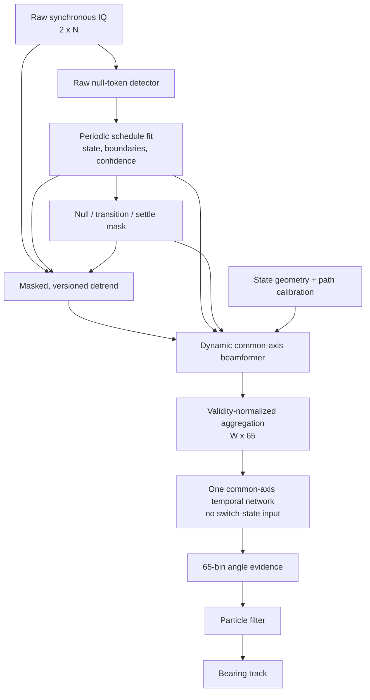

# Two-stream switched-array common-axis processing plan

**Date:** 2026-08-25
**Status:** proposed implementation and evaluation plan; no production behavior is
changed by this document.

## Executive decision

Preserve the simplest useful contract:

- the receiver continues to record exactly two synchronous complex IQ streams;
- one decoded switch state—or explicit `UNKNOWN`/invalid status—is associated with
  every IQ sample;
- switch state is used only by preprocessing to select geometry, calibration, and
  validity;
- every valid sample is beamformed directly onto one common array/body-relative
  angular grid;
- the state-aligned sample responses are noncoherently aggregated into the existing
  `windowed_beamformer` shape `[W, 65]`;
- the direction network does **not** receive switch-state ID; and
- the PF remains downstream of one normalized 65-angle evidence vector.

This is a time-varying two-element beamformer, not a claim that the sequential switch
states form one simultaneous coherent multi-element array. The state sequence supplies
multiple baseline geometries over time; common-axis steering makes their evidence
comparable before the network sees it.

| Decision | Initial contract |
| --- | --- |
| Raw IQ | Two synchronous tracks, `[2, N]` |
| State | One preprocessing-only state or `UNKNOWN` per sample |
| Angular frame | One array/body frame, with an explicit fixed transform to craft frame |
| Beamformer | State-specific steering, magnitude before cross-state aggregation |
| Network BF input | `[W, 65]`, no switch ID |
| Invalid samples | Explicitly masked; never encoded as zero or NaN IQ |
| Model reuse | Reuse `[W, 65]`, the encoder family, and legacy data; add masking and retrain |
| PF | One common-frame angle-evidence vector per update |

## 1. Goals and non-goals

### Goals

1. Reuse the two-channel acquisition path, `[W, 65]` interface, and temporal encoder
   family.
2. Make geometry alignment deterministic rather than asking a network to learn eight
   known geometry/path transforms from switch IDs.
3. Recover repeated switch timing from an in-band null token and a known cyclic
   schedule.
4. Preserve raw IQ and enough provenance to rerun state recovery, calibration,
   detrending, and beamforming.
5. Fail closed when state, settling, calibration, or sample continuity is uncertain.
6. Isolate preprocessing error from model error through oracle-versus-inferred shadow
   evaluations.

### Non-goals

- Synthesizing a coherent virtual array across switch dwells before phase coherence and
  motion tolerance have been demonstrated.
- Treating equal tensor shape as checkpoint compatibility.
- Passing switch-state identity into the DOA network as a substitute for geometry.
- Hiding missing states, cycle slips, or transition samples inside ordinary IQ values.
- Changing the PF state vector in the first implementation; its timing and observation
  adapters still need to become switch-aware.

## 2. Coordinate and geometry contract

The repository's live angular convention is clockwise-positive:

- `theta = 0` points along positive array broadside (`+Y`);
- `theta = +pi/2` points right (`+X`), along the default ordered channel-0 to
  channel-1 baseline; and
- `theta = +/-pi` points along negative broadside.

The direction vector is

\[
u(\theta) = [\sin\theta,\ \cos\theta].
\]

This convention is implemented by
[`precompute_steering_vectors`](../spf/rf.py#L1172) and documented immediately above
it. A new array catalog must define:

- the common frame's origin, axes, handedness, and units;
- the fixed transform from that frame to the craft frame;
- ordered channel-to-antenna and channel-to-RF-path mappings for every state;
- physical phase-center coordinates for both selected elements;
- LO, gain, and wavelength support; and
- an immutable calibration artifact ID and hash.

For the intended topology, channel 0 normally remains the coherent reference and
channel 1 selects one of eight antennas. The representation nevertheless stores both
ordered endpoints for every state so that channel reversal cannot be mistaken for a
rotation.

The steering equation below is a far-field plane-wave model: all active baselines are
assumed to observe one common bearing. Phase 0 must qualify a minimum source range for
the actual aperture by bounding wavefront-curvature and baseline-center parallax error.
If that bound is exceeded, restrict the operating envelope or use range/position-aware
spherical steering rather than silently applying one bearing.

### Canonical angular grid

Keep 65 angular values but give the new feature a genuinely cyclic grid:

\[
\theta_k = -\pi + \left(k+\frac{1}{2}\right)\frac{2\pi}{65},
\qquad k=0,\ldots,64.
\]

The current raw beamformer instead uses an inclusive `linspace(-pi, pi, 65)`, which
duplicates the seam and has a different step from the network/PF distribution grid.
See [`rf.py`](../spf/rf.py#L1179) and
[`posterior.py`](../spf/evaluation/posterior.py#L9). A new versioned cache should fix
this rather than perpetuate the mismatch. Bin 32 is then exactly zero. Store the exact
angle vector and its hash in every derived cache. Legacy captures can be recomputed onto
the new grid without changing their raw IQ.

## 3. End-to-end pipeline

The detector and signal-processing branches deliberately begin from the same retained
raw IQ. State recovery must not depend on a transform that can erase or reshape the
null marker.

## 4. Null-token state recovery

Multiple cycles per buffer are an advantage: they allow a joint fit of cycle phase,
clock scale/drift, and bounded boundary jitter rather than an independent threshold
decision at every edge. Nominal firmware dwell/null widths should be fixed or strongly
regularized. Fit individual widths only when the token code makes them uniquely
identifiable and enough complete cycles are present; otherwise a missed token can trade
off against an apparent double-width dwell.

### Required inputs

- The nominal state order and transition direction.
- Nominal active and null dwell widths in sample units.
- A unique cycle anchor: a known commanded initial state, a distinctive sync token, or
  equivalent metadata.
- The absolute ADC sample-counter interval for each buffer.

Identical nulls identify boundaries but do not, by themselves, identify which following
dwell is state 0: the decoded sequence is otherwise ambiguous up to a cyclic shift. The
unique anchor resolves that ambiguity.

### Decoder stages

1. Validate buffer and sample-counter continuity.
2. Compute per-channel null likelihood from raw IQ using short-window power, variance,
   and any deliberately coded marker property.
3. Preserve candidate start and end bounds rather than reducing each token to one
   timestamp.
4. Jointly fit all candidates to the known repeating schedule, allowing bounded jitter,
   missed candidates, false candidates, and slow period drift.
5. Decode state ordinal and propagate boundary uncertainty.
6. Expand every boundary by its confidence interval plus measured transition and
   settling guards.
7. Mark uncertain state, cycle slip, counter gap, or insufficient settled support as
   unusable rather than guessing.

RF silence or a deep fade can resemble an analog null. Periodicity and two-channel
evidence make the detector stronger, but hardware captures with sample-counter-stamped
commanded states should be retained as oracle truth during development. A future
firmware event table can become a production cross-check without changing what the
network consumes.

### Decoder outputs

Store compact sample-domain runs, not necessarily an expanded per-sample array:

- absolute start and end sample counters;
- state ordinal and cycle number;
- observed versus fitted/imputed boundaries;
- boundary confidence interval;
- null, transition, settling, and stable intervals;
- per-channel edge skew and confidence;
- cycle-period/drift fit and residuals; and
- rejection reason when state is not trustworthy.

## 5. Detrending policy

Crossing a switch boundary is not categorically forbidden. It is unsafe only when a
shared fit allows one RF state or marker to alter the valid samples of another state.
The current implementation does exactly that: it performs four independent ordinary
least-squares fits—real and imaginary parts of both channels—in fixed, unmasked
1,024-sample blocks before beamforming or phase statistics.
See [`detrend.py`](../spf/sdrpluto/detrend.py#L512) and
[`segmentation.py`](../spf/dataset/segmentation.py#L408).

For channel `c` within one block, the active transform is equivalent to

\[
r_c[n] = x_c[n] - \mu_c - b_c(t_n - 1/2).
\]

Every input sample contributes to `mu_c` and `b_c`. A null or transition therefore
changes every residual in that block. Dynamic steering corrects changing geometry; it
cannot undo an earlier state-dependent detrend artifact.

### Versioned rollout

**Always-feasible control:** apply no detrend, use only stable valid samples, and run the
dynamic beamformer. This isolates whether detrending is helping at all.

**Conservative audit baseline:** reject any legacy 1,024-sample detrend block containing a
null, transition, unsettled sample, unknown state, invalid calibration, or counter gap.
Anchor these blocks to one declared absolute ADC sample-counter origin rather than each
buffer's local sample zero; otherwise changing buffer boundaries changes the transform.
The remaining samples may still be dynamically steered and combined with samples from
other states in one 2,048-sample output window.

**Data-efficient candidate:** fit a masked nuisance model using stable samples only.
Evaluate at least these forms:

1. one shared complex offset/slope per channel when ADC drift is demonstrably common
   across switch states; and
2. shared drift plus state-specific complex intercepts when the RF paths have distinct
   leakage or offsets; and
3. fully state/run-specific complex intercept and slope, with explicit minimum support
   and conditioning requirements.

The first two are comparators, not assumptions of safety. Even a physically common ADC
drift estimate can absorb state-dependent RF phasors and couple one state into another;
the third form or a signal-rejecting nuisance estimator is the required isolation
control.

Do not encode rejected samples as literal zero or NaN before fitting. A masked fit must
remove them from both the design matrix and response. If rapid switching leaves the
model poorly conditioned, return an invalid block rather than extrapolating.

Promotion requires an oracle-state comparison of no detrend, legacy, conservative, and
masked detrend variants. Measure phase, common-axis beamformer shape,
boundary-distance bias, usable fraction, and downstream angle error. Crossing states
may be retained only if it passes that registered comparison.

## 6. Dynamic common-axis beamformer

Let `x[n,c]` be the detrended complex IQ sample on channel `c`, `s[n]` the inferred
switch state, and `m[n]` the final validity mask. For state `s`, center the ordered
element positions around their midpoint and precompute

\[
A[s,k,c] = \kappa[s,c]\,
\exp\left[-j\frac{2\pi}{\lambda}
u(\theta_k)^T\widetilde p[s,c]\right],
\]

where `kappa` is the declared complex factor applied to the steering weight. If a
calibration artifact instead defines a sample-domain correction, convert it once under
an explicit sign/conjugation convention before constructing `A`; never apply both. A
known-source and channel-swap golden test must lock this convention. State-only
`kappa[s,c]` is permitted only if randomized transition-order and cycle-rate captures
show that residual phase/amplitude after the guard is independent of predecessor state,
transition direction, and dwell age within a registered bound. Otherwise condition the
calibration or guards on transition and time-since-contact. The current steering helper
already accepts arbitrary positions and an optional calibration factor, although the
dataset path presently supplies local unrotated positions and no calibration.
See [`rf.py`](../spf/rf.py#L1172) and
[`spf_dataset.py`](../spf/dataset/spf_dataset.py#L1047).

Apply the state-selected table per sample:

\[
z[n,k] = \sum_{c=0}^{1} A[s[n],k,c]x[n,c],
\qquad b[n,k] = |z[n,k]|.
\]

This preserves the repository's current magnitude—not squared-power—beamformer
semantics. It also avoids rotating an already sampled raw beamformer, so no angular
interpolation is needed.

For output window `w`, aggregate valid evidence as

\[
B[w,k] =
\frac{\sum_{n\in w}m[n]q[n]b[n,k]}
     {\sum_{n\in w}m[n]q[n] + \epsilon},
\]

where `q[n]` is either one or a predeclared reliability weight.

Keep `W` on the legacy fixed 2,048-sample grid, anchored to the absolute ADC sample
counter; do not compact or reorder windows when some samples are invalid. Emit valid
count, per-state occupancy, weighting policy, and a validity-weighted effective sample
timestamp alongside `B`. A zero-valid-count row receives a finite neutral cache value
plus `window_valid=false`; it must be masked before model normalization and throughout
temporal processing, never interpreted as a zero-valued observation.

Transport buffers do not define this grid. Choose one capture-level sample-counter
anchor, carry/stitch samples across buffer boundaries, and form each network observation
from `W` consecutive global windows. Hold an incomplete live window until the next
buffer; at a true capture edge, use an explicitly masked neutral row rather than
duplicating or compacting data. This rebuffering rule is what makes fixed shape and
chunk-boundary invariance compatible.

### Weighting experiment

Compare two registered policies:

- **sample-balanced:** every stable sample receives equal weight; and
- **state-balanced:** compute one mean per represented state, then average states with
  declared reliability weights.

State-balanced aggregation prevents dwell duration from becoming an accidental weight,
but it can overvalue a state with very few stable samples. Require a minimum valid count
and reliability/uncertainty weighting. Register a per-state minimum effective sample
count, the omit-versus-reject rule, and the realized counts in cache provenance. A state
below threshold is omitted; if the remaining subset lacks enough support or fails its
observability gate, mark the row invalid rather than awarding one sample a full state
vote. Sample-balanced aggregation is simpler and may be preferable when dwell duration
intentionally represents confidence. Select the policy through the registered ablation
because it changes the feature's meaning despite preserving `[W, 65]`.

The result is noncoherent across states because magnitude is taken before aggregation.
Each two-element state retains its own front/back and possible spacing aliases. After
alignment, the true direction is common while mirror peaks move with baseline
orientation, so multiple baselines may resolve ambiguity. Nonparallel geometry alone is
not a proof: when `d/lambda > 0.5`, phase wrapping can leave duplicate or nearly duplicate
bearings even across several states. Repeated or parallel baselines add evidence but not
new angular observability.

Before selecting a unique training target, exhaustively score the calibrated state
catalog over the full angle grid and every allowed missing-state subset. Record
duplicate/near-duplicate bearing pairs, the true-to-best-alias margin, conditioning, and
angular coverage. Only subsets that pass a registered observability threshold may use a
single-peak target.

## 7. Network feature contract

The 65 beamformer channels can retain their shape, but the semantic contract changes
from one local static pair to common-frame evidence accumulated from a time-varying
pair. The cache and model configuration must therefore receive a new version even if
the tensor dimensions are identical.

The current production-like model also consumes three rows of
`all_windows_stats`: detrended pair-local phase mean, phase standard deviation, and
signal magnitude. Pair-local phase mean is coordinate-dependent and cannot be pooled
across rotated baselines without state geometry. See
[`segmentation.py`](../spf/dataset/segmentation.py#L542) and the model concatenation in
[`single_point_networks.py`](../spf/model_training_and_inference/models/single_point_networks.py#L848).

The first switched-array model should therefore use:

- the common-axis `[W, 65]` beamformer;
- an explicit window-valid mask; and
- separately normalized, state-neutral quality such as calibrated magnitude, valid
  fraction, and settle/state-fit confidence.

Run a BF-only baseline first. Retaining 68 channels is acceptable only if the three
nonangular rows are explicitly redefined and versioned; silently retaining mixed-state
pair-local phase mean is not.

Audit every scalar input as well as the 68 temporal channels. The June model consumes a
single `rx_wavelength_spacing`, two gains, frequency, vehicle type, and SDR type. A
window containing unequal switched baselines has no truthful single `d/lambda`, and its
gain can vary by state. The first BF-only configuration should explicitly disable any
undefined spacing/gain input; each retained key must have a new, testable common-axis
definition rather than inheriting a plausible-looking scalar from one state.

The current temporal encoder does not consume a validity mask. The switched path needs
mask-aware normalization and temporal processing—including masked pooling and no
invalid-row leakage through convolution—plus a padded-row invariance test. Merely
writing `window_valid` beside the current tensor is insufficient.

The existing encoder family is a useful starting point, but mask-aware operations are a
real architecture change and the June checkpoint is not guaranteed to transfer. Its
temporal convolution treats the 65 angular values as fixed channels and is not
rotation-equivariant. Warm-start versus scratch is an experiment, not an assumption.

### Training data

- Recompute legacy fixed-pair captures through the same canonical path with a constant
  state. They retain substantial value for single-state pretraining and static
  regression, but cannot teach null recovery, settling artifacts, or multi-baseline
  fusion.
- Train switched examples with random buffer-cycle phase so temporal position cannot
  become an implicit switch ID.
- Include missing-state, guarded-transition, clock-drift, amplitude, calibration-error,
  and boundary-jitter augmentation through the validity path.
- Split evaluation by capture, hardware, site, trajectory, and calibration/remate
  epoch—not by windows.
- Do not train a one-peak target for observations whose available baseline geometry is
  intrinsically ambiguous. Single, aliased, or otherwise degenerate state subsets need
  geometry-derived multimodal targets or exclusion from the unique-bearing loss.

Add a new common-axis target/loss mode. The existing single-radio loss deliberately
mirrors every target to teach one static two-element array's front/back ambiguity; using
that path unchanged would erase the disambiguation supplied by a sufficiently observable
switched set. The existing paired loss has a unique craft target but is coupled to a
hard-coded two-radio model. The new target builder must use the actual valid geometry
subset: a unique common-frame target—ground truth transformed into that frame—only when
the catalog-level observability gate passes, and an ambiguity-aware target otherwise.

The network emits a normalized common-frame angle-evidence vector. It is not assumed to
be a calibrated Bayesian posterior. Report NLL, Brier score, calibration, entropy, and
coverage in addition to angle MSE before allowing the PF to treat it as an observation
factor.

## 8. PF integration

The first implementation keeps the existing bearing/bearing-rate particle state. Each
accepted network output supplies one 65-angle common-frame observation.

- Do not apply the present paired network's receiver-mount rotation again: common-axis
  beamformer evidence is already aligned.
- Apply the fixed array/body-to-craft transform exactly once if the canonical array axis
  is not craft forward.
- Apply rover heading exactly once when converting craft-relative evidence to absolute
  north.
- Skip invalid observations rather than replacing them with an artificial confident
  distribution.
- Store an effective sample-counter/time for every observation and predict with actual
  elapsed `dt`. The current generic PF hard-codes `dt = 1.0`; that is not valid when
  updates are dropped, counter gaps occur, or aggregation duration varies. A fixed-cadence
  resampling adapter is acceptable only if that cadence is explicitly guaranteed and
  tested.
- If one switching cycle spans meaningful rover yaw or source motion, either shorten
  the aggregation interval or transport sample/window evidence to a declared reference
  timestamp before fusion.

The existing dual-radio NN PF already consumes one fused 65-vector, so the particle
state and update mathematics can remain structurally unchanged. Its inference/cache
adapters currently assume two radios and a duplicated `paired[0]` result, so those
wrappers still require audit or replacement. See
[`particle_dual_radio_nn_filter.py`](../spf/filters/particle_dual_radio_nn_filter.py#L41).
The switched unit must have an end-to-end one-physical-receiver observation adapter; do
not satisfy legacy shape assertions by duplicating it into two fake radios.

## 9. Data, cache, and provenance

Raw IQ remains authoritative. The derived cache must bind its contents to:

- source capture UUID/content identity;
- raw data and switch-event schema versions;
- state-decoder algorithm/configuration and schedule hash;
- geometry catalog and ordered channel mapping hashes;
- calibration artifact hashes;
- absolute sample bounds, each row's effective timestamp, and counter-continuity result;
- null/transition/settle guards and validity policy;
- detrend algorithm and parameters;
- exact angular grid and coordinate frame;
- aggregation/weighting policy; and
- code/model configuration identity.

Store per-window sample bounds, valid count, state occupancy, state-fit confidence,
calibration support, and rejection reason for audit. State ID remains in the cache for
steering and diagnostics but is omitted from the NN batch.

Current YARR files do not carry this contract, and current precompute naming is not
sufficient to distinguish geometry or switch calibration. Use a new cache namespace
rather than allowing a switched capture to collide with a static-pair cache.

The raw transport path is a prerequisite, not an implementation detail. Version a
switched capture schema before state-decoder work and verify that one physical receiver,
absolute sample-counter intervals, oracle/switch events, and all manifest hashes survive
capture, merge, and precompute byte-for-byte. A capture without the required counter
contract must fail closed. The current V7 merger copies only a subset of V7 fields,
assumes the legacy receiver pairing, and rewrites receiver-0 orientation; the switched
path must preserve its extensions and disable that historical rewrite. See
[`v7_data.py`](../spf/dataset/v7_data.py#L46) and
[`v7_tx_rx_merge.py`](../spf/scripts/v7_tx_rx_merge.py#L340).

## 10. Implementation phases and gates

### Phase 0 — freeze geometry and collect oracle captures

- Version and round-trip the switched capture schema through acquisition, merge, and
  precompute; support one physical receiver without legacy orientation rewriting.
- Freeze angle, ordered-channel, geometry, schedule, and calibration conventions.
- Record sample-counter-stamped commanded state during development.
- Measure null-to-contact offset, channel skew, and p99/p99.9 settling for every
  transition under the intended LO/gain conditions.
- Randomize transition order and cycle rate to bound residual dependence on predecessor,
  transition direction, and dwell age.
- Qualify the closest source range for the actual aperture and far-field error budget.
- Exhaustively evaluate the calibrated response manifold for every allowed state subset
  and register the threshold for a unique versus ambiguity-aware target.

**Gate:** the counter/event schema survives an acquisition-to-precompute round trip; all
eight static states put a known source on the same common-angle bin after steering; and
the null code plus actual guard/detrend policy leaves the registered minimum total
support per network observation and per row declared valid. Fully masked rows are
permitted up to a separately registered fraction.

### Phase 1 — implement and score state recovery

- Detect raw null candidates.
- Fit the periodic schedule across buffers in ADC sample-counter coordinates.
- Emit confidence bounds, stable runs, and fail-closed QC.
- Compare inferred state to oracle state under fades, DC offset, missing/extra tokens,
  clipped buffer-edge tokens, drift, and jitter.

**Gate:** wrong-state assignments are rejected rather than silently accepted; boundary
confidence coverage and usable-data yield meet thresholds registered before hardware
evaluation.

### Phase 2 — build shadow dynamic beamformer caches

- Implement grouped/table-gather state-specific steering on the common grid.
- Produce oracle-state and inferred-state `[W, 65]` caches from identical raw captures.
- Implement absolute-counter-anchored conservative detrending and all registered masked
  nuisance variants, including fully state/run-specific fits.
- Record validity, state occupancy, and calibration provenance.

**Gate:** for each constant state, common-axis output matches the legacy pair-local
beamformer within a declared numeric tolerance after applying the known local-to-common
angular transform and matching grid, calibration, detrend, and mask semantics;
inferred-state classical performance stays close to oracle-state performance.

### Phase 3 — preprocessing ablation

Evaluate the factorial combination of:

- oracle versus inferred state;
- no detrend, legacy, conservative, and masked detrend;
- sample-balanced versus state-balanced aggregation; and
- calibrated versus deliberately wrong/stale calibration.

**Gate:** select one preprocessing contract before neural training. Do not let a model
hide state-decoder, detrend, or calibration failure.

### Phase 4 — train the common-axis model

- Start with BF-only plus validity and state-neutral quality.
- Compare warm-start and scratch training.
- Mix recomputed legacy fixed-pair and new switched captures without passing state ID.
- Verify random cycle phase prevents schedule-position shortcuts.
- Implement the common-axis target mode and verify that observable switched examples can
  learn one peak while single-state and aliased examples remain ambiguity-aware.

**Gate:** inferred-state model nearly matches its oracle-state counterpart, does not
regress registered legacy/static conditions, and meets accuracy plus calibration gates
on held-out hardware and capture groups.

### Phase 5 — offline PF evaluation

Replay identical recordings through:

1. legacy processing;
2. oracle-state classical common-axis processing;
3. inferred-state classical processing;
4. oracle-state NN processing; and
5. inferred-state NN processing.

Report track MSE, circular MAE, NLL/Brier/ECE/coverage, rejected/usable fraction,
latency, cycle slips, state diversity, calibration age, and PF uncertainty calibration.

**Gate:** no double rotation or duplicated evidence, end-to-end tracking improves in the
registered switched-array conditions, actual elapsed PF timing handles dropped and
irregular updates, and processing fits the real-time budget.

### Phase 6 — shadow, canary, and rollout

- Run new preprocessing and inference in field shadow mode without controlling a
  decision.
- Log disagreement, state-fit confidence, usable coverage, entropy, latency, per-state
  amplitude drift, and calibration age.
- Canary PF updates only when preprocessing QC passes; otherwise skip the observation
  or fall back to a qualified fixed pair.
- Expand by hardware/calibration cohort with explicit rollback thresholds.

**Gate:** sustained field performance and QC remain inside the registered envelope;
every anomaly retains raw IQ and complete provenance for replay.

## 11. Required tests

1. **Static equivalence:** one constant state reproduces the qualified pair-local static
   beamformer after the known local-to-common transform and matched grid, calibration,
   detrend, and mask semantics.
2. **Rotation sign:** rotating geometry and source by `delta` rotates common evidence by
   `+delta`.
3. **Channel order:** swapping IQ and ordered geometry together preserves output;
   swapping IQ alone produces the expected mirror/sign failure.
4. **Observability:** one state preserves its physical two-element ambiguity; exhaustive
   catalog/subset sweeps identify which multi-state sets are unique and which remain
   aliased or ill-conditioned.
5. **Null detection:** recover start/end bounds across SNR, DC offset, declared token
   perturbations, fades, clipped buffers, missing/false tokens, drift, and cycle slips.
6. **Downstream mask invariance:** with oracle or frozen decoded state and mask, arbitrary
   payload values in masked samples cause no output change within numerical tolerance
   and never enter a detrend fit, steering sum, or normalization; finite neutral rows have
   no effect under any padding pattern.
7. **Detrend isolation:** state transitions cannot contaminate accepted samples under
   the promoted policy.
8. **Aggregation:** reordering state runs within one fixed output window is invariant;
   duplicating or lengthening a state changes output only according to the declared
   weighting rule, and one valid sample cannot receive a full state vote below the
   registered per-state threshold. This does not assert that the temporal NN is invariant
   to reordering its `W` rows.
9. **Calibration:** known path errors are corrected by the matching artifact and stale
   or unsupported calibration fails closed.
10. **Chunk invariance:** processing the same absolute samples under different buffer
    boundaries produces the same decoded state and beamformer output; detrend and output
    grids use their declared absolute counter anchors.
11. **CPU/GPU parity:** compare complex steered samples and final BF values before and
    after storage quantization.
12. **Network schema and targets:** assert that switch ID, path ID, and schedule ordinal
    are absent, every legacy scalar input is disabled or explicitly redefined, and target
    modality follows the registered observability result.
13. **One-receiver adapter and PF time:** exercise the full switched path without fake
    radio duplication across dropped updates, counter gaps, variable intervals, and
    within-cycle yaw.
14. **Schema round trip:** exact counter/event intervals, ordered geometry, calibration,
    and hashes survive capture, merge, and precompute; unsupported/no-counter inputs fail
    closed and legacy orientation rewriting is absent.
15. **Switch-history calibration:** randomized predecessor, transition direction, cycle
    rate, and dwell-age trials validate state-only correction or trigger a conditioned
    calibration/guard contract.
16. **Hardware azimuth/range sweep:** compare every static state, oracle switched mode,
    and inferred switched mode over angle, source range, SNR, LO/gain, temperature, and
    remate epochs.

## 12. Open decisions before implementation

1. Is the null emitted at every boundary or once per complete cycle?
2. What provides the unique absolute cycle/state anchor?
3. What are nominal active/null widths and their controller-clock tolerance?
4. Does each transition have the same analog settling behavior?
5. Are gains fixed during a cycle, and can AGC movement imitate a null or settling
   transient?
6. Are all reference-to-selected baselines equal length, and how many distinct baseline
   orientations do they provide?
7. Does the common array axis coincide with craft forward, or is a fixed transform
   required?
8. Is sample-balanced or state-balanced aggregation the intended physical weighting?
9. Which state-neutral quality features, if any, replace the current pair-local phase
   rows?
10. How stable is per-path calibration across LO, gain, temperature, reboot, and
    mechanical remate, predecessor state, transition direction, dwell age, and cycle
    rate?
11. How much rover motion/yaw occurs during one complete switch cycle?
12. Does the switched two-stream unit replace one current physical receiver, or does its
    output enter the existing two-physical-radio fusion path?
13. What exact finite neutral row and mask-aware temporal operation preserve fixed `W`
    when a window has no usable samples?
14. What source-range envelope keeps plane-wave curvature and baseline-center parallax
    inside the registered angular-error budget?

## 13. Promotion rule

Promote only a self-describing, versioned path that satisfies all three conditions:

1. state recovery and calibration are independently measurable against oracle truth;
2. every accepted IQ sample is dynamically steered in the correct common frame and
   aggregated under an explicit validity/weighting rule; and
3. the model is retrained and evaluated for the new feature semantics even though its
   principal tensor shape remains `[W, 65]`.

This keeps switch geometry where it belongs—in deterministic preprocessing—while
preserving the compact network interface and substantial value from the existing
two-channel data corpus.
