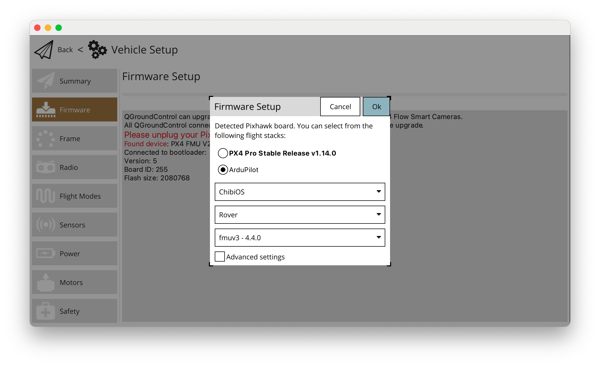
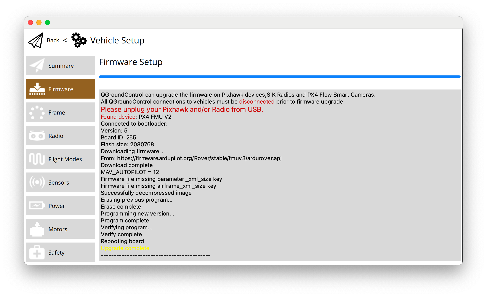

Setup rover firmware

# Flashing firmware

Use QGroundControl to flash (or Mission control) rover firmware onto fmuv3





# Important parameters

```

# radio control
RC1_MAX (2006)
RC1_MIN (982)
RC1_TRIM (1495)
RC2_MAX (2006)
RC2_MIN (982)
RC2_TRIM (1495)
RC3_MAX (2006)
RC3_MIN (982)
RC3_TRIM (1515)
RC1_MAX (2006)
RC1_MIN (982)
RC1_TRIM (1492)

#radio mode control
MODE4 (10) (driving mode for switch position 4)
MODE6 (11) (driving mode for switch position 6)

#setup left right motor banks
SERVO1_FUNCTION (73)
SERVO1_MAX (2200)
SERVO1_MIN (800)
SERVO3_FUNCTION (74)
SERVO3_MAX (2200)
SERVO3_MIN (800)
SERVO3_REVERSED 1

MOT_THR_MIN (12) 

#movement
TURN_RADIUS (5)
WP_PIVOT_ANGLE (0) (0 ~ disable pivot turns)
WP_RADIUS (0.5)
WP_SPEED (3) 
RTL_SPEED (3)
CRUISE_SPEED (3)
CRUISE_THROTTLE (70)


```