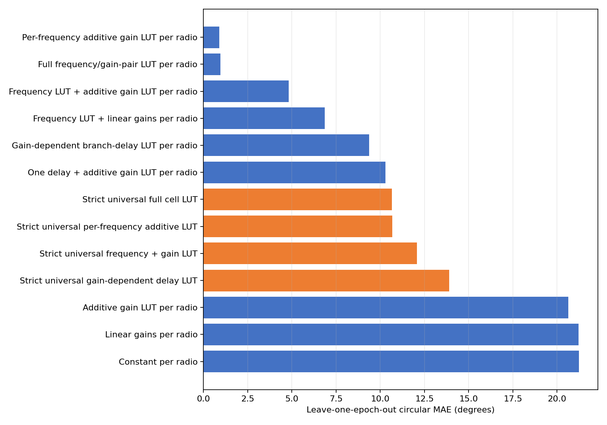
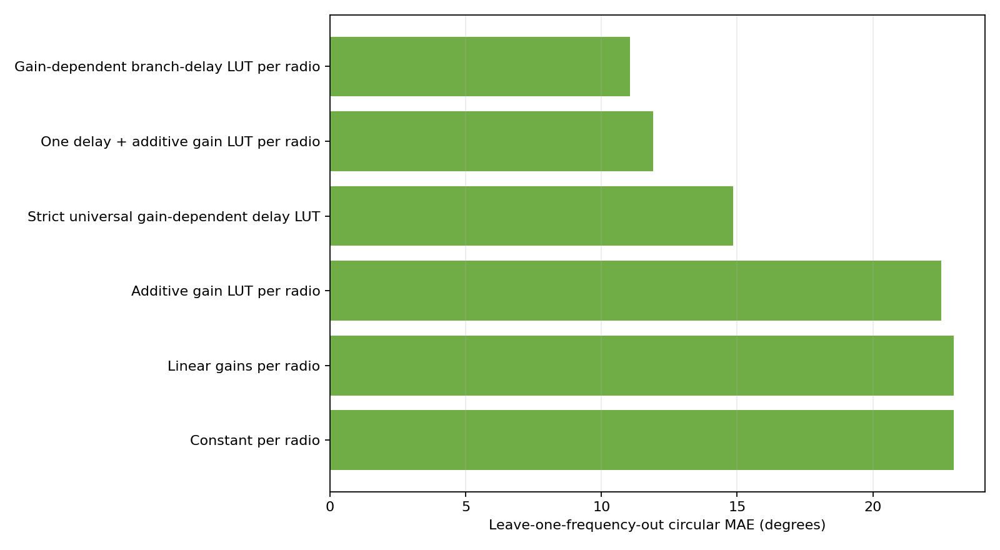

# Dense dual-RX phase model matrix

## Scope and evaluation

- Phase convention: `RX1 minus RX2`.
- Reference gain: 26 dB.
- Reference frequency for delay fits: 3.378000 GHz.
- Differential phase identifies only RX1 delay minus RX2 delay. Reported branch-delay LUT terms are relative contributions under the stated reference constraints, not absolute physical delays.

## Input checkpoint

| Pluto serial | Completed | Quality-valid | Validation | Scalar-input SHA-256 |
|---|---:|---:|---|---|
| `104000707f0700120f001a0095f2dbee49` | 10404 | 10209 | `fail_quality` | `c4f6ba758f104104382ddbb98f737893e378014ab4b42f606e272b619424f6dd` |
| `104000f6ad020002fdff3a00bba2f096a1` | 10404 | 10200 | `fail_quality` | `3cdff911d608a6a1e9c30f1a2756e56f68e453aab5a950ab4d808edc6aaed492` |
| `104000b299050013f4ff0700255e35222f` | 10404 | 10184 | `fail_quality` | `90c4162a8428392d9e41162e491e0678707a1c7bcc6dd6572d3656597aff654e` |
| `104473b80a16000de6ff2000f8a6beca79` | 10404 | 9917 | `fail_quality` | `b648131701ecaf5d1910040427fbfb610244eca2f95f7fdf1c78eaff37bfd916` |

All datasets are structurally complete. `fail_quality` means quality-rejected frames remain explicit in the V7 dataset; only quality-valid observations enter these fits.

## Evaluation design

The main table uses leave-one-epoch-out prediction: two repeats train the model and the third is unseen. This is the fair operational test for lookup tables whose deployment support is the measured grid.

## Known-cell prediction

| Model | Scope | Parameters | MAE ° | RMSE ° | P95 ° | Max ° | Coverage |
|---|---:|---:|---:|---:|---:|---:|---:|
| Per-frequency additive gain LUT per radio | per_radio | 1584 | 0.903 | 1.348 | 3.069 | 9.005 | 100.00% |
| Full frequency/gain-pair LUT per radio | per_radio | 13872 | 0.949 | 1.449 | 3.273 | 11.478 | 99.99% |
| Frequency LUT + additive gain LUT per radio | per_radio | 176 | 4.824 | 6.225 | 12.732 | 25.603 | 100.00% |
| Frequency LUT + linear gains per radio | per_radio | 56 | 6.856 | 9.196 | 19.381 | 35.451 | 100.00% |
| Gain-dependent branch-delay LUT per radio | per_radio | 264 | 9.367 | 12.484 | 27.798 | 50.282 | 100.00% |
| One delay + additive gain LUT per radio | per_radio | 136 | 10.289 | 13.392 | 28.729 | 51.358 | 100.00% |
| Strict universal full cell LUT | universal | 3468 | 10.647 | 16.763 | 38.871 | 68.957 | 100.00% |
| Strict universal per-frequency additive LUT | universal | 396 | 10.677 | 16.830 | 38.997 | 67.048 | 100.00% |
| Strict universal frequency + gain LUT | universal | 44 | 12.076 | 17.737 | 41.776 | 68.388 | 100.00% |
| Strict universal gain-dependent delay LUT | universal | 66 | 13.893 | 19.065 | 40.756 | 56.990 | 100.00% |
| Additive gain LUT per radio | per_radio | 132 | 20.642 | 25.798 | 54.267 | 80.430 | 100.00% |
| Linear gains per radio | per_radio | 12 | 21.222 | 26.700 | 55.900 | 92.959 | 100.00% |
| Constant per radio | per_radio | 4 | 21.247 | 26.778 | 56.012 | 95.218 | 100.00% |



### Best model by radio

| Pluto serial | MAE ° | RMSE ° | P95 ° | Max ° |
|---|---:|---:|---:|---:|
| `104000707f0700120f001a0095f2dbee49` | 0.830 | 1.265 | 2.937 | 8.410 |
| `104000f6ad020002fdff3a00bba2f096a1` | 0.917 | 1.392 | 3.166 | 8.389 |
| `104000b299050013f4ff0700255e35222f` | 0.901 | 1.310 | 2.923 | 9.005 |
| `104473b80a16000de6ff2000f8a6beca79` | 0.965 | 1.422 | 3.224 | 8.080 |

## Unseen-frequency test

| Model | Scope | MAE ° | RMSE ° | P95 ° | Coverage |
|---|---:|---:|---:|---:|---:|
| Gain-dependent branch-delay LUT per radio | per_radio | 11.049 | 14.548 | 32.093 | 100.00% |
| One delay + additive gain LUT per radio | per_radio | 11.894 | 15.406 | 32.810 | 100.00% |
| Strict universal gain-dependent delay LUT | universal | 14.846 | 19.848 | 41.929 | 100.00% |
| Additive gain LUT per radio | per_radio | 22.508 | 28.112 | 58.978 | 100.00% |
| Linear gains per radio | per_radio | 22.972 | 28.851 | 60.518 | 100.00% |
| Constant per radio | per_radio | 22.982 | 28.896 | 60.783 | 100.00% |



### Fitted effective differential delays

| Model | Pluto serial | Base delay ps | Free-space equivalent mm |
|---|---|---:|---:|
| One delay + additive gain LUT per radio | `104000707f0700120f001a0095f2dbee49` | 20.738 | 6.217 |
| One delay + additive gain LUT per radio | `104000f6ad020002fdff3a00bba2f096a1` | 35.898 | 10.762 |
| One delay + additive gain LUT per radio | `104000b299050013f4ff0700255e35222f` | 45.315 | 13.585 |
| One delay + additive gain LUT per radio | `104473b80a16000de6ff2000f8a6beca79` | 4.905 | 1.471 |
| Gain-dependent branch-delay LUT per radio | `104000707f0700120f001a0095f2dbee49` | 23.262 | 6.974 |
| Gain-dependent branch-delay LUT per radio | `104000f6ad020002fdff3a00bba2f096a1` | 36.594 | 10.971 |
| Gain-dependent branch-delay LUT per radio | `104000b299050013f4ff0700255e35222f` | 49.198 | 14.749 |
| Gain-dependent branch-delay LUT per radio | `104473b80a16000de6ff2000f8a6beca79` | 3.650 | 1.094 |

## Strict universal transfer to an unseen radio

| Model | MAE ° | RMSE ° | P95 ° | Max ° | Coverage |
|---|---:|---:|---:|---:|---:|
| Strict universal per-frequency additive LUT | 14.171 | 22.302 | 51.411 | 86.010 | 100.00% |
| Strict universal full cell LUT | 14.201 | 22.363 | 51.574 | 85.950 | 99.99% |
| Strict universal frequency + gain LUT | 15.173 | 22.887 | 54.015 | 85.822 | 100.00% |
| Strict universal gain-dependent delay LUT | 15.962 | 22.830 | 51.395 | 66.225 | 100.00% |

## Physical interpretation

A delay-only explanation is supported only if the delay models are competitive on the unseen-frequency test. A good fit on the measured frequencies alone is insufficient: a frequency lookup can absorb arbitrary retune- or band-dependent phase offsets.

The gain-dependent branch-delay model assigns relative delay terms to RX1 and RX2 gain states. Because only RX1−RX2 phase is observed, adding the same absolute delay to both paths is unobservable; the individual physical path lengths cannot be recovered from this experiment.

## Interpretation and recommendation

The recommended correction on this measured grid is the per-radio, per-frequency additive lookup. The full cell lookup has many more parameters and no held-out benefit, so an RX1-by-RX2 interaction table is not justified by these data.

Do not use the strict universal model as a precision correction for an unseen radio. Its leave-one-radio-out error measures the cost of omitting radio-specific calibration.

The delay models are useful descriptions of a broad phase slope, but their unseen-frequency errors reject path imbalance as the only mechanism. Retune state, frequency-band analogue response, and frequency-dependent gain-table effects still require explicit frequency calibration or denser within-band characterization.

## Reproduction

```bash
python -m spf.calibrations.dual_rx_gain_frequency model-matrix \
  --config spf/calibrations/dual_rx_gain_frequency/configs/survey_cross_band.yaml \
  --dataset /mnt/qnap01/mouse9911/spf/calibration_data/raw/dual_rx_gain_frequency/survey_cross_band_20260727_v1/104000707f0700120f001a0095f2dbee49/calibration.v7.zarr \
  --dataset /mnt/qnap01/mouse9911/spf/calibration_data/raw/dual_rx_gain_frequency/survey_cross_band_20260727_v1/104000f6ad020002fdff3a00bba2f096a1/calibration.v7.zarr \
  --dataset /mnt/qnap01/mouse9911/spf/calibration_data/raw/dual_rx_gain_frequency/survey_cross_band_20260728_new_radios_v1/104000b299050013f4ff0700255e35222f/calibration.v7.zarr \
  --dataset /mnt/qnap01/mouse9911/spf/calibration_data/raw/dual_rx_gain_frequency/survey_cross_band_20260728_new_radios_v1/104473b80a16000de6ff2000f8a6beca79/calibration.v7.zarr \
  --output-dir artifacts/dual_rx_gain_frequency/model_matrix
```
