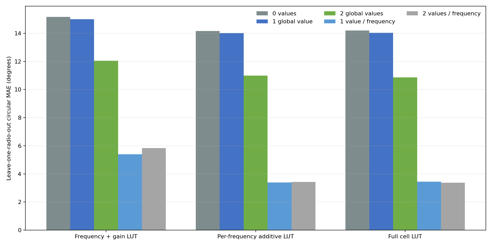

# Four-radio dense calibration and low-cost transfer

## Executive conclusion

Four physical Pluto radios now support the same central result:

```text
phase(f, g1, g2)
    = radio_frequency_intercept[f]
    + RX1_effect[f, g1]
    + RX2_effect[f, g2]
```

The per-radio, per-frequency additive LUT is the best parsimonious model on
known frequency/gain cells. Its leave-one-epoch-out error across 40,410
quality-valid observations is:

| MAE | RMSE | P95 | Maximum |
|---:|---:|---:|---:|
| 0.903° | 1.348° | 3.069° | 9.005° |

A full RX1-by-RX2 interaction LUT uses 13,872 parameters and is slightly worse
at 0.949° MAE. The interaction table is therefore not justified.

The practical low-cost onboarding result is more nuanced:

- One or two calibration values for the *entire* 0.868–5.866 GHz range are
  insufficient. They leave 14.008° and 10.996° MAE, respectively, with the
  best universal additive gain LUT and fixed anchors.
- If a rover operates at one selected RF frequency, one target-radio value at
  that frequency reduces leave-one-radio-out error to 3.385° MAE. Across all
  four held-out boards, the per-radio range is 2.522–4.524°.
- A second fixed gain anchor at the same frequency does not improve the
  aggregate result: 3.419° versus 3.385° MAE.
- An exploratory search selected RX1=41 dB/RX2=-1 dB as a potentially useful
  second gain anchor and reached 3.019° MAE. Because the same four radios
  selected and scored this pair, it must be tested on a fifth unseen board
  before production use.

The recommended fast calibration is therefore:

1. Ship the four-radio universal per-frequency additive gain LUT.
2. At the exact operating frequency, set RX1=RX2=26 dB.
3. Inject the common calibration tone.
4. Capture three short frames and store their circular-mean phase residual as
   one scalar target-radio value.
5. Add that scalar to the universal gain LUT for the session.
6. Fail closed at uncalibrated frequencies.

This uses three frames for a single operating channel instead of 10,404
frames, a 3,468× reduction. Covering all 12 measured frequencies uses 36
frames, still 289× fewer than the dense sweep.

## Input checkpoint

The primary analysis uses one dense run per physical radio. The independent
second run of the two replacement radios is used only for temporal
repeatability and is not counted as two additional boards.

| Cohort | Serial | Complete | Quality-valid | Validation |
|---|---|---:|---:|---|
| Previous | `104000707f0700120f001a0095f2dbee49` | 10,404 | 10,209 | `fail_quality` |
| Previous | `104000f6ad020002fdff3a00bba2f096a1` | 10,404 | 10,200 | `fail_quality` |
| Replacement | `104000b299050013f4ff0700255e35222f` | 10,404 | 10,184 | `fail_quality` |
| Replacement | `104473b80a16000de6ff2000f8a6beca79` | 10,404 | 9,917 | `fail_quality` |

Every dataset is structurally complete. `fail_quality` means weak,
low-coherence, or phase-unstable extreme gain-mismatch frames remain explicit;
it is not a capture, metadata, or transport failure.

## Model ladder

The full 13-model table is in
[MODEL_MATRIX_REPORT.md](MODEL_MATRIX_REPORT.md). Key rungs are:

| Model | Scope | Parameters | Known-cell MAE | P95 |
|---|---|---:|---:|---:|
| Per-frequency additive gain LUT | Per radio | 1,584 | **0.903°** | 3.069° |
| Full frequency/gain-pair LUT | Per radio | 13,872 | 0.949° | 3.273° |
| Frequency LUT + additive gain LUT | Per radio | 176 | 4.824° | 12.732° |
| Frequency LUT + linear gains | Per radio | 56 | 6.856° | 19.381° |
| Gain-dependent delay LUT | Per radio | 264 | 9.367° | 27.798° |
| Additive gain LUT without frequency | Per radio | 132 | 20.642° | 54.267° |
| Constant | Per radio | 4 | 21.247° | 56.012° |

The gain-dependent delay model reaches 11.049° MAE when predicting an omitted
frequency. Path imbalance describes part of the broad trend, but not the
band-specific retune offsets. Exact-frequency calibration remains necessary
for precision correction.


## Low-cost target-radio adaptation

The detailed exhaustive search is in
[LOW_COST_CALIBRATION_REPORT.md](LOW_COST_CALIBRATION_REPORT.md). Each target
radio is held out while its universal LUT is fitted from the other three
physical radios.

### One or two values total per radio

| Universal base | Target values | Fixed anchors | MAE | P95 |
|---|---:|---|---:|---:|
| Per-frequency additive gain LUT | 0 | None | 14.171° | 51.411° |
| Per-frequency additive gain LUT | 1 | 2.412 GHz | 14.008° | 42.885° |
| Per-frequency additive gain LUT | 2 | 0.868 and 5.866 GHz | 10.996° | 37.430° |
| Per-frequency additive gain LUT | 2 | 2.412 and 5.766 GHz, exploratory | 8.514° | 31.752° |

One global offset cannot capture a board's frequency-dependent phase baseline.
Two global values fit one offset plus one frequency slope, but still cannot
capture the observed band structure.

### One or two values at the operating frequency

| Universal base | Values per frequency | Second gain pair | MAE | P95 |
|---|---:|---|---:|---:|
| Per-frequency additive gain LUT | 1 | None | **3.385°** | 11.274° |
| Per-frequency additive gain LUT | 2 | RX1=62/RX2=26 dB, fixed | 3.419° | 11.553° |
| Per-frequency additive gain LUT | 2 | RX1=41/RX2=-1 dB, exploratory | 3.019° | 9.762° |
| Full cell LUT | 1 | None | 3.439° | 11.379° |

The full cell LUT does not improve transfer enough to justify its size. The
single equal-gain value is currently the best defensible cost/accuracy point.



## Repeatability

The replacement radios were each measured in two independent, complete
10,404-frame dense runs. Common quality-valid cell means changed by:

| Serial | Common cells | Drift MAE | RMSE | P95 |
|---|---:|---:|---:|---:|
| `…5e35222f` | 3,399 | 0.532° | 0.783° | 1.754° |
| `…a6beca79` | 3,308 | 0.705° | 0.976° | 1.919° |

This is much smaller than cross-radio transfer error. The measured LUT is
stable across the two runs; board-to-board baseline differences dominate.

## Recommended next experiment

Use a fifth unseen radio to choose between:

1. **Production candidate:** one 26/26 dB value at the exact operating
   frequency.
2. **Experimental candidate:** add a second 41/-1 dB value at that frequency.

Pre-register those choices before looking at the fifth radio. Report
leave-one-board-out MAE and P95 without retuning the anchor pair. If the second
anchor does not provide a repeatable material improvement, retain the simpler
one-value procedure.

Do not deploy the globally selected exploratory anchors as if they were
already validated. Do not extrapolate an anchor to a different LO frequency.

## Reproduction and artifacts

- [Full model ladder](MODEL_MATRIX_REPORT.md)
- [Low-cost calibration analysis](LOW_COST_CALIBRATION_REPORT.md)
- [Machine-readable model matrix](model_matrix.json)
- [Machine-readable low-cost results](low_cost_calibration.json)
- [Model metrics CSV](model_metrics.csv)
- [Low-cost metrics CSV](low_cost_metrics.csv)

Both machine-readable files record the exact source paths and SHA-256 hashes
of every scalar analysis input.
