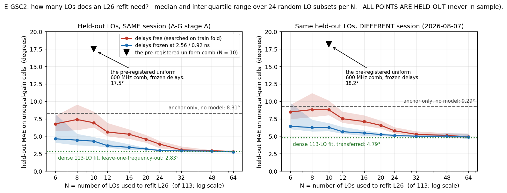
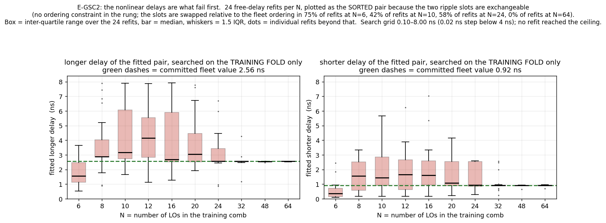
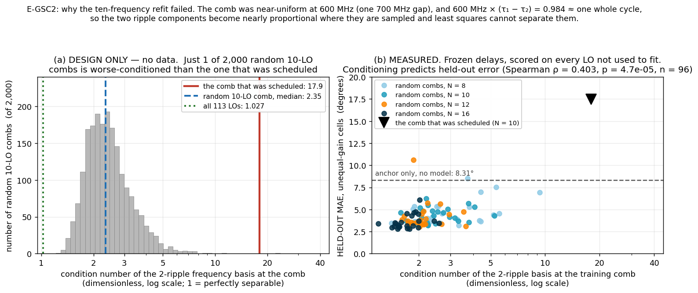
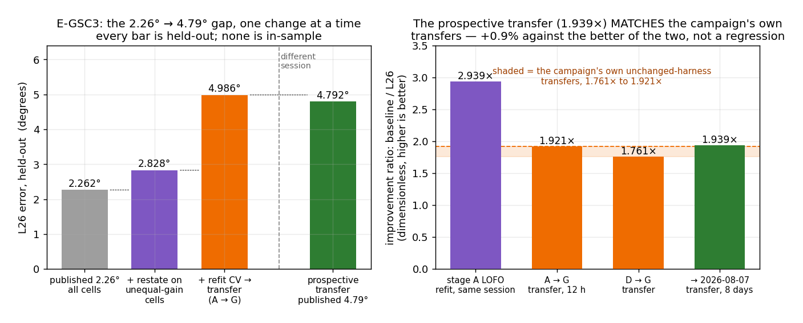
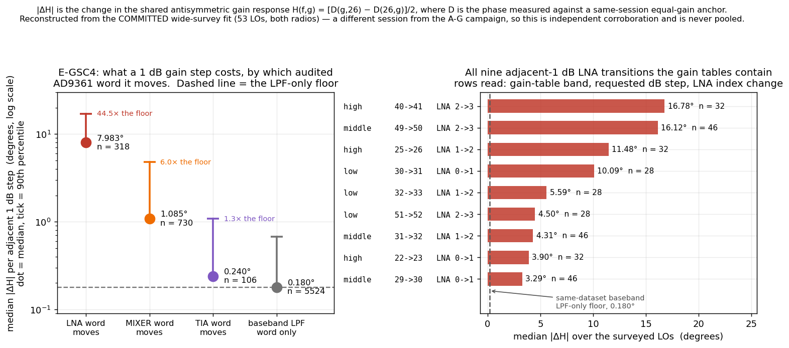

# The computational gain-state program: E-GSC1 – E-GSC5

`docs/future_experiments.md` queues five experiments that need no new frames.
This report runs them. It follows directly from
[`gain_state_phase_model_20260802_v1/REPORT.md` §8.1](../gain_state_phase_model_20260802_v1/REPORT.md),
which rejected the ten-frequency sparse-calibration claim and left four questions
open: *how many LOs does the model actually need*, *why did retrospective 2.26°
become prospective 4.79°*, *does the LNA claim survive at 1 dB resolution*, and
*should `L30` replace `L26` as the shipped default*.

- Analysed: 2026-08-07. SPF git `c9b8d837`, working tree dirty in unrelated
  paths (rover notebooks, scanner outputs); **nothing under `spf/calibrations/`
  was modified by this analysis**.
- Sources, all opened **read-only**:
  - `/mnt/qnap01/mouse9911/share/spf_campaigns/spectroscopy_20260730_full{,_r2}`
    — the A–G campaign, reusing the source report's scalar extraction.
  - `/mnt/qnap01/mouse9911/share/spf_campaigns/gain_state_followups_20260807_v1`
    — the prospective E-CAL2/E-CAL3 campaign, extracted here for the first time
    with the source report's own `extract.py`, unmodified. 12 stores,
    4,234 frames, 4,233 quality-valid.
  - [`wide_integer_gain_cross_band_20260730_v1/model_matrix.json`](../wide_integer_gain_cross_band_20260730_v1/model_matrix.json)
    — the committed fitted coefficients of the wide 53-LO integer-gain survey,
    whose raw stores no longer exist on this machine (§6).
  - [`spf/calibrations/gain_state_phase_model_v1/`](../../../gain_state_phase_model_v1/)
    — the shipped coefficient sets and audited gain tables.
- Analysis code: [`analysis/`](analysis/). SHA-256 of every analysed input, code
  file and generated result is in [`inputs_manifest.json`](inputs_manifest.json).
- Phase convention: `angle(RX1) − angle(RX2)`.
- **Every model here is ANCHORED**: it predicts `D = φ − measured equal-gain
  anchor` at the same (radio, LO, session, epoch). Unsupported cells **fail
  closed to the anchor**, never to zero and never to an extrapolated value.
- The source pipeline was run from a **scratch copy**, so the committed result
  JSONs of the 2026-08-02 report were not overwritten. This pipeline reproduces
  every published stage-A number it touches to four decimal places (§2.3).

---

## 1. Executive summary

1. **The E-CAL3 ten-frequency failure was caused by the comb's *spacing*, not by
   the number of points — and it is a design property that could have been
   computed before the capture.** The scheduled comb was uniform at ~600 MHz. The
   two fitted ripple delays differ by `τ₁ − τ₂ = 1.64 ns`, and
   `600 MHz × 1.64 ns = 0.984` — one whole cycle. At that spacing the two ripple
   components **alias onto each other**: their sampled cosine columns have
   `r = −0.874` across the comb, and the condition number of the four-column
   ripple basis is **17.92** against a median of **2.35** for a random 10-LO
   comb. **Exactly 1 of 2,000 random 10-LO combs (0.05%) is worse-conditioned than
   the one that was scheduled** (§3.3).
2. **Consequently, ten LOs are not intrinsically too few.** With the delays
   frozen at the committed fleet values, a *random* 10-LO comb reaches a median
   **4.299°** held-out unequal-gain MAE against an **8.355°** anchor-only
   baseline — recovering **73.4%** of the improvement the dense 113-LO fit
   achieves — and beats anchor-only in **24/24** subsets. The same ten
   *pre-registered* LOs give **17.490°**, i.e. **twice as bad as no model at
   all** (§3.2).
3. **N\* = 16** for the free-delay refit: the smallest N at which ≥90% of random
   subsets beat anchor-only (100% at N ≥ 16; 88% at N = 12 and erratic below).
   Freezing the two delays drops **N\* to 8**. The frozen-delay architecture —
   *learn the nonlinear basis once fleet-wide, fit only the identifiable linear
   terms per unit* — is therefore **validated**, and the achievable bench-time
   saving is quantified: N = 20 recovers 93.5% and N = 24 recovers 97.7% of the
   dense-fit improvement, against 113 LOs today (§3.2, §3.4).
4. **The 2.26° → 4.79° gap is fully explained, and nothing is left over.** It is
   one accounting change and one wrong comparator: restating on unequal-gain
   cells is **+0.566°**, and moving from *refit cross-validation* to
   *cross-session transfer* is **+2.159°** (stage-A LOFO 2.828° → A→G transfer
   4.986°). The prospective number, 4.792°, is then **0.195° better** than the
   campaign's own 12-hour unchanged-harness transfer. Improvement ratios: refit
   CV **2.939×**, A→G **1.921×**, D→G **1.761×**, prospective **1.939×** — the
   prospective ratio **matches** the campaign's own unchanged-harness transfers,
   landing **+0.9%** above the better of the two rather than below either.
   **`2.26°` was never a transfer number** (§4).
5. **"The new session may simply have been harder" is refuted.** The anchor-only
   baseline moved **+11.8%** (8.310° → 9.290°, unequal-gain) while the model
   error moved **+69.5%** (2.828° → 4.792°). Session difficulty cannot carry a
   69.5% move. Against the correct comparator the prospective session was in fact
   *easier* than stage G (baseline 9.290° vs 9.577°) (§4.3).
6. **The LNA claim is now established at 1 dB resolution; E-GSC4 is no longer
   blocked.** The wide survey's committed coefficients yield **318 adjacent-1 dB
   LNA transitions** across all three bands — the A–G campaign measured **zero**.
   Median `|ΔH|` is **7.983°** against a **same-dataset** baseband-LPF-only floor
   of **0.180°**: a **44.46×** ratio, cluster-bootstrap 95% CI
   **[35.32, 53.98]**. The pre-declared ≥5× rule fires decisively. The cleanest
   arm is a single transition — **high band, 40→41 dB, LNA 2→3 with MIXER, TIA
   *and* LPF all frozen** — worth **16.775°** median over 32 clusters, with only
   the `RF_DC_CAL` flag co-moving, which §6.2 of the source report already bounds
   at ≲0.7° (§5).
7. **`h_tia` should be dropped.** On the wide survey the TIA-only step is
   separately identifiable (Mann-Whitney p = 0.00723 against the same-dataset LPF
   floor) but its median magnitude is **0.240°**, at or below the campaign's
   measured 0.355–0.368° per-step noise floor. Removing the family changes every
   wide-survey holdout by **≤0.092°** (§5.4, §6.5). E-GSC1's pre-declared rule
   fires: drop it.
8. **Band non-portability is confirmed as a frequency-extrapolation limit, not a
   coverage hole.** The wide survey reaches **all four LNA levels in all three
   bands**, and leave-one-band-out for `L26` is still **3.727° at 95.7%
   coverage** — above E-GSC1's 3° threshold, on a reconstruction that is if
   anything optimistic (§6.4).
9. **`L26` stays the within-band default; `L30` ships as a second rung; the
   cross-band default is FAIL CLOSED.** Under a criterion pre-registered on A–G
   data only, `L26` wins unseen-frequency error outright (2.828° vs `L30`'s
   4.424° unequal-gain LOFO, 100% coverage both), no rung clears the cross-band
   bar, and `L30` is promoted to a second rung solely on rule-5 grounds: on the
   672 pooled cells where both arms share the audited RF words, `L26` injects a
   mean **1.362°** and makes **81.4%** of them worse, while `L30`/`L31` are
   exactly neutral. The prospective confirmation agrees on the within-band choice
   (`L26` 4.792° vs `L30` 6.427°) (§7).
10. **A mask inconsistency in the source report's §8.1 table.** Its 4.79°/4.80°
    model figures are scored on all **113** LOs; its 9.06° baseline is scored on
    the **103** held-out LOs. On a paired 103-LO mask the committed
    `l26_stage_a_v1` gives **4.6466°** and `l26_pooled_v1` **4.6506°**; on all
    113 LOs the baseline is **9.2899°**, not 9.06°. The ratio is essentially
    unchanged (1.939 vs 1.949) and no conclusion moves, but the table should be
    restated on one mask (§9).



---

## 2. Conventions, and what may be compared with what

### 2.1 The two error conventions, never mixed

| Convention | Definition | Stage-A baseline | Prospective baseline |
|---|---|---:|---:|
| **all cells** | includes the equal-gain anchor cell, residual zero by construction (20.0% of stage-A rows) | 6.647° | 7.431° |
| **unequal-gain (`uneq`)** | only the cells a deployed correction acts on | 8.310° | 9.290° |

Every table below states its convention. Where a single number is quoted in
prose it is the unequal-gain one, because that is what §8.1 of the source report
used for its prospective figures.

**Improvement *ratios* are invariant to the convention.** The anchor cell
contributes zero to both the baseline and the model error, so it rescales
numerator and denominator identically — the stage-A LOFO ratio is 2.939 in both
conventions, to every digit computed. That is why §4 leans on ratios.

### 2.2 The three generalisation axes, which the existing report conflates

| Axis | What is held out | Example |
|---|---|---|
| **unseen frequency, same session** | one LO, or a block of LOs | stage-A LOFO / LOBLK — the 2.26° number |
| **unseen session, seen frequency** | a whole later capture | A→G, and the entire prospective test — the 4.79° number |
| **unseen band** | a whole gain-table band | LOBAND |

The committed `l26_stage_a_v1` coefficients were fitted on **all 113** stage-A
LOs. When they are scored on the prospective capture, which uses the **same 113
LOs**, no frequency is unseen. **The prospective test is a pure session-transfer
test and contains no frequency generalisation at all.** That single fact resolves
E-GSC3.

### 2.3 Pipeline verification

| Quantity | Here | Published |
|---|---:|---:|
| stage-A rows / LOs | 3,389 / 113 | 3,389 / 113 |
| stage-A baseline `D` MAE (all) | 6.6472 | 6.647 |
| `L26` stage-A LOFO MAE (all) | 2.2620 | 2.26 |
| `L26` stage-A LOBLK MAE (all) | 2.4730 | 2.47 |
| `L26` stage-A LORO MAE (all) | 2.2190 | 2.22 |
| pooled rows / LOs | 4,641 / 119 | 4,641 / 119 |
| `L26` pooled LOFO MAE (all) | 2.1087 | 2.11 |
| `L30` pooled LOFO MAE (all) | 2.9853 | 2.99 |
| prospective anchor-only, 103 LOs, `uneq` | 9.0565 | 9.06 |
| E-CAL3 ten-LO refit, `uneq` | 11.6081 | 11.61 |
| — same, delays fixed at stage-A values | 30.7915 | 30.79 |
| — same, delays fixed at pooled values | 12.9256 | 12.93 |
| augmented LOBAND `L26` MAE / coverage | 5.5774 / 91.50% | 5.58 / 91.50% |
| augmented LOBAND `L30` MAE / coverage | 4.8272 / 100% | 4.83 / 100% |
| augmented LOBAND `L31` MAE / coverage | 10.7503 / 100% | 10.75 / 100% |
| augmented anchor-only baseline | 5.7120 | 5.71 |

---

## 3. E-GSC2 — the identifiability curve

### 3.1 Design

On the A–G dense stage-A set (113 LOs, 2 radios, 3,389 quality-valid rows),
refit `L26` from **N ∈ {6, 8, 10, 12, 16, 20, 24, 32, 48, 64}** LOs and score on
**all** held-out LOs. Two variants per N, on **identical subsets** so they are
paired:

- **(a) delays free** — both ripple delays grid-searched on the **training fold
  only**, over the source report's own 276-point τ grid (0.10–8.00 ns).
- **(b) delays frozen** — fixed at the committed fleet values 2.56 / 0.92 ns.

24 random LO subsets per N (seed 20260807), plus the deterministic
pre-registered E-CAL3 comb {400, 1000, 1600, 2200, 2800, 3400, 4100, 4700, 5300,
5900} MHz as a labelled extra. Every fit is scored twice: on the held-out
stage-A LOs (**same session**) and on exactly the same held-out LOs of the
2026-08-07 prospective capture (**different session**, genuinely external — no
fit here has ever seen it).

### 3.2 Result

Held-out MAE on unequal-gain cells, degrees. Median over 24 subsets, IQR in
brackets. "win" is the fraction of subsets that beat their own anchor-only
baseline. "recovered" is the fraction of the dense-fit-achievable improvement,
`(baseline − model) / (baseline − 2.828°)`.

**Same session (A–G stage A), anchor-only baseline ≈ 8.31°:**

| N | free: median [IQR] | free win | free recovered | frozen: median [IQR] | frozen win | frozen recovered |
|---:|---:|---:|---:|---:|---:|---:|
| 6 | 6.772 [5.738–7.945] | 79% | 28.0% | 4.633 [4.080–8.188] | 75% | 67.1% |
| 8 | 7.399 [5.877–9.547] | 58% | 16.7% | 4.445 [3.700–5.348] | **92%** | 70.5% |
| 10 | 6.929 [6.269–8.536] | 67% | 25.8% | **4.299** [3.651–4.890] | **100%** | 73.4% |
| 12 | 5.603 [4.995–6.907] | 88% | 49.5% | 3.642 [3.381–4.476] | 96% | 85.2% |
| **16** | 5.289 [4.632–5.979] | **100%** | 55.1% | 3.409 [3.022–3.858] | 100% | 89.4% |
| 20 | 4.573 [4.080–5.182] | 100% | 67.7% | 3.179 [3.062–3.338] | 100% | 93.5% |
| 24 | 3.874 [3.294–4.327] | 100% | 80.7% | 2.953 [2.887–3.109] | 100% | 97.7% |
| 32 | 3.044 [2.991–3.556] | 100% | 96.1% | 2.903 [2.813–2.992] | 100% | 98.6% |
| 48 | 2.924 [2.801–3.010] | 100% | 98.2% | 2.867 [2.761–2.933] | 100% | 99.3% |
| 64 | 2.804 [2.684–2.963] | 100% | 100.4% | 2.761 [2.679–2.880] | 100% | 101.2% |
| 113 *(dense LOFO reference)* | 2.828 | — | 100% | 2.828 | — | 100% |

**Different session (2026-08-07 prospective), anchor-only baseline ≈ 9.29°:**

| N | free: median [IQR] | free win | frozen: median [IQR] | frozen win |
|---:|---:|---:|---:|---:|
| 6 | 8.483 [7.461–9.526] | 62% | 6.426 [6.010–9.796] | 71% |
| 8 | 8.812 [7.755–11.188] | 58% | 6.244 [5.695–7.367] | 92% |
| 10 | 8.788 [8.018–10.118] | 58% | 6.268 [5.732–6.883] | 100% |
| 12 | 7.507 [6.923–8.532] | 79% | 5.651 [5.376–6.335] | 96% |
| **16** | 7.109 [6.510–7.994] | **100%** | 5.455 [5.053–5.844] | 100% |
| 20 | 6.552 [6.105–7.230] | 96% | 5.235 [5.077–5.472] | 100% |
| 24 | 5.775 [5.406–6.292] | 100% | 5.122 [4.919–5.227] | 100% |
| 32 | 5.276 [4.981–5.715] | 100% | 4.995 [4.876–5.195] | 100% |
| 48 | 5.115 [4.850–5.450] | 100% | 5.012 [4.844–5.442] | 100% |
| 64 | 4.911 [4.755–5.395] | 100% | 4.880 [4.644–5.381] | 100% |
| 113 *(whole stage A)* | 4.792 | — | 4.792 | — |

**The pre-registered uniform comb, against random combs of the same size:**

| Training comb, N = 10 | delays | in-campaign `uneq` | prospective `uneq` | fitted τ, longer / shorter (ns) |
|---|---|---:|---:|---|
| 24 random combs (median) | free | 6.929 | 8.788 | 3.16 / 1.45 |
| 24 random combs (median) | frozen | **4.299** | **6.268** | 2.56 / 0.92 *(fixed)* |
| the pre-registered uniform comb | free | 5.430 | 7.446 | **0.88 / 0.48** |
| the pre-registered uniform comb | frozen | **17.490** | **18.195** | 2.56 / 0.92 *(fixed)* |
| anchor-only baseline | — | 8.176 | 9.057 | — |

The fitted delays are reported as the **sorted pair**, because the rung imposes
no ordering on its two ripple slots and both search the same grid: the slots
themselves are exchanged relative to the fleet ordering in **75% of refits at
N = 6, 42% at N = 10, 58% at N = 24 and 0% at N = 64**. Reading them per slot
would show a spurious swap; the exchange rate is itself a measure of the same
non-identifiability. Committed fleet values for comparison: 2.56 / 0.92 ns.

**Coverage.** Median coverage is 1.000 at every N. The minimum over subsets falls
to **0.796–0.822** for N ≤ 20, where a subset happens to miss a whole gain-table
band and the corresponding LNA/LPF levels become unestimable. Those cells fail
closed to the anchor, so every MAE above is a fail-closed number and **none of
the improvement comes from dropping hard cells**. From N = 24 upward, coverage is
1.000 in every subset.

**N\*, as pre-declared:** the smallest N at which the free-delay refit beats
anchor-only in ≥90% of subsets is **N\* = 16**, on both the in-campaign and the
prospective scoring. Below 16 the win rate is non-monotone (79%, 58%, 67%, 88%),
which is itself informative — a free-delay refit from a small comb is a lottery,
not a gracefully degraded estimate. Freezing the delays gives **N\* = 8**.



The delay boxplots say which parameter fails first, and it is unambiguous: at
N ≤ 24 the longer fitted delay scatters over most of the 0.1–8 ns grid (median
3.16 ns at N = 10 against the fleet value 2.56 ns); by N = 32 it has collapsed
onto 2.54–2.56 ns and stays there, and the shorter one onto 0.92 ns. **The
linear terms are not the problem** — freezing only these two scalars is what
moves N\* from 16 to 8.

### 3.3 Why the pre-registered comb failed — a design property, computable in advance



The scheduled comb is uniform at ~600 MHz (8 of its 9 gaps are exactly 600 MHz,
one is 700 MHz). A uniform comb of spacing `Δ` cannot separate two delays
`τ, τ′` when `Δ·(τ − τ′)` is close to an integer. Here:

```text
τ₁ − τ₂      = 2.56 − 0.92 = 1.64 ns
Δ·(τ₁ − τ₂)  = 600 MHz × 1.64 ns = 0.984  ≈  1 whole cycle
```

So on this comb the two ripple components are aliases of one another. Measured
directly: across the ten scheduled LOs, `cos(2πfτ₁)` and `cos(2πfτ₂)` have
correlation **r = −0.874**, and the condition number of the four-column basis
`[cos τ₁, sin τ₁, cos τ₂, sin τ₂]` is:

| Comb | condition number |
|---|---:|
| the pre-registered uniform 10-LO comb | **17.92** |
| random 10-LO comb, median of 2,000 | 2.35 |
| random 10-LO comb, 90th percentile | 3.60 |
| random 10-LO comb, worst of 2,000 | 23.60 |
| all 113 LOs | 1.027 |

**Exactly 1 of 2,000 random 10-LO combs (0.05%) is worse-conditioned than the
one that was scheduled.** The consequence shows up in the fitted amplitudes: with the
delays frozen, the pre-registered comb produces ripple coefficients of RMS
magnitude **15.24°** and maximum **24.52°**, against a median RMS of **2.24°**
for random 10-LO combs. Those blown-up coefficients are what make the correction
worse than doing nothing between the sampled points.

**Conditioning predicts the measured outcome.** Panel (b) of the figure plots the
condition number of each frozen-delay training comb against the held-out error it
actually achieved, over the 96 random combs at N ∈ {8, 10, 12, 16}: Spearman
**ρ = 0.403, p = 4.7e-05**. Those 96 combs span condition numbers 1.19–9.31; the
scheduled comb sits at 17.92, outside that range entirely, with the worst
held-out error of any fit in this report.

Panel (a) involves no measured data at all. It could have been run before the
capture was scheduled, and it should be a gate on any future sparse calibration
set.

### 3.4 What this licenses, and what it does not

- **Validated.** "Learn the nonlinear frequency basis once from dense fleet data,
  freeze it, and fit only the identifiable linear terms per unit" works. It moves
  N\* from 16 to 8, and at N = 10 it recovers 73.4% of the dense-fit improvement
  in 100% of random subsets.
- **Not yet validated.** This is *retrospective subsampling of one dense
  capture* — exactly the methodological error §8.1 identified in `run_comb.py`.
  The prospective column mitigates it (the *test* set is a genuinely different
  session) but the *training* comb is still carved out of an existing dense
  capture. A sparse protocol must be **captured prospectively** before any
  bench-time claim is made.
- **The gate.** The identifiability gate is the **same-corpus dense-fit level**
  (2.828° unequal-gain stage-A LOFO), not the 4.8° cross-session figure.
  Frozen-delay fitting reaches within 0.13° of it at N = 32 and within 0.04° at
  N = 64; free-delay fitting needs N = 32 to get within 0.22°. The separate
  cross-session promotion bar (4.792°) is reached by frozen-delay fitting at
  N ≈ 32–64.
- **Recommended sparse set, if one is captured:** choose the LOs by minimising
  the ripple-basis condition number (§3.3), under the constraint that every
  gain-table band edge and every production LO is included. **Do not use a
  uniform comb.**

---

## 4. E-GSC3 — the 2.26° → 4.79° gap



### 4.1 Every relevant number, in both conventions

`L26` fitted with the source pipeline; every row fail-closed, coverage 1.000.

| Evaluation | Axis | baseline all / `uneq` | `L26` all / `uneq` | ratio |
|---|---|---:|---:|---:|
| stage A LOEO | unseen epoch, same session | 6.647 / 8.310 | 2.078 / 2.598 | **3.199** |
| stage A LOFO | unseen frequency, same session | 6.647 / 8.310 | 2.262 / 2.828 | **2.939** |
| stage A LOBLK | unseen ~690 MHz block, same session | 6.647 / 8.310 | 2.473 / 3.091 | 2.688 |
| A → G | unseen session, unchanged harness, 12 h | 7.661 / 9.577 | 3.989 / 4.986 | **1.921** |
| D → G | unseen session, unchanged harness | 7.661 / 9.577 | 4.350 / 5.438 | **1.761** |
| A → B *(treatment: 11 dB pad on treated RX1)* | session + harness | 6.588 / 8.236 | 2.548 / 3.185 | 2.586 |
| A → C *(treatment: 30 cm jumper on treated RX1)* | session + harness | 7.712 / 9.642 | 4.043 / 5.055 | 1.907 |
| A → D *(treatment: harness removed and restored)* | session + harness | 7.675 / 9.594 | 3.988 / 4.985 | 1.924 |
| **→ prospective, all 113 LOs** | **unseen session, 8 days** | **7.431 / 9.290** | **3.833 / 4.792** | **1.939** |
| → prospective, 103 LOs (excl. E-CAL3 comb) | unseen session | 7.245 / 9.057 | 3.717 / 4.647 | 1.949 |
| → prospective, the 10 E-CAL3 comb LOs only | unseen session | 9.354 / 11.693 | 5.028 / 6.285 | 1.860 |

**B, C and D are deliberate harness treatments, not session draws.** Per the
campaign config they form one ordered, cumulative chain (pad added, jumper added,
harness removed and restored), so they are correlated, not independent. The tell
is that B (3.185°) scores *better* than D and G. They are listed for completeness
and excluded from the transfer band. The clean unchanged-harness transfers are
**A→G and D→G**, and there are **two** of them — **n = 2, not a distribution**.

### 4.2 The decomposition

From the published 2.2620° to the published 4.7916°, one change at a time:

| Step | Change | Value | Δ |
|---|---|---:|---:|
| 0 | stage-A LOFO, all cells — the published 2.26° | 2.2620 | — |
| 1 | **restate on unequal-gain cells** (convention only, same fold) | 2.8277 | **+0.5657** |
| 2 | **refit cross-validation → cross-session transfer** (A→G, same convention, same campaign) | 4.9862 | **+2.1585** |
| 3 | swap stage G for the 2026-08-07 session | 4.7916 | **−0.1946** |

`2.2620 + 0.5657 + 2.1585 − 0.1946 = 4.7916`. Nothing is left over.

### 4.3 Verdict

**The gap is fully explained by convention plus refit-versus-transfer. No
residual remains to attribute to the reboot, the harness or elapsed time.**

- The prospective improvement ratio, **1.939×**, **matches** the campaign's own
  unchanged-harness transfers (**1.761×** for D→G and **1.921×** for A→G),
  landing **+0.9%** above the better of the two. It is marginally *outside* that
  two-point span, on the good side — the prospective transfer is not a
  regression, it is the best transfer measured. Per E-GSC3's pre-declared
  decision rule, the model is behaving as designed and only session difficulty
  changed, so **the headline
  should be stated as a ratio, roughly a factor of two on transfer, not as an
  absolute degree figure.**
- **"The new session may simply have been harder" is refuted as an explanation.**
  The anchor-only baseline rose **+11.8%** (8.310° → 9.290°) while the model
  error rose **+69.5%** (2.828° → 4.792°). An 11.8% harder session cannot produce
  a 69.5% worse model error. And against the correct comparator the prospective
  session was *easier* than stage G: baseline 9.290° vs 9.577°, with `L26`
  scoring 4.792° there against 4.986° on G. Replace the framing with:
  **`2.26°` was never a transfer number.**
- The paired restriction E-GSC3 asked for is **vacuous, and I checked rather than
  assumed**: the prospective dense capture covers **exactly the same 1,130
  (radio, LO, g1, g2) cells** as stage A — 1,130 each, 1,130 in common, zero on
  either side only. Restricting to the intersection changes the answer not at all
  (4.7916°, identical to four decimals).
- One genuine sub-effect: the 10 E-CAL3 comb LOs are a **harder subset** of the
  prospective capture (baseline 11.693° vs 9.057° on the other 103), which is why
  the mask mismatch of §9 matters slightly.

---

## 5. E-GSC4 — the adjacent-1 dB hardware-word discriminator



### 5.1 It is no longer blocked

E-GSC4 was scoped to two 2.4 GHz LOs and believed blocked because the raw Zarr
stores are gone. They are gone (§6.1) — but the **fitted coefficients are
committed**, and the anchored residual follows from them in closed form:

```text
committed fit:  φ = intercept[f] + RX1[f,g1] + RX2[f,g2],  RX1[f,26] = RX2[f,26] = 0
⇒ D(f,g1,g2) = φ(f,g1,g2) − φ(f,26,26) = RX1[f,g1] + RX2[f,g2]
⇒ H(f,g)     = [D(g,26) − D(26,g)]/2   = [RX1[f,g] − RX2[f,g]]/2
```

That is exactly the `H` of §3.2 of the source report, now available at **53 LOs
across all three gain-table bands and every integer gain from −1 to 62 dB**, on
both radios. §6.2 lists the caveats this inherits.

### 5.2 The discriminator

Every adjacent 1 dB step, classified hierarchically by which audited AD9361 word
moves (LNA > MIXER > TIA > LPF-only), exactly as §3.3 of the source report does.
The LPF-only class is the **same-dataset** floor, as E-GSC4's design requires.
6,678 steps over 106 (radio, LO) clusters.

| The 1 dB step changes | n | clusters | median `&#124;ΔH&#124;` | mean | p90 | max | vs LPF floor | cluster-bootstrap CI95 | MW p |
|---|---:|---:|---:|---:|---:|---:|---:|---|---:|
| the **LNA** word | 318 | 106 | **7.983°** | 8.647 | 17.045 | 26.263 | **44.46×** | [35.32, 53.98] | 4.8e-185 |
| the **MIXER** word | 730 | 106 | **1.085°** | 1.839 | 4.772 | 11.212 | **6.04×** | [5.11, 7.51] | 2.2e-228 |
| the **TIA** word only | 106 | 106 | 0.240° | 0.429 | 1.081 | 2.936 | 1.34× | [0.92, 1.85] | 0.00723 |
| the baseband **LPF** word only | 5,524 | 106 | 0.180° | 0.285 | 0.676 | 3.129 | 1× *(floor)* | — | — |

**The decision rule fires.** E-GSC4 pre-declared: "if `|ΔH|` for the LNA steps
exceeds the same-dataset LPF-only floor by ≥5×, the LNA claim is established at
1 dB resolution." It exceeds it by **44.46×**, with a bootstrap lower bound of
35.32×. **`docs/learnings.md` L10 finding 2 should be rewritten**: the LNA
attribution now rests on 318 directly measured adjacent-1 dB transitions, not on
four 9 dB steps and the ripple.

The mixer result **independently corroborates** the campaign: 6.04× here
(CI [5.11, 7.51]) against 7.76× there (CI [5.1, 16.3]), from a different session
on different dates. These are **not pooled**.

### 5.3 Every LNA transition, and the one clean arm

| Band | Step | LNA | MIX | TIA | LPF | `RF_DC_CAL` | n | median `&#124;ΔH&#124;` |
|---|---|---|---|---|---|---|---:|---:|
| high | 40→41 dB | **2→3** | 4→4 | 1→1 | **14→14** | 0→1 | 32 | **16.775°** |
| middle | 49→50 dB | 2→3 | 4→4 | 1→1 | 17→14 | 0→1 | 46 | 16.118° |
| high | 25→26 dB | 1→2 | 4→4 | 1→1 | 2→0 | 0→1 | 32 | 11.482° |
| low | 30→31 dB | 0→1 | 4→4 | 1→1 | 11→0 | 0→1 | 28 | 10.085° |
| low | 32→33 dB | 1→2 | 4→4 | 1→1 | 1→0 | 0→1 | 28 | 5.590° |
| low | 51→52 dB | 2→3 | 4→4 | 1→1 | 18→14 | 0→1 | 28 | 4.498° |
| middle | 31→32 dB | 1→2 | 4→4 | 1→1 | 2→0 | 0→1 | 46 | 4.312° |
| high | 22→23 dB | 0→1 | 4→4 | 1→1 | 13→0 | 0→1 | 32 | 3.903° |
| middle | 29→30 dB | 0→1 | 4→4 | 1→1 | 11→1 | 0→1 | 46 | 3.291° |

The **high-band 40→41 dB** row is the cleanest attribution anywhere in this
corpus: the LNA index moves 2→3 with the MIXER, TIA **and** LPF words all frozen.
The only other thing that changes is the `RF_DC_CAL` flag, which §6.2 of the
source report already bounds at ≲0.7° from the excluded `F_neg` stage. A 16.775°
median step against a ≲0.7° confound is a clean separation.

Every other LNA transition also moves the LPF word downward — the gain table
resets the baseband PGA when it advances the LNA — so those rows alone would stay
confounded. They are not needed: the 40→41 row carries the claim, and the
LPF-only floor of 0.180° over 5,524 steps shows a co-moving LPF change cannot
account for 3.3–16.8°.

The three transitions E-GSC4's design named at 2.4 GHz are present and consistent
across the six surveyed LOs near 2.4 GHz: 29→30 dB gives +0.82 to +2.06°,
31→32 dB gives −2.49 to −4.40°, and 49→50 dB gives −13.98 to −16.43° — the last
reproducing the −14.3 to −16.7° raw step published in
[`INTEGER_GAIN_CROSS_2P4_20260729.md`](../INTEGER_GAIN_CROSS_2P4_20260729.md).

### 5.4 `h_tia`: identifiable, and small enough to drop

E-GSC1 pre-declared: "if `h_tia` becomes separately identifiable and its
magnitude sits at or below the 0.355–0.368° measured noise floor, drop it and
re-declare `L26` with one fewer family."

The wide survey has three TIA-only transitions (low 24→25 dB, middle 22→23 dB,
high 13→14 dB), all `TIA 0→1` with a co-moving 5-step LPF drop. Their median
`|ΔH|` is **0.240°** — statistically distinguishable from the same-dataset LPF
floor (p = 0.00723) but **below the campaign's 0.355–0.368° per-step standard
error**. Per band: low 0.140°, middle 0.168°, high 0.800°.

**The rule fires: drop `h_tia`.** §6.5 confirms it directly by scoring the same
rungs with the family removed.

---

## 6. E-GSC1 — the wide 53-LO survey, from committed coefficients

### 6.1 What is verifiably absent, and what survived

I searched, and record the result precisely:

| Item | Status |
|---|---|
| `artifacts/dual_rx_gain_frequency/` | **absent**; `artifacts/` holds only `direct_usb_gain_metadata/` and `direct_usb_stability/` |
| `.../overnight_wide_integer_gain_cross_20260730_special_17_18_v1/` (E-GSC1's raw store, 55,650 frames) | **absent** |
| `.../integer_gain_cross_2p4_20260729_special_17_18_v1/` (E-GSC4's original raw store, 437 MiB) | **absent** |
| any `*.v7.zarr` under `/mnt/{4tb_ssd,data,md0,md1,md2,ssd,usb_drive,backblaze}` | **none exist** |
| `/mnt/qnap01/.../spf_campaigns/` | only `spectroscopy_20260730_full`, `..._r2`, `gain_state_followups_20260807_v1` |
| `wide_integer_gain_cross_band_20260730_v1/model_matrix.json` | **present in Git**, 3.6 MB, 6,731 fitted coefficients per radio |
| `INTEGER_GAIN_CROSS_2P4_20260729.md` published step table | present, but summary-level only |

The raw IQ is gone and cannot be recovered. The **fitted** evidence survives and
is enough for both of E-GSC1's core questions and for all of E-GSC4.

### 6.2 What a fitted reconstruction can and cannot support

These are **fitted cell values, not frames**. Stated plainly, because every
number in §5 and §6.3–6.5 inherits them:

- The underlying per-frequency additive fit has its own residual: **0.514° MAE
  in-sample, 0.713° leave-one-epoch-out**. Roughly that much measurement noise
  has been smoothed out, so errors computed against it are **optimistic**
  relative to frame-level errors, and the 0.180° LPF-only "floor" is a
  *fitted-curve* floor, not a measurement floor.
- **Epoch structure is not in the file**, so leave-one-epoch-out is impossible
  and no repeatability floor can be measured here.
- **The anchor is fixed at the fit's 26 dB reference.** It cannot be re-anchored
  and per-epoch anchoring cannot be reproduced.
- **Quality masks cannot be re-derived.** Both stores carry
  `validation_status = "fail_quality"` (25 and 43 of 27,825 frames failed: low
  RX1 tone SNR, low cross-channel coherence, unstable within-capture phase).
- **The 48 genuinely off-axis held-out pairs are not in the file** — only their
  published summary metrics. E-GSC1's off-axis decision rule therefore **cannot
  be evaluated**; the published reference figures (1.48°/1.48° independent
  curves, 1.41°/1.25° shared symmetric `H`) are quoted, not recomputed.
- **Different session and dates from the A–G campaign.** Everything here is
  independent corroboration and is **never pooled** with the campaign's `H`
  statistics.
- The report's own reproduction command needs `--prior-calibration-root` pointing
  at the missing raw survey, so **that specific command stays unrunnable**.
- The committed frequency list is used directly as the ripple-basis frequency;
  the ~100 kHz tone offset is not recorded there and is worth <0.1° at these
  delays.

The gain tables are safe to apply: the audited 231-row tables are
**byte-identical** between the A–G campaign, the 2026-08-07 follow-up and (via
the same firmware `7b02276519a8`) the wide survey. Verified by per-band SHA-256
in this analysis.

### 6.3 The state-coverage hole is closed

| | A–G campaign | wide survey |
|---|---|---|
| LNA levels reached | 0, 2, 3 — **1 never measured** | **0, 1, 2, 3 in all three bands** |
| TIA levels reached | 0, 1, collinear with MIXER 1 on stage A | 0, 1, not collinear |
| distinct requested gains | 3 (stage A) / 27 (pooled) | **64** |

### 6.4 The ladder on the wide survey

13,462 reconstructed additive-cross cells, 53 LOs, 2 radios, 64 gains.
Anchor-only baseline: **6.397°** all cells, **6.448°** unequal-gain — note the
anchor cell is only 0.79% of rows here, against 20.0% on stage A, so the two
conventions nearly coincide. All numbers fail-closed, coverage stated.

| Model | params | LOFO cov / MAE | LOBLK cov / MAE | LORO cov / MAE | LOBAND cov / MAE | fitted τ (ns) |
|---|---:|---:|---:|---:|---:|---|
| L00 anchor only | 0 | 1.000 / 6.397 | 1.000 / 6.397 | 1.000 / 6.397 | 1.000 / 6.397 | — |
| L01 sym H(g) universal | 64 | 1.000 / 4.797 | 1.000 / 5.173 | 1.000 / 4.711 | 1.000 / 6.174 | — |
| L05 sym H(lna,mixer,tia,lpf) | 46 | 1.000 / 3.756 | 1.000 / 4.200 | 1.000 / 3.660 | 0.957 / 4.890 | — |
| L06 sym H(gain-table row) | 75 | 1.000 / 3.809 | 1.000 / 4.272 | 1.000 / 3.711 | 0.949 / 4.788 | — |
| L08 sym H(band,g) | 192 | 1.000 / 3.113 | 1.000 / 3.623 | 1.000 / 2.982 | **0.000 / fails closed** | — |
| L16 MECH H(state)+1 ripple/LNA | 54 | 1.000 / 3.058 | 1.000 / 3.862 | 1.000 / 2.942 | 0.957 / 4.746 | 2.56 |
| **L26 MECH H(state)+2 ripples/LNA** | 62 | 1.000 / **2.224** | 1.000 / **2.656** | 1.000 / 2.073 | 0.957 / **3.727** | 2.54 / 0.10 |
| L27 MECH +delay +2 ripples/(band,LNA) | 113 | 1.000 / **2.094** | 1.000 / 4.156 | 1.000 / 1.492 | **0.000 / fails closed** | 2.54 / 0.10 |
| L30 MIN H(lna,mixer,tia) | 21 | 1.000 / 3.708 | 1.000 / 4.090 | 1.000 / 3.618 | 0.957 / 4.709 | — |
| L30b MIN H(lna,mixer) — **no `h_tia`** | 19 | 1.000 / 3.708 | 1.000 / 4.081 | 1.000 / 3.622 | 0.957 / 4.801 | — |
| L31 MIN + 2 ripples/LNA | 37 | 1.000 / 2.222 | 1.000 / 2.639 | 1.000 / 2.072 | 0.957 / 3.778 | 2.54 / 0.10 |
| L31b MIN + 2 ripples/LNA — **no `h_tia`** | 35 | 1.000 / 2.223 | 1.000 / **2.628** | 1.000 / 2.075 | 0.957 / 3.777 | 2.54 / 0.10 |
| L33 L32 + linear LPF slope | 89 | 1.000 / **2.040** | 1.000 / 4.887 | 1.000 / **1.433** | **0.000 / fails closed** | 2.54 / 0.10 |

Four things follow, from a session the campaign never touched:

- **The 2.56 ns ripple delay reproduces independently.** Every ripple-bearing
  rung fits `τ₁ = 2.54–2.56 ns` here, against the campaign's 2.54–2.56 ns and its
  2.5475 ns harness component. Two sessions, two campaigns, one delay.
- **The second delay does *not* reproduce.** `τ₂` collapses to the 0.10 ns grid
  edge in the median fold, i.e. the second component degenerates into a slow
  smooth trend rather than a 0.92 ns ripple. The wide survey's 53 LOs are
  clustered (six LOs inside 2411–2467 MHz) and cannot resolve a second, shorter
  delay. This is a limitation of that comb, not a contradiction of the campaign —
  but it does mean the second ripple rests on the A–G comb alone.
- **"Richer is not better once the gap is real" replicates exactly.** `L27` wins
  LOFO (2.094) and loses badly under LOBLK (4.156); `L33` wins LORO (1.433) and
  is the worst robust rung under LOBLK (4.887). `L26` is again the best rung that
  survives a real frequency gap (2.656). The campaign's model choice is
  corroborated on independent data.
- **`L26` remains the right shape** at 64 gains and full LNA coverage — 2.224°
  LOFO from 62 columns against `L01`'s 4.797° from 64.

### 6.5 The two E-GSC1 decision rules

- **`h_tia` → DROP.** `L30b` and `L31b` are `L30`/`L31` with the TIA family
  removed. The largest change on any of the four splits is **0.092°** (LOBAND,
  `L30`), and it is **0.000° on LOFO**. That is inside this directory's
  pre-declared 0.1° practical-equivalence margin, and it agrees with §5.4's
  direct measurement of 0.240° per TIA step against a 0.355–0.368° floor.
- **Band portability → NON-PORTABLE, confirmed as a frequency-extrapolation
  limit.** E-GSC1 pre-declared: "if leave-one-band-out still exceeds ~3° at ≥90%
  coverage with the survey's full state coverage, band non-portability is
  confirmed as a frequency-extrapolation limit independent of any campaign
  coverage hole." With all four LNA levels present in all three bands, `L26`
  gives **3.727° at 95.7% coverage** and `L31b` **3.777° at 95.7%** — both above
  3°, on a reconstruction that is if anything optimistic (§6.2). **"Sample every
  operating band directly" becomes permanent policy, not a provisional finding.**
  Note the improvement over the A–G pooled LOBAND (5.358° at 80.5% coverage) is
  real and comes from the filled states — but it does not cross the threshold.

---

## 7. E-GSC5 — `L26`, `L30` or both as the shipped default

### 7.1 The entry as written would have leaked, and its rule could never fire

Two problems, both fixed before any number was computed:

1. **Leakage.** The entry says to score all three rungs on the prospective 103-LO
   capture and pick a default. That is model selection on the only clean test set
   that exists, forbidden by
   [`MODEL_FITTING_AND_EVALUATION.md` §8](../../MODEL_FITTING_AND_EVALUATION.md)
   ("do not select a model on test performance and reuse the same score as its
   final unbiased estimate"). The criterion below was pre-registered and
   evaluated on **A–G data only**; the prospective numbers appear in §7.4, once,
   labelled as confirmation.
2. **The rule cannot fire.** "Promote `L30` if it is within 0.1° of `L26` on
   unseen-frequency error **and** better on band transfer **and** at least equal
   on coverage" is conjunctive, and the first clause fails by ~1.28° (stage-A
   LOFO, all cells: `L26` 2.2620 vs `L30` 3.5389). The rule halts there and never
   reaches the band-transfer evidence it exists to weigh. The question is
   therefore re-framed: **should the default be band-conditional?**

### 7.2 The pre-registered criterion

> **P1 — within-band default.** Among rungs with ≥99% coverage on the same mask,
> take the lowest unseen-frequency error (stage-A LOFO, confirmed by pooled LOFO
> and stage-A LOBLK). Ties inside 0.1° go to the simpler rung.
>
> **P2 — cross-band default.** A rung may be recommended across an **unmeasured**
> gain-table band only if, on the identical leave-one-band-out mask, it beats the
> anchor-only baseline by **≥0.5°** at **≥95% coverage**. Beating the other rung
> is not sufficient — both must clear the baseline. If none clears it, the
> cross-band default is **fail closed**, i.e. anchor only.
>
> **P3 — second rung.** `L30` ships as an additionally-supported rung if it wins
> P2, **or** if it is strictly better than `L26` in the rule-5 regime (both arms
> sharing the audited LNA/MIXER/TIA words), where it is neutral by construction
> and `L26` is known to inject error.
>
> **P4** — every error is reported with coverage on the same mask, in both the
> all-cell and the unequal-gain conventions.

### 7.3 Selection, on A–G data only

All three rungs scored on **identical rows**, fail-closed.

| Split | Rung | params | coverage | MAE (all) | MAE (`uneq`) | P95 |
|---|---|---:|---:|---:|---:|---:|
| stage A LOFO *(baseline 6.647 / 8.310)* | **L26** | 27 | 1.000 | **2.2620** | **2.8277** | 7.541 |
| | L30 | 8 | 1.000 | 3.5389 | 4.4240 | 12.275 |
| | L31 | 20 | 1.000 | 2.5753 | 3.2193 | 8.124 |
| stage A LOBLK *(baseline 6.647 / 8.310)* | **L26** | 27 | 1.000 | **2.4730** | **3.0915** | 7.622 |
| | L30 | 8 | 1.000 | 3.6599 | 4.5752 | 12.262 |
| | L31 | 20 | 1.000 | 2.7932 | 3.4917 | 8.410 |
| stage A LORO *(baseline 6.647 / 8.310)* | **L26** | 27 | 1.000 | **2.2190** | **2.7740** | 7.307 |
| | L30 | 8 | 1.000 | 3.5152 | 4.3943 | 12.236 |
| | L31 | 20 | 1.000 | 2.5354 | 3.1695 | 7.878 |
| pooled LOFO *(baseline 5.556 / 6.620)* | **L26** | 38 | 1.000 | **2.1087** | **2.5125** | 6.686 |
| | L30 | 9 | 1.000 | 2.9853 | 3.5570 | 11.388 |
| | L31 | 21 | 1.000 | 2.2606 | 2.6936 | 7.363 |
| pooled LOBAND *(baseline 5.556 / 6.620)* | L26 | 38 | **0.805** | 5.3580 | 6.3842 | 18.251 |
| | L30 | 9 | **0.896** | 5.0888 | 6.0634 | 18.109 |
| | L31 | 21 | 0.896 | 5.9598 | 7.1012 | 19.264 |

**Rule-5 regime** — the 672 pooled cells where the audited (LNA, MIXER, TIA)
words are identical on both arms and the requested dB differ. Anchor-only error
there is **0.6487°**:

| Rung | MAE | mean magnitude injected | fraction made worse |
|---|---:|---:|---:|
| L26 | **1.6163°** | 1.3617° | **81.4%** |
| L30 | 0.6487° | 0.0000° | 0.0% |
| L31 | 0.6487° | 0.0000° | 0.0% |

**Decision, computed mechanically from the criterion:**

- **P1 → `L26`.** Lowest-error rung at ≥99% coverage on all three stage-A splits
  and on the pooled set; no other rung is within 0.1°.
- **P2 → FAIL CLOSED.** No rung clears the bar. `L26` beats the baseline by only
  **0.236°** (unequal-gain) at **80.5%** coverage; `L30` beats it by **0.557°** —
  over the 0.5° margin — but at **89.6%** coverage, short of the 95% requirement;
  `L31` is **0.481° worse than doing nothing**.
- **P3 → ship `L30` as a second rung**, on the rule-5 clause alone.

### 7.4 Prospective confirmation, reported once

**Nothing below entered the selection.** Read it as confirmation or refutation of
an already-made decision, not as a second selection round.

| Test | Rung | coverage | MAE (all) | MAE (`uneq`) | P95 |
|---|---|---:|---:|---:|---:|
| stage A → prospective dense, 113 LOs *(baseline 7.431 / 9.290)* | **L26** | 1.000 | **3.8330** | **4.7916** | 12.052 |
| | L30 | 1.000 | 5.1413 | 6.4271 | 16.409 |
| | L31 | 1.000 | 4.1661 | 5.2080 | 12.131 |
| pooled → prospective dense *(baseline 7.431 / 9.290)* | **L26** | 1.000 | **3.8419** | **4.8027** | 11.573 |
| | L30 | 1.000 | 5.1140 | 6.3929 | 16.481 |
| | L31 | 1.000 | 4.1483 | 5.1857 | 12.014 |
| augmented LOBAND, with the E-CAL2 state fill *(baseline 5.712 / 6.750)* | L26 | 0.915 | 5.5774 | 6.5911 | 22.871 |
| | **L30** | **1.000** | **4.8272** | **5.7044** | 16.399 |
| | L31 | 1.000 | 10.7503 | 12.7039 | 61.608 |

**P1 is confirmed.** `L26` is the best rung on the prospective capture by a wide
margin (4.7916° vs 5.2080° and 6.4271°, unequal-gain, identical masks, 100%
coverage everywhere). Promoting `L30` to within-band default would have been a
mistake.

**P2 would have flipped** had the augmented set been admissible for selection: on
the augmented leave-one-band-out mask, `L30` beats the anchor-only baseline by
**1.046°** (unequal-gain) at **100%** coverage — clearing both clauses. I am
**not** promoting it on that basis, because the E-CAL2 data appear on both sides
of that split and the criterion was pre-registered on A–G. **This is the
strongest existing candidate for a cross-band rung, and it should be
pre-registered and tested on data not used to notice it.** The per-band detail
says why: `L30` is uniform (low 4.940°, middle 3.973°, high 5.589°) where `L26`
collapses in the high band (7.691° at 78.4% coverage).

**One further prospective observation, which nothing had reported.** The shipped
coefficient sets **refuse most of the E-CAL2 state-fill cells**:

| Coefficient set | coverage on E-CAL2 | MAE (all) | MAE (`uneq`) |
|---|---:|---:|---:|
| `l26_stage_a_v1` | **0.324** | 7.2846 | 7.9274 |
| `l26_pooled_v1` | **0.649** | 6.0454 | 6.5789 |
| `l30_pooled_v1` | 0.676 | 6.9351 | 7.5470 |
| `l31_pooled_v1` | 0.676 | 6.5297 | 7.1058 |
| anchor only | 1.000 | 7.3434 | 7.9914 |

E-CAL2 was designed to visit gain states the campaign never sampled, so the
fail-closed behaviour is **correct** — but it means that on those cells the
shipped model is barely distinguishable from the anchor (7.2846° vs 7.3434°).
That is fail-closed working as intended, and it belongs at the point of use.

### 7.5 Recommendation

- **Keep `L26` as the shipped within-band default.** Pre-registered on A–G,
  confirmed prospectively.
- **Keep §8 rule 5.** Without it `L26` makes 81.4% of the rule-5 cells worse.
- **Ship `L30` as a documented second rung** for the rule-5 regime, and as the
  candidate cross-band rung.
- **The cross-band default is fail closed.** Document that at the point of use,
  not only in a limitations section, as E-GSC5's own decision rule requires.
- **Drop `h_tia`** from the declared model (§5.4, §6.5): it changes no holdout
  number by more than 0.092° and removes a family the evidence cannot justify.

---

## 8. Decision ledger

| Question | Decision | Evidence |
|---|---|---|
| How many LOs does an `L26` refit need? | **N\* = 16** with free delays; **N\* = 8** with the delays frozen at fleet values | §3.2, 24 random subsets per N, ≥90% beat-anchor criterion |
| Why did the ten-LO refit fail? | **The comb's uniform 600 MHz spacing aliased the two ripple delays onto each other** — not the point count | §3.3: `Δ(τ₁−τ₂) = 0.984` cycles; condition number 17.92 vs 2.35 median; worse-conditioned than 1,999 of 2,000 random 10-LO combs |
| Does frozen-delay fitting rescue sparse calibration? | **Yes, partially and provably** — 73.4% of the dense improvement at N = 10, 97.7% at N = 24, in 100% of random subsets | §3.2, §3.4 |
| Is a sparse protocol now recommendable? | **Not yet** — this is retrospective subsampling; it needs a prospective sparse capture with the comb chosen by conditioning | §3.4 |
| Which parameter fails first at small N? | **The nonlinear ripple delays.** The linear terms are fine | §3.2 figure: the longer delay scatters over 0.1–8 ns until N ≈ 32, and the two ripple slots are outright exchanged in 42–75% of refits below N = 32 |
| What explains 2.26° → 4.79°? | **Convention (+0.566°) plus refit-versus-transfer (+2.159°), minus 0.195° because the new session was slightly easier than stage G.** Nothing is left over | §4.2 |
| Was the new session simply harder? | **No.** Baseline +11.8%, model error +69.5%; and the prospective baseline is *lower* than stage G's | §4.3 |
| How should the headline be stated? | **As a ratio: ~1.9× on transfer, ~2.9× on same-session refit** — not as an absolute degree figure | §4.1; ratios are convention-invariant |
| Does the LNA carry phase at 1 dB resolution? | **Yes, decisively** — 7.983° median against a 0.180° same-dataset LPF floor, 44.46× (CI [35.32, 53.98]) | §5.2, 318 transitions over 106 clusters |
| Is any LNA step free of the LPF confound? | **Yes, one** — high band 40→41 dB, LNA 2→3 with MIXER/TIA/LPF frozen, 16.775° | §5.3 |
| Does the mixer result replicate? | **Yes, from an independent session** — 6.04× (CI [5.11, 7.51]) vs the campaign's 7.76× | §5.2 |
| Should `h_tia` be kept? | **No — drop it.** Identifiable (p = 0.0072) but 0.240°, below the 0.355–0.368° noise floor, and worth ≤0.092° on any holdout | §5.4, §6.5 |
| Is the LNA-index-1 coverage hole closed? | **Yes** — all four LNA levels present in all three bands | §6.3 |
| Is band non-portability a coverage hole or a real limit? | **A real frequency-extrapolation limit.** With full state coverage, LOBAND is still 3.727° at 95.7% coverage | §6.5 |
| Does the ripple delay replicate across campaigns? | **τ₁ yes (2.54–2.56 ns, independently). τ₂ no** — it degenerates on the survey's clustered comb | §6.4 |
| Should `L30` replace `L26` as default? | **No, within a measured band** — `L26` wins by 1.60° unequal-gain on stage-A LOFO and by 1.64° prospectively | §7.3, §7.4 |
| Should `L30` ship at all? | **Yes, as a second rung** — exactly neutral in the rule-5 regime where `L26` injects 1.362° and harms 81.4% of cells | §7.3 |
| What is the cross-band default? | **Fail closed.** No rung clears 0.5° margin at 95% coverage on A–G | §7.3 |
| Is there a cross-band candidate? | **Yes: `L30`** — +1.046° at 100% coverage on the augmented set, but that set is not admissible for selection. Pre-register and retest | §7.4 |
| Are E-GSC1/E-GSC4's raw stores recoverable? | **No** — verifiably absent everywhere on this machine | §6.1 |
| Do the committed coefficients substitute? | **For the word discriminator and the state-coverage questions, yes. For off-axis validation and any epoch-level claim, no** | §6.2 |

---

## 9. Corrections to the existing report and package

Stated explicitly rather than smoothed over.

1. **§8.1 of the source report, mask mismatch.** The table's `Held-out MAE`
   column mixes two masks: the 9.06° anchor-only row is scored on the **103**
   held-out LOs, while the 4.79° and 4.80° committed-coefficient rows are scored
   on **all 113**. Reproduced here exactly, both ways:

   | | 103 LOs (held out from the E-CAL3 comb) | all 113 LOs |
   |---|---:|---:|
   | anchor only | **9.0565** *(published 9.06)* | 9.2899 |
   | `l26_stage_a_v1` | 4.6466 | **4.7916** *(published 4.79)* |
   | `l26_pooled_v1` | 4.6506 | **4.8027** *(published 4.80)* |

   The ratio is 1.949 on the paired 103-LO mask and 1.939 on the paired 113-LO
   mask, so **no conclusion changes**; the table should nonetheless be restated
   on one mask. The committed coefficients never saw the prospective session at
   all, so including the 10 comb LOs is not leakage — it is a different, slightly
   harder mask (§4.1).

2. **§8.1's recommendation 3 and the ledger row "Ten uniform points are
   insufficient to refit `L26`" are correct but under-diagnosed.** The word doing
   the work is *uniform*, not *ten*. Random ten-point combs with frozen delays
   beat anchor-only in 100% of subsets and recover 73.4% of the dense-fit
   improvement. Revised statement: *a sparse comb must be selected for
   identifiability; a uniform comb whose spacing aliases the ripple delays is
   worse than no model at all.*

3. **§5.1's "a ~10-point comb over 400–5900 MHz recovers essentially all of the
   benefit of the 113-point comb" is quantitatively wrong** and was already
   withdrawn in §8.1. The measured figure is **73.4%** of the achievable
   improvement, with frozen delays, for a well-chosen comb — and worse than
   nothing for the comb that was actually scheduled.

4. **§3.3's "no adjacent-1 dB LNA transition was measured at all" and
   `docs/learnings.md` L10 finding 2 are superseded** for the fleet claim, by
   318 adjacent-1 dB LNA transitions in the committed wide survey (§5.2). The
   statement remains true *of the A–G campaign* and should be scoped that way.

5. **§8's model definition should drop `h_tia`** (§5.4, §6.5). The source report
   already says it "is kept because it is correctly identified, not because it
   earns its parameter"; E-GSC1's pre-declared rule now says to remove it.

6. **`gain_state_phase_model_v1/README.md` should state the cross-band default
   explicitly** as fail-closed, and should record that the shipped sets refuse
   32–68% of the E-CAL2 state-fill cells (§7.4). That is correct behaviour, but a
   user operating at those gains needs to know it before deployment.

7. **`docs/future_experiments.md` E-GSC5's promotion rule is unsatisfiable as
   written** (§7.1) and should be replaced by the band-conditional formulation of
   §7.2.

---

## 10. Limitations, and what I did not do

- **Two radios, one harness topology, throughout.** Every conclusion inherits the
  source report's limitation. The wide survey adds a second session, not a third
  board.
- **§5 and §6 rest on fitted coefficients, not frames.** All the caveats of §6.2
  apply: smoothed noise, no epoch structure, fixed 26 dB anchor, no re-derivable
  quality mask, `validation_status = "fail_quality"` on both stores. The 0.180°
  LPF-only "floor" is a fitted-curve floor and is smaller than the campaign's
  measured 0.355–0.368° frame-level floor for that reason. Ratios against it are
  therefore *upper* bounds on the discrimination available from raw frames — but
  the LNA/LPF separation is 44×, so no plausible noise correction changes the
  conclusion.
- **E-GSC1's off-axis test could not be run.** The 48 held-out off-axis pairs per
  frequency are not in `model_matrix.json`. Its off-axis decision rule is
  therefore **not evaluated**, and I quote rather than recompute the published
  reference numbers.
- **No leave-one-epoch-out anywhere in §6.** Not possible from the committed file.
- **E-GSC2 is retrospective subsampling of one dense capture** — the exact
  methodological flaw §8.1 identified in `run_comb.py`. The prospective scoring
  column mitigates it (the *test* set is a genuinely different session) but the
  *training* comb is still carved out of an existing dense capture. A sparse
  protocol is not established here.
- **N\* is estimated from 24 subsets per N**, so a win rate of 0.90 is resolved
  to ±1 subset. N\* = 16 is safe (100% at 16 and above, 88% at 12) but the
  boundary between 12 and 16 is not resolved finely.
- **The free-delay win rate is non-monotone below N = 16** (79%, 58%, 67%, 88%).
  Reported as measured rather than smoothed; it reflects that a small random comb
  sometimes lands well-conditioned and sometimes does not.
- **E-GSC3's "session-drift distribution" is n = 2.** Only A→G and D→G are clean
  unchanged-harness transfers. B, C and D are deliberate, cumulative harness
  treatments, reported separately and excluded from the transfer band. I did not
  construct a distribution from four correlated points.
- **The E-CAL2 augmented leave-one-band-out result is not a clean holdout.** The
  E-CAL2 data appear on both sides of the band split. It is reported to reproduce
  §8.1 and to flag a candidate, not as evidence for promotion.
- **The `L27`/`L33` LOBAND rows in §6.4 fail closed at 0.000 coverage**, so their
  6.397° entries are the anchor-only baseline by construction, not a measurement
  of those models.
- **I did not run E-GSP1–E-GSP6.** They require new captures by construction.
- **I did not re-derive the RF-DC bound.** §5.3's clean LNA arm leans on the
  source report's §6.2 bound of ≲0.7°, which rests on n = 4 rising edges and is
  itself the reason E-CAL1 remains open.
- **I did not modify any committed result, coefficient set or configuration.**
  The source analysis was run from a scratch copy precisely so its steps 3 and 4
  could not overwrite the committed JSONs.
- **I did not re-fit or re-ship coefficients.** The `h_tia` recommendation is a
  recommendation; acting on it means a new coefficient set with a new,
  provenance-carrying name, per the append-only convention.

---

## 11. Reproduction

From `analysis/`, with `numpy<2`, `zarr<=2.18.4`, `numcodecs<0.16`, `lmdb`,
`scipy`, `matplotlib` (here: `~/virtual-envs/spf/bin/python3`, numpy 1.26.4,
zarr 2.18.2, numcodecs 0.12.1).

Run from a **scratch copy** — steps 2–6 write result JSONs into the working
directory, and the source report's `analysis/` must not be run in place.

```bash
# 0. scratch copy of the source pipeline plus this report's scripts
mkdir -p /tmp/gsc && cd /tmp/gsc
cp .../gain_state_phase_model_20260802_v1/analysis/*.py .
cp .../gain_state_computational_20260807_v1/analysis/*.py .   # overwrites
           # spflib.py with the follow-up stage map (P_dense, P_cal2_*, ...)

# 1. read-only scalar extraction  (~10 min for A-G, ~1 min for the follow-up)
python -u extract.py          ./extracted     # A-G, if not already extracted
python -u extract_followup.py ./extracted     # the 2026-08-07 campaign

# 2. E-GSC2, the identifiability curve                        (~25 s / ~40 s)
python -u gsc2_identifiability.py
python -u gsc2b_extras.py

# 3. E-GSC3, the gap decomposition                            (~3 min)
python -u gsc3_gap.py

# 4. E-GSC4 and E-GSC1, from the committed wide-survey fit    (~3 s / ~35 min)
python -u gsc4_wide_discriminator.py
python -u gsc1_wide_ladder.py

# 5. E-GSC5: pre-registered selection FIRST, then confirmation
python -u gsc5_default.py     # A-G only -- makes the decision      (~6 min)
python -u gsc5b_confirm.py    # prospective -- confirms it          (~4 min)

# 6. figures and provenance
python -u gsc_figs.py     <this report dir>
python -u gsc_manifest.py
```

`extract.py` and `extract_followup.py` open every V7 store with
`zarr.LMDBStore(..., readonly=True, lock=False)` and write only to the output
directory given on the command line. **No campaign data was modified at any
point.** `gsc5_default.py` must be run and its output recorded before
`gsc5b_confirm.py`, or the pre-registration is meaningless.

### Result files

| File | Contents |
|---|---|
| [`gsc2_identifiability.json`](gsc2_identifiability.json) | every one of the 482 refits: training comb, fitted delays, coverage, both scorings |
| [`gsc2b_extras.json`](gsc2b_extras.json) | the N = 113 asymptote, the exact E-CAL3 reproduction, the aliasing diagnostic |
| [`gsc3_gap.json`](gsc3_gap.json) | all transfers and cross-validations in both conventions, plus the decomposition |
| [`gsc4_wide_discriminator.json`](gsc4_wide_discriminator.json) | 6,678 classified 1 dB steps, per-class statistics, the `h_tia` decision |
| [`gsc1_wide_ladder.json`](gsc1_wide_ladder.json) | the ladder on the wide survey, four splits, coverage everywhere |
| [`gsc5_default.json`](gsc5_default.json) | the pre-registered criterion and the A–G-only decision |
| [`gsc5b_confirm.json`](gsc5b_confirm.json) | the prospective confirmation, computed after the decision |
| [`inputs_manifest.json`](inputs_manifest.json) | SHA-256 of every input, script and result; git SHA and dirty state |
