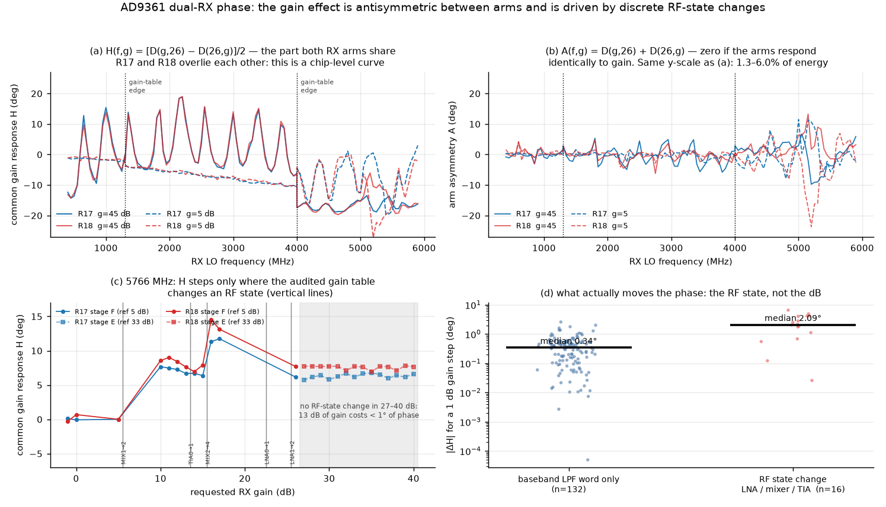
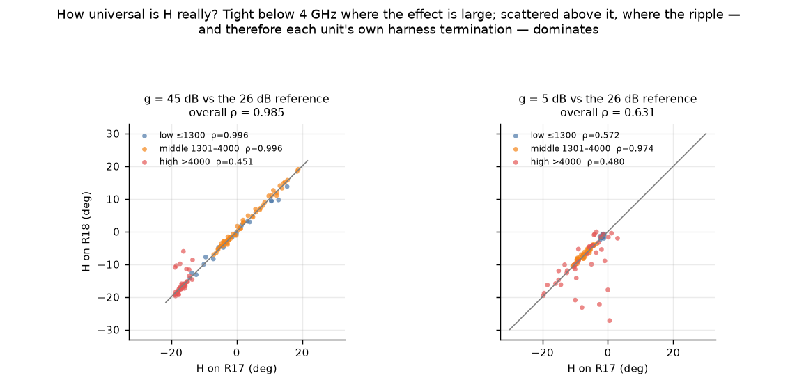
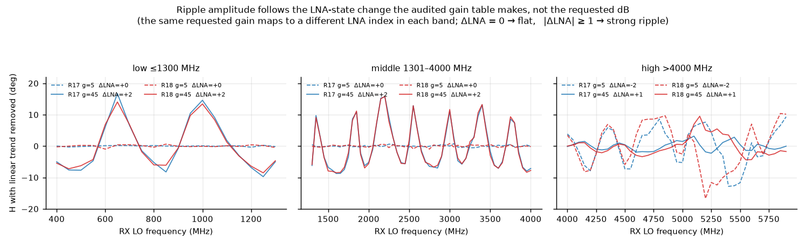
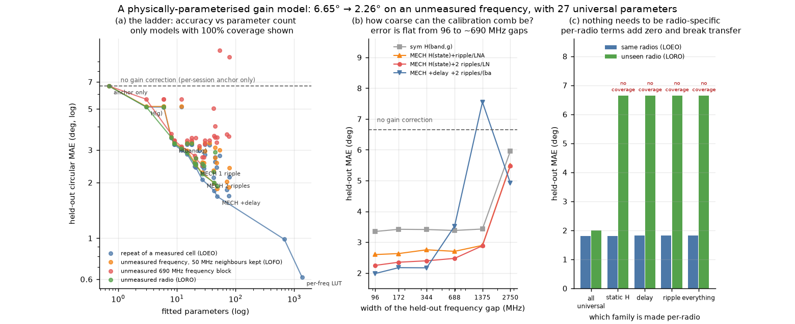
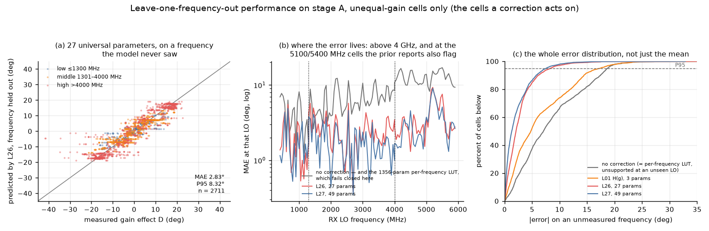
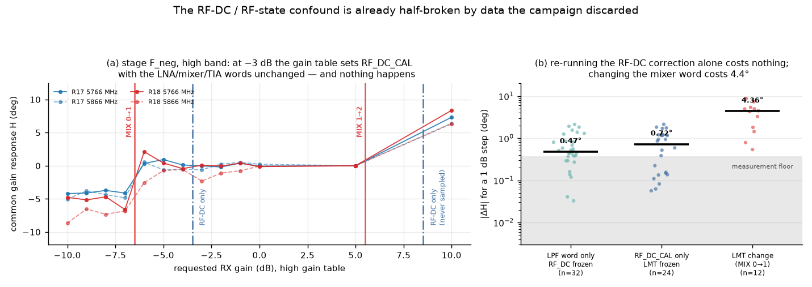
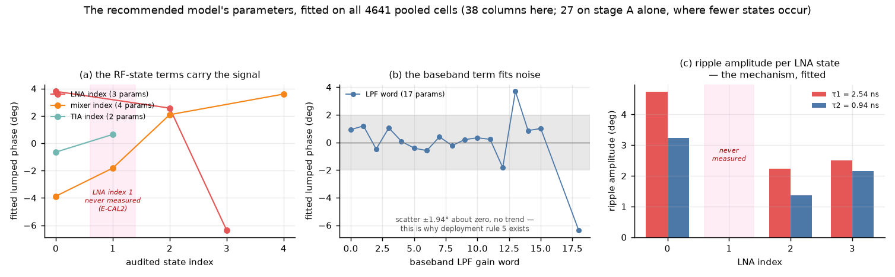

# A gain-state phase model for the AD9361 dual-RX pair

Re-analysis of the 2026-07-30 A–G spectroscopy campaign asking a different
question from the original report: **not "what LUT fits best", but "what is the
mechanism, and what is the smallest set of parameters that reproduces it and
generalises".**

- Analysed: 2026-08-02. SPF git `9da41615`, plus this report and three additive
  documentation hunks (`docs/learnings.md` L10, `docs/future_experiments.md`
  E-CAL1..E-CAL4, `reports/README.md` index row). No tracked source file changed.
- Source data, opened read-only:
  `/mnt/qnap01/mouse9911/share/spf_campaigns/spectroscopy_20260730_full{,_r2}`.
  The campaign recorded 19,836 frames across A–G. **This analysis uses the 18,202
  frames of stages A, B, C, D, F, G, `E_tx_0` and `rate_pilot`** (18,202 complete,
  18,195 quality-valid), plus stage `F_neg` in §6.2 only. Excluded elsewhere: the
  two abandoned attempt stages, the five other fixed-TX E treatments, the TX-muted
  `−80 dB` floor control, and the single-frame thermal anchors. Per-store counts
  are in [`inputs_manifest.json`](inputs_manifest.json).
- Radios: treated `104000bac4950008230026001b440a003a` (historical `.17`, "R17"),
  control `1040007c4a94000211000b009186843ef2` (historical `.18`, "R18").
- Hardware ground truth: `spectroscopy_20260730_full_r2/gain_table_audit.json`,
  the three 77-row AD9361 FULL gain tables read off both radios.
- Analysis code: [`analysis/`](analysis/). SHA-256 of every analysed input, code
  file and generated result is in [`inputs_manifest.json`](inputs_manifest.json).
  Source Zarr stores are identified by path, size and mtime rather than hashed —
  they are multi-GB LMDB and, per this directory's convention, live outside Git.
- Phase convention throughout: `angle(RX1) − angle(RX2)`.

---

## 1. Executive summary

1. **The gain effect is large and is the dominant correctable error.** With a
   per-frequency equal-gain anchor already applied, changing the RX gain pair
   still costs **6.65° MAE / 18.4° P95 / 41.6° max** on stage A — **8.31° MAE**
   counting only the unequal-gain cells a correction actually acts on (§2).
2. **It is 94–99% antisymmetric between the two RX arms.** Writing
   `D(g1,g2) = H(g1) − H(g2)` with a *single shared* `H` leaves only
   **1.3–6.0% of the energy** in the arm-specific residual, though that residual
   is concentrated above 4 GHz (§3.2). The gain-dependent phase is a property of
   the die and of the symmetric harness topology, not of an individual receiver.
3. **Phase moves with the AD9361 RF state, not with the requested dB — and the
   evidence names the mixer.** A 1 dB step that changes the audited **mixer** word
   moves `H` by a median **2.664°** against **0.343°** for a step that only
   increments the baseband LPF word (**7.8×**, cluster-bootstrap 95% CI
   [5.1, 16.3]). The four measured **TIA** 0→1 transitions sit at **0.339°** —
   indistinguishable from the LPF floor — and **no adjacent-1 dB LNA transition
   was measured at all**; the LNA evidence is the four 9 dB steps (5.4–10.0°) and
   the ripple of §3.4. Over 27→40 dB at 5766/5100 MHz, where the audited state is
   frozen at `(LNA 2, MIX 4, TIA 1)`, **13 dB of gain costs under 1° of phase on
   three of the four curves and 1.8° on the fourth.**
4. **The frequency dependence is a reflection standing wave whose amplitude is
   set by the LNA state change.** Where the gain table changes the LNA index the
   fitted ripple amplitude is **1.1–10.7°**; where it does not, **0.11–0.36°**.
   This holds in all three bands, on both radios, and it *inverts* across the
   4 GHz band edge exactly as the audited tables predict.
5. **The model generalises to unmeasured frequencies.** Given a measured
   equal-gain anchor at the new LO, a **27-parameter** universal model (`L26`)
   predicts every other gain pair at **2.26° MAE / 7.54° P95** leave-one-frequency-out
   (2.83° on unequal-gain cells), against the 6.65° no-correction baseline; a
   ~690 MHz-wide unmeasured gap still gives **2.47°**. A richer 49-parameter rung
   (`L27`) reaches 1.85° LOFO but degrades to 3.52° across the same gap — that is
   the dense-comb ceiling, not the recommendation.
6. **Nothing needs to be radio-specific.** Promoting any parameter family to
   per-radio changes leave-one-epoch-out error by ≤0.014° and destroys transfer
   to an unseen radio. The complete radio-specific state is **one measured
   anchor per (radio, LO, session)** — a measurement, not a fitted parameter.
   Leave-one-radio-out is **2.22°** for `L26` (1.91° for `L27`, 2.00° for the
   43-parameter `L33`), all with 100% coverage.
7. **It does not extrapolate across a whole gain-table band.** Train on two
   bands, predict the third: no model beats the baseline meaningfully. The model
   interpolates within a measured frequency span; it does not extrapolate across
   an unmeasured multi-GHz span.

> **Prospective update, 2026-08-07:** item 5 describes the original dense-data
> cross-validation, not the performance of a model fitted from only ten
> frequencies. E-CAL3 has now tested that stronger claim prospectively. A fresh
> ten-frequency L26 fit scored **11.61° MAE / 41.52° P95** on the other 103 LOs,
> worse than the **9.06°** anchor-only baseline. The previously fitted L26
> coefficients still improved the same data to **4.79–4.80° MAE**, so the model
> contains transferable structure, but the claimed ≤3° sparse-comb calibration
> is rejected. Section 8.1 gives the full result and revised operating policy.



---

## 2. Framing: what is being predicted, and why it differs from the prior reports

Every prior model-matrix report in this directory predicts the **absolute**
offset `φ(radio, f, g1, g2)`, which contains the harness/splitter intercept
`C(radio, f)`. That intercept is large — pairwise mean 18.525° between radios,
rising to 91.214° at 5866 MHz
([`four_radio_dense_20260728_v1/PER_FREQUENCY_ADDITIVE_GAIN_LUT.md:176-186,209-220`](../four_radio_dense_20260728_v1/PER_FREQUENCY_ADDITIVE_GAIN_LUT.md)) —
unit-specific, and destroyed by a connector re-mate. It is also why
leave-one-frequency-out has never beaten ~10.6° MAE in this repo
([`six_radio_dense_20260729_v1/MODEL_MATRIX_REPORT.md:62`](../six_radio_dense_20260729_v1/MODEL_MATRIX_REPORT.md)):
those models had to predict `C(f)` at a frequency they had never seen.

This analysis splits the problem the way deployment already works. This
directory's calibration recommendation 3
([`spectroscopy_campaign_20260730_v1/campaign/REPORT.md:241`](../spectroscopy_campaign_20260730_v1/campaign/REPORT.md))
mandates a per-session equal-gain anchor at every operating LO. Take that anchor
as an **input** and model only what is left:

```
D(radio, f, g1, g2)  =  φ(radio, f, g1, g2) − φ(radio, f, g_ref, g_ref)
```

where the second term is the *measured* equal-gain cell at the same radio, LO and
epoch. In this dataset the schedule provides exactly **one** such frame per
(radio, LO, epoch), so every number below uses a **1-frame** anchor; §8 recommends
averaging three in deployment, which can only improve on these figures.

**This makes my leave-one-frequency-out number not comparable to the prior
reports' leave-one-frequency-out number.** Theirs answers "predict the phase at a
frequency you have never touched". Mine answers "given an anchor measurement at
the new frequency, predict every other gain pair there". The directly comparable
prior results are the *anchored* ones, and they are strong: directional gain-curve
transfer between these same two radios reaches 1.25–1.27° MAE
([`wide_integer_gain_cross_band_20260730_v1/ADDITIVE_CROSS_COMPARISON.md:70-77`](../wide_integer_gain_cross_band_20260730_v1/ADDITIVE_CROSS_COMPARISON.md)),
and a universal per-frequency LUT plus one 26/26 anchor reaches 3.385°
leave-one-radio-out over four boards
([`four_radio_dense_20260728_v1/LOW_COST_CALIBRATION_REPORT.md:49-59`](../four_radio_dense_20260728_v1/LOW_COST_CALIBRATION_REPORT.md)).
What this report adds is not a lower number than curve transfer; it is a
*mechanistic* parameterisation that also covers unmeasured frequencies and
unmeasured requested gains, at 27 universal parameters.

### Baseline (no correction) — recorded here for the first time

Measured on stage A, both radios, all quality-valid frames.

| Baseline | R17 MAE / P95 / max | R18 MAE / P95 / max |
|---|---:|---:|
| B0 predict zero (raw `RX1−RX2`) | 14.24 / 55.2 / 99.0 | 14.76 / 63.1 / 130.9 |
| B1 one constant per radio | 13.24 / 45.1 / 88.4 | 14.86 / 62.9 / 130.3 |
| B2 per-frequency constant, gain-blind | 6.70 / 17.9 / 24.2 | 6.81 / 18.5 / 37.2 |
| **B2b per-frequency equal-gain anchor** | **6.67 / 18.1 / 26.0** | **6.76 / 18.4 / 41.3** |
| — restricted to unequal-gain cells | 8.25 / 18.6 / 26.0 | 8.35 / 18.7 / 41.3 |
| B3 saturated per-cell LUT (in-sample floor) | 0.40 / 1.5 / 5.2 | 0.44 / 1.7 / 4.7 |

B1 (13.2–14.9°) reproduces the prior reports' `constant_per_radio` figure of
14.302° for this dataset, which cross-validates the extraction.

The ladder below is scored against a per-**epoch** anchor rather than the
per-frequency anchor of the table above, which gives **6.647° MAE** pooled over
both radios — this is the `L00` row and the number every model is measured
against. On unequal-gain cells alone it is **8.310°**.

> **Read every MAE in this report with the anchor cell in mind.** 20.0% of
> stage-A rows (16.1% pooled) *are* the equal-gain anchor cell, whose residual is
> identically zero by construction, and which every antisymmetric model predicts
> as exactly zero. They are included in the headline MAE for comparability with
> the prior reports, which do the same. To get the error on the cells a deployed
> correction actually acts on, use the `uneq` columns in §4, or multiply by
> **1.250** (stage A) / **1.192** (pooled). Rankings, ratios and every
> conclusion in this report are invariant under that rescale.

---

## 3. Mechanism

### 3.1 The audited gain table, decoded

Byte fields, confirmed against ADI's driver (`ad9361_regs.h`, `ad9361.c`) and
re-derived independently from the audit JSON:

| Byte | Field | Range |
|---|---|---|
| 0 bits 6:5 | `LNA_GAIN` | 4 states |
| 0 bits 4:0 | `MIXER_GM_GAIN` | 16 states |
| 1 bit 5 | `TIA_GAIN` | 2 states |
| 1 bits 4:0 | `LPF_GAIN` (baseband PGA) | 1 dB/LSB |
| 2 bit 5 | **`RF_DC_CAL`** | flag |
| 2 bits 4:0 | digital gain | **identically 0 on all 231 rows** |

Digital gain is zero on every row of all three tables, so it cannot contribute
phase. **Byte 2 bit 5 is the RF-DC-calibration flag, not digital gain** — this
decoding is new in this report; no prior report in this directory decodes bytes 1
or 2. It is set on exactly the rows that begin a new LNA/mixer/TIA state (100%
agreement in the low and middle tables; the high table has two extra flagged rows,
which §6.2 turns into a discriminating measurement).

The three tables are byte-identical between the two radios, so the map
`(band, requested dB) → (LNA, MIX, TIA, LPF)` is **universal chip data, not a
fitted quantity**. The same requested dB is a different hardware state in each
band — at 26 dB the high table already uses LNA index 2 while low and middle
still use index 0. `analysis/spflib.py` resolves a requested dB to a row with
ADI's own first-match rule (`find_table_index`).

### 3.2 Symmetry decomposition (model-free)

The additive-cross schedule measures `(g,26)` and `(26,g)` at every LO, so the
gain response splits with no model assumptions at all:

```
common     H(f,g) = [ D(g,26) − D(26,g) ] / 2      shared by both arms
asymmetry  A(f,g) =   D(g,26) + D(26,g)           zero if the arms are identical
```

| Radio | g | mean&#124;H&#124; | mean&#124;A&#124; | asymmetric energy |
|---|---:|---:|---:|---:|
| R17 | 5 | 6.41 | 1.70 | 3.5% |
| R17 | 45 | 9.85 | 2.29 | 1.7% |
| R18 | 5 | 7.09 | 2.38 | 6.0% |
| R18 | 45 | 9.54 | 1.66 | 1.3% |

Panel (b) of the figure plots `A` on the same y-scale as `H`. This is the
justification for the antisymmetric `H(g1) − H(g2)` form, and it is *stronger*
evidence than a fit: the two arms of a die respond to a gain-index change almost
identically, and the harness is symmetric enough that the external term largely
cancels too.

**The residual asymmetry is not uniform in frequency.** It is small below 4 GHz
and grows sharply above it — visible in panel (b) as the widening after 4000 MHz:

| Band | mean&#124;A&#124; | p95 | max |
|---|---:|---:|---:|
| low ≤1300 | 0.73° | 2.55 | 4.24 |
| middle 1301–4000 | 1.24° | 4.22 | 6.23 |
| high >4000 | **3.72°** | 10.84 | 23.71 |

An arm-specific term is therefore not needed for the aggregate, but the high band
is where it would first be needed; §6.3 proposes the experiment that would
identify it.

`H` is **substantially but not uniformly shared between radios**:

| | overall ρ | low band | middle band | high band | mean&#124;R17−R18&#124; |
|---|---:|---:|---:|---:|---:|
| g = 45 vs 26 | 0.985 | 0.996 | 0.996 | 0.451 | 0.94° |
| g = 5 vs 26 | 0.631 | 0.572 | 0.974 | 0.480 | 1.64° |



The strong claim holds for the large-`H` case (g=45) below 4 GHz. Above 4 GHz,
and for the small-`H` g=5 case, the two radios agree much less well (ρ ≈ 0.45–0.48,
mean difference up to 4.0° in the high band). That is consistent with §3.4: above
4 GHz the ripple dominates `H`, and the ripple depends on each unit's own harness
termination. It is also why claim 6 ("nothing needs to be radio-specific") is a
statement about *held-out prediction error*, not about parameter equality — see
§5.2.

### 3.3 What actually moves the phase

Stages F (12 gains, 6 LOs) and E (14 gains, 2 LOs) give adjacent 1 dB steps.
Splitting them by exactly which audited word the step changes:

| The 1 dB step changes | n | (radio, LO) clusters | median &#124;ΔH&#124; | mean | p90 | max |
|---|---:|---:|---:|---:|---:|---:|
| the **mixer** word | 12 | 12 | **2.664°** | 3.182 | 4.881 | 6.592 |
| the **TIA** word only | 4 | 4 | 0.339° | 0.348 | 0.649 | 0.689 |
| the **LNA** word | **0** | — | *never measured at 1 dB* | | | |
| the baseband **LPF** word only | 132 | 14 | **0.343°** | 0.410 | 0.871 | 2.596 |

Three things follow, and only the first is strong:

- **The mixer word is the measured driver.** 2.664° vs 0.343° is a 7.76× ratio;
  the cluster bootstrap over (radio, LO) clusters gives a 95% CI of [5.1, 16.3],
  and Mann-Whitney gives p = 1.0e-8. The effective sample size is 12 clusters,
  not 12 i.i.d. observations.
- **The TIA step is not distinguishable from the LPF floor.** 0.339° vs 0.343°,
  Mann-Whitney p = 0.995 on n=4. The TIA is a baseband stage, so a null result is
  what the architecture predicts, but n=4 cannot establish it.
- **No adjacent-1 dB LNA transition exists in this campaign.** The only LNA
  changes measured anywhere are four 9 dB steps (17→26 dB at 5766/5866 MHz),
  worth 5.42°, 5.58°, 9.78° and 10.03°. The LNA's role rests on those and on the
  ripple of §3.4, not on the 1 dB step statistic.

The measurement floor here is not assumed, it is measured: recomputing `H` within
each epoch and taking the across-epoch standard deviation of every 1 dB step gives
a median of 0.61–0.64°, i.e. a standard error of **0.355–0.368°** on the
three-epoch mean. The LPF-only median of **0.343° therefore sits at or below the
noise floor**, as does the TIA-only median of 0.339°, while the mixer median of
2.664° is 7.4× it. The defensible statement is that **the baseband PGA
contributes no phase resolvable by this experiment and does not accumulate across
its 24-step range** — not that it is exactly zero, which n and floor cannot
establish. p90 is 0.871° and max 2.596°, consistent with noise.

The cleanest single demonstration is stage E: across 27→40 dB at 5100 and
5766 MHz the audited state never leaves `(LNA 2, MIX 4, TIA 1)` and `|H|` stays
under 0.60° on three of the four radio×LO curves and under 1.79° on the fourth
(R18 at 5100 MHz). Thirteen dB of gain, essentially no phase. By contrast the
5→10 dB step at the same LOs, which crosses `MIX 1→2`, is worth 6.20–8.56°.

### 3.4 The frequency dependence: an LNA-state-modulated standing wave



The AD9361 LNA state change alters the receiver input impedance. With a
mismatched source (30 dB pad → splitter → cable), a change in `Γ_RX` produces a
change in the round-trip standing wave, whose phase contribution is periodic in
frequency with period `1/τ`:

```
ΔΦ(f, g) ≈ Re{ ρ(state(g)) · e^{−j2πfτ} }  =  a(state)·cos(2πfτ) + b(state)·sin(2πfτ)
```

The prediction is that **ripple amplitude tracks the LNA index change, not the
requested dB**. Because the LNA index at a given dB differs per band, the same
requested gain must ripple differently in each band. Measured (both radios, each
amplitude read at its own best-fit delay):

| Band | ΔLNA for g=5 vs 26 | amplitude R17 / R18 | ΔLNA for g=45 vs 26 | amplitude R17 / R18 |
|---|---:|---:|---:|---:|
| low ≤1300 | 0 | 0.11 / 0.36° | +2 | 10.7 / 9.7° |
| middle 1301–4000 | 0 | 0.19 / 0.18° | +2 | 8.0 / 8.1° |
| high >4000 | **−2** | 4.6 / 7.1° | **+1** | 1.1 / 3.3° |

Every ΔLNA = 0 cell is at or below 0.36°; every ΔLNA ≠ 0 cell is at or above
1.1°, and the ordering inverts across 4 GHz precisely as the gain table dictates.
Fitted delays are **2.54 ns** and **0.88–0.92 ns** on both radios independently,
consistent with the campaign's 2.5475 ns / 1.0075 ns components.

This also explains a previously unexplained result in this directory: the wide
survey found the low-band gain curves at 433 and 600 MHz **anticorrelated**
(ρ = −0.2223 / −0.1585,
[`ADDITIVE_CROSS_COMPARISON.md:81-84`](../wide_integer_gain_cross_band_20260730_v1/ADDITIVE_CROSS_COMPARISON.md)).
Those frequencies are 167 MHz apart, and 167/392.5 = 0.43 of a ripple period
≈ 153° of ripple phase — near antiphase. Anticorrelation is what the mechanism
predicts; it is not an anomaly.

### 3.5 Band-edge steps are a universal hardware effect

Trend-corrected discontinuity across the gain-table edges:

| Edge | g=5, R17 / R18 | g=45, R17 / R18 |
|---|---:|---:|
| 1300 → 1301 MHz | −1.43 / −1.73 | +10.11 / +9.96 |
| 4000 → 4001 MHz | +6.48 / +5.96 | −7.51 / −7.14 |

Both radios agree to well under 1°. These are not per-unit artifacts; they are
the AD9361 switching gain tables, and any model in requested dB must be
band-conditioned or state-indexed to represent them.

---

## 4. The model ladder

All models predict `D` (radians) and are linear in their parameters given the
ripple delays, which are grid-searched **on the training fold only**. Terms are
built from `(value_field, frequency_basis, grouping, arm-specific?)` where the
value field is either the requested dB or an audited hardware-state word.
`D` never exceeds ±45°, so ordinary least squares is exact — no circular
machinery needed.

Holdouts, all with the anchor supplied as an input:

- **LOEO** leave-one-epoch-out — repeatability on a measured cell.
- **LOFO** leave-one-frequency-out — one LO removed, 50 MHz neighbours kept.
- **LOBLK** contiguous ~690 MHz frequency block removed — honest interpolation.
- **LORO** leave-one-radio-out.
- **LOBAND** whole gain-table band removed — extrapolation.

A test cell counts as **unsupported** when it invokes a parameter training could
not estimate. Unsupported cells **fail closed to the anchor**, per this
directory's prediction contract; an extrapolated value is never reported as a
deployment number. `analysis/ladder.py` asserts that a zero-coverage model scores
exactly the anchor-only baseline, and emits the un-clamped error separately under
`raw_*` keys for diagnosis only.

`uneq` columns give the error on unequal-gain cells only — the cells a deployed
correction acts on. `MAE` columns include the anchor cell, for comparability with
the prior reports.



| Model | Params | LOEO MAE / uneq | LOFO MAE / uneq | LOBLK MAE | LORO MAE | LOBAND |
|---|---:|---:|---:|---:|---:|---:|
| L00 zero (per-session anchor only) | 0 | 6.65 / 8.31 | 6.65 / 8.31 | 6.65 | 6.65 | 6.65 |
| L01 sym H(g), universal | 3 | 5.12 / 6.40 | 5.16 / 6.45 | 5.64 | 5.13 | 7.34 |
| L03 arm d1(g),d2(g) universal | 6 | 5.12 / 6.40 | 5.16 / 6.45 | 5.64 | 5.13 | 7.35 |
| L05 sym H(lna,mixer,tia,lpf) universal | 15 | 3.21 / 4.02 | 3.29 / 4.11 | 3.38 | 3.25 | **fails closed** |
| L06 sym H(gain-table row) universal | 9 | 3.21 / 4.02 | 3.29 / 4.11 | 3.38 | 3.25 | **fails closed** |
| L08 sym H(band,g) universal | 9 | 3.21 / 4.02 | 3.29 / 4.11 | 3.38 | 3.25 | **fails closed** |
| L11 sym H(band,g) + delay(g) universal | 12 | 2.99 / 3.74 | 3.08 / 3.85 | 3.14 | 3.05 | **fails closed** |
| L14 sym H(band,g) + 1 ripple, amp per g, universal | 15 | 2.85 / 3.56 | 2.99 / 3.73 | 3.25 | 2.90 | **fails closed** |
| **L16 MECHANISTIC: H(state) + ripple amp per LNA state** | **21** | 2.42 / 3.02 | 2.50 / 3.12 | 2.70 | 2.49 | **fails closed** |
| L18 sym H(band,g) + 2 ripples, amp per g, universal | 21 | 2.54 / 3.18 | 2.70 / 3.37 | 3.49 | 2.71 | **fails closed** |
| **L26 MECH: H(state) + 2 ripples per LNA state** | **27** | 2.08 / 2.60 | 2.26 / 2.83 | 2.47 | 2.22 | **fails closed** |
| **L27 MECH: + delay(state) + 2 ripples per (band,LNA)** | **49** | 1.68 / 2.10 | 1.85 / 2.32 | 3.52 | 1.91 | **fails closed** |
| L29 AGNOSTIC: H(band,g) + 6 fixed-delay Fourier terms per g | 45 | 2.75 / 3.44 | 3.10 / 3.88 | 4.03 | 2.92 | **fails closed** |
| L30 MIN: H(lna,mixer,tia) only, universal | 8 | 3.49 / 4.37 | 3.54 / 4.42 | 3.66 | 3.52 | 6.22 |
| L31 MIN + 2 ripples per LNA state, universal | 20 | 2.45 / 3.06 | 2.58 / 3.22 | 2.79 | 2.54 | 6.82 |
| **L33 L32 + linear LPF slope (1 param)** | **43** | 1.81 / 2.26 | 1.99 / 2.48 | 3.58 | 2.00 | **fails closed** |
| L21 sym H(band,g) + quad(f) per band-gain, per radio | 54 | 2.80 / 3.50 | 3.00 / 3.75 | 10.38 | **fails closed** | **fails closed** |
| L22 L19 + quad(f) per band-gain | 78 | 2.15 / 2.68 | 2.41 / 3.01 | 9.56 | **fails closed** | **fails closed** |
| L23 sym H(radio,f,g)  per-frequency antisym LUT | 678 | 0.99 / 1.23 | **fails closed** | **fails closed** | **fails closed** | **fails closed** |
| L24 arm d(radio,f,g)  per-frequency additive LUT | 1356 | 0.62 / 0.77 | **fails closed** | **fails closed** | **fails closed** | **fails closed** |

Every rung, every split, with RMSE, max, `raw_*` and `unequal_*` columns:
[`full_result_tables.md`](full_result_tables.md) and the raw
[`ladder_results_A_main.json`](ladder_results_A_main.json), which is the output of
the single §9 command.

### What the ladder shows

- **L24 reproduces the published Stage-A figure** (0.62° here vs 0.632°
  published), confirming the independent extraction path.
- **Re-indexing by hardware state is free accuracy.** L05/L06/L08 are numerically
  identical because, on stage A's three gains, "band × dB", "gain-table row" and
  "(LNA,MIX,TIA,LPF)" are the same partition. L06 gets there with 9 parameters
  instead of 15, and only L05/L06 stay meaningful when the gain set widens.
- **The ripple term is where the frequency generalisation comes from**:
  L08 → L16 is 3.29 → 2.50 LOFO for 12 extra parameters.
- **The mechanism beats a comparable unconstrained basis.** L29 has a fixed-delay
  Fourier basis (0.5–3.0 ns) with amplitudes free per requested gain, twice L16's
  parameters, and is worse at every holdout (3.10 vs 2.50 LOFO). Constraining the
  ripple amplitude to depend on the LNA state is doing real work. (L29 is not a
  strict superset — its delays are fixed where L16 fits τ ≈ 2.56 ns — so this is
  a like-for-like comparison, not a nesting argument.)
- **Smooth-in-frequency terms are dangerous.** L21/L22 look fine under LOFO
  (neighbours retained) and blow up under LOBLK to 9.6–10.4° MAE with a maximum
  of 173.6°. That maximum is **wrap-saturated**: the raw divergence exceeds 360°
  and the circular `wrap()` folds it back, so the true excursion is larger than
  the number shown. Polynomial extrapolation in frequency must not be shipped.
- **Richer is not better once the gap is real.** L27 wins LOFO (1.85°) but loses
  to L26 under LOBLK (3.52 vs 2.47). **L26 is the robust recommendation**;
  L27 is the accuracy ceiling when the comb is dense.

### Pooled results (A + F + E + rate_pilot, 119 LOs, 27 gains, 4,641 cells)

Baseline `D` = 5.56° MAE (6.62° on unequal-gain cells). Leave-one-frequency-out:

| Model | Params | MAE | P95 |
|---|---:|---:|---:|
| L00 anchor only | 0 | 5.56 | 17.86 |
| L01 sym H(g) universal | 27 | 4.54 | 15.00 |
| L30 MIN H(lna,mixer,tia), no LPF term | 9 | 2.99 | 11.39 |
| L26 MECH H(state) + 2 ripples per LNA | 38 | 2.11 | 6.69 |
| L33 MIN + 2 ripples/(band,LNA) + delay + LPF slope | 45 | **1.93** | **6.58** |
| L24 per-frequency additive LUT | 1748 | unsupported | — |

**Nine parameters** (L30: one per LNA, mixer and TIA state, no frequency terms at
all) already cut the error by 46%, at 119 frequencies and 27 gains, universally
across both radios.

---

## 5. The four questions



Panel (b) is the honest picture of where the remaining error lives: it is
concentrated above 4 GHz for every model, and the 1356-parameter per-frequency
LUT does not appear as a competitor because at an unmeasured frequency it is
unsupported and fails closed to the anchor — the grey line *is* the LUT.

### 5.1 Does it generalise to new frequencies? Yes, by interpolation.

| Held-out frequency gap | L08 H(band,g) | L16 | L26 | L27 |
|---|---:|---:|---:|---:|
| 96 MHz | 3.35 | 2.60 | 2.25 | 1.98 |
| 172 MHz | 3.42 | 2.63 | 2.35 | 2.17 |
| 344 MHz | 3.41 | 2.75 | 2.40 | 2.17 |
| 688 MHz | 3.38 | 2.70 | **2.47** | 3.52 |
| 1375 MHz | 3.43 | 2.90 | 2.88 | 7.55 |
| 2750 MHz | 5.96 | 5.50 | 5.48 | 4.92 |

The error is **flat from 96 MHz to ~690 MHz gaps**. The shared ripple delay is
estimated globally, so a coarse comb still pins it. Practical consequence:
**a ~10-point comb over 400–5900 MHz recovers essentially all of the benefit of
the 113-point comb** for the gain-dependent term — a ~12× reduction in
calibration time. Beyond ~1.4 GHz gaps it degrades, and the richer L27 becomes
unstable.

### 5.2 What is radio-specific? Nothing but the anchor.

| Variant | Params | LOEO MAE | LORO MAE | LORO coverage |
|---|---:|---:|---:|---:|
| **all universal** | **43** | **1.810** | **2.003** | **1.00** |
| + per-radio static H | 52 | 1.808 | — | 0.00 |
| + per-radio delay | 49 | 1.822 | — | 0.00 |
| + per-radio ripple amplitudes | 71 | 1.824 | — | 0.00 |
| + everything per-radio | 86 | 1.816 | — | 0.00 |

Making any family per-radio changes the same-radio error by at most 0.014° —
far inside this directory's predeclared 0.1° practical-equivalence margin —
and gives an unseen radio no coverage at all. The minimal radio-specific state
is therefore:

```
one measured anchor per (serial, exact LO, session)   ← 1 frame here, 3 recommended
+ 27 universal parameters shared by every unit        ← L26
```

This is consistent with, and sharpens, the existing four-radio finding that the
intercept is unit-specific (18.525° pairwise) while the gain *shape* is not
(<1° median). Note the scope: this says a per-radio parameter buys no held-out
accuracy, **not** that the fitted curves are identical — §3.2 shows they diverge
above 4 GHz (ρ ≈ 0.45).

**Caveat: two radios.** Leave-one-radio-out over two units is weak evidence, and
both shared a harness topology. The claim to carry forward is "no radio-specific
gain parameter was *needed* here", not "none can ever be needed". The
fifth-radio pre-registered test already designed in this directory
([`four_radio_dense_20260728_v1/README.md:140-154`](../four_radio_dense_20260728_v1/README.md))
is the condition for promoting this to a fleet claim.

### 5.3 Can it predict an unmeasured requested gain?

Holding out every cell whose probe gain equals `g` (pooled set):

| Model | coverage | supported MAE / P95 |
|---|---:|---:|
| L01 sym H(g) — requested dB LUT | **0.48** | 3.00 / 10.45 |
| L05 sym H(lna,mixer,tia,lpf) | 0.89 | 3.29 / 13.19 |
| L30 MIN H(lna,mixer,tia) | **0.90** | 3.32 / 12.26 |
| L31 MIN + 2 ripples per LNA | **0.90** | 3.09 / 11.28 |
| L32 MIN + 2 ripples/(band,LNA) + delay | 0.70 | **2.25 / 8.20** |
| L24 per-frequency additive LUT | 0.16 | 0.93 / 2.93 |

Dropping the baseband LPF categorical is what buys the coverage: **48% → 90% of
unseen requested gains become predictable at all**, at similar per-cell accuracy.
That is the concrete payoff of parameterising by hardware state.

### 5.4 Does it survive time and a harness change? Partly.

Train on stage A, predict a later stage (anchor re-measured in that stage):

| Test stage | baseline | L16 (21 p) | L26 (27 p) | L27 (49 p) | L24 (1356 p) |
|---|---:|---:|---:|---:|---:|
| G — 12 h later, hot, same harness | 7.66 | 4.25 | 3.99 | 3.56 | 2.74 |
| D — harness removed and restored | 7.68 | 4.25 | 3.99 | 3.56 | 2.74 |
| B — 11 dB pad on treated RX1 | 6.59 | 2.85 | 2.55 | 2.19 | 1.57 |
| C — 30 cm jumper on treated RX1 | 7.71 | 4.33 | 4.04 | 3.68 | 3.02 |

Every model roughly halves the error across a session boundary, but **nothing
reaches its within-session accuracy** — even the 1356-parameter LUT degrades
from 0.62° to 2.74°. So there is real session-to-session drift in the
*gain-dependent* term, not only in the intercept. A stored gain model plus a
fresh anchor is worth having; it is not equivalent to a fresh calibration.

---

## 6. Where it fails, and the experiment that would fix it

### 6.1 No extrapolation across a gain-table band

Pooled leave-one-gain-table-band-out (train on two bands, predict the third):

| Model | coverage | fail-closed MAE |
|---|---:|---:|
| L00 anchor only | 1.00 | 5.56 |
| L30 MIN H(lna,mixer,tia) | 0.90 | 5.09 |
| L16 MECH | 0.81 | 5.09 |
| L08 sym H(band,g) | 0.00 | 5.56 |

An 8% improvement, and worse than baseline within the low band. The
hardware-state parameterisation makes the *discrete* part portable, but `H` and
the ripple amplitudes genuinely depend on frequency, and the three bands occupy
disjoint frequency spans — so this is extrapolation, and it fails for the same
reason the polynomial models fail under LOBLK.

**Coverage gap found:** across the whole campaign, **LNA index 1 was never
measured at any frequency**, and LNA index 3 only in the high band. The
requested gains that would visit LNA 1 are 31–32 dB (low), 30–31 dB (middle),
23–25 dB (high) — none were scheduled.

### 6.2 The RF-DC confound, and what the campaign already says about it

`RF_DC_CAL` is set on exactly the gain-table rows that begin a new
LNA/mixer/TIA state. An "RF state phase step" and an "RF-DC-recalibration phase
step" are therefore confounded in any experiment that only varies requested dB
— **except at two rows of the high table**, where the flag toggles with the LMT
words frozen:

| Gain (dB) | Row | LMT state | `RF_DC_CAL` |
|---:|---:|---|---:|
| −4 | 10 | (0,1,0) | 0 |
| **−3** | **11** | **(0,1,0)** | **1** |
| −2 | 12 | (0,1,0) | 0 |
| 8 | 22 | (0,2,0) | 0 |
| **9** | **23** | **(0,2,0)** | **1** |
| 10 | 24 | (0,2,0) | 0 |



**Half of that experiment already exists in the campaign.** Stage
`F_unsupported_negative_gain_attempt_20260730` (`F_neg` in the code) is excluded
from the rest of this analysis because it failed in the low and middle bands,
whose tables do not reach −10 dB. But in the **high** band it is complete and
quality-valid: 492 rows at 5766 and 5866 MHz covering −10…26 dB, i.e. rows 10, 11
and 12. Running the discriminator on it:

| 1 dB step at 5766/5866 MHz | n | median &#124;ΔH&#124; | max |
|---|---:|---:|---:|
| `RF_DC_CAL` toggles, LMT frozen | 24 | 0.722° | 2.131 |
| — of which rising edge (entering row 11) | 4 | 0.333° | 1.750 |
| LPF word only, `RF_DC_CAL` frozen | 32 | 0.473° | 2.121 |
| LMT change (`MIX 0→1`) at the same LOs | 12 | **4.364°** | 8.731 |

Mann-Whitney gives p = 0.849 for RF-DC-only versus LPF-only (indistinguishable)
and p = 1.0e-5 for the LMT change versus everything else. **So an RF-DC-only step
is bounded at roughly 0.3–0.7°, against a 4.36° LMT step measured at the same
LOs.** That is a genuine, if weak, resolution of the confound in the direction the
mechanism predicts.

It is not sufficient. At n=4 rising edges against a ~0.5° per-step floor it
cannot reach E-CAL1's ≤0.35° decision rule, and the second, higher-SNR edge is
genuinely unsampled: gains **8 and 9 dB appear at no high-band LO in any stage of
either campaign** (only 10 dB does). §7's verdict stays "confounded", and the
LNA/mixer/TIA attribution in §3.3 should be read as "the RF-state transition,
including any RF-DC correction it triggers".

### 6.3 Recommended follow-up captures

Each is cheap relative to a full survey and each resolves a named ambiguity.
Full designs and decision rules are in `docs/future_experiments.md` (E-CAL1..E-CAL4).

1. **RF-DC discriminator, high-SNR arm** — high band, gains {8, 9, 10}, at
   4001 / 5100 / 5766 MHz, with enough epochs to reach a ≤0.35° standard error
   (≥16, not the 3 used here). Plus an `rf_dc_offset_tracking_en` A/B. Completes
   §6.2.
2. **LNA-index fill** — gains {29..33} and {49..53} across the operating LO set.
   Supplies the LNA state 1 that was never measured, the adjacent-1 dB LNA step
   that §3.3 lacks, and the coverage that currently blocks band portability.
3. **Coarse-comb confirmation** — capture a fresh ~10-point comb and score it
   against the existing dense cells, rather than subsampling one dense capture.
4. **Harness-asymmetry test** — the arm-asymmetric residual, which §3.2 shows is
   concentrated above 4 GHz, should be a ripple whose delay equals the RX1/RX2
   path-length difference. A deliberate known length difference on one arm
   predicts a specific change in `A(f,g)`.
5. **Third and fourth radios** — the "nothing is radio-specific" claim needs more
   than two units, and both of these shared a harness.

---

## 7. Question-by-question decision ledger

| Question | Decision | Evidence |
|---|---|---|
| What does a gain change cost, with frequency already calibrated? | **6.65° MAE / 18.4° P95 / 41.6° max** (8.31° on unequal-gain cells) | §2 baseline table; B1 reproduces the prior `constant_per_radio` figure |
| Do the two RX arms respond to gain identically? | **Yes, to 94–99%** — but the residual concentrates above 4 GHz | §3.2, model-free symmetry split |
| Is the correct gain coordinate the requested dB? | **No — it is the audited hardware state** | §3.3: 2.664° per mixer-word step vs 0.343° per LPF step; 13 dB with no state change costs <1° |
| Which word carries the step? | **The mixer, measurably. TIA no. LNA not measured at 1 dB.** | §3.3: mixer 7.8× the LPF floor, CI [5.1, 16.3]; TIA p=0.995 on n=4; zero adjacent LNA steps |
| Does the baseband LPF word carry phase? | **At most a few tenths of a degree per dB; does not accumulate** | §3.3: median 0.343° against a ~0.24° noise expectation |
| Is the frequency dependence a delay? | **No — a reflection ripple** | §3.4: τ = 2.54 and 0.88–0.92 ns; a pure delay term (L11) gains only 0.21° over L08 |
| Does ripple amplitude follow the LNA state? | **Yes, including the inversion at 4 GHz** | §3.4: 1.1–10.7° when ΔLNA ≠ 0, 0.11–0.36° when ΔLNA = 0, both radios |
| Does the mechanism beat an unconstrained basis? | **Yes** | §4: L29 (45 p, free amplitudes) is worse than L16 (21 p) at every holdout |
| Can the model predict an unmeasured frequency? | **Partly, as a lower-confidence fallback given an anchor** | §8.1: shipped L26 improves 9.06° → 4.79–4.80° prospectively, but misses the ≤3° precision gate |
| How coarse may the comb be? | **Ten uniform points are insufficient to refit L26** | §8.1: exact ten-LO fit gives 11.61° MAE; the earlier 2.26° result trained on nearly all remaining dense LOs |
| Which parameters are radio-specific? | **None; only the measured anchor** | §5.2: per-radio families change LOEO by ≤0.014° and give an unseen radio no coverage |
| Can it predict an unmeasured requested gain? | **Partly — 90% coverage vs 48%** | §5.3, dropping the LPF categorical |
| Does a stored model survive a session boundary? | **Partly — no model reaches its within-session error** | §5.4: even the 1356-parameter LUT degrades 0.62° → 2.74° A→G |
| Does it extrapolate across a gain-table band? | **No** | §6.1: ≤8% better than baseline, worse than baseline in the low band |
| Is the RF-state attribution clean? | **No — still confounded with RF-DC recalibration** | §6.2: bounded at ≲0.7° by the excluded `F_neg` stage (n=4–24); the high-SNR row-23 arm was never sampled |
| Should this replace the per-frequency LUT? | **No** | §8: the LUT remains the accuracy reference (0.62° vs 2.08° LOEO) where dense per-frequency calibration exists |

---

## 8. Recommended model

For deployment at an **unmeasured LO**, `L26` is a lower-confidence fallback:
**27 universal parameters**, 100% prospective stage-A coverage, and 4.79–4.80°
prospective MAE when the committed coefficients are used. It must be paired with
a current-session equal-gain anchor, and it must not be advertised as a ≤3°
precision correction. It fails closed under whole-band extrapolation (§6.1) and
must not be deployed across an unmeasured gain-table band.

```
D(f, g1, g2) = H(s1) − H(s2)  +  Σ_{k=1,2} [ a_k(l1) − a_k(l2) ]·cos(2πf τ_k)
                                          + [ b_k(l1) − b_k(l2) ]·sin(2πf τ_k)

  s = (LNA, MIXER, TIA, LPF) read from the audited gain table for (band, dB)
  l = the LNA index of that state
  H(s) = h_lna[LNA] + h_mix[MIXER] + h_tia[TIA] + h_lpf[LPF]
  τ1 = 2.56 ns, τ2 = 0.92 ns          (fitted, shared by both radios)

corrected = wrap( measured_RX1_minus_RX2 − anchor(serial, LO, session) − D )
```



Panel (b) is the visual case for rule 5 below: the fitted baseband-LPF
coefficients scatter about zero with no trend, so applying them where the RF
words are equal adds noise rather than correction. Panel (a) also shows the
LNA index 1 hole that E-CAL2 exists to fill.

Two properties of this parameterisation should be stated with it. The ripple
amplitude is indexed by the **absolute** LNA index, but the same LNA pair spans
about 1.6× in amplitude across bands (§3.4); L26 averages over that, which is
part of why it is more robust than L27 across a gap and less accurate on a dense
comb. And `h_tia` is inert — it is separately identified but fits to
−0.20 ± 0.42°, and removing it moves every holdout number by ≤0.01°. It is kept
because it is correctly identified, not because it earns its parameter.

Rules that must be kept, the first four unchanged from this directory's existing
contract:

1. The anchor is **measured**, never transferred across a re-mate, harness change,
   radio swap or unvalidated boot. Average three frames where the schedule allows;
   every number in this report used one.
2. Look the hardware state up in the **audited table for the active band**. Never
   interpolate a requested dB across an LNA/mixer/TIA boundary.
3. **Fail closed** on any state not present in the fit. Never emit an
   extrapolated value.
4. Above 4 GHz, keep the existing per-session anchor discipline: the campaign's
   own A→D result shows a connector re-mate can move that band by 12–34°.
5. **Do not apply the correction when the audited `(LNA, MIXER, TIA)` words are
   identical on both arms.** In that regime §3.3 measures no phase, and the
   fitted `h_lpf` differences are noise absorbed from bands where the LPF word is
   collinear with the RF state. Without this guard L26 *injects* a mean 1.36°
   (max 4.72°) on the 672 pooled cells where the RF state is frozen and makes 81%
   of them worse. With it: stage E improves 1.39° → 0.77° (back to baseline),
   stage F improves 1.98° → 1.41°, stages A and `rate_pilot` are untouched, and
   the pooled unequal-gain LOFO error improves 2.51° → 2.35°. Models without a
   categorical LPF term (L30, L31) are neutral in this regime by construction and
   need no guard.

Where per-frequency dense calibration is available and the frequency will not
change, the existing `frequency_specific_additive_gain_per_radio` LUT remains
more accurate (0.62° vs 2.08° LOEO) and should stay the accuracy reference. The
model here is for the case that LUT cannot serve: **a frequency, or a radio, that
was never calibrated.**

---

### 8.1 Prospective E-CAL2/E-CAL3 result — 2026-08-07

The follow-up campaign is stored at:

```text
/mnt/qnap01/mouse9911/share/spf_campaigns/gain_state_followups_20260807_v1
```

It contains 12 V7 stores (approximately 890 MB) from radios `.17`
(`104000bac4950008230026001b440a003a`) and `.18`
(`1040007c4a94000211000b009186843ef2`). Both radios passed initial and final
full-table audits with identical 77-row LOW/MIDDLE/HIGH table hashes. The rate
pilot completed 100/100 frames at 0.932 s/frame. E-CAL3 completed 3390/3390
scheduled frames; 3389 passed the analysis quality gates. Its end repeat
completed 300/300 frames at 0.877 s/frame. E-CAL2 completed 444/444 frames.

#### E-CAL3: the exact ten-frequency refit fails

The ten pre-registered training LOs were 400, 1000, 1600, 2200, 2800, 3400,
4100, 4700, 5300 and 5900 MHz. The other 103 LOs were held out completely, and
only unequal-gain cells were scored.

| Predictor | Parameters | Coverage | Held-out MAE | Held-out P95 |
|---|---:|---:|---:|---:|
| Current-session equal-gain anchor only | 0 | 100% | 9.06° | — |
| L26 refitted from exactly 10 LOs | 27 | 100% | 11.61° | 41.52° |
| Committed `l26_stage_a_v1` coefficients | 27 | 100% | 4.79° | 14.37° |
| Committed `l26_pooled_v1` coefficients | 38 stored | 100% | 4.80° | 14.56° |

The ten-LO refit estimated effective delays of 4.15 ns and 0.16 ns rather than
the committed 2.56 ns and 0.92 ns. Fixing those delays did not rescue the sparse
fit: fixed stage-A delays gave 30.79° MAE and fixed pooled delays gave 12.93°.
The nonlinear delays and ripple amplitudes are not identifiable from ten
uniformly spaced LOs in the present parameterisation.

This corrects a retrospective-methodology interpretation. `run_comb.py` used
leave-frequency-**block**-out: each fold held out one contiguous block while
training on most of the other dense frequencies. It measured robustness to a
wide missing interval, but it did **not** simulate fitting from only ten LOs.
The earlier 2.26° LOFO and ~690 MHz gap results remain valid for dense-comb
cross-validation; they do not establish a ten-point calibration protocol.

One `.17` TX2/DDS handoff became persistently silent near 1.85 GHz. USB and IIO
enumeration remained healthy, but four recovery attempts and four immediate
resume attempts failed, so both radios were rebooted and the exact firmware,
ports and gain tables were reverified before resuming without duplicate cells.
That makes the strict “uninterrupted session” acceptance condition inconclusive,
but it does not explain the model failure: fitting and scoring only pre-reboot
data still gave 11.57° MAE. Pre/post-reboot common-cell drift was 0.82° MAE
(3.04° P95), and dense-to-end-repeat drift was 0.49° MAE (1.80° P95), close to
the prior unchanged-harness repeatability bound.

#### E-CAL2: missing states are filled, but bands still do not transfer

Adding the 444 targeted LNA-state frames raised pooled leave-one-band-out
coverage from 80.52% to 91.50% for L26. Its MAE nevertheless changed from 5.36°
to 5.58° (LOW 3.97°, MIDDLE 4.47°, HIGH 7.69°), against a 5.71° augmented
anchor-only baseline. L30 reaches 100% coverage and 4.83° MAE (LOW 4.94°,
MIDDLE 3.97°, HIGH 5.59°). L31 also reaches 100% coverage but gives 10.75° MAE.

Therefore the missing-state coverage hole is closed, while the ≤3°
cross-gain-table-band portability claim is rejected. Every operating band must
be sampled directly for precision work.

#### Revised correction policy

1. At an exact calibrated LO, use the serial-specific, per-frequency additive
   LUT plus a current-session equal-gain anchor. This remains the precision path.
2. At an unseen LO, use the current-session anchor alone, or use the committed
   L26 coefficients only as an explicitly lower-confidence fallback. The
   prospective evidence supports roughly 4.8° mean error, not ≤3°.
3. Never refit L26 from ten uniformly spaced LOs. Learn the nonlinear frequency
   basis from dense fleet data, then fit only identifiable linear terms on a
   deliberately selected sparse calibration set.
4. Do not transfer across an unmeasured gain-table band. Sample LOW, MIDDLE and
   HIGH directly when all three bands are required.
5. Preserve fail-closed hardware-state lookup and the live anchor requirement.

#### Next experiments

1. Repair and stress-test the TX2/DDS handoff before repeating E-CAL3; the repeat
   must complete without a radio reboot to satisfy the original protocol.
2. Fit the full model ladder to the new prospective observations, including
   anchor-only, committed L26, L30/L31, regularised fixed-basis variants and the
   exact-frequency LUT reference.
3. Estimate a stable frequency basis from all dense fleet data, keeping delays
   fixed during per-radio calibration. Evaluate it with radio-, session- and
   contiguous-frequency-block holdouts.
4. Select sparse calibration LOs by identifiability (for example D-optimal
   design), forcing gain-table boundaries, ripple extrema and production LOs
   into the set. Validate the chosen set prospectively before reducing bench
   time.
5. Promote only results that beat both anchor-only and the committed 4.8° L26
   fallback on untouched frequencies and sessions.

---

## 9. Reproduction

From `analysis/`. Total runtime ≈ 90 minutes on 32 cores, dominated by the
113-fold leave-one-frequency-out ladder.

```bash
uv venv --python 3.12 .venv
uv pip install --python .venv/bin/python \
  "numpy<2" "zarr<=2.18.4" "numcodecs<0.16" lmdb matplotlib

# 1. read-only scalar extraction from the campaign Zarr stores (~10 min)
.venv/bin/python -u extract.py ./extracted

# 2. diagnostics: gain tables, baselines, symmetry, ripple, hardware steps
.venv/bin/python -u diag_symmetry.py
.venv/bin/python -u diag_Hspectrum.py
.venv/bin/python -u diag_gainsteps.py
.venv/bin/python -u review_fixes.py          # the §3.3 decomposition and §6.2

# 3. the ladder and the derived experiments (each writes its own results JSON)
.venv/bin/python -u run_ladder.py A 26 LOEO,LOFO,LOBLOCK,LORO,LOBAND A_main
.venv/bin/python -u run_min.py
.venv/bin/python -u run_band.py
.venv/bin/python -u run_comb.py
.venv/bin/python -u transfer.py

# 4. figures, tables, provenance
.venv/bin/python -u figs.py
.venv/bin/python -u fig_ladder.py
.venv/bin/python -u tables.py > full_result_tables.md
.venv/bin/python -u make_manifest.py
```

`extract.py` opens every V7 store read-only and writes only to the output
directory given on its command line. No campaign data is modified. Step 1
produces ~5,200 files under `analysis/extracted/`, which `analysis/.gitignore`
excludes along with `.venv/`.

Steps 3 and 4 read and write the result JSON at the report root; run them from a
scratch copy of `analysis/` if you want to compare against the committed results
rather than overwrite them.

## 10. Limitations

- Two radios, one harness topology, one temperature history, all cabled.
  Leave-one-radio-out over two units is weak evidence for universality.
- **The headline MAEs include the equal-gain anchor cell**, whose residual is
  identically zero by construction: 20.0% of stage-A rows and 16.1% of pooled
  rows. On the cells a deployed correction acts on, multiply by 1.250 (stage A) /
  1.192 (pooled) — L26 LOFO 2.26° → 2.83°, baseline 6.65° → 8.31°. The `uneq`
  columns in §4 give these directly. Rankings and ratios are unaffected.
- **`L26` is the argmin of the LOBLK column** over the scored rungs, so the 2.47°
  quoted for it carries selection optimism. Rotating the block boundaries by 3,
  7 and 10 LO indices — partitions that played no part in the choice — gives
  2.472 / 2.502 / 2.679° against 2.473° at the selection partition, so the
  optimism is ≈0.06°, and **L26 is the argmin at every one of those rotations**.
  The paired per-fold margins over the next-best rungs are nonetheless inside
  fold noise (L26−L16 = +0.225 ± 0.209°, better in 6/8 folds; L26−L31 =
  +0.306 ± 0.237°, 5/8 folds). L26 is selected because it wins broadly across
  holdout configurations and rotated partitions, not on the LOBLK margin —
  prefer it for its parameter count, not the third decimal of its MAE.
- **Every rung carrying a categorical baseband-LPF term (L05, L16, L26, L33) is
  net-harmful on cells where both arms share the same RF words**, absent the §8
  rule 5 guard. L30 and L31 are neutral there by construction.
- Stage A carries only three requested gains, so on stage A alone "band × dB"
  and "hardware state" are the same partition; the distinction is only tested by
  pooling F and E.
- The equal-gain anchor is a single frame from the same epoch as the test cell.
  That mirrors deployment (the anchor is a live measurement) but means these
  numbers exclude anchor-measurement noise from a separate session — and §5.4
  shows that boundary is where real drift lives.
- Fitted delays are effective electrical group delays. They do not identify a
  specific cable, trace or filter.
- The `RF_DC_CAL` confound of §6.2 is bounded at ≲0.7° by existing `F_neg` data
  at 5766/5866 MHz but is not resolved to the 0.35° level; the LNA/mixer/TIA
  attribution should be read as "the RF-state transition, including any RF-DC
  correction it triggers".
- `params` counts non-zero design columns, not estimable rank; the signed-indicator
  design is rank-deficient by construction, and L26's rank on stage A is 14.
  Predictions are invariant to this, parameter *counts* are an upper bound.
- Stage B/C/D retain the campaign's quality waivers and the failed high-band
  A→D restoration. Nothing here relabels those as passes.
