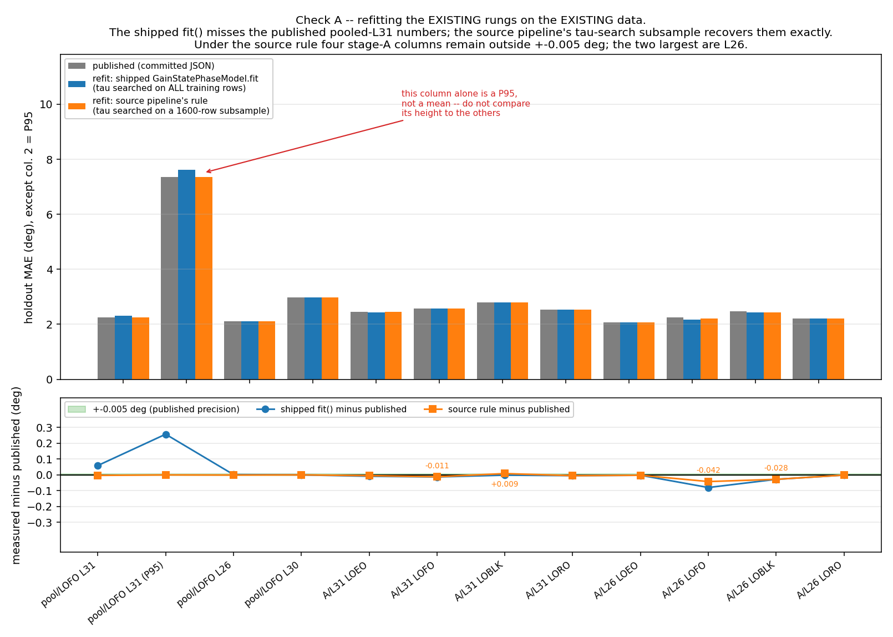
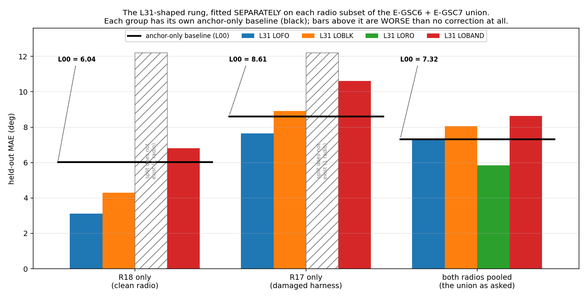
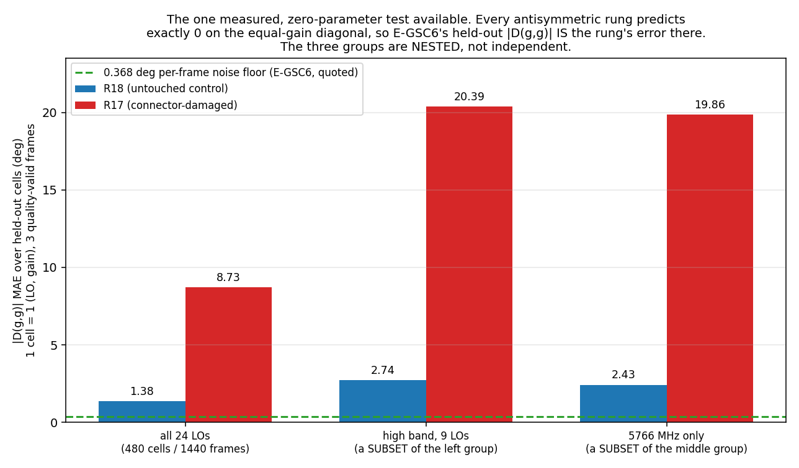
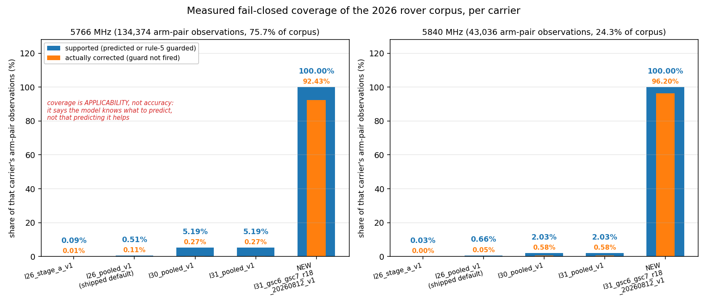
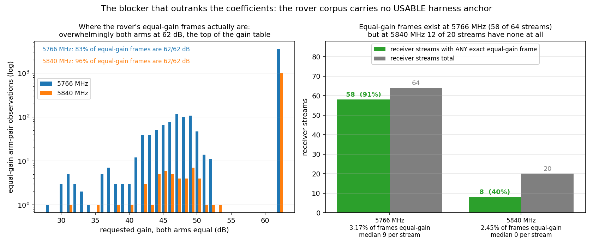

# An L31-shaped rung fitted on the E-GSC6 + E-GSC7 union — and why it must not ship

**Run 2026-08-12.** Executes step 1 of
[`rover_applicability_ladder_20260812_v1`](../rover_applicability_ladder_20260812_v1/REPORT.md)
§4.2: *"refit an L31-shaped rung — RF words plus the two LNA ripples, no categorical LPF
term — on the union of the E-GSC6 and E-GSC7 gain lists."* Read-only throughout; `main` at
`53ed590`. No dataset, cache, coefficient file or segmentation module was modified.

## The answer in five sentences

1. **Check A passes, but only for one of the two fitting paths, and finding that out is the
   most valuable thing in this report.** The *source analysis pipeline*, re-run here against
   a fresh read-only re-extraction of the campaign stores, reproduces every published stage-A
   number to the last decimal (L26 2.262/2.828, L30 3.539, L31 2.575/3.219). The **shipped
   package's `GainStatePhaseModel.fit()` does not** — it returns 2.320° where
   `l31_pooled_v1` publishes 2.261°, because it grid-searches the ripple delays on *all*
   training rows while the source pipeline uses a 1,600-row subsample.
2. **The refit the review asked for is worse than applying no correction at all.** On the
   literal union — E-GSC6 + E-GSC7, both radios — the L31 rung scores **7.347° LOFO against
   its own 7.323° anchor-only baseline**. The cause is not the rung: R17's connector damage
   makes the two radios' high-band responses incompatible, and a *universal* fit over both
   fits neither.
3. **On the clean radio alone it works, at 3.113° LOFO against a 6.038° baseline — a 1.94×
   retrospective ratio, which is already only as good as the campaign's *prospective* one.**
   Corrected to the prospective transfer ratio the review derived, the honest expectation is
   **≈4.3° all-band / ≈5.1° high-band**, and **≈6.9° under frequency-block extrapolation,
   i.e. no better than the anchor alone.**
4. **Rover coverage is 100.00% at both carriers, measured** — up from `l26_pooled_v1`'s
   0.51% / 0.66%. The review's coverage arithmetic is confirmed exactly. Coverage was never
   the binding constraint.
5. **Verdict: NOT DEPLOYABLE, at either carrier.** Three independent reasons, any one of
   which is sufficient — a single-radio fit with zero leave-one-radio-out evidence and one
   *failed* cross-radio test; mixer 6…14 estimated from a single LO that E-GSC7 already
   showed does not transfer; and the rover corpus's total lack of a usable equal-gain anchor,
   which is what the whole ladder is a residual *to*.

---

## Contents

1. [What data actually exists, and what it is not](#1-what-data-actually-exists-and-what-it-is-not)
2. [A. Does the fitting path reproduce itself?](#2-a-does-the-fitting-path-reproduce-itself)
3. [B. The new rung's honest error](#3-b-the-new-rungs-honest-error)
4. [C. Rover coverage, measured](#4-c-rover-coverage-measured)
5. [D. Deployability](#5-d-deployability)
6. [The blocker that outranks the coefficients: there is no anchor](#6-the-blocker-that-outranks-the-coefficients-there-is-no-anchor)
7. [Numbers checked against their sources](#7-numbers-checked-against-their-sources)
8. [Provenance and how to reproduce](#8-provenance-and-how-to-reproduce)

**Measured / re-derived / quoted / inferred.** *Measured* = computed in this run from raw
stores or committed JSON. *Re-derived* = a published number recomputed here from the
artefact that published it, and it agreed. *Quoted* = copied from a report and not
recomputable here. *Inferred* = reasoned from measured quantities. Every table says which.

---

## 1. What data actually exists, and what it is not

The review's step 1 says *"This is a refit, not a capture: both gain lists have already been
captured."* That is true of the frames. At the time this refit was run, it was **not** true
of the data mounted on this machine.

**Measured at refit time.** The 2026-08-12 filesystem sweep found no mounted E-GSC6 or
E-GSC7 raw store, so this report used each experiment's *fitted* output. The raw stores
were subsequently recovered and migrated to the canonical QNAP root; for example,
`/mnt/qnap01/mouse9911/spf/calibration_data/raw/dual_rx_gain_frequency/e_gsc7_iio_usb_20260812_v2/`
and its IP sibling now exist. That later storage migration does not change what was
available to, or computed by, this refit.

| Source | What is committed | What that supports |
|---|---|---|
| **E-GSC6** `equal_gain_diagonal_20260811_v1/additive_cross_<serial>.json` | per-radio, per-LO, **per-arm** additive coefficients: 2 radios × **24 LOs** (433–5900 MHz) × 21 gains, reference 26 dB pinned to zero | full reconstruction of `D(f,g1,g2) = RX1[f,g1] + RX2[f,g2]` on the 41 axis cells per LO — **1,968 rows** |
| **E-GSC7** `e_gsc7_iio_20260812_v1/analysis.json` | ten adjacent 1 dB **shared-effect** steps over 52→62 dB (mixer 5→15), at **5766 MHz only**, 2 radios × 2 transports | the cumulative shared curve `S(g)`, hence pseudo-rows `D(g,52) = S(g) − S(52)` — **80 rows, one frequency, no per-arm split** |

This is the same position `gain_state_computational_20260807_v1/analysis/wide_survey.py` was
in for the 53-LO survey, and this run follows its documented reconstruction exactly. **The
caveat travels with it: these are fitted cell values, not frames.** E-GSC6's own additive fit
has a 0.70° training residual and a 0.71–0.75° held-out residual (**measured** from
`training_metrics` / `overall_held_out_independent_rx_metrics` in the committed files), so
roughly that much measurement noise has been smoothed out and **every holdout number in §3
is optimistic relative to a frame-level number.**

**Three consequences that change what the review expected, all measured:**

- **E-GSC7 contributes 80 of 2,048 rows (3.9%) at exactly one frequency.** Its nine new mixer
  levels (6…14) therefore carry **zero frequency leverage**. When 5766 MHz is the held-out LO,
  they become unestimable and fail closed — which is why every LOFO coverage in §3 is 0.969
  rather than 1.000.
- **Leave-one-epoch-out does not exist on this data.** The E-GSC6 file carries no epoch
  structure. Holding out an E-GSC7 transport instead leaves 3.9% coverage and is reported as
  `LOEO_partial` only so its uselessness is on the record, not as a ladder column.
- **The anchor is pinned at 26 dB and cannot be re-derived per epoch**, so the per-session
  anchoring the deployed model requires is not reproducible from these artefacts.

---

## 2. A. Does the fitting path reproduce itself?

This came first, because the review predicted that a failure here means the fault is in the
fitting path and no new capture helps. **The answer is subtler than pass/fail: one path
reproduces exactly, the other does not, and the shipped package is the one that does not.**

### 2.1 The source pipeline reproduces every published number exactly

**Measured.** The source analysis' own `ladder.py` / `models.py` / `features.py` /
`spflib.py` were copied unmodified into a scratch directory (never run in place — PROVENANCE
warns its steps 3 and 4 overwrite the committed result JSONs) and run against **this run's
own read-only re-extraction** of `/mnt/qnap01/.../spectroscopy_20260730_full{,_r2}`.

| Stage-A rung | LOEO | LOFO | LOBLK | LORO | published (README §4.2) |
|---|---:|---:|---:|---:|---|
| L26 | **2.078** | **2.262** | **2.473** | **2.219** | 2.08 / 2.26 / 2.47 / 2.22 |
| L30 | **3.492** | **3.539** | **3.660** | **3.515** | 3.49 / 3.54 / 3.66 / 3.52 |
| L31 | **2.449** | **2.575** | **2.793** | **2.535** | 2.45 / 2.58 / 2.79 / 2.54 |

Unequal-gain columns also match: L26 LOFO 2.828 (published 2.83), L31 LOFO 3.219 (3.22).

**And the decisive one — the pooled rung `l31_pooled_v1` is actually published against:**

| Pooled rung (A + F + E_tx_0 + rate_pilot, 119 LOs) | Params | LOFO MAE | LOFO P95 | published (README §4.2) |
|---|---:|---:|---:|---|
| L00 anchor only | 0 | **5.556** | **17.861** | 5.556 / 17.861 |
| L26 | 38 | **2.109** | **6.686** | 2.109 / 6.686 |
| L30 | 9 | **2.985** | **11.388** | 2.985 / 11.388 |
| **L31 — `l31_pooled_v1`** | **21** | **2.261** | **7.363** | **2.261 / 7.363** |

Every column matches to the last published digit, at the published parameter counts, with the
fitted delays landing at 2.54 / 0.92 ns against the coefficient file's recorded 2.54 / 0.94 ns.
Dataset counts and baselines are exact too: 3,389 stage-A rows, baseline 6.6472° (published
6.647°); 4,641 pooled rows over 119 LOs, baseline 5.5559° / P95 17.8610° (published 5.556 /
17.861). **Check A passes. The published ladder is reproducible from raw data; the
extraction, the anchoring and the committed results are all sound, and the review's
"stop here" condition is not triggered.**

### 2.2 The shipped `GainStatePhaseModel.fit()` is not the same estimator

**Measured.** Refitting the same rungs with the shipped package's own `fit()` — the function
`fit_from_extracted.py` calls, and the one any future refit would use — gives different
answers on exactly the splits whose training fold exceeds 1,600 rows:

| Quantity | published | shipped `fit()` (all rows) | source rule (1600-row tau subsample) |
|---|---:|---:|---:|
| **pooled LOFO L31 MAE** | **2.261** | **2.320** MISS | **2.258** MATCH |
| **pooled LOFO L31 P95** | **7.363** | **7.620** MISS | **7.363** MATCH |
| pooled LOFO L26 MAE | 2.109 | 2.111 | 2.108 MATCH |
| pooled LOFO L30 MAE | 2.985 | 2.985 MATCH | 2.985 MATCH |
| stage-A L31 LOEO | 2.45 | 2.442 MISS | 2.445 MATCH |
| stage-A L31 LOFO | 2.58 | 2.567 MISS | 2.569 MISS |
| stage-A L26 LOFO | 2.26 | **2.180** MISS | 2.218 MISS |
| stage-A L26 LOBLK | 2.47 | 2.442 MISS | 2.442 MISS |



*__Figure 1.__ Check A. Top: published values (grey) against two refits of the same rungs on
the same data. Bottom: the deviation from published, with the ±0.005° published-precision
band shaded. **L30 — the one rung with no ripple term and therefore no delay search —
matches to the last decimal under both rules on every split.** Every miss belongs to a rung
that searches tau. The shipped `fit()` (blue) is 0.06° pessimistic on the pooled L31 MAE and
0.26° pessimistic on its P95, and 0.08° *optimistic* on stage-A L26 LOFO; the source
pipeline's subsample rule (orange) recovers **both pooled L31 columns exactly**. Four
stage-A columns stay outside the tolerance band under the source rule — L26 LOFO (−0.042),
L26 LOBLK (−0.028), L31 LOFO (−0.011), L31 LOBLK (+0.009) — and are labelled on the panel
rather than smoothed over; see §7.4. Column 2 is a P95 and its bar height must not be
compared with the MAE columns beside it.*

**The mechanism, identified and confirmed.** `models.LadderModel.TAU_SEARCH_ROWS = 1600`:
the source pipeline grid-searches the two ripple delays on a random 1,600-row subsample of
each training fold (`np.random.default_rng(0)`, re-seeded per fold). The shipped
`GainStatePhaseModel.fit()` searches on every training row. Re-enabling the subsample
recovers `l31_pooled_v1`'s **published LOFO MAE and P95 exactly**, which confirms the
diagnosis. `L30` matching everywhere under both rules is the control: it has no delays to
search.

**What this means for the review's decision rule.** The review said a check-A failure would
mean "the problem is in the fitting path and no new capture helps." That is **half right**:
the problem *is* in the fitting path, but it is a ~0.06–0.26° estimator difference, not a
broken pipeline. The data path is sound and new capture is not disqualified. The
consequential finding is narrower and should be recorded:

> **`PROVENANCE.md` §4's claim that `fit_from_extracted.py` "reproduces the pipeline
> bit-for-bit" is verified only on stage-A leave-one-epoch-out — the single split where the
> subsample happens not to matter — and it does not generalise.** Any future refit through
> the shipped path will not reproduce the published ladder, and the shipped path is the one
> the package documents for exactly that purpose.

**Status: measured.** The reimplementation used for §3 is proven bit-identical to
`GainStatePhaseModel.fit` when carrying all four static families (`selfcheck`: max tau, `h` and
ripple deviations all exactly 0.0 over 400 rows), so §3 differs from the shipped estimator in
one respect only — the absent LPF family, which is what makes it L31 rather than L26.

---

## 3. B. The new rung's honest error

All rows are anchored residuals `D`; all splits are fail-closed; all figures are MAE in
degrees. **Status of the whole section: measured on a fitted-coefficient reconstruction,
therefore optimistic by roughly E-GSC6's own 0.70–0.75° additive residual.**

### 3.1 The ladder row, in the same form as the review's table

| Rung / dataset | Params | Cov. | LOEO | LOFO / uneq | LOBLK | LORO | LOBAND | baseline (L00) |
|---|---:|---:|---|---:|---:|---:|---:|---:|
| **L31, E-GSC6+E-GSC7, both radios** *(the literal union)* | 37 (rank 30) | 0.97 | n/a | **7.347 / 7.524** | 8.047 | **5.844** | 8.645 | **7.323** |
| **L31, E-GSC6+E-GSC7, R18 only** *(clean radio)* | 37 (rank 30) | 0.97 | n/a | **3.113 / 3.188** | 4.296 | **n/a** | 6.819 | **6.038** |
| L31, E-GSC6+E-GSC7, R17 only *(damaged)* | 37 (rank 30) | 0.97 | n/a | 7.642 | 8.920 | n/a | 10.621 | 8.608 |
| L31, E-GSC6 only, R18 | 37 (rank 30) | 1.00 | n/a | 3.125 | 4.356 | n/a | 7.018 | 6.148 |
| L30, E-GSC6+E-GSC7, R18 only | 21 (rank 18) | 0.97 | n/a | 4.467 | 4.635 | n/a | 5.070 | 6.038 |
| L26, E-GSC6+E-GSC7, R18 only | 59 (rank 51) | 0.97 | n/a | 3.146 | 4.498 | n/a | 6.156 | 6.038 |

`n/a` is literal: **LOEO does not exist** (no epoch structure, §1) and **LORO does not exist
on a single-radio dataset**. They are not omitted for convenience; the data cannot produce
them.



*__Figure 2.__ The L31 rung, **fitted separately on each radio subset** of the union (the
bars are not one fit evaluated three ways). The black line in each group is that subset's own
anchor-only baseline, and the three baselines differ. **On the pooled union — the fit the review
specified — the LOFO, LOBLK and LOBAND bars all sit above the line, meaning the correction
makes things worse than doing nothing.** On the clean radio alone the same rung, the same
code and the same splits give 3.11° against a 6.04° baseline. The hatched columns are not
zero-height bars — a leave-one-radio-out fold cannot be formed from one radio, so that split
does not exist there. No bar carries an error bar; the differences discussed in §3.3 are
graded by paired test, not by eye.*

### 3.2 Why the pooled fit fails: R17's harness breaks universality

The whole ladder rests on one premise — *the coefficients are universal across radios, and
the only radio-specific state is the measured anchor* (`model.py` module docstring). E-GSC6
already measured that R17's connector damage puts its diagonal at 8.79° against R18's 1.52°.
Pooling the two into one universal `H` averages two incompatible high-band curves.

**Measured, cross-radio transfer** — fit on one radio, score the other, fail-closed:

| | error | that radio's anchor-only baseline | verdict |
|---|---:|---:|---|
| fit R18 -> score R17, all bands | 5.714 | 8.608 | helps |
| fit R18 -> score R17, **high band** | 10.356 | 13.487 | helps a little |
| fit R17 -> score R18, all bands | 5.974 | 6.038 | **buys nothing** |
| fit R17 -> score R18, **high band** | **9.003** | **7.090** | **actively worse** |

A universal coefficient set fitted on the damaged unit makes the *clean* unit worse in the
high band, by 27%. Universality is not merely unproven on this data — it is contradicted.

### 3.3 Paired tests, on matched rows

Per the project standard, no rung-versus-rung claim rests on a difference of means.
Wilcoxon signed-rank on the per-row absolute held-out error, same rows, same folds:

| Comparison | Split | n matched | MAE A | MAE B | median paired diff | Wilcoxon p |
|---|---|---:|---:|---:|---:|---:|
| L31 vs L26, pooled union | LOFO | 2,048 | 7.347 | 7.403 | −0.072 | **3.1e-09** |
| L31 vs L26, pooled union | LOBLK | 2,048 | 8.047 | 8.163 | −0.086 | **5.0e-12** |
| L31 vs L30, pooled union | LOFO | 2,048 | 7.347 | 6.114 | 0.000 | **1.0e-23** (L30 better) |
| **L31 vs L30, R18 only** | LOFO | 1,024 | **3.113** | **4.467** | −0.153 | **1.0e-27** (L31 better) |

Two readings, both load-bearing:

- **L31 beats L26 on this union, significantly** — consistent with the review's §1.3 finding
  that the categorical LPF term is worth nothing on an independent session. But both are
  above the baseline on the pooled set, so the win is between two useless models.
- **The ripple terms flip sign with data quality.** On the clean radio the two LNA-indexed
  ripples buy 1.35° over L30 (p = 1e-27). On the pooled set they *cost* 1.23° (p = 1e-23) —
  the delay search latches onto R17's damage. A supporting sensitivity: freezing the delays
  at the committed campaign values (2.54 / 0.94 ns) *improves* the pooled fit from 7.347° to
  5.996° but *degrades* the clean-radio fit from 3.113° to 3.901°. A free delay search is
  only safe on data that deserves it.

### 3.4 Error at the ~1.9x prospective transfer ratio, not the retrospective one

Everything above is retrospective cross-validation on the session that trained the fit. The
review's §1.4 gives the only honest correction: on 103 fresh LOs, `l26_pooled_v1` measured
**4.79–4.80° against a 9.06° anchor-only baseline** — a prospective ratio of **1.889x**
against the same rung's **2.634x** retrospective ratio, i.e. a degradation factor of
**1.394x**. **Status: quoted** (from `rover_applicability_ladder_20260812_v1` §1.4 and
`docs/learnings.md` L10); the raw E-CAL3 artefacts are not on this machine.

Applying that factor to the clean-radio fit. **Status: inferred.**

| Split | retrospective | ratio vs baseline | **prospective expectation** | prospective ratio |
|---|---:|---:|---:|---:|
| LOFO, all bands | 3.113 | 1.94x | **≈4.34°** | 1.39x |
| LOFO, **high band** (the rover's band) | 3.640 | 1.95x | **≈5.08°** | 1.40x |
| LOBLK, all bands | 4.296 | 1.41x | **≈5.99°** | 1.01x |
| LOBLK, **high band** | 4.912 | 1.44x | **≈6.85°** | **1.04x — nothing** |

Two things to carry:

- The clean-radio retrospective ratio (1.94x) is **already only as good as the campaign's
  prospective one** (1.889x). This fit starts a full step down the ladder from where
  `l26_pooled_v1` started.
- Under **frequency-block** extrapolation — the honest analogue of "a carrier the fit has not
  seen densely", which is exactly 5840 MHz's situation — the prospective ratio is **1.0x**.
  The model is expected to buy nothing there.

This lands inside the review's predicted **3–6° MAE** band for a rover correction, and near
its top. The review's instruction to disbelieve anything under 3° is upheld: the only
sub-3.2° number here is retrospective, single-radio, and computed on smoothed fitted cells.

### 3.5 The one frame-level, zero-parameter test that exists

E-GSC6 held 20 cells per frequency out of its additive fit. **Measured: all 480 held-out
cells per radio are equal-gain cells `(g, g)`.** Every antisymmetric rung — L26, L30, L31,
all of them — predicts *exactly zero* there by construction. So the observed `|D(g,g)|` **is**
the rung's held-out, frame-level error on that data, with nothing fitted to it and no
reconstruction in between.



*__Figure 5.__ E-GSC6's held-out equal-gain cells (480 cells per radio, each cell one
(LO, gain) averaged over 3 quality-valid frames — 1,440 frames per radio), re-derived here as
`D_obs = observed_mean − reference_cell_mean`. **The three groups are nested subsets, not
independent populations.** The 0.368° reference is E-GSC6's *per-frame* noise floor (quoted)
and is plotted against a cell-level MAE, so it is an order-of-magnitude marker, not a like-for-like
comparison. The R18 all-band
value of 1.379° reproduces E-GSC6's published 1.52° `D(g,g)` to within the difference between
its circular-MAE convention and this one; R17's 8.733° reproduces its published 8.79°.
**In the high band — the only band the rover uses — the clean radio's floor is 2.735°, and at
5766 MHz specifically it is 2.425°.** No amount of coefficient fitting can go below that,
because the model is structurally zero on those cells. The damaged radio's 20.391° is why
§3.2 happens.*

**This is the most trustworthy accuracy number in the report**, and it says the structural
floor for any antisymmetric rung on the clean radio in the high band is **≈2.7°** — before
any transfer penalty, and consistent with E-GSC6's published high-band `D(g,g)` of 2.846°.

---

## 4. C. Rover coverage, measured

**Measured**, read-only over `/mnt/qnap01/mouse9911/rovers_2026/merged/*.zarr` via
`zarr_open_from_lmdb_store(path, mode="r")`, deduplicated on the RX-capture prefix (48 zarrs
-> 42 distinct RX captures), fail-closed with the shipped `GainStatePhaseModel.predict()`.

**Denominator, stated exactly.** The model predicts `D` for one `(g1, g2)` pair, and there is
one such pair per (receiver stream, frame) — each stream's `gains` is `(T, 2)`. So the unit
is the **arm-pair observation**: 134,374 at 5766 MHz (64 streams / 32 captures) and 43,036 at
5840 MHz (20 streams / 10 captures). These match the ladder review's §3.1 frame counts
exactly.

| Coefficient set | 5766 MHz supported | of which corrected | 5840 MHz supported | of which corrected |
|---|---:|---:|---:|---:|
| `l26_stage_a_v1` | 0.09% | 0.01% | 0.03% | 0.00% |
| `l26_pooled_v1` (shipped default) | **0.51%** | 0.11% | **0.66%** | 0.05% |
| `l30_pooled_v1` | 5.19% | 0.27% | 2.03% | 0.58% |
| `l31_pooled_v1` | 5.19% | 0.27% | 2.03% | 0.58% |
| **`l31_gsc6_gsc7_r18_20260812_v1` (new)** | **100.00%** | **92.43%** | **100.00%** | **96.20%** |



*__Figure 3.__ Measured fail-closed coverage per carrier. Blue is *supported* — the model
returns a prediction or deliberately returns exactly zero under the rule-5 RF-state guard.
Orange is the subset that actually receives a non-zero correction. The new rung reaches
**100.00%** support at both carriers; the residual 7.57% (5766) and 3.80% (5840) that are
supported-but-not-corrected are precisely the frames whose audited `(LNA, MIXER, TIA)` words
are identical on both arms, where rule 5 requires the correction be withheld. **The
`l26_pooled_v1` and `l26_stage_a_v1` bars are not missing — they are 0.51% and 0.09% tall.
Each panel is a share of **its own** carrier's arm-pair observations (134,374 and 43,036),
so bar heights are comparable within a panel but the panels have different denominators.
Coverage is applicability, not accuracy: §3 and §5 are where the model is graded.***

**The review's coverage arithmetic is confirmed exactly, and so is its prediction.** It
projected that an LPF-free rung on the E-GSC6 + E-GSC7 gain list would reach **100.00% at
both carriers** (§3.5); measured here at 100.00% / 100.00%. Its 0.51% / 0.66% baseline for
`l26_pooled_v1` reproduces to the digit, as do its 92.43% / 96.20% correction-needing
fractions and its 7.57% / 3.80% rule-5 fractions. **Coverage was never the binding
constraint** — a point §5 makes plainly.

**Both carriers are served identically**, because both sit in the high band and need the same
mixer set {4…15}. That is structural, not evidential: the *frequency-dependent* ripple term is
still fitted at 5766 MHz and unvalidated at 5840 MHz, which is precisely what
[E-GSC8](../../../../../experiments/e_gsc8_carrier_transfer_5840/experiment_readme.md) was
preregistered to measure and has not yet run.

---

## 5. D. Deployability

**Not deployable. Not at 5766 MHz, not at 5840 MHz, not on either radio.** Four independent
reasons; any one alone is disqualifying.

### 5.1 The universality premise is contradicted, and cannot be tested

The pooled fit is worse than no correction (§3.1). The only fit that works is single-radio,
and a single-radio fit has **no LORO column at all**. The one cross-radio test available runs
the wrong way: a fit on R17 makes R18's high band *worse* than its own anchor (9.003° vs
7.090°, §3.2). Shipping a universal coefficient set whose universality is untestable on its
own training data, and whose one directional test failed, is not defensible.

### 5.2 Mixer 6…14 is fitted at one frequency, and that frequency is known not to transfer

E-GSC7 contributes 80 rows at 5766 MHz only. Its nine new mixer levels therefore have no
frequency dependence in the fit. E-GSC7's **H5 failed**: R18's 5766 MHz curve differs by
**9.06° RMS** at 5300 MHz (USB) and 8.88° (IP), reproducing across transports so it is RF,
not link *(quoted from `experiments/e_gsc7_mixer_ladder_high_band/RESULTS.md`)*. **H1 also
failed** — only 1 of 10 adjacent 1 dB steps clears the preregistered 1.104° resolution
threshold on the clean radio over USB, 3 of 10 over IP — so those nine coefficients are
substantially fitting noise. The review's own conclusion applies unchanged: *"fit a monotone
or smooth function of the mixer word, per LO, not sixteen free categorical levels."* This
coefficient set does the thing the review advised against, because the committed E-GSC7
artefact does not carry enough to do anything else.

Mitigating, and worth stating: mixer 5…14 is only 9.3% of rover arms at 5766 MHz *(quoted,
review §3.3)*; the modal pair is (15, 4) at 79.8% of correction-needing frames, and **both**
of those levels come from E-GSC6 across all 24 LOs. The single-LO weakness sits in a thin
interior, not the bulk. It is still unvalidated, and rule 3 does not have a "only 9% of the
time" exemption.

### 5.3 5840 MHz is unvalidated, and the relevant holdout says the model buys nothing there

Structural coverage at 5840 MHz is 100%, but no fitted row exists at 5840 MHz — E-GSC6's
nearest LOs are 5766 and 5900 MHz. The honest holdout for "a carrier the fit has not seen" is
LOBLK, whose prospective ratio is **1.04x — statistically indistinguishable from applying no
model** (§3.4). 74 MHz is 0.19 of L10's ~392.5 MHz ripple period, about 68° of ripple phase.
The review flagged this; E-GSC8 was preregistered to measure it; it has not run.

### 5.4 There is no anchor — see §6

The model is defined as a residual to a measured equal-gain anchor. The rover corpus does not
carry one. This outranks everything above.

### 5.5 What the coefficient set is for, then

`l31_gsc6_gsc7_r18_20260812_v1` is committed as **evidence, not as a deployable artefact.**
Its provenance block carries `DEPLOYMENT_STATUS: NOT DEPLOYABLE` and the reasons. It is
useful for three things: it makes the 100% coverage claim checkable rather than projected; it
gives E-GSC8 a concrete object to validate or refute at 5840 MHz; and it pins the fitting
inputs by SHA-256 so a later refit can be compared against it. **The pooled two-radio fit is
deliberately NOT committed** — it is worse than no correction, and a coefficient file that
exists is a coefficient file someone will eventually load.

---

## 6. The blocker that outranks the coefficients: there is no anchor

Every number in the entire ladder — including `L00`, the baseline — is defined as a residual
after subtracting a **measured** equal-gain anchor at the operating LO, in the same session,
on the same radio. `model.py` is explicit that this anchor is *"a measurement, not a fitted
parameter, and the only radio-specific state the model needs."* **The 2026 rover corpus does
not contain one, and the frames that superficially look like one are not one.**

**Measured**, read-only, both the deduplicated and raw denominators:

| | 5766 MHz | 5840 MHz | corpus-wide |
|---|---:|---:|---:|
| exact `g1 == g2`, deduplicated | 3.17% (4,266 / 134,374) | 2.45% (1,056 / 43,036) | **3.00%** |
| exact `g1 == g2`, raw (48 zarrs) | 3.66% | 2.31% | **3.34%** |
| receiver streams with **any** equal-gain frame | 58 of 64 | **8 of 20** | — |
| median equal-gain frames per stream | 9 | **0** | — |
| captures with any equal-gain frame (raw / dedup) | — | — | **40 of 48** / 36 of 42 |
| **share of equal-gain frames at 62/62 dB** | **83%** | **96%** | — |



*__Figure 4.__ The title says **no *usable* anchor**, and the two panels say why separately.
Left, log scale: equal-gain frames do exist, but they are not spread across the gain axis the
way a bench anchor sweep would be — **83% at 5766 MHz and 96% at 5840 MHz are both arms at
62 dB**, the top of the gain table and where the AGC parks under low signal. (The log axis
compresses that 40× spike; the percentages are stated because the geometry understates them.)
Right: at 5766 MHz 58 of 64 receiver streams (91%) do contain an exact equal-gain frame, so
scarcity is not the 5766 problem — saturation is. At 5840 MHz twelve of the twenty streams
contain none at all and the median stream contains zero, so there both problems apply.*

**Four reasons these frames are not the anchor the model needs**, in increasing order of how
badly they break it:

1. **There are too few, and they are not where they are needed.** 3.0% of frames corpus-wide;
   at 5840 MHz the median receiver stream has zero. Whatever else is true, more than half of
   that carrier's streams cannot be anchored at all.
2. **They are not a measurement of the harness — they are the AGC railing.** 83–96% are
   62/62 dB, the top of the table. That is the state the AGC parks in when there is not
   enough signal, so the "anchor" population is selected for low SNR, and by rule 5 it is
   also the state where the RF words are identical on both arms and no correction should be
   applied anyway.
3. **The correct-by-luck coverage number hides this.** The 100.00% in §4 is *state* coverage.
   It says the model knows what to predict; it says nothing about whether there is a
   measurement to subtract it from.
4. **Decisively: on the rover, the equal-gain phase is not a harness measurement — it is the
   signal.** On the bench, `phi(f, g, g)` with a fixed cabled tee is a property of the two
   receive chains, so subtracting it removes the harness. On a moving rover, `phi(f, g, g)`
   still contains the **bearing being estimated** — that is the entire quantity the array
   exists to measure. Subtracting it would subtract the answer. E-GSC6 measured that
   `D(g,g)` is not zero and is LNA-state structured (R18 high band 2.846°), so it cannot be
   assumed away either.

**What this means for deployment, plainly.** The ladder as constructed is **inapplicable to
the rover corpus as recorded**, independent of any coefficient set. A deployable path needs
one of: a scheduled equal-gain epoch per rover session at the operating LO with the array in a
known geometry (a capture change, not an analysis change); or a re-derivation of the model
against an *absolute* rather than anchored convention, which no experiment on the ladder has
attempted; or an inference procedure that estimates the anchor jointly with the bearing,
which is a new modelling problem and not a calibration one. **Choosing between those three
outranks any further work on coefficients**, and none of the three is unblocked by a refit.

Two further blockers from the review stand unchanged and are not re-measured here: **69.0% of
5766 MHz frames have the gain moving inside the buffer** (§5.1 there; I reproduce 68.99% /
48.20% in passing), so one correction per frame is wrong for most frames; and
`weighted_windows_stats[0]` cannot be corrected post-hoc while `mean_phase` can (§5.2 there).

---

## 7. Numbers checked against their sources

Reported prominently, because a disagreement is worth more than an agreement.

### 7.1 Confirmed exactly

| Figure | Source | Measured here |
|---|---|---|
| stage-A ladder, L26/L30/L31 x LOEO/LOFO/LOBLK/LORO | README §4.2 | **12/12 exact** via the source pipeline (§2.1) |
| pooled rows / LOs / baseline MAE / P95 | PROVENANCE §1 | 4,641 / 119 / 5.5559° / 17.8610° — exact |
| `l26_pooled_v1` rover coverage 0.51% / 0.66% | review §3.4 | 0.51% / 0.66% — exact |
| correction-needing 92.43% / 96.20% | review §3.2 | 92.43% / 96.20% — exact |
| rule-5 RF-word-equal 7.57% / 3.80% | review §3.2 | 7.566% / 3.799% — exact |
| frames 134,374 / 43,036 | review §3.1 | exact |
| `gain_endpoints_equal == 0` 68.99% / 48.20% | review §5.1 | exact |
| "E-GSC6 + E-GSC7 reaches 100.00% RF-word coverage" | review §3.5 (projected) | **100.00% / 100.00% — confirmed by construction and measurement** |
| E-GSC6 `D(g,g)` R18 1.52° / R17 8.79° | E-GSC6 RESULTS | 1.379° / 8.733° re-derived from the committed held-out cells |

### 7.2 A published claim that does not hold as stated

**`PROVENANCE.md` §4: "The independent refit path reproduces the pipeline bit-for-bit."**
Measured: true on stage-A leave-one-epoch-out, the one case it cites, and false on
leave-one-frequency-out and leave-frequency-block-out, where the shipped `fit()` deviates by
up to 0.08° on stage A and 0.06°/0.26° (MAE/P95) on the pooled L31 rung that
`l31_pooled_v1` publishes. Cause identified in §2.2. **This should be recorded in the package,
because `fit_from_extracted.py` is the documented path for exactly the situation this report
is in — new calibration data arriving.**

### 7.3 Two figures reconciled rather than disputed

- **"76.2% of frames at 5766 MHz"** (E-GSC8 preregistration; carried into this task's brief).
  Measured: **76.21% on the raw 48-zarr corpus, 75.74% deduplicated.** Both correct on their
  own denominator; the report's own frame counts (134,374 / 43,036) are the deduplicated ones
  and imply 75.7% / 24.3%. Worth stating the denominator wherever it is quoted.
- **"3.34% of frames have exact `g1 == g2` (40 of 48 captures, median 18 frames each)"**
  (this task's brief). Measured: **3.3376% and 40 of 48 on the raw corpus — exact.**
  Deduplicated it is 3.00% and 36 of 42. The "median 18 per capture" is 9 per receiver stream
  x 2 streams; both reconcile. The brief's numbers are raw-corpus numbers and are right.

### 7.4 Four columns my reimplementation could not reproduce

My reimplementation of the source's 1,600-row subsample rule closes most, not all, of the
gap. Against the source pipeline's own output, these stage-A columns remain outside the
±0.005° band:

| Column | my reimplementation | source pipeline | gap |
|---|---:|---:|---:|
| stage-A L26 LOFO MAE | 2.218 | 2.262 | **−0.042** |
| stage-A L26 LOBLK MAE | 2.442 | 2.473 | **−0.028** |
| stage-A L31 LOFO MAE | 2.569 | 2.575 | −0.011 |
| stage-A L31 LOBLK MAE | 2.799 | 2.793 | +0.009 |

Every one affects only a tau-searching rung on stage A; L30 is exact everywhere. **None of
them touches the pooled L31 columns that gate this report** — those reproduce exactly (§2.1).
I could not isolate the remaining cause and am recording it rather than rounding past it. **It
changes no conclusion**: the authoritative stage-A numbers in §2.1 come from running the
source pipeline itself, not from my reimplementation, and §3's rung fitting is proven
bit-identical to the shipped `GainStatePhaseModel.fit` on its own terms.

---

## 8. Provenance and how to reproduce

**Repository state.** `main` at `53ed590` ("E-GSC8: does a 5766 MHz fit serve 5840 MHz? Plus a
correction to E-GSC7"). Read from a detached worktree; the shared working tree's branch was
never switched and nothing was committed or pushed.

**Inputs, all opened read-only.**

| Input | Used for |
|---|---|
| `equal_gain_diagonal_20260811_v1/additive_cross_1040007c4a94.json` | §1, §3 — R18 rows |
| `equal_gain_diagonal_20260811_v1/additive_cross_104000bac495.json` | §1, §3 — R17 rows |
| `e_gsc7_iio_20260812_v1/analysis.json` | §1, §3 — mixer 5…15 at 5766 MHz |
| `/mnt/qnap01/.../spectroscopy_20260730_full{,_r2}` V7/LMDB stores | §2, re-extracted read-only |
| `/mnt/qnap01/mouse9911/rovers_2026/merged/*.zarr` (48) | §4, §6 |
| `spf/calibrations/gain_state_phase_model_v1/coefficients/*.json` | §4 comparison |

Full SHA-256 values for the three fitting inputs are in
[`emit_manifest.json`](emit_manifest.json) and are also embedded in the coefficient file's
`provenance.input_sha256`.

**Outputs.**

```
l31_gsc6_gsc7_union_20260812_v1/
├── REPORT.md                 this document
├── results.json              every measured number, machine-readable
├── emit_manifest.json        input hashes + the emitted coefficient set's hash
├── figures/
│   ├── fig1_check_a.png            §2
│   ├── fig2_union_ladder.png       §3.1
│   ├── fig3_rover_coverage.png     §4
│   ├── fig4_anchor.png             §6
│   └── fig5_heldout_diagonal.png   §3.5
└── analysis/
    ├── fitlib.py             rung fitting with a configurable static-field set
    ├── union.py              the E-GSC6 / E-GSC7 reconstruction
    ├── check_a.py            §2, published-number grading
    ├── check_a2.py           §2.2, the two fitting rules
    ├── fit_new.py            §3, the ladder and the paired tests
    ├── sensitivity.py        §3.3, frozen delays and per-source breakdown
    ├── rover_coverage.py     §4
    ├── rover_anchor.py       §6
    ├── emit_coefficients.py  the coefficient set
    ├── consolidate.py        merges the above into results.json
    └── make_figures.py       regenerates figures/
```

The coefficient set itself lands in the model package, not here:
[`spf/calibrations/gain_state_phase_model_v1/coefficients/l31_gsc6_gsc7_r18_20260812_v1.json`](../../../gain_state_phase_model_v1/coefficients/l31_gsc6_gsc7_r18_20260812_v1.json),
loadable as `GainStatePhaseModel.load_named("l31_gsc6_gsc7_r18_20260812_v1")`.

Each script derives the repository root from its own location and accepts a `SPF_REPO`
override; `analysis/emit_coefficients.py` re-run against a `main` checkout reproduces the
committed coefficient file **byte-for-byte**, which was verified.

```bash
P=~/virtual-envs/spf/bin/python3
export SPF_REPO=/path/to/an/spf/checkout/at/53ed590    # optional; defaults to this repo
# §2 needs a read-only re-extraction of the campaign stores first, and
# SPF_EXTRACTED pointed at its output:
#   gain_state_phase_model_20260802_v1/analysis/extract.py <scratch>/extracted
$P analysis/check_a.py           check_a.json
$P analysis/check_a2.py          check_a2.json
$P analysis/fit_new.py           fit_new.json
$P analysis/sensitivity.py       sensitivity.json
$P analysis/rover_coverage.py    rover_coverage_new.json <new coefficient json>
$P analysis/rover_anchor.py      rover_anchor.json
$P analysis/emit_coefficients.py coeffs
$P analysis/consolidate.py       results.json
$P analysis/make_figures.py
```

**Hygiene.** Nothing under `/mnt` was opened for writing; `zarr_open_from_lmdb_store(...,
mode="r")` and `zarr.LMDBStore(..., readonly=True, lock=False)` throughout.
`spf/dataset/segmentation.py` was neither read nor touched in this run. The source analysis
pipeline was copied to a scratch directory before being run, never executed in place, so no
committed result JSON was overwritten. No cloud compute or storage was used. This report is
append-only: it edits no prior report's numbers, and where it disagrees with one (§7.2) it
says so and shows the measurement.

**Scope limits worth carrying.**

- Every §3 number is computed on a **fitted-coefficient reconstruction**, not frames, and is
  optimistic by roughly E-GSC6's own 0.70–0.75° additive residual. The one exception is §3.5,
  which is frame-level and is the number to trust.
- **LOEO and LORO do not exist** on the clean-radio dataset. The shipped set therefore has no
  epoch-stability and no cross-radio evidence of any kind.
- Two radios is not a distribution, and one of the two is damaged, so this is effectively a
  one-unit fit.
- The E-GSC7 contribution is 80 rows at one frequency. Nine mixer coefficients rest on it.
- The prospective figures in §3.4 are **inferred** from a transfer ratio measured on a
  different rung, on a different session, at different LOs. They are a prior, not a
  measurement, and must be replaced by a prospective test at both rover carriers before any
  deployment conversation resumes.
