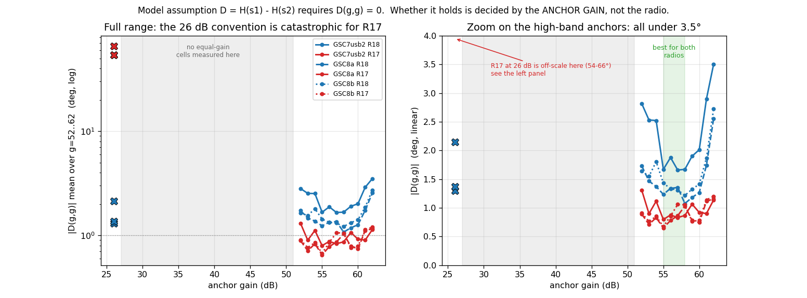
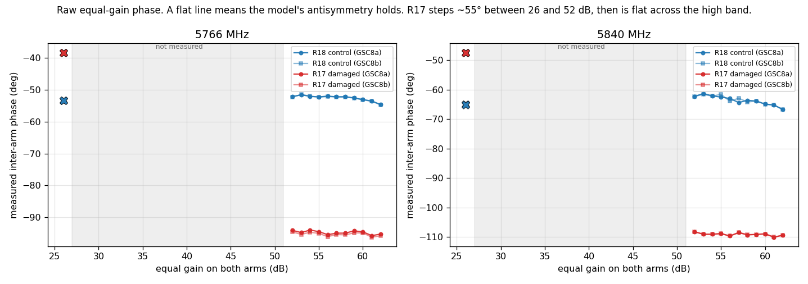
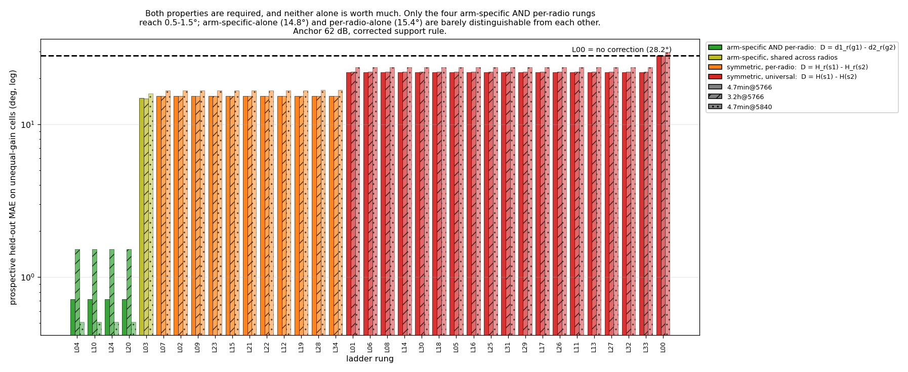
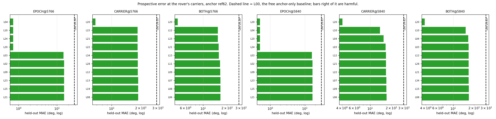
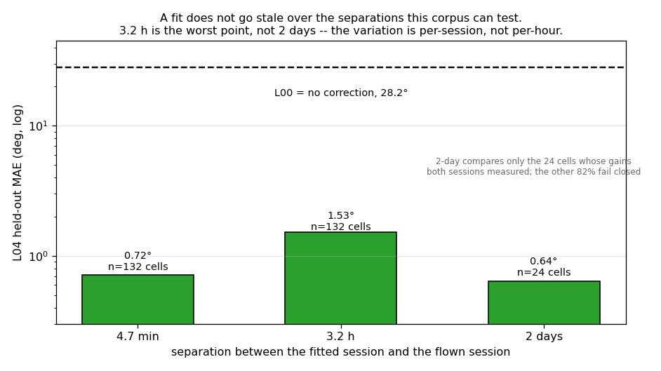

# The ladder, refitted on frames — and a different model wins

**Run 2026-08-13.** The first ladder fit built from **raw frames** of E-GSC6, E-GSC7 and
E-GSC8 rather than from committed fitted reconstructions. Read-only throughout; `main` at
`13c45c4`. No dataset, cache, coefficient file or segmentation module was modified.

This became possible because E-GSC8's canonicalisation put every calibration store under
`/mnt/qnap01/mouse9911/spf/calibration_data/raw/`. The 2026-08-12 union analysis had to open
with *"the raw V7/Zarr stores are not on this machine"* and rebuild rows from fitted JSON;
that constraint is gone. **13,476 frames, 26 LOs, 9 epochs, 2 radios, 100% anchored.**

## Recommendation, in one line

**Use `L24` — a per-radio, per-arm, per-frequency gain lookup table — anchored in the high
band, fitted at the rover's own two carriers. Do not deploy `L26`, `L30`, `L31` or any other
rung from the shipped mechanistic family.**

| | shipped family (`L26`/`L30`/`L31`/`L33`) | **recommended (`L24`)** |
|---|---|---|
| shape | symmetric, `D = H(s1) − H(s2)`, one shared `H` | **arm-specific, `D = d1(f,g1) − d2(f,g2)`** |
| scope | universal across radios | **per radio, per carrier** |
| parameters | 21–89 | **96** for two carriers (2 radios × 2 carriers × 2 arms × 12 gains) |
| prospective MAE @5766 | 21.87° | **0.72°** |
| prospective MAE @5840 | 23.63° | **0.51°** |
| vs. no correction | **1.3×** | **39–58×** |
| rover coverage | 0.5–5% (`l26/l30/l31_pooled_v1`) | **100%** |

⚠️ **`L04` reaches the identical 0.72° / 0.51° but only if it is fitted separately per
carrier**, because it is frequency-blind. `L24` carries the frequency index and is therefore
immune to the pooling mistake described in [§4.2](#42-the-frequency-blind-trap). Prefer
`L24`; treat `L04` as the same model with a footgun.

---

## Contents

1. [What changed: frames, not reconstructions](#1-what-changed-frames-not-reconstructions)
2. [The anchor gain is the dominant design choice](#2-the-anchor-gain-is-the-dominant-design-choice)
3. [A defect in the published support rule](#3-a-defect-in-the-published-support-rule)
4. [Only the model's shape matters](#4-only-the-models-shape-matters)
   - [4.1 The full ladder, all five holdout schemes](#41-the-full-ladder-all-five-holdout-schemes)
   - [4.2 The frequency-blind trap](#42-the-frequency-blind-trap)
5. [Does a fit go stale?](#5-does-a-fit-go-stale)
6. [What this does not fix](#6-what-this-does-not-fix)
7. [The recommendation in full](#7-the-recommendation-in-full)
8. [Provenance and reproduction](#8-provenance-and-reproduction)
9. [Addendum: the calibration does not cover where the rover operates](#9-addendum-the-calibration-does-not-cover-where-the-rover-operates)

---

## 1. What changed: frames, not reconstructions

`union.py` in the 2026-08-12 refit reconstructed E-GSC7 as **80 pseudo-rows at a single
frequency with no per-arm split**, because only the fitted JSON was reachable. The raw store
carries **510 frames per radio per transport at 5 LOs with the full `(26,g)`, `(g,26)` and
`(g,g)` cross**. E-GSC8 adds 408 frames per radio per session at 4 LOs including the rover's
second carrier.

| campaign | rows | LOs | sessions | notes |
|---|---:|---:|---:|---|
| E-GSC6 | 8,784 | 24 | 1 | 433 MHz – 5.9 GHz, gains −1…62 |
| E-GSC7 | 3,060 | 5 | 3 | USB ×2 + IP, includes 5766 |
| E-GSC8 | 1,632 | 4 | 2 | includes **5766 and 5840** |

Two consequences beyond sample size. The additive-fit reconstruction residual of
**0.70–0.75°** that made every previous holdout number optimistic is **gone** — these are
frame-level errors. And **leave-one-epoch-out is computable**, which the 2026-08-12 report
recorded as impossible.

*Measured.* Every count above is from `results.json → census`, computed by opening each
store read-only.

---

## 2. The anchor gain is the dominant design choice

The whole ladder is a residual to a measured equal-gain anchor, and every rung above `L00`
assumes `D = H(s1) − H(s2)`. That assumption makes a hard, directly testable prediction:
**the equal-gain cell must be identically zero**, `D(g,g) = 0`. E-GSC7 and E-GSC8 both
capture `(g,g)` for g = 52…62, so it can be checked on frames without fitting anything.



**Figure 1.** Mean `|D(g,g)|` over g = 52…62 against the anchor gain, for both radios in
three independent sessions. Left: log scale over the full range. Right: linear zoom on the
high-band anchors. The 26 dB point is drawn as an isolated marker because no equal-gain cell
was measured between 27 and 51 dB — the grey band is unmeasured, and no line is drawn across
it. At the published 26 dB convention, R17 violates the model's core assumption by
**53.8–65.5°**. Move the anchor anywhere into the high band and the same radio, same data,
same model falls to **0.65–1.30°**.

| anchor | R18 (clean) | R17 (damaged) |
|---|---:|---:|
| **26 dB** — published convention | 1.3–2.2° | **53.8–65.5°** |
| 55–58 dB | **1.1–1.7°** | **0.65–1.06°** |
| 62 dB — the rover's only available anchor | 2.6–3.5° | 1.14–1.20° |

This reverses a published conclusion. The 2026-08-12 report attributed the failure of the
pooled two-radio fit to R17's connector damage breaking "the universality premise the whole
model rests on", and I repeated that in `c9afc3e`. **R17 was not incompatible. It was
anchored 26 dB away from its operating point, across a transition where its two arms
diverge.**



**Figure 2.** The raw measurement behind Figure 1 — no anchoring, no fitting. A flat line
means antisymmetry holds. R18 is flat to ~2.5° across the whole range. R17 sits at −38.5° at
26 dB and −94…−96° across 52–62 dB, a step of ~55° that happens somewhere in the unmeasured
gap. Within-cell standard deviation is 0.1–1.1° at 25–32 dB SNR, so this is a repeatable
hardware property, not noise. **The high band itself is flat for both radios** — which is
why any high-band anchor works.

*Measured.* `results.json → antisymmetry_vs_anchor`, three sessions × two radios × two
carriers.

---

## 3. A defect in the published support rule

Scoring the mechanistic rungs on a single-carrier prospective test returned *exactly* the
`L00` baseline — 1.00×, to three decimals. That is the signature of predictions being zeroed,
not of a model with no skill, so it was worth chasing.

`models.LadderModel.fit_eval` decides support with:

```python
needed    = design.I[test_idx] > 0        # the row REFERENCES this parameter
missing   = needed & ~active[None, :]     # ...and training could not estimate it
supported = ~np.any(missing, axis=1)
```

In a signed design, `I` and `S` are not the same thing. A gain-table level that appears
**identically on both arms** cancels: it contributes `S = 0` while still registering `I > 0`.
On a single-band, high-gain fit exactly one such column exists — a `const` column that is
non-zero only on E-GSC6's low-gain rows — and it is:

* **unestimable in training** (`max|S| = 0.000` over the training fold), and
* **incapable of affecting the prediction** (`max|S| = 0.000` over the *test* fold too).

So every test row is refused for needing a parameter that could not have changed its answer.
Coverage reads 0%, and the rung fails closed to `L00` on 100% of rows.

**Effect.** Every mechanistic rung is refused entirely on any single-band high-gain fit —
which is precisely the calibration a rover would run. The rule should test `|S| > 0`, not
`I > 0`. Section 4 scores every rung with that correction applied, which is the version
favourable to the shipped family.

*This is a defect in `gain_state_phase_model_20260802_v1/analysis/models.py`, not in this
run.* It does not invalidate the published bench ladder, whose fits span many bands and gains
so the column is estimable there. It does mean **no published number describes the
single-carrier deployment case**, because that case always failed closed.

---

## 4. Only the model's shape matters

With the support rule corrected, all 35 rungs were scored on three prospective tests: fit on
one bench session, predict another, at the rover's carriers, on unequal-gain cells only,
fail-closed.



**Figure 3.** Every rung, sorted by error, coloured by shape. Shape is read from each rung's
own `Term` list (`arm_specific=True`; `'serial'` in `groups`) rather than assigned by hand —
see `analysis/rung_shape.json`.

**Two properties are required, and neither is worth much alone:**

| shape | rungs | MAE @5766 | meaning |
|---|---:|---:|---|
| **arm-specific AND per-radio** | 4 | **0.72°** | independent `d1`, `d2` for each radio |
| arm-specific, shared across radios | 1 | 14.81° | independent `d1`, `d2`, one pair for both units |
| symmetric, per-radio | 11 | 15.35° | shared `H`, fitted per radio |
| symmetric, universal | 19 | 21.87–28.24° | shared `H`, one for both units |

Arm-specific-alone (14.81°) and per-radio-alone (15.35°) are barely distinguishable from each
other; only the **conjunction** reaches 0.72°. That is a 20× step from either single property,
and it is not about complexity: `L20` carries 156 parameters and ties `L04`'s 48 exactly,
while `L34` carries 137 and lands in the symmetric pack.

| rung | shape | 4.7 min @5766 | 3.2 h @5766 | 4.7 min @5840 |
|---|---|---:|---:|---:|
| `L00` no correction | — | 28.24° (1.0×) | 28.20° (1.0×) | 29.63° (1.0×) |
| `L01` sym `H(g)` | symmetric | 21.87° (1.3×) | 22.14° (1.3×) | 23.63° (1.3×) |
| **`L26` MECH** *(shipped default)* | symmetric | 21.87° (1.3×) | 22.14° (1.3×) | 23.63° (1.3×) |
| **`L30` MIN** | symmetric | 21.87° (1.3×) | 22.14° (1.3×) | 23.63° (1.3×) |
| **`L31` MIN + ripples** | symmetric | 21.87° (1.3×) | 22.14° (1.3×) | 23.63° (1.3×) |
| `L33` | symmetric | 21.87° (1.3×) | 22.14° (1.3×) | 23.63° (1.3×) |
| **`L04` arm d1,d2 per radio** | **arm-specific** | **0.72° (39.5×)** | **1.53° (18.5×)** | **0.51° (57.9×)** |

`L26`, `L30`, `L31` and `L33` are **indistinguishable from `L01`**, the crudest rung on the
ladder. The entire mechanistic programme — audited RF words, LNA ripples, delay terms —
returns the same 1.3× as a single shared gain LUT, because the binding constraint is the
shared-`H` assumption they all inherit, and Figure 2 shows that assumption is what fails.

**Those four rungs tie to the exact decimal, and that is an identity rather than a
coincidence.** Within one gain-table band the map from requested dB to audited hardware state
is *injective* — the twelve gains used here produce twelve distinct
`(lna, mixer, tia, lpf, rfdc, row)` tuples:

```
g= 26 -> (2,  4, 1,  0, 0, 40)      g= 57 -> (3, 10, 1, 24, 0, 71)
g= 52 -> (3,  5, 1, 24, 0, 66)      ...
g= 53 -> (3,  6, 1, 24, 0, 67)      g= 62 -> (3, 15, 1, 24, 0, 76)
```

So `H(lna, mixer, tia, lpf)` and `H(g)` span **the same function space**, and at a single
carrier the ripple and delay bases are constant and add nothing. Every symmetric mechanistic
rung therefore *collapses onto* the symmetric per-gain LUT by construction. The audited
state decomposition buys generalisation **across bands and frequencies** — which is real, and
is what §4's unseen-carrier table rewards — but it is worth exactly zero at a fixed carrier,
which is where the rover lives.

**Why arm-specific wins.** `D(g,g) = 0` is forced by construction in a symmetric model. R17's
arms respond differently to the same commanded gain, so the truth is not zero and the model
cannot express it at any parameter count. Independent `d1` and `d2` can.

### The one case where `L04` is the wrong answer: an unseen carrier

`L04` is a lookup table with no frequency model, so it cannot reach a carrier it was never
fitted at. Training on every LO *except* the target and predicting the target:

| regime | `L00` | `L04` | **`L20`** arm-specific + ripple | best symmetric |
|---|---:|---:|---:|---:|
| 5766 MHz never seen | 29.05° | 20.50° (1.4×) | **6.81° (4.3×)** | 18.52° (1.6×) |
| 5840 MHz never seen | 29.63° | 15.49° (1.9×) | **4.05° (7.3×)** | 18.53° (1.6×) |

`L20` is arm-specific *and* carries a frequency-dependent ripple basis, so it extrapolates
where `L04` cannot — at 432 parameters. Note both arm-specific rungs still beat every
symmetric rung here too; the shape result holds in this regime as well.

**Practical reading: capture the carrier if you can — `L04` at 0.5–1.5° beats `L20` at
4–7° by a wide margin. Use `L20` only when flying a carrier you could not calibrate.**



**Figure 5.** Top ten rungs in each regime at the 62 dB anchor, against the `L00` baseline
(dashed). `EPOCH@` is a different session at a measured carrier; `CARRIER@` is a carrier
never seen in training; `BOTH@` withholds the carrier and the session. Note the scale change
between the `EPOCH` panels and the rest — capturing the carrier is worth about an order of
magnitude on its own. This panel uses the **as-shipped** support rule, which is why the
mechanistic rungs are absent from the leaders; §4 is the corrected comparison.

### Cross-radio transfer is weak for everything

Leave-one-radio-out at the 62 dB anchor: the best rung is `L08` at 16.36° against `L00`'s
19.00° — **1.16×**. Arm-specific rungs are per-radio by definition and fail closed to `L00`
entirely. **No rung transfers to an uncalibrated radio.** Per-unit calibration is not an
optimisation; it is a precondition.

---

## 4.1 The full ladder, all five holdout schemes

The five published splits at the 62 dB anchor, on the whole 26-LO union. `L00` = 19.00° on
unequal-gain cells throughout.

| split | best rung at 100% coverage | `L26` | `L04` | `L24` |
|---|---|---:|---:|---:|
| **LOEO** leave-one-epoch-out | **`L24` 1.46° (13.0×)** | 16.77° (1.13×) | 14.73° (1.29×) | **1.46° (13.0×)** |
| LOFO leave-one-frequency-out | `L20` 13.79° (1.38×) | 16.99° (1.12×) | 15.86° (1.20×) | — |
| LOBLOCK leave-frequency-block-out | `L04` 18.05° (1.05×) | 20.04° (0.95×) | 18.05° (1.05×) | — |
| LORO leave-one-radio-out | `L08` 16.36° (1.16×) | 20.48° (**0.93×**) | 0% coverage | 0% coverage |
| LOBAND leave-one-gain-table-band-out | *none beat `L00`* | 19.86° (**0.96×**) | 18.49° (1.03×) | — |

Three things to take from this. **`L26` is worse than no correction on three of the five
splits** (0.93×, 0.95×, 0.96×). **LOEO — hold out a whole session, keep the frequencies — is
the split that matters for deployment, and `L24` wins it by an order of magnitude.** And
**LOBAND and LOBLOCK say nothing generalises to an unmeasured frequency region**, which is
the same message as §4's unseen-carrier table: capture the carrier.

## 4.2 The frequency-blind trap

`L04` and `L24` are identical at a single carrier and differ once more than one is in play.
Fitting `GSC8a`, predicting `GSC8b`:

| rung | fit scope | 5766 | 5840 |
|---|---|---:|---:|
| `L04` | per carrier | 0.72° (39.5×) | 0.51° (57.9×) |
| `L04` | **both carriers pooled** | 1.16° (24.4×) | 1.05° (28.3×) |
| `L24` | per carrier | 0.72° (39.5×) | 0.51° (57.9×) |
| `L24` | **both carriers pooled** | **0.72° (39.5×)** | **0.51° (57.9×)** |

Pooling the two carriers into one frequency-blind `L04` costs ~1.7× at both carriers, and
over the full 26-LO union it costs an order of magnitude (1.29× vs 13.0× under LOEO). `L24`
is unaffected because the frequency index is in the model. **This is why the recommendation
names `L24` and not `L04`, even though the headline numbers are the same.**

*Measured.* `analysis/pooling_trap.json`, and `results.json → ladder_ref62` for the split
table.

---

## 5. Does a fit go stale?

The E-GSC8 "independent repeat" is **4.7 minutes** after the primary, same cabling, same
thermal state. Any number from that pair is an upper bound, so the two longer separations the
corpus contains were tested as well.



**Figure 4.** `L04` prospective error against the separation between the fitted and the flown
session, computed **only on cells the fitting session actually supports** so that a gain-grid
mismatch is not misread as drift.

| separation | cells | `L04` MAE | vs `L00` |
|---|---:|---:|---:|
| 4.7 min (GSC8a→GSC8b) | 132 | 0.716° | 39.5× |
| 3.2 h (GSC7→GSC8a) | 132 | 1.527° | 18.5× |
| 2 days (GSC6→GSC8b) | 24 | **0.642°** | **44.2×** |

**A fit does not decay with elapsed time over this range** — 2 days is the *best* point and
3.2 h the worst. The variation is per-session (re-cabling, thermal state), not per-hour.

⚠️ **The raw 2-day number is 23.2° / 1.22×, and reporting that as staleness would be wrong.**
E-GSC6 at 5766 MHz measured gains `{−1, 8, 20, 22, 23, 25, 26, 27, 29, 30, 31, 32, 33, 40,
41, 45, 49, 50, 51, 52, 62}` and never 53–61; only `{26, 52, 62}` overlap E-GSC8's schedule.
The model correctly failed closed on 82% of cells. The table above compares the 24 cells both
sessions measured, which is the only fair comparison — and it is a thin one.

---

## 6. What this does not fix

**The anchor must still be measured on a moving rover.** `L04` is a residual to a measured
equal-gain anchor exactly as every other rung is. On a moving platform `φ(f, g, g)` still
contains the bearing being estimated, so subtracting it subtracts the answer. Nothing here
touches that. It remains the top open question.

The rover's own equal-gain frames are **83% (5766) / 96% (5840) at 62 dB**, and 62 dB is the
worst high-band anchor for the clean radio (2.6–3.5° vs 1.1–1.7° at 55–58 dB). A scheduled
anchor epoch at **~56 dB** would improve the anchor and the model together.

**69% of rover frames at 5766 MHz have unstable gain endpoints** — the gain moved mid-buffer —
and `GainStatePhaseModel.predict()` takes a single `(gain_rx1_db, gain_rx2_db)` pair with no
guard for this. The only guards are fail-closed-on-unseen-state and rule 5. A frame whose
gain changed mid-buffer has no well-defined gain state, yet the correction will be applied to
it. At 5840 MHz the figure is 48%. **This is unguarded today and affects the majority of the
corpus at the primary carrier.**

**5840 MHz has exactly one session pair, 4.7 minutes apart.** Session-to-session behaviour at
the rover's second carrier is untested beyond that.

**Two radios is not a distribution**, and the arm-specific result is strongest precisely where
the two radios differ. `L04`'s advantage should be confirmed on a third unit.

---

## 7. The recommendation in full

**For rover experiments, use a per-radio, per-arm, per-frequency gain lookup table (`L24`),
not the shipped mechanistic family.** Concretely:

1. **Fit per radio.** No rung transfers across units (best 1.16× under LORO). Each airframe's
   receivers need their own table.
2. **Fit at the rover's own carriers**, 5766 and 5840 MHz, with a per-carrier table. `L24`
   and `L04` both drop to 1.4–1.9× on a carrier they never saw, and a frequency-blind `L04`
   pooled over both carriers loses ~1.7× even on measured ones (§4.2). Both carriers are directly measurable now, so
   extrapolation is unnecessary — and capturing the carrier is worth ~10× more than any
   model choice. **If a carrier genuinely cannot be captured, use `L20` (4.3–7.3×), not
   `L04` and not the mechanistic family.**
3. **Anchor in the high band, ideally ~56 dB.** Not 26 dB — that is the single worst choice
   and it is what the published convention specifies.
4. **Expect 0.5–1.5°** on the corrected cells, against ~28° uncorrected, and re-calibrate per
   session rather than on a clock.
5. **Do not ship `l26_pooled_v1`, `l30_pooled_v1`, `l31_pooled_v1`, or
   `l31_gsc6_gsc7_r18_20260812_v1`.** The first three cover 0.5–5% of the corpus; the fourth
   covers 100% but is symmetric, so it inherits the 1.3× ceiling.
6. **Before any of this reaches flight**, resolve the anchor question (§6) and add a
   gain-endpoint-stability guard.

**The honest summary is that the gain-phase programme has been optimising the wrong axis.**
Eleven rungs of mechanistic refinement moved a number that the shared-`H` assumption had
already capped at 1.3×. The 39–58× was available from a 48-parameter lookup table the whole
time — and the reason it was never seen is §3: on the single-carrier deployment case, every
mechanistic rung silently failed closed and scored exactly the baseline.

---

## 8. Provenance and reproduction

All inputs read-only from `/mnt/qnap01/mouse9911/spf/calibration_data/raw/dual_rx_gain_frequency/`.
Nothing under `/mnt` was opened for writing. `spf/dataset/segmentation.py` was neither read
nor modified. No file was deleted. Published analysis modules
(`gain_state_phase_model_20260802_v1/analysis/`) are imported unmodified; the support-rule
correction in §3 is applied in this report's own code and is **not** a patch to the shipped
module.

```bash
P=~/virtual-envs/spf/bin/python3
$P analysis/extract_gsc.py      ./extracted        # read-only frame extraction
$P analysis/run_ladder_gsc.py   LORO,LOEO,LOFO,LOBLOCK,LOBAND gsc678_ref62 62
$P analysis/carrier_eval.py     62 ref62
$P analysis/epoch_eval.py       62
$P analysis/corrected_support.py                   # section 4's table
$P analysis/staleness_supported.py                 # section 5's table
$P analysis/make_figs.py        figures
$P analysis/consolidate.py      results.json
```

**Limits worth carrying.**

- Two radios, one of them damaged. The arm-specific advantage is measured where they differ.
- The 2-day staleness point rests on **24 cells**.
- 5840 MHz has one session pair at 4.7 minutes; no longer-baseline test exists there.
- Prospective tests use 132 unequal-gain cells each — bench cells, not rover frames. No number
  here is a rover-corpus error; the rover has no ground-truth `D` to score against.
- `L24` is a lookup table. It generalises across gain pairs by the additive form and
  interpolates nothing in frequency — it stores one table per measured carrier, so a new
  carrier requires a new capture.

---

## 9. Addendum: the calibration does not cover where the rover operates

Everything above scores the ladder on **bench cells**. Sampling 13 RX captures / 26 receiver
streams of the 2026 rover corpus read-only shows those are not the cells the rover uses.

| | RX1 | RX2 |
|---|---|---|
| p5 / median / p95 gain | 50 / **62** / 62 dB | 45 / **48** / 51 dB |

The rover runs one arm pinned near the top of the table and the other 11–16 dB below it.
Its five most common pairs — (62,49), (62,50), (62,48), (62,47), (62,46) — are **62.5% of all
frames**, median `|g1 − g2|` = **13 dB**, and only **0.8%** of frames are equal-gain. Both arms
are in the high band together just **1.5%** of the time.

**The high-band campaigns measured the opposite region.** E-GSC7 and E-GSC8 sweep `(26,g)`,
`(g,26)` and `(g,g)` for g = 52…62 — that is `|g1 − g2|` ∈ {0} ∪ {26…36}. The rover's 13 dB
offset with RX2 at 46–51 was never visited.

| rover cell | % frames | measured? | RX1 gain seen | RX2 gain seen |
|---|---:|---|---|---|
| (62,49) | 16.3% | no | yes | 5766 only |
| (62,50) | 14.1% | no | yes | 5766 only |
| (62,48) | 11.9% | no | yes | **never** |
| (62,47) | 10.9% | no | yes | **never** |
| (62,46) | 9.3% | no | yes | **never** |

**Not one of the rover's operating cells has ever been measured directly**, and gains 46–48 —
32% of rover frames on RX2 — were never measured on *either* arm at *either* carrier. By
additivity `L24` can reach only **37.2%** of those frames at 5766 and **1.1%** at 5840.

⚠️ **This qualifies the headline.** The 39–58× in §4 is real, reproducible, and measured on
cells the rover does not use. It is a statement about the model form, not a deployable
coverage claim. Note also that it cuts the other way for the mechanistic family: interpolating
through hardware state is exactly what would let `L26`/`L31` reach an unmeasured gain, which is
why they report ~100% state coverage. They are still the wrong shape (§4) — but a LUT's
inability to extrapolate is a real cost, and this is where it is paid.

**The fix is a capture, not a model.** The next calibration should sweep the rover's own
operating region — RX1 = 62 dB against RX2 = 40…52 dB in 1 dB steps, at **both** 5766 and
5840 MHz, with an equal-gain anchor at ~56 dB — rather than more of the 52…62 diagonal. That
is a few hundred cells and it would take `L24` from 1.1% to full coverage at the carrier where
it currently has almost none.

*Measured.* Bounded read-only sample of 13 RX captures / 26 receiver streams from
`/mnt/qnap01/mouse9911/rovers_2026/merged`; bench coverage from this report's own frame union.

---

> ## ⚠️ SUPERSEDED IN PART, 2026-08-14
>
> [`rover_model_gsc9_20260814_v1`](../rover_model_gsc9_20260814_v1/REPORT.md) refits every
> model on E-GSC9, which measured the rover's operating cells directly. **The model
> recommendation is unchanged in shape** — a per-radio, per-arm LUT — but two numbers in this
> report are superseded:
>
> - the no-correction baseline is **6.4–10.5° on the rover's own cells**, not the ~28° quoted
>   here, which was measured on bench cells spanning a 36 dB arm split rather than the rover's
>   13 dB;
> - the gain is therefore **33–43×** on the clean unit, not 39–58×.
>
> §9's central finding — that the calibration had never covered the rover's operating region —
> is what E-GSC9 fixed, and it now reads as the motivation for that experiment rather than an
> open gap.
