# Dual-RX gain/frequency calibration report

- Pluto serial: `104000b299050013f4ff0700255e35222f`
- Frames: 324/324 complete; 249 phase-valid (76.9%)
- Cells: 83/108 pass the three-epoch criterion
- Validation status: `fail_quality`

## Frequency coverage

| Frequency (MHz) | Passing cells | Coverage | Median repeat std | Model observations | Train RMSE | CV MAE / p95 |
|---:|---:|---:|---:|---:|---:|---:|
| 868.000 | 7/9 | 77.8% | 1.10° | 21 | 1.45° | 1.33° / 4.04° |
| 915.000 | 7/9 | 77.8% | 0.82° | 21 | 1.25° | 1.25° / 4.08° |
| 1280.000 | 7/9 | 77.8% | 1.02° | 21 | 1.37° | 1.42° / 3.55° |
| 1320.000 | 7/9 | 77.8% | 0.55° | 21 | 0.77° | 0.77° / 1.71° |
| 2412.000 | 7/9 | 77.8% | 0.12° | 21 | 0.82° | 0.84° / 2.03° |
| 2467.000 | 7/9 | 77.8% | 0.81° | 21 | 1.46° | 1.41° / 3.48° |
| 3990.000 | 6/9 | 66.7% | 0.97° | 18 | 1.26° | 1.36° / 3.57° |
| 4010.000 | 7/9 | 77.8% | 0.24° | 21 | 0.38° | 0.38° / 0.76° |
| 5766.000 | 7/9 | 77.8% | 0.36° | 21 | 0.98° | 0.83° / 3.48° |
| 5804.000 | 7/9 | 77.8% | 0.27° | 21 | 0.77° | 0.84° / 2.10° |
| 5838.000 | 7/9 | 77.8% | 0.17° | 21 | 0.86° | 0.77° / 1.96° |
| 5866.000 | 7/9 | 77.8% | 0.97° | 21 | 1.19° | 1.27° / 3.41° |

## Gain-mismatch coverage

| Absolute RX gain mismatch | Passing cells | Cell coverage | Valid frames | Frame coverage |
|---:|---:|---:|---:|---:|
| 0–5 dB | 36/36 | 100.0% | 108/108 | 100.0% |
| 6–10 dB | 0/0 | n/a | 0/0 | n/a |
| 11–20 dB | 0/0 | n/a | 0/0 | n/a |
| 21–30 dB | 24/24 | 100.0% | 72/72 | 100.0% |
| 31–40 dB | 23/24 | 95.8% | 69/72 | 95.8% |
| 41–50 dB | 0/0 | n/a | 0/0 | n/a |
| 51–60 dB | 0/0 | n/a | 0/0 | n/a |
| 61–72 dB | 0/24 | 0.0% | 0/72 | 0.0% |

## Model diagnostics

- Leave-one-epoch-out circular MAE: 1.03°
- Leave-one-epoch-out circular RMSE: 1.49°
- Leave-one-epoch-out circular p95: 3.48°
- Leave-one-epoch-out maximum error: 5.29°

### Paired model comparisons

| Comparison | Held-out frames | First MAE / p95 | Second MAE / p95 | Recommended |
|---|---:|---:|---:|---|
| Ordered additive vs gain difference | 249 | 1.03° / 3.48° | 1.91° / 5.43° | `additive` |
| Additive vs cell interaction | 249 | 1.03° / 3.48° | 1.01° / 3.52° | `additive` |
| Frequency-specific vs shared curves | 249 | 1.03° / 3.48° | 3.61° / 10.05° | `frequency_specific_gain_curves` |
| Frequency-specific vs gain-table-shared curves | 249 | 1.03° / 3.48° | 2.38° / 7.62° | `frequency_specific_gain_curves` |
| Per-frequency vs constant-plus-delay baseline | 249 | 1.03° / 3.48° | 13.01° / 33.85° | `frequency_specific_intercepts` |
| Unanchored vs one-frame anchor | 213 | 1.07° / 3.51° | 1.28° / 3.83° | `unanchored` |

Every row uses an identical held-out observation mask. Differences within the declared 0.1° MAE equivalence margin select the predeclared simpler operational model.

### Effective differential-delay description

- Common reference gain: 26 dB on RX1 and RX2
- Phase slope: -1.76° per 100 MHz
- Effective differential delay: 0.049 ns
- Free-space-equivalent signed path difference: 1.47 cm
- Linear-fit residual RMSE / maximum: 16.82° / 33.72°

Descriptive only: cables, PCB and analogue paths, LO retunes, and calibration state can all contribute. It is not asserted to be literal cable length.

### Signal-confidence tiers

| Minimum SNR in both channels | Eligible frames | Held-out frames | MAE | RMSE | p95 |
|---:|---:|---:|---:|---:|---:|
| -10 dB | 249 | 249 | 1.03° | 1.49° | 3.48° |
| 0 dB | 182 | 182 | 0.91° | 1.41° | 3.41° |
| 10 dB | 118 | 118 | 0.85° | 1.33° | 3.01° |

## Model fit plots

In the per-frequency diagnostics, solid lines are additive-model predictions and circular markers are passing three-epoch cell means. Error bars show repeat circular standard deviation. Failed or unsupported cells are not drawn. Phase is placed on the branch nearest the fitted frequency intercept so wrap-around does not create false jumps.

### Fitted gain effects across frequency

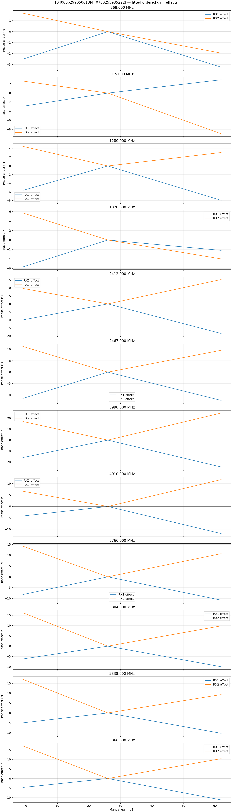

### Frequency baseline and delay description

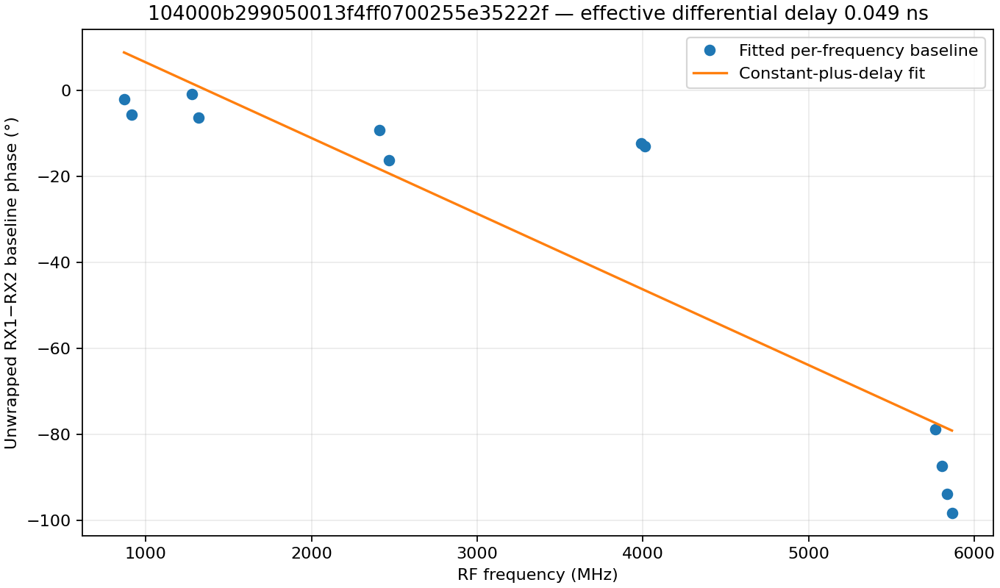

### Per-frequency data versus fit

#### 868.000 MHz

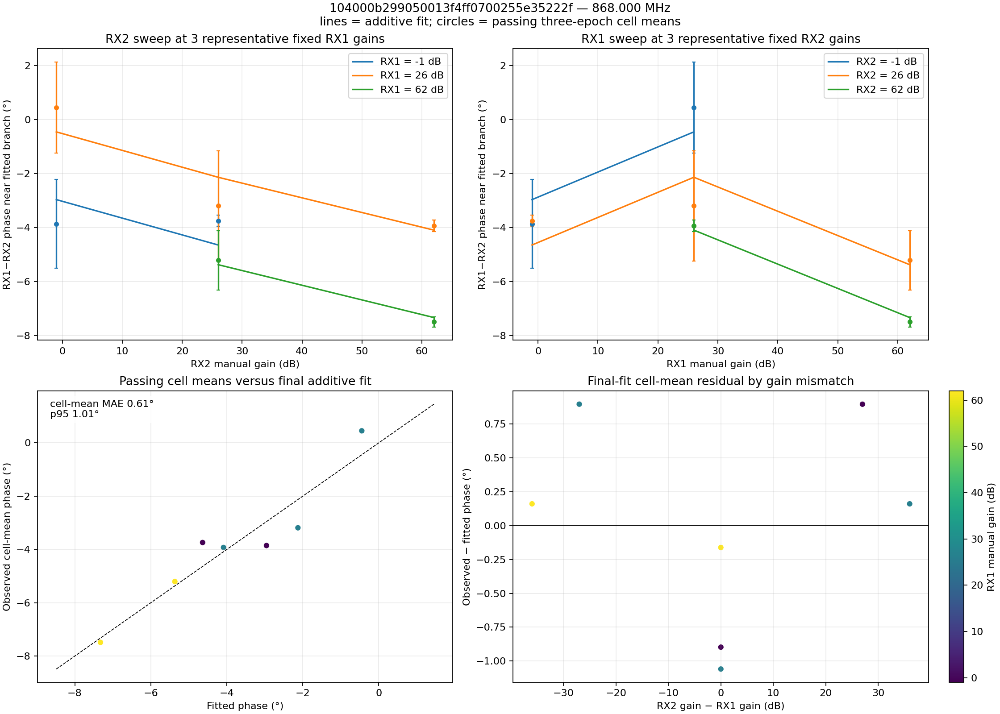

Additional views: [coverage and phase surface](phase_surface_868000000.png) · [residual heatmap](additive_residual_868000000.png)

#### 915.000 MHz

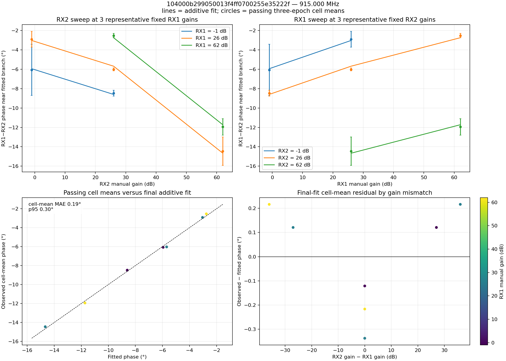

Additional views: [coverage and phase surface](phase_surface_915000000.png) · [residual heatmap](additive_residual_915000000.png)

#### 1280.000 MHz

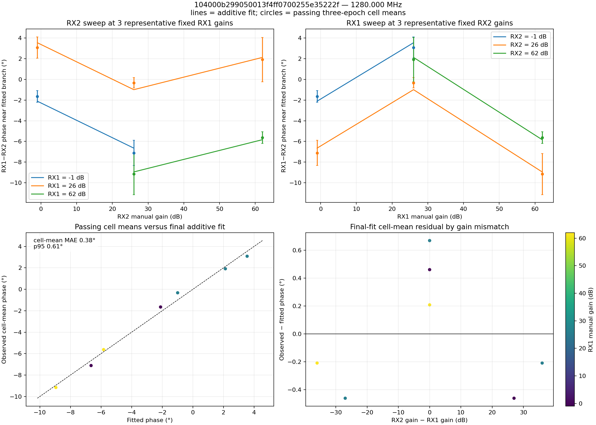

Additional views: [coverage and phase surface](phase_surface_1280000000.png) · [residual heatmap](additive_residual_1280000000.png)

#### 1320.000 MHz

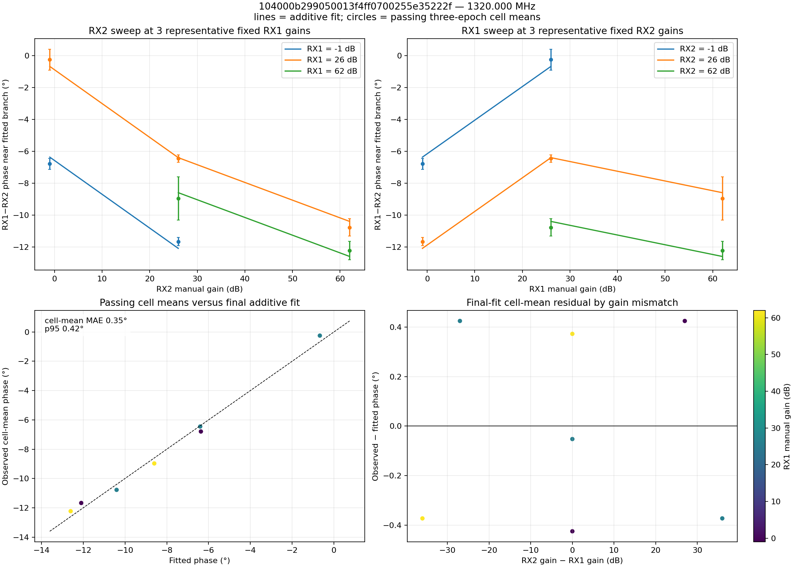

Additional views: [coverage and phase surface](phase_surface_1320000000.png) · [residual heatmap](additive_residual_1320000000.png)

#### 2412.000 MHz

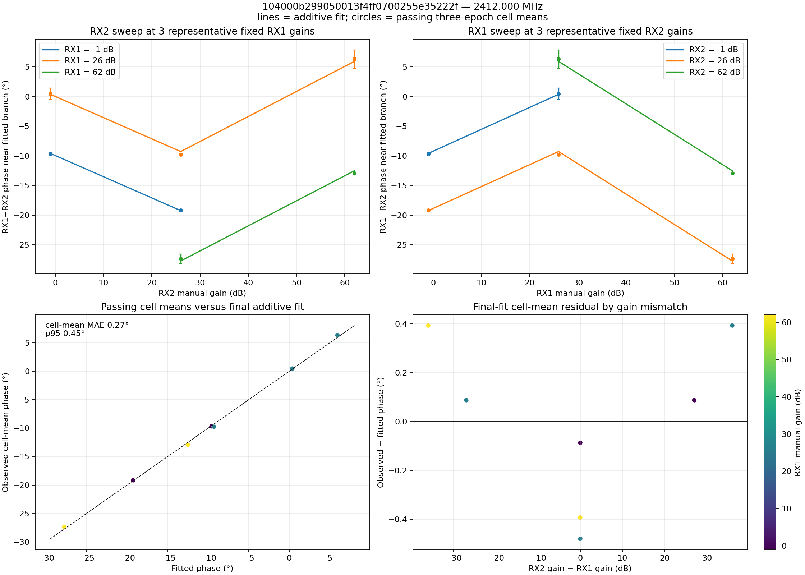

Additional views: [coverage and phase surface](phase_surface_2412000000.png) · [residual heatmap](additive_residual_2412000000.png)

#### 2467.000 MHz

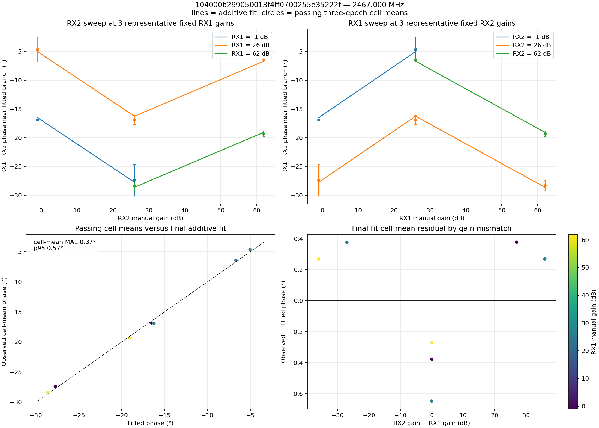

Additional views: [coverage and phase surface](phase_surface_2467000000.png) · [residual heatmap](additive_residual_2467000000.png)

#### 3990.000 MHz

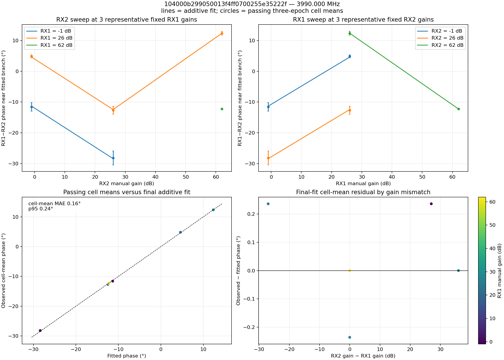

Additional views: [coverage and phase surface](phase_surface_3990000000.png) · [residual heatmap](additive_residual_3990000000.png)

#### 4010.000 MHz

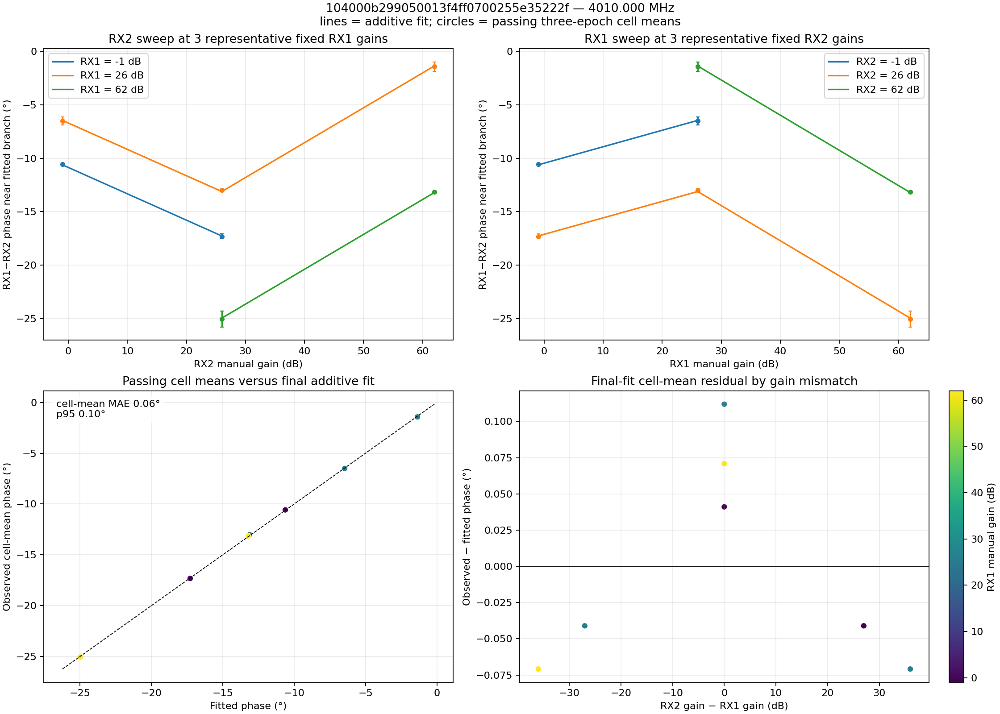

Additional views: [coverage and phase surface](phase_surface_4010000000.png) · [residual heatmap](additive_residual_4010000000.png)

#### 5766.000 MHz

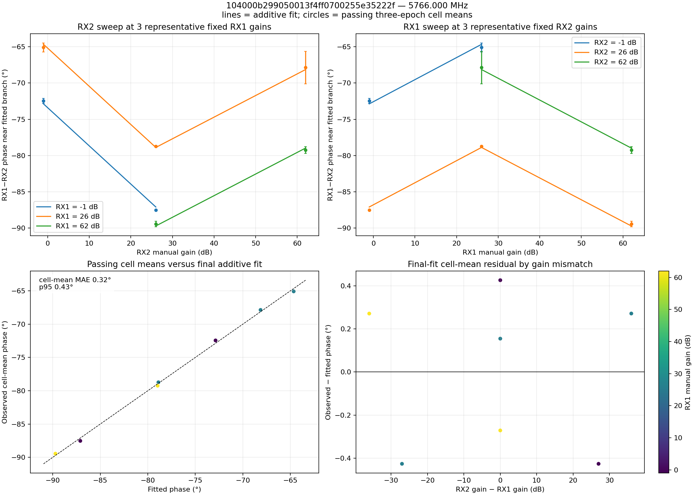

Additional views: [coverage and phase surface](phase_surface_5766000000.png) · [residual heatmap](additive_residual_5766000000.png)

#### 5804.000 MHz

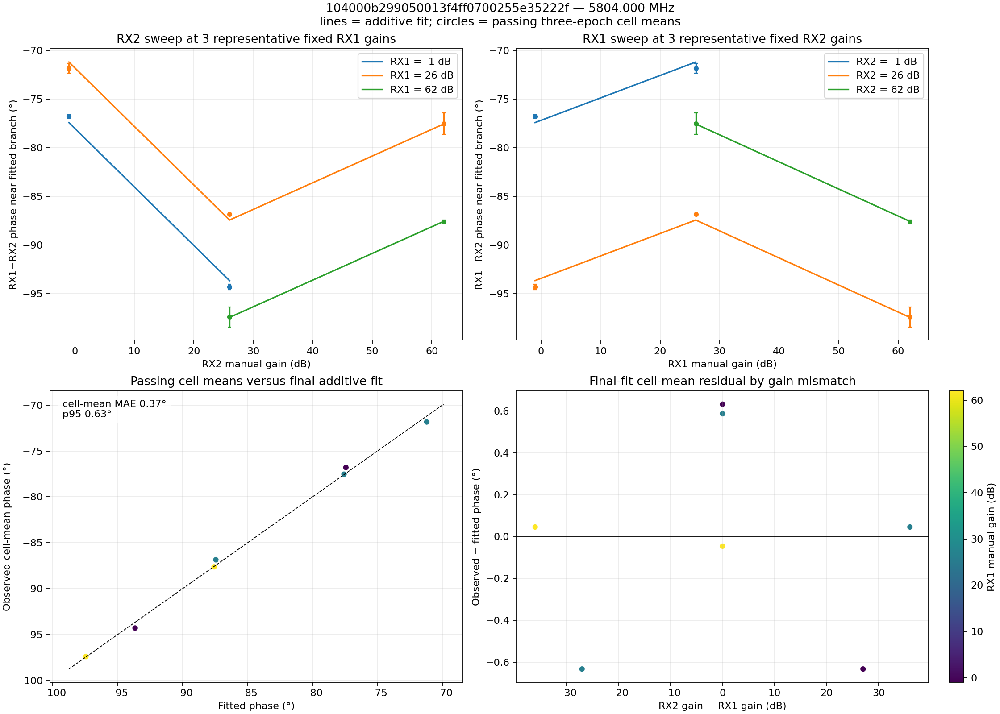

Additional views: [coverage and phase surface](phase_surface_5804000000.png) · [residual heatmap](additive_residual_5804000000.png)

#### 5838.000 MHz

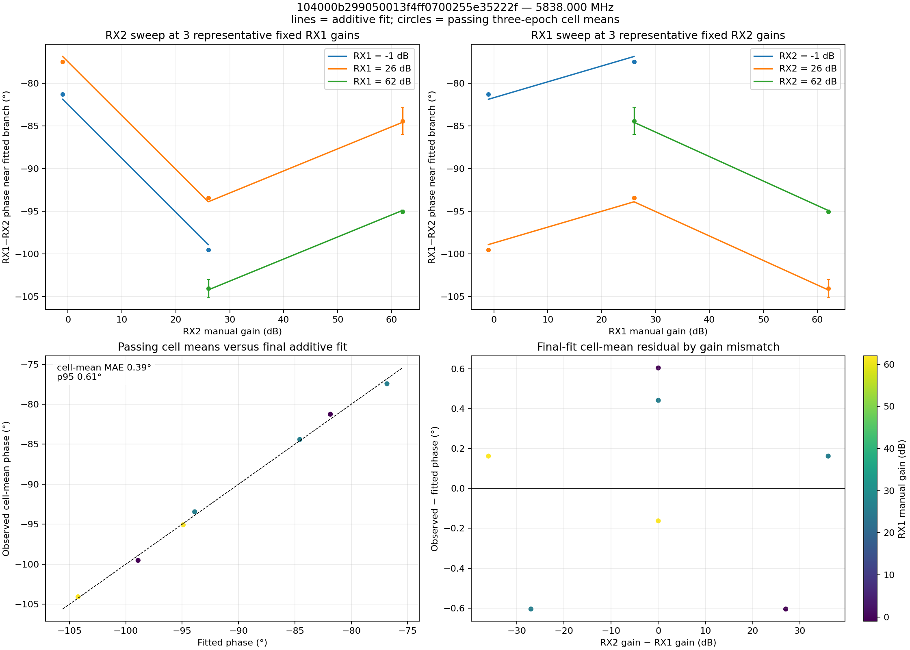

Additional views: [coverage and phase surface](phase_surface_5838000000.png) · [residual heatmap](additive_residual_5838000000.png)

#### 5866.000 MHz

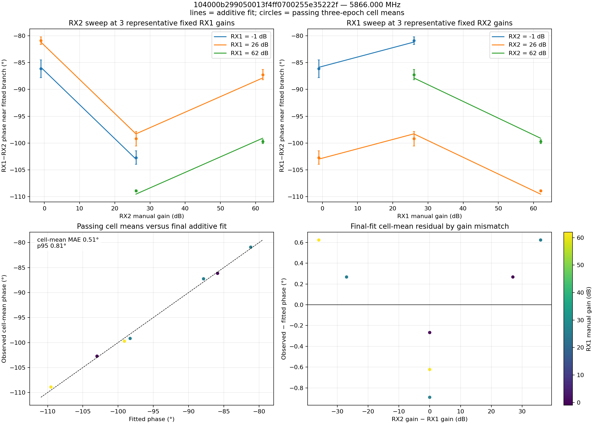

Additional views: [coverage and phase surface](phase_surface_5866000000.png) · [residual heatmap](additive_residual_5866000000.png)

