# Dual-RX gain/frequency calibration report

- Pluto serial: `104473b80a16000de6ff2000f8a6beca79`
- Frames: 324/324 complete; 221 phase-valid (68.2%)
- Cells: 74/108 pass the three-epoch criterion
- Validation status: `fail_quality`

## Frequency coverage

| Frequency (MHz) | Passing cells | Coverage | Median repeat std | Model observations | Train RMSE | CV MAE / p95 |
|---:|---:|---:|---:|---:|---:|---:|
| 868.000 | 7/9 | 77.8% | 0.79° | 21 | 1.27° | 1.40° / 3.05° |
| 915.000 | 7/9 | 77.8% | 0.35° | 21 | 0.85° | 0.81° / 2.65° |
| 1280.000 | 7/9 | 77.8% | 0.49° | 21 | 0.52° | 0.57° / 1.23° |
| 1320.000 | 7/9 | 77.8% | 0.25° | 21 | 0.50° | 0.48° / 0.98° |
| 2412.000 | 7/9 | 77.8% | 0.32° | 21 | 0.76° | 0.63° / 2.26° |
| 2467.000 | 7/9 | 77.8% | 0.30° | 20 | 0.67° | 0.63° / 2.16° |
| 3990.000 | 5/9 | 55.6% | 2.57° | 15 | 2.80° | 3.80° / 7.27° |
| 4010.000 | 7/9 | 77.8% | 1.34° | 21 | 1.54° | 1.79° / 4.20° |
| 5766.000 | 5/9 | 55.6% | 1.10° | 15 | 1.57° | 1.82° / 4.67° |
| 5804.000 | 5/9 | 55.6% | 2.36° | 15 | 2.33° | 3.16° / 5.27° |
| 5838.000 | 5/9 | 55.6% | 2.03° | 15 | 1.95° | 2.43° / 4.55° |
| 5866.000 | 5/9 | 55.6% | 0.73° | 15 | 1.16° | 1.32° / 3.08° |

## Gain-mismatch coverage

| Absolute RX gain mismatch | Passing cells | Cell coverage | Valid frames | Frame coverage |
|---:|---:|---:|---:|---:|
| 0–5 dB | 36/36 | 100.0% | 108/108 | 100.0% |
| 6–10 dB | 0/0 | n/a | 0/0 | n/a |
| 11–20 dB | 0/0 | n/a | 0/0 | n/a |
| 21–30 dB | 24/24 | 100.0% | 72/72 | 100.0% |
| 31–40 dB | 14/24 | 58.3% | 41/72 | 56.9% |
| 41–50 dB | 0/0 | n/a | 0/0 | n/a |
| 51–60 dB | 0/0 | n/a | 0/0 | n/a |
| 61–72 dB | 0/24 | 0.0% | 0/72 | 0.0% |

## Model diagnostics

- Leave-one-epoch-out circular MAE: 1.45°
- Leave-one-epoch-out circular RMSE: 2.06°
- Leave-one-epoch-out circular p95: 4.41°
- Leave-one-epoch-out maximum error: 7.63°

### Paired model comparisons

| Comparison | Held-out frames | First MAE / p95 | Second MAE / p95 | Recommended |
|---|---:|---:|---:|---|
| Ordered additive vs gain difference | 221 | 1.45° / 4.41° | 2.14° / 5.34° | `additive` |
| Additive vs cell interaction | 221 | 1.45° / 4.41° | 1.42° / 4.58° | `additive` |
| Frequency-specific vs shared curves | 221 | 1.45° / 4.41° | 3.13° / 7.92° | `frequency_specific_gain_curves` |
| Frequency-specific vs gain-table-shared curves | 221 | 1.45° / 4.41° | 2.34° / 6.37° | `frequency_specific_gain_curves` |
| Per-frequency vs constant-plus-delay baseline | 221 | 1.45° / 4.41° | 6.05° / 13.33° | `frequency_specific_intercepts` |
| Unanchored vs one-frame anchor | 185 | 1.46° / 4.38° | 1.21° / 3.39° | `one_frame_anchored` |

Every row uses an identical held-out observation mask. Differences within the declared 0.1° MAE equivalence margin select the predeclared simpler operational model.

### Effective differential-delay description

- Common reference gain: 26 dB on RX1 and RX2
- Phase slope: -0.16° per 100 MHz
- Effective differential delay: 0.005 ns
- Free-space-equivalent signed path difference: 0.14 cm
- Linear-fit residual RMSE / maximum: 6.89° / 12.86°

Descriptive only: cables, PCB and analogue paths, LO retunes, and calibration state can all contribute. It is not asserted to be literal cable length.

### Signal-confidence tiers

| Minimum SNR in both channels | Eligible frames | Held-out frames | MAE | RMSE | p95 |
|---:|---:|---:|---:|---:|---:|
| -10 dB | 221 | 221 | 1.45° | 2.06° | 4.41° |
| 0 dB | 156 | 155 | 1.16° | 1.74° | 3.83° |
| 10 dB | 98 | 98 | 0.92° | 1.44° | 3.03° |

## Model fit plots

In the per-frequency diagnostics, solid lines are additive-model predictions and circular markers are passing three-epoch cell means. Error bars show repeat circular standard deviation. Failed or unsupported cells are not drawn. Phase is placed on the branch nearest the fitted frequency intercept so wrap-around does not create false jumps.

### Fitted gain effects across frequency

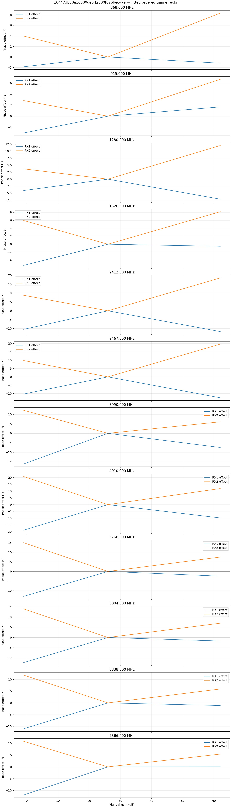

### Frequency baseline and delay description

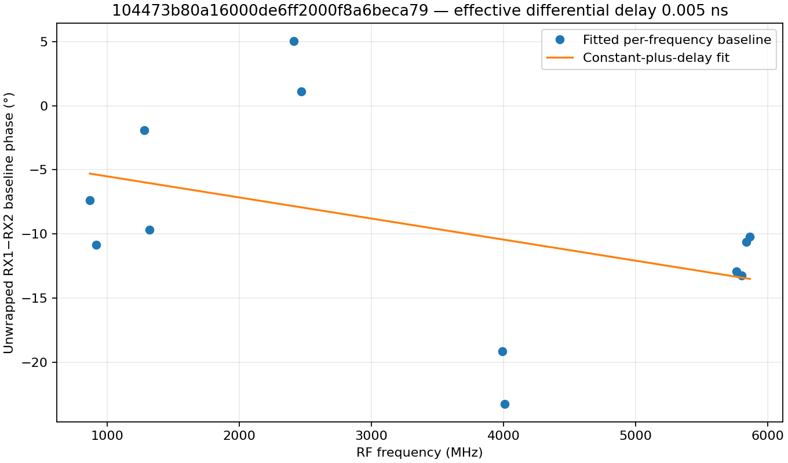

### Per-frequency data versus fit

#### 868.000 MHz

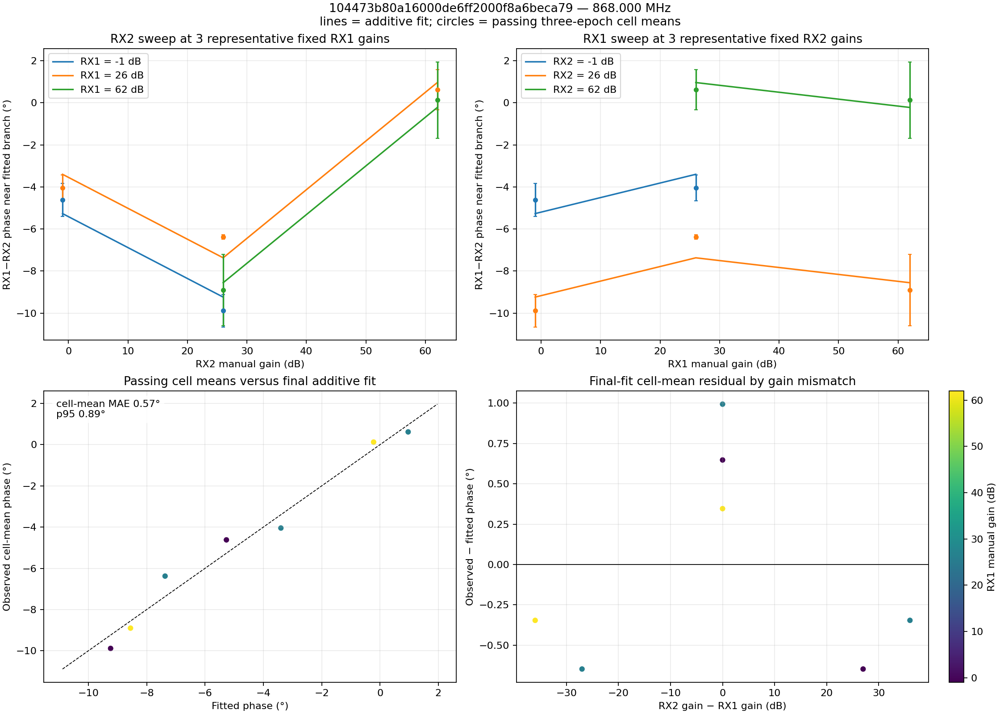

Additional views: [coverage and phase surface](phase_surface_868000000.png) · [residual heatmap](additive_residual_868000000.png)

#### 915.000 MHz

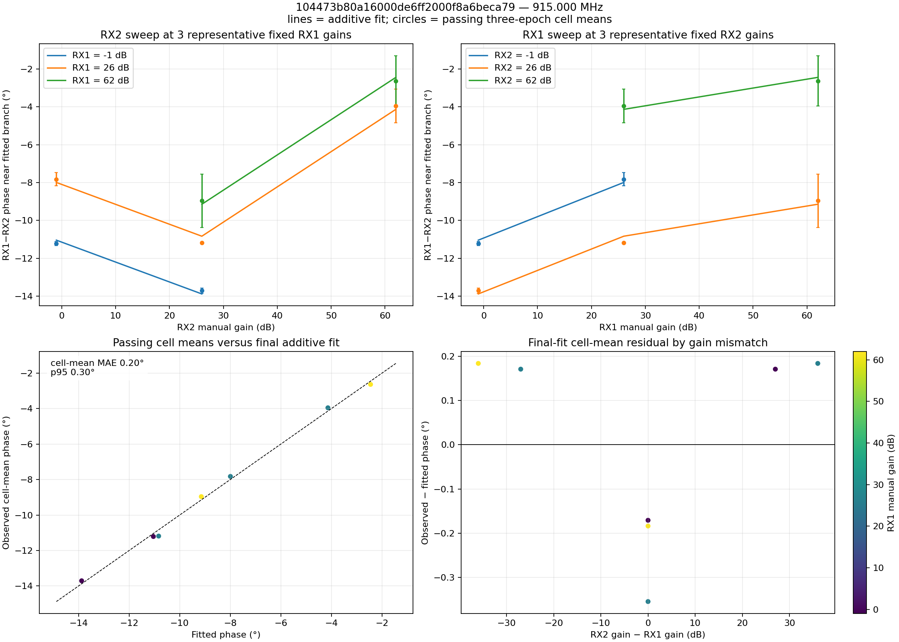

Additional views: [coverage and phase surface](phase_surface_915000000.png) · [residual heatmap](additive_residual_915000000.png)

#### 1280.000 MHz

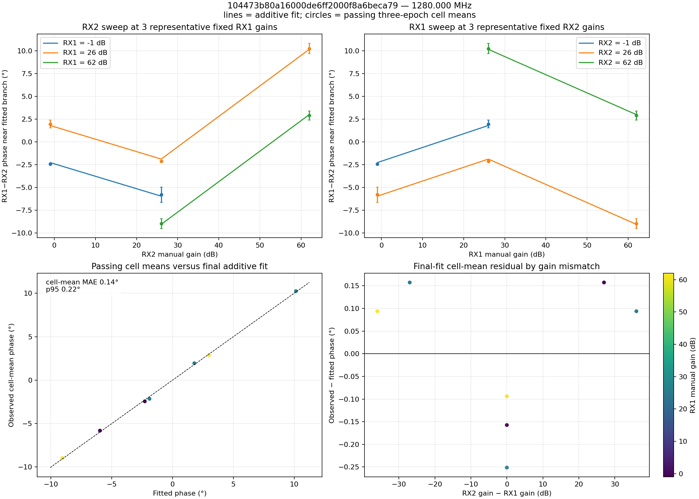

Additional views: [coverage and phase surface](phase_surface_1280000000.png) · [residual heatmap](additive_residual_1280000000.png)

#### 1320.000 MHz

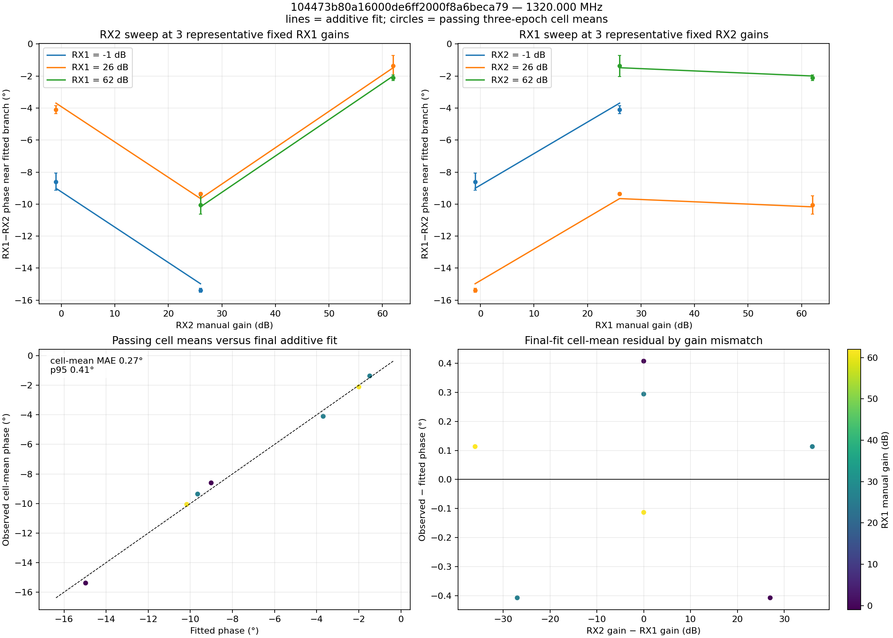

Additional views: [coverage and phase surface](phase_surface_1320000000.png) · [residual heatmap](additive_residual_1320000000.png)

#### 2412.000 MHz

Additional views: [coverage and phase surface](phase_surface_2412000000.png) · [residual heatmap](additive_residual_2412000000.png)

#### 2467.000 MHz

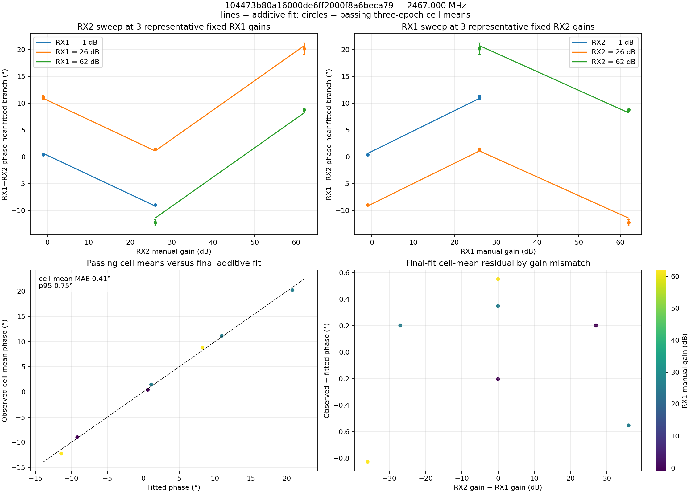

Additional views: [coverage and phase surface](phase_surface_2467000000.png) · [residual heatmap](additive_residual_2467000000.png)

#### 3990.000 MHz

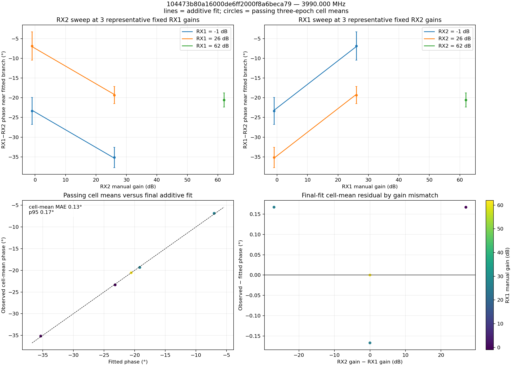

Additional views: [coverage and phase surface](phase_surface_3990000000.png) · [residual heatmap](additive_residual_3990000000.png)

#### 4010.000 MHz

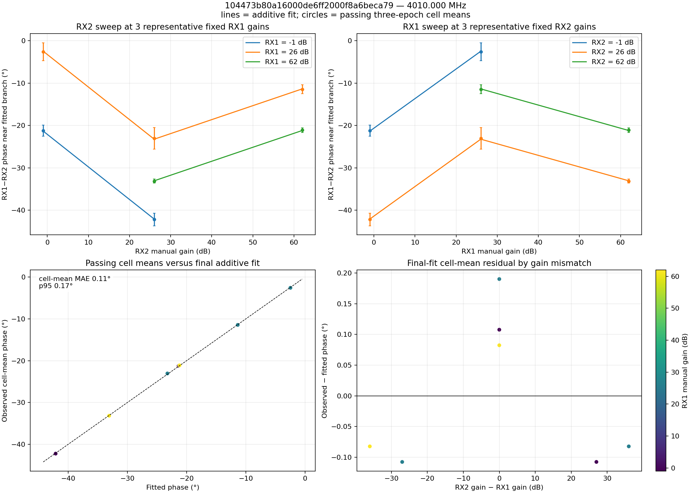

Additional views: [coverage and phase surface](phase_surface_4010000000.png) · [residual heatmap](additive_residual_4010000000.png)

#### 5766.000 MHz

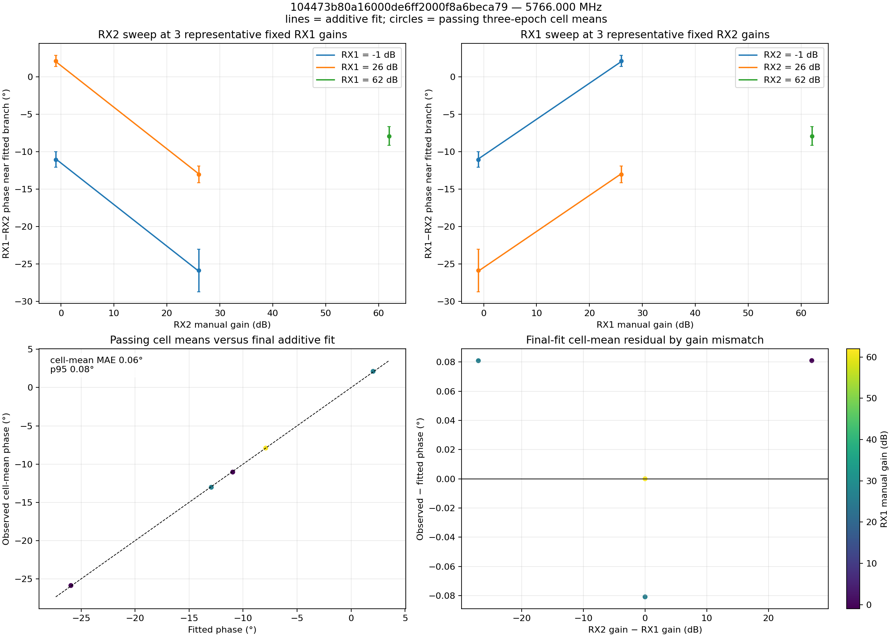

Additional views: [coverage and phase surface](phase_surface_5766000000.png) · [residual heatmap](additive_residual_5766000000.png)

#### 5804.000 MHz

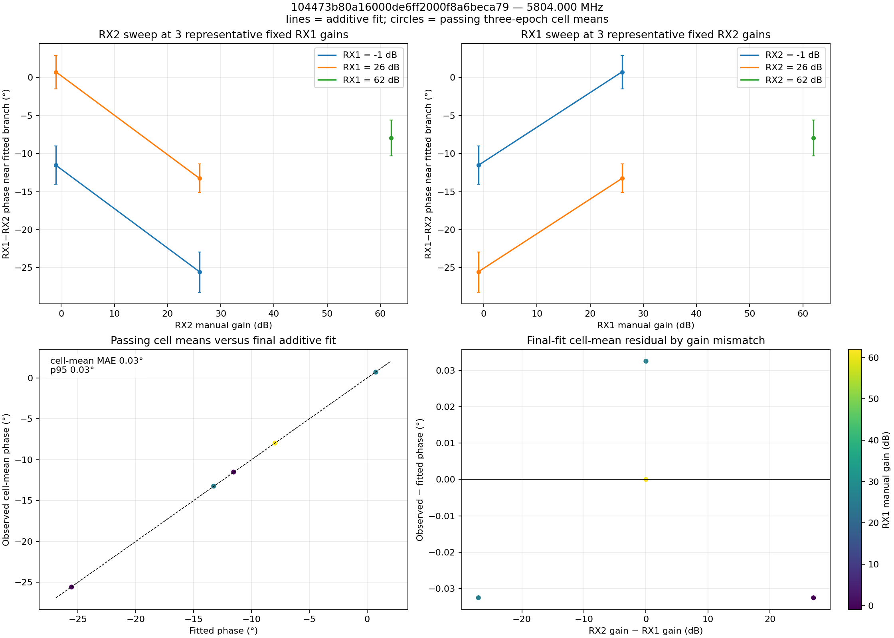

Additional views: [coverage and phase surface](phase_surface_5804000000.png) · [residual heatmap](additive_residual_5804000000.png)

#### 5838.000 MHz

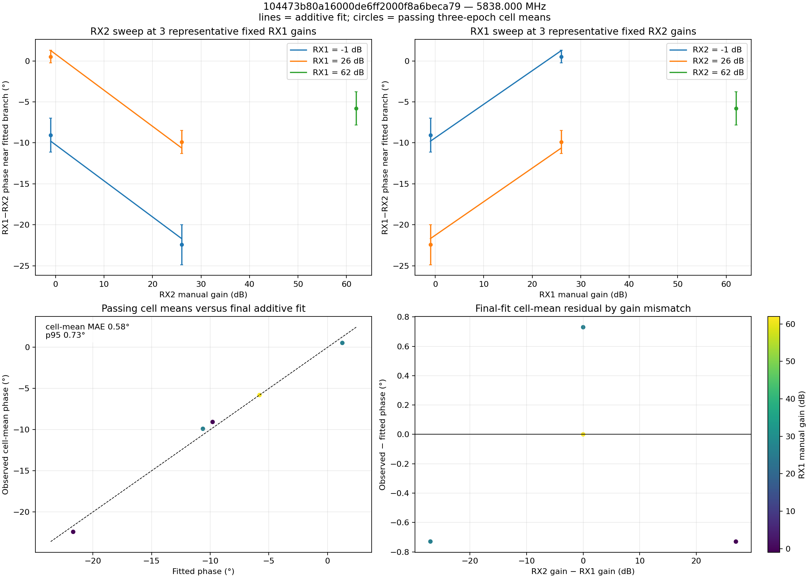

Additional views: [coverage and phase surface](phase_surface_5838000000.png) · [residual heatmap](additive_residual_5838000000.png)

#### 5866.000 MHz

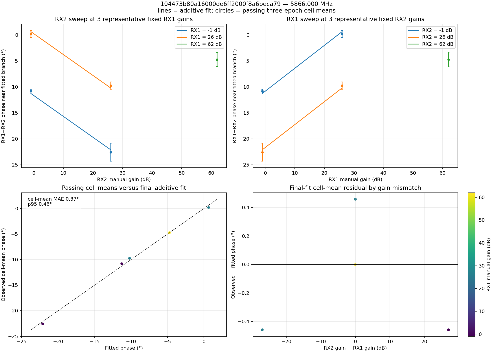

Additional views: [coverage and phase surface](phase_surface_5866000000.png) · [residual heatmap](additive_residual_5866000000.png)

