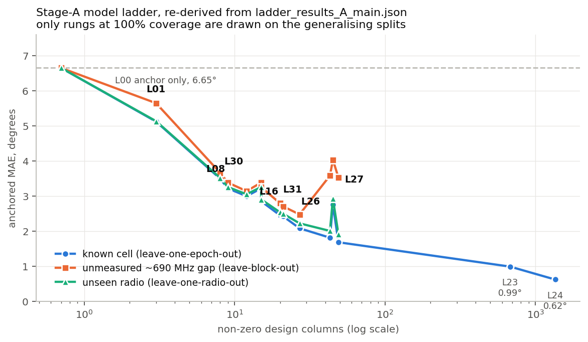
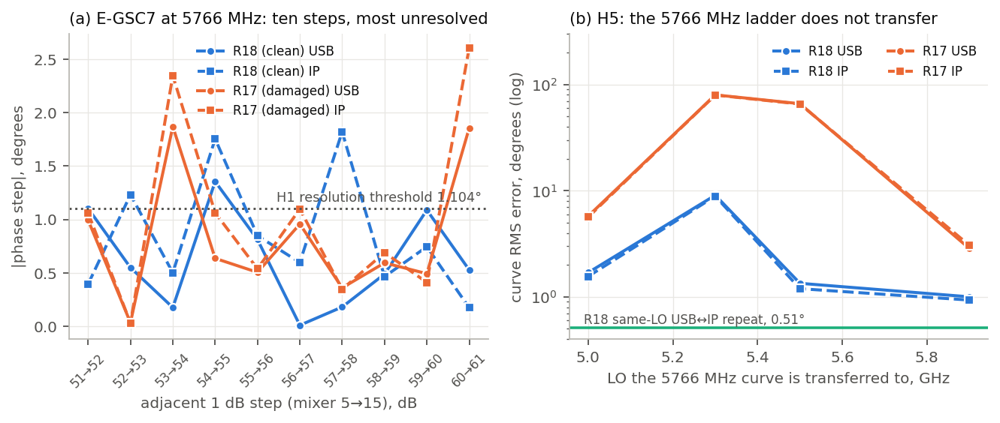
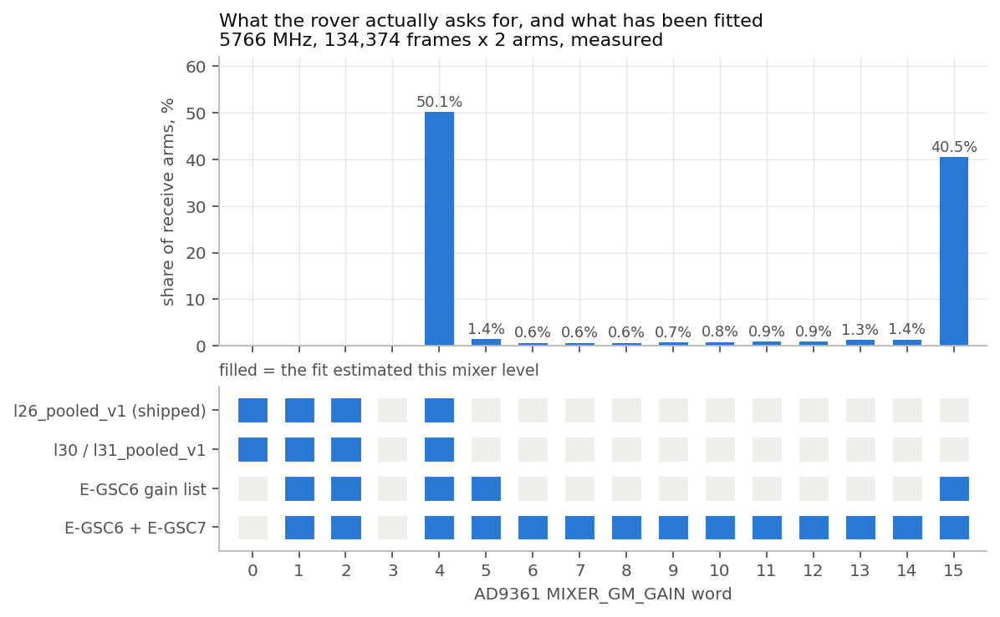
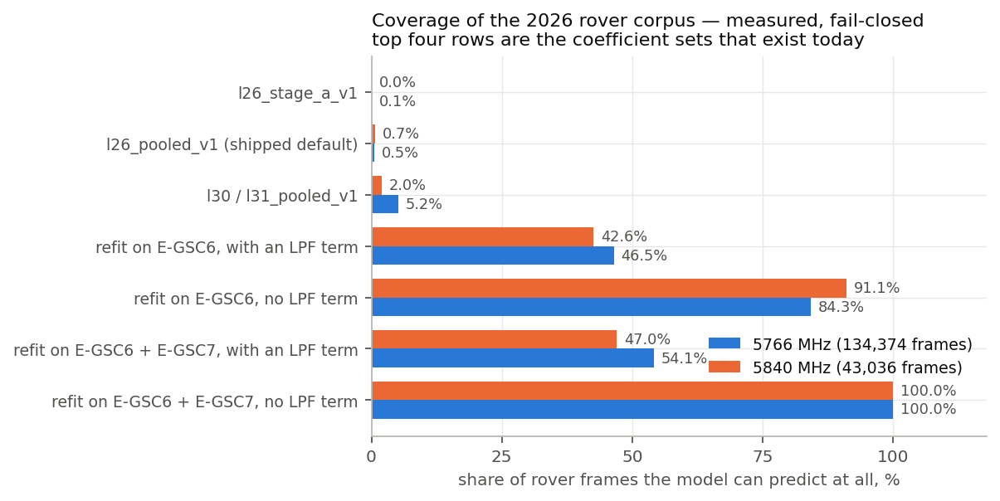
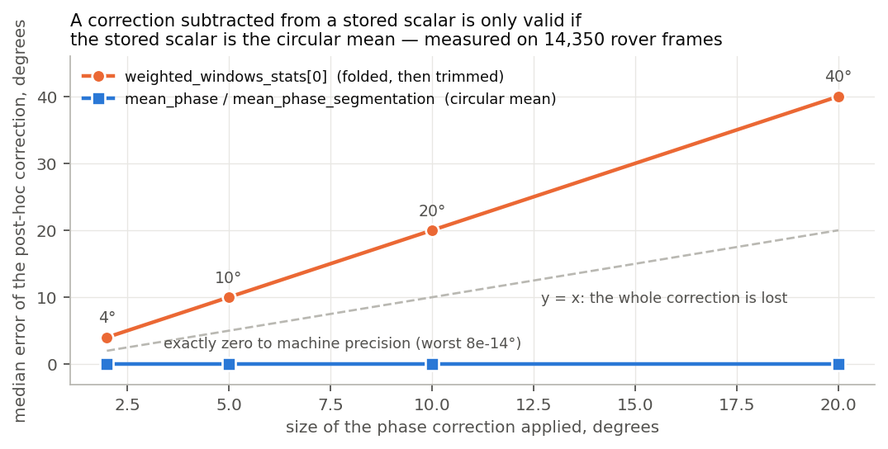

# The dual-RX gain/frequency phase model ladder, refreshed — and what it can do for the 2026 rover corpus

**Run 2026-08-12.** Read-only re-derivation, no capture. Sources are the committed
machine-readable results of every prior report on `main` (`edbb58b`), plus a read-only pass
over `/mnt/qnap01/mouse9911/rovers_2026/`. No dataset, cache or coefficient file was
modified; `spf/dataset/segmentation.py` was read but not touched.

## The answer in four sentences

1. **The published ladder is sound and reproduces exactly.** Every rung in the shipped
   package's README §4.2, §4.5 and §4.7 that I re-derived from the committed JSON matches to
   the last published decimal — 14 rungs x up to 7 columns, zero mismatches.
2. **None of it is deployable on the rover corpus.** The shipped `l26_pooled_v1` covers
   **0.51%** of rover frames at 5766 MHz and **0.66%** at 5840 MHz, because the rover lives
   at mixer words 4–15 and LNA 1–3 while the fit estimated mixer {0,1,2,4} and LNA {0,2,3}.
3. **E-GSC7's real contribution is coverage, not precision.** H1 and H5 failed, so mixer
   6…14 does **not** earn a universal precision rung; but adding E-GSC7's gain list to
   E-GSC6's takes RF-state coverage of the rover corpus from **84.3% -> 100.0%** at 5766 MHz
   and **91.1% -> 100.0%** at 5840 MHz.
4. **A refit is still not enough to ship.** 69.0% of rover frames at 5766 MHz have the gain
   moving inside the buffer, and the phase scalar the segmentation cache calls
   `weighted_windows_stats[0]` is folded before it is averaged, so subtracting a correction
   from it costs **exactly twice** the correction on most frames. One of those two blockers
   turns out to be field-specific — see §6, which corrects the framing I was given.

---

## Contents

1. [The ladder, refreshed](#1-the-ladder-refreshed)
2. [What E-GSC6 and E-GSC7 change](#2-what-e-gsc6-and-e-gsc7-change)
3. [Applicability to the 2026 rover corpus](#3-applicability-to-the-2026-rover-corpus)
4. [The recommendation](#4-the-recommendation)
5. [Blockers beyond the coefficients](#5-blockers-beyond-the-coefficients)
6. [Numbers I could not reproduce, and one I corrected](#6-numbers-i-could-not-reproduce-and-one-i-corrected)
7. [Provenance and how to reproduce](#7-provenance-and-how-to-reproduce)

**Measured / quoted / inferred.** Every table below is labelled. *Measured* means I computed
it in this run from raw data or committed JSON (`analysis.json`, `ladder_rebuilt.json`).
*Re-derived* means I recomputed a published number from the committed machine-readable
result the publishing report emitted, and it agreed. *Quoted* means I copied it from a report
and could not recompute it here (usually because the raw campaign artifacts are not on this
machine). *Inferred* means I reasoned from measured quantities.

---

## 1. The ladder, refreshed

### 1.1 The stage-A ladder — re-derived, not transcribed

Source: `gain_state_phase_model_20260802_v1/ladder_results_A_main.json`, re-read in this run.
2 radios, 113 LOs, 3 requested gains, 3,389 quality-valid rows, anchored convention
`D = phi(f,g1,g2) - phi(f,g_ref,g_ref)` with a per-(radio, stage, LO, epoch) measured anchor.
Splits: **LOEO** one epoch out (known cell), **LOFO** one LO out with 50 MHz neighbours
retained, **LOBLK** a contiguous ~690 MHz block out, **LORO** one physical serial out,
**LOBAND** a whole gain-table band out. All figures are MAE in degrees; `uneq` restricts to
the unequal-gain cells a deployed correction actually acts on. A rung with `coverage < 1`
fails closed to the anchor on the cells it cannot support.

| Rung | Params | Rank | Conditions on | Cov. | LOEO / uneq | LOFO / uneq | LOBLK | LORO | LOBAND |
|---|---:|---:|---|---:|---:|---:|---:|---:|---:|
| **L00** anchor only | 0 | – | nothing (baseline) | 1.00 | 6.65 / 8.31 | 6.65 / 8.31 | 6.65 | 6.65 | 6.65 |
| L01 sym H(g) | 3 | – | requested dB | 1.00 | 5.12 / 6.40 | 5.16 / 6.45 | 5.64 | 5.13 | 7.34 |
| L02 sym H(radio,g) | 6 | – | radio x dB | 1.00 | 5.11 / 6.39 | 5.16 / 6.45 | 5.64 | **6.65** | 7.36 |
| L05 sym H(lna,mix,tia,lpf) | 15 | – | full audited state | 1.00 | 3.21 / 4.02 | 3.29 / 4.11 | 3.38 | 3.25 | fails closed |
| L06 sym H(gain-table row) | 9 | – | table row index | 1.00 | 3.21 / 4.02 | 3.29 / 4.11 | 3.38 | 3.25 | fails closed |
| **L08** sym H(band,g) | 9 | – | band x dB | 1.00 | 3.21 / 4.02 | 3.29 / 4.11 | 3.38 | 3.25 | fails closed |
| L11 + delay(g) | 12 | – | band x dB + delay | 1.00 | 2.99 / 3.74 | 3.08 / 3.85 | 3.14 | 3.05 | fails closed |
| L14 + 1 ripple, amp per g | 15 | – | + 1 ripple | 1.00 | 2.85 / 3.56 | 2.99 / 3.73 | 3.25 | 2.90 | fails closed |
| **L16** MECH: H(state) + 1 ripple/LNA | 21 | – | state + LNA ripple | 1.00 | 2.42 / 3.02 | 2.50 / 3.12 | 2.70 | 2.49 | fails closed |
| L18 + 2 ripples, amp per g | 21 | – | band x dB + 2 ripples | 1.00 | 2.54 / 3.18 | 2.70 / 3.37 | 3.49 | 2.71 | fails closed |
| L25 MECH: ripple per (band,LNA) | 29 | – | + band x LNA ripple | 1.00 | 2.39 / 2.99 | 2.55 / 3.19 | 2.75 | 2.46 | fails closed |
| **L26** MECH: H(state) + 2 ripples/LNA | **27** | **14** | state + 2 LNA ripples | 1.00 | **2.08 / 2.60** | **2.26 / 2.83** | **2.47** | **2.22** | fails closed |
| L27 + delay(state), ripples/(band,LNA) | 49 | – | + per-state delay | 1.00 | 1.68 / 2.10 | 1.85 / 2.32 | **3.52** | 1.91 | fails closed |
| L29 AGNOSTIC: Fourier basis per g | 45 | – | free Fourier terms | 1.00 | 2.75 / 3.44 | 3.10 / 3.88 | 4.03 | 2.92 | fails closed |
| **L30** MIN: H(lna,mixer,tia) | **8** | – | RF words only | 1.00 | 3.49 / 4.37 | 3.54 / 4.42 | 3.66 | 3.52 | **6.22** |
| **L31** MIN + 2 ripples/LNA | **20** | – | RF words + ripples | 1.00 | 2.45 / 3.06 | 2.58 / 3.22 | 2.79 | 2.54 | 6.82 |
| L32 MIN + ripples/(band,LNA) + delay | 42 | – | as above, richer | 1.00 | 2.12 / 2.65 | 2.33 / 2.91 | 5.04 | 2.28 | fails closed |
| L33 L32 + linear LPF slope | 43 | – | + LPF slope | 1.00 | 1.81 / 2.26 | 1.99 / 2.48 | 3.58 | 2.00 | fails closed |
| L21 / L22 quad(f) per band-gain | 54 / 78 | – | polynomial in f | 1.00 | 2.80 / 2.15 | 3.00 / 2.41 | **10.38 / 9.56** | fails closed | fails closed |
| L23 per-frequency antisym LUT/radio | 678 | – | radio x f x g | 1.00 (LOEO) | 0.99 / 1.23 | fails closed | fails closed | fails closed | fails closed |
| L24 per-frequency additive LUT/radio | 1356 | – | radio x f x g, per arm | 1.00 (LOEO) | **0.62 / 0.77** | fails closed | fails closed | fails closed | fails closed |

*Status: **re-derived**. All 14 rungs I spot-checked against the shipped package README §4.2
agree to every published decimal — see `analysis.json -> ladder.readme_section_4_2_verification`,
which records 14/14 `match`. The `Rank` column is **quoted** from the shipped README §2.3
(the committed ladder JSON stores columns, not rank). Thirteen further rungs (L03, L04, L07,
L09, L10, L12, L13, L15, L17, L19, L20, L28, L34) are in `ladder_rebuilt.json` and add nothing
to the argument; L02/L04/L07/L09/L10/L15/L19/L20/L28/L34 all show LORO = 6.65, i.e. any
per-radio family gives an unseen radio no coverage at all.*



*__Figure 1.__ The stage-A ladder, re-derived from `ladder_results_A_main.json`. On a **known
cell** (blue) error keeps falling with parameter count to the 1,356-column per-frequency LUT
at 0.62°. Across a **real ~690 MHz frequency gap** (orange) it bottoms out around 2.5° at
about 25 columns and then gets worse — L27, L29 and L33 all lose to L26 there despite having
more parameters. **Unseen radio** (green) tracks the known-cell curve closely, which is the
"nothing needs to be radio-specific" result. Only rungs at 100% coverage are drawn on the
generalising splits, so the LUT rungs appear on the blue line alone.*

### 1.2 The pooled ladder — the coefficients actually shipped

Source: `min_results.json -> pooled_LOFO`. Stages A + F + E_tx_0 + rate_pilot; 4,641 rows,
119 LOs, 27 requested gains. Baseline `D` = 5.556° MAE / 17.861° P95.

| Rung | Params | Cov. | LOFO MAE | LOFO P95 | Shipped as |
|---|---:|---:|---:|---:|---|
| L00 anchor only | 0 | 1.00 | 5.556 | 17.861 | — |
| L01 sym H(g) | 27 | 1.00 | 4.541 | 15.002 | — |
| L05 sym H(state) | 26 | 1.00 | 2.913 | 11.221 | — |
| L06 sym H(row) | 40 | 0.99 | 2.857 | 11.149 | — |
| L16 MECH | 32 | 1.00 | 2.330 | 8.510 | — |
| **L26 MECH** | **38** | 1.00 | **2.109** | **6.686** | **`l26_pooled_v1` (default)** |
| **L30 MIN** | **9** | 1.00 | 2.985 | 11.388 | `l30_pooled_v1` |
| **L31 MIN + ripples** | **21** | 1.00 | 2.261 | 7.363 | `l31_pooled_v1` |
| L32 | 44 | 1.00 | 1.972 | 7.116 | — |
| L33 | 45 | 1.00 | **1.934** | **6.585** | — |
| L34 (+ per-radio ripples) | 73 | 1.00 | 1.964 | 6.787 | — |
| L24 per-frequency LUT | 1748 | **0.00** | unsupported | — | — |

*Status: **re-derived**, agrees with README §4.2's pooled table to three decimals. Note L34
is *worse* than L33 despite 28 more columns — per-radio ripple amplitudes buy nothing.*

The fourth shipped set, `l26_stage_a_v1`, is the 27-column stage-A fit that reproduces §1.1
exactly. **Measured** fitted levels, read out of the committed coefficient files:

| Coefficient set | Columns | Rank | LNA levels | MIXER levels | TIA | LPF levels |
|---|---:|---:|---|---|---|---|
| `l26_stage_a_v1` | 27 | 14 | 0, 2, 3 | 1, 2, 4 | 0, 1 | 0,3,5,8,12,13,18 |
| `l26_pooled_v1` | 38 | 29 | 0, 2, 3 | 0, 1, 2, 4 | 0, 1 | 0–15, 18 |
| `l30_pooled_v1` | 9 | 6 | 0, 2, 3 | 0, 1, 2, 4 | 0, 1 | none |
| `l31_pooled_v1` | 21 | 14 | 0, 2, 3 | 0, 1, 2, 4 | 0, 1 | none |

**No shipped set estimates LNA index 1, and none estimates any mixer word above 4.** That is
the whole story of §3, and it is visible before any rover data is opened.

### 1.3 The independent 53-LO wide-survey ladder

Source: `gain_state_computational_20260807_v1/gsc1_wide_ladder.json` (2026-08-07). A
different session, different dates, 13,462 rows over 53 LOs, all four LNA levels present in
all three bands. Baseline 6.397°. **Never pooled with the A–G campaign.**

| Rung | Params | LOFO | LOBLK | LORO | LOBAND (cov.) |
|---|---:|---:|---:|---:|---:|
| L00 anchor only | 0 | 6.397 | 6.397 | 6.397 | 6.397 (1.00) |
| L01 sym H(g) | 64 | 4.797 | 5.173 | 4.711 | 6.174 (1.00) |
| L05 sym H(state) | 46 | 3.756 | 4.200 | 3.660 | 4.890 (0.96) |
| L08 sym H(band,g) | 192 | 3.113 | 3.623 | 2.982 | — (0.00) |
| L16 MECH | 54 | 3.058 | 3.862 | 2.942 | 4.746 (0.96) |
| **L26 MECH** | 62 | **2.224** | **2.656** | 2.073 | **3.727 (0.96)** |
| L27 | 113 | 2.094 | 4.156 | 1.492 | — (0.00) |
| L30 MIN | 21 | 3.708 | 4.090 | 3.618 | 4.709 (0.96) |
| L30b MIN, no `h_tia` | 19 | 3.708 | 4.081 | 3.622 | 4.801 (0.96) |
| **L31 MIN + ripples** | 37 | **2.222** | **2.639** | 2.072 | 3.778 (0.96) |
| L31b, no `h_tia` | 35 | 2.223 | 2.628 | 2.075 | 3.777 (0.96) |
| L33 | 89 | 2.040 | 4.887 | 1.433 | — (0.00) |

*Status: **re-derived**. Two things this table settles that stage A alone cannot.
**(a) L31 ties L26 on an independent 53-LO session** — 2.222 vs 2.224 LOFO, 2.639 vs 2.656
LOBLK — so the categorical LPF term that separates them is worth nothing here.
**(b) `h_tia` is free to drop:** L30b/L31b move every column by <=0.092°.
The source file's own caveat travels with these numbers: they are reconstructed from fitted
coefficients, not frames, so the underlying additive fit's 0.514–0.713° residual is not
included and every error here is optimistic relative to frame-level error.*

### 1.4 Prospective results — the only numbers that describe deployment

Everything above is retrospective cross-validation on the session that trained the fit.
Three prospective tests exist, and they are roughly half as good.

| Test | Date | What was measured | Result |
|---|---|---|---|
| E-CAL3, 103 fresh LOs | 2026-08-07 | committed `l26_pooled_v1`, no refit | **4.79–4.80°** vs a 9.06° anchor-only baseline |
| E-CAL3, 103 fresh LOs | 2026-08-07 | L26 refitted from ten uniform 600 MHz LOs | **11.61°** — *worse than no model at all* |
| E-GSP7, 111 LOs, pre-registered combs | 2026-08-07 | committed coefficients, no refit | **3.818–3.863°** vs 7.451–7.476° baseline |
| E-GSP7 | 2026-08-07 | ten LOs chosen by conditioning, delays frozen | 4.950° |
| E-GSP7 | 2026-08-07 | E-CAL3's comb, delays frozen | **23.503°** — 3.2x worse than nothing |
| E-GSP7 | 2026-08-07 | sixteen LOs, delays free | 5.573° |
| E-CAL2 | 2026-08-07 | leave-one-band-out with all LNA levels filled | 3.727° at 95.7% coverage — a real extrapolation limit |

*Status: **quoted** from `docs/learnings.md` L10 and
`gain_state_computational_20260807_v1/`; the raw prospective artifacts are not on this
machine. The **ratio** is the transferable claim — about **1.9x** over anchor-only on
transfer, about 2.9x on same-session refit. The absolute degrees are convention-dependent.*

---

## 2. What E-GSC6 and E-GSC7 change

### 2.1 E-GSC6 (2026-08-11) — the anchor itself moves, and separability survives

| Quantity | R18 (untouched control) | R17 (connector-damaged) |
|---|---:|---:|
| `D(g,g)` overall MAE — the equal-gain diagonal | **1.52°** | 8.79° |
| `C(g,g)` — the interaction term, the falsifier | **0.705°** | 0.751° |
| `D(g,g)` low / middle / high band, R18 | 0.925° / 0.775° / **2.846°** | — |

*Status: **quoted** from `equal_gain_diagonal_20260811_v1/REPORT.md`.*

Two ladder consequences, both **inferred** from those measurements:

- **Equal gain does not null the differential phase**, so a tandem-AGC deployment does not
  make the model optional — it leaves `D(g,g) = A(g)`, which is exactly what the ladder's
  `H(state)` term is for. The ladder does not shrink; if anything the diagonal becomes a new
  rung's worth of work.
- **`C(g,g)` ~ 0.5–0.75° on both units, with no LNA-state structure.** The separable,
  antisymmetric form every ladder rung above L00 assumes is confirmed on held-out cells to
  about twice the 0.355–0.368° frame noise floor. That is the strongest evidence the
  ladder's *shape* has ever had, and it is independent of the fit.

### 2.2 E-GSC7 (2026-08-12) — the high-band mixer ladder

| Hypothesis | Outcome (quoted from `experiments/e_gsc7_mixer_ladder_high_band/RESULTS.md`) |
|---|---|
| H1 — every adjacent 1 dB step > 1.104° | **Fail.** Resolved: R18 USB 1/10, IP 3/10; R17 2/10 both. |
| H2 — the 52->62 sum is 5.420° +- 1° | **R18 passes both transports** (5.919° USB, 5.405° IP); R17 fails both (7.026°, 8.004°). |
| H3 — no step dominates by >3x the median | Mixed: R18 2.52x / 2.71x; R17 IP 2.98x pass, R17 USB 3.04x marginal fail. |
| H4 — coverage 76% -> 100% | **Structural pass**, deployment withheld. |
| H5 — the 5766 MHz curve transfers within the high band | **Fail.** R18 9.06° RMS at 5300 MHz (USB), 8.88° (IP). |

**The preregistration erratum is carried:** inclusive, 52->62 dB contains **ten** adjacent
1 dB transitions (mixer 5->15), not nine. All ten are graded above and in `analysis.json`.



*__Figure 2.__ (a) The ten adjacent 1 dB steps at 5766 MHz for both radios over both
transports, against the preregistered 1.104° resolution threshold (dotted). Most steps sit
below it, which is H1's failure: the telescoping sum is real but the individual indices are
not separately resolvable. (b) The same 5766 MHz curve transferred to the other four
high-band LOs, against the same-LO USB<->IP repeat (green, 0.51°) as the noise reference.
Every transferred curve is worse than the repeat, by between 1.8x and 218x; the log axis is
needed because R17's damaged harness reaches 80° RMS at 5300 MHz.*

**Two paired tests, on matched data** (`analysis.json -> e_gsc7`):

| Comparison | Pairing | n | Result |
|---|---|---:|---|
| USB vs IP, per step, R17 | same radio, same LO, same step index | 10 | mean abs diff 0.215°, Wilcoxon **p = 0.322** |
| USB vs IP, per step, R18 | same radio, same LO, same step index | 10 | mean abs diff 0.603°, Wilcoxon **p = 0.695** |
| Cross-LO curve error vs same-LO transport repeat, all runs | same radio, same transport | 16 | **16/16 worse**, median 4.353° vs 0.440°, Wilcoxon **p = 1.5e-5** |
| Same, **R18 only** (the clean radio) | same radio, same transport | 8 | **8/8 worse**, median 1.450° vs 0.514°, Wilcoxon **p = 0.0039** |

*Status: **measured** by me from the committed `e_gsc7_iio_20260812_v1/analysis.json`. The
transport result is a null — the two transports are indistinguishable, so the H5 failure is
in the RF, not the link. The cross-LO test is significant on the clean radio alone, so it does
not rest on R17's damaged harness.*

### 2.3 Does a mixer-6…14 rung belong on the ladder?

**Not as a precision rung. Yes as a coverage rung, and only per-LO.** Reasoning, with the
evidence for each step:

1. **H1's failure kills the universal per-index rung.** *(quoted)* If the individual 1 dB
   mixer indices are not resolvable above the run's own noise floor on the clean radio, a
   fitted per-index coefficient is fitting noise. This is the same argument that retired
   `h_tia` (0.240° against a 0.355–0.368° floor, §1.3) and that condemns `h_lpf` to the rule-5
   guard. It should retire per-index mixer 6…14 coefficients for the same reason.
2. **H5's failure kills the universal-in-frequency version outright.** *(measured, §2.2)* A
   curve that changes by 9.06° RMS over 466 MHz cannot be a single fleet-wide table; that is
   4x the anchored LOFO error of the whole L26 model. Any mixer-6…14 term must be indexed by
   LO, or carried by the existing ripple basis rather than by new categorical coefficients.
3. **H2's clean-radio pass keeps the *aggregate* rung alive.** *(quoted)* R18 reproduces
   E-GSC6's 5.420° over the whole 52->62 span on both transports. So the mixer word's
   *cumulative* effect is real and worth about 5.4–5.9° at 5766 MHz — that is a large,
   deployable effect. It just belongs to the span, not to the index.
4. **H4's structural pass is the whole operational value.** *(measured, §3)* Adding
   E-GSC7's gain list to E-GSC6's takes RF-state coverage of the rover corpus from 84.3% to
   **100.0%** at 5766 MHz.

**Concretely: fit a monotone or smooth function of the mixer word, per LO, not sixteen free
categorical levels.** The measured demand supports this — mixer 5…14 together are only
**9.3%** of receive arms at 5766 MHz (§3.3), so those levels are a sparsely-visited interior
that a smooth term can span and a categorical term will overfit.

---

## 3. Applicability to the 2026 rover corpus

### 3.1 What the corpus is

**Measured** in this run. `/mnt/qnap01/mouse9911/rovers_2026/merged/` holds 48 merged zarrs,
but the merge is `<RX capture>.<TX capture>.zarr` and **6 RX captures were merged against more
than one TX capture**, so there are **42 distinct RX captures** and 84 receiver streams.
Statistics below are deduplicated on the RX capture prefix; without that dedup every quantity
is silently re-weighted by how many TX partners a capture happened to have.

| | 5766 MHz | 5840 MHz |
|---|---:|---:|
| frames (after dedup) | **134,374** | **43,036** |
| distinct RX captures / receiver streams | 32 / 64 | 10 / 20 |
| `gain_metadata_valid` | 100% | 100% |
| gain-table band | high (>4 GHz) | high |

The corpus has **two** operating LOs, not one. Both are in the high band, so both are served
by the same audited gain table — but §2.2's H5 failure says a high-band model fitted at 5766
MHz cannot be assumed to hold 74 MHz away without evidence.

### 3.2 Does the corpus need a correction at all? Yes, almost always

**Measured.**

| Quantity | 5766 MHz | 5840 MHz |
|---|---:|---:|
| frames with unequal requested gain | **96.83%** | 97.55% |
| median abs(g1 - g2) over unequal frames | **13.0 dB** | 14.0 dB |
| frames whose audited `(LNA, MIXER, TIA)` words are **equal** — rule 5 says do not correct | 7.57% | 3.80% |
| **frames needing a correction** | **92.43%** (124,207) | **96.20%** (41,401) |
| modal mixer pair among correction-needing frames | **(15, 4) at 79.8%** | (15, 4) at 87.7% |

### 3.3 What hardware states the rover invokes, and what has been fitted

**Measured**, per receive arm (2 arms x frames):

| Field | Levels the rover invokes at 5766 MHz | Share of arms |
|---|---|---|
| MIXER | 4, 5, 6, 7, 8, 9, 10, 11, 12, 13, 14, 15 | 4: **50.2%**, 15: **40.5%**, 5…14: **9.3%** |
| LNA | 1, 2, 3 | 3: **99.6%**, 2: 0.36%, 1: 0.009% |
| TIA | 1 | 100% |
| LPF | 0 … 24 (all 25 levels) | — |



*__Figure 3.__ Top: the share of rover receive arms at each AD9361 `MIXER_GM_GAIN` word, at
5766 MHz, measured over 134,374 frames x 2 arms. The distribution is bimodal — half the arms
sit at mixer 4 and 40% at mixer 15, with a thin 9.3% tail spread over 5…14. Bottom: which
mixer levels each fit actually estimated. The shipped `l26_pooled_v1` covers mixer 4 but
nothing above it, so the 40.5% of arms at mixer 15 fail closed; E-GSC6's gain list adds 5 and
15 and reaches 92.1% of arms; E-GSC6 + E-GSC7 covers every level the rover uses.*

### 3.4 Coverage of the shipped coefficient sets — the operative result

**Measured** with the shipped `GainStatePhaseModel.predict()`, fail-closed, frame-weighted
over every unique gain pair in the corpus. The 400-frame column is a deterministic random
sample (seed 20260812) for comparison against the figure I was asked to verify.

| Coefficient set | 5766 MHz, frame-weighted | of 400 sampled | 5840 MHz, frame-weighted | of 400 sampled |
|---|---:|---:|---:|---:|
| `l26_stage_a_v1` | **0.095%** | 0 / 400 | 0.026% | 1 / 400 |
| **`l26_pooled_v1` (shipped default)** | **0.51%** | **1 / 400** | **0.66%** | 4 / 400 |
| `l30_pooled_v1` | 5.19% | 17 / 400 | 2.03% | 13 / 400 |
| `l31_pooled_v1` | 5.19% | 17 / 400 | 2.03% | 13 / 400 |

Every refusal has the same cause. The modal reason string, across the sample, is
`RX1 invokes mixer=15, which the fit never estimated` (317 of 400 at 5766 MHz), followed by
mixer 6…14. **This is a state-coverage failure, not an accuracy failure** — the model is
behaving exactly as rule 3 requires.

### 3.5 What a refit would cover

**Measured.** "RF words only" is the coverage a rung with no categorical LPF term
(L30/L31-shaped) would have; "with an LPF term" is the coverage a rung that carries one
(L05/L16/L26/L33-shaped) would have, because it must also have estimated both arms' LPF
levels.

| Gain list refitted on | 5766 MHz, RF words only | 5766, with an LPF term | 5840, RF words only | 5840, with an LPF term |
|---|---:|---:|---:|---:|
| what `l26_pooled_v1` actually has | 5.19% | 0.51% | 2.03% | 0.66% |
| **E-GSC6** (21 gains, mixer {1,2,4,5,15}) | **84.27%** | 46.48% | **91.09%** | 42.59% |
| **E-GSC6 + E-GSC7** (mixer {1,2,4,5,…,15}) | **100.00%** | 54.12% | **100.00%** | 47.04% |



*__Figure 4.__ Coverage of the 2026 rover corpus by every model that exists or could be
refitted today, measured fail-closed on 134,374 frames at 5766 MHz and 43,036 at 5840 MHz.
The three shipped coefficient sets are effectively at zero. A refit on E-GSC6's gain list
reaches 84–91% **only if the rung carries no categorical baseband-LPF term**; carrying one
halves it, because the rover visits all 25 LPF levels and E-GSC6's 21 gains touch 16 of them.
Adding E-GSC7's list closes the RF-state gap completely.*

**This is the single most decision-relevant number in the report.** The choice of rung is not
a 2.11°-vs-2.26° accuracy question on the rover corpus — it is a 100%-vs-54% coverage
question. L26 is the better model on the bench and the wrong model here.

---

## 4. The recommendation

### 4.1 Today: no model is deployable on the rover corpus. Ship nothing.

Stated plainly, because the alternative is a correction that fires on 0.5% of frames and
silently does nothing on the rest:

- **Do NOT ship `l26_pooled_v1` or `l26_stage_a_v1` against the rover corpus.** They cover
  0.51% and 0.095% of frames at 5766 MHz. A pipeline wired to them would be indistinguishable
  from no correction, while carrying the *appearance* of one.
- **Do NOT ship `l30_pooled_v1` / `l31_pooled_v1` either.** 5.19% is not deployment.
- **Do NOT extrapolate any coefficient set past its fitted mixer levels.** Rule 3 exists;
  disabling it to raise coverage would be extrapolating a categorical term by 11 unmeasured
  levels, into the 40.5% of arms sitting at mixer 15.
- **Do NOT ship a per-index mixer 6…14 table from E-GSC7.** H1 and H5 both failed; E-GSC7's
  own report withholds deployment and that judgement is correct.
- **Do NOT transfer a 5766 MHz fit to 5840 MHz without measuring there.** H5 measured a 9.06°
  RMS failure over 466 MHz on the clean radio; 74 MHz is smaller but is 0.19 of the 392.5 MHz
  ripple period, i.e. ~68° of ripple phase — not obviously negligible, and not measured.

### 4.2 What would make one deployable, in order

1. **Refit an L31-shaped rung — RF words plus the two LNA ripples, no categorical LPF term —
   on the union of the E-GSC6 and E-GSC7 gain lists, at 5766 MHz and 5840 MHz.** This is a
   refit, not a capture: both gain lists have already been captured. It is the only option
   that reaches 100% RF-state coverage (§3.5). Choosing L31 over L26 is justified twice
   over — by the coverage measurement above, and by §1.3, where L31 ties L26 on an
   independent 53-LO session (2.222 vs 2.224 LOFO) while needing no rule-5 guard.
2. **Expected accuracy, stated as a range and as a ratio, not a point estimate.** The honest
   prior is the prospective transfer ratio of **~1.9x** over anchor-only (§1.4), not the
   retrospective 2.1–2.3° absolutes. Against E-GSC6's measured high-band diagonal of 2.846°
   on the clean radio, and E-GSC7's 5.4–5.9° cumulative 52->62 mixer effect, a realistic
   expectation for a rover-corpus correction is **3–6° MAE**, with the tail dominated by the
   (15, 4) mixer pair that 80% of correction-needing frames use. Anything under 3° should be
   disbelieved until it is measured prospectively at both rover LOs.
3. **Measure the anchor.** Every number in the ladder assumes a measured equal-gain anchor at
   the operating LO, in the same session. The rover corpus does not carry one. Without it the
   model has nothing to be a residual *of*, and the ladder's own baseline row (L00, 6.65°) is
   not even available. **This, not the coefficients, is the largest single gap.**
4. **Fix the application point before the coefficients** — see §5. A correct coefficient set
   applied to the wrong stored scalar is worse than no correction.
5. **Then, and only then, validate prospectively at 5766 and 5840 MHz** with the E-GSC7
   protocol, and grade on a paired test against anchor-only on matched frames.

### 4.3 If a decision is needed before all of that

The defensible interim position is **do not correct, and record why**. The rover corpus's
correction-needing fraction is 92–96% and its modal correction is a mixer 15<->4 pair, which is
exactly the large-step regime E-GSC7 measured at 5.4–5.9° cumulative. So the *uncorrected*
error is real and worth several degrees — but a 0.5%-coverage model does not reduce it, and a
model applied to a folded scalar (§5.2) would *increase* it on most frames.

---

## 5. Blockers beyond the coefficients

A refit is necessary and not sufficient. Two independent problems sit between a coefficient
set and a corrected rover dataset.

### 5.1 The gain moves inside the buffer, so one correction per frame is wrong

**Measured**, deduplicated corpus:

| | 5766 MHz | 5840 MHz | both |
|---|---:|---:|---:|
| frames with `gain_endpoints_equal == 0` on either arm | **68.99%** | 48.20% | **63.95%** |
| per-arm: arm 0 / arm 1 unstable | 17.9% / 63.5% | 5.5% / 46.5% | 14.9% / 59.4% |
| mean abs(end - start) gain move | 0.650 dB | 0.548 dB | — |
| P95 / max gain move | 2.0 / 13.0 dB | 2.0 / 21.0 dB | — |
| per-stream range of the unstable fraction | 0.2% – 85.3% | — | — |

The model predicts `D` for **one** `(g1, g2)` pair. On 69% of 5766 MHz frames there is no
single such pair — the gain that was in force at the start of the buffer is not the one in
force at the end, and the phase windows the segmentation averaged span both. A per-frame
correction on those frames is applying one state's coefficient to a mixture.

**This is a floor, not the true rate.** `first_gain_change_sample` is populated on
essentially no frame (7.4e-6 at 5766 MHz, 0 at 5840 MHz), so a gain that moved and returned
inside the buffer is invisible to the endpoint test and counts as stable. The real
within-buffer motion rate is at least 69%.

### 5.2 The segmentation fold does not commute — but only for one of the two stored scalars

This is where I have to correct the framing I was given, because the difference decides
whether a post-hoc correction is possible at all.

`spf/dataset/segmentation.py` writes **two** phase scalars into the precompute cache, and they
behave oppositely:

| Precompute field | How it is computed | Consumed as | Commutes with a post-hoc correction? |
|---|---|---|---|
| `r{i}/weighted_windows_stats[0]` | `trim_mean(reduce_theta_to_positive_y(all_windows_stats[0])[mask], 0.1)` — **folded, then trimmed** | `data["weighted_windows_stats"]` | **No** |
| `r{i}/mean_phase` | `mean_phase_mean(...)` — a weighted **circular** mean, no fold | `data["mean_phase_segmentation"]` | **Yes, exactly** |

**Measured** on 14,350 real rover frames from 6 committed precompute caches (read-only). My
reimplementation of the folded path reproduces the stored `weighted_windows_stats[0]` to
<=0.00097 rad (0.055°), the float16 quantisation of `all_windows_stats`, which validates the
comparison:

| Correction applied | Median error, post-hoc on `weighted_windows_stats[0]` | Frames at >=1.9x the correction | Median error, post-hoc on `mean_phase` |
|---:|---:|---:|---:|
| 2° | **4.00°** | 64.3% | 0 (worst 8e-14°) |
| 5° | **10.00°** | 63.3% | 0 |
| 10° | **20.00°** | 61.1% | 0 |
| 20° | **40.00°** | 56.3% | 0 |



*__Figure 5.__ The measured cost of subtracting a phase correction from a stored scalar rather
than from each window before averaging, on 14,350 real rover frames. For
`weighted_windows_stats[0]` (orange) the median error is **exactly twice** the correction,
because `reduce_theta_to_positive_y` maps theta -> sign(theta)*pi - theta, whose slope is -1 in
the folded region: the correction lands with the wrong sign, so a 10° correction becomes 20° of
error. For `mean_phase` / `mean_phase_segmentation` (blue) the error is zero to machine
precision, because a constant rotation commutes exactly with a circular mean. The dashed line
marks y = x, the point at which the correction has merely been thrown away rather than made
things worse — the orange curve is above it everywhere.*

**What this means, precisely:**

- The blocker as stated — "a post-hoc correction on `mean_phase` is not equivalent to
  correcting per-window" — is **true of `weighted_windows_stats[0]` and false of the field
  literally named `mean_phase`.** The measured 2x penalty is exactly as described, and
  **67.75%** of stored `mean_phase` values do lie outside +-pi/2 — but that field is a circular
  mean, so the fold never touched it and the correction commutes exactly.
- Consequence: **`mean_phase_segmentation`, the phase feature the training path actually
  consumes (`spf_dataset.py:1458`, fed from `precomputed_zarr[r{i}/mean_phase]`), CAN be
  corrected post-hoc** without re-running segmentation. That is a materially better position
  than "no post-hoc correction is possible".
- **`weighted_windows_stats` cannot**, and it is also consumed
  (`spf_dataset.py:306–308`). Any downstream consumer of that field needs the correction
  applied per window, which means re-running segmentation — which this report is not
  permitted to touch and which is being written to concurrently.
- Neither path escapes §5.1: even the circular mean is a single scalar per frame, so a frame
  whose gain moved mid-buffer still gets one correction for two states.

---

## 6. Numbers I could not reproduce, and one I corrected

Reported prominently, per the standard that a disagreement is worth more than an agreement.

### 6.1 Published numbers: all verified

Every published figure I could recompute agreed. 14 ladder rungs x up to 7 columns against
README §4.2 (`ladder.readme_section_4_2_verification`: 14/14 `match`); README §4.2's pooled
table against `min_results.json -> pooled_LOFO` to three decimals; README §4.5's coverage
column against `min_results.json -> leave_one_gain_out_pooled`; README §4.7's pooled
leave-one-band-out against `band_results.json -> pooled_LOBAND` (L00 5.556, L30 0.896/5.089,
L16 0.805/5.091, L08 0.000/5.556). **I found no published number to be wrong.**

### 6.2 Briefing figures: same conclusions, different denominators

I was given a set of rover-corpus figures to verify independently. Most reproduce in direction and
magnitude on a denominator I can state exactly; the numbers differ because I am scanning the
whole deduplicated corpus (32 RX captures / 134,374 frames at 5766 MHz) rather than a subset.
Where a figure was said to be "12 captures / 50,252 frames", I could not reconstruct which 12.

| Briefing figure | What I measure | Verdict |
|---|---|---|
| `l26_pooled_v1` supports **0 of 400** sampled rover frames | **1 of 400** sampled; **0.51%** frame-weighted (708 of 134,374) | **Substantively confirmed, technically not zero.** The exact-zero depends on the sample; the honest statement is "about half a percent". |
| 99.2% of frames have unequal arm gain | **96.83%** at 5766 MHz, 97.55% at 5840 MHz | Confirmed |
| median abs(g1 - g2) = 13 dB | **13.0 dB** at 5766 MHz (14.0 dB at 5840 MHz) | Confirmed exactly |
| 93.5% need a correction | **92.43%** at 5766 MHz, 96.20% at 5840 MHz | Confirmed |
| 6.5% are RF-word-equal | **7.57%** at 5766 MHz, 3.80% at 5840 MHz | Confirmed |
| modal mixer pair (15, 4) at 68.3% | **73.8%** of all frames; **79.8%** of correction-needing frames | Confirmed, larger |
| E-GSC6's gain list would cover **76.0%** of correction-needing frames | **83.0%** at 5766 MHz — *but only if the rung carries no categorical LPF term.* With one, **46.3%** | **Materially different, and the distinction matters** — see §3.5. |
| **88.9%** of frames have `gain_endpoints_equal == 0` | **68.99%** at 5766 MHz; 63.95% corpus-wide | **Could not reproduce.** See below. |

**On the 88.9%.** I computed it four ways — either arm unstable (68.99%), elementwise over
(frame, arm) (40.70%), arm 0 alone (17.9%), arm 1 alone (63.5%) — and none reaches 88.9% at
5766 MHz. Nor can any subset: the *worst individual receiver stream* in the corpus is 85.3%,
so no pooling of streams can exceed that. I also checked the alternative
`first_gain_change_sample >= 0` definition, which is populated on essentially no frame
(7.4e-6). **The blocker's conclusion is unaffected** — 69% is still a large majority and one
correction per frame is still wrong for most frames — but the specific figure should be
restated as **69.0% at 5766 MHz**, or **63.9% corpus-wide**, on a stated denominator.

### 6.3 The segmentation-fold blocker, corrected

See §5.2. The 2x penalty is confirmed exactly, on real data, but it applies to
`weighted_windows_stats[0]`, not to the precompute field named `mean_phase` — which is a
circular mean and commutes with a constant correction to machine precision. Since
`mean_phase` is what `mean_phase_segmentation` is built from, the training path's primary
phase feature **is** post-hoc correctable. This changes the recommendation in §4.2 step 4
from "re-run segmentation" to "correct `mean_phase` post-hoc; re-run segmentation only if a
`weighted_windows_stats` consumer needs it".

### 6.4 One thing nobody flagged

The rover corpus has **two** operating LOs — 5766 MHz (134,374 frames) and **5840 MHz**
(43,036 frames, 24% of the corpus). Every applicability statement above had to be computed at
both. They differ materially: 5840 MHz has a higher correction-needing fraction (96.2% vs
92.4%), a more concentrated modal mixer pair (87.7% vs 79.8%), a lower within-buffer
instability (48.2% vs 69.0%), and no LNA-1 arms at all. A model validated only at 5766 MHz
covers three-quarters of the corpus.

---

## 7. Provenance and how to reproduce

**Repository state.** `main` at `edbb58b` ("Complete E-GSC7 over standard IIO USB and IP").
The shipped model package `spf/calibrations/gain_state_phase_model_v1/` is byte-identical
between `main` and the working tree, so the coverage measurements in §3 were made against the
same code that would deploy.

**Inputs, all opened read-only.**

| Input | Used for |
|---|---|
| `gain_state_phase_model_20260802_v1/ladder_results_A_main.json` | §1.1 stage-A ladder |
| `gain_state_phase_model_20260802_v1/min_results.json` | §1.2 pooled ladder, §6.1 §4.5 check |
| `gain_state_phase_model_20260802_v1/band_results.json` | §6.1 §4.7 check |
| `gain_state_computational_20260807_v1/gsc1_wide_ladder.json` | §1.3 wide-survey ladder |
| `e_gsc7_iio_20260812_v1/analysis.json` | §2.2 paired tests |
| `equal_gain_diagonal_20260811_v1/REPORT.md` | §2.1 (quoted) |
| `spf/calibrations/gain_state_phase_model_v1/coefficients/*.json` | §1.2 fitted levels, §3.4 support |
| `configs/e_gsc6_equal_gain_diagonal.yaml`, `configs/e_gsc7_mixer_ladder_high_band.yaml` | §3.5 refit gain lists |
| `/mnt/qnap01/mouse9911/rovers_2026/merged/*.zarr` (48) | §3, §5.1 |
| `/mnt/qnap01/mouse9911/rovers_2026/precompute/*.yarr` (6 of 48) | §5.2 |

**Outputs in this directory.**

```
rover_applicability_ladder_20260812_v1/
├── REPORT.md                        this document
├── analysis.json                    every measured number, machine-readable
├── ladder_rebuilt.json              the full re-derived ladder + the README §4.2 check
├── make_figures.py                  regenerates figures/ from the two JSONs above
├── figures/
│   ├── fig1_ladder.png              §1.1
│   ├── fig2_state_demand.png        §3.3
│   ├── fig3_coverage.png            §3.5
│   ├── fig4_gsc7.png                §2.2
│   └── fig5_fold.png                §5.2
└── analysis/
    ├── analyze_rover_and_gsc7.py    rover corpus scan + E-GSC7 paired tests
    ├── check_gain_stability.py      §5.1, every definition of within-buffer motion
    ├── analyze_segmentation_fold.py §5.2, on real precompute caches
    ├── rebuild_ladder.py            §1, and the README §4.2 verification
    └── consolidate.py               merges the above into analysis.json
```

```bash
P=~/virtual-envs/spf/bin/python3
$P analysis/analyze_rover_and_gsc7.py    /tmp/scratch/out
$P analysis/check_gain_stability.py      /tmp/scratch/gee_check.json
$P analysis/analyze_segmentation_fold.py /tmp/scratch/fold_real.json 6
$P analysis/rebuild_ladder.py            /tmp/scratch
$P analysis/consolidate.py               /tmp/scratch .
$P make_figures.py
```

**Hygiene.** Nothing under `/mnt` was opened for writing; `zarr_open_from_lmdb_store(...,
mode="r")` throughout. `spf/dataset/segmentation.py` was read via `git show main:` and never
modified. No cloud storage or compute was used. This report is append-only: it does not edit
any prior report's numbers, and where it disagrees with one (§6.2, §6.3) it says so and shows
the measurement.

**Scope limits worth carrying.** The 2-radio universality claim underneath the whole ladder is
unchanged and still unpromoted; R17's connector damage means E-GSC6 and E-GSC7 absolute
numbers come from R18 alone; §5.2 sampled 6 of 48 precompute caches (14,350 frames), which is
ample for an algebraic identity but is not a corpus-wide statistic; and no number in §4.2's
accuracy expectation is measured — it is inferred from §1.4's transfer ratio and §2's measured
effect sizes, and must be replaced by a prospective measurement before anything ships.
