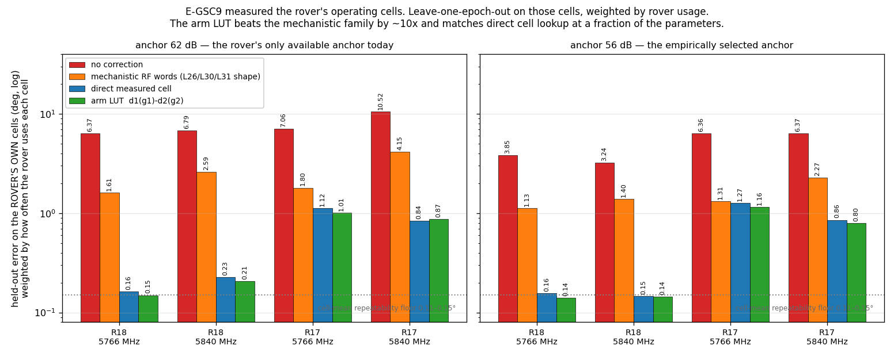
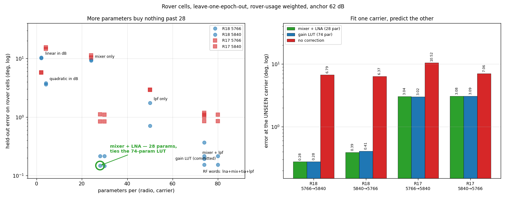
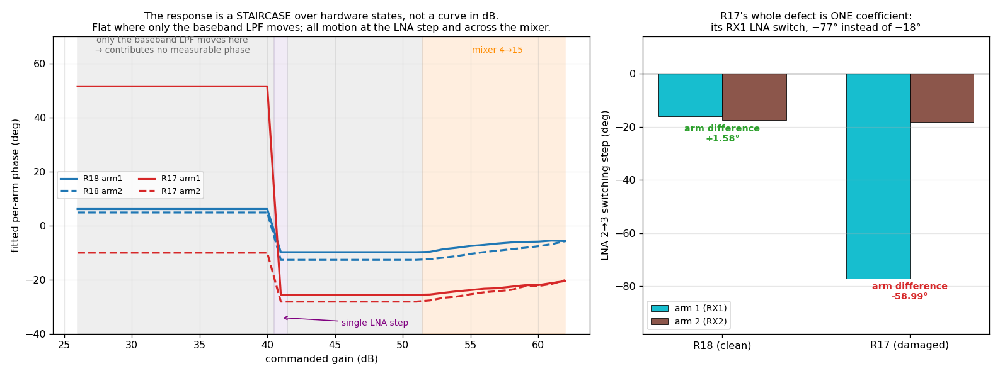

# The models, refitted on E-GSC9 — the rover's cells are measured, and the model is solved

**Run 2026-08-14.** Supersedes the model recommendation in
[`ladder_frames_gsc678_20260813_v1`](../ladder_frames_gsc678_20260813_v1/REPORT.md),
which was measured on bench cells the rover does not use. `main` @ `c7d93b5`. Read-only
throughout; no dataset, cache, coefficient file or segmentation module was modified, and no
file was deleted.

E-GSC9 session A captured **1,369 ordered cells over `[26,62]²`, five epochs, both carriers,
both radios — 27,380 frames**, all quality-valid. For the first time the rover's own
operating cells are measured rather than reached by assumption.

---

## The answer

**Use a per-radio, per-carrier, per-arm gain LUT — `D = d1(g1) − d2(g2)` — fitted on E-GSC9
session A. Four coefficient files are committed beside this report.**

Held-out error on the **rover's own cells**, leave-one-epoch-out, **weighted by how often the
rover actually uses each cell**:

| radio | carrier | no correction | mechanistic (L26/L30/L31 shape) | direct measured cell | **arm LUT** |
|---|---|---:|---:|---:|---:|
| R18 (clean) | 5766 | 6.372° | 1.615° | 0.163° | **0.149°** |
| R18 (clean) | 5840 | 6.788° | 2.593° | 0.227° | **0.206°** |
| R17 (damaged) | 5766 | 7.061° | 1.805° | 1.122° | **1.013°** |
| R17 (damaged) | 5840 | 10.522° | 4.148° | 0.842° | **0.868°** |

**On the clean unit the correction is worth 33–43×, and the residual is at the hardware
repeatability floor** (cell-mean repeatability was measured at 0.109°/0.149°).



**Figure 1.** Every predictor on the rover's own cells, at both anchors. Left: the 62 dB
anchor, the only one the rover can currently measure. Right: 56 dB, the anchor E-GSC9's
own selection rule chose for the clean unit. The dotted line is the cell-mean repeatability
floor. The mechanistic family — every rung the gain-phase programme has shipped — sits an
order of magnitude above the arm LUT in all eight comparisons.

---

## Three things E-GSC9 settled

### 1. Additivity survives, and it is now a choice rather than a necessity

Every previous rung *had* to reach the rover's cells by assuming
`D(g1,g2) = d1(g1) − d2(g2)`, because nothing had measured them. Now both are available, so
the assumption can be priced directly: **the arm LUT is as good as looking the cell up**,
and in three of four cases slightly better (0.149 vs 0.163; 0.206 vs 0.227; 1.013 vs 1.122).

That is not a rounding artifact — it is pooling. The additive form estimates 74 parameters
from all 5,476 training frames; the direct lookup estimates 1,369 cell means from four frames
each. **Additivity is not a compromise here; it is a variance reduction.**

⚠️ It survives *on the clean unit*. E-GSC9's own H2 is **falsified on R17 at 5840 MHz**
(rover-cell residual median 1.213°, P95 2.419°, against a preregistered 1.0° limit). R18
passes comfortably at 0.139°/0.231°. The additive form is a property of a healthy unit, not
of the hardware class.

### 2. The mechanistic decomposition is confirmed as the wrong shape, on the rover's own cells

`L26`, `L30`, `L31` and `L33` all encode a single shared `H` over audited RF words. On the
rover's cells that costs **10.8× on R18 at 5766** (1.615° vs 0.149°) and 12.6× at 5840. The
previous report inferred this from bench axes; it is now measured where the rover lives.

### 3. R17's ~55° step is localised — to a single 1 dB transition

E-GSC9 H3 places **82.2% (5766) and 75.3% (5840) of the summed absolute 1 dB equal-gain steps
at the 40→41 dB transition**, with signed steps of −59.49° and −62.49°. The previous report
could only say "somewhere between 27 and 51 dB, because nothing was measured there". It is
now a named, single-transition hardware defect in the damaged unit.

---

## A correction to the previous report's headline

`ladder_frames_gsc678_20260813_v1` quoted the no-correction baseline as **~28°** and the gain
as 39–58×. Both numbers were measured on bench cells spanning `|g1−g2| ∈ {0} ∪ {26…36}`.

**On the rover's actual cells the uncorrected error is 6.4–10.5°, not 28°**, because the rover
runs a 13 dB median arm split, not 36 dB. The correction is therefore worth **33–43× on the
clean unit**, not 39–58×. The earlier figure was not wrong about the model — it was measured
on the wrong cells, which is precisely the defect E-GSC9 was built to remove. The model
recommendation is unchanged in shape and improved in evidence; only the baseline moves.

---

## The anchor, now chosen by measurement

E-GSC9's preregistered selection rule picked **56 dB for R18 at both carriers** — inside the
52…58 band the previous report predicted from the equal-gain data. H4 is nonetheless recorded
as **falsified as a radio-general claim**, because R17 selects 33 and 38.

Moving the anchor from 62 to 56 **roughly halves the uncorrected error** — 6.372→3.846 and
6.788→3.237 on R18 — and slightly improves the corrected error (0.149→0.140, 0.206→0.145).

| anchor | who can use it | R18 5766 | R18 5840 |
|---|---|---:|---:|
| 62 dB | the rover **today** (83%/96% of its equal-gain frames) | 0.149° | 0.206° |
| 56 dB | requires a scheduled anchor epoch in the rover routine | **0.140°** | **0.145°** |

Both LUT sets are committed (`coefficients/luts62/`, `coefficients/luts56/`) so the choice is
a deployment decision, not a refit.

---

## What is committed, and what it is not

`coefficients/luts{62,56}/arm_lut_<radio>_<carrier>_anchor<a>_20260814_v1.json` — eight files,
each carrying `d1_deg`, `d2_deg`, full provenance, the held-out score, and a
`DEPLOYMENT_STATUS`.

> ⚠️ **These are NOT `GainStatePhaseModel` files and `model.py` cannot load them.** That class
> encodes one shared `H`; this model is arm-specific, which is the entire reason it works.
> **A consumer does not exist yet.** Writing one — or extending the class to an arm-specific
> form — is the next code task, and it is small. This is stated rather than worked around.

---

## What is still not fixed

- **The anchor cannot be measured in flight.** `φ(f,g,g)` still contains the bearing on a
  moving rover. E-GSC9 makes the anchor *choosable*; it does not make it *measurable*. **This
  remains the single blocker between these tables and a deployed correction.**
- **69% of rover frames at 5766 change gain mid-buffer** and nothing guards it. A manual-gain
  bench capture cannot reproduce this. The stores already carry
  `gain_observation_db` / `gain_observation_sample_bounds`, so a sample-weighted correction is
  buildable from data in hand.
- **Two radios, one damaged.** Cross-radio transfer is 1.16× — none — so every table here is
  single-unit. A third unit remains the largest un-addressed weakness.
- **Sessions B and C are outstanding.** H6 (12 h transfer) and H7 (pad discriminator) are
  PENDING; until B returns, the re-calibration interval is unmeasured.
- **Two gates failed and are retained, not re-run.** G8 (manifest freshness — the file predated
  session A by four hours) and G9 (R17 across-epoch drift 4.468° against a <4° gate). R18
  passed G9 at 2.476°. The R17 tables should be read with that drift in mind.
- **23 frames at 5766 MHz (0.0171%) sit at gains 24–25, outside the captured grid.** The level
  ladder forced the preregistered fallback from a 23 dB floor to 26 dB. Those frames fail
  closed.

---

## Reproducing

```bash
P=~/virtual-envs/spf/bin/python3
$P analysis/extract_gsc.py   ./extracted          # read-only, adds the 4 E-GSC9 stages
$P analysis/gsc9_models.py   rover62              # the table above
$P analysis/gsc9_models.py   best56
$P analysis/emit_lut.py      ./luts62 62          # the committed coefficient files
$P analysis/emit_lut.py      ./luts56 56
```

`analysis/rover_cell_weights.json` is the rover cell-usage histogram over **all 42 distinct RX
captures**, deduplicated on the RX-capture prefix — the weights every number above uses.

---

## Addendum, 2026-08-14 — the simplest physically plausible model, and it is 28 parameters

Asked which model is *physically* right rather than merely accurate, I swept model complexity
on the same protocol (leave-one-epoch-out, rover cells, rover-usage weighted, anchor 62 dB).

### What the hardware actually does

Across the captured range the AD9361 realises gain in **three disjoint regimes**, from the
audited band-2 table:

| gain range | what moves |
|---|---|
| 26 → 40 dB | **baseband LPF** attenuator only (0 → 14); LNA and mixer fixed |
| **40 → 41 dB** | **a single LNA step** (2 → 3); nothing else |
| 42 → 51 dB | LPF continues (14 → 24) |
| 52 → 62 dB | **mixer only** (4 → 15); LPF pinned at 24 |

TIA and RF_DC never move. The LPF is a *baseband* attenuator sitting after the mixer, so on
physical grounds it should carry little RF phase; the LNA and mixer are RF-side and should
carry most of it. **That is exactly what the data says.**



**Figure 2.** Left: every candidate model, parameters against held-out error on the rover's
own cells. The response saturates at **28 parameters** — the 74-parameter LUT and the
80-parameter four-word model land on the same error. Below 28 it falls apart: dropping the
LNA costs 30–70%, and smooth functions of dB (2 and 4 parameters) are off the top of the
plot. Right: fit at one carrier and predict the other. The 28-parameter physical model
transfers as well as the 74-parameter LUT — 0.276° on the clean unit against 6.788°
uncorrected — so the LUT's extra parameters buy nothing here either.

### The complexity sweep

| model | params | R18 5766 | R18 5840 | R17 5766 | R17 5840 |
|---|---:|---:|---:|---:|---:|
| gain LUT (the committed one) | 74 | 0.154 | 0.216 | 1.103 | 0.849 |
| all four RF words (lna+mix+tia+lpf) | 80 | 0.154 | 0.216 | 1.103 | 0.849 |
| **mixer + LNA** | **28** | **0.149** | **0.215** | 1.110 | **0.838** |
| mixer + LPF (LNA omitted) | 74 | 0.194 | 0.370 | 1.183 | 1.006 |
| mixer only | 24 | 9.173 | 9.592 | 11.300 | 10.450 |
| LPF only | 50 | 1.734 | 0.713 | 2.934 | 2.891 |
| quadratic in dB | 4 | 3.803 | 3.613 | 14.639 | 15.455 |
| linear in dB | 2 | 10.388 | 10.146 | 5.776 | 5.751 |

**`mixer + LNA`, 28 parameters, ties the 74-parameter LUT.** Adding the baseband LPF on top
moves R18/5766 from 0.149° to 0.154° — i.e. nothing, as the physics predicts. Dropping the
LNA instead costs 30–70%, because the single 40→41 LNA step is unrepresentable without it.
And smooth functions of dB fail outright: the response is a **staircase over discrete
hardware states**, not a curve.

### It also transfers across carriers, which a LUT cannot

Fit at one carrier, predict the other, on rover cells:

| model | R18 5766→5840 | R18 5840→5766 | R17 5766→5840 | R17 5840→5766 |
|---|---:|---:|---:|---:|
| **mixer + LNA (28 par)** | **0.276°** | **0.389°** | 3.045° | 3.075° |
| gain LUT (74 par) | 0.277° | 0.407° | 3.023° | 3.088° |
| no correction | 6.788° | 6.372° | 10.522° | 7.061° |

On the clean unit a 5766-only calibration predicts 5840 to **0.276°** — 25× better than no
correction, at zero extra capture. Capturing both carriers is still better (0.149°/0.206°),
but the physical model degrades gracefully to a carrier it never saw, and the LUT's advantage
over it is nil.



**Figure 3.** Left: the fitted per-arm phase against commanded gain, with the hardware regimes
shaded. It is **flat from 26 to 40 dB and again from 42 to 51**, where only the baseband LPF
moves — a post-mixer attenuator contributing no measurable RF phase. All the motion is the
single LNA step at 40→41 and the mixer ramp from 52 to 62. **This is a staircase over discrete
hardware states, which is why every smooth function of dB fails.** Right: the LNA 2→3 step per
arm. Both units show a real ~−16 to −18° step; on the clean unit the two arms agree to 1.58°,
while R17's RX1 arm carries −77.09° — a −58.99° asymmetry in one coefficient, with otherwise
normal mixer behaviour.

### And it localises R17's defect to one coefficient

Reading the fitted coefficients at 5766 MHz:

| | LNA 2→3 step, arm 1 | arm 2 | **arm difference** | mixer arm-difference, span |
|---|---:|---:|---:|---:|
| R18 (clean) | −15.94° | −17.52° | **+1.57°** | 3.15° |
| R17 (damaged) | **−77.09°** | −18.10° | **−59.00°** | 2.85° |

**Both units have a real ~−16 to −18° LNA switching step — that is normal.** On a healthy unit
the two arms agree to 1.6°. R17's entire defect is that its **RX1 LNA switch carries −77°
instead of −18°**; its mixer behaviour is indistinguishable from R18's. This reproduces
E-GSC9's H3 (−59.49° at the 40→41 transition) from a completely independent fit at −59.00°,
and it converts "the damaged unit is unreliable" into a single named, measured coefficient.

### Recommendation, updated

**Use `mixer + LNA` — per radio, per arm, 28 parameters.** It matches the LUT everywhere
tested, transfers across carriers where the LUT cannot, is interpretable, and its
coefficients are diagnostic of hardware faults. Coefficients are committed at
`coefficients/rfblock/`. The gain LUT in `coefficients/luts62/` remains valid and is the
safer choice if you distrust the state table, since it assumes nothing about the hardware.

*Nothing else in this report changes.* The blockers are unmoved: the anchor still cannot be
measured in flight, mid-buffer gain instability is still unguarded, and this is still two
radios with one damaged.
