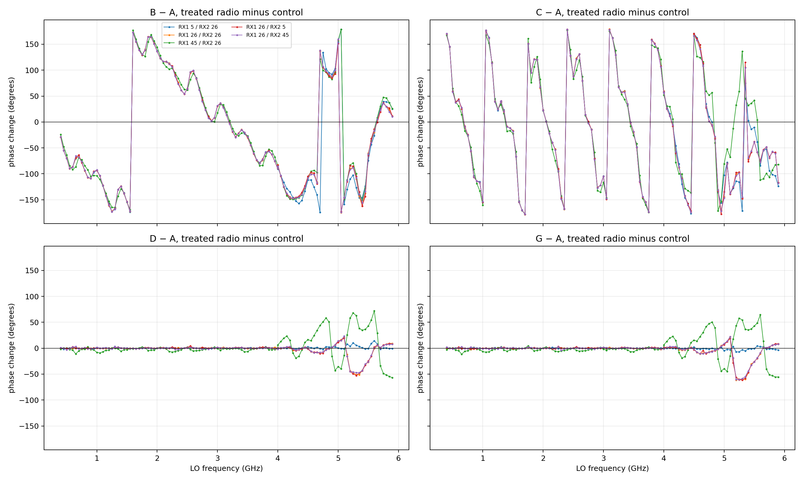
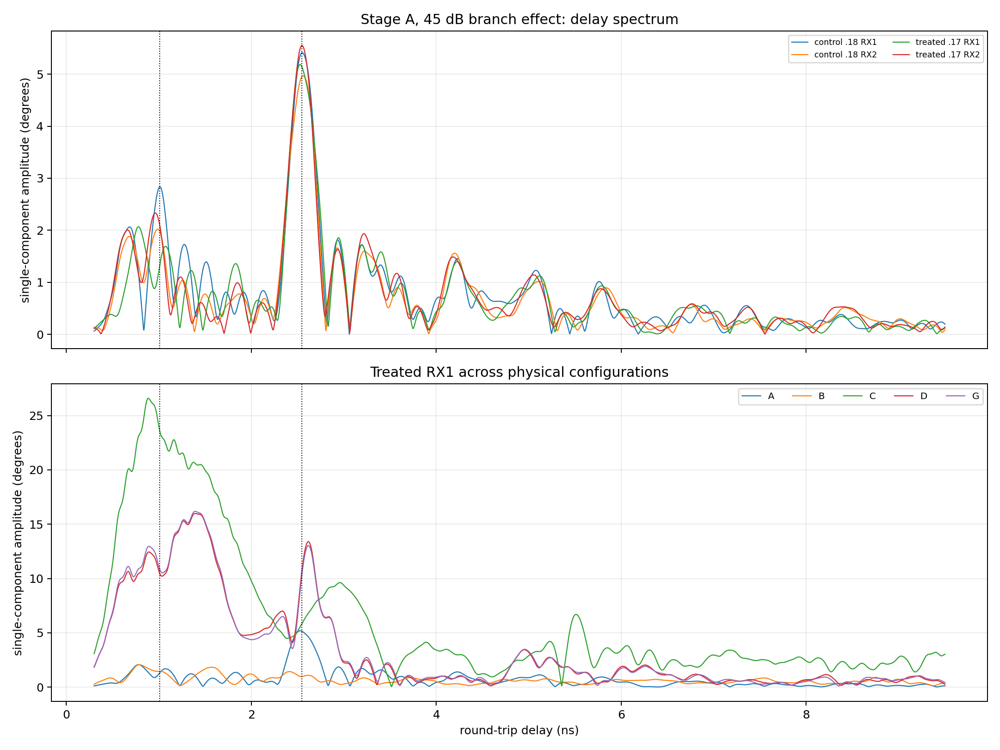
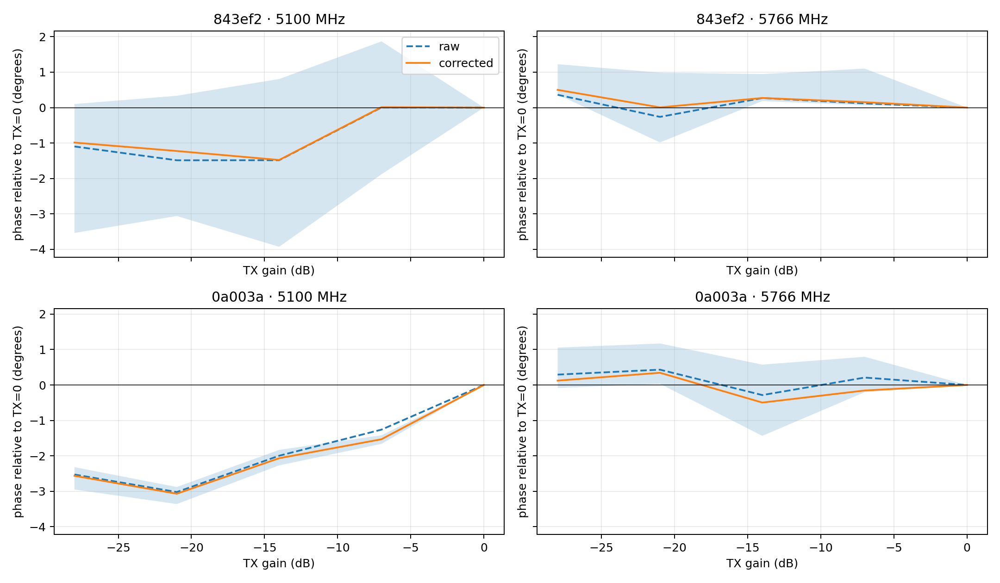
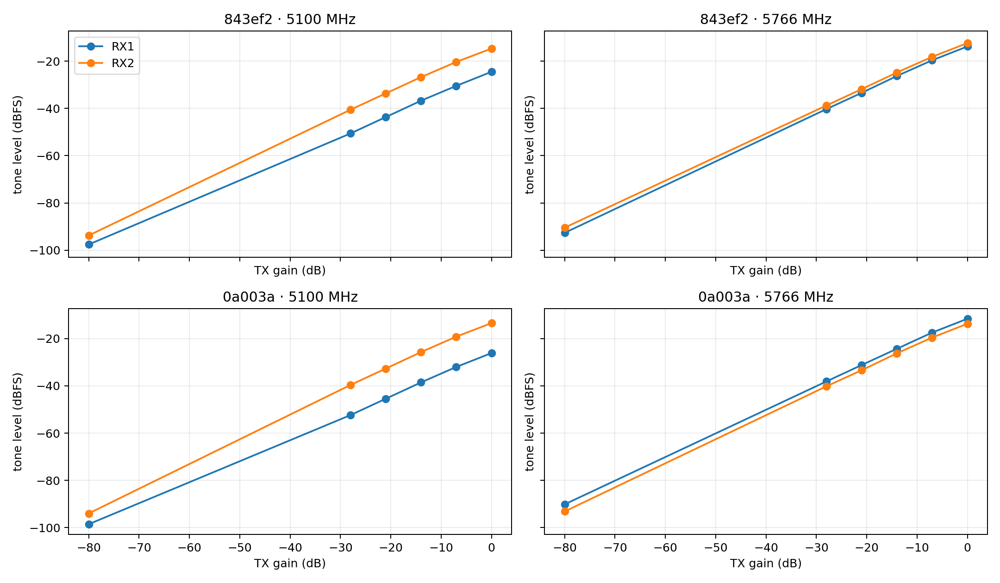
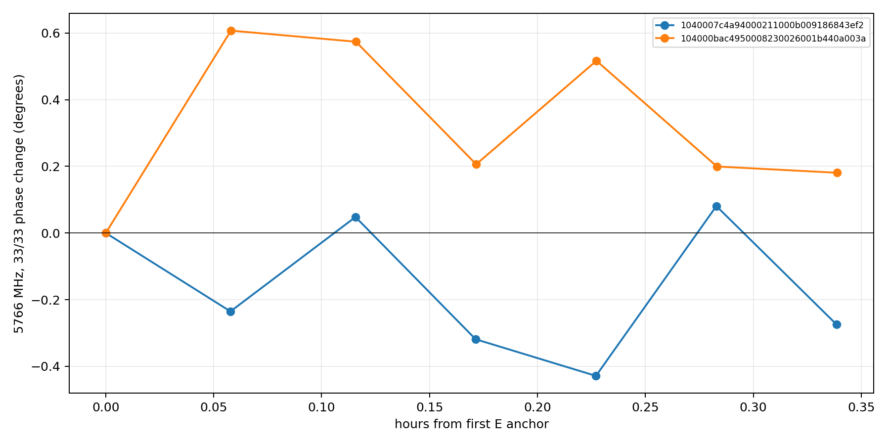
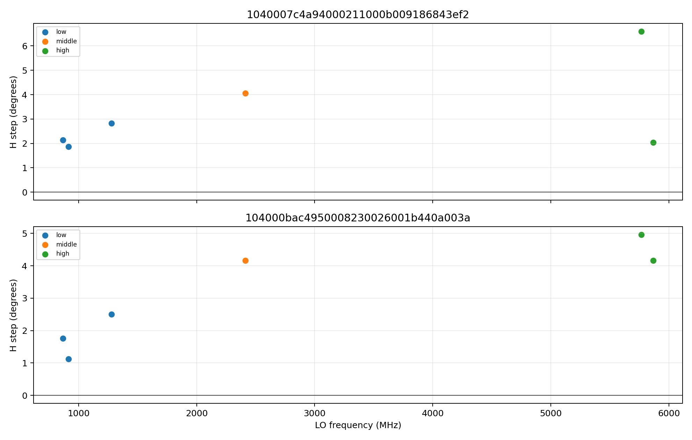
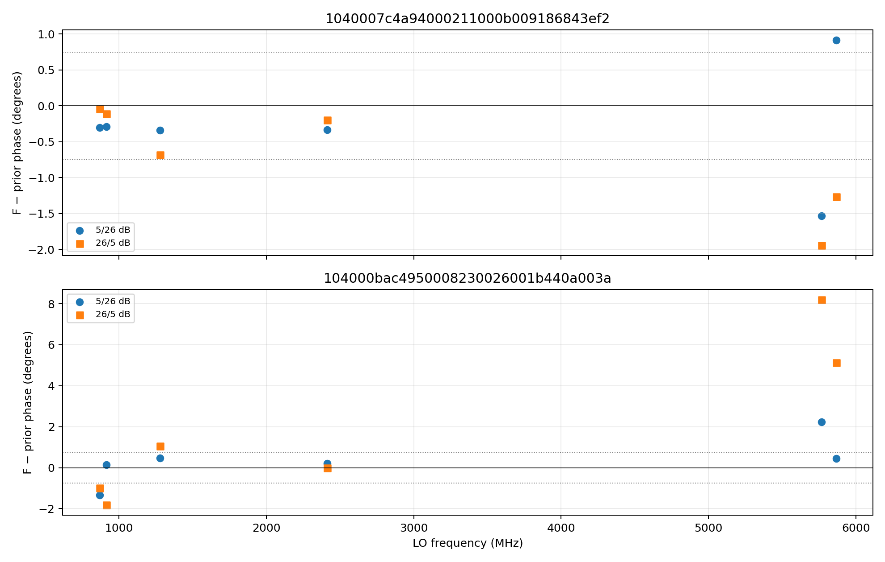
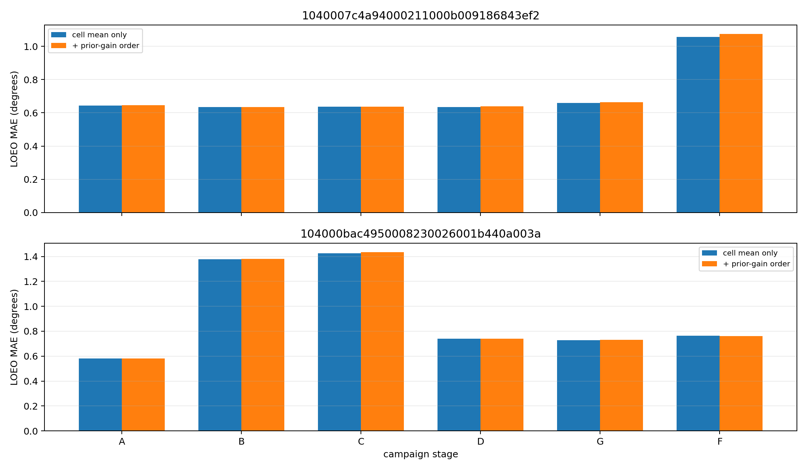
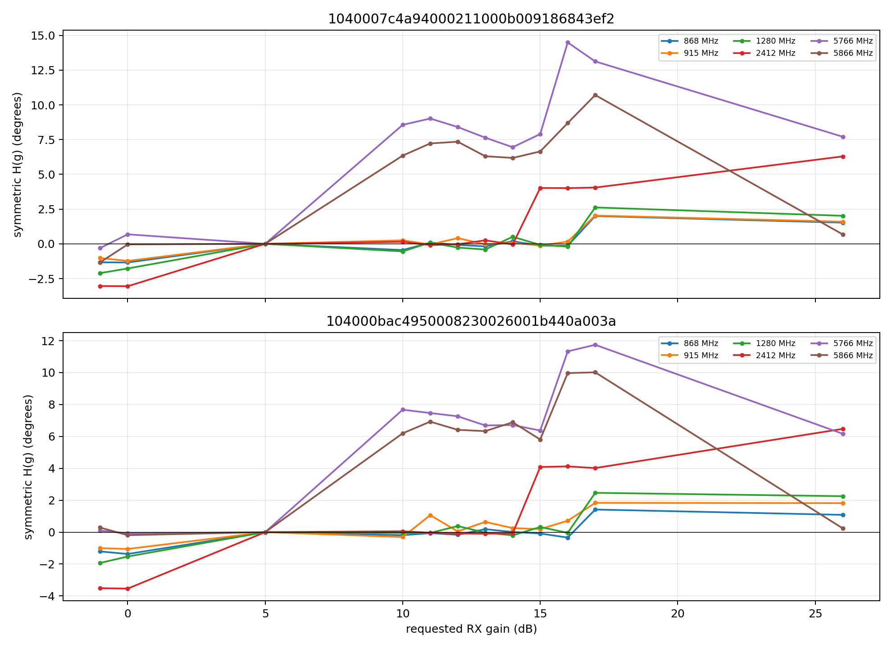

# A–G dual-RX spectroscopy campaign: final analysis

## Executive conclusions

- Acquisition is structurally complete: 19,836/19,836 scheduled frames were recorded. The passive gain-table audit passed, both radios used identical 77-row full tables, and firmware provenance is consistent across the datasets.
- The baseline contains a shared high-gain ripple component at 2.548 ns (381.9 mm one-way free-space equivalent). On treated `.17` RX1, the nominal 11 dB pad reduced that component from 5.34° to 0.99° (81.5% suppression), while the three untouched arms retained a median 98.6% of baseline.
- That pad result is strong evidence that the 382 mm-equivalent component is sensitive to the external RX1 path. It is **not** a clean pad-only causal proof: restoring the original harness in D did not restore the high-band A state, so connector re-mating or a persistent treatment-radio state change remains a material confound.
- The 30 cm jumper added 1.36–1.49 ns of one-way effective delay, as expected for ordinary coax. A candidate reflection component appears near the predicted shifted delay, but C failed repeatability and the failed A→D restoration prevents a definitive component assignment.
- D→G is stable (0.90–0.96° MAE overall), so the persistent A→D/G high-band change is not continuing thermal drift. The experiment instead establishes that a cable/connector intervention can move the phase state and leave it in a new stable state.
- The crossed TX-level test finds modest phase dependence at 5100 MHz (about 0.05–0.10° per TX dB in spur-qualified cells) and negligible dependence at 5766 MHz. Immediate prior-gain schedule order provides no held-out improvement, so simple gain-setting hysteresis does not explain the failed B/C/D cells.
- For correction, retain the serial-specific, exact-frequency additive RX1/RX2 LUT as the accuracy reference. The symmetric `H(g1)-H(g2)` LUT is the parsimonious default only where its measured error gap is acceptable. Always establish a per-session/per-harness phase anchor.

Phase convention throughout is `RX1 minus RX2`. Treatment effects use `(treated stage - treated baseline) - (control stage - control baseline)`.

## Acquisition and gate audit

- Rate pilot: 0.928 s/frame against the 1.3 s/frame limit: **pass**.
- Gain-table audit: **pass**; tables identical between radios: **True**.
- Firmware metadata consistent across every stage dataset: **True**.
- Firmware metadata matches the immutable resolved campaign config: **True**.

| Stage | Capture | Validation status | Waiver | Passing cells by radio |
|---|---:|---|---|---|
| A | 3390/3390 | complete | no | `86843ef2` 565/565, `440a003a` 565/565 |
| B | 3390/3390 | failed | yes | `86843ef2` 565/565, `440a003a` 553/565 |
| C | 3390/3390 | failed | yes | `86843ef2` 565/565, `440a003a` 555/565 |
| D | 3390/3390 | failed | yes | `86843ef2` 565/565, `440a003a` 563/565 |
| E_anchor_after_0 | 2/2 | complete | no | `86843ef2` 1/1, `440a003a` 1/1 |
| E_anchor_after_n14 | 2/2 | complete | no | `86843ef2` 1/1, `440a003a` 1/1 |
| E_anchor_after_n21 | 2/2 | complete | no | `86843ef2` 1/1, `440a003a` 1/1 |
| E_anchor_after_n28 | 2/2 | complete | no | `86843ef2` 1/1, `440a003a` 1/1 |
| E_anchor_after_n7 | 2/2 | complete | no | `86843ef2` 1/1, `440a003a` 1/1 |
| E_anchor_after_n80 | 2/2 | complete | no | `86843ef2` 1/1, `440a003a` 1/1 |
| E_anchor_before | 2/2 | complete | no | `86843ef2` 1/1, `440a003a` 1/1 |
| E_tx_0 | 324/324 | complete | no | `86843ef2` 54/54, `440a003a` 54/54 |
| E_tx_n14 | 324/324 | complete | no | `86843ef2` 54/54, `440a003a` 54/54 |
| E_tx_n21 | 324/324 | complete | no | `86843ef2` 54/54, `440a003a` 54/54 |
| E_tx_n28 | 324/324 | complete | no | `86843ef2` 54/54, `440a003a` 54/54 |
| E_tx_n7 | 324/324 | complete | no | `86843ef2` 54/54, `440a003a` 54/54 |
| E_tx_n80 | 324/324 | complete | no | `86843ef2` 0/54, `440a003a` 0/54 |
| F | 828/828 | complete | no | `86843ef2` 138/138, `440a003a` 138/138 |
| G | 3390/3390 | complete | no | `86843ef2` 565/565, `440a003a` 565/565 |
| rate_pilot | 100/100 | complete | no | `86843ef2` 50/50, `440a003a` 50/50 |

B, C, and D are complete captures with explicit repeatability waivers; they remain failed validation stages. The `-80 dB` E root is an intentional TX-muted floor control, so its phase is not treated as a valid tone measurement.

## Controlled treatment comparisons

| Stage vs A | Cells | Bias ° | MAE ° | P95 ° | Median amplitude Δ dB |
|---|---:|---:|---:|---:|---:|
| B | 565 | -100.114 | 91.612 | 166.389 | -10.493 |
| C | 565 | -75.179 | 88.860 | 171.998 | -0.344 |
| D | 565 | -0.637 | 5.843 | 42.661 | 0.054 |
| G | 565 | -1.601 | 5.968 | 42.543 | 0.039 |



### Equal-gain effective delay by gain-table band

These slopes are descriptive effective delays from the `(26,26)` control-corrected treatment curve. They do not identify a unique physical cable or PCB path.

| Stage | Band | Delay ps | Free-space equivalent mm | Residual RMSE ° |
|---|---|---:|---:|---:|
| B | high_4001_to_6000_mhz | -213.18 | -63.91 | 72.57 |
| B | low_0_to_1300_mhz | 349.37 | 104.74 | 15.06 |
| B | mid_1301_to_4000_mhz | 314.06 | 94.15 | 17.37 |
| C | high_4001_to_6000_mhz | 1355.87 | 406.48 | 55.35 |
| C | low_0_to_1300_mhz | 1493.78 | 447.82 | 21.18 |
| C | mid_1301_to_4000_mhz | 1460.73 | 437.92 | 21.83 |
| D | high_4001_to_6000_mhz | 16.65 | 4.99 | 17.90 |
| D | low_0_to_1300_mhz | -2.14 | -0.64 | 0.65 |
| D | mid_1301_to_4000_mhz | -0.40 | -0.12 | 0.77 |
| G | high_4001_to_6000_mhz | 24.33 | 7.29 | 20.34 |
| G | low_0_to_1300_mhz | -1.36 | -0.41 | 0.74 |
| G | mid_1301_to_4000_mhz | 0.05 | 0.02 | 0.77 |

B changes the median RX1/RX2 amplitude ratio by -10.49 dB, independently confirming the nominal 11 dB RX1 pad stack. C produces 1356–1494 ps of effective delay across the three gain-table bands, consistent with the scale expected from a 30 cm coax jumper.

### Ripple delay spectrum and one-versus-two components

The spectrum uses the 45 dB branch effect relative to 26 dB, removes an independent quadratic nuisance in each audited gain-table band, and fits shared delays with arm-specific sine/cosine coefficients. A 0.4 ns separation constraint prevents a sidelobe of the dominant component from being called a second path.

| Component | Delay ns | Frequency period MHz | One-way free-space equivalent mm |
|---:|---:|---:|---:|
| 1 | 2.5475 | 392.5 | 381.9 |
| 2 | 1.0075 | 992.6 | 151.0 |

| Components | Parameters | SSE | BIC | ΔBIC from previous |
|---:|---:|---:|---:|---:|
| 0 | 36 | 4.6430 | -1849.31 | — |
| 1 | 45 | 2.6630 | -2045.55 | -196.24 |
| 2 | 54 | 2.2753 | -2061.65 | -16.10 |

The second component improves BIC after paying for its shared delay and per-arm amplitudes, so one component is insufficient. The second best shared length is 151.0 mm; at this frequency span the delay resolution is not sufficient to distinguish it sharply from the previously suspected roughly 127 mm path.

| Arm | A primary amplitude ° | B primary amplitude ° | B/A |
|---|---:|---:|---:|
| `1040007c4a94000211000b009186843ef2:rx1` | 5.60 | 5.52 | 0.986 |
| `1040007c4a94000211000b009186843ef2:rx2` | 5.12 | 5.43 | 1.060 |
| `104000bac4950008230026001b440a003a:rx1` | 5.34 | 0.99 | 0.185 |
| `104000bac4950008230026001b440a003a:rx2` | 5.73 | 5.59 | 0.976 |

The jumper's equal-gain one-way delay predicts a moved reflection at 5.469 ns. The treated RX1 amplitude at that delay is 5.82° in C versus 1.53° after restoration (ratio 3.80). This is supportive, but the C repeatability failure and the changed post-A state make it non-causal evidence.



### Connector/restoration and hot-repeat stability

The largest failed-restoration effect is concentrated in treated RX1 at high gain above 4 GHz:

| Gain pair | D−A MAE ≤4 GHz ° | D−A MAE >4 GHz ° | D−A p95 >4 GHz ° |
|---|---:|---:|---:|
| 5/26 | 0.67 | 2.59 | 9.20 |
| 26/26 | 0.64 | 12.36 | 46.91 |
| 45/26 | 2.78 | 34.46 | 63.44 |
| 26/5 | 0.72 | 12.48 | 48.06 |
| 26/45 | 0.79 | 12.13 | 46.04 |

### Restored-baseline to hot-repeat stability (D → G)

| Radio | RF region | MAE ° | P95 ° | Median amplitude Δ dB |
|---|---|---:|---:|---:|
| `1040007c4a94000211000b009186843ef2` | all | 0.898 | 3.301 | -0.004 |
| `1040007c4a94000211000b009186843ef2` | high_above_4ghz | 1.862 | 9.382 | -0.020 |
| `1040007c4a94000211000b009186843ef2` | low_and_mid_at_or_below_4ghz | 0.389 | 1.293 | 0.000 |
| `104000bac4950008230026001b440a003a` | all | 0.957 | 3.664 | 0.007 |
| `104000bac4950008230026001b440a003a` | high_above_4ghz | 2.067 | 6.312 | 0.007 |
| `104000bac4950008230026001b440a003a` | low_and_mid_at_or_below_4ghz | 0.373 | 1.244 | 0.010 |

D and G agree much more closely with each other than either agrees with A above 4 GHz. Therefore the persistent high-band A→D/G shift is not continuing thermal drift. Because only `.17` RX1 was physically disturbed, the most parsimonious candidates are connector/harness re-mating and a treatment-radio RX1 state transition. The current experiment cannot separate them.

## TX-level experiment

| Radio | Frequency | Corrected slope median °/dB | Slope p05…p95 °/dB | −28 dB tone/floor median | Cells ≥45.6 dB |
|---|---:|---:|---:|---:|---:|
| `1040007c4a94000211000b009186843ef2` | 5100 MHz | 0.0548 | -0.0159…0.1223 | 46.80 dB | 21/27 (77.8%) |
| `1040007c4a94000211000b009186843ef2` | 5766 MHz | -0.0080 | -0.0481…0.0062 | 51.68 dB | 27/27 (100.0%) |
| `104000bac4950008230026001b440a003a` | 5100 MHz | 0.0961 | 0.0842…0.1109 | 46.36 dB | 16/27 (59.3%) |
| `104000bac4950008230026001b440a003a` | 5766 MHz | -0.0068 | -0.0374…-0.0015 | 51.83 dB | 27/27 (100.0%) |







The E anchors move by less than 0.3° over the crossed-level sequence. At 5100 MHz only 59–78% of cells meet the predeclared 45.6 dB tone-to-muted-floor margin, so only those cells support the slope. At 5766 MHz all cells qualify and the slope is effectively zero.

## Gain-table states and low-gain coverage

The local passive audit read the exact active table bytes from both radios. The tables are byte-identical. Within the deliberately dense 11–17 dB region, the first LNA/mixer-byte transition and observed symmetric-H step are:

| Table band | LNA/mixer transition | Raw byte 0 before→after | Observed H steps ° |
|---|---:|---|---|
| high | 15→16 dB | `0x02`→`0x04` | 2.04…6.59 |
| low | 16→17 dB | `0x01`→`0x02` | 1.12…2.82 |
| middle | 14→15 dB | `0x01`→`0x02` | 4.06…4.16 |

The observed phase steps line up with actual LNA/mixer table transitions: 16→17 dB in the low table, 14→15 dB in the middle table, and 15→16 dB in the high table. This is direct evidence that the LUT discontinuities are hardware-state effects, not a smooth function of requested dB.



### Cross-survey overlap

A and F contain no exact common frequencies, so the planned overlap check cannot use A. The reproducible replacement compares F with the immediately preceding wide integer-gain survey at the same six LOs and the common 5/26 and 26/5 gain pairs.

| Radio | Region | Cells | MAE ° | P95 ° | 0.75° MAE gate |
|---|---|---:|---:|---:|---|
| `1040007c4a94000211000b009186843ef2` | above_4ghz | 4 | 1.415 | 1.883 | fail |
| `1040007c4a94000211000b009186843ef2` | all | 12 | 0.663 | 1.718 | pass |
| `1040007c4a94000211000b009186843ef2` | at_or_below_4ghz | 8 | 0.287 | 0.563 | pass |
| `104000bac4950008230026001b440a003a` | above_4ghz | 4 | 4.001 | 7.734 | fail |
| `104000bac4950008230026001b440a003a` | all | 12 | 1.835 | 6.506 | fail |
| `104000bac4950008230026001b440a003a` | at_or_below_4ghz | 8 | 0.753 | 1.652 | fail |

The control board passes the aggregate 0.75° MAE gate; the treated board fails because the persistent high-band state shift also affects the F overlap. Below 4 GHz the overlap is much closer. This independently confirms that the post-intervention change is not a model-fitting artifact.



## Schedule-order hysteresis test

A leave-one-epoch-out ridge regression predicts each frame's residual from the signed and absolute RX1/RX2 gain jump from the immediately preceding frame in the same LO block. A real simple gain-setting hysteresis should reduce held-out error.

| Stage | Radio | Baseline MAE ° | Order-corrected MAE ° | Improvement ° |
|---|---|---:|---:|---:|
| A | `86843ef2` | 0.644 | 0.645 | -0.001 |
| A | `440a003a` | 0.580 | 0.580 | -0.000 |
| B | `86843ef2` | 0.634 | 0.634 | +0.000 |
| B | `440a003a` | 1.379 | 1.381 | -0.002 |
| C | `86843ef2` | 0.636 | 0.638 | -0.002 |
| C | `440a003a` | 1.426 | 1.434 | -0.008 |
| D | `86843ef2` | 0.636 | 0.639 | -0.004 |
| D | `440a003a` | 0.740 | 0.740 | +0.000 |
| F | `86843ef2` | 1.057 | 1.074 | -0.017 |
| F | `440a003a` | 0.763 | 0.761 | +0.002 |
| G | `86843ef2` | 0.660 | 0.664 | -0.004 |
| G | `440a003a` | 0.728 | 0.731 | -0.002 |

The correction is effectively zero or slightly harmful in held-out epochs. Therefore the B/C/D repeatability failures are not explained by a linear dependence on the immediately preceding gain command. Frequency-retune/calibration state and connector state remain better candidates.



## Model ladder

| Dataset | Model | Parameters | LOEO MAE ° | LOEO P95 ° |
|---|---|---:|---:|---:|
| A | Per-frequency additive gain LUT per radio | 1130 | 0.632 | 2.424 |
| A | Per-frequency antisymmetric gain LUT per radio | 678 | 1.002 | 3.234 |
| A | Frequency LUT + gain-table-specific symmetric gain LUT per radio | 238 | 3.319 | 11.455 |
| A | Strict universal per-frequency additive LUT | 565 | 6.795 | 33.275 |
| A | Gain-dependent branch-delay LUT per radio | 20 | 12.517 | 42.612 |
| F | Per-frequency additive gain LUT per radio | 276 | 0.899 | 3.272 |
| F | Per-frequency antisymmetric gain LUT per radio | 144 | 0.936 | 3.212 |
| F | Frequency LUT + gain-table-specific symmetric gain LUT per radio | 78 | 0.970 | 3.585 |
| F | Strict universal per-frequency additive LUT | 138 | 1.157 | 3.489 |
| F | Gain-dependent branch-delay LUT per radio | 92 | 6.954 | 15.294 |

Stage A shows that gain response changes substantially with exact frequency: the per-frequency independent model is the accuracy reference. Stage F shows that over the complete low/TIA gain range, the antisymmetric shared `H(g)` model is nearly as accurate and is the parsimonious default.



## Question-by-question decision ledger

| Question | Decision | Evidence |
|---|---|---|
| Were the intended firmware and full gain tables active? | **Pass** | Passive audit passed on both serials; all firmware fields are consistent. |
| Is one ripple component sufficient? | **No** | The second shared delay component improves BIC after parameter penalty. |
| Is the dominant roughly 382 mm-equivalent ripple external? | **Supported, not proven pad-only** | It collapses 81% only on padded RX1 while untouched arms remain stable; failed A→D restoration leaves connector/state confounding. |
| Does the 30 cm jumper add the expected path delay? | **Yes** | Equal-gain phase slope gives 1.36–1.49 ns one-way effective delay. |
| Does the jumper uniquely locate each ripple component? | **Inconclusive** | Predicted shifted-delay energy appears, but C repeatability and A→D restoration fail. |
| Is connector/harness restoration repeatable? | **Fail above 4 GHz** | D−A reaches 34.5° MAE for 45/26 above 4 GHz. |
| Is the later hot state stable? | **Pass conditionally** | D→G is 0.90–0.96° MAE overall, with larger high-band tails. |
| Is phase level-dependent? | **Modestly at 5100; no at 5766** | Spur-qualified crossed TX-level slopes. |
| Are low-gain hardware transitions visible? | **Yes** | H steps coincide with audited LNA/mixer-byte boundaries. |
| Does immediate gain-command order explain residuals? | **No** | No held-out MAE improvement from transition features. |

## Calibration recommendation

1. Use the radio-specific, exact-LO independent additive RX1/RX2 LUT as the accuracy reference. Apply `wrap(measured_RX1_minus_RX2 - predicted_offset)`.
2. Prefer the symmetric `H(g1)-H(g2)` representation when its serial/frequency-specific held-out gap to the independent model is within the declared tolerance; it is especially effective in F.
3. Never transfer the absolute intercept across a connector re-mate, harness change, radio replacement, or unvalidated boot. Measure a per-session equal-gain anchor at every operating LO.
4. Preserve exact gain-table discontinuities. Do not interpolate linearly through the audited LNA/mixer boundaries.
5. For AGC captures, require valid frame-aligned endpoint metadata and reject endpoint changes. Endpoint equality still does not prove there was no in-buffer transition.
6. Treat the current 5100 MHz level coefficient as a small systematic uncertainty, not a universal correction; 5766 MHz needs none.

## Limitations

- The 11 dB pad stack, 30 cm jumper, and connector torque were not independently characterized. The control radio removes shared drift but cannot remove treatment-radio-specific retune events.
- A→D connector repeatability failed above 4 GHz. This prevents clean pad-only and jumper-component causal attribution.
- The Stage E muted `−80 dB` capture is a floor measurement; its phase values fail normal tone-quality gates and are not interpreted.
- Thermal-anchor correction at 5100 MHz uses the 5766 MHz anchor as an additive drift proxy.
- Effective delays describe phase slope. They do not prove that a specific cable, PCB trace, analogue filter, or gain-table state is the sole mechanism.
- The planned independent final passive gain-table re-read was not recorded. G's embedded firmware/image/gadget identities match A and the resolved config, but that is weaker than a second table-byte dump.
- Every configuration is cabled and only two radios were tested. Over-the-air transfer, fleet-wide prevalence, and general unequal-arm level sensitivity remain outside this campaign.

## Reproduction

```bash
python -m spf.calibrations.dual_rx_gain_frequency.spectroscopy_analysis \
  --campaign-root /home/pi/spf-campaigns/spectroscopy_20260730_full_r2 \
  --treated-serial 104000bac4950008230026001b440a003a \
  --control-serial 1040007c4a94000211000b009186843ef2 \
  --prior-calibration-root /home/pi/spf/artifacts/dual_rx_gain_frequency/overnight_wide_integer_gain_cross_20260730_special_17_18_v1 \
  --output-dir <campaign-root>/analysis/campaign
```
