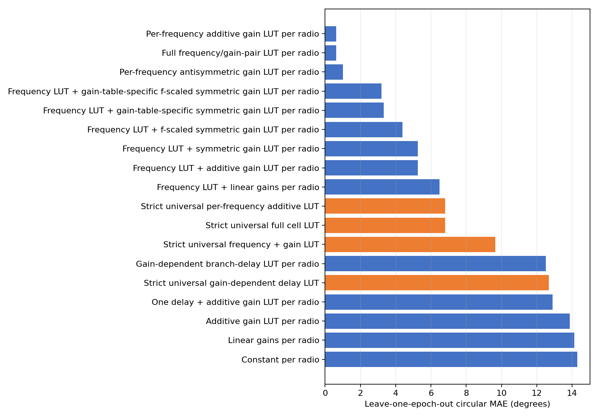
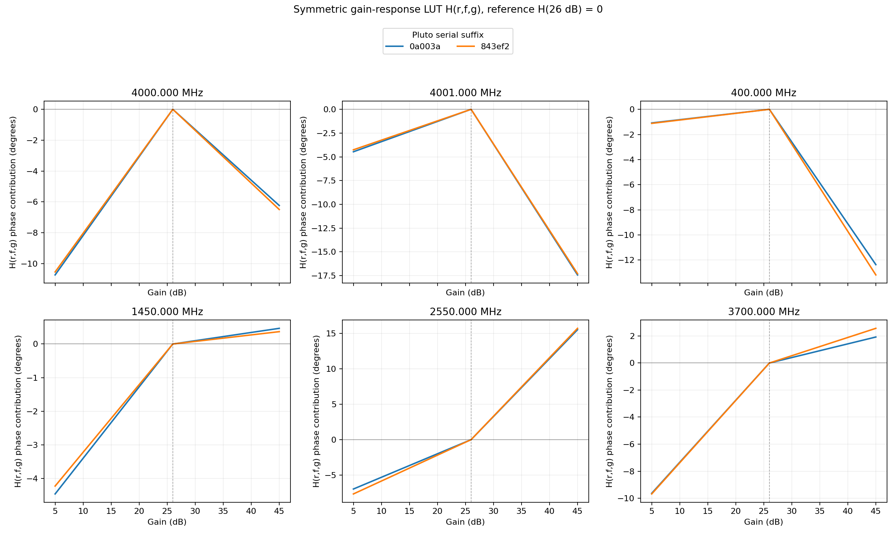
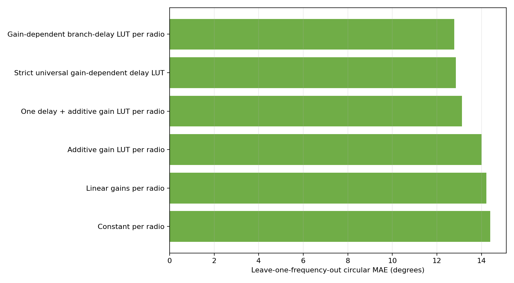

# Dual-RX phase model matrix

## Scope and evaluation

- Phase convention: `RX1 minus RX2`.
- Reference gain: 26 dB.
- Reference frequency for delay fits: 3.141168 GHz.
- Differential phase identifies only RX1 delay minus RX2 delay. Reported branch-delay LUT terms are relative contributions under the stated reference constraints, not absolute physical delays.

## Input checkpoint

| Pluto serial | Completed | Quality-valid | Validation | Scalar-input SHA-256 |
|---|---:|---:|---|---|
| `104000bac4950008230026001b440a003a` | 1695 | 1695 | `pass` | `de99c04f8f8bb684c6caadb8aecfd57f4bd3868454aea9121258b7143e0f61de` |
| `1040007c4a94000211000b009186843ef2` | 1695 | 1694 | `pass` | `d5a9bb5b1e159d1a67ed23b769c4574cfe1038544165fc943f0ab73d482d8cbb` |

All datasets are structurally complete. `fail_quality` means quality-rejected frames remain explicit in the V7 dataset; only quality-valid observations enter these fits.

## Evaluation design

The main table uses leave-one-epoch-out prediction: two repeats train the model and the third is unseen. This is the fair operational test for lookup tables whose deployment support is the measured grid.

## Known-cell prediction

| Model | Scope | Parameters | MAE ° | RMSE ° | P95 ° | Max ° | Coverage |
|---|---:|---:|---:|---:|---:|---:|---:|
| Per-frequency additive gain LUT per radio | per_radio | 1130 | 0.632 | 1.073 | 2.424 | 7.794 | 100.00% |
| Full frequency/gain-pair LUT per radio | per_radio | 1130 | 0.632 | 1.073 | 2.424 | 7.794 | 100.00% |
| Per-frequency antisymmetric gain LUT per radio | per_radio | 678 | 1.002 | 1.594 | 3.234 | 12.423 | 100.00% |
| Frequency LUT + gain-table-specific f-scaled symmetric gain LUT per radio | per_radio | 238 | 3.200 | 5.007 | 11.682 | 26.380 | 100.00% |
| Frequency LUT + gain-table-specific symmetric gain LUT per radio | per_radio | 238 | 3.319 | 4.957 | 11.455 | 26.909 | 100.00% |
| Frequency LUT + f-scaled symmetric gain LUT per radio | per_radio | 230 | 4.378 | 6.585 | 14.800 | 25.444 | 100.00% |
| Frequency LUT + symmetric gain LUT per radio | per_radio | 230 | 5.252 | 7.542 | 15.726 | 29.783 | 100.00% |
| Frequency LUT + additive gain LUT per radio | per_radio | 234 | 5.255 | 7.539 | 15.774 | 29.427 | 100.00% |
| Frequency LUT + linear gains per radio | per_radio | 230 | 6.487 | 9.040 | 18.972 | 34.835 | 100.00% |
| Strict universal per-frequency additive LUT | universal | 565 | 6.795 | 16.913 | 33.275 | 100.728 | 100.00% |
| Strict universal full cell LUT | universal | 565 | 6.795 | 16.913 | 33.275 | 100.728 | 100.00% |
| Strict universal frequency + gain LUT | universal | 117 | 9.650 | 18.409 | 34.686 | 110.135 | 100.00% |
| Gain-dependent branch-delay LUT per radio | per_radio | 20 | 12.517 | 20.494 | 42.612 | 112.820 | 100.00% |
| Strict universal gain-dependent delay LUT | universal | 10 | 12.678 | 22.544 | 52.826 | 128.997 | 100.00% |
| One delay + additive gain LUT per radio | per_radio | 12 | 12.886 | 20.967 | 44.095 | 116.998 | 100.00% |
| Additive gain LUT per radio | per_radio | 10 | 13.877 | 22.095 | 50.407 | 123.049 | 100.00% |
| Linear gains per radio | per_radio | 6 | 14.121 | 22.656 | 50.537 | 129.021 | 100.00% |
| Constant per radio | per_radio | 2 | 14.302 | 22.692 | 50.784 | 128.893 | 100.00% |



### Best model by radio

| Pluto serial | MAE ° | RMSE ° | P95 ° | Max ° |
|---|---:|---:|---:|---:|
| `104000bac4950008230026001b440a003a` | 0.602 | 1.031 | 2.274 | 7.794 |
| `1040007c4a94000211000b009186843ef2` | 0.663 | 1.113 | 2.567 | 7.015 |

### Symmetric default versus independent accuracy reference

The parsimonious default assumes RX1 and RX2 share one physical gain-state response. Under the RX1-minus-RX2 phase convention, that response enters with opposite signs:

```text
independent:   phase = C[f] + A[f,g1] + B[f,g2]
antisymmetric: phase = C[f] + H[f,g1] - H[f,g2]
```

| Model | Parameters per radio/frequency | Per radio | Fleet total | LOEO MAE | LOEO p95 |
|---|---:|---:|---:|---:|---:|
| Independent A/B | 1 + 2 + 2 = 5 | 565 | 1130 | 0.632° | 2.424° |
| Shared antisymmetric H | 1 + 2 = 3 | 339 | 678 | 1.002° | 3.234° |

The fleet totals above cover 2 radios. The reference gain (26 dB) is fixed to zero in each gain LUT, so it is not an additional fitted coefficient.

Relative to independent A/B, symmetric H changes LOEO MAE by +0.370°, RMSE by +0.521°, p95 by +0.810°, and maximum error by +4.629°. It removes 452 parameters (40.0%).

Both models are always fitted. Symmetric H is the default structural model; independent A/B remains the accuracy reference, and the H-minus-A/B gap is a required output.

#### Gap by radio

| Pluto serial | Symmetric MAE | Independent MAE | MAE gap | Symmetric p95 | Independent p95 | P95 gap |
|---|---:|---:|---:|---:|---:|---:|
| `104000bac4950008230026001b440a003a` | 0.977° | 0.602° | +0.375° | 3.234° | 2.274° | +0.960° |
| `1040007c4a94000211000b009186843ef2` | 1.028° | 0.663° | +0.365° | 3.230° | 2.567° | +0.664° |

### What H(r,f,g) looks like across gain

`H` is a circular phase correction LUT in degrees, not a gain value. At fixed radio and frequency it is anchored at `H(26 dB) = 0`. Across all fitted curves, the median absolute 1 dB step is 7.057°, p95 is 18.447°, and p99 is 19.693°. The low median and large tail describe a mostly flat or gently varying staircase with a few hardware gain-stage jumps.

| Radio | Frequency | H range | Span | Largest adjacent step |
|---|---:|---:|---:|---:|
| `104000bac4950008230026001b440a003a` | 4000.000 MHz | -10.74° to 0.00° | 10.74° | 5→26 dB: +10.74° |
| `104000bac4950008230026001b440a003a` | 4001.000 MHz | -17.43° to 0.00° | 17.43° | 26→45 dB: -17.43° |
| `104000bac4950008230026001b440a003a` | 400.000 MHz | -12.36° to 0.00° | 12.36° | 26→45 dB: -12.36° |
| `104000bac4950008230026001b440a003a` | 1450.000 MHz | -4.46° to 0.47° | 4.92° | 5→26 dB: +4.46° |
| `104000bac4950008230026001b440a003a` | 2550.000 MHz | -6.97° to 15.53° | 22.49° | 26→45 dB: +15.53° |
| `104000bac4950008230026001b440a003a` | 3700.000 MHz | -9.63° to 1.92° | 11.56° | 5→26 dB: +9.63° |
| `1040007c4a94000211000b009186843ef2` | 4000.000 MHz | -10.54° to 0.00° | 10.54° | 5→26 dB: +10.54° |
| `1040007c4a94000211000b009186843ef2` | 4001.000 MHz | -17.30° to 0.00° | 17.30° | 26→45 dB: -17.30° |
| `1040007c4a94000211000b009186843ef2` | 400.000 MHz | -13.18° to 0.00° | 13.18° | 26→45 dB: -13.18° |
| `1040007c4a94000211000b009186843ef2` | 1450.000 MHz | -4.22° to 0.37° | 4.59° | 5→26 dB: +4.22° |
| `1040007c4a94000211000b009186843ef2` | 2550.000 MHz | -7.66° to 15.72° | 23.38° | 26→45 dB: +15.72° |
| `1040007c4a94000211000b009186843ef2` | 3700.000 MHz | -9.68° to 2.57° | 12.25° | 5→26 dB: +9.68° |



## Unseen-frequency test

| Model | Scope | MAE ° | RMSE ° | P95 ° | Coverage |
|---|---:|---:|---:|---:|---:|
| Gain-dependent branch-delay LUT per radio | per_radio | 12.783 | 20.994 | 43.305 | 100.00% |
| Strict universal gain-dependent delay LUT | universal | 12.850 | 22.790 | 53.652 | 100.00% |
| One delay + additive gain LUT per radio | per_radio | 13.131 | 21.446 | 45.151 | 100.00% |
| Additive gain LUT per radio | per_radio | 14.001 | 22.291 | 50.848 | 100.00% |
| Linear gains per radio | per_radio | 14.227 | 22.836 | 51.038 | 100.00% |
| Constant per radio | per_radio | 14.396 | 22.861 | 51.088 | 100.00% |



### Fitted effective differential delays

| Model | Pluto serial | Base delay ps | Free-space equivalent mm |
|---|---|---:|---:|
| One delay + additive gain LUT per radio | `104000bac4950008230026001b440a003a` | 15.034 | 4.507 |
| One delay + additive gain LUT per radio | `1040007c4a94000211000b009186843ef2` | -8.191 | -2.456 |
| Gain-dependent branch-delay LUT per radio | `104000bac4950008230026001b440a003a` | 15.001 | 4.497 |
| Gain-dependent branch-delay LUT per radio | `1040007c4a94000211000b009186843ef2` | -8.476 | -2.541 |

## Strict universal transfer to an unseen radio

| Model | MAE ° | RMSE ° | P95 ° | Max ° | Coverage |
|---|---:|---:|---:|---:|---:|
| Strict universal full cell LUT | 13.262 | 32.817 | 64.540 | 179.356 | 100.00% |
| Strict universal per-frequency additive LUT | 13.262 | 32.817 | 64.540 | 179.356 | 100.00% |
| Strict universal frequency + gain LUT | 15.447 | 33.815 | 66.336 | 179.960 | 100.00% |
| Strict universal gain-dependent delay LUT | 16.698 | 27.802 | 64.566 | 145.173 | 100.00% |

## Physical interpretation

A delay-only explanation is supported only if the delay models are competitive on the unseen-frequency test. A good fit on the measured frequencies alone is insufficient: a frequency lookup can absorb arbitrary retune- or band-dependent phase offsets.

The gain-dependent branch-delay model assigns relative delay terms to RX1 and RX2 gain states. Because only RX1−RX2 phase is observed, adding the same absolute delay to both paths is unobservable; the individual physical path lengths cannot be recovered from this experiment.

## Interpretation and recommendation

The recommended correction on this measured grid is the per-radio, per-frequency additive lookup. The full cell lookup has many more parameters and no held-out benefit, so an RX1-by-RX2 interaction table is not justified by these data.

Do not use the strict universal model as a precision correction for an unseen radio. Its leave-one-radio-out error measures the cost of omitting radio-specific calibration.

The delay models are useful descriptions of a broad phase slope, but their unseen-frequency errors reject path imbalance as the only mechanism. Retune state, frequency-band analogue response, and frequency-dependent gain-table effects still require explicit frequency calibration or denser within-band characterization.

## Reproduction

```bash
python -m spf.calibrations.dual_rx_gain_frequency model-matrix \
  --config /home/pi/spf-campaigns/spectroscopy_20260730_full_r2/resolved_configs/A.yaml \
  --dataset /home/pi/spf-campaigns/spectroscopy_20260730_full_r2/stages/A/104000bac4950008230026001b440a003a/calibration.v7.zarr \
  --dataset /home/pi/spf-campaigns/spectroscopy_20260730_full_r2/stages/A/1040007c4a94000211000b009186843ef2/calibration.v7.zarr \
  --output-dir artifacts/dual_rx_gain_frequency/model_matrix
```
