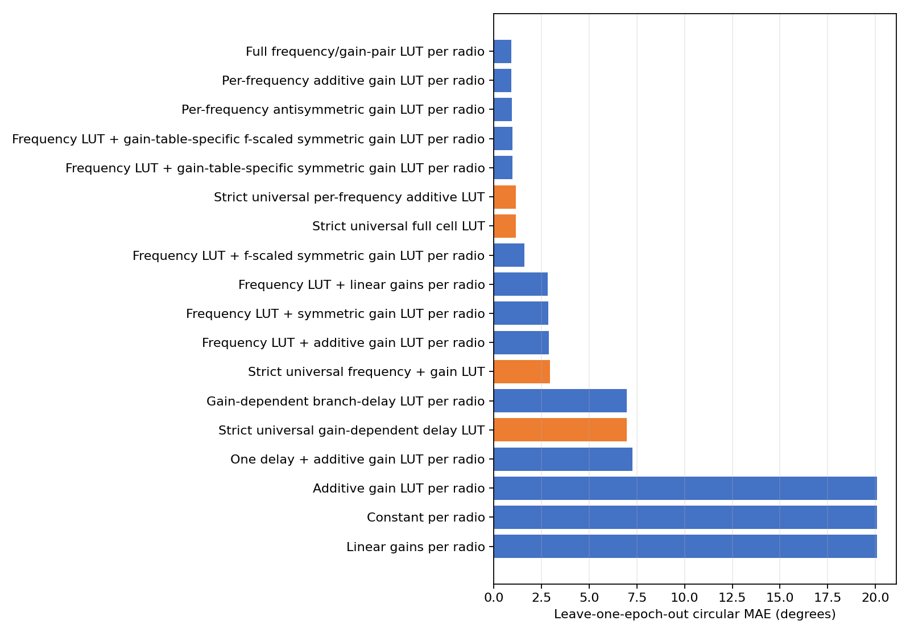
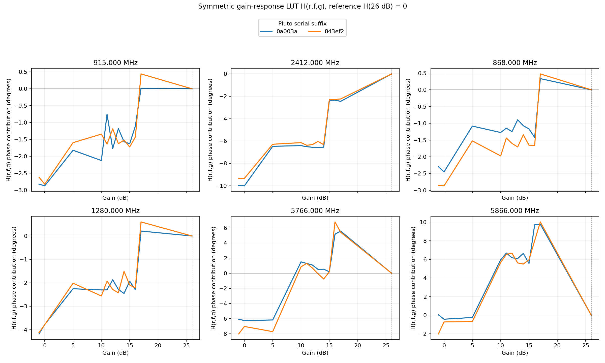
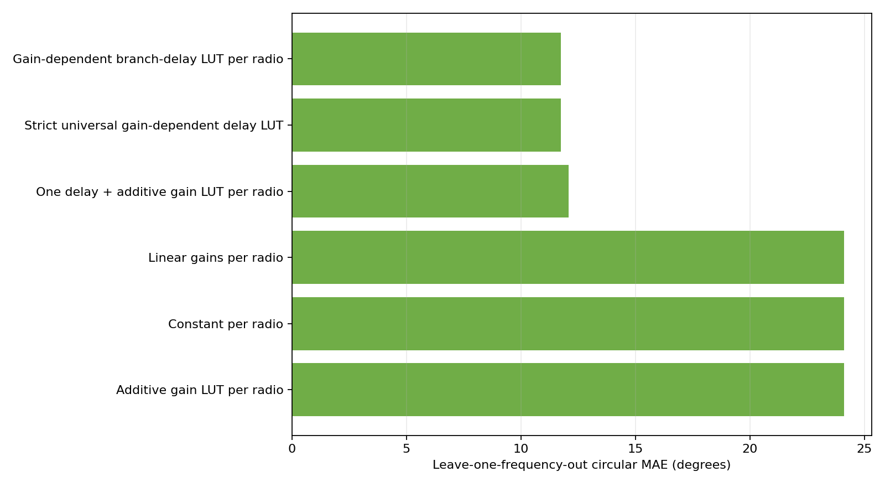

# Dual-RX phase model matrix

## Scope and evaluation

- Phase convention: `RX1 minus RX2`.
- Reference gain: 26 dB.
- Reference frequency for delay fits: 2.851167 GHz.
- Differential phase identifies only RX1 delay minus RX2 delay. Reported branch-delay LUT terms are relative contributions under the stated reference constraints, not absolute physical delays.

## Input checkpoint

| Pluto serial | Completed | Quality-valid | Validation | Scalar-input SHA-256 |
|---|---:|---:|---|---|
| `104000bac4950008230026001b440a003a` | 414 | 414 | `pass` | `c6f4c77e0658a8a2cb94bab7aa33284d9a411394f595c8069647b32fcd0b8c7c` |
| `1040007c4a94000211000b009186843ef2` | 414 | 414 | `pass` | `31f5cdb7cfb7c5929f9c2ed88f61cfb03a3a77e86194e9c9907830080a1833b6` |

All datasets are structurally complete. `fail_quality` means quality-rejected frames remain explicit in the V7 dataset; only quality-valid observations enter these fits.

## Evaluation design

The main table uses leave-one-epoch-out prediction: two repeats train the model and the third is unseen. This is the fair operational test for lookup tables whose deployment support is the measured grid.

## Known-cell prediction

| Model | Scope | Parameters | MAE ° | RMSE ° | P95 ° | Max ° | Coverage |
|---|---:|---:|---:|---:|---:|---:|---:|
| Full frequency/gain-pair LUT per radio | per_radio | 276 | 0.899 | 1.418 | 3.272 | 7.175 | 100.00% |
| Per-frequency additive gain LUT per radio | per_radio | 276 | 0.899 | 1.418 | 3.272 | 7.175 | 100.00% |
| Per-frequency antisymmetric gain LUT per radio | per_radio | 144 | 0.936 | 1.450 | 3.212 | 9.219 | 100.00% |
| Frequency LUT + gain-table-specific f-scaled symmetric gain LUT per radio | per_radio | 78 | 0.966 | 1.553 | 3.573 | 9.088 | 100.00% |
| Frequency LUT + gain-table-specific symmetric gain LUT per radio | per_radio | 78 | 0.970 | 1.548 | 3.585 | 9.081 | 100.00% |
| Strict universal per-frequency additive LUT | universal | 138 | 1.157 | 1.618 | 3.489 | 7.865 | 100.00% |
| Strict universal full cell LUT | universal | 138 | 1.157 | 1.618 | 3.489 | 7.865 | 100.00% |
| Frequency LUT + f-scaled symmetric gain LUT per radio | per_radio | 34 | 1.606 | 2.063 | 4.147 | 10.239 | 100.00% |
| Frequency LUT + linear gains per radio | per_radio | 16 | 2.829 | 3.665 | 7.915 | 14.009 | 100.00% |
| Frequency LUT + symmetric gain LUT per radio | per_radio | 34 | 2.863 | 3.486 | 6.813 | 12.611 | 100.00% |
| Frequency LUT + additive gain LUT per radio | per_radio | 56 | 2.868 | 3.482 | 6.718 | 12.322 | 100.00% |
| Strict universal frequency + gain LUT | universal | 28 | 2.936 | 3.574 | 6.910 | 12.821 | 100.00% |
| Gain-dependent branch-delay LUT per radio | per_radio | 92 | 6.954 | 8.653 | 15.294 | 21.659 | 100.00% |
| Strict universal gain-dependent delay LUT | universal | 46 | 6.971 | 8.691 | 15.914 | 22.409 | 100.00% |
| One delay + additive gain LUT per radio | per_radio | 48 | 7.278 | 9.166 | 18.519 | 23.689 | 100.00% |
| Constant per radio | per_radio | 2 | 20.097 | 23.147 | 48.581 | 56.844 | 100.00% |
| Additive gain LUT per radio | per_radio | 46 | 20.097 | 22.959 | 46.616 | 51.850 | 100.00% |
| Linear gains per radio | per_radio | 6 | 20.097 | 22.988 | 47.282 | 53.577 | 100.00% |



### Best model by radio

| Pluto serial | MAE ° | RMSE ° | P95 ° | Max ° |
|---|---:|---:|---:|---:|
| `104000bac4950008230026001b440a003a` | 0.762 | 1.209 | 2.684 | 7.175 |
| `1040007c4a94000211000b009186843ef2` | 1.037 | 1.599 | 3.822 | 6.755 |

### Symmetric default versus independent accuracy reference

The parsimonious default assumes RX1 and RX2 share one physical gain-state response. Under the RX1-minus-RX2 phase convention, that response enters with opposite signs:

```text
independent:   phase = C[f] + A[f,g1] + B[f,g2]
antisymmetric: phase = C[f] + H[f,g1] - H[f,g2]
```

| Model | Parameters per radio/frequency | Per radio | Fleet total | LOEO MAE | LOEO p95 |
|---|---:|---:|---:|---:|---:|
| Independent A/B | 1 + 11 + 11 = 23 | 138 | 276 | 0.899° | 3.272° |
| Shared antisymmetric H | 1 + 11 = 12 | 72 | 144 | 0.936° | 3.212° |

The fleet totals above cover 2 radios. The reference gain (26 dB) is fixed to zero in each gain LUT, so it is not an additional fitted coefficient.

Relative to independent A/B, symmetric H changes LOEO MAE by +0.036°, RMSE by +0.033°, p95 by -0.061°, and maximum error by +2.044°. It removes 132 parameters (47.8%).

Both models are always fitted. Symmetric H is the default structural model; independent A/B remains the accuracy reference, and the H-minus-A/B gap is a required output.

#### Gap by radio

| Pluto serial | Symmetric MAE | Independent MAE | MAE gap | Symmetric p95 | Independent p95 | P95 gap |
|---|---:|---:|---:|---:|---:|---:|
| `104000bac4950008230026001b440a003a` | 0.802° | 0.762° | +0.041° | 2.621° | 2.684° | -0.064° |
| `1040007c4a94000211000b009186843ef2` | 1.069° | 1.037° | +0.032° | 3.660° | 3.822° | -0.162° |

### What H(r,f,g) looks like across gain

`H` is a circular phase correction LUT in degrees, not a gain value. At fixed radio and frequency it is anchored at `H(26 dB) = 0`. Across all fitted curves, the median absolute 1 dB step is 0.423°, p95 is 5.854°, and p99 is 9.400°. The low median and large tail describe a mostly flat or gently varying staircase with a few hardware gain-stage jumps.

| Radio | Frequency | H range | Span | Largest adjacent step |
|---|---:|---:|---:|---:|
| `104000bac4950008230026001b440a003a` | 915.000 MHz | -2.87° to 0.02° | 2.89° | 10→11 dB: +1.37° |
| `104000bac4950008230026001b440a003a` | 2412.000 MHz | -10.01° to 0.00° | 10.01° | 14→15 dB: +4.16° |
| `104000bac4950008230026001b440a003a` | 868.000 MHz | -2.45° to 0.33° | 2.79° | 16→17 dB: +1.76° |
| `104000bac4950008230026001b440a003a` | 1280.000 MHz | -4.18° to 0.21° | 4.39° | 16→17 dB: +2.51° |
| `104000bac4950008230026001b440a003a` | 5766.000 MHz | -6.24° to 5.58° | 11.82° | 5→10 dB: +7.67° |
| `104000bac4950008230026001b440a003a` | 5866.000 MHz | -0.43° to 9.78° | 10.20° | 17→26 dB: -9.78° |
| `1040007c4a94000211000b009186843ef2` | 915.000 MHz | -2.82° to 0.44° | 3.26° | 16→17 dB: +1.87° |
| `1040007c4a94000211000b009186843ef2` | 2412.000 MHz | -9.34° to 0.00° | 9.34° | 14→15 dB: +4.06° |
| `1040007c4a94000211000b009186843ef2` | 868.000 MHz | -2.87° to 0.47° | 3.34° | 16→17 dB: +2.14° |
| `1040007c4a94000211000b009186843ef2` | 1280.000 MHz | -4.12° to 0.60° | 4.72° | 16→17 dB: +2.82° |
| `1040007c4a94000211000b009186843ef2` | 5766.000 MHz | -8.01° to 6.78° | 14.79° | 5→10 dB: +8.56° |
| `1040007c4a94000211000b009186843ef2` | 5866.000 MHz | -2.01° to 10.03° | 12.03° | 17→26 dB: -10.03° |



## Unseen-frequency test

| Model | Scope | MAE ° | RMSE ° | P95 ° | Coverage |
|---|---:|---:|---:|---:|---:|
| Gain-dependent branch-delay LUT per radio | per_radio | 11.742 | 15.499 | 29.221 | 100.00% |
| Strict universal gain-dependent delay LUT | universal | 11.749 | 15.510 | 29.488 | 100.00% |
| One delay + additive gain LUT per radio | per_radio | 12.093 | 15.868 | 32.044 | 100.00% |
| Linear gains per radio | per_radio | 24.116 | 27.523 | 55.816 | 100.00% |
| Constant per radio | per_radio | 24.116 | 27.612 | 57.209 | 100.00% |
| Additive gain LUT per radio | per_radio | 24.116 | 27.539 | 55.868 | 100.00% |



### Fitted effective differential delays

| Model | Pluto serial | Base delay ps | Free-space equivalent mm |
|---|---|---:|---:|
| One delay + additive gain LUT per radio | `104000bac4950008230026001b440a003a` | 27.114 | 8.129 |
| One delay + additive gain LUT per radio | `1040007c4a94000211000b009186843ef2` | 27.092 | 8.122 |
| Gain-dependent branch-delay LUT per radio | `104000bac4950008230026001b440a003a` | 23.185 | 6.951 |
| Gain-dependent branch-delay LUT per radio | `1040007c4a94000211000b009186843ef2` | 27.935 | 8.375 |

## Strict universal transfer to an unseen radio

| Model | MAE ° | RMSE ° | P95 ° | Max ° | Coverage |
|---|---:|---:|---:|---:|---:|
| Strict universal per-frequency additive LUT | 1.852 | 2.370 | 4.805 | 9.289 | 100.00% |
| Strict universal full cell LUT | 1.852 | 2.370 | 4.805 | 9.289 | 100.00% |
| Strict universal frequency + gain LUT | 3.118 | 3.894 | 7.449 | 13.658 | 100.00% |
| Strict universal gain-dependent delay LUT | 7.077 | 8.825 | 16.720 | 23.168 | 100.00% |

## Physical interpretation

A delay-only explanation is supported only if the delay models are competitive on the unseen-frequency test. A good fit on the measured frequencies alone is insufficient: a frequency lookup can absorb arbitrary retune- or band-dependent phase offsets.

The gain-dependent branch-delay model assigns relative delay terms to RX1 and RX2 gain states. Because only RX1−RX2 phase is observed, adding the same absolute delay to both paths is unobservable; the individual physical path lengths cannot be recovered from this experiment.

## Interpretation and recommendation

The recommended correction on this measured grid is the per-radio, per-frequency additive lookup. The full cell lookup has many more parameters and no held-out benefit, so an RX1-by-RX2 interaction table is not justified by these data.

Do not use the strict universal model as a precision correction for an unseen radio. Its leave-one-radio-out error measures the cost of omitting radio-specific calibration.

The delay models are useful descriptions of a broad phase slope, but their unseen-frequency errors reject path imbalance as the only mechanism. Retune state, frequency-band analogue response, and frequency-dependent gain-table effects still require explicit frequency calibration or denser within-band characterization.

## Reproduction

```bash
python -m spf.calibrations.dual_rx_gain_frequency model-matrix \
  --config /home/pi/spf-campaigns/spectroscopy_20260730_full_r2/resolved_configs/F.yaml \
  --dataset /home/pi/spf-campaigns/spectroscopy_20260730_full_r2/stages/F/104000bac4950008230026001b440a003a/calibration.v7.zarr \
  --dataset /home/pi/spf-campaigns/spectroscopy_20260730_full_r2/stages/F/1040007c4a94000211000b009186843ef2/calibration.v7.zarr \
  --output-dir artifacts/dual_rx_gain_frequency/model_matrix
```
