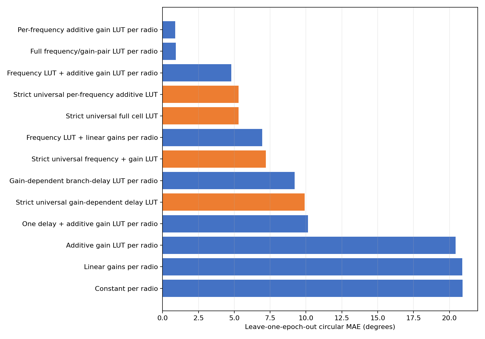
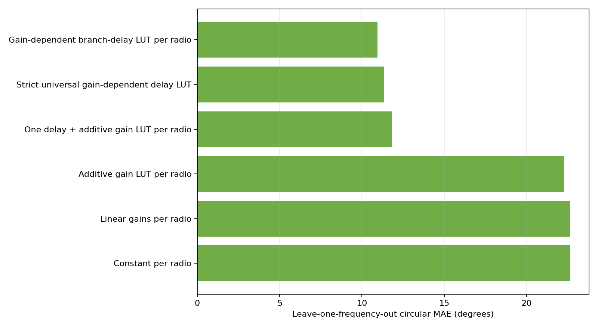

# Dense dual-RX phase model matrix

## Scope and evaluation

- Phase convention: `RX1 minus RX2`.
- Reference gain: 26 dB.
- Reference frequency for delay fits: 3.378000 GHz.
- Differential phase identifies only RX1 delay minus RX2 delay. Reported branch-delay LUT terms are relative contributions under the stated reference constraints, not absolute physical delays.

## Input checkpoint

| Pluto serial | Completed | Quality-valid | Validation | Scalar-input SHA-256 |
|---|---:|---:|---|---|
| `104000707f0700120f001a0095f2dbee49` | 10404 | 10209 | `fail_quality` | `c4f6ba758f104104382ddbb98f737893e378014ab4b42f606e272b619424f6dd` |
| `104000f6ad020002fdff3a00bba2f096a1` | 10404 | 10200 | `fail_quality` | `3cdff911d608a6a1e9c30f1a2756e56f68e453aab5a950ab4d808edc6aaed492` |

Both datasets are structurally complete. `fail_quality` means quality-rejected frames remain explicit in the V7 dataset; only quality-valid observations enter these fits.

## Evaluation design

The main table uses leave-one-epoch-out prediction: two repeats train the model and the third is unseen. This is the fair operational test for lookup tables whose deployment support is the measured grid.

## Known-cell prediction

| Model | Scope | Parameters | MAE ° | RMSE ° | P95 ° | Max ° | Coverage |
|---|---:|---:|---:|---:|---:|---:|---:|
| Per-frequency additive gain LUT per radio | per_radio | 792 | 0.874 | 1.330 | 3.053 | 8.410 | 100.00% |
| Full frequency/gain-pair LUT per radio | per_radio | 6936 | 0.912 | 1.442 | 3.318 | 10.977 | 99.99% |
| Frequency LUT + additive gain LUT per radio | per_radio | 88 | 4.797 | 6.212 | 12.826 | 23.025 | 100.00% |
| Strict universal per-frequency additive LUT | universal | 396 | 5.303 | 7.264 | 16.274 | 26.424 | 100.00% |
| Strict universal full cell LUT | universal | 3468 | 5.305 | 7.271 | 16.288 | 34.745 | 100.00% |
| Frequency LUT + linear gains per radio | per_radio | 28 | 6.942 | 9.190 | 18.981 | 34.671 | 100.00% |
| Strict universal frequency + gain LUT | universal | 44 | 7.203 | 9.400 | 19.804 | 35.858 | 100.00% |
| Gain-dependent branch-delay LUT per radio | per_radio | 132 | 9.212 | 11.837 | 24.872 | 38.222 | 100.00% |
| Strict universal gain-dependent delay LUT | universal | 66 | 9.902 | 13.165 | 28.354 | 46.586 | 100.00% |
| One delay + additive gain LUT per radio | per_radio | 68 | 10.148 | 12.829 | 25.918 | 46.733 | 100.00% |
| Additive gain LUT per radio | per_radio | 66 | 20.436 | 24.540 | 50.582 | 79.134 | 100.00% |
| Linear gains per radio | per_radio | 6 | 20.893 | 25.480 | 51.759 | 88.738 | 100.00% |
| Constant per radio | per_radio | 2 | 20.929 | 25.597 | 51.976 | 90.932 | 100.00% |



### Best model by radio

| Pluto serial | MAE ° | RMSE ° | P95 ° | Max ° |
|---|---:|---:|---:|---:|
| `104000707f0700120f001a0095f2dbee49` | 0.830 | 1.265 | 2.937 | 8.410 |
| `104000f6ad020002fdff3a00bba2f096a1` | 0.917 | 1.392 | 3.166 | 8.389 |

## Unseen-frequency test

| Model | Scope | MAE ° | RMSE ° | P95 ° | Coverage |
|---|---:|---:|---:|---:|---:|
| Gain-dependent branch-delay LUT per radio | per_radio | 10.942 | 14.042 | 29.316 | 100.00% |
| Strict universal gain-dependent delay LUT | universal | 11.357 | 14.909 | 31.282 | 100.00% |
| One delay + additive gain LUT per radio | per_radio | 11.802 | 14.963 | 29.822 | 100.00% |
| Additive gain LUT per radio | per_radio | 22.287 | 26.742 | 55.103 | 100.00% |
| Linear gains per radio | per_radio | 22.641 | 27.516 | 55.672 | 100.00% |
| Constant per radio | per_radio | 22.666 | 27.591 | 55.979 | 100.00% |



### Fitted effective differential delays

| Model | Pluto serial | Base delay ps | Free-space equivalent mm |
|---|---|---:|---:|
| One delay + additive gain LUT per radio | `104000707f0700120f001a0095f2dbee49` | 20.738 | 6.217 |
| One delay + additive gain LUT per radio | `104000f6ad020002fdff3a00bba2f096a1` | 35.898 | 10.762 |
| Gain-dependent branch-delay LUT per radio | `104000707f0700120f001a0095f2dbee49` | 23.262 | 6.974 |
| Gain-dependent branch-delay LUT per radio | `104000f6ad020002fdff3a00bba2f096a1` | 36.594 | 10.971 |

## Strict universal transfer to an unseen radio

| Model | MAE ° | RMSE ° | P95 ° | Max ° | Coverage |
|---|---:|---:|---:|---:|---:|
| Strict universal full cell LUT | 10.504 | 14.365 | 32.322 | 48.552 | 99.96% |
| Strict universal per-frequency additive LUT | 10.507 | 14.359 | 32.487 | 47.741 | 100.00% |
| Strict universal frequency + gain LUT | 11.496 | 15.425 | 34.026 | 52.424 | 100.00% |
| Strict universal gain-dependent delay LUT | 12.869 | 16.523 | 35.580 | 59.295 | 100.00% |

## Physical interpretation

A delay-only explanation is supported only if the delay models are competitive on the unseen-frequency test. A good fit on the measured frequencies alone is insufficient: a frequency lookup can absorb arbitrary retune- or band-dependent phase offsets.

The gain-dependent branch-delay model assigns relative delay terms to RX1 and RX2 gain states. Because only RX1−RX2 phase is observed, adding the same absolute delay to both paths is unobservable; the individual physical path lengths cannot be recovered from this experiment.

## Interpretation and recommendation

The recommended correction on this measured grid is the per-radio, per-frequency additive lookup. The full cell lookup has many more parameters and no held-out benefit, so an RX1-by-RX2 interaction table is not justified by these data.

Do not use the strict universal model as a precision correction for an unseen radio. Its leave-one-radio-out error measures the cost of omitting radio-specific calibration.

The delay models are useful descriptions of a broad phase slope, but their unseen-frequency errors reject path imbalance as the only mechanism. Retune state, frequency-band analogue response, and frequency-dependent gain-table effects still require explicit frequency calibration or denser within-band characterization.

## Reproduction

```bash
python -m spf.calibrations.dual_rx_gain_frequency model-matrix \
  --config spf/calibrations/dual_rx_gain_frequency/configs/survey_cross_band.yaml \
  --artifact-root artifacts/dual_rx_gain_frequency/survey_cross_band_20260727_v1 \
  --output-dir artifacts/dual_rx_gain_frequency/survey_cross_band_20260727_v1/model_matrix
```
