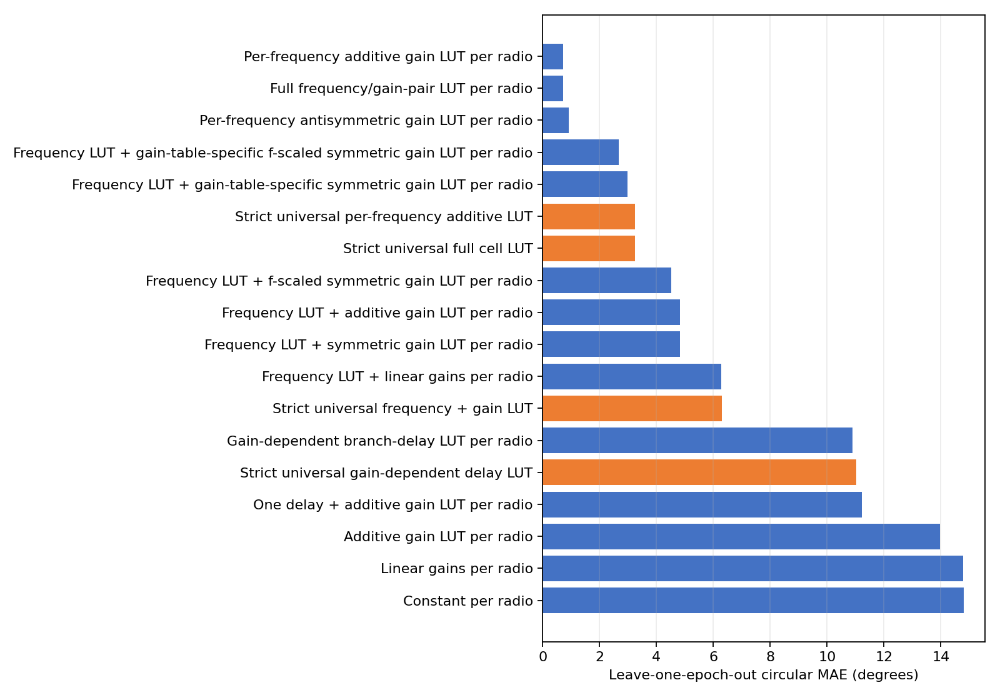
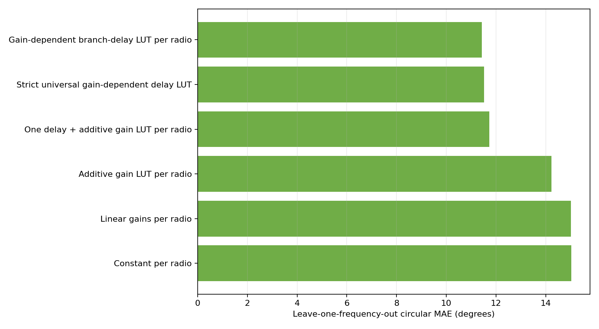
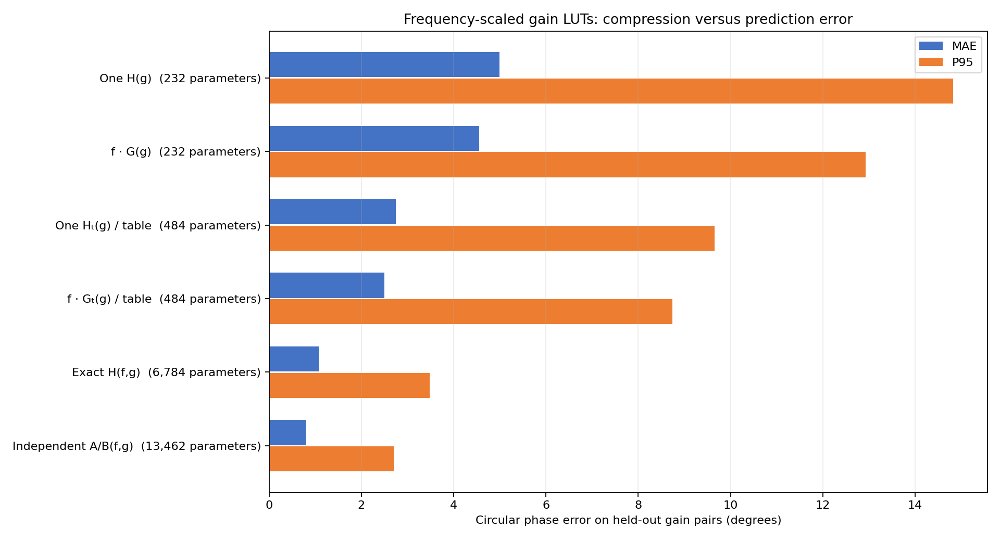
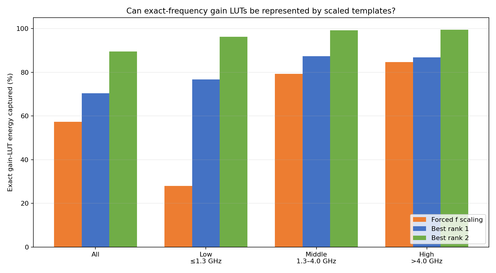
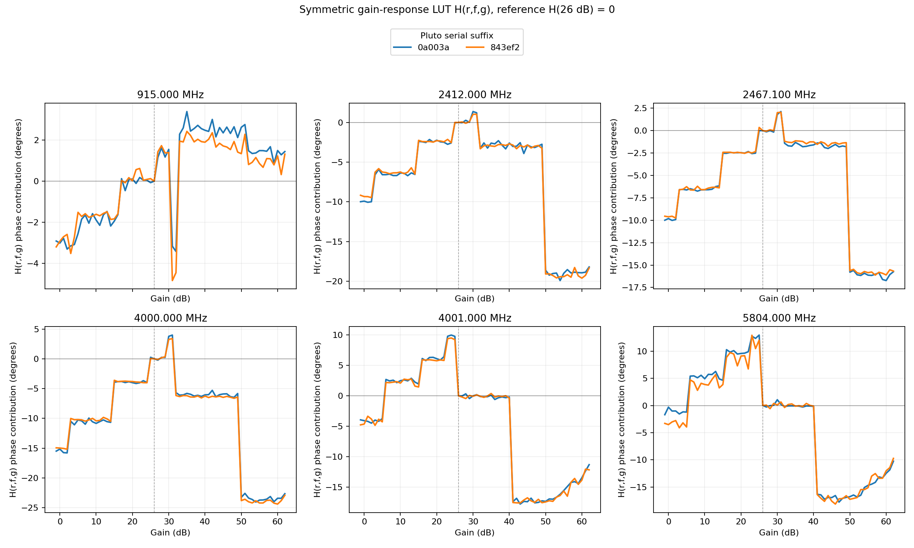
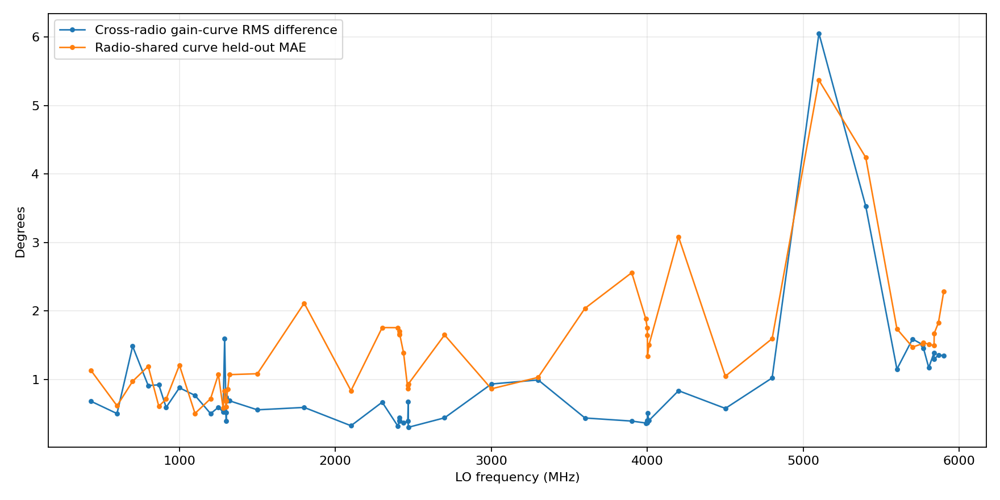
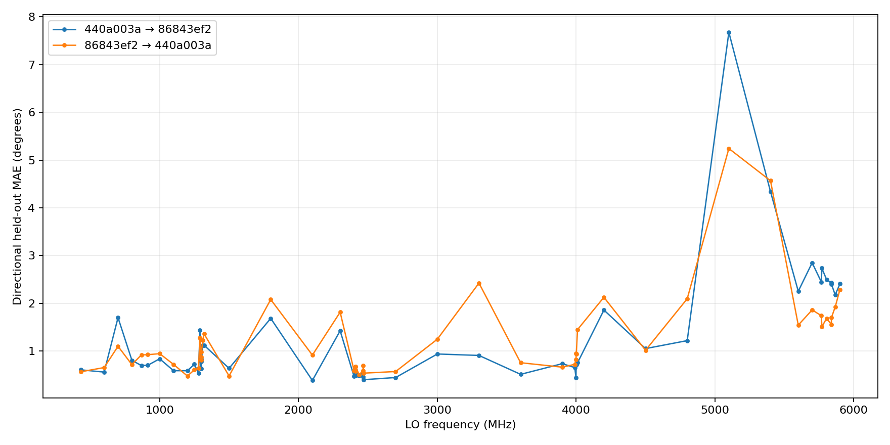

# Wide integer-gain cross-band model ladder

Date: 2026-07-30

## Outcome

The overnight survey completed all 55,650 scheduled direct-USB V7 frames
across two Pluto radios, 53 exact LO frequencies, every common integer gain
from -1 through 62 dB on both receiver axes, 48 off-axis held-out gain pairs,
and three separated epochs.

The best model is a radio-specific, frequency-specific additive lookup:

```text
phase(radio, frequency, gain_rx1, gain_rx2)
  = intercept[radio, frequency]
  + RX1_effect[radio, frequency, gain_rx1]
  + RX2_effect[radio, frequency, gain_rx2]
```

It achieves 0.713° leave-one-epoch-out MAE and 2.528° p95 over 55,602
quality-valid frames. A full ordered gain-pair LUT is slightly worse at
0.723° MAE despite requiring 18,535 observed coefficients instead of 13,462.
The data therefore do not justify an RX1-by-RX2 interaction table.

The separate, decisive off-axis test agrees. Its 48 ordered pairs per
frequency are excluded from additive fitting:

| Radio | Independent RX curves MAE / p95 | Shared `H(g1) - H(g2)` MAE / p95 |
|---|---:|---:|
| `104000bac4950008230026001b440a003a` (`.17`) | 1.31° / 3.20° | 1.52° / 3.90° |
| `1040007c4a94000211000b009186843ef2` (`.18`) | 1.36° / 3.21° | 1.60° / 4.33° |

The shared physical-response curve is now the default parsimonious hypothesis:

```text
phase = C(r,f) + H(r,f,g1) - H(r,f,g2)
```

Every analysis must also fit independent RX1/RX2 curves and report the
symmetric-minus-independent error gap. Independent A/B remains the empirical
accuracy reference for a fully calibrated radio; the wider survey shows a
measurable penalty for imposing symmetry that was not visible in the original
two-frequency experiment.

## Experiment

The committed experiment definition is
[`wide_integer_gain_cross_band.yaml`](../../configs/wide_integer_gain_cross_band.yaml).
For each frequency and epoch it measures:

- 127 training-axis pairs: every `(gain, 26)` and `(26, gain)` pair;
- 48 off-axis ordered pairs held out from the additive fit;
- all integer gains in the cross-band common range `[-1, 62]` dB; and
- one 65,536-sample dual-RX frame per scheduled pair.

The 53 frequencies span 433 MHz through 5.9 GHz and include the exact
historical wall-array LOs that were previously missing: 2411, 2411.950, 2464,
2467.100, 5770, and 5839 MHz.

The RF fixture was:

```text
TX2 -> 30 dB attenuator -> two-way splitter -> RX1 and RX2
```

Both radios used the verified RAM-loaded direct-USB gain/RSSI firmware,
protocol v2, a 30 MS/s sample rate, 3 MHz RF bandwidth, and a 100 kHz FPGA DDS
tone. The raw datasets remain under the gitignored artifact root:

```text
artifacts/dual_rx_gain_frequency/
  overnight_wide_integer_gain_cross_20260730_special_17_18_v1/
```

## Acquisition and quality gates

| Gate | `.17` | `.18` |
|---|---:|---:|
| Scheduled frames complete | 27,825 / 27,825 | 27,825 / 27,825 |
| Quality-valid frames | 27,800 | 27,802 |
| Training cells passing | 6,731 / 6,731 | 6,731 / 6,731 |
| Held-out cells passing | 2,535 / 2,544 | 2,536 / 2,544 |
| Transport or capture failures | 0 | 0 |

The exhaustive validator reread all 55,650 IQ frames and reproduced each
stored phase, tone frequency, quality boolean, and exact quality-reason set.
The scalar metadata/schedule pass and the full stored-IQ pass produced
identical counts.

Both validators correctly return `fail_quality`, not `pass`, because every
configured held-out stress cell must pass. This does not represent a failure
of the training grid:

- all 13,462 radio-specific training cells pass;
- 48/55,650 frames are quality-rejected and remain explicit;
- almost every rejection is the extreme `(RX1=13, RX2=62)` held-out pair at
  5.1 GHz and above; and
- two other held-out cells exceed the 5° across-repeat gate by less than
  0.4°.

The model fits exclude those 48 frames and report 100% coverage over the
remaining 55,602 observations.

## Model ladder

The primary column is leave-one-epoch-out: train on two repetitions and
predict the third. This measures known-cell repeatability. The separate
additive-cross result above is the genuine unseen-gain-pair test.

| Model | Parameters | Epoch MAE | Epoch p95 | Unseen-frequency MAE | Unseen-radio MAE |
|---|---:|---:|---:|---:|---:|
| Per-radio, per-frequency additive gain LUT | 13,462 | **0.713°** | **2.528°** | n/a | n/a |
| Per-radio, per-frequency antisymmetric gain LUT | 6,784 | 0.912° | 2.963° | n/a | n/a |
| Per-radio full observed-cell LUT | 18,535 | 0.723° | 2.597° | n/a | n/a |
| Per-radio frequency intercept + gain-table-specific frequency-scaled symmetric LUT | 484 | 2.665° | 10.368° | n/a | n/a |
| Per-radio frequency intercept + gain-table-specific symmetric LUT | 484 | 2.991° | 10.845° | n/a | n/a |
| Universal per-frequency additive gain LUT | 6,731 | 3.239° | 16.051° | n/a | 6.213° |
| Universal full observed-cell LUT | 9,268 | 3.245° | 16.050° | n/a | 6.217° |
| Per-radio frequency intercept + frequency-scaled symmetric LUT | 232 | 4.517° | 11.923° | n/a | n/a |
| Per-radio frequency intercept + symmetric LUT | 232 | 4.828° | 13.502° | n/a | n/a |
| Per-radio frequency intercept + global gain LUT | 358 | 4.827° | 13.448° | n/a | n/a |
| Per-radio frequency intercept + linear gains | 110 | 6.268° | 16.239° | n/a | n/a |
| Universal frequency intercept + global gain LUT | 179 | 6.303° | 19.590° | n/a | 8.552° |
| Per-radio gain-dependent branch delay | 508 | 10.899° | 37.160° | 11.430° | n/a |
| Universal gain-dependent branch delay | 254 | 11.023° | 34.978° | 11.526° | 11.681° |
| Per-radio one-delay + gain LUT | 256 | 11.222° | 38.254° | 11.724° | n/a |
| Per-radio frequency-independent gain LUT | 254 | 13.958° | 48.493° | 14.225° | n/a |
| Per-radio linear gains | 6 | 14.779° | 49.051° | 15.009° | n/a |
| Constant per radio | 2 | 14.810° | 49.754° | 15.029° | n/a |





The best model is balanced across the two radios:

| Radio | Epoch MAE | Epoch p95 | Epoch maximum |
|---|---:|---:|---:|
| `.17` | 0.719° | 2.531° | 11.772° |
| `.18` | 0.706° | 2.525° | 9.097° |

### Symmetric default versus independent accuracy reference

The symmetric physical-response model replaces the separate RX1 and RX2
curves with one curve whose phase contribution changes sign:

```text
independent:   phase = C(r,f) + A(r,f,g1) + B(r,f,g2)
antisymmetric: phase = C(r,f) + H(r,f,g1) - H(r,f,g2)
```

At each radio/frequency, 26 dB is the reference gain and its LUT coefficient
is fixed to zero:

| Part | Independent model | Antisymmetric model |
|---|---:|---:|
| Frequency intercept `C(r,f)` | 1 | 1 |
| RX1 curve `A(r,f,g)` | 63 | — |
| RX2 curve `B(r,f,g)` | 63 | — |
| Shared curve `H(r,f,g)` | — | 63 |
| **Total per radio/frequency** | **127** | **64** |
| **Total per radio over 53 frequencies** | **6,731** | **3,392** |
| **Total over two radios** | **13,462** | **6,784** |

The constraint removes 6,678 coefficients (49.6%) while adding 0.200° MAE
and 0.435° p95 in leave-one-epoch-out prediction. The fully independent model
remains the accuracy winner, but the antisymmetric model is a strong
parameter-efficient alternative.

This comparison is now a required model-ladder output rather than an optional
diagnostic.

### Can one gain LUT be scaled across frequency?

We tested the effective-delay approximation:

```text
phase = C(r,f) + (f/GHz) * [G(r,g1) - G(r,g2)]
```

`C(r,f)` remains an exact-frequency equal-gain anchor. A separate scalar `k`
and a learned `G` are not identifiable, so the scale coefficient is absorbed
into `G`.

The decisive test fits only the additive-cross axes and predicts 15,216
quality-valid observations from the 48 RX1/RX2 gain pairs excluded from
fitting:

| Gain model | Parameters | Held-out MAE | Held-out p95 |
|---|---:|---:|---:|
| One frequency-independent symmetric LUT | 232 | 4.995° | 14.830° |
| One symmetric LUT scaled by frequency | 232 | 4.551° | 12.931° |
| One symmetric LUT per AD936x gain-table band | 484 | 2.743° | 9.656° |
| One frequency-scaled LUT per gain-table band | 484 | **2.496°** | **8.744°** |
| Exact-frequency symmetric LUT | 6,784 | 1.074° | 3.485° |
| Exact-frequency independent RX1/RX2 LUTs | 13,462 | **0.805°** | **2.699°** |



Frequency scaling helps a global LUT by 0.444° MAE. Separating the three
AD936x full gain-table bands helps much more, and frequency scaling then
provides another 0.246° improvement. A scalar multiplier can change a curve's
magnitude, but it cannot move gain-stage discontinuities or represent
frequency-dependent analogue dispersion.

The exact fitted LUTs give the same conclusion when treated as a matrix over
frequency and gain:

| Frequency scope | Forced proportional-to-f scaling | Best rank 1 | Best rank 2 |
|---|---:|---:|---:|
| All frequencies | 57.3% | 70.3% | 89.4% |
| Low table, ≤1.3 GHz | 28.0% | 76.8% | 96.2% |
| Middle table, 1.3–4.0 GHz | 79.3% | 87.3% | 99.1% |
| High table, >4.0 GHz | 84.6% | 86.8% | 99.4% |



One frequency-scaled LUT per hardware gain-table band is therefore a useful
compact fallback, but not a sub-degree correction. Exact-frequency `H`
remains the parsimonious precision default, and independent `A/B` remains the
accuracy reference. Rank two is a promising compressed representation, but
must pass held-out phase-prediction tests before deployment.

### What H(r,f,g) looks like

`H` is a phase-correction LUT, in degrees or radians, indexed by integer
hardware gain. It is not RF gain itself. Each fixed `(radio, frequency)` curve
is normalized to:

```text
H(r,f,26 dB) = 0
```

Across both radios, all 53 frequencies, and every adjacent 1 dB gain step:

- median absolute step: 0.304°;
- 90th percentile: 1.655°;
- 95th percentile: 4.189°;
- 99th percentile: 14.444°; and
- maximum: 26.473°.

The curve is therefore best understood as a hardware staircase: long
plateaus or gentle local variation separated by a few gain-stage transitions.
Its broad structure is highly repeatable between these two radios, while the
step locations and directions change with the active frequency-dependent gain
table. For example, the dominant transition is near 49→50 dB around 2.4 and
4.0 GHz, but moves near 40→41 dB immediately above 4.0 GHz and in the
5.8 GHz band.



## Exact historical frequencies

These are off-axis held-out MAE / p95 values for the recommended independent
RX1/RX2 additive curves:

| LO MHz | `.17` | `.18` |
|---:|---:|---:|
| 868.000 | 0.87° / 2.53° | 1.05° / 2.79° |
| 915.000 | 0.64° / 2.17° | 0.74° / 2.56° |
| 2411.000 | 1.49° / 2.56° | 1.51° / 3.07° |
| 2411.950 | 1.69° / 3.06° | 1.45° / 2.23° |
| 2412.000 | 1.81° / 3.05° | 1.64° / 3.02° |
| 2464.000 | 1.41° / 1.99° | 1.26° / 1.95° |
| 2467.000 | 1.33° / 1.96° | 1.28° / 2.26° |
| 2467.100 | 1.46° / 2.23° | 1.30° / 1.99° |
| 5766.000 | 1.11° / 2.75° | 1.69° / 3.89° |
| 5770.000 | 0.87° / 2.21° | 1.52° / 3.89° |
| 5804.000 | 0.74° / 1.68° | 1.54° / 3.48° |
| 5838.000 | 1.00° / 2.56° | 1.43° / 3.56° |
| 5839.000 | 1.07° / 2.99° | 1.43° / 4.39° |
| 5866.000 | 1.09° / 2.78° | 2.03° / 4.95° |

The 915 MHz bench calibration is repeatable even though the historical wall
corpus did not have a stable 915 MHz absolute offset. This distinguishes a
stable radio/fixture calibration from an unstable deployment measurement; it
does not make the historical 915 MHz captures retrospectively trustworthy.

Within this continuous bench run, nearby LOs are also locally similar. For
example, 2467.000→2467.100 MHz changes the fitted intercept by 0.33° on `.17`
and 0.20° on `.18`; the gain-curve RMS changes are 0.34° and 0.26°. This does
not supersede the external wall result, where nearby LOs had much larger
absolute differences. It instead narrows the discrepancy to deployment,
session/retune state, or ground-truth conventions outside this stable
loopback fixture. Exact-LO fail-closed support remains the safe policy.

## What transfers between radios?

At 2467.100 MHz, the two fitted gain curves have 0.9992 correlation, 0.30° RMS
difference, and 0.69° maximum difference. A radio-shared curve predicts the
off-axis held-out cells there at 0.93° MAE / 1.63° p95.

Across all 53 frequencies:

- averaging both radio curves at each exact LO gives 1.46° MAE / 3.67° p95;
- `.17`'s curve applied to `.18` gives 1.27° / 4.38°;
- `.18`'s curve applied to `.17` gives 1.25° / 3.74°; and
- collapsing all frequencies into one gain curve degrades to
  5.01° / 14.94°.

The directional tests use only the source radio's gain curve. The target
anchor is the circular mean of its three quality-valid `(26,26)` frames at
each frequency. At 2467.100 MHz the directional MAEs are 0.40° and 0.54°.
This is a directly tested low-cost onboarding design: 159 target frames for
all 53 frequencies, 175 times fewer than the full 27,825-frame survey. A
small set of off-axis spot checks should still gate deployment.





Transfer is weakest at 5.1 and 5.4 GHz, which are also where the extreme
held-out gain mismatch loses SNR. These frequencies should not set a
fleet-wide precision guarantee without a stronger RF fixture repeat.

## Absolute intercept and delay interpretation

The gain-dependent shape transfers much better than the absolute intercept.
The `.17 - .18` equal-gain intercept difference has a median absolute value of
2.43° across the 53 frequencies, but reaches 63.33° at 5.1 GHz and 60.35° at
5.4 GHz.

A single path-delay explanation is inadequate:

- the fitted reference-gain differential delays are 19.90 ps (`.17`) and
  12.52 ps (`.18`) in the gain-dependent branch-delay model;
- their free-space equivalents are only 5.97 mm and 3.75 mm; and
- the model still has 11.43° unseen-frequency MAE.

The delay terms describe a broad phase slope. They cannot explain retune
state, band-dependent analogue response, or gain-table frequency structure,
and differential phase cannot identify the absolute physical delay of either
branch independently.

## Gain-curve structure

The integer grid confirms abrupt gain-table transitions. Across both radios
and all frequencies, the largest frequency-dependent adjacent steps include:

| Gain transition | Median absolute step | 95th-percentile absolute step | Maximum | Cross-radio correlation |
|---:|---:|---:|---:|---:|
| 49→50 dB | 0.94° | 17.90° | 19.49° | 0.995 |
| 29→30 dB | 0.61° | 11.19° | 19.50° | 0.994 |
| 22→23 dB | 0.32° | 11.71° | 18.15° | 0.945 |
| 31→32 dB | 0.70° | 9.65° | 10.60° | 0.991 |
| 51→52 dB | 0.41° | 8.90° | 10.46° | 0.955 |
| 14→15 dB | 1.32° | 6.63° | 7.11° | 0.947 |
| 2→3 dB | 1.19° | 5.10° | 5.66° | 0.900 |

The low median and high p95 values are important: the location of gain-stage
transitions is stable, but their phase consequence is strongly
frequency-dependent. Linear interpolation across these boundaries and a
frequency-independent LUT are both rejected by the model ladder.

## Recommendation

For a fully calibrated radio:

1. Select by exact Pluto serial and exact LO frequency.
2. Apply the radio-specific, frequency-specific independent RX1/RX2 additive
   LUT.
3. Require valid direct-USB endpoint metadata and an explicitly supported
   integer gain pair.
4. Subtract the predicted `RX1 - RX2` phase offset from the measured
   `RX1 - RX2` phase.
5. Keep a per-session equal-gain anchor/rejection check; do not assume the
   absolute intercept survives a changed deployment.

For an unseen radio:

1. Reuse a fleet gain-shape only as a lower-confidence starting point.
2. Measure a target-radio anchor at every exact operating frequency.
3. Validate several off-axis pairs, especially across the large 49→50 dB
   transition.
4. Do not copy another board's absolute intercept.
5. Perform a full per-radio cross calibration when sub-degree precision is
   required.

No model in this report should extrapolate to an unmeasured LO. The exact
2467.100 MHz entry is intentionally distinct from 2467.000 MHz.

## Reproduction

Capture:

```bash
python -m spf.calibrations.dual_rx_gain_frequency run \
  --config \
    spf/calibrations/dual_rx_gain_frequency/configs/wide_integer_gain_cross_band.yaml \
  --output \
    artifacts/dual_rx_gain_frequency/overnight_wide_integer_gain_cross_20260730_special_17_18_v1 \
  --serial 104000bac4950008230026001b440a003a \
  --serial 1040007c4a94000211000b009186843ef2 \
  --ready-manifest /run/spf/direct_usb_ready.json
```

For each serial, run strict validation and the additive-cross fit:

```bash
python -m spf.calibrations.dual_rx_gain_frequency validate \
  --config spf/calibrations/dual_rx_gain_frequency/configs/wide_integer_gain_cross_band.yaml \
  --dataset artifacts/dual_rx_gain_frequency/overnight_wide_integer_gain_cross_20260730_special_17_18_v1/SERIAL/calibration.v7.zarr \
  --serial SERIAL \
  --output artifacts/dual_rx_gain_frequency/overnight_wide_integer_gain_cross_20260730_special_17_18_v1/SERIAL/validation.json

python -m spf.calibrations.dual_rx_gain_frequency fit-additive-cross \
  --config spf/calibrations/dual_rx_gain_frequency/configs/wide_integer_gain_cross_band.yaml \
  --dataset artifacts/dual_rx_gain_frequency/overnight_wide_integer_gain_cross_20260730_special_17_18_v1/SERIAL/calibration.v7.zarr \
  --output-dir artifacts/dual_rx_gain_frequency/overnight_wide_integer_gain_cross_20260730_special_17_18_v1/SERIAL/additive_cross
```

Then run `compare-additive-cross` on both `analysis.json` files and:

```bash
python -m spf.calibrations.dual_rx_gain_frequency model-matrix \
  --config spf/calibrations/dual_rx_gain_frequency/configs/wide_integer_gain_cross_band.yaml \
  --dataset artifacts/dual_rx_gain_frequency/overnight_wide_integer_gain_cross_20260730_special_17_18_v1/104000bac4950008230026001b440a003a/calibration.v7.zarr \
  --dataset artifacts/dual_rx_gain_frequency/overnight_wide_integer_gain_cross_20260730_special_17_18_v1/1040007c4a94000211000b009186843ef2/calibration.v7.zarr \
  --output-dir artifacts/dual_rx_gain_frequency/overnight_wide_integer_gain_cross_20260730_special_17_18_v1/model_matrix
```

## Provenance

| Input/output | SHA-256 |
|---|---|
| Experiment YAML | `963f7371270c1fd78d3b35e3d98356629548cacbc906f60aadc5af89b62acc14` |
| Run result | `8feab4410e8d54e55777ea4359485f4ffa40972e2dcddb63614930a0bea97d26` |
| `.17` analysis-input arrays and acquisition attributes | `5b6e5fca896d7a9bc15f715f359f5df00640dea83f18e6f05a795e8385519d6e` |
| `.18` analysis-input arrays and acquisition attributes | `b67eb443c732b816a88113a185d04bb524424af79dac21702256308c1b39c96c` |
| `.17` exhaustive stored-IQ validation | `b62a409be89c0b4cff97cb92cd40010be230cb8c3603656b31bb3ab1126e7760` |
| `.18` exhaustive stored-IQ validation | `04ccee093214aafa0ce972a592e643f33b05cedb1ea2383238ec717eb9d0c754` |
| `.17` additive-cross analysis | `51068d7a4cf6b8049f591817f2fb7eed423b9ae362aaccf37b8b20612b68840c` |
| `.18` additive-cross analysis | `a8193d0a8739e46af4eeb15323602abbf03ac1518ffa46f325c62c41ca32c612` |
| Additive-cross comparison | `1ab17bfdc6ace6ea92ff59e6ff238eea620ebe96f51113597fb8d12da468828a` |
| Model matrix | `dd8e3c3f2f1cb64c8f67d2d9be275d7291170a68c2806339f2a8c1faeb7c6878` |
| Frequency-scaled model comparison plot | `b4bb3713b5e0bd3056a93e1a5f31696aab50bdf2f33f0ad91506733b48012967` |
| Gain-LUT low-rank structure plot | `78c0c1486472f1e43d3b326a6bd02878aac4d90a8423c9fcccadc35bcb97c8a6` |

The analysis-input hashes cover coordinate, completion, quality, phase, and
timestamp arrays plus acquisition provenance attributes. They do not hash the
large sparse LMDB map byte-for-byte.
