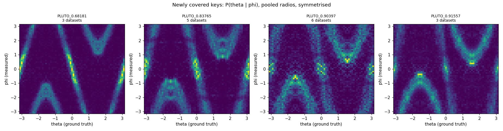
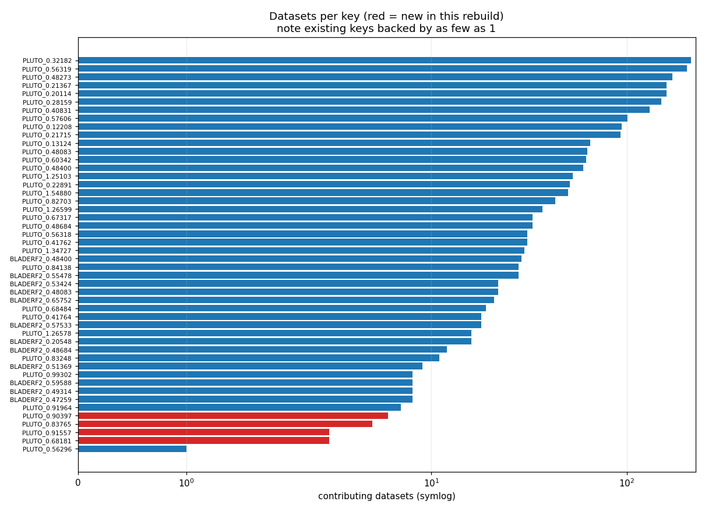
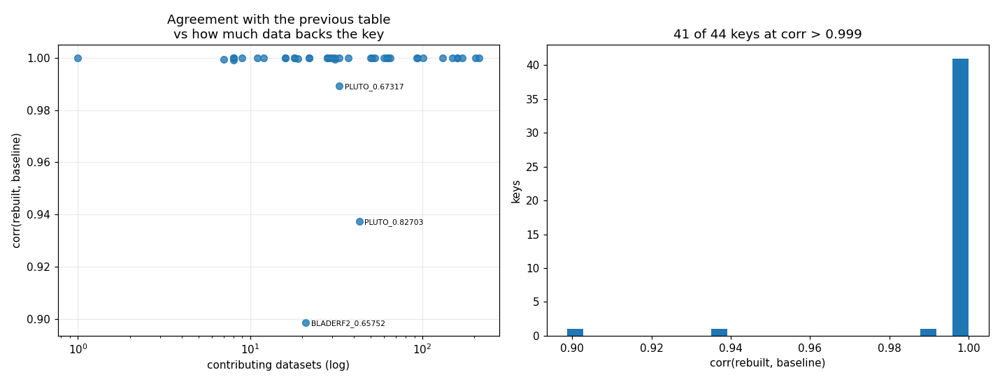
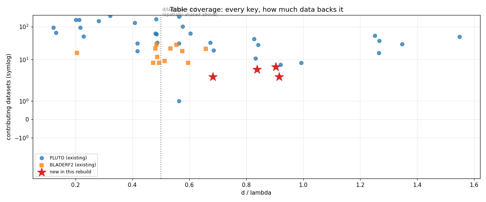

# Empirical P(θ|φ) table — full rebuild, 2026-08-09 (v1)

**Artifact:** `empirical_dists/full_20260809_v1.pkl` — 48 keys, built from 2,445 datasets.
**Replaces (does not overwrite):** `empirical_dists/full.pkl` — 44 keys, md5 `2fb15aad`, **unchanged**.
**Provenance:** embedded in the pickle under `__provenance__`; exported here as
[`provenance.json`](provenance.json). Source list: [`datasets_used.txt`](datasets_used.txt).

---

## 1. What this table is

A lookup of **P(θ | φ)** — given the phase difference measured between a receiver's two
antenna elements, the probability distribution over the emitter's angle of arrival.

It is built by histogramming **ground-truth θ against measured φ** over recorded captures
(`np.histogram2d`), normalising each φ column, and applying symmetry folds. No model and no
physics — just what the hardware actually did.

Two consumers:

- **The empirical particle filters** (`PFSingleThetaSingleRadio`, `PFSingleThetaDualRadio`,
  `PFXYDualRadio`) weight their particles with it. It *is* their likelihood — the
  non-learned counterpart to what a trained network provides in the `*_nn_*` filters, which
  is exactly what makes those two families comparable.
- **The dataset's `empirical` field**, attached per sample. Note the current models set
  `empirical_input: false`, so its **values never reach the network** — only its shape is
  used. Changing this table therefore does **not** invalidate any trained checkpoint.

### Structure

```
table[f"{SDR_DEVICE}_{d/λ:.5f}"]["r0" | "r1" | "r"]["sym" | "nosym"]  ->  65×65 float
table["__provenance__"]                                              ->  dict (new in v1)
```

Keys are `(device, d/λ)`. `get_empirical_dist` (`spf/dataset/spf_dataset.py:239`) does an
**exact string lookup**; a key that does not exist raises `KeyError` rather than falling back.

---

## 2. Why a rebuild was needed

**d/λ is derived from antenna spacing *and* carrier frequency**, so a change in either mints a
brand-new key. The 2026 rover fleet changed both — a new carrier (**5840 MHz**) and a new
antenna spacing (**0.047 m**, the RO4 rovers) — giving 3 spacings × 2 carriers = 6
combinations where the old table had only the 2 that existed when it was built:

| spacing | carrier | d/λ | in `full.pkl`? | rover-2026 stores |
|---|---|---|---|---|
| 0.035 m | 5766 MHz | 0.67317 | ✅ | 12 |
| 0.035 m | **5840 MHz** | 0.68181 | ❌ | 3 |
| 0.043 m | 5766 MHz | 0.82703 | ✅ | 19 |
| 0.043 m | **5840 MHz** | 0.83765 | ❌ | 5 |
| **0.047 m** | 5766 MHz | 0.90397 | ❌ | 6 |
| **0.047 m** | **5840 MHz** | 0.91557 | ❌ | 3 |

**17 of 48 merged rover stores had no entry**, so every empirical filter raised `KeyError` on
them. That blocked the E-INF1 sweep.

The old table *does* contain `PLUTO_0.91964` — that is the same 0.047 m antennas at
**5866 MHz**, the frequency the 2025 rovers used. Same hardware, different carrier,
different key. It is not a substitute.

---

## 3. What this action does

`spf/scripts/create_empirical_p_dist.py` loads every dataset in the list, groups them by
`(device, d/λ)`, histograms θ against φ per group, and pickles the result **plus a
provenance record**.

```bash
python spf/scripts/create_empirical_p_dist.py \
    --datasets-from-file <this report>/datasets_used.txt \
    --precompute-cache /mnt/md2/cache/precompute_cache_3p7 \
                       /mnt/qnap01/mouse9911/rovers_2026/precompute \
    --out empirical_dists/full_20260809_v1.pkl \
    --nbins 65 --nthetas 65 --device cpu
```

`--precompute-cache` takes **several** caches, searched per dataset. That is what makes a
single artifact possible at all: the historical captures are segmented under md2, the 2026
rover merges under qnap01, and the loader takes exactly one path.

Nothing is written to md2 — `segment_if_not_exist` defaults to `False`, so a dataset without
segmentation is skipped, never generated.

### Inputs

| Source | Datasets | Precompute cache |
|---|---|---|
| `/mnt/md2/cache/nosig_data/*.zarr` | 2,451 | `precompute_cache_3p7` (read-only) |
| `/mnt/qnap01/mouse9911/rovers_2026/merged/*.zarr` | 48 | `rovers_2026/precompute` |
| **requested** | **2,499** | |
| **loaded** | **2,445** | |
| **unusable** | **54** | see §6 |

Segmentation version **3.7**, 65 bins, 65 θ.

---

## 4. What the output represents

**48 keys.** Four are new; two existing keys **changed**; the rest are as before within noise.

### 4.1 The four new keys



Each shows the expected φ = 2π(d/λ)·sin θ band, wrapping more often as d/λ rises — all four
are **above the λ/2 unambiguous limit**, so the arrays are spatially aliased and the mapping
is genuinely multi-valued. `0.90397` is visibly the noisiest, which §6 explains.

| new key | spacing | carrier | datasets |
|---|---|---|---|
| `PLUTO_0.68181` | 0.035 m | 5840 MHz | 3 |
| `PLUTO_0.83765` | 0.043 m | 5840 MHz | 5 |
| `PLUTO_0.90397` | 0.047 m | 5766 MHz | 6 |
| `PLUTO_0.91557` | 0.047 m | 5840 MHz | 3 |

Three to six datasets sounds thin, but it is **squarely in line with how this table was
already built** — existing keys are backed by as few as **1** (`PLUTO_0.56296`) and **7**
(`PLUTO_0.91964`, the closest analogue to our new 0.047 m entries).



### 4.2 ⚠️ Two existing keys changed

This is the part to read carefully. The rover-2026 captures at 5766 MHz map onto keys that
**already existed**, so rebuilding folds them in:

| key | was | now | corr vs `full.pkl` | max \|Δ\| |
|---|---|---|---|---|
| `PLUTO_0.82703` | 24 datasets | **43** | **0.9374** | 0.0533 |
| `PLUTO_0.67317` | 21 datasets | **33** | **0.9894** | 0.0202 |

So this is not purely additive. Anything scored against `PLUTO_0.82703` or `PLUTO_0.67317`
— including historical wall-array captures — now uses a table that includes 2026 rover data.
That is consistent with prior practice (the old table already pooled rover and wall data for
shared keys, since the key encodes only device and d/λ, not vehicle), but it is a real
change and it is why this table gets a new name rather than replacing `full.pkl`.

### 4.3 Everything else matches



**41 of 44 legacy keys at corr > 0.999.** The three that move are the two above plus
`BLADERF2_0.65752` (corr 0.899), which lost 41 of its source datasets — see §6.



---

## 5. Provenance recorded in the file

Every table built from now on carries `__provenance__`:

| field | contents |
|---|---|
| `command`, `argv`, `cwd` | the exact invocation |
| `git` | commit, branch, **dirty flag** |
| `generator_md5` | hash of the generator source — pins the code even when the tree is dirty |
| `created_utc`, `environment` | timestamp, host, platform, python/numpy/torch |
| `params` | nbins, nthetas, device, all precompute caches, output path |
| `datasets.records` | every contributing dataset: path, bytes, mtime, **which cache served it** |
| `datasets.failures` | every dataset that could not be used, **and why** |
| `keys` | per key: dataset count, broken down by LO and spacing |

Inspect any table without unpickling by hand:

```bash
python spf/scripts/create_empirical_p_dist.py --show empirical_dists/full_20260809_v1.pkl --precompute-cache x
```

On the old table this correctly reports that it *predates* provenance recording rather than
inventing anything.

> **The tree was dirty at build time.** This machine runs several concurrent sessions, so a
> clean commit is not achievable in practice; `generator_md5` is the reliable pin on the code
> that ran.

---

## 6. Limitations and known issues

**54 datasets could not be used.** 43 fail with *"Segmentation file does not exist"* in
`precompute_cache_3p7`, the rest are spacing-consistency failures. **41 of the 54 belong to
`BLADERF2_0.65752`**, which is precisely the key whose values moved most (corr 0.899). Those
captures still exist as zarrs — they have simply lost their 3.7 precompute. Re-segmenting
them would need a cache on qnap01, since md2 is read-only here and 98% full.

**8 of the missing datasets are in the frozen val set and 9 in train.** That is an
independent data-integrity gap, and it bounds any 3.7-based evaluation.

**The RO4 rovers drop far more frames than the rest.** Valid (θ,φ) pairs as a fraction of
timesteps:

| key | valid pairs | yield |
|---|---|---|
| `PLUTO_0.68181` | 10,835 | 64.8% |
| `PLUTO_0.83765` | 11,141 | 75.8% |
| **`PLUTO_0.90397`** | **5,281** | **36.9%** |
| `PLUTO_0.91557` | 10,143 | 71.3% |

`0.90397` yields roughly half what its siblings do. This is a hardware/signal question
independent of the table, and it **confounds E-INF1's H4** ("is d/λ = 0.904 worse?") with
"RO4 simply captures less signal" — the experiment's risk table should say so.

**Circularity.** The four new keys are necessarily built from the same rover corpus they will
then score; no other data exists at those keys (0 of 2,462 historical captures use 5840 MHz,
and the historical 0.047 m data is all at 5866 MHz). This biases the empirical baseline
*upward*, which makes E-INF1's H1 ("NN beats empirical") **harder** to confirm — a safe
direction. If empirical wins, re-run with a held-out split before believing it.

**`full.pkl` cannot be reproduced exactly**, so it was not used as a base. 41 of its BladeRF
source datasets no longer load; a faithful rebuild is not achievable and pretending otherwise
would be worse than rebuilding cleanly.

---

## 7. Reproducing this report

| Step | Command |
|---|---|
| Build the table | §3 above |
| Figures | `python spf/calibrations/empirical_p_dist/make_report_figures.py --table empirical_dists/full_20260809_v1.pkl --baseline empirical_dists/full.pkl --new-keys SDRDEVICE.PLUTO_0.68181 SDRDEVICE.PLUTO_0.83765 SDRDEVICE.PLUTO_0.90397 SDRDEVICE.PLUTO_0.91557 --output-dir <this dir>/figures` |
| Provenance export | `--show` (§5), redirected to `provenance.json` |
| Tests | `pytest tests/test_empirical_p_dist.py` — 18 tests |

## 8. A note on where the table lives

`.gitignore` matches `**/*.pkl` repo-wide. `empirical_dists/full.pkl` is tracked as a
grandfathered exception, so the new table needs `git add -f` to follow the same pattern —
without it, a fresh clone has no table and every empirical filter fails.

It is 9.7 MB of binary, and a rebuild produces a new one each time. If that becomes
unwelcome in git history, the alternative is to host tables on qnap01 and keep only this
report, `provenance.json` and `datasets_used.txt` in the repo — together they fully specify
the rebuild, and `__provenance__` makes any table self-identifying once found.

## 9. How to use it

Point `--empirical-pkl-fn` at the new table:

```bash
python spf/filters/run_filters_on_data.py -d <datasets> \
    --empirical-pkl-fn empirical_dists/full_20260809_v1.pkl \
    --config spf/filters/configs/rover2026_coarse.yaml \
    --results-backend local --parallel 24
```

`empirical_dists/full.pkl` is untouched, so every existing `model_configs/*.yaml` keeps
working exactly as before. Anything that wants the new rover keys must opt in by naming the
new file.
