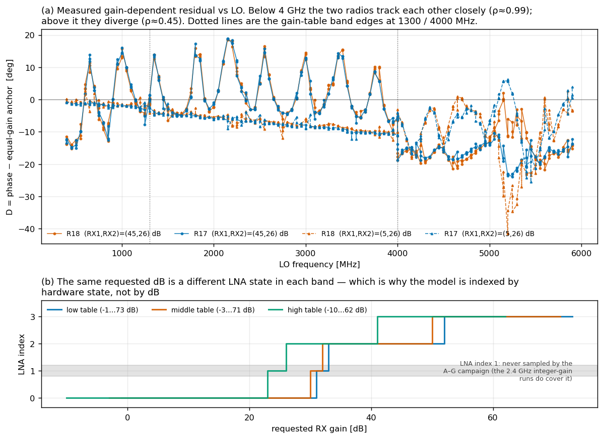
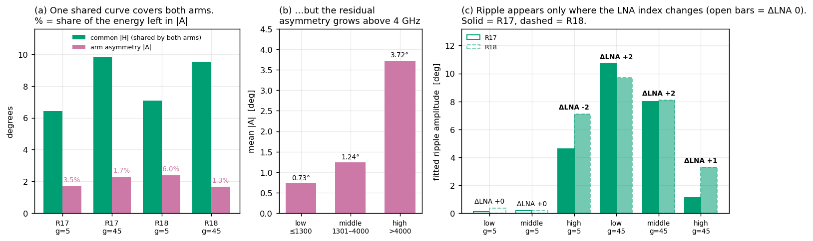
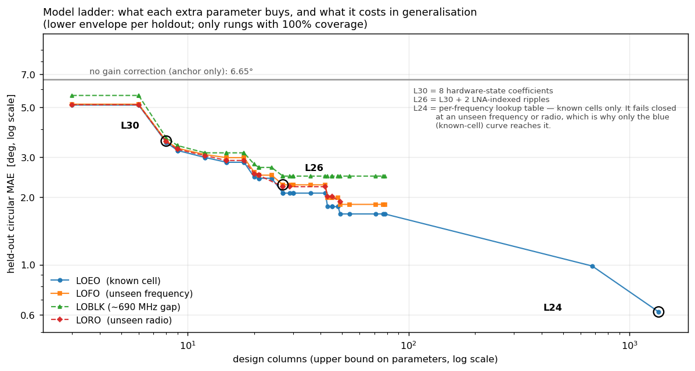
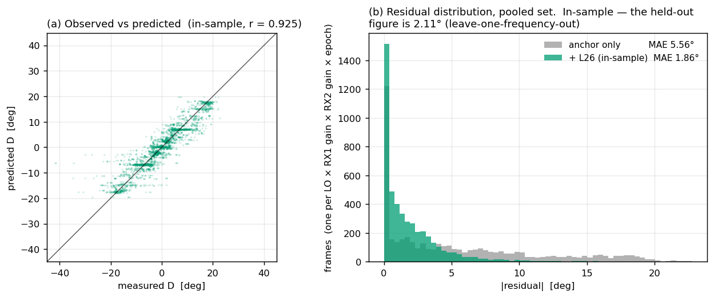
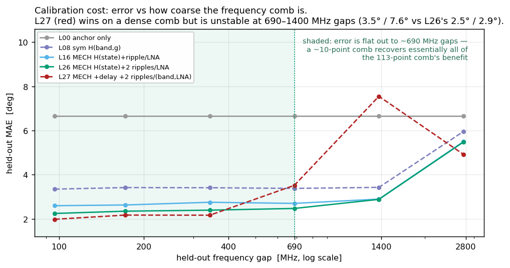
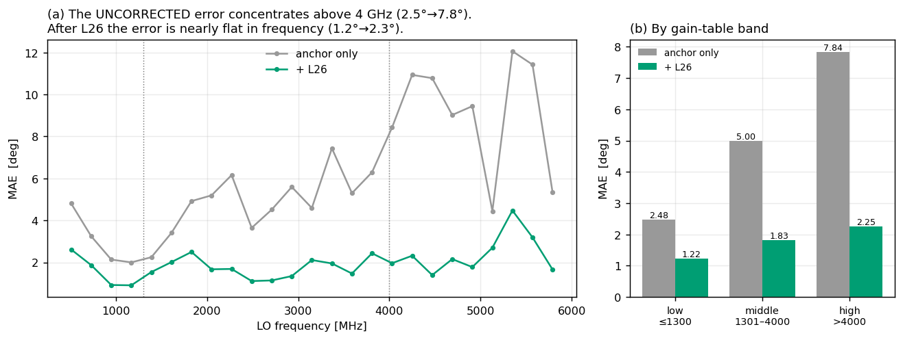
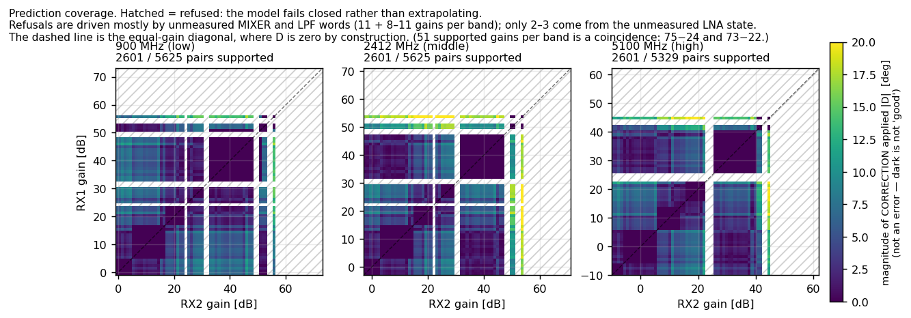

# Gain-state phase model (L26) for the AD9361 dual-RX pair

A small, universal, physically-motivated model of the **gain-dependent** part of
the `angle(RX1) − angle(RX2)` phase offset on a Pluto/AD9361 dual-receiver pair.

It exists for the one case the repository's per-frequency lookup tables cannot
serve: **a frequency, or a radio, that was never calibrated.** Where a dense
per-frequency LUT is available and the frequency will not change, that LUT
remains more accurate and should stay the accuracy reference.

```text
D(f, g1, g2) = H(s1) − H(s2)
             + Σ_{k=1,2} [ a_k(l1) − a_k(l2) ]·cos(2πf τ_k)
                       + [ b_k(l1) − b_k(l2) ]·sin(2πf τ_k)

corrected = wrap( measured_RX1_minus_RX2 − anchor(serial, LO, session) − D )
```

| | |
|---|---|
| **What it predicts** | the residual left after a measured equal-gain anchor |
| **Parameters** | 27 (stage-A fit) / 38 (pooled fit shipped here), **universal** |
| **Radio-specific state** | one measured anchor per (serial, exact LO, session) — a measurement, not a parameter |
| **No correction at all** | 14.2–14.8° MAE |
| **Anchor alone** | 6.65° MAE / 18.4° P95 / 41.6° max (8.31° on unequal-gain cells) |
| **This model, unmeasured frequency (dense-comb cross-validation)** | **2.26° MAE / 7.54° P95** (2.83° unequal-gain) |
| **Committed model, prospective 103-LO test** | **4.79–4.80° MAE / 14.37–14.56° P95** |
| **Model refitted from exactly 10 LOs** | **11.61° MAE / 41.52° P95 — rejected** |
| **This model, unmeasured radio** | **2.22° MAE**, 100% coverage |
| **Dense per-frequency LUT, known cell** | 0.62–0.90° — still the accuracy reference |

Everything here is derived from
[`../dual_rx_gain_frequency/reports/gain_state_phase_model_20260802_v1/`](../dual_rx_gain_frequency/reports/gain_state_phase_model_20260802_v1/)
(the analysis), the 2026-07-30 A–G spectroscopy campaign (the data), and
`docs/learnings.md` entry **L10** (the distilled conclusion). Verification of
every number reproduced here is in [`PROVENANCE.md`](PROVENANCE.md).

> **Prospective status (2026-08-07):** the committed L26 model reduces the
> anchor-only error from 9.06° to about 4.8° on a fresh 103-LO holdout, but a new
> fit using only ten pre-registered LOs is worse than anchor-only. The earlier
> 2.26° result trained on a dense set with frequencies or frequency blocks held
> out; it did not demonstrate that ten LOs can identify the model. Use L26 only
> as a lower-confidence unseen-LO fallback. Use the exact-frequency LUT for
> precision correction. Full results are in the source report's §8.1.

---

## Contents

1. [The problem](#1-the-problem)
2. [The model](#2-the-model)
3. [Physical backing](#3-physical-backing)
4. [How well it fits, and how well it extrapolates](#4-how-well-it-fits-and-how-well-it-extrapolates)
5. [Limitations](#5-limitations)
6. [Follow-up experiments](#6-follow-up-experiments)
7. [The code](#7-the-code)

---

## 1. The problem

A dual-RX AD9361 measures a phase difference between two receive chains. That
difference is not the geometry you want — it carries a systematic offset that
depends on the radio, the LO frequency, and **both** receiver gains.

Prior work in this repository models the **absolute** offset
`φ(radio, f, g1, g2)` with per-radio, per-frequency additive lookup tables. Those
work very well on cells they have measured (0.62–0.90° held-out MAE) and not at
all anywhere else: they fail closed on an unseen frequency or an unseen serial,
because the absolute offset contains a harness/splitter intercept `C(radio, f)`
that is large (pairwise mean **18.525°** between radios, rising to **91.214°** at
5866 MHz), unit-specific, and destroyed by a connector re-mate. That intercept is
also why leave-one-frequency-out has never beaten ~10.6° MAE in this repository:
those models had to predict `C(f)` at a frequency they had never seen.

This model splits the problem the way deployment already works. The repository's
calibration contract already mandates a **per-session equal-gain anchor** at every
operating LO. Take that anchor as an *input* and model only what is left:

```text
D(radio, f, g1, g2) = φ(radio, f, g1, g2) − φ(radio, f, g_ref, g_ref)
```

The anchor absorbs everything unit-specific. What remains — the gain dependence —
turns out to be a property of the die and of the harness topology, and is very
nearly universal.



*Panel (a) is the problem, measured. Even with a per-frequency equal-gain anchor
already applied, changing the gain pair swings the phase by tens of degrees, with
a clear periodic ripple and hard steps at the 1300 / 4000 MHz gain-table edges.
The two radios lie almost on top of each other — the first hint that the gain
response is universal. Panel (b) is the reason the model is indexed by hardware
state: the same requested dB is a different LNA index in each band.*

> **Reading the numbers.** Because `D` is defined against an anchor, this
> model's leave-one-frequency-out number is **not comparable** to the prior
> reports' leave-one-frequency-out number. Theirs answers "predict the phase at
> a frequency you have never touched." This one answers "given an anchor
> measurement at the new frequency, predict every other gain pair there." Both
> are honest; they are different questions. Section 4.8 gives the comparable
> anchored results from sibling reports.

---

## 2. The model

### 2.1 The equation

```text
D(f, g1, g2) = H(s1) − H(s2)
             + Σ_{k=1,2} [ a_k(l1) − a_k(l2) ]·cos(2πf τ_k)
                       + [ b_k(l1) − b_k(l2) ]·sin(2πf τ_k)

  s = (LNA, MIXER, TIA, LPF)  looked up in the audited gain table for (band, dB)
  l = the LNA index of that state
  H(s) = h_lna[LNA] + h_mix[MIXER] + h_tia[TIA] + h_lpf[LPF]
```

The delays are grid-searched, not assumed, and land in the same place on both
radios and across every fold. They differ slightly between fits, so quote the
set you are actually using rather than a single canonical pair:

| Coefficient set | τ1 | τ2 |
|---|---:|---:|
| `l26_stage_a_v1` — reproduces the report's §8 equation | 2.56 ns | 0.92 ns |
| `l26_pooled_v1` — **the shipped default** | 2.54 ns | 0.94 ns |

The source report's mechanism section quotes the fitted delays as 2.54 ns and
0.88–0.92 ns; its deployment equation quotes 2.56 / 0.92 ns. Both are the same
grid search on different folds.

Three structural choices carry all the content:

- **Antisymmetric.** Every term enters as `(arm 1 at this level) − (arm 2 at this
  level)`. One shared curve describes both arms. §3.1 shows this is measured, not
  assumed.
- **Indexed by hardware state, not requested dB.** `s` is read out of the audited
  AD9361 gain table. §3.2 shows requested dB is the wrong coordinate.
- **Frequency enters as a reflection ripple, not a delay or a polynomial.** Two
  shared delays, with amplitudes indexed by the **LNA** index. §3.3 gives the
  mechanism.

`D` never exceeds ±45°, so ordinary least squares on the unwrapped value is
exact — no circular machinery is needed anywhere in the fit.

### 2.2 The anchor

The anchor is the measured equal-gain cell at the same radio, LO and session:

```text
anchor(serial, LO, session) = measured φ(serial, LO, g_ref, g_ref)
```

It is a **measurement, not a fitted parameter**, and it is the *complete*
radio-specific state of the correction. It must be re-measured after any
connector re-mate, harness change, radio swap, or unvalidated boot. Every number
in this document was produced with a **single-frame** anchor, because that is
what the source schedule provided; averaging three frames in deployment can only
improve on them.

Note that the model predicts exactly zero at the equal-gain cell, by
construction — so the correction is self-consistent with its own anchor and
cannot double-count it. This is asserted in the test suite.

### 2.3 Parameter accounting

The parameter count is set by the chip, not by a modelling choice. Decoding the
audited tables for the stage-A gain set `{5, 26, 45}` across the three bands:

| band | dB | row | LNA | MIX | TIA | LPF |
|---|---:|---:|---:|---:|---:|---:|
| low | 5 | 8 | 0 | 1 | 0 | 3 |
| low | 26 | 29 | 0 | 2 | 1 | 12 |
| low | 45 | 48 | **2** | 4 | 1 | 12 |
| middle | 5 | 10 | 0 | 1 | 0 | 5 |
| middle | 26 | 31 | 0 | 4 | 1 | 8 |
| middle | 45 | 50 | **2** | 4 | 1 | 13 |
| high | 5 | 19 | 0 | 1 | 0 | 12 |
| high | 26 | 40 | **2** | 4 | 1 | 0 |
| high | 45 | 59 | **3** | 4 | 1 | 18 |

Levels present: LNA `{0, 2, 3}`, MIXER `{1, 2, 4}`, TIA `{0, 1}`,
LPF `{0, 3, 5, 8, 12, 13, 18}`.

```text
   3 + 3 + 2 + 7  = 15   static H columns
 + 4 × 3          = 12   ripple columns (cos/sin × 2 delays, indexed by LNA)
 ---------------------
                    27
```

The count does **not** grow with the number of radios, frequencies or gain pairs
— only with the number of distinct hardware states sampled. For contrast, a
per-frequency additive LUT needs `2 × N_radios × N_frequencies × N_gains`
coefficients: 1,356 for the same two radios over 113 LOs and 3 gains, 2,376 on
the six-radio grid, 13,462 on the 53-LO wide survey.

Two caveats that must travel with the number:

- **27 counts non-zero design columns, not estimable rank.** The signed-indicator
  design is rank-deficient by construction — adding a constant to any whole
  coefficient family cancels in every prediction. L26's rank on stage A is
  **14**. Predictions are invariant to this; the parameter count is an upper
  bound.
- **Individual coefficients are therefore not physically meaningful.** Only
  signed differences are identified. Read `h_lna[2] − h_lna[0]`, never
  `h_lna[2]`. The test suite asserts this gauge invariance.

The coefficient set shipped as the default here is the **pooled** fit
(stages A + F + E_tx_0 + rate_pilot: 4,641 rows, 119 LOs, 27 distinct requested
gains), which has **38** columns and rank 29. It spans far more hardware states
than the stage-A fit and so refuses far fewer cells in deployment. The 27-column
stage-A set is also shipped, because it is the one that reproduces the published
stage-A figures exactly.

### 2.4 Deployment rules

These are not advisory. Rules 1–4 are unchanged from the parent directory's
existing calibration contract; rule 5 is specific to this model.

1. **The anchor is measured, never transferred** across a re-mate, harness
   change, radio swap, or unvalidated boot. Average three frames where the
   schedule allows.
2. **Look the hardware state up in the audited table for the active band.**
   Never interpolate a requested dB across an LNA/mixer/TIA boundary.
3. **Fail closed** on any state not present in the fit. Never emit an
   extrapolated value.
4. **Above 4 GHz, keep the per-session anchor discipline.** The source
   campaign's own A→D result shows a connector re-mate can move that band by
   12–34°.
5. **Do not apply the correction when the audited `(LNA, MIXER, TIA)` words are
   identical on both arms.** There the source experiment measures no phase, and
   the fitted `h_lpf` differences are noise absorbed from bands where the LPF
   word is collinear with the RF state.

Rule 5 is worth quantifying, because it is the difference between a useful model
and a harmful one. On the 672 pooled cells where the RF words are frozen and the
gains are unequal, using held-out predictions, the unguarded model **injects a
mean 1.362° (max 4.716°) and makes 81.4% of those cells worse.** With the guard:
stage E improves 1.39° → 0.77°, stage F improves 1.98° → 1.41°, stages A and
`rate_pilot` are untouched, and the pooled unequal-gain LOFO error improves
2.51° → 2.35°.

The guard is **on by default** in this implementation. Models carrying no
categorical LPF term (`L30`, `L31`, also shipped here) are neutral in that
regime *by construction* and need no guard — verified at exactly 0.0000°
injected on all 1,418 frozen cells.

---

## 3. Physical backing

The model's form is not a curve-fitting convenience. Each structural choice
corresponds to a measured property of the hardware. This section states what
each claim is, and how strong the evidence actually is.



*The two structural choices, in measured quantities. (a) The arm asymmetry `|A|`
is a small fraction of the common response `|H|` — 1.3–6.0% of the energy — which
is what licenses one shared curve for both arms. (b) That approximation thins out
above 4 GHz. (c) The ripple appears **only** where the LNA index changes between
the two arms; where ΔLNA = 0 the amplitude is ≤0.36°, and the ordering inverts
across the 4 GHz band edge exactly as the gain tables dictate.*

### 3.1 The two RX arms respond to gain identically (94–99%)

**Measured model-free — no fit involved.** The additive-cross schedule measures
both `(g, 26)` and `(26, g)` at every LO, so the gain response splits with no
model assumption at all:

```text
common     H(f,g) = [ D(g,26) − D(26,g) ] / 2      shared by both arms
asymmetry  A(f,g) =   D(g,26) + D(26,g)            zero if the arms are identical
```

| Radio | g | mean&#124;H&#124; | mean&#124;A&#124; | asymmetric energy |
|---|---:|---:|---:|---:|
| R17 | 5 | 6.41° | 1.70° | 3.5% |
| R17 | 45 | 9.85° | 2.29° | 1.7% |
| R18 | 5 | 7.09° | 2.38° | 6.0% |
| R18 | 45 | 9.54° | 1.66° | 1.3% |

This is stronger evidence than a fit: the asymmetry was *measured directly* and
found near zero, rather than assumed away and found not to hurt.

**Where it thins out.** The residual asymmetry is not uniform in frequency:

| Band | mean&#124;A&#124; | p95 | max |
|---|---:|---:|---:|
| low ≤1300 MHz | 0.73° | 2.55° | 4.24° |
| middle 1301–4000 MHz | 1.24° | 4.22° | 6.23° |
| high >4000 MHz | **3.72°** | 10.84° | 23.71° |

An arm-specific term is not needed for the aggregate, but above 4 GHz is where
one would first be needed. **E-CAL4** is the designed test.

**Sharing between radios is substantial but not uniform:**

| | overall ρ | low | middle | high | mean&#124;R17−R18&#124; |
|---|---:|---:|---:|---:|---:|
| g = 45 vs 26 | 0.985 | 0.996 | 0.996 | 0.451 | 0.94° |
| g = 5 vs 26 | 0.631 | 0.572 | 0.974 | 0.480 | 1.64° |

The strong claim holds for the large-`H` case below 4 GHz. Above 4 GHz, and for
the small-`H` g=5 case, the two radios agree much less well (ρ ≈ 0.45–0.48).
That is consistent with §3.3 — above 4 GHz the ripple dominates `H`, and the
ripple depends on each unit's own harness termination.

### 3.2 Phase tracks the AD9361 RF state, not the requested dB

**A natural experiment with a clean control.** Splitting every adjacent 1 dB
step by exactly which audited word it changes:

| The 1 dB step changes | n | (radio, LO) clusters | median &#124;ΔH&#124; | mean | p90 | max |
|---|---:|---:|---:|---:|---:|---:|
| the **mixer** word | 12 | 12 | **2.664°** | 3.182° | 4.881° | 6.592° |
| the **TIA** word only | 4 | 4 | 0.339° | 0.348° | 0.649° | 0.689° |
| the **LNA** word | **0** | — | *never measured at 1 dB* | | | |
| the baseband **LPF** word only | 132 | 14 | **0.343°** | 0.410° | 0.871° | 2.596° |

- **The mixer word is the measured driver.** 2.664° vs 0.343° is a 7.76× ratio;
  cluster bootstrap over (radio, LO) clusters gives a 95% CI of **[5.1, 16.3]**,
  Mann-Whitney p = 1.0e-8. Effective sample size is 12 clusters, not 12 i.i.d.
  observations.
- **The measurement floor is measured, not assumed.** Recomputing `H` within each
  epoch and taking the across-epoch standard deviation of every 1 dB step gives a
  median of 0.61–0.64°, i.e. a standard error of **0.355–0.368°** on the
  three-epoch mean. The LPF-only median of 0.343° and the TIA-only median of
  0.339° therefore sit *at or below* the noise floor; the mixer median is 7.4×
  it.
- **The TIA result is a null, not a zero.** 0.339° vs 0.343°, Mann-Whitney
  p = 0.995 on n=4. A baseband stage contributing no phase is what the
  architecture predicts, but n=4 cannot establish it.
- **No adjacent-1 dB LNA transition exists *in the A–G campaign*.** The only LNA
  changes measured there are four 9 dB steps (17→26 dB at 5766/5866 MHz), worth
  5.42°, 5.58°, 9.78° and 10.03°. Within that campaign the LNA's role rests on
  those and on the ripple of §3.3.

  **But the repository has adjacent-1 dB LNA steps elsewhere, and they support
  the claim strongly.** The 2.4 GHz integer-gain experiments swept *every*
  integer gain from −3 to 71 dB on both axes at 2412/2467 MHz, on these same two
  radios, which brackets all three middle-band LNA boundaries at 1 dB. Decoding
  the audited middle table against the steps those reports published:

  | Step | Words that change | Published phase step |
  |---|---|---:|
  | 14→15 dB | MIXER 1→2, LPF | +4.1° to +4.2° |
  | 24→25 dB | MIXER 2→4, LPF | +2.5° to +2.9° |
  | **31→32 dB** | **LNA 1→2**, LPF | **−2.6° to −4.4°** |
  | **49→50 dB** | **LNA 2→3**, LPF | **−14.3° to −16.7°** |

  Every one of these is an RF-word step accompanied by an LPF move, and an
  LPF-only step is worth 0.343°, so the RF word dominates in each. The mixer
  steps land at the same order as the campaign's 2.664° median. The LNA steps
  are 2.6–16.7° — far larger, as the ripple mechanism implies. The source report
  does not cite these; they are a different experiment on different dates, so
  they are **not poolable with the campaign's `H` statistics as-is**, but they
  are direct adjacent-1 dB LNA evidence that no longer needs a new capture.
  See E-CAL2 in §6.

**The cleanest single demonstration** is stage E. Across 27→40 dB at 5100 and
5766 MHz the audited state never leaves `(LNA 2, MIX 4, TIA 1)` — only the
baseband LPF word walks — and `|H|` stays under **0.60°** on three of the four
radio×LO curves and under 1.79° on the fourth. *Thirteen dB of gain, essentially
no phase.* By contrast the 5→10 dB step at the same LOs, which crosses
`MIX 1→2`, is worth **6.20–8.56°**.

**The concrete payoff.** Indexing by hardware state instead of requested dB
raises the fraction of *unseen requested gains* that are predictable at all from
**48% to 90%** (§4.5).

### 3.3 The frequency dependence is an LNA-state-modulated standing wave

An AD9361 LNA state change alters the receiver input impedance. Against a
mismatched source (30 dB pad → splitter → cable), a change in `Γ_RX` changes the
round-trip standing wave, contributing a phase periodic in frequency with period
`1/τ`:

```text
ΔΦ(f, g) ≈ Re{ ρ(state(g))·e^{−j2πfτ} } = a(state)·cos(2πfτ) + b(state)·sin(2πfτ)
```

The falsifiable prediction is that **ripple amplitude tracks the LNA index
change, not the requested dB** — and since the LNA index at a given dB differs
per band, the same requested gain *must* ripple differently in each band:

| Band | ΔLNA for g=5 vs 26 | amplitude R17 / R18 | ΔLNA for g=45 vs 26 | amplitude R17 / R18 |
|---|---:|---:|---:|---:|
| low ≤1300 | 0 | 0.11° / 0.36° | +2 | 10.7° / 9.7° |
| middle 1301–4000 | 0 | 0.19° / 0.18° | +2 | 8.0° / 8.1° |
| high >4000 | **−2** | 4.6° / 7.1° | **+1** | 1.1° / 3.3° |

Every `ΔLNA = 0` cell is at or below 0.36°; every `ΔLNA ≠ 0` cell is at or above
1.1°; and **the ordering inverts across the 4 GHz band edge** exactly as the
audited tables dictate (see the decode in §2.3: at 26 dB the high band is already
at LNA 2 while low and middle are still at LNA 0).

Four independent corroborations:

1. **The fitted delays agree across radios.** 2.54 ns and 0.88–0.92 ns, fitted
   independently on both units, consistent with the campaign's separately-derived
   2.5475 ns / 1.0075 ns components.
2. **The pad experiment.** In the A–G campaign, an 11 dB pad on the treated
   radio's RX1 reduced the 2.548 ns component from 5.34° to 0.99° (**81.5%
   suppression**) while the three untouched arms retained a median 98.6% of
   baseline. That is the external-path prediction, tested physically.
   *The campaign is explicit that this is not a clean pad-only causal proof* —
   restoring the harness in stage D did not restore the high-band stage-A state,
   so connector re-mating or a persistent treatment-radio state change remains a
   material confound.
3. **A retrodiction.** The wide survey had found the low-band gain curves at 433
   and 600 MHz *anticorrelated* (ρ = −0.2223 / −0.1585) and flagged it as
   anomalous. Those frequencies are 167 MHz apart, and 167/392.5 = 0.43 of a
   ripple period ≈ 153° of ripple phase — near antiphase. **Anticorrelation is
   what the mechanism predicts; it is not an anomaly.**
4. **It beats a bigger, unconstrained basis.** `L29` gives a fixed-delay Fourier
   basis (0.5–3.0 ns) with amplitudes free per requested gain — 45 parameters
   against L26's 27 — and is worse at *every* holdout (3.10° vs 2.50° LOFO).
   Constraining the ripple amplitude to the LNA state is doing real work.

### 3.4 Band-edge steps are a universal hardware effect

Trend-corrected discontinuity across the gain-table edges:

| Edge | g=5, R17 / R18 | g=45, R17 / R18 |
|---|---:|---:|
| 1300 → 1301 MHz | −1.43° / −1.73° | +10.11° / +9.96° |
| 4000 → 4001 MHz | +6.48° / +5.96° | −7.51° / −7.14° |

Both radios agree to well under 1°. These are not per-unit artifacts — they are
the AD9361 switching gain tables. Any model expressed in requested dB must be
band-conditioned or state-indexed to represent them at all.

### 3.5 Nothing needs to be radio-specific

The three gain tables are **byte-identical between the two audited radios**, so
the map `(band, requested dB) → (LNA, MIX, TIA, LPF)` is universal chip data, not
a fitted quantity. The export asserts this rather than silently picking one
radio, and the test suite re-checks it.

Empirically (§4.4), promoting any parameter family to per-radio changes
same-radio error by ≤0.014° and gives an unseen radio no coverage at all.

Read the scope carefully: this is a statement about **held-out prediction
error**, not about parameter equality. §3.1 shows the fitted curves diverge above
4 GHz (ρ ≈ 0.45).

### 3.6 What the physics does *not* establish

Stated plainly, because a "mechanistic" label can oversell:

- **`h_tia` earns nothing, and on stage A it is not even identified.** The
  source report states it "is separately identified but fits to −0.20 ± 0.42°",
  and that removing it moves every holdout number by ≤0.01°. The second half
  holds. The first does not hold on stage A, and I could not reconcile the
  quoted value with the shipped coefficients, so use them rather than it:

  On stage A the TIA family is **perfectly collinear with MIXER = 1** — TIA 0
  occurs only at 5 dB, which is also the only MIX 1 cell, in all three bands.
  The ridge therefore splits one shared coefficient 50/50, which is exactly what
  the fitted numbers show: `h_tia = {0: −0.9388, 1: +0.9388}` alongside
  `h_mixer[1] = −0.9388`. That ±0.9388 is a gauge artifact, not a measurement.
  The identified TIA difference is 1.88° on stage A and 1.29° on the pooled fit
  — neither matches −0.20 ± 0.42°. Nothing downstream depends on this: TIA
  contributes ≤0.01° to every holdout either way, and §3.2 measures the TIA
  1 dB step at the noise floor. Treat `h_tia` as unidentified, not as zero.
- **`h_lpf` is fitting noise, and is actively harmful without rule 5.** See
  §2.4.
- **The fitted delays are effective electrical group delays.** They do not
  identify a specific cable, trace, or filter.
- **The RF-state attribution is still confounded with RF-DC recalibration.**
  `RF_DC_CAL` (byte 2 bit 5) is set on exactly the rows that begin a new
  LNA/mixer/TIA state. The excluded `F_neg` stage bounds an RF-DC-only step at
  **≲0.7°** (n=24, median 0.722°) against a **4.364°** LMT step at the same LOs
  (Mann-Whitney p = 0.849 for RF-DC-only vs LPF-only, i.e. indistinguishable;
  p = 1.0e-5 for the LMT change vs everything else). At n=4 rising edges it does
  not resolve the attribution to the 0.35° level. **Read §3.2 as "the RF-state
  transition, including any RF-DC correction it triggers."** **E-CAL1** closes
  this.
- **Digital gain is excluded by measurement, not assumption.** Byte 2 bits 4:0
  are identically zero on all 231 rows — re-verified by this package's test
  suite — which is what licenses reading bit 5 as `RF_DC_CAL`.

---

## 4. How well it fits, and how well it extrapolates

Holdout definitions. An unsupported test cell **fails closed to the anchor**;
an extrapolated value is never reported as a deployment number.

| Split | What is held out | What it measures |
|---|---|---|
| **LOEO** | one randomized epoch | repeatability on an already-measured cell |
| **LOFO** | one LO (50 MHz neighbours retained) | predicting an unmeasured frequency |
| **LOBLK** | a contiguous ~690 MHz block | honest interpolation across a real gap |
| **LORO** | one physical serial | transfer to an unseen radio |
| **LOBAND** | a whole gain-table band | extrapolation |

### 4.1 Baseline — what you have today

Measured on stage A, both radios, all quality-valid frames.

| Baseline | R17 MAE / P95 / max | R18 MAE / P95 / max |
|---|---:|---:|
| **B0 no correction (raw `RX1−RX2`)** | **14.24° / 55.2° / 99.0°** | **14.76° / 63.1° / 130.9°** |
| B1 one constant per radio | 13.24° / 45.1° / 88.4° | 14.86° / 62.9° / 130.3° |
| B2 per-frequency constant, gain-blind | 6.70° / 17.9° / 24.2° | 6.81° / 18.5° / 37.2° |
| **B2b per-frequency equal-gain anchor** | **6.67° / 18.1° / 26.0°** | **6.76° / 18.4° / 41.3°** |
| — restricted to unequal-gain cells | 8.25° / 18.6° / 26.0° | 8.35° / 18.7° / 41.3° |
| B3 saturated per-cell LUT (in-sample floor) | 0.40° / 1.5° / 5.2° | 0.44° / 1.7° / 4.7° |

B1 reproduces the prior reports' `constant_per_radio` figure of 14.302° for this
dataset, which cross-validates the extraction. Scored against a per-**epoch**
anchor and pooled over both radios the baseline is **6.647° MAE** (**8.310°** on
unequal-gain cells) — the `L00` row every model below is measured against.

> **Every MAE below includes the equal-gain anchor cell**, whose residual is
> identically zero by construction: 20.0% of stage-A rows, 16.1% pooled. This
> matches what the prior reports do, for comparability. For the error on cells a
> deployed correction actually acts on, use the `uneq` column, or multiply by
> **1.250** (stage A) / **1.192** (pooled). Rankings and ratios are unaffected.

### 4.2 The model ladder

| Model | Params | LOEO MAE / uneq | LOFO MAE / uneq | LOBLK | LORO | LOBAND |
|---|---:|---:|---:|---:|---:|---:|
| L00 anchor only | 0 | 6.65 / 8.31 | 6.65 / 8.31 | 6.65 | 6.65 | 6.65 |
| L01 sym H(g), universal | 3 | 5.12 / 6.40 | 5.16 / 6.45 | 5.64 | 5.13 | 7.34 |
| L05/L06/L08 sym H(state) universal | 15 / 9 / 9 | 3.21 / 4.02 | 3.29 / 4.11 | 3.38 | 3.25 | fails closed |
| L11 + delay(g) | 12 | 2.99 / 3.74 | 3.08 / 3.85 | 3.14 | 3.05 | fails closed |
| L14 + 1 ripple, amp per g | 15 | 2.85 / 3.56 | 2.99 / 3.73 | 3.25 | 2.90 | fails closed |
| **L16 MECH: H(state) + ripple per LNA** | **21** | 2.42 / 3.02 | 2.50 / 3.12 | 2.70 | 2.49 | fails closed |
| L18 + 2 ripples, amp per g | 21 | 2.54 / 3.18 | 2.70 / 3.37 | 3.49 | 2.71 | fails closed |
| **L26 MECH: H(state) + 2 ripples per LNA** | **27** | **2.08 / 2.60** | **2.26 / 2.83** | **2.47** | **2.22** | fails closed |
| L27 MECH: + delay(state), ripples per (band,LNA) | 49 | 1.68 / 2.10 | 1.85 / 2.32 | **3.52** | 1.91 | fails closed |
| L29 AGNOSTIC: Fourier basis per g | 45 | 2.75 / 3.44 | 3.10 / 3.88 | 4.03 | 2.92 | fails closed |
| **L30 MIN: H(lna,mixer,tia) only** | **8** | 3.49 / 4.37 | 3.54 / 4.42 | 3.66 | 3.52 | 6.22 |
| L31 MIN + 2 ripples per LNA | 20 | 2.45 / 3.06 | 2.58 / 3.22 | 2.79 | 2.54 | 6.82 |
| L33 MIN + ripples/(band,LNA) + LPF slope | 43 | 1.81 / 2.26 | 1.99 / 2.48 | 3.58 | 2.00 | fails closed |
| L21/L22 smooth quad(f) per band-gain | 54 / 78 | 2.80 / 2.15 | 3.00 / 2.41 | **10.38 / 9.56** | fails closed | fails closed |
| L23 per-frequency antisym LUT per radio | 678 | 0.99 / 1.23 | fails closed | fails closed | fails closed | fails closed |
| L24 per-frequency additive LUT per radio | 1356 | **0.62 / 0.77** | fails closed | fails closed | fails closed | fails closed |



*The whole modelling argument in one plot. On a **known cell** (blue) error keeps
falling with parameter count all the way to the 1356-column LUT at 0.62°. On a
**real ~690 MHz frequency gap** (green) it flattens at ~2.5° from about 25
columns onward — past L26, extra parameters buy nothing you can deploy at an
unmeasured frequency. Unseen-radio (red) tracks unseen-frequency almost exactly,
which is the "nothing is radio-specific" result. Only rungs with 100% coverage
appear; the LUT rungs are absent from the green/orange/red lines because they
fail closed there.*



*Does the fitted form actually describe the data? (a) Predicted against measured
`D`, in-sample. (b) The residual distribution collapses toward zero. Both panels
are **in-sample** — the honest held-out number is 2.11°, not 1.86°.*

What the ladder shows:

- **L24 reproduces the published stage-A figure** (0.62° here vs 0.632°
  published), confirming the independent extraction path.
- **Re-indexing by hardware state is free accuracy.** L05/L06/L08 are numerically
  identical because on stage A's three gains "band × dB", "gain-table row" and
  "(LNA,MIX,TIA,LPF)" are the same partition. L06 gets there with 9 parameters
  instead of 15 — and only L05/L06 stay meaningful when the gain set widens.
- **The ripple term is where frequency generalisation comes from:** L08 → L16 is
  3.29 → 2.50 LOFO for 12 extra parameters.
- **Smooth-in-frequency terms are dangerous.** L21/L22 look fine under LOFO
  (neighbours retained) and blow up under LOBLK to 9.6–10.4° with a maximum of
  173.6°. That maximum is **wrap-saturated** — the true excursion is larger.
  Polynomial extrapolation in frequency must not be shipped.
- **Richer is not better once the gap is real.** L27 wins LOFO (1.85°) but loses
  to L26 under LOBLK (3.52 vs 2.47). **L26 is the robust recommendation**; L27 is
  the accuracy ceiling when the comb is dense.

**Pooled (A + F + E + rate_pilot; 119 LOs, 27 gains, 4,641 cells).** Baseline
`D` = 5.56° MAE / 17.86° P95 (6.62° unequal-gain). Leave-one-frequency-out:

| Model | Params | MAE | P95 |
|---|---:|---:|---:|
| L00 anchor only | 0 | 5.56 | 17.86 |
| L01 sym H(g) universal | 27 | 4.54 | 15.00 |
| **L30 MIN, no frequency terms at all** | **9** | **2.99** | 11.39 |
| L31 MIN + 2 ripples per LNA | 21 | 2.26 | 7.36 |
| **L26 MECH** | **38** | **2.11** | **6.69** |
| L33 | 45 | **1.93** | **6.58** |
| L24 per-frequency additive LUT | 1748 | unsupported | — |

**Nine parameters** — one per LNA, mixer and TIA state, no frequency terms
whatsoever — already cut the error by 46% across 119 frequencies and 27 gains,
universally across both radios.

### 4.3 Unmeasured frequencies, and what calibration costs

| Held-out frequency gap | L08 | L16 | **L26** | L27 |
|---|---:|---:|---:|---:|
| 96 MHz | 3.35 | 2.60 | **2.25** | 1.98 |
| 172 MHz | 3.42 | 2.63 | **2.35** | 2.17 |
| 344 MHz | 3.41 | 2.75 | **2.40** | 2.17 |
| 688 MHz | 3.38 | 2.70 | **2.47** | 3.52 |
| 1375 MHz | 3.43 | 2.90 | 2.88 | 7.55 |
| 2750 MHz | 5.96 | 5.50 | 5.48 | 4.92 |



*Why L26 rather than the more accurate L27: on a dense comb L27 (red) wins, but
past ~690 MHz gaps it diverges badly while L26 (green) stays flat. The shaded
region is where a deployable comb would actually live.*

The retrospective error is **flat from 96 MHz to ~690 MHz held-out gaps** when
the fit still has the rest of the dense comb available. That demonstrates
interpolation across a missing interval; it does not show that a ten-point comb
can identify the nonlinear frequency basis.

**Prospective consequence:** E-CAL3 rejected the proposed ~10-point calibration.
Fitting L26 from exactly ten pre-registered LOs gave 11.61° MAE on the other 103
LOs, versus 9.06° for the anchor alone. Applying the already committed dense-fit
coefficients gave 4.79–4.80° MAE, so useful frequency structure transfers, but
not at the claimed ≤3° precision. Sparse calibration now requires a frequency
basis learned from dense fleet data and an identifiability-optimised LO set.

### 4.4 Unseen radios — what is radio-specific? Nothing but the anchor

| Variant | Params | LOEO MAE | LORO MAE | LORO coverage |
|---|---:|---:|---:|---:|
| **all universal** | **43** | **1.810** | **2.003** | **1.00** |
| + per-radio static H | 52 | 1.808 | — | 0.00 |
| + per-radio delay | 49 | 1.822 | — | 0.00 |
| + per-radio ripple amplitudes | 71 | 1.824 | — | 0.00 |
| + everything per-radio | 86 | 1.816 | — | 0.00 |

Making any family per-radio changes same-radio error by at most **0.014°** — far
inside the predeclared 0.1° practical-equivalence margin — and gives an unseen
radio **no coverage at all**. The minimal radio-specific state is therefore:

```text
one measured anchor per (serial, exact LO, session)   ← 1 frame here, 3 recommended
+ 27 universal parameters shared by every unit        ← L26
```

This sharpens the existing four-radio finding that the intercept is unit-specific
(18.525° pairwise) while the gain *shape* is not (<1° median).

### 4.5 Unmeasured requested gains

Holding out every cell whose probe gain equals `g` (pooled set):

| Model | coverage | supported MAE / P95 |
|---|---:|---:|
| L01 sym H(g) — requested dB LUT | **0.48** | 3.00 / 10.45 |
| L05 sym H(lna,mixer,tia,lpf) | 0.89 | 3.29 / 13.19 |
| L30 MIN H(lna,mixer,tia) | **0.90** | 3.32 / 12.26 |
| L31 MIN + 2 ripples per LNA | **0.90** | 3.09 / 11.28 |
| L32 MIN + ripples/(band,LNA) + delay | 0.70 | **2.25 / 8.20** |
| L24 per-frequency additive LUT | 0.16 | 0.93 / 2.93 |

Dropping the baseband-LPF categorical is what buys the coverage: **48% → 90% of
unseen requested gains become predictable at all**, at similar per-cell accuracy.
That is the concrete payoff of parameterising by hardware state.

### 4.6 Across a session boundary — partial

Train on stage A, predict a later stage (anchor re-measured in that stage):

| Test stage | baseline | L16 (21 p) | L26 (27 p) | L27 (49 p) | L24 (1356 p) |
|---|---:|---:|---:|---:|---:|
| G — 12 h later, hot, same harness | 7.66 | 4.25 | 3.99 | 3.56 | 2.74 |
| D — harness removed and restored | 7.68 | 4.25 | 3.99 | 3.56 | 2.74 |
| B — 11 dB pad on treated RX1 | 6.59 | 2.85 | 2.55 | 2.19 | 1.57 |
| C — 30 cm jumper on treated RX1 | 7.71 | 4.33 | 4.04 | 3.68 | 3.02 |

Every model roughly halves the error across a session boundary, but **nothing
reaches its within-session accuracy** — even the 1356-parameter LUT degrades from
0.62° to 2.74°. There is real session-to-session drift in the *gain-dependent*
term, not only in the intercept. A stored gain model plus a fresh anchor is worth
having; it is **not** equivalent to a fresh calibration.

### 4.7 Where it fails: no extrapolation across a gain-table band

Pooled leave-one-gain-table-band-out (train on two bands, predict the third):

| Model | coverage | fail-closed MAE |
|---|---:|---:|
| L00 anchor only | 1.00 | 5.56 |
| L30 MIN H(lna,mixer,tia) | 0.90 | 5.09 |
| L16 MECH | 0.81 | 5.09 |
| L08 sym H(band,g) | 0.00 | 5.56 |

An 8% improvement, and worse than baseline within the low band. The
hardware-state parameterisation makes the *discrete* part portable, but `H` and
the ripple amplitudes genuinely depend on frequency, and the three bands occupy
disjoint frequency spans — so this is extrapolation, and it fails for the same
reason the polynomial models fail under LOBLK.



*Where the error actually lives. The correction works everywhere, but both the
uncorrected and the corrected error grow with frequency: 1.22° in the low band
against 2.25° in the high band. That is the same >4 GHz region where §3.1 shows
the arm asymmetry growing and §3.1 shows the two radios' curves decorrelating.*



*Fail-closed behaviour, made visible. Every hatched cell is a gain pair the model
**refuses** rather than extrapolating. Of the full integer gain grid at 2412 MHz,
2,601 of 5,625 ordered pairs are supported; the rest fail closed to the anchor.
The colour is the size of the **correction**, not an error — dark is not "good".*

*Worth reading carefully, because it corrects an impression the limitations
section could otherwise leave: **most refusals are unmeasured MIXER and LPF
words, not unmeasured LNA states.** Per band, 11 gains are refused for an
unestimated mixer level and 8–11 for an unestimated LPF level, against only 2–3
for the LNA. E-CAL2's LNA fill is worth doing for the mechanism, but it would
not by itself open up much of this grid — widening the **requested-gain** set at
the operating LOs would. (The 51 supported gains per band is a coincidence of
75−24 and 73−22, not a shared cause.)*

Part of this is a **coverage hole**, not only an extrapolation limit: within the
A–G campaign **LNA index 1 was never measured at any frequency**, and LNA index 3
only in the high band. (The 2.4 GHz integer-gain runs do reach LNA 1, but at two
LOs in one band — not enough to make a frequency-spanning fit band-portable.)
**E-CAL2** separates the two causes.

### 4.8 Versus the per-frequency LUT — different jobs

Absolute-convention numbers, for contrast. These are **not** on the same scale as
the ladder above (no anchor is supplied):

| Model | Params | Known-cell MAE / P95 | Unseen freq | Unseen radio |
|---|---:|---:|---:|---:|
| Constant per radio | 6 | 20.25° / 51.3° | 21.9° | — |
| **`frequency_specific_additive_gain_per_radio`** (exported runtime model) | 2376 | **0.904° / 3.08°** | unsupported | unsupported |
| Full frequency × gain-pair LUT per radio | 20808 | 0.956° / 3.30° | unsupported | unsupported |
| Strict universal per-frequency additive LUT | 396 | 8.465° / 37.5° | — | 10.51° |
| Universal LUT + one anchor at the operating LO | 396 + 1 meas. | — | — | 3.385° (4 boards) |

The directly comparable *anchored* results from sibling reports are strong:
directional gain-curve transfer between these same two radios reaches
**1.25–1.27°** MAE, and the wide 53-LO survey's per-radio per-frequency additive
LUT reaches **0.713°** LOEO with **1.31–1.36°** on genuinely off-axis gain pairs.

**What this model adds is not a lower number than curve transfer.** It is a
mechanistic parameterisation that also covers unmeasured frequencies and
unmeasured requested gains, at 27 stage-A columns (38 in the wider-coverage
pooled default). These designs have rank 14 and 29 respectively; only signed
differences, not individual coefficients, are identified.

Where dense per-frequency calibration exists and the frequency will not change,
`frequency_specific_additive_gain_per_radio` remains more accurate (0.62° vs
2.08° LOEO) and should stay the accuracy reference.

---

## 5. Limitations

**Scope of the evidence**

- **Two radios, one harness topology, one temperature history, all cabled.**
  Leave-one-radio-out over two units is weak evidence for universality, and both
  units shared a harness. The claim to carry forward is "no radio-specific gain
  parameter was *needed* here", not "none can ever be needed."
- **Over-the-air transfer, fleet-wide prevalence, and general unequal-arm level
  sensitivity are all outside the source campaign.**
- **Stage A carries only three requested gains**, so on stage A alone
  "band × dB" and "hardware state" are the same partition. The distinction is
  only tested by pooling stages F and E.

**Statistical caveats**

- **Headline MAEs include the equal-gain anchor cell**, whose residual is zero by
  construction (20.0% of stage-A rows, 16.1% pooled). Multiply by 1.250 / 1.192
  for deployed-cell error. Rankings and ratios are unaffected.
- **L26 is the argmin of the LOBLK column**, so its 2.47° carries selection
  optimism. Rotating the block boundaries by 3, 7 and 10 LO indices — partitions
  that played no part in the choice — gives 2.472 / 2.502 / 2.679° against 2.473°
  at the selection partition, so the optimism is **≈0.06°**, and L26 is the argmin
  at every rotation. The paired per-fold margins over the next-best rungs are
  nonetheless **inside fold noise** (L26−L16 = +0.225 ± 0.209°, better in 6/8
  folds; L26−L31 = +0.306 ± 0.237°, 5/8 folds). Prefer L26 for its parameter
  count and its breadth across holdout configurations, **not** for the third
  decimal of its MAE.
- **The anchor is a single frame from the same epoch as the test cell.** That
  mirrors deployment, but it means these numbers exclude anchor-measurement noise
  from a separate session — and §4.6 shows that boundary is where real drift
  lives.
- **`params` counts non-zero design columns, not estimable rank.** L26's rank on
  stage A is 14 of 27 columns; on the pooled fit, 29 of 38.

**Model behaviour**

- **Every rung carrying a categorical baseband-LPF term (L05, L16, L26, L33) is
  net-harmful where both arms share the same RF words**, absent the rule-5 guard
  (§2.4). L30 and L31 are neutral there by construction.
- **It does not extrapolate across a gain-table band** (§4.7).
- **Do not fit smooth polynomials in frequency** — they blow up to 9.6–10.4° MAE
  across a real 690 MHz gap, with a wrap-saturated 173.6° maximum.
- **A stored gain model does not match a fresh calibration** (§4.6).
- **Coefficients are gauge-dependent** and individually meaningless (§2.3).

**Coverage holes**

- **LNA index 1 was never measured *in the A–G campaign*, at any frequency**;
  LNA index 3 only in its high band. The requested gains that would visit LNA 1
  are 31–32 dB (low), 30–31 dB (middle), 23–25 dB (high) — none were scheduled.
  The shipped coefficients therefore refuse them; they do not interpolate.
  **Scope this claim carefully:** the 2.4 GHz integer-gain experiments *do*
  cover LNA 1, at 30–31 dB in the middle band, on these same two radios — but at
  only two LOs and in one band, so they do not fill the hole for a
  frequency-spanning fit (§3.2).
- **No adjacent-1 dB LNA transition was measured in the campaign** — though
  three were measured at 2.4 GHz by a different experiment (§3.2). Within the
  campaign the LNA's role rests on four 9 dB steps and on the ripple.
- **Gains 8 and 9 dB appear at no high-band LO in any stage of either campaign**,
  which is what blocks the high-SNR arm of the RF-DC discriminator.

**Attribution**

- **The RF-state vs RF-DC-recalibration confound is bounded, not resolved**
  (§3.6).
- **Fitted delays are effective electrical group delays**, not physical lengths.
- **The pad/jumper causal chain is supportive, not proven.** Stage C failed
  repeatability and the A→D restoration failed above 4 GHz; stages B, C and D
  retain the campaign's explicit quality waivers. Nothing here relabels those as
  passes.

**Data hygiene rules inherited from the parent contract**

Keep complete randomized epochs together; keep an entire frequency out when
claiming unseen-frequency performance; keep every dataset from one physical
serial out when claiming unseen-radio performance; do not tune thresholds on a
held-out fold; do not select a model on test performance and reuse the same score
as its unbiased estimate; report unsupported predictions as unsupported, never as
zero residual.

---

## 6. Follow-up experiments

Full designs and decision rules live in
[`docs/future_experiments.md`](../../../docs/future_experiments.md).

### E-CAL1 — resolve the RF-DC vs RF-state confound

*Question:* does the RF-DC recalibration machinery inject phase on its own, or is
the step entirely the LNA/mixer/TIA network?

*Why it is open:* `RF_DC_CAL` is set on exactly the rows that begin a new
LNA/mixer/TIA state, so the two are confounded in nearly every capture — except
at two high-table rows where the flag toggles with the LMT words frozen (row 11 =
−3 dB, row 23 = +9 dB). The row-11 edge *was* sampled inside the excluded `F_neg`
stage and bounds an RF-DC-only step at ≲0.7°, but at n=4 rising edges against a
~0.5° per-step floor it cannot reach a 0.35° decision rule. The higher-SNR row-23
edge is genuinely unsampled.

*Design:* additive-cross around a 5 dB reference, gains {8, 9, 10}, at 4001 /
5100 / 5766 MHz, high table only. Use **≥16 epochs**, not 3 — the measured
per-step standard error at 3 epochs is 0.54–0.81°. Second arm: repeat with
`rf_dc_offset_tracking_en = 0` to A/B the tracking loop directly.

*Decision rule:* with the sem under 0.35°, a step at +9 dB comparable to the
2.664° median mixer step means the RF-DC machinery injects phase on its own and
the model needs an `RF_DC_CAL`-indexed term. A step at or below 0.35° closes the
attribution to the LNA/mixer/TIA network. Report the sem alongside the estimate.

### E-CAL2 — fill the unmeasured LNA states, then retest band portability

**Status 2026-08-07: complete; precision gate failed.** The targeted capture
filled the missing states. L26 coverage rose from 80.52% to 91.50%, but augmented
leave-one-band-out MAE was 5.58°; L30 reached 100% coverage at 4.83°. The failure
is therefore genuine cross-band extrapolation, not merely missing gain states.

*Question:* is the band-portability failure (§4.7) an extrapolation limit or a
coverage hole? And does an adjacent-1 dB LNA step behave as the mechanism
predicts?

*Design:* use band-specific probes so every LNA boundary is actually bracketed:
low `{30,31,32,33,51,52}`, middle `{29,30,31,32,49,50}`, and high
`{22,23,25,26,40,41}` dB. Run them at the existing six operating LOs,
additive-cross around 26 dB, 3 epochs (222 frames per radio), then re-run the
pooled leave-one-gain-table-band-out.

*Decision rule:* if leave-one-band-out drops below ~3° MAE at ≥90% coverage, the
hardware-state parameterisation is genuinely band-portable and a single fleet
model can cover 400–5900 MHz. If it stays near baseline, band portability is an
extrapolation limit and every operating band must be sampled directly.

> **Do the free half first.** Both of E-CAL2's motivations are *partly* already
> answered by committed data that the source report does not cite. The 2.4 GHz
> integer-gain runs swept every integer −3…71 dB on both axes at 2412/2467 MHz,
> which brackets all three middle-band LNA boundaries at 1 dB and visits LNA
> index 1 at 30–31 dB. Their published steps (§3.2) already show LNA 1→2 worth
> −2.6° to −4.4° and LNA 2→3 worth −14.3° to −16.7°.
>
> What that data cannot do is fill the *frequency* hole: it is two LOs in one
> band, so it cannot make `H` or the ripple amplitudes band-portable, and the
> LNA steps come bundled with an LPF move and an `RF_DC_CAL` edge. Re-running
> the §3.2 discriminator over it is cheap and would sharpen the LNA claim before
> anyone books bench time. **The capture E-CAL2 specifies is still needed** for
> the band-portability retest.

### E-CAL3 — prospective coarse-comb confirmation

**Status 2026-08-07: complete; ten-LO claim rejected.** The exact ten-LO L26
refit gave 11.61° MAE on 103 untouched LOs. The committed dense-fit coefficients
gave 4.79–4.80° MAE. A mid-run TX2/DDS failure required a verified reboot, but a
pre-reboot-only analysis still gave 11.57° MAE, so the reboot did not cause the
model failure. See the source report's §8.1.

*Question:* is the ~12× calibration-time reduction of §4.3 real, or an artifact
of subsampling one dense capture?

*Design:* in one uninterrupted randomized session, capture the full 113-LO
stage-A comb while pre-registering ≈{400, 1000, 1600, 2200, 2800, 3400, 4100,
4700, 5300, 5900} MHz as the only training LOs. Fit only those ten and score only
the other 103 LOs from that same session. Interleave equal-gain anchors and
repeat the training comb at the end to measure drift. Do not test against an
older A/G session: §4.6 shows that would confound comb sparsity with session
drift.

*Decision rule:* held-out unequal-gain MAE ≤3° at 100% stage-A coverage, with
early/end drift inside the unchanged-harness repeatability bound, confirms the
reduction. Anything above ~4° after accounting for measured drift means the
subsample result was optimistic.

### E-CAL4 — is the arm asymmetry a cable-length difference?

*Question:* is the residual 1.3–6.0% arm-specific term (§3.1) the external
RX1/RX2 path-length difference?

*Design:* place a VNA-characterised length (e.g. 15 cm, including measured group
delay over the band) on treated-radio RX1 only. Run original → jumper → restored
→ jumper → restored, recording connector torque and pre-registering the one-way
versus round-trip delay convention. Both jumper stages must produce the predicted
treatment-specific component, both restorations must return within baseline
repeatability, and neither untreated arm may acquire it. Then run the separate
RX1↔RX2 cable-swap discriminator.

*Decision rule:* repeatable matching shifts plus successful restorations confirm
the external-reflection mechanism and provide an in-situ harness-asymmetry
measurement. Any failed restoration leaves physical attribution inconclusive.

> The A–G campaign's stage C already inserted a 30 cm jumper on RX1, and it did
> add the expected 1356–1494 ps of one-way delay. But the jumper was
> uncharacterised, stage C failed repeatability, and the A→D restoration failed
> above 4 GHz — so the campaign's own verdict on locating the ripple components
> is *inconclusive*. E-CAL4 is the controlled version. A separate RX1↔RX2
> **cable-swap** test, proposed in `FREQUENCY_SCOUT_20260727.md` and never run,
> would discriminate radio-internal from external terms.

### Beyond E-CAL: the fleet claim and the acceptance gate

- **A third and fourth radio** are the condition for promoting "nothing is
  radio-specific" from a two-unit result to a fleet claim. A fifth-radio test is
  already pre-registered in `four_radio_dense_20260728_v1/README.md`.
- **A harness-asymmetry test** where the arm-specific residual concentrates
  (>4 GHz).
- **The remaining acceptance work** from the reports index: repeat distributed
  anchor cells across radio reboot / RAM firmware reload and controlled
  temperature states, establish session rejection thresholds, and validate the
  correction in the real receive/beamforming path.

---

## 7. The code

Everything runs from committed data — no campaign mount, no network.

```
gain_state_phase_model_v1/
├── README.md                    this document
├── PROVENANCE.md                sources, verification, hashes, repro commands
├── gain_tables.py               audited-table decode: (band, dB) -> hardware state
├── gain_tables_audited.json     the 3 x 77-row AD9361 tables, committed
├── model.py                     GainStatePhaseModel: fit / predict / correct
├── coefficients/
│   ├── l26_pooled_v1.json       default: 38 columns, 119 LOs, 27 gains
│   ├── l26_stage_a_v1.json      reproduces the published stage-A figures
│   ├── l30_pooled_v1.json       9 columns, no frequency terms, guard-free
│   └── l31_pooled_v1.json       21 columns, guard-free
├── fit_from_extracted.py        refit + holdout scoring from campaign scalars
├── make_figures.py              regenerates every figure below from real data
├── figures/                     fig1…fig7, referenced throughout this document
├── demo.py                      proof-of-concept walkthrough
└── selftest.py                  20 structural checks, no data needed
```

| Figure | Shows | Section |
|---|---|---|
| `fig1_data` | the measured residual and the hardware-state decode | [§1](#1-the-problem) |
| `fig2_mechanism` | arm symmetry, and ripple vs ΔLNA | [§3](#3-physical-backing) |
| `fig3_ladder` | error vs parameter count, per holdout | [§4.2](#42-the-model-ladder) |
| `fig4_fit` | observed vs predicted, residual distribution | [§4.2](#42-the-model-ladder) |
| `fig5_error` | error vs frequency and by band | [§4.7](#47-where-it-fails-no-extrapolation-across-a-gain-table-band) |
| `fig6_coverage` | which gain pairs are supported vs refused | [§4.7](#47-where-it-fails-no-extrapolation-across-a-gain-table-band) |
| `fig7_calibration_cost` | error vs how coarse the comb is | [§4.3](#43-unmeasured-frequencies-and-what-calibration-costs) |

Regenerate them with:

```bash
python -m spf.calibrations.gain_state_phase_model_v1.make_figures \
    --extracted /path/to/extracted
```

Committing `gain_tables_audited.json` is what makes this self-contained: before
it, the `(band, requested dB) → hardware state` map existed only on the QNAP
share.

### Try it

```bash
python -m spf.calibrations.gain_state_phase_model_v1.demo
python -m spf.calibrations.gain_state_phase_model_v1.selftest
pytest tests/test_gain_state_phase_model.py
```

### Use it

```python
from spf.calibrations.gain_state_phase_model_v1 import GainStatePhaseModel

model = GainStatePhaseModel.load_named("l26_pooled_v1")

corrected = model.correct_measured_phase(
    measured_phase_rad=0.4,          # angle(RX1) - angle(RX2), this frame
    anchor_phase_rad=1.666,          # measured equal-gain cell, THIS session
    lo_hz=2_412_000_000,
    gain_rx1_db=45,
    gain_rx2_db=26,
)
```

`predict()` returns the full story rather than a bare number — whether the cell
was supported, whether the rule-5 guard fired, the decoded hardware state of each
arm, and a human-readable reason:

```python
p = model.predict(2_412_000_000, 30, 26)
p.supported   # False
p.reason      # 'RX1 invokes lna=1, which the fit never estimated'
```

Unsupported cells never silently return zero. `predict_residual_rad()` and
`correct_measured_phase()` raise `UnsupportedGainState`; `predict()` returns a
`Prediction` with `supported=False`.

Requested gains must be integer dB values, matching the calibrated table rows.
Integer-valued floats such as `26.0` are accepted; fractional values are refused
rather than silently truncated or rounded. Raised `UnsupportedGainState`
instances retain the offending arm, field, and level for structured logging.

### Refit it

When new data arrives — an E-CAL2 LNA fill, a fifth radio, a fresh coarse comb:

```bash
python -m spf.calibrations.gain_state_phase_model_v1.fit_from_extracted \
    --extracted /path/to/extracted \
    --stage spectroscopy_20260730_full/A \
    --stage spectroscopy_20260730_full_r2/F \
    --holdout frequency \
    --out /tmp/l26_refit.json
```

Holdout scoring is built in because a coefficient set without a held-out number
beside it is not evidence of anything. The ripple delays are grid-searched on the
training fold only, in every fold.

### Correctness

`model.py` is an **independent** implementation — its own design construction,
basis evaluation and support logic. It agrees with the source analysis pipeline
to **1.1e-16 rad** on every row of every fitted set, and the independent refit
path reproduces the published leave-one-epoch-out figure to the last
representable digit (`2.077875486167299` vs `2.0778754861672994`). Details in
[`PROVENANCE.md`](PROVENANCE.md).
