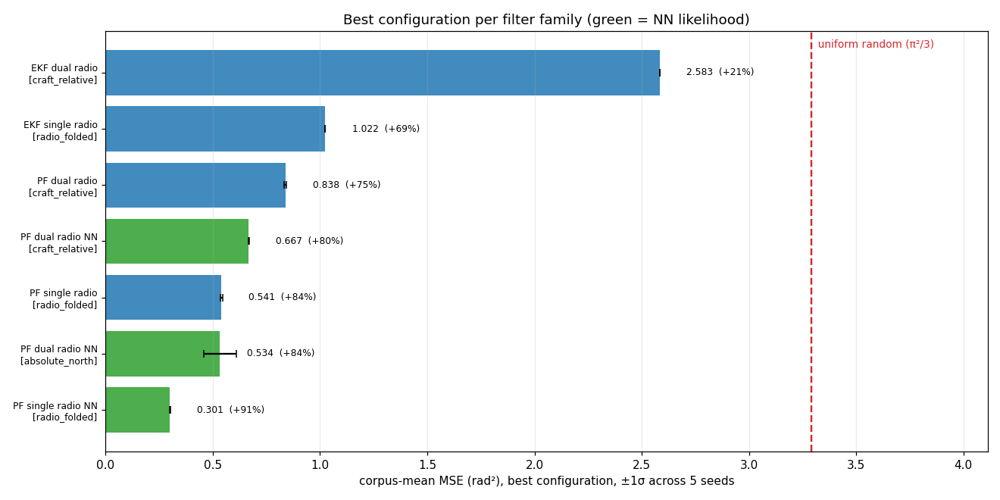
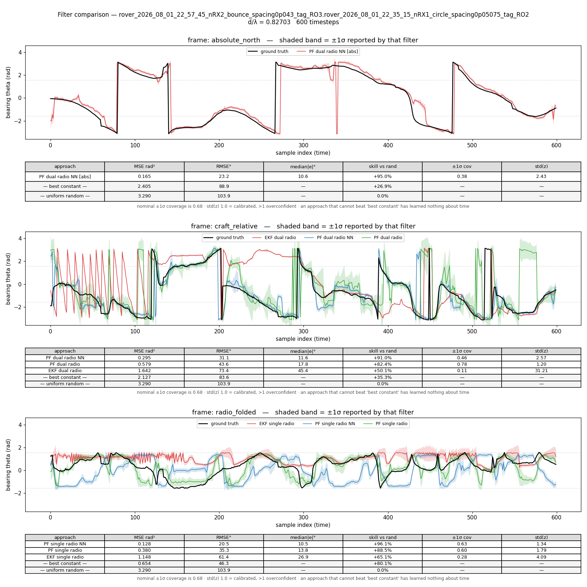
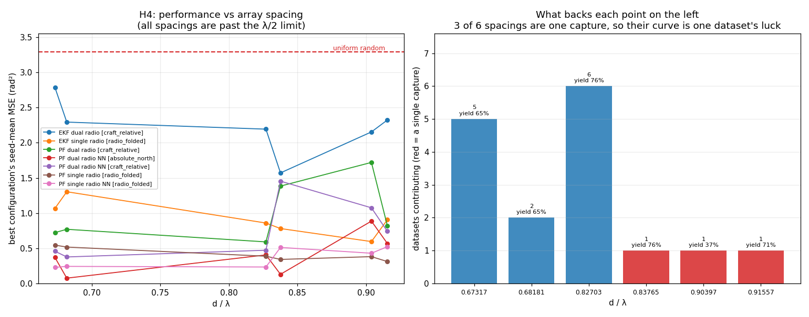
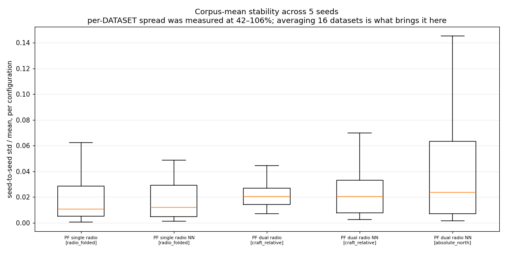
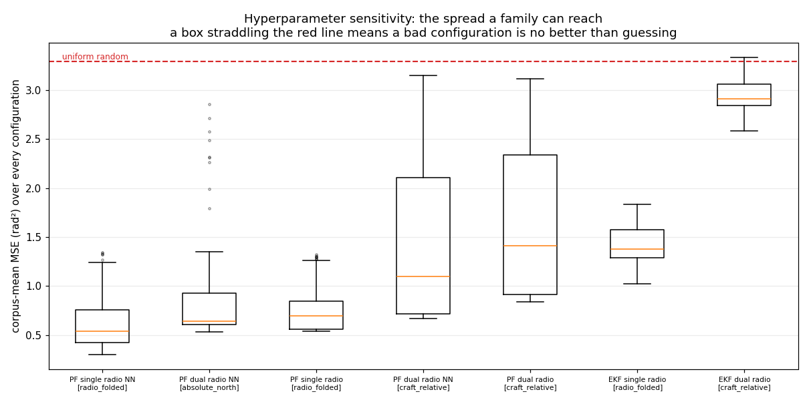

# E-INF1 stage 2 — coarse filter sweep on the 2026 rover corpus

**26,112 runs · 9,792 configurations · 16 merged-v7 rover captures · 2026-08-09/10**

Pre-registered design: [`experiments/e_inf1_filter_sweep/experiment_readme.md`](../../../../experiments/e_inf1_filter_sweep/experiment_readme.md).
Hypotheses were fixed before the data was seen.

---

## Read this first

Three things a leaderboard would have hidden:

1. **The EKF dual-radio filter is barely better than guessing.** Its best
   configuration scores 2.583 rad² against a uniform-random floor of 3.290 —
   21% of the way from guessing to perfect. Its *median* configuration scores
   2.908 (12%), and its **worst configuration, 3.332, is worse than random**.
   On the one capture examined in depth, the single-radio EKF (1.148 rad²) loses
   to a fixed bearing (0.654 rad²): on that capture it has learned nothing about
   *time*, only roughly where the emitter sits. The fixed-bearing floor is so far
   only computed for that capture — see the [caveat](#what-the-picture-shows).
2. **H3 cannot be answered from this sweep.** It asks whether filters are
   overconfident, which needs a calibration number per run. The sweep records
   only `mse_*` and `runtime`. `spf/evaluation/calibration.py` was written for
   exactly this and never wired into the run wrappers — my omission. See
   [Gap: H3](#gap-h3-is-unanswerable-as-run).
3. **Half the d/λ points rest on one capture each.** H4 reads as non-monotonic,
   but three of the six spacings have a single dataset behind them, so the
   apparent shape is mostly one capture's luck.

---

## Corpus

| | |
|---|---|
| datasets | 16 merged v7 rover captures, stratified by routine × d/λ × day ([list](../../../../experiments/e_inf1_filter_sweep/stage2_rover_sample_n16.txt)) |
| routine | `rover_bounce` (RX rover) — all 16 |
| d/λ | 0.67317 (5 datasets), 0.68181 (2), 0.82703 (6), 0.83765 (1), 0.90397 (1), 0.91557 (1) |
| segmentation | v3.7, precompute `/mnt/qnap01/mouse9911/rovers_2026/precompute` |
| empirical table | `empirical_dists/full_20260809_v1.pkl` — 48 keys, covers **48/48** rover stores |
| model | `/mnt/md0/checkpoints/jun26_2026/paired_3p7_thin_noblade/best.pth` |
| grid | [`spf/filters/configs/rover2026_coarse.yaml`](../../configs/rover2026_coarse.yaml) |
| seeds | 5 (0–4) on every particle-filter family; EKFs are deterministic and carry no seed axis |

Every number below is a **corpus mean**: within a seed, the per-dataset MSEs are
averaged weighted by dataset count; those per-seed corpus means are then averaged
across the 5 seeds, and the ± is their standard deviation.

⚠️ [`LEADERBOARD.md`](LEADERBOARD.md) in this directory is the raw generated
table and is **not** ranked this way. Its grouping key includes
`rx_wavelength_spacing` and `seed`, so its top rows are the single easiest
(spacing, seed) cell — currently d/λ = 0.68181 at `n_runs = 2` — not the corpus
winner. Use it to look up a specific configuration, not to rank.

---

## Leaderboard



| family | frame | best MSE (rad²) | ±1σ across seeds | skill vs random | best configuration |
|---|---|---|---|---|---|
| `PF_single_theta_single_radio_NN` | `radio_folded` | **0.301** | 0.002 | +90.9% | N=1024, θ_err=0.005, θ̇_err=0.1, rx=1 |
| `PF_single_theta_dual_radio_NN` | `absolute_north` | **0.534** | 0.077 | +83.8% | N=4096, θ_err=0.075, θ̇_err=0.005 |
| `PF_single_theta_single_radio` | `radio_folded` | **0.541** | 0.004 | +83.6% | N=1024, θ_err=0.001, θ̇_err=0.1, rx=0 |
| `PF_single_theta_dual_radio_NN` | `craft_relative` | **0.667** | 0.003 | +79.7% | N=16384, θ_err=0.02, θ̇_err=0.1 |
| `PF_single_theta_dual_radio` | `craft_relative` | **0.838** | 0.006 | +74.5% | N=16384, θ_err=0.005, θ̇_err=0.1 |
| `EKF_single_theta_single_radio` | `radio_folded` | **1.022** | 0.000 | +68.9% | φ_std=1.0, p=1.0, noise=1e-4, rx=0 |
| `EKF_single_theta_dual_radio` | `craft_relative` | **2.583** | 0.000 | +21.5% | φ_std=0.0, p=0.1, noise=1e-4, dyn_R=0.1 |

⚠️ **Rows in different frames are not comparable.** `radio_folded` collapses the
θ ↔ −θ ambiguity, so it is an easier target than `craft_relative` by
construction; `absolute_north` answers a different question again. Compare *down
a frame*, never across. This is why the 0.301 at the top is not evidence that
single-radio beats dual-radio.

---

## H1 — NN likelihood beats the empirical table. **SUPPORTED.**

Both matched comparisons (same frame, same filter family, same grid) favour the
network:

| frame | NN | empirical | reduction |
|---|---|---|---|
| `craft_relative` (dual radio) | **0.667** ± 0.003 | 0.838 ± 0.006 | **−20.4%** |
| `radio_folded` (single radio) | **0.301** ± 0.002 | 0.541 ± 0.004 | **−44.4%** |

The seed spreads (0.002–0.006) are ~30× smaller than the gaps, so this is not a
seed artefact. Note the empirical arm used the **rebuilt** table
(`full_20260809_v1.pkl`, commit `2a07ae0`), which folds 2026 rover data into
`PLUTO_0.82703` and `PLUTO_0.67317` — this is the empirical baseline at its
strongest, not a stale table being beaten.

---

## Predictions over time, with confidence

One capture, all three frames, every winning configuration:
`rover_2026_08_01_22_57_45…RO3` (600 timesteps, d/λ = 0.82703).
Black = ground truth, coloured line = filter estimate, shaded = that filter's own ±1σ.



Two reference rows appear under every panel:

- **uniform random** — predict a uniform angle each step. E[e²] = π²/3 = 3.290 rad²
  (RMSE 103.9°). Analytic, zero information.
- **best constant** — the single fixed bearing with the lowest MSE on that
  capture (the circular mean of truth). A tracker that cannot beat this has
  learned nothing about *time*.

### What the picture shows

**`absolute_north`** — the NN dual-radio PF tracks the emitter closely
(0.165 rad², +95.0% skill, median error 10.6°). The visible failures are the
±π seam: at t≈140 and t≈340 the truth wraps and the filter takes ~5 samples to
follow. Its ±1σ band is far too narrow — 38% coverage where 68% is nominal,
std(z) = 2.43.

**`craft_relative`** — the ordering is NN PF (0.295) < empirical PF (0.579) <
EKF (1.642), and all three beat the best constant (2.127). The EKF's track shows
the failure directly: for t≈0–110 it oscillates through the full ±π range every
few samples, and from t≈210–290 it sits near +2.8 rad while truth is near −1.
Its reported σ is meaningless — 11% coverage, **std(z) = 31.2**.

**`radio_folded`** — this is where the random baseline earns its place. The best
constant scores **0.654**, and the EKF scores **1.148**. *The EKF is 76% worse
than a fixed bearing.* Folding θ to positive-y concentrates the truth enough that
"always guess the middle" is a strong strategy, and the EKF does not reach it —
while still looking respectable at +65.1% skill against uniform random. Reporting
only skill-vs-random would have hidden this. The two PFs do beat it (0.128 and
0.380).

| frame | approach | MSE | RMSE | skill vs rand | ±1σ cov | std(z) |
|---|---|---|---|---|---|---|
| `absolute_north` | PF dual NN [abs] | 0.165 | 23.2° | +95.0% | 0.38 | 2.43 |
| | — best constant — | 2.405 | 88.9° | +26.9% | — | — |
| `craft_relative` | PF dual NN | 0.295 | 31.1° | +91.0% | 0.46 | 2.57 |
| | PF dual (empirical) | 0.579 | 43.6° | +82.4% | 0.78 | 1.20 |
| | EKF dual | 1.642 | 73.4° | +50.1% | 0.11 | **31.21** |
| | — best constant — | 2.127 | 83.6° | +35.3% | — | — |
| `radio_folded` | PF single NN | 0.128 | 20.5° | +96.1% | 0.63 | 1.34 |
| | PF single (empirical) | 0.380 | 35.3° | +88.5% | 0.60 | 1.79 |
| | EKF single | 1.148 | 61.4° | +65.1% | 0.28 | 4.09 |
| | **— best constant —** | **0.654** | **46.3°** | **+80.1%** | — | — |
| all | — uniform random — | 3.290 | 103.9° | 0.0% | — | — |

These are one capture. They are consistent with the corpus ordering above but are
not themselves corpus evidence.

**The best-constant floor is not yet available corpus-wide.** Computing it over
all 16 captures needs only ground truth — no filter, no model — but the attempt
blocked indefinitely on qnap01 NFS (`rpc_wait_bit_killable`, ~11 min on the first
dataset, no progress) and was abandoned. Until it is computed, the claim "the EKF
loses to a fixed bearing" holds for **this capture only**. See item 3 in
[what to carry into stage 3](#what-to-carry-into-stage-3).

---

## Gap: H3 is unanswerable as run

> **H3** — median `std(z)` > 1.5 on every corpus (filters are overconfident).

The sweep's result dicts carry `mse_craft_theta` / `mse_single_radio_theta` and
`runtime`. No coverage, no `std(z)`, no NLL. `spf/evaluation/calibration.py`
implements all of them and is not called from `run_filters_on_data.py`. **This is
a wiring omission on my part, not a property of the data.**

What the single-capture panel above suggests, on 5 of 5 filters examined:

| filter | ±1σ coverage (nominal 0.68) | std(z) |
|---|---|---|
| PF dual NN [abs] | 0.38 | 2.43 |
| PF dual NN | 0.46 | 2.57 |
| PF dual (empirical) | 0.78 | 1.20 |
| PF single NN | 0.63 | 1.34 |
| PF single (empirical) | 0.60 | 1.79 |
| EKF dual | 0.11 | 31.21 |
| EKF single | 0.28 | 4.09 |

Every filter except the empirical dual-radio PF is overconfident, and the EKFs
are wildly so. **This is one capture and does not settle H3.** Fixing it means
adding the calibration block to the five PF and two EKF wrappers and re-running
stage 2 (~40 min).

---

## H4 — is a wider, more aliased array worse? **Not resolved.**



The prediction was that d/λ = 0.904 would be worse than 0.673. The left panel is
not monotonic in d/λ for any family, and the right panel says why that reading is
unsafe: **0.83765, 0.90397 and 0.91557 each have exactly one capture behind
them.** A single capture's emitter geometry, multipath and TX duty cycle move MSE
by more than the effect being looked for.

Best configuration's seed-mean MSE, best family at each spacing:

| d/λ | datasets | valid-frame yield | best MSE | family |
|---|---|---|---|---|
| 0.67317 | 5 | 65% | 0.228 | PF single NN |
| 0.68181 | 2 | 65% | 0.075 | PF dual NN [abs] |
| 0.82703 | 6 | 76% | 0.233 | PF single NN |
| 0.83765 | 1 | 76% | 0.130 | PF dual NN [abs] |
| 0.90397 | 1 | 37% | 0.381 | PF single (empirical) |
| 0.91557 | 1 | 71% | 0.311 | PF single (empirical) |

The two best-supported spacings (0.67317, n=5 and 0.82703, n=6) are within 2% of
each other despite differing by 23% in d/λ — no effect at the only place there is
enough data to look. **H4 needs a balanced capture matrix before it can be
tested**; recording it as "not monotonic" would over-read one-capture points.

> Note: an earlier stage-2 note quoted 0.590 (best) / 1.384 (worst) per spacing.
> Those came from a different statistic and are superseded by the table above,
> which averages across seeds first and then minimises over configurations —
> the same statistic as the leaderboard.

---

## Seed stability



Per-dataset, the seed-to-seed MSE spread was measured at **42–106%** before this
sweep — larger than the spacing between adjacent grid points, which made "the
best hyperparameter" partly a property of the RNG. That was traced to `filterpy`'s
systematic resampler drawing from numpy's unseeded process-global RNG and fixed in
[`spf/filters/resample.py`](../../resample.py) (`1305f53`); the filters now take a
seed that fully determines the answer.

Averaging 16 datasets brings the **corpus-mean** spread down to a median of
1–2% per configuration. The one family that stays noisy is the NN dual-radio PF
in `absolute_north` (up to 14.5%, and the ±0.077 on its leaderboard row) — that
frame has no folding to stabilise it and its winner sits at N=4096, the smallest
particle count among the winners.

**Consequence for stage 3:** differences below ~5% between configurations of the
same family are inside seed noise and should not be used to pick a winner.

---

## Hyperparameter sensitivity



| family | frame | configs | best | median | worst |
|---|---|---|---|---|---|
| PF single NN | `radio_folded` | 60 | 0.301 | 0.540 | 1.341 |
| PF dual NN | `absolute_north` | 60 | 0.534 | 0.640 | 2.856 |
| PF single (empirical) | `radio_folded` | 60 | 0.541 | 0.696 | 1.319 |
| PF dual NN | `craft_relative` | 60 | 0.667 | 1.098 | 3.151 |
| PF dual (empirical) | `craft_relative` | 60 | 0.838 | 1.412 | 3.116 |
| EKF single | `radio_folded` | 48 | 1.022 | 1.376 | 1.836 |
| EKF dual | `craft_relative` | 84 | 2.583 | 2.908 | **3.332** |

- **Tuning matters more than family.** A badly configured NN dual-radio PF (3.151)
  is worse than a well-configured empirical one (0.838). Any claim of the form
  "approach A beats approach B" must compare tuned against tuned.
- **The EKF dual-radio box straddles the random line.** Its worst configuration,
  3.332 rad², is *worse than guessing*, and its median is only 12% better. This
  family is not merely last, it is close to uninformative on this corpus at every
  setting the grid tried.
- The two single-radio families are the most forgiving: the whole box sits below
  1.0 rad², so any reasonable setting works.

---

## What to carry into stage 3

1. **Take the top ~4 configurations to all 48 rover stores.** The NN PFs in each
   frame, plus the empirical single-radio PF as the non-model control.
2. **Wire calibration into the run wrappers before stage 3**, so H3 gets answered
   on the full corpus instead of one capture.
3. **Add the best-constant floor to the aggregate report**, not just the plot.
   Skill-vs-random alone rated the single-radio EKF at +65% on a capture where it
   lost to a fixed bearing.
4. **Do not read H4 off this sweep.** It needs a spacing-balanced capture matrix.
5. **The reporter loads every pickle before grouping.** 26k results was fine;
   the val corpus is ~739k and will need streaming first.

---

## Reproducing

```bash
python spf/filters/run_filters_on_data.py \
  -d $(cat experiments/e_inf1_filter_sweep/stage2_rover_sample_n16.txt) \
  --empirical-pkl-fn empirical_dists/full_20260809_v1.pkl \
  --work-dir /mnt/qnap01/mouse9911/rovers_2026/filter_runs/stage2_coarse \
  --config spf/filters/configs/rover2026_coarse.yaml \
  --results-backend local --parallel 24
```

```bash
python spf/filters/report.py \
  --work-dir /mnt/qnap01/mouse9911/rovers_2026/filter_runs/stage2_coarse \
  --output-dir spf/filters/reports/e_inf1_rover_coarse_20260809_v1
```

```bash
python spf/filters/plot_sweep_summary.py \
  --results spf/filters/reports/e_inf1_rover_coarse_20260809_v1/results.json \
  --output-dir spf/filters/reports/e_inf1_rover_coarse_20260809_v1/figures
```

Figures are regenerated from `results.json` alone; the trajectory figure
additionally re-runs the seven winning filters on one capture and needs the
precompute cache, the empirical table, the checkpoint and the inference cache.
