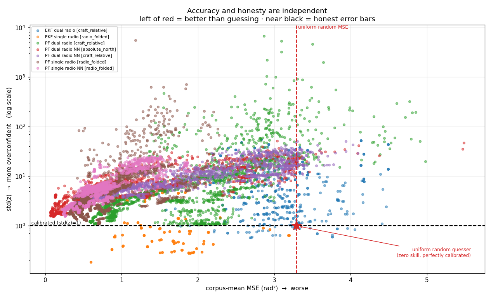
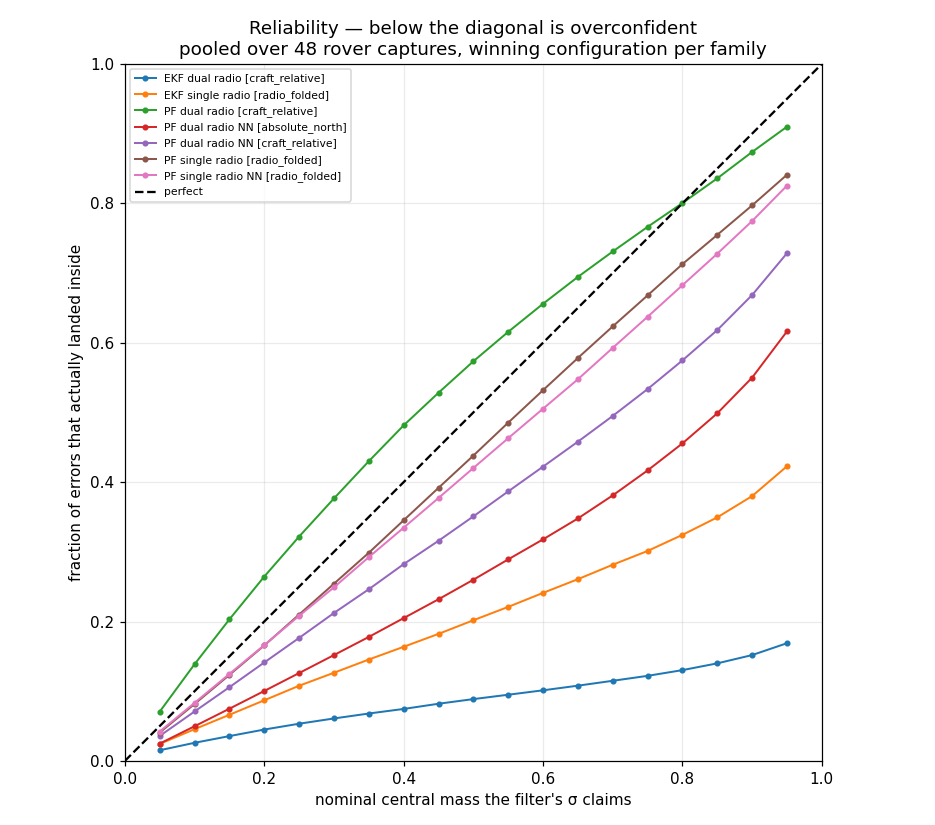
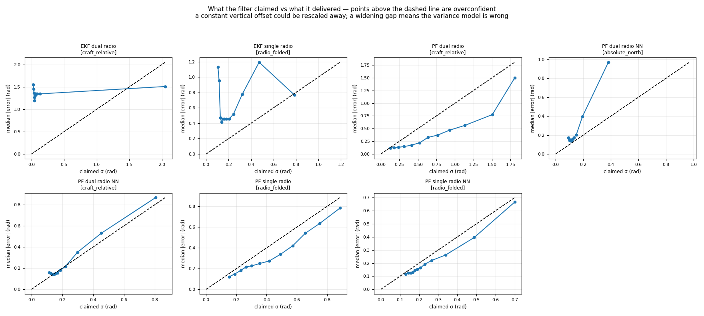
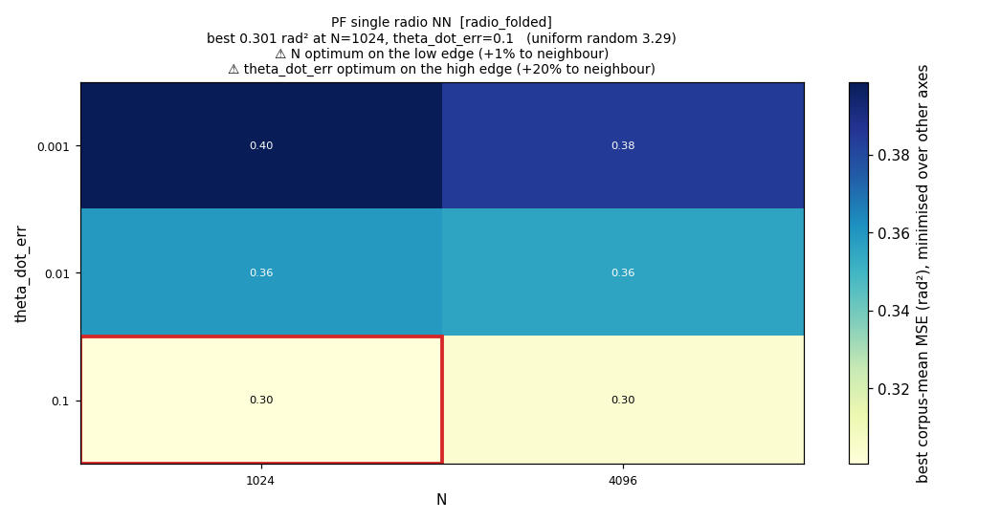

# E-INF1 — H3: do the filters know how wrong they are?

**26,112 runs · 9,792 configurations · 16 merged-v7 rover captures · 2026-08-10**

A re-run of the stage-2 grid with calibration scored inside every theta filter
(`ed8b054`). The accuracy half of this sweep is unchanged and written up in
[`e_inf1_rover_coarse_20260809_v1/REPORT.md`](../e_inf1_rover_coarse_20260809_v1/REPORT.md);
this report is about the *second* number every filter emits and nobody had ever
checked.

---

## Answer

**H3 is SUPPORTED. Corpus median `std(z)` = 4.43; 92.6% of configurations exceed
the 1.5 threshold.** The reported σ is typically 4–6× too small.

The pre-registered consequence is now in force:

> if `std(z) > 1.5` holds, **no downstream component may gate on filter variance**
> until the cause is found, and that becomes its own work item.

---

## What is being measured

Every filter emits two numbers per timestep: a bearing **θ̂** and a **σ** — its
own claim about how wrong that estimate probably is. MSE grades the first. Until
now nothing graded the second, so a filter could report any σ it liked.

The z-score asks how many of the filter's *own* claimed sigmas it actually
missed by:

```
z = (θ̂ − θ_true) / σ            # shortest arc on the circle
```

`std(z)` is then **the factor by which the error bar is wrong**: 1.0 is honest,
5.0 means errors are five times larger than advertised, 0.5 means the filter is
hedging. `cov1` is the same thing as a fraction — how often truth landed inside
the stated ±1σ. Nominal is 0.683 for a Gaussian.

> ⚠️ **`std(z)` cannot rank filters by skill, and must never be read alone.**
> A uniform-random guesser that honestly reports σ = π/√3 = 1.814 rad scores
> **exactly 1.00** — better calibrated than every filter measured here, while
> knowing nothing. Calibration is a scale-free self-consistency check. It only
> means something read against MSE and the π²/3 floor.

---

## Per family

`std(z)` per configuration, averaged across 5 seeds and 16 captures:

| family | frame | configs | median `std(z)` | > 1.5 |
|---|---|---|---|---|
| `PF_single_theta_dual_radio_NN` | `craft_relative` | 1800 | **6.41** | **100%** |
| `EKF_single_theta_dual_radio` | `craft_relative` | 504 | 5.28 | 83% |
| `PF_single_theta_single_radio_NN` | `radio_folded` | 1800 | 4.56 | **100%** |
| `PF_single_theta_dual_radio_NN` | `absolute_north` | 1800 | 4.45 | **100%** |
| `PF_single_theta_dual_radio` | `craft_relative` | 1800 | 4.42 | 86% |
| `PF_single_theta_single_radio` | `radio_folded` | 1800 | 3.27 | 90% |
| `EKF_single_theta_single_radio` | `radio_folded` | 288 | **0.75** | 25% |

All three NN particle-filter families have **no honestly-calibrated configuration
anywhere in the grid** — not one of 5,400.

`EKF_single_theta_single_radio` is the single exception, and it errs the other
way: it *overstates* uncertainty. It is also mediocre in accuracy. It is the only
family whose σ is conservative rather than misleading.

---

## Accuracy and honesty are independent axes



Every point is one configuration. Left of the red line beats guessing; near the
black line the error bars are honest. The red star marks the uniform-random
guesser — zero skill, perfect calibration — which is the fixed point that makes
"low `std(z)` is good" wrong as a summary.

Three things the scatter shows that the table cannot:

- **No family occupies the honest-and-accurate corner.** The points with the
  lowest MSE (left edge, red and pink) sit at `std(z)` between 3 and 10.
- **`std(z)` rises with MSE inside every family.** Configurations that track
  badly are also the ones most deluded about tracking badly — the error grows
  while the claimed σ does not keep up.
- **The orange family (`EKF single radio`) is the only cloud below the black
  line**, confirming it is the lone hedger rather than an artefact of the median.

---

## Reliability — what the σ actually buys



For each nominal central mass the σ claims, what fraction of errors really landed
inside. The diagonal is perfect; below it is overconfident. Pooled over all 48
rover captures at the stage-3 winning configuration per family.

**`EKF dual radio` covers 17% of its errors at a nominal 95%.** Its stated
interval is close to meaningless. `PF dual radio` (green) is the only curve that
touches the diagonal, and it sits slightly *above* it at low nominal mass —
conservative where it matters most.

This figure could not be drawn before this work: it needs the per-timestep track,
and the sweep stores only scalars. It comes from the 336 tracks written by
[`dump_tracks.py`](../../dump_tracks.py).

---

## Diagnosis: can the σ be fixed by rescaling?



Claimed σ against delivered |error|, binned by claimed σ. This separates two very
different failures:

**The particle filters' σ is informative but mis-scaled.** Error rises
monotonically with claimed σ in all five PF panels. The filter does know when it
is in trouble; it just understates by a roughly consistent factor. A learned
scalar or monotone recalibration is plausible here.

**The EKFs' σ is not informative at all.** `EKF dual radio` is nearly *flat* —
median |error| stays at 1.3–1.5 rad while its claimed σ ranges over two orders of
magnitude, 0.02 to 2.0 rad. `EKF single radio` is non-monotonic. **No rescaling
can fix a variance that carries no signal about the error**, which makes these
two a different work item from the PFs.

One subtlety worth recording: `PF dual radio` sits *below* the diagonal on this
figure (median error smaller than claimed σ) while scoring `std(z)` = 1.41 above
1. Both are true — `std(z)` is driven by the tails, the median by the bulk. The
filter is well-behaved most of the time and badly wrong occasionally, which is
exactly the shape that a single summary statistic hides.

---

## The winners are not representative of their families

Selecting a configuration on MSE says nothing about whether it is honest:

| family | family median `std(z)` | **winning config** `std(z)` |
|---|---|---|
| `PF_single_theta_dual_radio` | 4.42 | **1.41** |
| `EKF_single_theta_single_radio` | 0.75 | **3.74** |

The empirical dual-radio PF's winner is three times better calibrated than its
family; the single-radio EKF's winner is five times *worse*. Any claim of the
form "family X is well calibrated" has to name a configuration.

---

## Where the grid stopped



The same sweep, viewed as a surface rather than a ranking. This grid is **2×3**
where the March 2025 deck's was 8×13, and the optimum sits in the corner: the
best `theta_dot_err` is 0.1, the largest value tried, with MSE still falling 20%
into the wall. Six of seven families are truncated the same way — the full list
is printed by [`plot_hyperparam_heatmap.py`](../../plot_hyperparam_heatmap.py),
and the remaining surfaces are in [`figures/heatmaps/`](figures/heatmaps).

**Every accuracy number in this report is therefore an upper bound on what the
filter can do**, measured on a grid that stopped before the surface did. That
observation is what [E-INF2](../../../../experiments/e_inf2_hyperparam_survey/experiment_readme.md)
was designed to settle; its
[phase-A result](../e_inf2_survey_20260810_v1/REPORT.md) finds the truncation was
real but largely harmless — the surface is a broad plateau, and the extra ground
is flat.

The calibration conclusions above are unaffected: `std(z)` is a ratio, and the
overconfidence spans every configuration in the grid rather than depending on
which one wins.

---

## What this does not answer

- **Why.** These figures establish that the σ is wrong and characterise the
  shape of the wrongness. They do not identify the cause. For the PFs the
  candidates are the process-noise terms (`theta_err`, `theta_dot_err`, which are
  swept and clearly interact with `std(z)`) and particle depletion at low `N`.
- **Whether a recalibration generalises.** The monotone σ↔error relationship is
  measured on the rover corpus at one checkpoint. Fitting a correction here and
  applying it elsewhere is untested.
- **The NN posterior directly.** `spf/evaluation/posterior.py` implements HDR
  coverage and NLL for the full 65-bin posterior, which is a stronger instrument
  than a Gaussian σ for a filter whose belief may be bimodal. Not wired in.

---

## Reproducing

```bash
python spf/filters/run_filters_on_data.py \
  -d $(cat experiments/e_inf1_filter_sweep/stage2_rover_sample_n16.txt) \
  --empirical-pkl-fn empirical_dists/full_20260809_v1.pkl \
  --work-dir /mnt/qnap01/mouse9911/rovers_2026/filter_runs/stage2_calib \
  --config spf/filters/configs/rover2026_coarse.yaml \
  --results-backend local --parallel 22
```

```bash
python spf/filters/plot_calibration.py \
  --results spf/filters/reports/e_inf1_rover_coarse_calib_20260810_v1/results.json \
  --tracks-dir /mnt/qnap01/mouse9911/rovers_2026/tracks/stage3_seed0 \
  --output-dir spf/filters/reports/e_inf1_rover_coarse_calib_20260810_v1/figures
```

The work dir must be **new**. `--resume` defaults to true, so pointing it at
`stage2_coarse` silently skips every job and produces nothing.

### This run is comparable to the original

MSE reproduces [`e_inf1_rover_coarse_20260809_v1`](../e_inf1_rover_coarse_20260809_v1/REPORT.md)
exactly: all 9,792 configuration keys matched, max |ΔMSE| = 8.9e-16, 9,250 of
9,792 rows bit-identical. The residual sub-ulp drift is summation order from
`report.py`'s unsorted file walk. So the calibration block is confirmed purely
additive, H1's numbers stand, and seeded PF resampling reproduced across a full
independent re-run.

Both amended acceptance gates pass: 300 PF configurations present at all 5 seeds,
every configuration+seed summing to 16 datasets.
