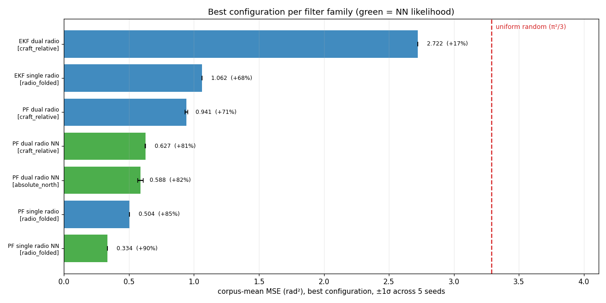
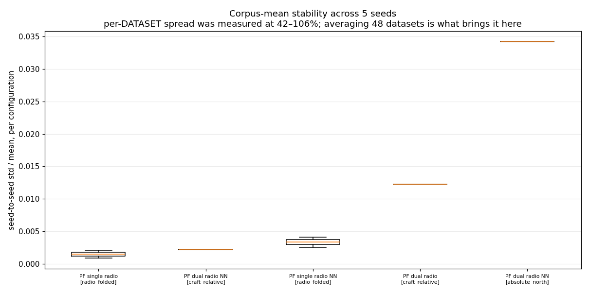
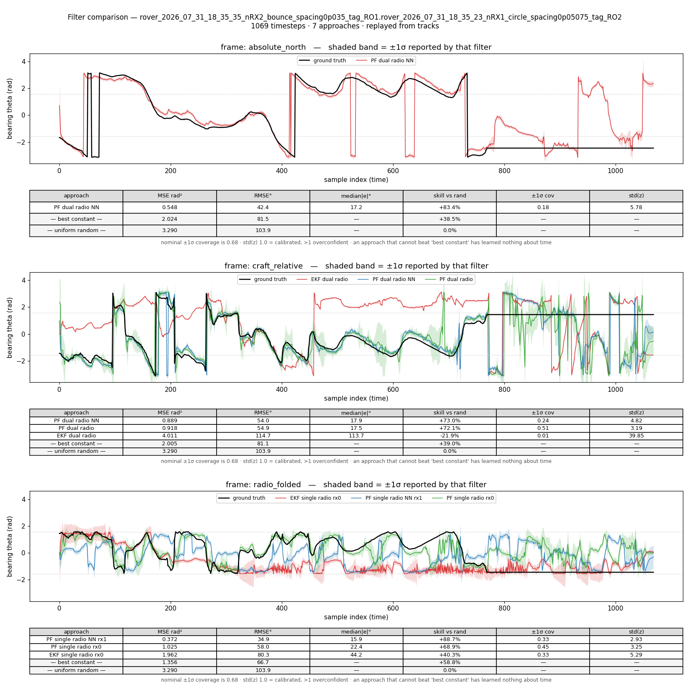

# E-INF1 stage 3 — the winners on the whole rover corpus

**1,824 runs · 7 configurations · all 48 merged-v7 rover stores · 2026-08-10**

Stage 2 searched 9,792 configurations on a stratified sample of 16 captures.
This confirms the winning configuration of each family on the full corpus, which
is the only thing that answers "does the tuning generalise, or did we fit the
sample?"

Ran in **3m32s** at `--parallel 22`, hitting every acceptance number exactly:
1,296 result pkls, 1,824 runs (the three single-radio families emit two runs per
pkl, one per radio), 48 datasets, all six d/λ values.

---

## Result



| family | frame | MSE (rad²) | RMSE | skill vs random | stage 2 (16 stores) |
|---|---|---|---|---|---|
| `PF single radio NN` | `radio_folded` | **0.334** | 33.1° | **+90%** | 0.301 |
| `PF single radio` | `radio_folded` | **0.504** | 40.7° | +85% | 0.541 |
| `PF dual radio NN` | `absolute_north` | **0.588** | 43.9° | +82% | 0.534 |
| `PF dual radio NN` | `craft_relative` | **0.627** | 45.4° | +81% | 0.667 |
| `PF dual radio` | `craft_relative` | **0.941** | 55.6° | +71% | 0.838 |
| `EKF single radio` | `radio_folded` | **1.062** | 59.0° | +68% | 1.022 |
| `EKF dual radio` | `craft_relative` | **2.722** | 94.5° | **+17%** | 2.583 |
| _uniform random_ | — | _3.290_ | _103.9°_ | _0%_ | — |

⚠️ Frames are **not comparable** — `radio_folded` collapses the θ↔−θ ambiguity
and is an easier target by construction. Compare down a frame, never across.

⚠️⚠️ **Rows 3 and 4 must not be read as an ordering.** `absolute_north` (0.588)
and `craft_relative` (0.627) are the same filter family in two frames, and the
0.039 between them **is not distinguishable from zero** — see
[the two NN dual-radio rows are a null result](#the-two-nn-dual-radio-rows-are-a-null-result)
below. An earlier revision of this report presented them as a ranked difference.
That was wrong.

**The tuning generalises.** Every family lands within 12% of its stage-2 number
across a 3× corpus expansion, and the ordering is preserved except for one swap
well inside the seed noise: the empirical single-radio PF (0.504) now edges past
the NN dual-radio absolute filter (0.588), where stage 2 had them at 0.541 and
0.534. Both remain far above the random floor.

---

## The two NN dual-radio rows are a null result

`PF_single_theta_dual_radio_NN` appears twice above because it won both frames in
stage 2. The 0.588-vs-0.627 gap looks like evidence that filtering in absolute
north is better. **It is not.** Paired over all 48 stores and 5 seeds:

| test | value |
|---|---|
| paired (store, seed) wins for absolute | **120 / 240** — a coin flip |
| per-store wins | absolute 23, **craft-relative 25** |
| median per-store Δ | **−0.0087** (craft better at the median) |
| mean per-store Δ | +0.0387 |
| share of that mean from **one** store | **92.1%** |
| mean Δ dropping that store | +0.0031 |
| mean Δ dropping the top two | **−0.0111** (craft wins) |
| bootstrap 95% CI on mean Δ | **[−0.046, +0.141]** |
| Wilcoxon signed-rank | **p = 0.780** |

The entire corpus-mean difference is one capture
(`rover_2026_08_07_01_27_43…RO3`, craft 2.730 vs absolute 1.020). On the other
47 the two frames are indistinguishable.



The seed figure says the same thing independently: the **absolute arm is by far
the least stable across seeds** (~3.4% of its mean, against ~0.2% for
craft-relative — the per-seed corpus-mean standard deviations are 0.0225 and
0.0015, a 15× difference). A 0.039 gap between arms whose own seed noise differs
by that much is not a measurement of the frame.

**The comparison is also unfair to craft-relative**, in two ways that both favour
absolute:

1. The two rows run at **different hyperparameters** (absolute: N=4096,
   θ_err=0.075, θ̇_err=0.005; craft: N=16384, θ_err=0.02, θ̇_err=0.1) — by design,
   each family's own stage-2 winner. So this is a frame × tuning × particle-count
   comparison, not a frame comparison.
2. **Craft-relative's optimum is pinned at the swept grid boundary.** Every one of
   its top configurations sits at `theta_dot_err = 0.1`, the largest value
   [`rover2026_coarse.yaml`](../../configs/rover2026_coarse.yaml) tries, while
   absolute's winner is interior. Craft was never tuned to its own dynamics, so
   0.627 is an **upper bound** on its error.

### What *is* established

On an individual capture, at **identical** hyperparameters and seed, filtering in
absolute north can be markedly better — measured 0.1177 vs 0.2971 on
`rover_2026_08_01_22_57_45…RO3`, with each frame's optimal process noise landing
where its measured angular rate predicts (craft p95 |dθ/dt| 18.26°/step needing
θ̇_err 0.1; absolute 5.21°/step needing 0.02). The mechanism is real: the filter's
constant-angular-velocity model is applied in the frame it runs in, and
craft-relative bearing carries the rover's own yaw.

**That mechanism does not survive aggregation to a corpus-level ranking.** It
explains why particular captures differ; it does not support "absolute north is
the better frame" on this corpus. Settling that needs craft-relative re-tuned on
an extended `theta_dot_err` grid, with both arms at matched N.

### There is no frame bug

Audited adversarially. `craft_ground_truth_thetas == pi_norm(absolute_thetas[0] −
rx_heading[0])` is an algebraic identity (corpus-wide max violation 1.05e-4 deg).
Rotation sign, per-radio heading pairing, single application, and cache
immutability all verified; the inference cache stores **unrotated** posteriors.
Two real defects were found and both *handicap* the absolute arm: the
interpolation smear in `rotate_dist` (absolute-only), and the target being the
circular mean over both radios while the observation is radio 0's (worth
0.0100 rad², measured by rescoring, not the 0.0006 displacement figure quoted
earlier — MSE differences are not bounded by the displacement's own MSE).

That the full-corpus numbers are *slightly worse* for most families is the
expected optimism of tuning on a sample — but at ~10% it is small enough that the
stage-2 conclusions carry.

---

## `EKF dual radio` is confirmed near-uninformative at scale

+17% skill against uniform random on the full corpus — its bearing estimate
removes about a sixth of the error a coin flip would make. On the first capture
inspected it scored MSE **4.011, worse than guessing outright**.

Its confidence is worse than its accuracy: truth lands inside its stated ±1σ
**6%** of the time against 68% nominal, and its `std(z)` is **32.8**. See
[the calibration report](../e_inf1_rover_coarse_calib_20260810_v1/REPORT.md) for
the diagnosis — its σ is not merely mis-scaled, it is uncorrelated with the error.

---

## Calibration of the winners

Median across 48 captures, at each family's winning configuration:

| family | `std(z)` | ±1σ coverage |
|---|---|---|
| `PF dual radio` | **1.41** | 0.73 |
| `PF single radio` | 1.74 | 0.62 |
| `PF single radio NN` | 2.36 | 0.56 |
| `PF dual radio NN` [craft] | 3.00 | 0.46 |
| `EKF single radio` | 3.74 | 0.45 |
| `PF dual radio NN` [abs] | 4.39 | 0.34 |
| `EKF dual radio` | **32.84** | 0.06 |

Two things worth carrying forward. **The most accurate family is not the most
honest** — `PF single radio NN` wins on MSE at 2.36, while `PF dual radio`, four
places below it on accuracy, is the best calibrated at 1.41. And **the winners
are unrepresentative of their families**: the empirical dual-radio PF's family
median was 4.42, the single-radio EKF's was 0.75. Selecting on MSE scrambles
calibration.

---

## Per-dataset trajectories

Bearing against time for a single capture: ground truth in black, each approach
as a coloured line, its ±1σ as a matching fill, and a metrics table per angular
frame carrying both random-prediction floors. Generated for **all 48 captures**
by [`plot_tracks.py`](../../plot_tracks.py) replaying the dumped tracks — seconds,
not an hour, and each figure is exactly the run behind the numbers above rather
than a fresh draw.

All 48 live at `/mnt/qnap01/mouse9911/rovers_2026/tracks/figures_seed0/` (35 MB,
gitignored). Seven are committed under [`figures/trajectories/`](figures/trajectories):
one per d/λ, plus the two captures called out below.

| d/λ | capture |
|---|---|
| 0.67317 | `rover_2026_07_31_18_35_35…RO1` ‡ |
| 0.68181 | `rover_2026_08_07_00_08_04…RO1` |
| 0.82703 | `rover_2026_07_31_20_11_15…RO3` |
| 0.83765 | `rover_2026_08_07_00_08_06…RO3` |
| 0.90397 | `rover_2026_08_05_22_27_45…RO4` |
| 0.91557 | `rover_2026_08_07_00_16_43…RO4` |
| 0.82703 | `rover_2026_08_07_01_27_43…RO3` † |

**† The capture that produced 92% of the absolute-vs-craft gap.**

**‡ A capture with a partly frozen ground truth.** From t ≈ 760 to the end the GT
is exactly constant while the filters keep tracking, so their error is scored
against a stalled reference. Corpus-wide this is **isolated**: 1 of 48 captures
exceeds 10% frozen samples (this one, 29%, almost all in a single run); the
remaining 47 sit near 3%, which is ordinary sample-level repetition. Its effect
on every family's corpus mean is ≤ 0.027 rad² and under 0.005 for six of seven,
so the numbers above are not distorted — but a per-capture MSE from this store
should not be read as filter quality.



This is also the clearest single view of the calibration result: the EKF
dual-radio band is a hairline while its track sits at the wrong bearing for
hundreds of samples (`std(z)` 39.85, ±1σ coverage **0.01**), and on this capture
it scores **−21.9% skill — worse than guessing**.

## Per-timestep tracks

336 `.npz` files (48 stores × 7 configurations, seed 0), 8.5 MB, zero failures,
under `/mnt/qnap01/mouse9911/rovers_2026/tracks/stage3_seed0/`. Each holds
`theta`, `sigma` and `gt` in one named angular frame.
[`tracks_index.json`](tracks_index.json) carries per-run metrics.

This is what makes reliability curves, per-timestep failure analysis, and any
later-invented metric computable **without another sweep** — the gap that made
H3 unanswerable from stage 2 in the first place.

---

## Reproducing

```bash
ls -d /mnt/qnap01/mouse9911/rovers_2026/merged/*.zarr > experiments/e_inf1_filter_sweep/stage3_rover_all_n48.txt
```

```bash
python spf/filters/run_filters_on_data.py \
  -d $(cat experiments/e_inf1_filter_sweep/stage3_rover_all_n48.txt) \
  --empirical-pkl-fn empirical_dists/full_20260809_v1.pkl \
  --work-dir /mnt/qnap01/mouse9911/rovers_2026/filter_runs/stage3_full \
  --config spf/filters/configs/rover2026_stage3_winners.yaml \
  --results-backend local --parallel 22
```

```bash
python spf/filters/dump_tracks.py \
  --datasets $(cat experiments/e_inf1_filter_sweep/stage3_rover_all_n48.txt) \
  --configs experiments/e_inf1_filter_sweep/stage3_winners.json \
  --precompute-cache /mnt/qnap01/mouse9911/rovers_2026/precompute \
  --empirical-pkl-fn empirical_dists/full_20260809_v1.pkl \
  --checkpoint-fn /mnt/md0/checkpoints/jun26_2026/paired_3p7_thin_noblade/best.pth \
  --inference-cache /mnt/qnap01/mouse9911/rovers_2026/inference_cache \
  --seeds 0 --output-dir /mnt/qnap01/mouse9911/rovers_2026/tracks/stage3_seed0
```

**Never** point `--work-dir` at a stage-2 directory. `--resume` defaults to true
and would silently skip the 432 keys that already exist there; `--no-resume`
would overwrite by key and destroy the pkls backing a committed report.

The winning configurations are pinned in
[`stage3_winners.json`](../../../../experiments/e_inf1_filter_sweep/stage3_winners.json)
with provenance. They come from the stage-2 **report**, not its `LEADERBOARD.md`
— that table's grouping key includes `rx_wavelength_spacing` and `seed`, so its
top rows are the single easiest (spacing, seed) cell rather than the corpus
winner.
