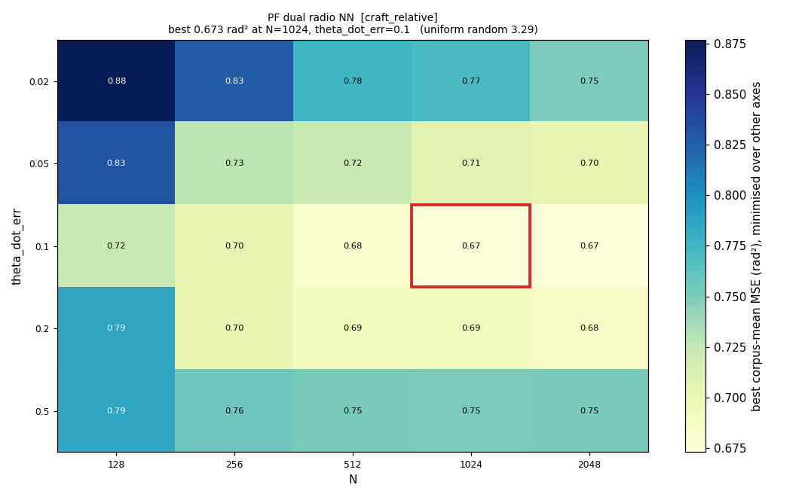

# E-INF2 phase B — refinement, matched against E-INF1

**50,864 runs · 3,179 configurations · 16 rover captures · 5 seeds · 2026-08-11**

Pre-registered design: [`experiments/e_inf2_hyperparam_survey/experiment_readme.md`](../../../../experiments/e_inf2_hyperparam_survey/experiment_readme.md).
Ran in two batches, ~1h48m compute, **zero failures**.

This is the comparison E-INF2 stands on, and the first in this effort that is
methodologically clean: **same 16 captures, same 5 seeds, paired per store, with a
Wilcoxon test** — and a grid that is a genuine superset of E-INF1's, since phase B
restored the `theta_err` coverage phase A had narrowed.

---

## Result: E-INF1's hyperparameters were already right

| family | E-INF1 | phase B | Δ | phase B better on | Wilcoxon | speed |
|---|---|---|---|---|---|---|
| `PF single radio NN` | 0.301 | 0.299 | −0.5% | 8/16 | 0.940 | 0.94× |
| `PF dual radio NN` [abs] | 0.534 | 0.534 | +0.0% | 4/16 | 0.416 | 0.82× |
| `PF single radio` | 0.541 | 0.541 | +0.0% | 6/16 | 0.037 | 0.84× |
| `PF dual radio NN` [craft] | 0.667 | 0.673 | +0.9% | 5/16 | **0.029** | **2.67×** |
| `PF dual radio` | 0.838 | 0.838 | −0.0% | 3/16 | 0.131 | 0.79× |
| `EKF single radio` | 1.022 | 1.032 | +1.0% | 7/16 | 0.782 | 0.61× |
| `EKF dual radio` | 2.583 | 2.625 | +1.6% | 8/16 | 0.782 | 1.57× |

**No family moves more than 1.6%, in either direction.** Four of seven picked the
*identical* configuration E-INF1 had already found — same `N`, same
`theta_dot_err`. **H2 is definitively falsified**, now on the full matched
corpus rather than the 8-capture suggestion phase A gave.

That is a real result and was pre-registered as one: *"H2 fails if every family is
within 10% of its E-INF1 number — in which case the truncation was real but
harmless, and that is worth recording as much as the alternative."* Six of seven
optima sat on a grid boundary, four with MSE apparently still falling 7–20% into
the wall, and **none of it was worth anything.** The surface past the boundary is
a plateau.

---

## The one actionable finding: 16× fewer particles

`PF dual radio NN` [craft_relative] reaches the same accuracy at **N = 1024
instead of N = 16384**:

| | E-INF1 | phase B |
|---|---|---|
| `N` | 16384 | **1024** |
| `theta_err` / `theta_dot_err` | 0.02 / 0.1 | 0.02 / 0.1 |
| corpus MSE | 0.667 | 0.673 (+0.9%) |
| measured runtime ratio | — | **2.67× faster** |

The +0.9% is **statistically significant** (Wilcoxon p = 0.029, phase B better on
only 5 of 16 captures) and **practically negligible** — 0.9% of MSE is 0.4% of
RMSE, well inside the seed noise this filter shows on any single capture. The
honest framing is a trade, not a free win: *16× fewer particles for half a percent
of accuracy.*

⚠️ **The 2.67× is understated, and the speed column generally is not comparable
across runs.** Runtime depends on box load, and the two runs were hours apart.
The families whose `N` did **not** change read 0.79–0.94×, so phase B's box was
~15–20% slower throughout. Correcting for that puts the true speedup nearer
**3.1×**, consistent with the 3.8× phase A measured *within a single run* for
N = 16384 → 256. Only within-run runtime comparisons should be trusted; this
column is indicative.

---

## Every optimum is interior



Zero truncated axes across all seven families, with `theta_err` at full coverage
this time — so the grid genuinely contains each optimum rather than merely
appearing to. The remaining six surfaces are in [`figures/`](figures).

The picture explains the whole negative result: the optimum is a **wide basin**,
not a peak. Moving `N` by a factor of 16 or `theta_dot_err` by a factor of 2
changes MSE by well under a percent. There was no hidden better configuration
because the surface has no sharp minimum to hide.

---

## Hypotheses — final

| id | prediction | outcome |
|---|---|---|
| **H1** | every PF optimum interior in the extended grid | ✅ **SUPPORTED** — zero truncated axes in both phases |
| **H2** | ≥1 PF family improves ≥10% | ❌ **FALSIFIED** — max change 1.6%, four families identical |
| **H3** | optimal `theta_dot_err` differs ≥5× between frames | ✅ **SUPPORTED** — 0.1 (craft) vs 0.005 (absolute), **20×**, unchanged from phase A |
| **H4** | `EKF single radio` with `dynamic_R` beats its E-INF1 winner | ❌ **REFUTED** — the static form wins; the family is 1.0% *worse* than E-INF1 |
| ~~H5~~ | the `phi_std ⇄ dynamic_R` pairing is not required | ❌ **REFUTED analytically** — it is a guard |

**H3 is the one hypothesis that survived**, and it is the one that mattered: it
confirms the craft-vs-absolute frame difference is a dynamics/process-model effect
rather than the bug it was suspected to be, and that per-frame tuning is
mandatory. A single shared `theta_dot_err` would cost one frame or the other a
factor of twenty on its process noise.

---

## What E-INF2 delivered

1. **Confirmation that E-INF1's tuning was already correct** — four of seven
   configurations reproduced exactly, none more than 1.6% off. E-INF1's
   leaderboards stand as tuning results; they are **not** superseded.
2. **A 16× particle-count reduction** for the NN dual-radio craft-relative filter
   at 0.9% accuracy cost.
3. **Two code defects fixed**: the degenerate EKF `(phi_std=0, dynamic_R=0)`
   corner now raises a named error instead of a `LinAlgError` thousands of jobs
   into a sweep, and the heatmap tool distinguishes a plateau from a truncated
   grid.
4. **A negative result worth more than the positive one it replaced**: an optimum
   on a grid boundary looks alarming and usually is not. Six of seven families
   were truncated; extending cost ~4 h of compute and bought 1.6% at most. That
   is now measured rather than assumed, and it is the reason not to re-run this
   sweep on the next corpus without a specific reason.

## Not done

Phase C (the 7 winners on all 48 stores) is **not worth running as designed.**
Its purpose was to confirm phase B's winners at scale, but phase B's winners are —
with one exception — the same configurations E-INF1 already confirmed on 48 stores
in [`e_inf1_rover_full_20260810_v1`](../e_inf1_rover_full_20260810_v1/REPORT.md).
The only new configuration is the N=1024 NN dual-radio one, and confirming it is
a single-family run, not a seven-family sweep.

---

## Reproducing

```bash
python spf/filters/run_filters_on_data.py \
  -d $(cat experiments/e_inf1_filter_sweep/stage2_rover_sample_n16.txt) \
  --empirical-pkl-fn empirical_dists/full_20260809_v1.pkl \
  --work-dir /mnt/qnap01/mouse9911/rovers_2026/filter_runs/e_inf2_refine \
  --config spf/filters/configs/rover2026_refine_b.yaml \
  --results-backend local --parallel 22
```

```bash
python spf/filters/plot_hyperparam_heatmap.py \
  --results spf/filters/reports/e_inf2_refine_20260811_v1/results.json \
  --output-dir spf/filters/reports/e_inf2_refine_20260811_v1/figures
```
