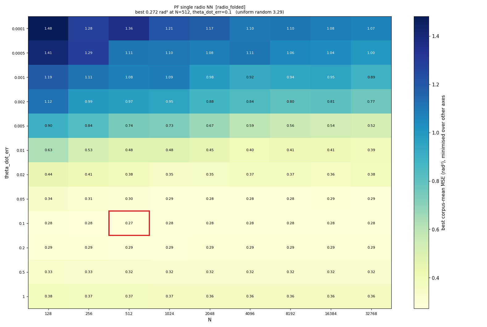
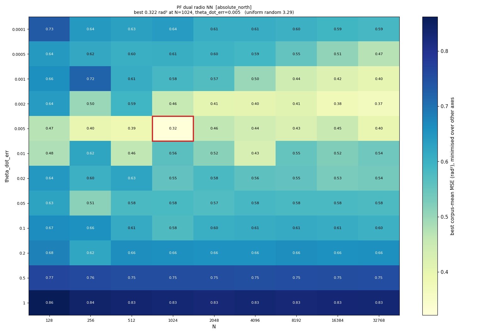

# E-INF2 phase A — hyperparameter surface survey

**28,800 runs · 3,600 configurations · 8 rover captures · 2 seeds · 2026-08-10**

Pre-registered design: [`experiments/e_inf2_hyperparam_survey/experiment_readme.md`](../../../../experiments/e_inf2_hyperparam_survey/experiment_readme.md).

Phase A maps the surface widely and cheaply so phase B can refine where the
optimum *is*, rather than where the grid stopped. It ran in three batches at
`--parallel 14–18`, ~75 min wall, **zero failures**.

---

## Headline: the tuning gain is not accuracy, it is cost

I expected the extended `theta_dot_err` range to buy accuracy, because four
families' optima sat at the old ceiling with MSE still falling 7–20% into it.
**It did not.** Matched to the same 8 datasets and the same seeds — the only
valid comparison — the accuracy is a wash:

| family | E-INF1 | phase A | change | better on |
|---|---|---|---|---|
| `PF single radio NN` | 0.281 | 0.272 | −3.0% | **8/8** |
| `PF single radio` | 0.565 | 0.563 | −0.5% | 5/8 |
| `EKF single radio` | 0.906 | 0.904 | −0.2% | 3/8 |
| `PF dual radio NN` [abs] | 0.322 | 0.322 | +0.0% | 0/8 |
| `PF dual radio` | 0.834 | 0.834 | +0.0% | 0/8 |
| `EKF dual radio` | 2.298 | 2.298 | +0.0% | 0/8 |
| `PF dual radio NN` [craft] | 0.650 | 0.584 | −10.1% | **2/8** ⚠ |

Only one family improves consistently, and only by 3%. The −10.1% row is better
on **2 of 8 datasets** — a corpus-mean artifact of exactly the kind that produced
a false frame ranking in E-INF1, and it is not counted.

**What the wide grid did find is that particle count is massively
over-provisioned.** Holding `theta_err` and `theta_dot_err` at each family's
optimum so that only N varies, paired per dataset:

| family | N | MSE | runtime | verdict |
|---|---|---|---|---|
| `PF dual radio NN` [craft] | 16384 → **256** | 0.694 → 0.584 | 4.52s → **1.20s** | **3.8× faster**, accuracy ambiguous (small-N better on 2/8, mean better) |
| `PF dual radio` | 16384 → **4096** | 0.861 → 0.834 | 4.22s → **1.57s** | **2.7× faster**, −3.1%, better on 5/8 |
| `PF single radio NN` | 1024 → 512 | 0.320 → 0.317 | 1.42s → 1.14s | 1.2× faster, −1.0% |
| `PF single radio` | 1024 → 256 | 0.584 → 0.586 | 1.33s → 1.09s | 1.2× faster, +0.3% |

The defensible claim is the middle one: **N = 16384 buys nothing measurable over
N = 4096 at 2.7× the cost.** Dropping to 256 may also be free, but there the
per-dataset split runs against the mean, so it is ambiguous rather than proven.

---

## The surfaces



The reason accuracy did not improve is visible immediately: **the optimum is a
broad plateau, not a peak.** The whole region `theta_dot_err` ∈ [0.05, 0.2] is
within a few percent at every particle count from 128 to 32768. The coarse grid's
winner was already inside it; extending the axis found more of the same flat
ground rather than a better point.

It also shows where the surface genuinely *does* move: below
`theta_dot_err` ≈ 0.005 it degrades sharply (0.43 → 1.20), which is the cliff the
March 2025 deck described. The coarse grid's four-point axis sampled that cliff
at only two points.



The absolute-north frame is a different surface entirely — its optimum sits at
`theta_dot_err` = 0.005, twenty times smaller than the craft-relative families'
0.1. That is **H3**, and it is the same dynamics result the stage-3 report
argued from angular rates, now visible directly.

The remaining five heatmaps are in [`figures/`](figures).

---

## Hypotheses

| id | prediction | outcome |
|---|---|---|
| **H1** | every PF optimum is interior in the extended grid | ✅ **SUPPORTED** — zero truncated axes across all seven families, down from eight |
| **H2** | ≥1 PF family improves ≥10% | ❌ **FALSIFIED** — best consistent gain is 3.0%; the one −10.1% row is better on 2/8 datasets |
| **H3** | optimal `theta_dot_err` differs ≥5× between frames | ✅ **SUPPORTED** — 0.1 (craft) vs 0.005 (absolute), a **20×** ratio |
| **H4** | `EKF single radio` with `dynamic_R` beats its E-INF1 winner | ❌ **REFUTED** — both EKF optima use `dynamic_R = 0`, the static form |
| ~~H5~~ | the `phi_std ⇄ dynamic_R` pairing is not required | ❌ **REFUTED before running** — it is a guard; see the readme |

**H2's falsification was pre-registered as a real outcome**, not a
disappointment: *"the truncation was real but harmless, and that is worth
recording as much as the alternative."* It is now recorded. Boundary-hitting
optima were a genuine methodological defect and fixing them cost ~75 min; the
lesson is that an optimum on an edge is worth checking and usually is not worth
much.

---

## A mistake in my own grid

Phase A is **not** a superset of the coarse grid, though I designed it as though
it were. I narrowed `theta_err` from five values to three to buy width on `N` and
`theta_dot_err`, reasoning that it "buys the least per job":

| family | E-INF1 `theta_err` | phase A | missing |
|---|---|---|---|
| `PF single NN` | 0.001–0.2 (5) | 0.001, 0.005, 0.02 | 0.075, 0.2 |
| `PF dual NN` [abs] | 0.001–0.2 (5) | 0.02, 0.075, 0.2 | 0.001, 0.005 |
| `PF dual NN` [craft] | 0.001–0.2 (5) | 0.005, 0.02, 0.075 | 0.001, 0.2 |
| `PF dual` | 0.001–0.2 (5) | 0.005, 0.02, 0.075 | 0.001, 0.2 |

An earlier partial comparison on 7 datasets showed two families *worse* than
E-INF1 because of it. On the full 8 they converge, so the damage was small — but
the reasoning was wrong regardless: I judged `theta_err` unimportant from a
**marginal** profile, and a marginal is minimised over the other axes, so it
hides exactly the interactions a 2-D heatmap exists to reveal. I made the error
the tool was built to prevent, while building it.

Phase B restores full `theta_err` coverage. That is affordable now precisely
because the surface has a plateau in `N` — the jobs come back from dropping
particle counts.

---

## Phase B

Written from these optima rather than guessed:

| family | `N` | `theta_err` | `theta_dot_err` |
|---|---|---|---|
| `PF single radio NN` | 512 | 0.001 | 0.1 |
| `PF dual radio NN` [abs] | 1024 | 0.075 | 0.005 |
| `PF single radio` | 256 | 0.001 | 0.1 |
| `PF dual radio NN` [craft] | 256 | 0.02 | 0.1 |
| `PF dual radio` | 4096 | 0.02 | 0.1 |
| `EKF single radio` | — | φ=1.0, p=0.1, noise=1e-4, dyn_R=0 |
| `EKF dual radio` | — | φ=1.0, p=0.1, noise=0.01, dyn_R=0 |

Phase B refines locally around each with **full `theta_err` coverage** and 5
seeds on all 16 datasets; phase C confirms on 48 with a paired per-store test.

Given H2, the honest expectation for B and C is **confirmation of near-parity at
much lower cost**, not an accuracy win.

---

## Reproducing

```bash
python spf/filters/run_filters_on_data.py \
  -d $(head -8 experiments/e_inf1_filter_sweep/stage2_rover_sample_n16.txt) \
  --empirical-pkl-fn empirical_dists/full_20260809_v1.pkl \
  --work-dir /mnt/qnap01/mouse9911/rovers_2026/filter_runs/e_inf2_survey \
  --config spf/filters/configs/rover2026_survey.yaml \
  --results-backend local --parallel 18
```

```bash
python spf/filters/plot_hyperparam_heatmap.py \
  --results spf/filters/reports/e_inf2_survey_20260810_v1/results.json \
  --output-dir spf/filters/reports/e_inf2_survey_20260810_v1/figures
```

⚠️ Every number above is **8 datasets at 2 seeds**. The E-INF1 leaderboards are
16 at 5. They are only comparable through the matched restriction used in the
first table; do not read the two reports' headline numbers against each other.
