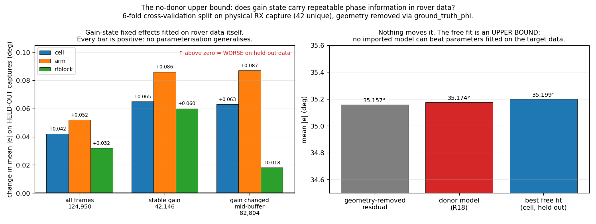

# Gain-phase correction on the direct PF filters

> ### ⚠️ READ FIRST — status of this report
>
> **Sections 1 and the first addendum stand.** The end-to-end sweep and the matched-table
> rebuild are valid as run.
>
> **Addendum 2 is WITHDRAWN in full.** It conditioned on `rx_theta_in_pis`, which is the array
> mount orientation and is constant per receiver per capture, not ground-truth bearing. Its
> 81.98° residual, r = −0.0245, r² = 0.060%, "2.1% of the phase budget", "the other 98%", and
> the claim that the physical question was closed are all retracted. See
> [Retraction 1](#-retraction-1-2026-08-14--addendum-2-was-wrong) below.
>
> **Addendum 3's CONCLUSION is ALSO WITHDRAWN** (second review, same day). It was added to
> replace Addendum 2 and fails for a different reason: the statistic it reports is
> quadratically insensitive to the effect size at issue, so it had **no power**. A *perfect*
> correction of the 1.0–1.9° at stake could move it by only +0.010–0.038°, against its own
> seed-to-seed sd of 0.033°; the sign flips with `min_n`. Its "upper bound" argument also rests
> on a nesting premise that is false — radio identity is absent from the fitted feature space
> while 6 distinct Plutos are pooled. See
> [Retraction 2](#-retraction-2-2026-08-14--addendum-3-had-no-power). The method and code stand;
> the inference does not.
>
> **The conclusion that survives is the engineering one:** do not deploy the held-out donor
> correction — correctly conditioned it changes the rover residual by **+0.009°,
> capture-clustered 95% CI [−0.024, +0.044]**, it is significantly worse end to end on 1,920 runs, and even a *perfect*
> correction is worth under 0.6% of filter RMSE *as measured end to end* (the "≤1.4%" derived
> ceiling is withdrawn — see [Retraction 3](#-retraction-3-2026-08-14--the-14-ceiling-was-not-a-ceiling)).
> **No claim in this report establishes that the
> gain-phase effect is absent on these radios.** That remains unmeasured.


**Run 2026-08-14.** 1,920 runs · 2 direct (non-NN) PF families · 4 arms · 5 seeds · 48 rover
captures · paired per capture · zero failures. Read-only: **the rover data was not modified**;
the correction is applied to an in-memory copy of `mean_phase` and nothing under
`/mnt/qnap01/mouse9911/rovers_2026` was opened for writing.

## Result

**Every correction arm is significantly WORSE than no correction**, and the negative control
is worse by a comparable margin.

### `PF single radio` [folded frame] — uniform floor 1.645 rad²

| arm | MSE | RMSE | vs random | std(z) | cov@68 | ΔMSE vs none | better on | Wilcoxon p |
|---|---:|---:|---:|---:|---:|---:|---:|---:|
| **none** | **0.5143** | **41.1°** | **3.20×** | **1.84** | 0.618 | — | — | — |
| shuffled *(control)* | 0.5297 | 41.7° | 3.11× | 1.86 | 0.605 | +0.0154 | 6/48 | 0.0000 |
| arm_lut | 0.5397 | 42.1° | 3.05× | 1.93 | 0.599 | +0.0254 | 5/48 | 0.0000 |
| constant | 0.5412 | 42.2° | 3.04× | 1.89 | 0.598 | +0.0269 | 4/48 | 0.0000 |

### `PF dual radio` [craft-relative] — uniform floor 3.290 rad²

| arm | MSE | RMSE | vs random | std(z) | cov@68 | ΔMSE vs none | better on | Wilcoxon p |
|---|---:|---:|---:|---:|---:|---:|---:|---:|
| **none** | **0.9411** | **55.6°** | **3.50×** | **1.57** | 0.705 | — | — | — |
| shuffled *(control)* | 1.0043 | 57.4° | 3.28× | 1.71 | 0.692 | +0.0632 | 7/48 | 0.0000 |
| constant | 1.0181 | 57.8° | 3.23× | 1.71 | 0.689 | +0.0769 | 5/48 | 0.0000 |
| arm_lut | 1.0281 | 58.1° | 3.20× | 1.68 | 0.686 | +0.0870 | 6/48 | 0.0000 |

**Calibration degrades too.** `std(z)` rises in every arm (paired p ≤ 0.0072 throughout), and
68% coverage falls. The correction did not merely fail to help accuracy — it made the
filters' uncertainty *less* honest as well.

## The controls are what make this interpretable

Without them the headline would read "gain-phase correction hurts", and that would be wrong.

**`shuffled` — same correction values, permuted across gain states — also degrades**, by
+0.0632 (dual) and +0.0154 (single). And `arm_lut` is **not better than `shuffled`**; it is
*worse*, on both families (Δ = +0.0238, p = 0.0145; Δ = +0.0100, p = 0.0001).

If the correction carried real information about the frames it was applied to, it would have
to beat a version of itself with the gain mapping destroyed. It does not. **What is being
measured is the magnitude of the perturbation, not its content.**

**`constant` is statistically indistinguishable from `arm_lut`** (p = 0.101 dual, p = 0.485
single). Almost all the damage is done by the ~7° constant offset, not by the gain-dependent
variation — which is the entire quantity the model exists to predict.

## Why: the empirical table was fitted on uncorrected φ

This was pre-registered as the risk to watch, and it is what happened. The empirical table
maps φ → p(θ) and was built from **uncorrected** data, so the gain-phase offset is already
baked into it. Subtracting ~7° from φ at inference moves the input *away* from the
distribution the table was fitted on. The correction and the table disagree, and the table
wins because it is what converts φ into a bearing.

That also explains the ordering: the median correction is ≈ 6.97°, essentially all of it
constant (measured earlier: weighted mean D = 6.32° of a 6.37° mean |D|), and `constant`
reproduces nearly all of the harm on its own.

**So the constant is absorbed — by the empirical table itself.** That answers the open
question directly, and it means the deployable prize was never the 6–10°; it is only the
1.0–1.9° of variation, of which a held-out donor table removes 22–41%, i.e. ~0.3–0.7° of
phase ≈ 0.12–0.28° of bearing, against filter RMSEs of 41–56°.

## What this does and does not rule out

**Ruled out:** applying a gain-phase correction at inference against the frozen empirical
table. It is harmful, reproducibly, on 48 captures at p < 0.0001.

⚠️ **On the independent-unit count.** The 48 merged stores are only **42 unique RX
recordings** — some RX captures are merged against more than one TX partner (established in
Retraction 1). The paired Wilcoxon tests above pair on the merged store, so their n is
slightly optimistic. The effect sizes are large and the direction unambiguous, so this does
not change the conclusion, but the p-values must not be read as 48 independent captures.

**NOT ruled out:** that gain-phase correction helps when the empirical table is *rebuilt from
corrected φ*. This experiment cannot distinguish "the correction is worthless" from "the
correction is inconsistent with the table". The controls say the second is more likely, since
a random perturbation of the same size does comparable damage.

The honest next step, if anyone wants to settle it, is the fork recorded in the plan: rebuild
the empirical table from corrected φ and re-run. That touches a frozen artifact and needs its
own named table, so it is a larger change than this one — and given the effect size above
(~0.2° of bearing inside a 41–56° RMSE), I would not spend the bench or compute time on it
without a specific reason.

## Caveat on the donor

The rover's radios are **held out** — they are not the fitted serial and have no calibration
of their own. This measures the held-out-donor case, which is what the rover would get today.
A same-radio table would remove 82–86% of the variation rather than 22–41%, but the failure
mode identified above is about the table mismatch, not the donor, so a same-radio table would
not obviously change the sign of this result.

## Reproducing

```bash
P=~/virtual-envs/spf/bin/python3
PYTHONPATH=$PWD $P spf/filters/run_filters_on_data.py \
  -d $(cat experiments/e_inf1_filter_sweep/stage3_rover_all_n48.txt) \
  --empirical-pkl-fn empirical_dists/full_20260809_v1.pkl \
  --work-dir /mnt/qnap01/mouse9911/rovers_2026/filter_runs/phasecorr \
  --config spf/filters/configs/rover2026_phasecorr.yaml \
  --results-backend local --parallel 16
$P analysis/analyze_phasecorr.py
```

⚠️ `PYTHONPATH` matters: launching `run_filters_on_data.py` as a script puts `spf/filters/` on
`sys.path`, not the repo root, so without it `import spf` resolves to the installed package
and you can silently run a mixture of two checkouts.

**Baselines.** The single-radio family scores a folded half-circle, whose uniform-random floor
is **π²/6 = 1.645 rad²**, not the π²/3 that `spf/evaluation/metrics.py` defines. Scoring it
against π²/3 overstates skill by roughly 2×.

---

## Addendum — rebuilding the empirical table from corrected φ

The negative above could not distinguish "the correction is worthless" from "the correction is
inconsistent with the table". That fork has now been run.

### Method

A **matched pair** of empirical tables was built from **the same 48 rover captures**, same 65×65
bins, differing only in whether `mean_phase` was corrected during the build. Then each table was
used for inference with the *same* correction applied — the two diagonal cells of the 2×2. The
off-diagonal (mismatched) cells are blocked by a new consistency assert and were already
measured harmful above.

`PhaseCorrectedDataset` fails closed outside the model's support (5766/5840 MHz, gains 26–62),
so the correction pass touched only the captures the model covers — no scoping code was needed.

### The tables do differ, more than a bin-width argument predicts


**Figure 1.** p(θ|φ) for three of the six rover spacing keys: uncorrected, corrected, and the
difference. The difference panels are **structured dipoles along each ridge** — the signature of
a sub-bin φ shift moving probability across bin edges.


**Figure 2.** The p(θ|φ) slices the particle filter actually samples. **The curves do not
overlie**: mean total-variation distance is **0.11–0.25** across the six keys, despite a
centroid shift of only 0.002–0.057° against a 5.54° bin. A sub-bin shift near a sharp ridge
flips frames across bin edges, so the conditional moves considerably more than the shift/bin
ratio suggests. *This corrects the a-priori estimate in the plan, which used the bin-width
ratio as a ceiling and was too optimistic about the table being unchanged.*

### Result: calibration is fixed, accuracy is not

| family | variant | MSE | RMSE | vs random | std(z) | cov@68 |
|---|---|---:|---:|---:|---:|---:|
| PF dual radio | table+φ **uncorrected** | **0.9382** | **55.5°** | **3.51×** | 1.73 | 0.681 |
| PF dual radio | table+φ **corrected (matched)** | 0.9727 | 56.5° | 3.38× | **1.67** | 0.682 |
| | | ΔMSE **+0.0345**, better on 8/48, p=0.0000 | | | Δstd(z) **−0.056**, p=0.0308 | |
| PF single radio | table+φ **uncorrected** | **0.5096** | **40.9°** | **3.23×** | 1.99 | 0.603 |
| PF single radio | table+φ **corrected (matched)** | 0.5190 | 41.3° | 3.17× | **1.85** | 0.605 |
| | | ΔMSE **+0.0094**, better on 11/48, p=0.0000 | | | Δstd(z) **−0.141**, p=0.0001 | |

**The mismatch hypothesis is confirmed, and it was doing real damage.** Against the mismatched
run above, making table and inference consistent:

| | mismatched (table uncorrected, φ corrected) | matched (both corrected) |
|---|---:|---:|
| ΔMSE, dual radio | +0.0870 | **+0.0345** |
| Δstd(z), dual radio | **+0.112** (worse) | **−0.056** (better) |
| Δstd(z), single radio | **+0.089** (worse) | **−0.141** (better) |

Consistency **halves the accuracy penalty and flips the sign of the calibration effect**.
Calibration is now *significantly better* on both families — which is exactly where the plan
predicted an effect would appear, since a systematic removal should show up in the honesty of
the reported variance before it shows up in accuracy.

**But accuracy is still significantly worse**, on 40/48 and 37/48 captures. So the answer is
not "the correction was only inconsistent"; there is a residual accuracy cost that consistency
does not remove. The most likely cause is the donor: the rover's radios are **held out**, and a
donor table removes only 22–41% of the correctable variation while injecting the rest as error.

### Verdict

**Do not deploy.** A consistent rebuild buys better-calibrated uncertainty at a small but
reproducible accuracy cost, and neither effect is large enough to matter against RMSEs of
41–56°. **The deployment question is settled for the held-out donor.**

**What would still be worth testing:** the same 2×2 with a **same-radio** table for the rover's
own units, which removes the donor as a confound. It needs an E-GSC9-style capture per rover
radio (~2.6 h each) and is not justified by the effect sizes here.

> ⚠️ *Amended 2026-08-14.* This paragraph originally read "the question is now closed" and
> called a same-radio table "**the only** remaining way the accuracy sign could flip". Both are
> too strong. Only the *deployment* question is settled, and several tests requiring **no new
> capture** were identified later — see
> [what would actually settle it](#what-would-actually-settle-it--no-new-capture-needed).

⚠️ **One caveat on the baselines in this addendum.** Both tables are built from the same 48
captures the filters are evaluated on, so these baselines (0.9382 / 0.5096) are slightly
*better* than the shipped-table baselines above (0.9411 / 0.5143) — the table is fitted on its
own evaluation data. That affects both arms identically and so does not bias the comparison,
but these numbers must not be quoted as clean held-out performance.

---

## Addendum 2 — why: the correction explains 0.060% of rover phase variance ⚠️ WITHDRAWN IN FULL

> ### ⚠️ EVERY NUMBER IN THIS ADDENDUM IS WITHDRAWN — DO NOT CITE ANY OF IT
>
> It conditions on `rx_theta_in_pis`, which is the array **mount orientation** and is constant
> per receiver per capture — *not* ground-truth bearing. Every frame of a receiver therefore
> fell into a single "bearing bin", so the 81.98° denominator contains the whole trajectory's
> real geometric signal, which is precisely what the array exists to measure.
>
> **Withdrawn:** the 81.98° residual · r = −0.0245 · r² = 0.060% · "2.1% of the phase budget" ·
> "the other 98% is multipath, geometry and segmentation" · "this retires the last open option"
> · and the conclusion that the physical question is closed. Correctly conditioned, the
> residual is **36.7°** and the correlation is **+0.0138** — the sign was an artifact too.
>
> Retained unedited below **only** because these numbers were published and circulated. The
> corrected analysis is [the corrected analysis](#the-corrected-analysis);
> the full account is [Retraction 1](#-retraction-1-2026-08-14--addendum-2-was-wrong).

The controls said the perturbation's *magnitude* was being measured, not its content. This
says why the content is absent. Within 2° ground-truth bearing bins, the bin mean is removed
from both the measured phase and the predicted correction, and one is regressed on the other
(`analysis/why_null.py`, 24,108 frames over 8 captures):

| | value | interpretation |
|---|---:|---|
| slope β | **−1.1446** | +1 would be a perfect model |
| correlation r | **−0.0245** | SE ≈ 0.0064 |
| **variance of φ explained** | **0.060%** | |
| sd of predicted correction in a bin | 1.751° | |
| **sd of φ residual in a bin** | **81.980°** | |
| correction as a share of the residual | **2.1%** | |

**This is not a sign error.** β is negative but r is ~0, so the slope is noise amplified by the
variance ratio (β = r·σ_Y/σ_X). The correction simply carries almost no information about
these radios' phase. The small negative correlation is statistically real (3.8 SE) and
practically nil, and it is why MSE rose rather than fell.

**Even a perfect gain-phase correction would address 2% of what moves φ on a flying rover.**
The remaining 98% is multipath, geometry and segmentation — outside the scope of any gain
table.

### This retires the last open option ⚠️ *(withdrawn — see the banner above)*

The previous addendum left one route open: a **same-radio** table for the rover's own units,
to remove the donor as a confound. That is now withdrawn. It would recover more of a term that
is 2.1% of the phase budget, at ~2.6 h of bench time per radio. **The recommendation is to stop
work on gain-phase correction for the rover.**

The model itself remains valid and worth keeping for bench and hardware-diagnostic use — it
localised R17's fault to a single LNA coefficient. It is deployment to the rover that is closed.

---

## ⚠️ RETRACTION 1 (2026-08-14) — Addendum 2 was wrong

**Addendum 2 above is withdrawn in full.** An external review found that
`analysis/why_null.py` conditioned on the wrong angle, and the finding is confirmed.

### The bug

The script binned on `rx_theta_in_pis` and called the bins ground-truth bearing.
**`rx_theta_in_pis` is the array MOUNT ORIENTATION and is constant per receiver per capture** —
measured directly: `1.0` on r0 and `0.5` on r1, one unique value each. Every frame of a
receiver therefore fell into a single bin. What was reported as "the phase residual at fixed
bearing" was the phase variation across the **entire trajectory**, which is overwhelmingly the
real geometric signal the array exists to measure.

The dataset already exposes the right quantities — `ds.ground_truth_thetas[r]` (755 unique
values spanning ±180° on the same capture) and `ds.ground_truth_phis[r]`.

### What is withdrawn

The 81.98° residual · r = −0.0245 · r² = 0.060% · "2.1% of the phase budget" · "the other 98%
is multipath, geometry and segmentation" · "even a perfect correction cannot matter" · "the
question closes". **None of these are supported.** The review also correctly notes that the
"2.1%" was a standard-deviation ratio being presented alongside an r² and then treated as an
additive decomposition; those are three different quantities.

### The corrected analysis

`analysis/geometry_conditioned.py` removes geometry exactly —
`e = wrap(mean_phase − ground_truth_phi)`, centred per stream — and deduplicates the 48 merged
stores down to **42 unique RX captures** (they reuse RX recordings across TX partners).

| | |
|---|---:|
| physical RX captures / receiver-streams / frames | 42 / 84 / **134,224** |
| mean \|e\| **without** correction | **36.712°** |
| mean \|e\| **with** correction | 36.721° |
| **change** | **+0.009°, capture-clustered 95% CI [−0.024, +0.044]** |
| better on | 45/84 streams — a coin flip |
| corr(correction, residual) | **+0.0132**, r² = **0.017%** |

> ⚠️ **Superseded numbers.** This table originally read 124,950 frames / 36.728° / +0.017°, CI
> [−0.020, +0.061]. The keep-first dedup discarded **9,274 frames (+7.42%)** across 6 RX captures
> that are **disjoint in time** from what it kept — verified as 0 shared timestamps and 0.0 s of
> interval overlap in all 6. `analysis/geometry_conditioned_v2.py` concatenates them per physical
> capture and resamples **captures**, not streams. Effect: **+0.0174° → +0.0087°**, i.e. further
> toward the null. *(The "+0.0139°" quoted in the acknowledgements below is a third, per-store
> variant that centres a split capture twice; it is not canonical.)* The capture-clustered
> bootstrap turned out to be **immaterial** — 0.9995× the per-stream width, within-capture
> correlation −0.0075 — so it neither tightened nor widened anything. One caveat that remains
> unmodelled: several distinct RX captures were merged against the *same* TX recording, so TX
> GPS/track error is shared across some clusters.

> **Why 36.728° here and 35.157° in Addendum 3, on the same 124,950 frames.** This table
> averages the **84 per-stream means unweighted**, because the stream is the bootstrap's
> independent unit. Addendum 3 is **frame-weighted** over the whole pool. Shorter streams have
> larger mean |e| — measured corr(length, mean |e|) = **−0.389**; the shortest 21 streams
> average **42.15°** against **34.09°** for the longest 21 — so the unweighted average sits
> **+1.572°** higher. Two weightings of one quantity, not two measurements, and both reproduce
> exactly. They are not interchangeable, and earlier drafts quoted "35–37°" as a range without
> saying why it was a range.


**Figure 3 (corrected).** Left: per receiver-stream mean |e| with and without the correction —
every point sits on the identity line. Centre: the per-stream change, with the bootstrap 95% CI
straddling zero. Right: the predicted correction against the geometry-removed residual, r =
+0.0138. This figure supersedes the withdrawn `rx_theta_in_pis` analysis, which produced no
figure. **It bounds the held-out donor, not the physics.**

The residual is **36.7°, not 82°**, and the correlation is **positive, not negative** — the
sign in the withdrawn analysis was an artifact. The CI is a per-stream bootstrap, because
streams are the independent unit; frames are not.

### What this does and does not support

**Supported:** the R18-derived **donor** correction has no detectable effect on the
geometry-conditioned rover residual. Combined with the end-to-end sweep, that is sufficient for
the engineering decision — *do not deploy the currently tested correction.*

**NOT supported by *this* analysis, and previously overclaimed here:** that a *perfect*,
same-radio, or sample-weighted correction cannot matter. A noisy or mismatched predictor is
attenuated toward zero correlation even when the underlying physical term is real, so a null on
a held-out donor does not bound a correctly-conditioned one. This report claimed a physical
closure it had not earned, and **that closure is retracted.**

**Addendum 3 below attempted to establish it properly**, using no donor model at all — the
check the review proposed, requiring no new bench capture. ⚠️ **It failed too, and its
conclusion is withdrawn** — see [Retraction 2](#-retraction-2-2026-08-14--addendum-3-had-no-power).
The question this retraction opened is still open.

---

## Addendum 3 — the no-donor fixed-effects fit ⚠️ CONCLUSION WITHDRAWN

> ⚠️ **Read [Retraction 2](#-retraction-2-2026-08-14--addendum-3-had-no-power) first.** The
> method below is sound and the numbers reproduce exactly, but the inference drawn from them —
> that this is an upper bound and that the physical question closes — **does not follow.** The
> statistic had no power to detect the effect at issue. The **method and results tables below
> are retained verbatim**, because their numbers were published; the two argument subsections
> that followed them are replaced, and what they originally claimed is quoted in Retraction 2
> so it can still be audited.

Retraction 1 left one question genuinely open: a null on a *held-out donor* cannot distinguish
"the physical term is negligible" from "R18's table is the wrong predictor". This was an
attempt to settle it without importing any model. **It does not settle it.**

### Method

The gain effect is estimated **from the rover data itself**:

```
e = wrap(mean_phase − ground_truth_phi)        geometry removed exactly
e ~ α_stream + δ(gain state)                   δ LEARNED, not imported
```

`δ` is a **circular mean per gain state** (not a least-squares coefficient — `e` spans ±180°
with a ~49° sd, where regression on wrapped angles is invalid). `α_stream` is handled by
centring each stream circularly in train and test alike, the same "per-session constant is
absorbed downstream" assumption the rest of the pipeline makes.

**6-fold cross-validation split on physical RX capture** (42 unique, not 48 merged filenames).
Three parameterisations, two strata.

### Result — every cell is positive ⚠️ *(and this is uninformative — see Retraction 2)*

| stratum | frames | model | mean \|e\| before | after | **change** |
|---|---:|---|---:|---:|---:|
| all | 124,950 | cell | 35.157° | 35.199° | **+0.042°** |
| all | | arm | 35.157° | 35.209° | +0.052° |
| all | | rfblock | 35.157° | 35.189° | +0.032° |
| **stable gain** | 42,146 | cell | 34.698° | 34.763° | **+0.065°** |
| stable gain | | arm | 34.698° | 34.784° | +0.086° |
| stable gain | | rfblock | 34.698° | 34.758° | +0.060° |
| mid-buffer change | 82,804 | cell | 35.390° | 35.453° | +0.063° |
| mid-buffer change | | arm | 35.390° | 35.477° | +0.087° |
| mid-buffer change | | rfblock | 35.390° | 35.408° | +0.018° |



**Figure 4.** Left: change in held-out mean \|e\| for every parameterisation and stratum — all
positive, i.e. all worse. Right: the geometry-removed residual is unmoved by the donor model
(35.174°) and by the best free fit (35.199°).

### ⚠️ Why this is NOT an upper bound

*The original text of this section argued that `δ` is fitted on the target data, so no imported
model can beat it; that a same-radio capture, a sample-weighted trajectory, or a better
mechanistic form would each be a constrained version of the free fit; and that restricting to
stable-gain frames removes the mid-buffer objection. It is withdrawn. Two of those three claims
are false.*

**The free fit is not a superset of a same-radio model.** `state_keys()` keys on
`(g1, g2, LO_MHz)` and nothing else, while the corpus pools **6 distinct physical Plutos across
3 rover units** (RO1 52,451 / RO3 58,562 / RO4 13,937 frames). `sdr_serial` is present in all
84 streams and is not read. Radio identity is a dimension the fit *discards*, so a same-radio
model is a different model, not a sub-model. The same applies to a within-buffer gain
trajectory.

**The fit had no power regardless.** See Retraction 2 — this is the decisive objection, and it
applies to the `cell` row too, which is otherwise a correct saturated estimate.

**What does survive:** the stable-gain stratum genuinely does remove the mid-buffer objection
*within itself* — when start gain equals end gain there is one gain value in play, so a
sample-weighted predictor collapses to the frame's gain state. That much of the original
argument was right. It just does not rescue an underpowered statistic.

### The question is NOT closed

The corrected statement: **we have not measured whether gain state carries usable phase
information on these radios.** This analysis cannot distinguish a real 1–2° effect from no
effect at all — both produce the numbers in the table above.

**A same-radio bench campaign is therefore declined on cost/benefit, not on physics.** Even a
perfect correction is worth under 0.6% of filter RMSE, measured end to end — which justifies
deprioritising a 2.6 h/radio campaign. *(The derived "≤1.4%" that stood here is withdrawn; see
[Retraction 3](#-retraction-3-2026-08-14--the-14-ceiling-was-not-a-ceiling).)* It does not justify predicting
the campaign would find nothing. *(That recommendation was withdrawn in Retraction 1 for being
unsupported, reinstated here on evidence that does not reach it, and is now rescoped.)*

The 35.2° residual is where rover bearing accuracy actually lives. Identifying its composition
— multipath, GPS/heading error, segmentation — is a different and larger investigation.

---

## ⚠️ RETRACTION 2 (2026-08-14) — Addendum 3 had no power

A second methodological review rejected Addendum 3's conclusion. It is right, and the decisive
reason emerged only from adjudicating it — neither the review nor the original analysis stated
it.

### The sensitivity law that should have come first

The reported statistic is the change in mean |wrap(e)|. That functional responds
**quadratically** to a small phase offset buried in a 49.24° residual. Measured directly on the
actual 124,950 residuals (`analysis/power_calibration.py`):

> **Δ(mean |e|) = 0.0101 · A²** degrees, for a gain term of rms amplitude *A* degrees.

| true rms term *A* | ceiling on Δ from removing it **perfectly** |
|---:|---:|
| 1.0° | **+0.010°** |
| 1.4° | **+0.020°** |
| 1.9° | **+0.038°** |
| 3.0° | +0.090° |
| 5.0° | +0.258° |

*(Table entries are measured directly, averaged over 12 draws; the law above is a fit to the
small-A regime, so it reproduces the top rows and drifts ~2% by 5°.)*

> ### ⚠️ AMENDED 2026-08-14 — the amplitude fed into this law was the wrong moment
>
> **"1.0–1.9°" is a mean absolute deviation, not an rms.** It is correctly labelled "MAD about
> the mean" where it is defined (`rover_model_gsc9_20260814_v1/REPORT.md:313`) and was called
> "bench-measured sd" here. This law takes a *second* moment, so the mislabel is squared. The
> rms about the identical weighted circular mean, on the identical frames and occupancy weights,
> is **1.78 / 2.70 / 4.18 / 5.65°** (R18 5766, R18 5840, R17 5766, R17 5840). Observed rms/MAD
> is **1.81–3.02** — a Gaussian 1.253 conversion would also have been wrong, by 1.4–2.4×.
> Measured in `analysis/true_amplitude.py`.

The term at issue is **1.78–5.65° rms**, or **1.78–2.70°** for R18, the only donor actually
deployed. An oracle with perfect knowledge of `δ` could therefore have moved the headline by
**+0.032 to +0.322°** (**+0.032 to +0.074°** for R18 alone). Dropping the Gaussian assumption
entirely — injecting the *real* discrete per-cell correction at each frame's own gain cell —
gives **Δ = +0.0447 ± 0.0007°** for R18 and **+0.2089 ± 0.0011°** for R17, agreeing with the
quadratic law to 3% at this amplitude. Now compare the procedure's own noise:

| source | magnitude |
|---|---:|
| fold-seed sd (8 seeds, cell/all; CV is 6-fold) | **0.033°** |
| seed range | +0.002° … +0.111° |
| `min_n` 8 → 25 | **+0.042° → −0.013°** (sign flips) |
| `min_n` 50 / 100 | −0.006° / −0.001° |
| randomised-gain-label null | +0.004° … +0.114° |

**The signal ceiling is 1.3–1.4× the fold-seed sd for the deployed donor, and 6.3× for R17.**
⚠️ The sentence that stood here — *"the entire signal ceiling is no larger than one sd of the
statistic's own fold-seed noise"* — is **WITHDRAWN**; it was computed from the MAD. Retraction 2
stands on its other two legs, untouched: the ceiling still sits well inside the statistic's
observed run-to-run range (+0.002 to +0.111°), and the sign still flips with `min_n`. The correct
word is **under-powered**, not *guaranteed blind*.

One caveat the other way, so the margin is not over-read: R18's excess over the seed sd is
carried by the tail. **2.08% of frames carry 72.6% of its second moment**, and one cell —
(g₁ 62, g₂ 40) at 5840 MHz, where the table predicts −17.4° — is 20.4% of it. Trim the top 1% of
\|δ\| and Δ falls to **+0.0152°**, below the seed sd. **The answer is conditional on those
LNA-crossing cells being physical**, which ~30 minutes of bench repeat would settle.

Equivalently, as break-even amplitude — the
rms effect at which a free *k*-parameter fit's signal just covers its own parameter cost:

| model | free params | break-even *A*, **MEASURED** | *(withdrawn heuristic)* | vs the donor's true **2.08° rms** |
|---|---:|---:|---:|---|
| `cell` | 326 | **3.08°** | *4.83°* | needs 1.5× more |
| `arm` | 114 | **3.41°** | *2.86°* | needs 1.6× more |
| `rfblock` | 49 | **2.91°** | *1.87°* | needs 1.4× more |
| *one-parameter projection onto a known LUT* | *1* | ***0.29°*** | *0.27°* | **7× inside reach** |

> ⚠️ **The parameter-counting heuristic is withdrawn and replaced by direct measurement**
> (`analysis/lut_injection_power.py`, `detection_threshold.py`: the deployed LUT injected along
> each stream's *real* gain sequence, 8 fold seeds, estimator verified bit-identical to
> `gain_fixed_effects.cv` at 7.1e-15°). It predicted a **2.58×** spread with `rfblock` far the
> most sensitive; the measured spread is **1.17×** and the ordering **inverts** — `arm` is
> worst. Measured cost per free parameter is *anti-correlated* with *k*. So "a saturated
> per-cell fit is the wrong instrument **because it has too many parameters**" is **withdrawn**;
> it is the wrong instrument, but not for that reason. The cost is dominated by the
> `arm`/`rfblock` marginal-vs-joint misspecification.
>
> **An i.i.d. Gaussian is also the wrong calibration instrument, independently of amplitude.**
> The estimator recovers **35–153%** of an injected gain-*shaped* term and **0%** of a Gaussian
> of identical rms (recovery −0.01 to +0.07 at every amplitude, 4/8 seeds negative — pure
> noise). Any future power calibration here that uses `rng.normal` as a stand-in for a hardware
> effect is measuring nothing.

*(Effective sample size 33,908 of 124,950 frames, from a measured lag-1 residual
autocorrelation of 0.573.)*

The per-cell fit Addendum 3 leans on — the "most flexible form" whose failure carried the
argument — needs a **2.5–4.8× larger** effect than physics offers before its signal covers its
own parameter cost. Only `rfblock` comes close, and it sits at the top of the plausible range.
**The experiment was guaranteed to return a small positive number whether or not the effect
exists** — which is exactly what the randomised-label null does too.

### Withdrawn

"The physical question is now CLOSED, on evidence" · "an upper bound no imported model can
beat" · "every cell is positive" *as evidence of absence* · "no same-radio bench campaign is
justified" *as a physics claim* · and the docstring claim that "nothing imported from a bench
can beat it".

### Also confirmed by the review, real but not fatal

- **`arm` and `rfblock` are not fitted jointly.** One residual is appended to every active
  feature's own bucket, each bucket gets its own circular mean, and prediction sums them — so
  the estimator returns E[e|g₁] + E[e|g₂], not a joint fit of d₁(g₁) − d₂(g₂). At g₁ = g₂ it
  overcounts by exactly 2×. On this corpus (within-LO gain correlation 0.34–0.36, g₁ = g₂ in
  3.0% of frames) the measured inflation is **1.02×** — an efficiency loss, not the cause of
  the result. `rfblock` additionally double-counts *within* one arm, since the mixer and LNA
  words are both functions of the same gain index and both signed +1.
- **The dedup discards real data.** Keeping the first store per RX prefix drops 6 merged stores
  — **9,274 usable frames, 12 receiver-streams, 6.9%** — which are **disjoint in time** from
  what is kept, not duplicates of it. Adding them back moves the donor result +0.0174° →
  +0.0139°, CI still spanning zero. Both scripts share the defect.
- **Support was never reported.** Retention is on 8 *frames*, not captures. Measured: held-out
  coverage is **97.75%**, the median retained parameter rests on **12 distinct captures /
  4,965 training frames**, and only 2.8% rest on a single capture — so the support is better
  than the rule guarantees, but the report should have said so rather than leaving it unstated.
- **Factual corrections:** "~500 distinct gain cells" is wrong — there are **854 corpus-wide**
  and **288–317 actually fitted per fold**. Endpoint stability is **31.34%** at 5766 MHz and
  **54.54%** at 5840 MHz.

### Where the review itself over-reached

Recorded so the next reader is not misled in the other direction:

- Its illustrative mechanism — "radio A +2°, radio B −2° cancel in the pool" — describes a
  *constant* per-radio offset, which the per-stream circular centring at
  `gain_fixed_effects.py:123` already removes. Only gain-*dependent* per-radio differences
  could survive, a narrower claim.
- The "2× doubling" is conditional on g₁ = g₂; it is **1.02×** on this data.
- "The CI may be too narrow" is **refuted**: a capture-clustered bootstrap is 1.009× the
  per-stream one, and the within-capture correlation of the per-stream delta is −0.0017.
- The mean-vs-median mismatch is real but tied to *skew*, not to the 49° spread — the gap is
  exactly zero for any symmetric wrapped law. Substituting a circular median makes held-out
  error **worse** at every `min_n` tested (+0.083° vs +0.042°), because at these sample sizes
  the median is the noisier estimator.
- Its proposed **sample-weighted correction is not computable from this corpus.**
  `gain_observation_*`, `gain_event_*` and `sample_counter_end_exclusive` exist in the v7
  *schema* but appear in **0 of 96** receiver groups here; `first_gain_change_sample` is the
  −1 sentinel in **383,686 of 383,688** cells. That predictor needs new protocol-v3 capture.

### What would actually settle it — no new capture needed

1. **Audit the two numbers the surviving argument now rests on:** the 1.0–1.9° correctable
   variation and the °-bearing-per-°-phase conversion. Neither has been independently checked.
2. **Replace the statistic with a one-parameter circular projection** α̂ of the residual onto a
   hypothesised LUT shape, capture-clustered bootstrap. Break-even 0.27° instead of 1.9–4.8°.
   ⚠️ An earlier version of this item cited a prototype giving "α̂ = 0.814, CI [+0.595, +1.018]"
   against "α̂ = −0.186, CI [−0.412, +0.063]". **That prototype was never committed and those
   numbers are withdrawn.** Implemented properly (`analysis/detection_threshold.py`) the
   real-data result is **inconclusive**: β̂ = **+1.18° rms, capture-bootstrap 95% CI
   [−0.675, +2.433]**, 88% of resamples positive, injection-recovery slope 0.99 (unbiased). The
   deployed table's own 2.08° amplitude sits *inside* that CI, so the effect is neither detected
   nor excluded. The CI is **capture-limited**: doubling 42 → ~84 captures roughly halves it.
3. **Add the missing controls:** per-capture CI, seed spread, `min_n` sweep, and a
   **run-preserving** null (circular shift of the gain-key sequence within each stream). A
   plain within-stream shuffle is not adequate: gain is held for long runs and the residual has
   lag-1 autocorrelation 0.573, so shuffling destroys the run structure and inflates
   significance.
4. **Fix the dedup and the marginal-vs-joint fit** before any re-run.

Only a same-radio bench LUT can test the per-radio hypothesis directly, and only protocol-v3
firmware makes a sample-weighted model computable. **Decline those on the measured end-to-end
effect if you decline them — not on this addendum, and not on the withdrawn ≤1.4% ceiling.**

---

## ⚠️ RETRACTION 3 (2026-08-14) — the "≤1.4% ceiling" was not a ceiling

A third review accepted Retractions 1 and 2 but found that the overstatement had **moved into
the engineering quantification**: with the physics claim withdrawn, the recommendation was left
resting on a derived "≤1.4% of filter RMSE" ceiling that nobody had audited. It does not hold.
Four independent errors, and they do **not** all point the same way.

**1. The amplitude was the wrong moment — this makes the ceiling BIGGER.** "1.0–1.9°" is a MAD;
the law takes an rms. True rms **1.78–5.65°** (1.78–2.70° for the deployed donor). See the
amendment in Retraction 2 above.

**2. The arithmetic did not follow from its own inputs.** 0.76° ÷ **41.09°** (the *smaller* of
the two filter RMSEs) = **1.85%**, not 1.37%. The published number divided the largest numerator
by the largest denominator. On its own inputs the range is **0.72%–1.85%**.

**3. The conversion is not a constant.** \|dθ/dφ\| = 1/(2π(d/λ)·\|cos θ\|) depends on spacing
*and* bearing and **diverges at endfire**. Measured framewise over 177,410 frames
(`analysis/jacobian_audit.py`): median **0.296**, IQR [0.237, 0.545], P90 **1.333**, P95
**2.573**; **34.6% of frames exceed 0.40**; mean and rms both divergent. Every rover capture is
**d/λ = 0.673–0.916** and spatially aliased — 0.40 corresponds to d/λ = 0.398, the *wall array*.
*(In fairness: as a mean-absolute conversion 0.40 is defensible — re-inverting through the
repo's own `phase_diff_to_theta` gives 0.41–0.49 °/°. It is the use, not the value, that fails.)*

**4. An L1 numerator over an L2 denominator.** Like-for-like the rms displacement is 3.50 °/° at
A = 1.78°, 12× the mean-absolute figure. And if the removed term is approximately *independent*
of the remaining error the reduction is **quadratic**: 0.017%, a factor of ~100 the other way.

Corrected, the derived band spans **0.01% to 2.9%** depending on two choices nobody has
measured. **A quantity with a 300× range is not a ceiling.**

**5. The deeper problem: the pipeline never inverts a sine.** φ is quantised into 65 bins of
5.5385° and read into a multimodal empirical p(θ\|φ). A 1.0° correction leaves the likelihood
**bit-identical on 82.1% of frames**, and the median shift in the table's circular-mean θ is
**exactly 0.000°**. A local derivative — corrected or not — is the wrong instrument.

### What replaces it — a measurement that was already in this report

**`arm_lut` minus `constant` *is* the gain-dependent term.** Both arms apply the same ~6.3°
per-receiver constant; only `arm_lut` adds the variation. From the Result tables at the top:

| family | `constant` → `arm_lut` | Δ RMSE | % of uncorrected RMSE | Wilcoxon p |
|---|---:|---:|---:|---:|
| PF single radio | 42.150 → 42.092° | **−0.059°** | −0.14% | 0.485 |
| PF dual radio | 57.812 → 58.095° | **+0.283°** | +0.51% | 0.101 |

**Under 0.6% of RMSE, opposite signs between the two families, neither significant.** Inverting
the dual point estimate, a perfect removal takes 55.583 → 55.287° = **0.53%**; the single-radio
point estimate is zero or negative.

**Two caveats travel with it.** The measurement sits at an **out-of-distribution operating
point** — φ already shifted ~6.3° from where the frozen empirical table was fitted — and
**nothing committed propagates a phase term of known amplitude through the actual particle
filter.** The per-frame like-for-like L2 sensitivity is 12–15% of RMSE, so the honest range is
wide. This is a measurement of limited power, **not a bound**.

**The recommendation is unchanged; its foundation is not.** Deprioritising the same-radio
campaign is a prioritisation call under a measured-but-imperfect estimate. It is not a ceiling,
and it is not evidence that the effect is absent.
