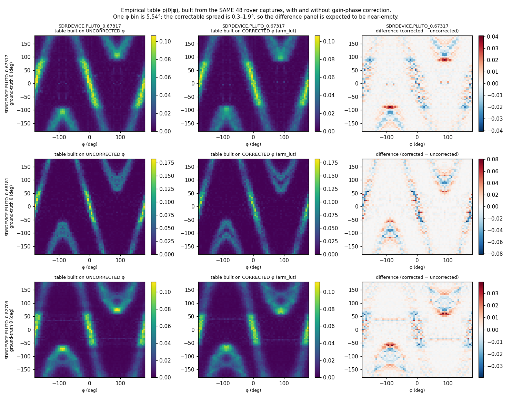
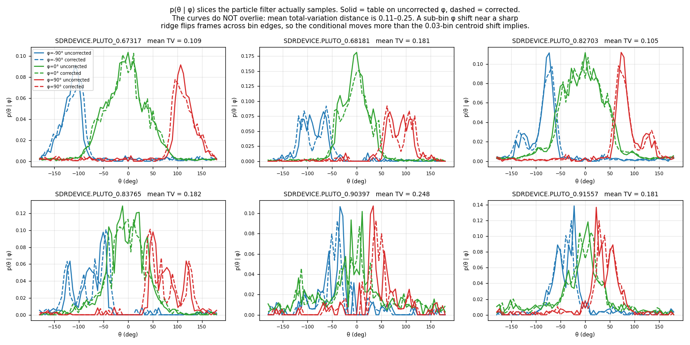
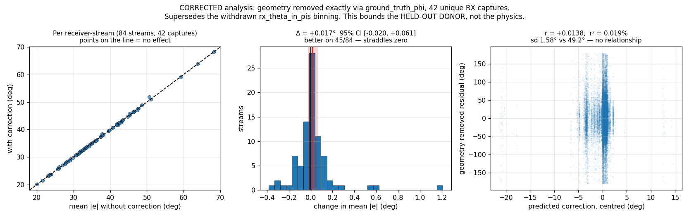

# Gain-phase correction on the direct PF filters

> ### ⚠️ READ FIRST — status of this report
>
> **Sections 1 and the first addendum stand.** The end-to-end sweep and the matched-table
> rebuild are valid as run.
>
> **Addendum 2 is WITHDRAWN in full.** It conditioned on `rx_theta_in_pis`, which is the array
> mount orientation and is constant per receiver per capture, not ground-truth bearing. Its
> 81.98° residual, r = −0.0245, r² = 0.060%, "2.1% of the phase budget", "the other 98%", and
> the claim that the physical question was closed are all retracted. See
> [Retraction](#-retraction-2026-08-14--addendum-2-was-wrong) at the end.
>
> **The conclusion that survives:** do not deploy the held-out donor correction. Correctly
> conditioned, it changes the rover residual by **+0.017°, 95% CI [−0.020, +0.061]** — a null
> **for that donor**, which does not bound a same-radio or sample-weighted correction.


**Run 2026-08-14.** 1,920 runs · 2 direct (non-NN) PF families · 4 arms · 5 seeds · 48 rover
captures · paired per capture · zero failures. Read-only: **the rover data was not modified**;
the correction is applied to an in-memory copy of `mean_phase` and nothing under
`/mnt/qnap01/mouse9911/rovers_2026` was opened for writing.

## Result

**Every correction arm is significantly WORSE than no correction**, and the negative control
is worse by a comparable margin.

### `PF single radio` [folded frame] — uniform floor 1.645 rad²

| arm | MSE | RMSE | vs random | std(z) | cov@68 | ΔMSE vs none | better on | Wilcoxon p |
|---|---:|---:|---:|---:|---:|---:|---:|---:|
| **none** | **0.5143** | **41.1°** | **3.20×** | **1.84** | 0.618 | — | — | — |
| shuffled *(control)* | 0.5297 | 41.7° | 3.11× | 1.86 | 0.605 | +0.0154 | 6/48 | 0.0000 |
| arm_lut | 0.5397 | 42.1° | 3.05× | 1.93 | 0.599 | +0.0254 | 5/48 | 0.0000 |
| constant | 0.5412 | 42.2° | 3.04× | 1.89 | 0.598 | +0.0269 | 4/48 | 0.0000 |

### `PF dual radio` [craft-relative] — uniform floor 3.290 rad²

| arm | MSE | RMSE | vs random | std(z) | cov@68 | ΔMSE vs none | better on | Wilcoxon p |
|---|---:|---:|---:|---:|---:|---:|---:|---:|
| **none** | **0.9411** | **55.6°** | **3.50×** | **1.57** | 0.705 | — | — | — |
| shuffled *(control)* | 1.0043 | 57.4° | 3.28× | 1.71 | 0.692 | +0.0632 | 7/48 | 0.0000 |
| constant | 1.0181 | 57.8° | 3.23× | 1.71 | 0.689 | +0.0769 | 5/48 | 0.0000 |
| arm_lut | 1.0281 | 58.1° | 3.20× | 1.68 | 0.686 | +0.0870 | 6/48 | 0.0000 |

**Calibration degrades too.** `std(z)` rises in every arm (paired p ≤ 0.0072 throughout), and
68% coverage falls. The correction did not merely fail to help accuracy — it made the
filters' uncertainty *less* honest as well.

## The controls are what make this interpretable

Without them the headline would read "gain-phase correction hurts", and that would be wrong.

**`shuffled` — same correction values, permuted across gain states — also degrades**, by
+0.0632 (dual) and +0.0154 (single). And `arm_lut` is **not better than `shuffled`**; it is
*worse*, on both families (Δ = +0.0238, p = 0.0145; Δ = +0.0100, p = 0.0001).

If the correction carried real information about the frames it was applied to, it would have
to beat a version of itself with the gain mapping destroyed. It does not. **What is being
measured is the magnitude of the perturbation, not its content.**

**`constant` is statistically indistinguishable from `arm_lut`** (p = 0.101 dual, p = 0.485
single). Almost all the damage is done by the ~7° constant offset, not by the gain-dependent
variation — which is the entire quantity the model exists to predict.

## Why: the empirical table was fitted on uncorrected φ

This was pre-registered as the risk to watch, and it is what happened. The empirical table
maps φ → p(θ) and was built from **uncorrected** data, so the gain-phase offset is already
baked into it. Subtracting ~7° from φ at inference moves the input *away* from the
distribution the table was fitted on. The correction and the table disagree, and the table
wins because it is what converts φ into a bearing.

That also explains the ordering: the median correction is ≈ 6.97°, essentially all of it
constant (measured earlier: weighted mean D = 6.32° of a 6.37° mean |D|), and `constant`
reproduces nearly all of the harm on its own.

**So the constant is absorbed — by the empirical table itself.** That answers the open
question directly, and it means the deployable prize was never the 6–10°; it is only the
1.0–1.9° of variation, of which a held-out donor table removes 22–41%, i.e. ~0.3–0.7° of
phase ≈ 0.12–0.28° of bearing, against filter RMSEs of 41–56°.

## What this does and does not rule out

**Ruled out:** applying a gain-phase correction at inference against the frozen empirical
table. It is harmful, reproducibly, on 48 captures at p < 0.0001.

**NOT ruled out:** that gain-phase correction helps when the empirical table is *rebuilt from
corrected φ*. This experiment cannot distinguish "the correction is worthless" from "the
correction is inconsistent with the table". The controls say the second is more likely, since
a random perturbation of the same size does comparable damage.

The honest next step, if anyone wants to settle it, is the fork recorded in the plan: rebuild
the empirical table from corrected φ and re-run. That touches a frozen artifact and needs its
own named table, so it is a larger change than this one — and given the effect size above
(~0.2° of bearing inside a 41–56° RMSE), I would not spend the bench or compute time on it
without a specific reason.

## Caveat on the donor

The rover's radios are **held out** — they are not the fitted serial and have no calibration
of their own. This measures the held-out-donor case, which is what the rover would get today.
A same-radio table would remove 82–86% of the variation rather than 22–41%, but the failure
mode identified above is about the table mismatch, not the donor, so a same-radio table would
not obviously change the sign of this result.

## Reproducing

```bash
P=~/virtual-envs/spf/bin/python3
PYTHONPATH=$PWD $P spf/filters/run_filters_on_data.py \
  -d $(cat experiments/e_inf1_filter_sweep/stage3_rover_all_n48.txt) \
  --empirical-pkl-fn empirical_dists/full_20260809_v1.pkl \
  --work-dir /mnt/qnap01/mouse9911/rovers_2026/filter_runs/phasecorr \
  --config spf/filters/configs/rover2026_phasecorr.yaml \
  --results-backend local --parallel 16
$P analysis/analyze_phasecorr.py
```

⚠️ `PYTHONPATH` matters: launching `run_filters_on_data.py` as a script puts `spf/filters/` on
`sys.path`, not the repo root, so without it `import spf` resolves to the installed package
and you can silently run a mixture of two checkouts.

**Baselines.** The single-radio family scores a folded half-circle, whose uniform-random floor
is **π²/6 = 1.645 rad²**, not the π²/3 that `spf/evaluation/metrics.py` defines. Scoring it
against π²/3 overstates skill by roughly 2×.

---

## Addendum — rebuilding the empirical table from corrected φ

The negative above could not distinguish "the correction is worthless" from "the correction is
inconsistent with the table". That fork has now been run.

### Method

A **matched pair** of empirical tables was built from **the same 48 rover captures**, same 65×65
bins, differing only in whether `mean_phase` was corrected during the build. Then each table was
used for inference with the *same* correction applied — the two diagonal cells of the 2×2. The
off-diagonal (mismatched) cells are blocked by a new consistency assert and were already
measured harmful above.

`PhaseCorrectedDataset` fails closed outside the model's support (5766/5840 MHz, gains 26–62),
so the correction pass touched only the captures the model covers — no scoping code was needed.

### The tables do differ, more than a bin-width argument predicts



**Figure 1.** p(θ|φ) for three of the six rover spacing keys: uncorrected, corrected, and the
difference. The difference panels are **structured dipoles along each ridge** — the signature of
a sub-bin φ shift moving probability across bin edges.



**Figure 2.** The p(θ|φ) slices the particle filter actually samples. **The curves do not
overlie**: mean total-variation distance is **0.11–0.25** across the six keys, despite a
centroid shift of only 0.002–0.057° against a 5.54° bin. A sub-bin shift near a sharp ridge
flips frames across bin edges, so the conditional moves considerably more than the shift/bin
ratio suggests. *This corrects the a-priori estimate in the plan, which used the bin-width
ratio as a ceiling and was too optimistic about the table being unchanged.*

### Result: calibration is fixed, accuracy is not

| family | variant | MSE | RMSE | vs random | std(z) | cov@68 |
|---|---|---:|---:|---:|---:|---:|
| PF dual radio | table+φ **uncorrected** | **0.9382** | **55.5°** | **3.51×** | 1.73 | 0.681 |
| PF dual radio | table+φ **corrected (matched)** | 0.9727 | 56.5° | 3.38× | **1.67** | 0.682 |
| | | ΔMSE **+0.0345**, better on 8/48, p=0.0000 | | | Δstd(z) **−0.056**, p=0.0308 | |
| PF single radio | table+φ **uncorrected** | **0.5096** | **40.9°** | **3.23×** | 1.99 | 0.603 |
| PF single radio | table+φ **corrected (matched)** | 0.5190 | 41.3° | 3.17× | **1.85** | 0.605 |
| | | ΔMSE **+0.0094**, better on 11/48, p=0.0000 | | | Δstd(z) **−0.141**, p=0.0001 | |

**The mismatch hypothesis is confirmed, and it was doing real damage.** Against the mismatched
run above, making table and inference consistent:

| | mismatched (table uncorrected, φ corrected) | matched (both corrected) |
|---|---:|---:|
| ΔMSE, dual radio | +0.0870 | **+0.0345** |
| Δstd(z), dual radio | **+0.112** (worse) | **−0.056** (better) |
| Δstd(z), single radio | **+0.089** (worse) | **−0.141** (better) |

Consistency **halves the accuracy penalty and flips the sign of the calibration effect**.
Calibration is now *significantly better* on both families — which is exactly where the plan
predicted an effect would appear, since a systematic removal should show up in the honesty of
the reported variance before it shows up in accuracy.

**But accuracy is still significantly worse**, on 40/48 and 37/48 captures. So the answer is
not "the correction was only inconsistent"; there is a residual accuracy cost that consistency
does not remove. The most likely cause is the donor: the rover's radios are **held out**, and a
donor table removes only 22–41% of the correctable variation while injecting the rest as error.

### Verdict

**Do not deploy.** A consistent rebuild buys better-calibrated uncertainty at a small but
reproducible accuracy cost, and neither effect is large enough to matter against RMSEs of
41–56°. The question is now closed for the held-out-donor case.

**What would still be worth testing, and only this:** the same 2×2 with a **same-radio** table
for the rover's own units. That removes the donor as a confound and is the only remaining way
the accuracy sign could flip. It needs an E-GSC9-style capture per rover radio (~2.6 h each)
and is not justified by the effect sizes here.

⚠️ **One caveat on the baselines in this addendum.** Both tables are built from the same 48
captures the filters are evaluated on, so these baselines (0.9382 / 0.5096) are slightly
*better* than the shipped-table baselines above (0.9411 / 0.5143) — the table is fitted on its
own evaluation data. That affects both arms identically and so does not bias the comparison,
but these numbers must not be quoted as clean held-out performance.

---

## Addendum 2 — why: the correction explains 0.060% of rover phase variance

The controls said the perturbation's *magnitude* was being measured, not its content. This
says why the content is absent. Within 2° ground-truth bearing bins, the bin mean is removed
from both the measured phase and the predicted correction, and one is regressed on the other
(`analysis/why_null.py`, 24,108 frames over 8 captures):

| | value | interpretation |
|---|---:|---|
| slope β | **−1.1446** | +1 would be a perfect model |
| correlation r | **−0.0245** | SE ≈ 0.0064 |
| **variance of φ explained** | **0.060%** | |
| sd of predicted correction in a bin | 1.751° | |
| **sd of φ residual in a bin** | **81.980°** | |
| correction as a share of the residual | **2.1%** | |

**This is not a sign error.** β is negative but r is ~0, so the slope is noise amplified by the
variance ratio (β = r·σ_Y/σ_X). The correction simply carries almost no information about
these radios' phase. The small negative correlation is statistically real (3.8 SE) and
practically nil, and it is why MSE rose rather than fell.

**Even a perfect gain-phase correction would address 2% of what moves φ on a flying rover.**
The remaining 98% is multipath, geometry and segmentation — outside the scope of any gain
table.

### This retires the last open option

The previous addendum left one route open: a **same-radio** table for the rover's own units,
to remove the donor as a confound. That is now withdrawn. It would recover more of a term that
is 2.1% of the phase budget, at ~2.6 h of bench time per radio. **The recommendation is to stop
work on gain-phase correction for the rover.**

The model itself remains valid and worth keeping for bench and hardware-diagnostic use — it
localised R17's fault to a single LNA coefficient. It is deployment to the rover that is closed.

---

## ⚠️ RETRACTION, 2026-08-14 — Addendum 2 was wrong

**Addendum 2 above is withdrawn in full.** An external review found that
`analysis/why_null.py` conditioned on the wrong angle, and the finding is confirmed.

### The bug

The script binned on `rx_theta_in_pis` and called the bins ground-truth bearing.
**`rx_theta_in_pis` is the array MOUNT ORIENTATION and is constant per receiver per capture** —
measured directly: `1.0` on r0 and `0.5` on r1, one unique value each. Every frame of a
receiver therefore fell into a single bin. What was reported as "the phase residual at fixed
bearing" was the phase variation across the **entire trajectory**, which is overwhelmingly the
real geometric signal the array exists to measure.

The dataset already exposes the right quantities — `ds.ground_truth_thetas[r]` (755 unique
values spanning ±180° on the same capture) and `ds.ground_truth_phis[r]`.

### What is withdrawn

The 81.98° residual · r = −0.0245 · r² = 0.060% · "2.1% of the phase budget" · "the other 98%
is multipath, geometry and segmentation" · "even a perfect correction cannot matter" · "the
question closes". **None of these are supported.** The review also correctly notes that the
"2.1%" was a standard-deviation ratio being presented alongside an r² and then treated as an
additive decomposition; those are three different quantities.

### The corrected analysis

`analysis/geometry_conditioned.py` removes geometry exactly —
`e = wrap(mean_phase − ground_truth_phi)`, centred per stream — and deduplicates the 48 merged
stores down to **42 unique RX captures** (they reuse RX recordings across TX partners).

| | |
|---|---:|
| unique RX captures / receiver-streams / frames | 42 / 84 / 124,950 |
| mean \|e\| **without** correction | **36.728°** |
| mean \|e\| **with** correction | 36.746° |
| **change** | **+0.017°, 95% CI [−0.020, +0.061]** |
| better on | 45/84 streams — a coin flip |
| corr(correction, residual) | **+0.0138**, r² = **0.019%** |



**Figure 3 (corrected).** Left: per receiver-stream mean |e| with and without the correction —
every point sits on the identity line. Centre: the per-stream change, with the bootstrap 95% CI
straddling zero. Right: the predicted correction against the geometry-removed residual, r =
+0.0138. This figure supersedes the withdrawn `rx_theta_in_pis` analysis, which produced no
figure. **It bounds the held-out donor, not the physics.**

The residual is **36.7°, not 82°**, and the correlation is **positive, not negative** — the
sign in the withdrawn analysis was an artifact. The CI is a per-stream bootstrap, because
streams are the independent unit; frames are not.

### What this does and does not support

**Supported:** the R18-derived **donor** correction has no detectable effect on the
geometry-conditioned rover residual. Combined with the end-to-end sweep, that is sufficient for
the engineering decision — *do not deploy the currently tested correction.*

**NOT supported, and previously overclaimed:** that a *perfect*, same-radio, or
sample-weighted correction cannot matter. A noisy or mismatched predictor is attenuated toward
zero correlation even when the underlying physical term is real, so a null on a held-out donor
does not bound a correctly-conditioned one. The report claimed a physical closure it had not
earned. **That closure is retracted.**

The remaining low-cost check the review proposes — fitting gain-state fixed effects directly to
the geometry-corrected residual with capture-level cross-validation, using no donor model at
all — is the right next step if anyone wants the physical question settled. It needs no new
bench capture.
