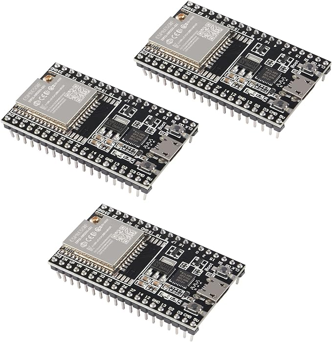
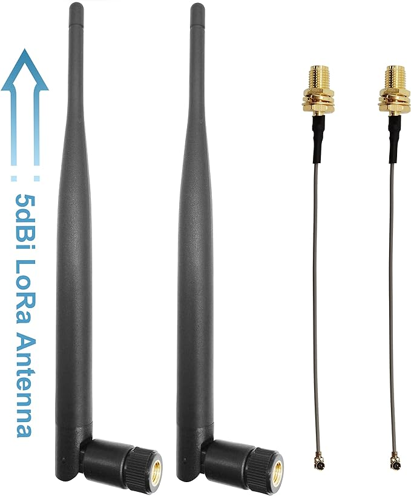
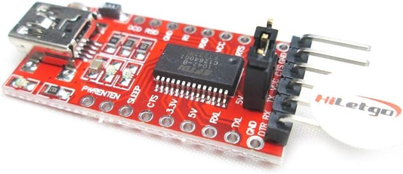
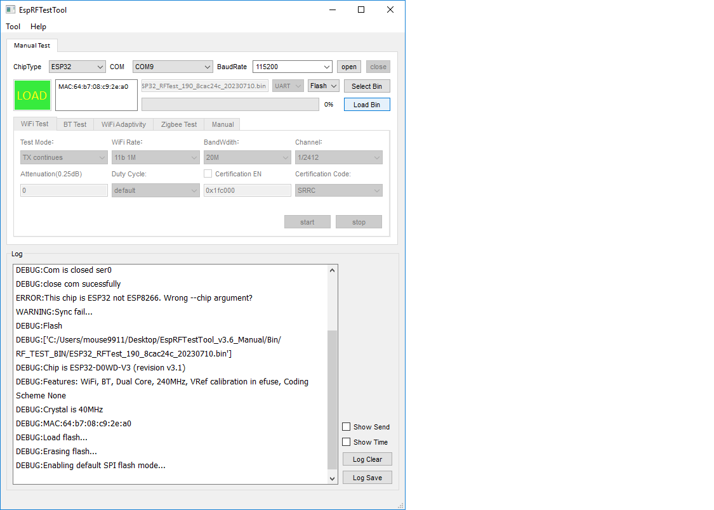
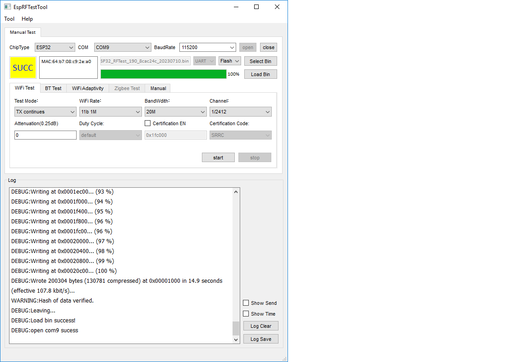
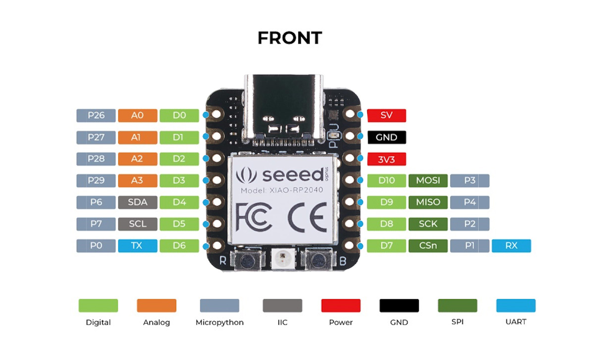

# ESP32 WROOM 32U radio target

Instead of a constant tone target we can use a ESP32 in FCC test mode to emit continous wifi data on a specific channel and duty cycle.

## Construction

 [amazon link](https://www.amazon.com/gp/product/B09Z7MWHSD/ref=ppx_yo_dt_b_search_asin_title?ie=UTF8&th=1)

 [amazon link](https://www.amazon.com/gp/product/B095JTW6XM/ref=ppx_yo_dt_b_search_asin_title?ie=UTF8&psc=1)

 [amazon link](https://www.amazon.com/gp/product/B00IJXZQ7C/ref=ppx_yo_dt_b_search_asin_image?ie=UTF8&psc=1)

## Firmware / ESPTestTool

Download official windows ESPTestTool [link](https://www.espressif.com/en/support/download/other-tools). 

Connect (over USB) to the device, load firmware SP32_RFTest_190 , load to flash, then reboot





## Pin connections



```
XIAO->ESP32 VCC->5v , GND->GND, 7->TX, 6->RX
```

## Testing

```
python sdr_controller.py --fc 2467000000 --receiver-uri usb:2.13.5 --mode rx
```

## Intercepting commands 

Windows -> (USB) -> ESP32
MacOSX -> (USB) -> USB/Serial converted -> (TX/RX/GND) -> ESP32 (TX/RX/GND)

Issue commands for testing and intercept using minicom on laptop,

```
minicom -D /dev/tty.usbserial-A5XK3RJT
# once open , meta key z (esc-z) , A to add line feed
```

```
#TX continous chan1
cbw40m_en 0                                                                                                    
tx_contin_en 1                                                                                                 
esp_tx 1 0 0  
                                                                                 
cmdstop   #STOP                                              
tx_contin_en 0  

#TX continuous chan1 with 30*0.25db attenuation                   
cbw40m_en 0                                                                       
tx_contin_en 1                                                                                    
wifitxout 1 0 30 
                                                                                                 
cmdstop   #STOP                                              
tx_contin_en 0              
               
#TX continuous chan2                                                                                            
cbw40m_en 0                                                                                                    
tx_contin_en 1                                                                                                 
esp_tx 2 0 0      
                                                                                             
cmdstop       #STOP                                                         
tx_contin_en 0         
                     

#TX packet                                                                                                   
cbw40m_en 0                                                                                                    
tx_contin_en 0
esp_tx 1 0 0

cmdstop #STOP

#TX packet with 30*0.25db attenuation  
cbw40m_en 0
tx_contin_en 0
esp_tx 1 0 30 

#TX packet with 30*0.25db atten + 50 % duty cycle
cbw40m_en 0                                                                                                   
tx_contin_en 0
tx_cbw40m_en 0 
RFChannelSel 1 0
cmdstop
FillTxPacket 655410 4 0 0 0 0 1 2 3 4 5 6
target_power_backoff 30
WifiTxStart 655360 0 554 0 0 1 0

#TX packet with 30*0.25db atten + 90 % duty cycle
cbw40m_en 0
tx_contin_en 0
tx_cbw40m_en 0 
RFChannelSel 1 0
cmdstop
FillTxPacket 655462 4 0 0 0 0 1 2 3 4 5 6
target_power_backoff 30
WifiTxStart 655360 0 67 0 0 1 0

cmdstop #STOP

#TX packet with 30*0.25db atten + 10 % duty cycle                                                                                                     
cbw40m_en 0                                                                                                   
tx_contin_en 0                                                                                                
tx_cbw40m_en 0                                                                                                
RFChannelSel 1 0                                                                                              
cmdstop                                                                                                       
FillTxPacket 655410 4 0 0 0 0 1 2 3 4 5 6                                                                     
target_power_backoff 30                                                                                       
WifiTxStart 655360 0 5354 0 0 1 0 

#TX packet with 30*0.25db atten + 90 % duty cycle (channel 12)
cbw40m_en 0
tx_contin_en 0
tx_cbw40m_en 0 
RFChannelSel 12 0
cmdstop
FillTxPacket 655462 4 0 0 0 0 1 2 3 4 5 6
target_power_backoff 30
WifiTxStart 655360 0 67 0 0 1 0

#TX tone
cbw40m_en 0
wifiscwout 1 1 0

wifiscwout 0 1 0 #STOP


#TX packet
esp_tx 1 0 30

```

## Running with companion arduino

[Running FCC test mode](https://youtu.be/tJOxaxYn43A)

[FCC blink](arduino_companion_blink_FCC_code/fcc_blink)

[FCC test](arduino_companion/tx)